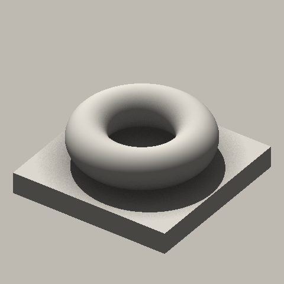
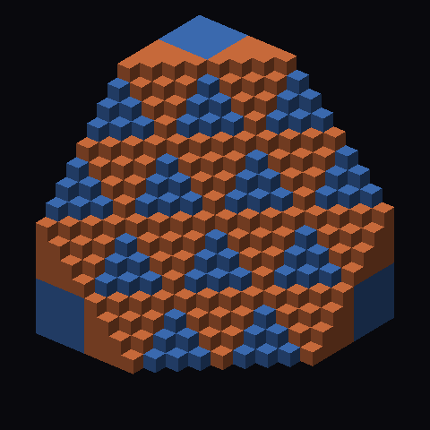
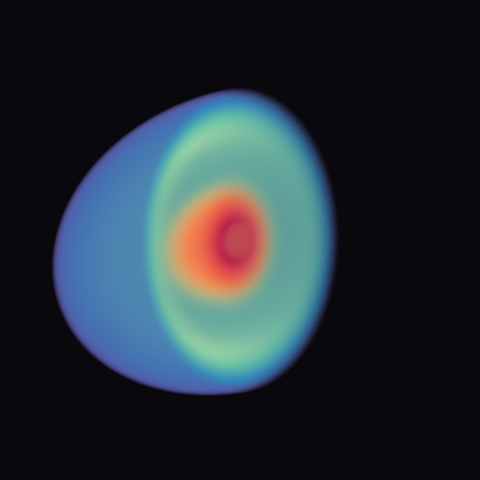
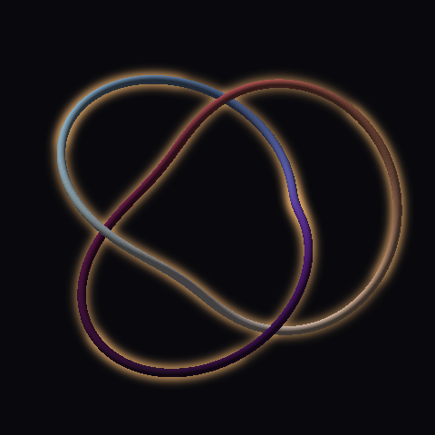

# r3d: a small torch 3D renderer

A small, tested, device-agnostic torch 3D renderer (volumes, isosurfaces, crisp voxels, tubes, meshes), shared by the eight pieces in [`art/ml-art-3d.md`](../../ml-art-3d.md). Every function is a pure function over torch tensors. Marchers take flat rays `(N, 3)`, so the same code handles shadows and ambient occlusion, and thin camera wrappers reshape the results to images. Buffers hold view-axis depth, so volumes, surfaces and tubes composite together.

```python
import sys; sys.path.insert(0, "/home/fzeng/ml/research/art/_shared"); import r3d
```

Python: `/home/fzeng/ml/research/art/.venv/bin/python`. Tests: `cd art/_shared && ../.venv/bin/python -m pytest r3d/tests -q`.

## Conventions

- **Grid.** `data[k, j, i]` is the value at world `(lo[0] + i*hx, lo[1] + j*hy, lo[2] + k*hz)`. Axis 0 = z, 1 = y, 2 = x. `lo`/`hi` are the **centres** of the corner voxels, and `h = (hi - lo) / (n - 1)`. Build grids with `Z, Y, X = torch.meshgrid(z, y, x, indexing="ij")`.
- **World and images.** The world is right-handed with z up. Images are `(H, W, ...)` with row 0 at the top.
- **Depth buffers** hold view-axis depth `z = (p - eye) · forward`, and `inf` means empty. `Camera.t_to_depth` / `depth_to_t` convert to and from ray parameter `t`.
- **Colour.** Colours are floats in `[0, 1]`. Volume (`render_volume`) and additive (`splat_additive`) outputs are **premultiplied**, so composite with `over(rgb, alpha, back)`.
- **Solids.** An iso solid is `field >= level`. A voxel cell is centred on its grid point: cell `i` spans `lo + (i ± ½) h`, so the voxel box reaches half a cell beyond `lo`/`hi`.
- **Clip planes.** `clip = [(point, normal), ...]`. The normal points **into the removed half**, so a point survives when `(p - point) · normal <= 0` for every plane.
- **Meshes.** `marching_cubes(..., closed=True)` pads the grid with the boundary value mirrored about `level` (`min(2*level - v, v)`). Any solid touching the box gets a flat cap exactly **half a voxel outside** `lo`/`hi`, and non-solid boundaries add no cap. Vertices are world `(x, y, z)` and faces wind outward (positive `mesh_volume`).
- **Occluders** are closures `occluded(o, d, tmax) -> bool (N,)` made by `iso_occluder` / `voxel_occluder` and consumed by `hard_shadow` / `ambient_occlusion`.

## Modules

| File | Public API (signature → returns) |
|---|---|
| `camera.py` | `Camera(eye, target, up=(0,0,1), width=512, height=512, fov_deg=None, ortho_height=2.0)`: `fov_deg=None` is orthographic. Methods `.rays(device, dtype) → o, d (H,W,3)`, `.project(pts) → (col,row) (N,2), depth (N,)`, `.t_to_depth`, `.depth_to_t`, `.pixel_scale(depth=None)` (world units per pixel). · `orbit(target, radius, az_deg, el_deg, **cam_kw) → Camera` · `turntable(n_frames, target, radius, el_deg, az0_deg=0, **cam_kw) → [Camera]` · `stereo_pair(cam, separation) → (left, right)` (parallel axes) · `ray_box(o, d, lo, hi) → tnear, tfar` |
| `grid.py` | `sample_grid(data, lo, hi, pts, mode="linear"\|"nearest", padding="zeros") → (...,)` or `(..., C)` for `(C,D,H,W)` data · `clip_keep(pts, clip) → bool` |
| `volume.py` | `TransferFunction(cmap, vmin, vmax, opacity, density=1.0, n=1024)`: `opacity(x)` gets `x = (v - vmin)/(vmax - vmin)` clamped to [0, 1], and extinction per world unit is `density * opacity(x)`. · `lut_tf(rgb (L,3), sigma (L,))` for integer labels · `march_volume(data, lo, hi, o, d, tf, step, *, tmax=None, clip=(), mode="linear", jitter=True, seed=0) → rgb (N,3), alpha (N,)` · `render_volume(data, lo, hi, cam, tf, step, *, depth=None, clip=(), mode="linear", jitter=True, seed=0, device="cpu") → rgb (H,W,3), alpha (H,W)`. `depth` stops rays at an opaque buffer. `jitter` offsets each ray's segment boundaries by a deterministic `u·step` keyed on (ray index, `seed`). Segment lengths still sum exactly to the path, so step-aligned wood-grain and moiré become fine noise; `jitter=False` puts boundaries at `tnear + k·step`. · `over(front_rgb, front_alpha, back_rgb)`. Any `tf(values) → (rgb, sigma)` callable works. |
| `iso.py` | `march_iso(field, lo, hi, o, d, level, step, *, refine=12, clip=(), tmax=None) → t (N,)` (`inf` = miss) · `iso_normals(field, lo, hi, pts, level, *, clip=(), tol=None) → (N,3)` outward, with box and clip faces flat. Within `tol` (default h/4) the nearest of iso surface (`|f-level|/|∇f|`), box faces and clip planes wins, and clip wins ties. · `render_iso(field, lo, hi, cam, level, step=None, *, clip=(), device="cpu") → dict(depth, pos, normal, mask)`, where `step` defaults to `min(h)/2` · `iso_occluder(field, lo, hi, level, step, clip=())` |
| `voxels.py` | `march_voxels(solid, lo, hi, o, d, *, tmax=None, clip=()) → t, normal, cell` (exact Amanatides–Woo traversal, `cell` = (i,j,k), -1 on miss) · `render_voxels(labels, lo, hi, cam, *, solid=None, clip=(), device="cpu") → dict(depth, pos, normal, cell, label, mask)`, where `solid` defaults to `labels > 0` · `voxel_occluder(solid, lo, hi, clip=())` |
| `shade.py` | `lambert(normal, light_dir, ambient=0.2)` · `hemisphere_dirs(n_rays, seed=0) → (n,3)` (cosine-weighted, +z) · `ambient_occlusion(pos, normal, occluded, n_rays=16, radius=1.0, seed=0, bias=1e-4) → (N,)` (1 = open). Each point gets its own deterministic rotation and Cranley–Patterson shift of the stratified pattern, keyed on (point index, `seed`), so the error is per-pixel noise rather than bands; raise `n_rays` to reduce the grain. · `hard_shadow(pos, normal, light_dir, occluded, bias=1e-4, tmax=1e9) → (N,)` (1 = lit, 0 = shadowed or facing away) |
| `tubes.py` | `sample_polyline(P, spacing) → pts, s` (`s` = fractional vertex index) · `splat_spheres(centers, radius, cam, *, attrs=None) → dict(depth, normal, attr, mask)` (z-buffered sphere impostors; `radius` scalar or per point) · `splat_additive(points, cam, *, weight=None, color=None, sigma_px=0.7, depth=None, eps=0.0) → (H,W)` or `(H,W,3)` Gaussian hairlines (premultiplied), depth-tested if `depth` is given · `visible_runs(P, cam, depth, eps) → [array (M,2) pixel xy]` · `write_svg(path, polylines, width, height, stroke="#000000", stroke_width=1.0, background=None)` |
| `mesh.py` | `marching_cubes(field, level, lo, hi, closed=True) → verts (V,3), faces (F,3)` · `mesh_volume(verts, faces)` · `is_watertight(faces)` · `write_stl(path, verts, faces, header="r3d")` (binary) · `read_stl(path) → (F,3,3)` · `tube_mesh(P, radius, n_sides=16, cap=True)` (parallel-transport frame) · `scale_to_mm(verts, size_mm)` (min corner to 0, longest side to `size_mm`) |
| `io.py` | `save_png(path, img)` (clips to [0,1], PNG only) · `glow_tonemap(x, exposure) = 1 - exp(-exposure x)` · `write_film(pattern, mp4, fps=30, gif=None, gif_width=540)` (ffmpeg `%05d` pattern, H.264 yuv420p, optional palette GIF) |

Gotchas:
- `visible_runs` / `splat_additive(depth=...)` test a curve's centre line against a tube depth buffer. A tube hides its own centre line by `R / cos(tilt)`, so use `eps ≈ 3R`. With `eps = R` almost every run vanishes.
- `splat_additive` sums per point. Pass `weight = spacing / cam.pixel_scale()` so line brightness does not depend on the sampling density.
- `march_iso` misses features thinner than `step`.
- Clip planes in `march_volume` are applied per sample, so a cut face is resolved to `step`. At `step=0.01` that is ≈2–3% noise at the clip rim (structured moiré if `jitter=False`); lower `step` for hero plates.

## Honesty rules (spec §0)

- **Declare the chart:** name the map into ℝ³ and its distortion. Prefer meaningful coordinates, and print the captured variance when PCA is unavoidable.
- **Light is not data:** `lambert`, `hard_shadow` and `ambient_occlusion` show form only. Data lives in colour and position.
- **Occlusion hides the interior:** every exterior hero ships with a cutaway or slice plate, and claims about the inside come from slices.
- **Interpolation invents smoothness:** use `render_voxels` for categorical and fractal data. Otherwise declare the interpolation and show a 2× resolution check.
- **Transfer functions are colormaps:** declare the TF (cmap, range, opacity curve, density) in the caption.
- **Render the null through the same function and parameters** as the hero (spec §11.5). If the null looks intricate, the renderer is the fractal.

## Performance

- Everything is chunked (`chunk_samples` / `chunk`), so memory stays bounded for 10⁶–10⁸ samples.
- **CPU is fine for stills up to 512²**, with `OMP_NUM_THREADS=4` / `torch.set_num_threads(4)`. Measured at 480²: iso with 24-ray AO and a shadow in 3.7 s, a 128³ volume at `step=0.01` in 3 s, 16³ voxels in 0.1 s, a 5k-sphere tube with glow and hidden-line SVG in 0.2 s. AO cost scales with `n_rays × radius/step`.
- **GPU** for films and big grids: pass `device="cuda"` and put the grid tensors on the GPU too. Only do this inside a job launched with `setsid nohup /home/fzeng/ml/research/art/_shared/gpu1.sh <cmd...> > log 2>&1 < /dev/null &`. That queue serialises with `autonomous/` and with other art jobs. Never run two GPU jobs at once, and checkpoint frames so a rerun resumes.

## Recipes

Runnable copies are in [`examples/recipes.py`](examples/recipes.py) (`../.venv/bin/python r3d/examples/recipes.py --size 128`). Each assumes `import math, torch, r3d` and `S, OUT = 480, "/tmp"`.

**1. Plaster iso with AO and a hard shadow**
```python
t = torch.linspace(-1, 1, 97)
Z, Y, X = torch.meshgrid(t, t, t, indexing="ij")                       # data[k, j, i] = f(x_i, y_j, z_k)
field = torch.maximum(0.5 - torch.sqrt(X**2 + Y**2 + (Z - 0.1)**2),     # ball resting above a slab;
                      -0.45 - Z)                                       # solid is field >= level
lo, hi, level = (-1,) * 3, (1,) * 3, 0.0
cam = r3d.orbit((0, 0, 0), 5.0, az_deg=35, el_deg=35, width=S, height=S, ortho_height=3.0)
hit = r3d.render_iso(field, lo, hi, cam, level)
m = hit["mask"]
pos, nrm = hit["pos"][m], hit["normal"][m]
occ = r3d.iso_occluder(field, lo, hi, level, 0.01)                     # reused by shadows and AO
light = (-0.4, -0.6, 1.2)
ao = r3d.ambient_occlusion(pos, nrm, occ, n_rays=32, radius=0.5)
sh = r3d.hard_shadow(pos, nrm, light, occ)
lum = (0.3 + 0.7 * r3d.lambert(nrm, light, ambient=0.0) * sh) * (0.4 + 0.6 * ao)   # light shows form only
img = torch.full((S, S, 3), 0.75)
img[m] = torch.tensor([0.93, 0.91, 0.87]) * lum[:, None]
r3d.save_png(f"{OUT}/recipe_plaster.png", img)
```

**2. Crisp voxels with a clip cutaway**
```python
k = torch.arange(24)
Z, Y, X = torch.meshgrid(k, k, k, indexing="ij")
labels = (X // 6 + Y // 6 + Z // 6) % 3 + 1                           # 0 = empty, > 0 = category
lo, hi = (-1,) * 3, (1,) * 3                                           # centres of the corner cells
clip = [((0, 0, 0), (1, 1, 1))]                                        # (point, normal INTO the removed half)
cam = r3d.orbit((0, 0, 0), 6.0, az_deg=40, el_deg=30, width=S, height=S, ortho_height=3.6)
hit = r3d.render_voxels(labels, lo, hi, cam, clip=clip)
m = hit["mask"]
pal = torch.tensor([[0, 0, 0], [0.85, 0.45, 0.25], [0.25, 0.45, 0.75], [0.9, 0.85, 0.6]], dtype=torch.float64)
img = torch.zeros(S, S, 3, dtype=torch.float64)
img[m] = pal[hit["label"][m]] * r3d.lambert(hit["normal"][m], (0.3, -0.5, 1.0), ambient=0.35)[:, None]
r3d.save_png(f"{OUT}/recipe_voxels.png", img)
```

**3. Volume fog composited over opaque tubes**
```python
cam = r3d.orbit((0, 0, 0), 6.0, az_deg=30, el_deg=30, width=S, height=S, ortho_height=3.0)
t = torch.linspace(0, 2 * math.pi, 2001, dtype=torch.float64)
P = torch.stack([torch.cos(t), torch.sin(t), 0.3 * torch.sin(3 * t)], 1)
pts, _ = r3d.sample_polyline(P, 0.005)
tube = r3d.splat_spheres(pts, 0.05, cam)                               # depth = view-axis depth, inf = empty
tm = tube["mask"]
opaque = torch.full((S, S, 3), 0.03, dtype=torch.float64)
opaque[tm] = 0.85 * r3d.lambert(tube["normal"][tm], (0.3, -0.5, 1.0))[:, None]
g = torch.linspace(-1.5, 1.5, 64)
Z, Y, X = torch.meshgrid(g, g, g, indexing="ij")
fog = torch.exp(-(X**2 + Y**2 + Z**2) / 0.5)
tf = r3d.TransferFunction("magma", 0.0, 1.0, opacity=lambda x: x, density=2.0)   # declared transfer function
rgb, a = r3d.render_volume(fog, (-1.5,) * 3, (1.5,) * 3, cam, tf, step=0.02, depth=tube["depth"])
r3d.save_png(f"{OUT}/recipe_fog_tubes.png", r3d.over(rgb, a, opaque))  # premultiplied fog over the tubes
```

**4. Glow hairlines and a hidden-line SVG**
```python
cam = r3d.orbit((0, 0, 0), 6.0, az_deg=25, el_deg=30, width=S, height=S, ortho_height=2.6)
t = torch.linspace(0, 2 * math.pi, 1001, dtype=torch.float64)
curves = [torch.stack([torch.cos(t), torch.sin(t) * math.cos(b), torch.sin(t) * math.sin(b)], 1)
          for b in torch.linspace(0, math.pi, 7)[:-1].tolist()]           # six great circles
spacing = 0.004
pts = torch.cat([r3d.sample_polyline(P, spacing)[0] for P in curves])
glow = r3d.splat_additive(pts, cam, sigma_px=0.8, weight=spacing / cam.pixel_scale())   # line brightness
img = r3d.glow_tonemap(glow, 1.5)[..., None] * torch.tensor([1.0, 0.8, 0.5], dtype=torch.float64)  # ~ independent of spacing
r3d.save_png(f"{OUT}/recipe_hairlines.png", img)
R = 0.02                                                               # occluder: the curves as thin tubes
depth = r3d.splat_spheres(pts, R, cam)["depth"]
runs = [run for P in curves for run in r3d.visible_runs(P, cam, depth, eps=3 * R)]   # eps > R, see README
r3d.write_svg(f"{OUT}/recipe_hairlines.svg", runs, S, S, stroke="#1f1d1b", stroke_width=1.0, background="#f3efe6")
```

## Nulls

`examples/nulls.py` (CPU, about 10 s at 480²) renders analytic objects through the same paths the pieces use. When you change a renderer module, re-run it and look at every image: a smooth object must stay smooth.

 
 

- **Plaster torus** (`render_iso` + `ambient_occlusion` + `hard_shadow`): a torus floating 0.1 above a plinth. It should show a smooth body, a cast shadow and contact darkening under the ring. Fine AO grain is expected; bands, seams or dots along box edges are bugs.
- **Voxel checker** (`render_voxels`, clip `(1,1,1)` through the centre): a 16³ grid of 4³ blocks. It should show crisp cubic faces and a stepped diagonal cut, with nothing interpolated.
- **Spectral split** (`render_volume`, declared TF in `nulls.py`): the field is `v = |x / (0.8, 0.6, 0.45)| - 1`, red inside and blue outside, with a transparent seam and a clip cut. It should show smooth shells and no banding.
- **Knot** (`splat_spheres` + depth-tested `splat_additive` + `visible_runs`): a (2,3) torus knot, coloured by its parameter t (`twilight_shifted`). The plotter version is [`null_plotter_knot.svg`](examples/gallery/null_plotter_knot.svg), and its gaps at the three crossings must agree with the tube occlusion.
