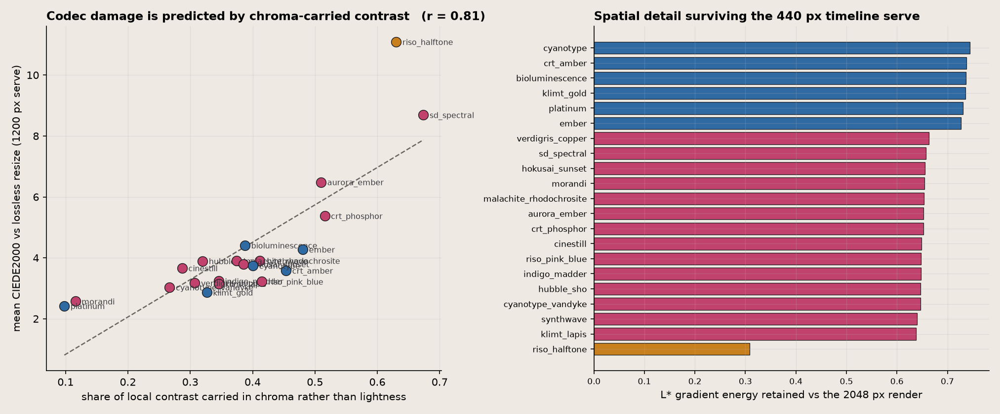
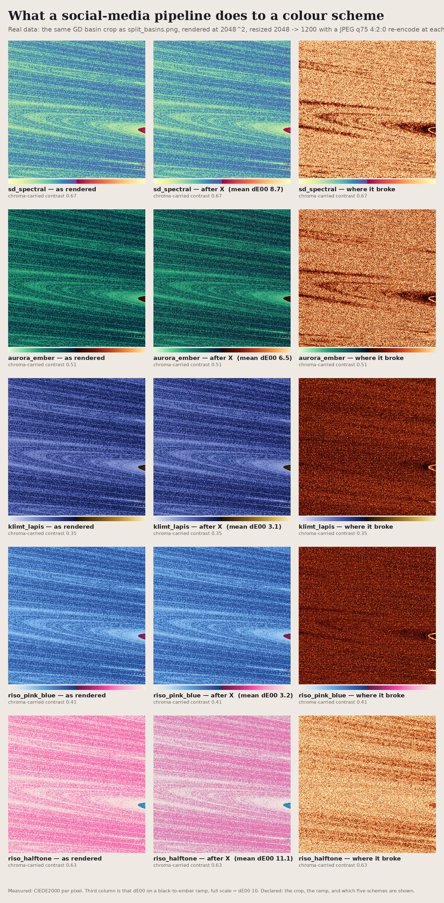

# Does a colour scheme survive being posted?

[COLOR_SCHEMES.md](COLOR_SCHEMES.md) measures each scheme in CAM02-UCS: uniformity, lightness
reversals, greyscale retention, CVD retention. Those say whether a scheme is readable *in principle*.
They say nothing about whether it is still readable after a social platform has re-encoded it.

X/Twitter does three things to an upload, and each attacks a different property:

| stage | what it does | what it attacks |
|---|---|---|
| resize | 4096² render → 2048 (`name=large`) → ~1200 (`name=medium`) → ~440 in-timeline | spatial structure: detail below the new Nyquist is gone, and regular screens alias |
| JPEG 4:2:0 | chroma planes downsampled 2× before quantisation; luminance kept at full resolution | **hue** contrast specifically |
| framing | the image sits on `#000000` (dark mode) or `#ffffff` (light mode) chrome | whether the image has an edge at all |

Stage 2 matters most for this project, because the Sohl-Dickstein split is *designed* to put hue
contrast where lightness contrast is low: the two ramps meet dark-to-dark at the seam and separate
by hue. That is exactly the signal 4:2:0 discards first.

**Hypothesis (H1).** Schemes that carry structure in chroma lose more to the codec than schemes that
carry it in lightness, and the loss is predicted by the chroma-carried-contrast fraction.

## Method

Real data: the same GD initialisation-basin crop used by `split_basins.png`
(`gd-bifurcation/cache/basin_zhu4_z1T_4096.npz`, centre 62 % crop, resampled to 2048²). Each scheme
renders that one field. Each render then goes through the pipeline above, and is compared against
**the identical resize performed losslessly** — so the number isolates what the *codec* cost, not
what the resize cost.

- `chroma_fraction` — share of total Sobel gradient magnitude in CIELAB that lives in (a\*, b\*)
  rather than L\*. Dimensionless, in [0, 1].
- `dE_medium` — mean CIEDE2000 between the served 1200 px image and the lossless 1200 px resize.
- `detail_retained` — L\* gradient energy at the 440 px serve ÷ at the 2048 px render.
- `dark_edge` / `light_edge` — mean CIEDE2000 between the image's outer 8 px frame and the page chrome.

Code: [`twitter_pipeline.py`](twitter_pipeline.py), sheets by
[`render_pipeline_sheet.py`](render_pipeline_sheet.py). Raw numbers in `twitter_pipeline.json`.

## Results

Over 21 renders (14 splits, 6 sequential, 1 halftone riso), codec damage tracks chroma-carried
contrast at **r = 0.81**; restricted to the 14 splits, where every render is the same algorithm on
the same data and only the ramps differ, **r = 0.88**.

| scheme | family | chroma | dE₀₀ @1200 | p95 | detail @440 |
|---|---|---:|---:|---:|---:|
| riso_halftone | riso | 0.630 | **11.09** | 26.1 | **0.308** |
| sd_spectral | split | 0.674 | **8.69** | 24.0 | 0.657 |
| aurora_ember | split | 0.510 | 6.49 | 18.2 | 0.653 |
| crt_phosphor | split | 0.516 | 5.38 | 15.0 | 0.652 |
| … | | | | | |
| klimt_lapis | split | 0.346 | 3.15 | 8.0 | 0.638 |
| riso_pink_blue | split | 0.415 | 3.22 | 8.7 | 0.648 |
| cyanotype_vandyke | split | 0.267 | 3.03 | 7.6 | 0.646 |
| morandi | split | 0.116 | **2.57** | 6.3 | 0.654 |
| platinum | sequential | 0.098 | **2.42** | 5.6 | 0.730 |

A dE₀₀ of 1 is roughly a just-noticeable difference. The spread is therefore **2.4 to 11**, i.e. from
"invisible" to "several JNDs everywhere", decided entirely by the palette.

### The causal control: 4:2:0 vs 4:4:4

Correlation is not the mechanism. Re-running the identical pipeline with chroma subsampling turned
off (4:4:4, same quality 75) isolates how much of the damage is subsampling specifically:

| scheme | chroma | dE₀₀ 4:2:0 | dE₀₀ 4:4:4 | ratio |
|---|---:|---:|---:|---:|
| sd_spectral | 0.674 | 8.69 | 5.72 | **1.52** |
| aurora_ember | 0.510 | 6.49 | 4.89 | 1.33 |
| riso_pink_blue | 0.415 | 3.22 | 2.79 | 1.15 |
| klimt_lapis | 0.346 | 3.15 | 2.87 | 1.10 |
| morandi | 0.116 | 2.57 | 2.44 | 1.05 |

The ratio rises monotonically with chroma fraction, which is the mechanism H1 predicted. But note
the honest reading: **chroma subsampling accounts for only about a third of sd_spectral's damage
(1.52×), not all of it.** Even at 4:4:4 it loses 5.72 against morandi's 2.44. Ordinary JPEG
quantisation also punishes high-chroma high-frequency content. So H1 is supported in direction and
mechanism, but "turn off 4:2:0 and the problem goes away" would be false.

### Spatial survival is a separate axis

`detail_retained` is nearly constant within a family (splits 0.64–0.66, sequential 0.73–0.75): it is
set by the *data* and the render, not the palette. The one exception is decisive —
**halftone riso retains 0.308**, less than half of everything else. A 5 px AM screen is at or past
the Nyquist limit of the 440 px timeline serve, so the screen does not survive; it turns to mush and
takes the image's tonality with it (see the washed-out "after X" tile in the damage sheet).

This is the measured version of an instinct: the flat riso (`riso_pink_blue`, dE 3.22, detail 0.648)
posts cleanly; the halftone riso, which looks better at print size, is the worst performer in the
study on both axes.

### Framing

`mean_L` and the two edge contrasts say how an image sits in a timeline. Cream/paper grounds
(riso_halftone L\* 76, riso_pink_blue L\* 55) have strong edges on dark mode (dE 71 and 50) and weak
ones on light mode (22 and 37) — they glow at night and bleed into a white page. Dark grounds
(synthwave L\* 39, cinestill L\* 39) do the opposite. **No scheme in the catalogue is above dE₀₀ 35
against both chromes**, so an image cannot have a crisp edge in both modes; a border must be drawn
if one is wanted.

## Recommendations for posting

1. **Do not post `sd_spectral` renders as the hero.** It is the reference scheme and the right one
   for a print or a repo README, but it is the single worst performer under the codec (dE 8.7, p95 24).
   `klimt_lapis`, `indigo_madder`, `cyanotype_vandyke` and `verdigris_copper` carry the same split
   semantics at a third of the damage.
2. **Flat riso, not halftone riso.** Same inks, same data; 3.2 vs 11.1 dE and 0.65 vs 0.31 detail.
3. **Crop rather than shrink.** Every split loses ~35 % of its L\* gradient energy getting to 440 px
   regardless of palette. A 2048² crop of the interesting region survives; the whole 4096² field does not.
4. **Pick the ground for the mode you expect.** Paper grounds read best against dark mode.

## Caveats

- X's exact parameters are not published. Quality 75 / 4:2:0 / Lanczos is a commonly reported
  approximation, and the serving sizes are from observed URL variants. The *ranking* of schemes is
  robust to the quality setting; the absolute dE₀₀ values are not.
- `chroma_fraction` treats L\* and (a\*, b\*) as commensurate, which CIELAB only approximately is.
- One data field. The constancy of `detail_retained` within a family suggests the spatial result is
  data-dependent; the chroma result should transfer, but that is untested here.
- The correlation has two high-leverage points (sd_spectral, riso_halftone). The splits-only
  fit (r = 0.88, n = 14) excludes the halftone and is the more conservative number.

## Audit of the real gallery images

The study above uses one controlled field so that only the palette varies. That is the right design
for isolating the palette, and the wrong design for deciding what to post. `audit_candidates.py`
runs the same metrics over 19 actual gallery PNGs.

**Two caveats on reading it.** `detail_retained` is *not* comparable across these rows: the source
images have different native resolutions (900 px to 6144²), and the metric is a per-pixel gradient
ratio between a 440 px and a 2048 px image, so it only means something when every input starts at
the same size and carries the same data. Within the controlled study it is valid; here it is not,
and it is omitted below. `dE_medium` is a same-size comparison and stays valid.

| image | chroma | dE₀₀ @1200 | L\* | dark edge | light edge |
|---|---:|---:|---:|---:|---:|
| basin_wide_spectral | 0.711 | **0.75** | 70.5 | 62.9 | 34.9 |
| roofline_night | 0.187 | **0.66** | 5.4 | 2.8 | 97.9 |
| hero_float16_c1_rivers | 0.486 | 0.77 | 2.8 | 1.5 | 97.6 |
| specimen_plotter | 0.070 | 0.97 | 90.9 | 93.7 | 4.4 |
| divergence_texts_feynman_paper | 0.332 | 1.46 | 92.1 | 91.3 | 6.7 |
| hero_riso_lyapunov | 0.464 | 1.53 | 89.8 | 94.3 | 5.8 |
| lyap_z3_shrimp_verdigris | 0.467 | 2.04 | 42.9 | **43.8** | **45.2** |
| lyap_z3_shrimp_spectral | 0.680 | 2.73 | 60.6 | 61.1 | 35.1 |
| hero_deep_swirl_spectral_print | 0.733 | 3.08 | 63.5 | 62.6 | 34.8 |
| story_tp256_glass | 0.617 | 3.30 | 22.2 | 2.2 | 95.8 |
| hair_diptych_N256 | 0.730 | 3.93 | 9.7 | 5.7 | 95.7 |
| basin_wide_riso | 0.567 | 4.43 | 80.0 | 68.0 | 22.6 |
| hero_sd_idle_zoom_riso | 0.518 | 4.60 | 90.3 | 87.0 | 7.3 |
| hero_deep_swirl_riso_print | 0.592 | **6.24** | 73.5 | 68.7 | 21.2 |

### This corrects recommendation 1 above

The controlled study says `sd_spectral` is the worst palette, and I expected the big Spectral heroes
to suffer. **They do not.** `basin_wide_spectral` is the *best* performer in the whole audit
(dE 0.75) despite the highest chroma fraction in it, and `hero_deep_swirl_spectral_print` (3.08)
beats its own riso sibling (6.24) by 2×.

The reason is that chroma fraction alone was never the mechanism — chroma at *high spatial
frequency* is. The controlled field is a fractal basin edge whose chroma varies pixel-to-pixel, so
4:2:0 mangles it. The deep-swirl and basin-wide heroes are smooth marbled fields: their chroma
varies slowly, survives the halved chroma planes almost intact, and compresses well. The riso
renders of the same data are *worse* precisely because their paper grain adds the high-frequency
chroma texture the codec hates.

So the operative rule is **not** "avoid Spectral". It is:

> Damage is driven by high-frequency chroma texture. Smooth fields post well in any palette. Grain,
> halftone screens, and fractal edge detail are what the codec destroys — and adding riso grain to a
> smooth field makes it post *worse*, not better.

Recommendation 1 should be read as applying to fractal-edge renders (where it was measured), not to
smooth fields. Recommendation 2 (flat over halftone riso) still holds; recommendations 3 and 4 are
unaffected.

### Framing is the sharper constraint

The edge columns split the gallery cleanly in two, and nothing sits in both camps:

- **Vanishes on dark mode** (dark edge < 6): `roofline_night`, `hero_float16_c1_rivers`,
  `nautilus_float16_observatory`, `story_tp256_glass`, `hair_diptych_N256`, `frontier_N100_poster_spectral`.
  These are near-black grounds (L\* 3–22); on a dark timeline they have no boundary at all.
- **Bleeds on light mode** (light edge < 8): `specimen_plotter`, `hero_riso_lyapunov`,
  `divergence_texts_feynman_paper`, `frontier_N100_poster_riso`, `hero_sd_idle_zoom_riso`,
  `riso_mp_vs_esd`. These are paper grounds (L\* 83–92).

`lyap_z3_shrimp_verdigris` is the only image in the audit that is legible against both
(43.8 / 45.2), which is an argument for mid-lightness grounds when the mode is unknown.
