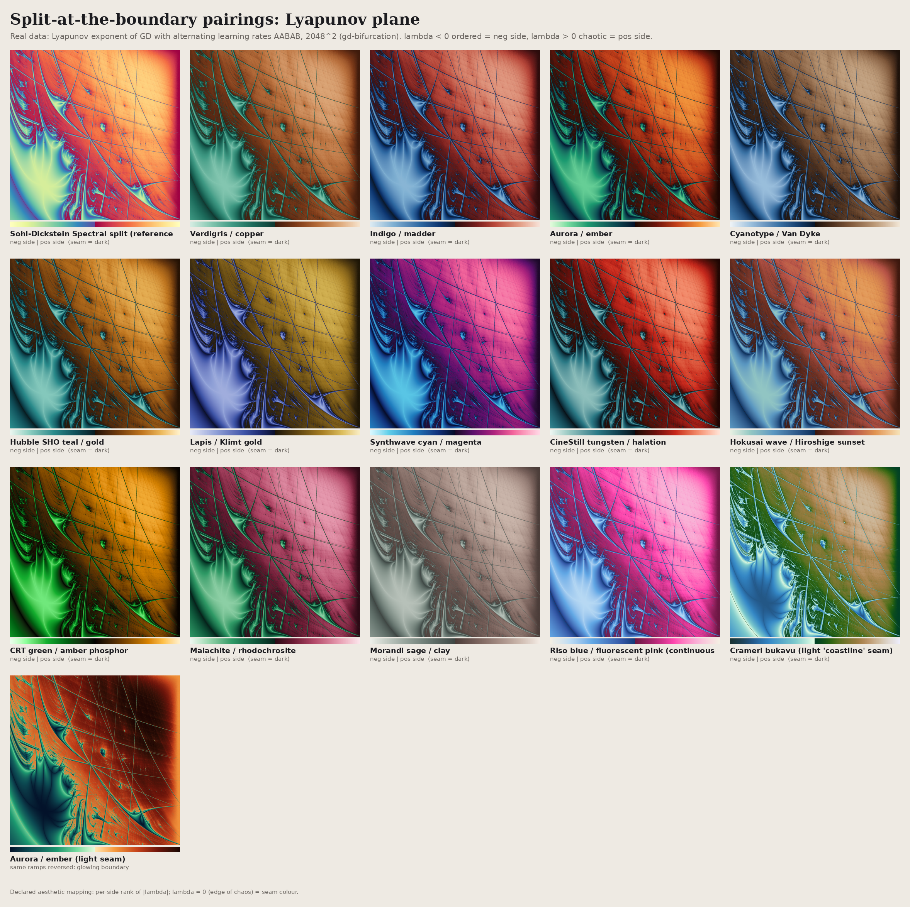
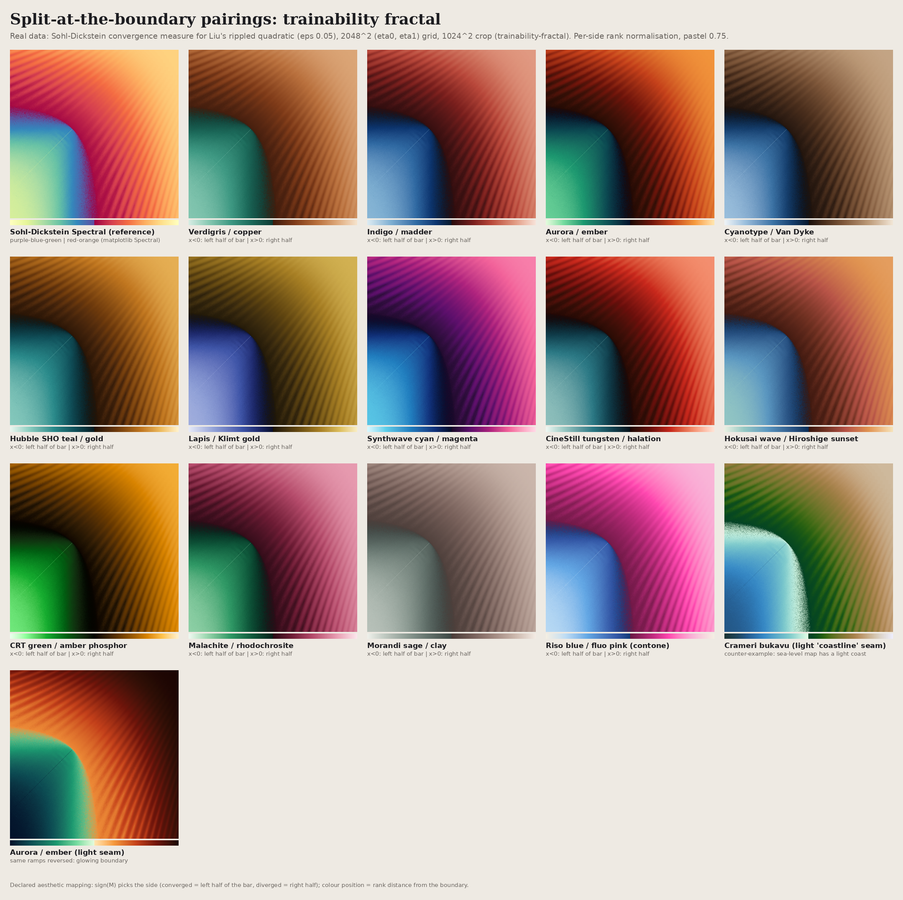
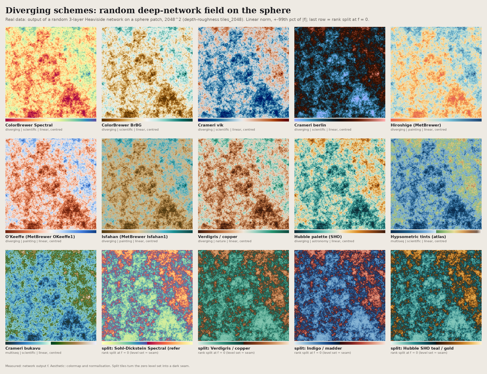
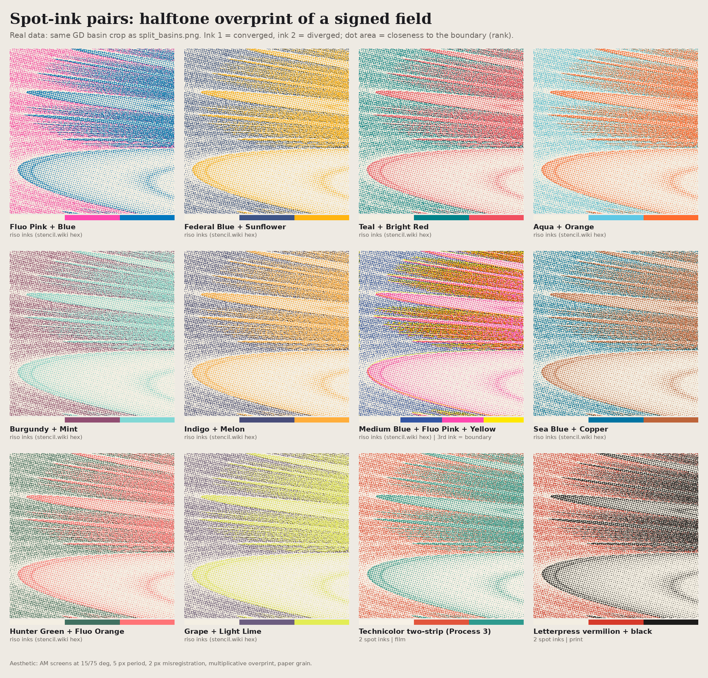
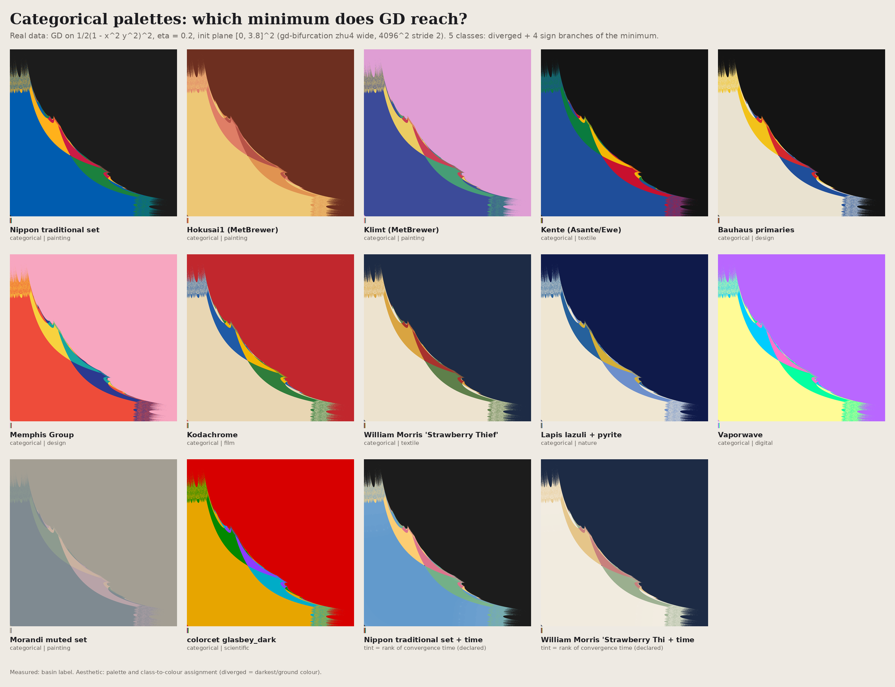

# Colour research: 73 schemes and 15 boundary splits, tested on real data

The Sohl-Dickstein Spectral split generalises well beyond Spectral. Any two ramps that start dark at the boundary and end pale, with different hues on the two sides, draw a fractal edge as a dark seam.

- **Does it survive being posted?** [PIPELINE.md](PIPELINE.md) measures every scheme through a
  social-media image pipeline (resize + JPEG 4:2:0). Codec damage tracks how much contrast a scheme
  puts in chroma rather than lightness (r = 0.88 over the 14 splits), which makes the Sohl-Dickstein
  Spectral split the *worst* performer of the catalogue at dE00 8.7.
- **Catalogue:** [COLOR_SCHEMES.md](COLOR_SCHEMES.md) lists hex stops, type, measured CAM02-UCS lightness, uniformity and CVD diagnostics, what each scheme suits, and its lineage and sources. It also analyses why the Spectral split works.
- **Module:** [palettes.py](palettes.py). Tests are in `test_palettes.py`: CIEDE2000 against Sharma test pairs, and a reproduction of Sohl-Dickstein's `cdf_img` plus Spectral to within 4/255.

```python
import sys; sys.path.insert(0, '/home/fzeng/ml/research/art/color-research')
import palettes as P                       # registers 'art.<name>', 'art.<name>_r', 'art.split.<pairing>'
plt.imshow(x, cmap='art.aizome')
rgb = P.render_split(M, 'aurora_ember', near_boundary='large')   # trainability measure (slow runs sit at the edge)
rgb = P.render_split(lam, 'hubble_sho', near_boundary='small')   # Lyapunov exponent, f - c, level sets
cm = P.split_cmap(['#08192d', '#2f6aa3', '#dcebf2'], 'art.madder'); v = P.signed_rank_normalize(x)  # custom
P.metrics('cyanotype'); P.simulate_cvd(rgb); P.rgb_to_cam02ucs(rgb)
```

## Sheets (all real data, read-only from other projects)



*Lyapunov exponent of GD with alternating learning rates, from gd-bifurcation. λ<0 and λ>0 are each rank-normalised onto one ramp, and λ=0 is the seam. Declared aesthetic mapping.*



*Sohl-Dickstein convergence measure for Liu's rippled quadratic, from trainability-fractal, same 15 pairings plus a light-seam variant.*



*Random deep-network field on a sphere patch, from depth-roughness. Eleven diverging maps use a centred linear norm. The last four tiles are rank splits at f=0, which turn the zero level set into a seam.*



*Twelve spot-ink pairs, halftone overprint of the same signed GD basin field. Ink 1 = converged, ink 2 = diverged; dot area = closeness to the boundary. See [PIPELINE.md](PIPELINE.md) for why the flat riso split posts better than this halftone does.*



*Which minimum does GD reach? Fourteen categorical palettes on the five outcome classes.*

Rebuild the sheets with `python render_sheets.py all`, which renders all ten: `split_train`, `split_basin`, `split_lyap`, `sequential`, `spectrogram`, `diverging`, `cyclic`, `categorical`, `riso`, `profiles`.

Nine are reviewed and shipped. **`spectrogram` (`sequential_spectrum.png`) is still not usable.** Its dB window has been corrected from [-110, 0] to [-120, -40], which fixes the muddiness, but the tiles remain near-flat for a reason the window cannot fix: the sigma-delta idle tones are 1 px line structure, and the sheet downsamples the full spectrum into 440 px tiles, so the lattice falls below Nyquist and disappears. It needs a native-resolution crop instead of a resize — the same lesson [PIPELINE.md](PIPELINE.md) measures for posting. Until then, use `hardware/dither`'s own full-size renders.

## Recommendations

| data | first choices | why |
|---|---|---|
| signed converge/diverge, λ, f−c (split) | `aurora_ember`, `indigo_madder`, `hubble_sho`, `klimt_lapis`, `sd_spectral` | dark seams stay under L* 25 and the pastel ends are far apart in hue. `hubble_sho` and `indigo_madder` are the most robust for colour-blind viewers. |
| symmetric diverging (random fields) | `crameri_vik`, `brewer_brbg`, `verdigris`, `hubble_sho`, `crameri_berlin` (dark centre) | one clean lightness peak each, uniform, and good under deuteranopia (0.92–0.95 retention) |
| sequential density on dark (bifurcation, spectra) | `klimt_gold`, `bioluminescence`, `ember`, `crt_amber`, `cmc.lajolla` | monotone lightness from near black; the curated ramps are uniformised in CAM02-UCS |
| sequential on paper / archival | `cyanotype`, `platinum`, `vandyke`, `nippon_aizome` | carried almost entirely by lightness (greyscale retention 0.83–0.99), so they print well |
| cyclic phase | `cmc.romaO`, `verdigris_cyclic`; `shibori_cyclic` only for axial (mod π) data | |
| categorical basins | `lapis`, `bauhaus` (colour-blind safe); `nippon_categorical`, `kente` (use outlines) | |
| 2-ink riso | Federal Blue + Sunflower, Indigo + Melon (colour-blind safe); Fluo Pink + Blue (classic, fails under protanopia: dE 4) | |

## Surprises (measured)
- **colorcet `fire`** has a CAM02-UCS speed CV of 1.27. Its yellow-to-white top end moves fast, so the brightest densities compress into a white plateau.
- **Crameri `oslo`** has a speed CV of 0.44 in CAM02-UCS: its near-black start is slow.
- **Landsat false colour** looks uniform but has 2 lightness reversals. Its red is darker than the preceding pink, so it bands.
- **Spectral** is only moderately uniform (CV 0.38). Its green-yellow segment is fast.
- On Lyapunov planes the earthy pairs (`verdigris_copper`, `cyanotype_vandyke`) looked better than the saturated ones. The chaotic side's fine grid of stable lines reads as veins.
- The **light seam** (`seam='light'`) on basins and Lyapunov planes turns the boundary into a glowing wire and is a strong variant in its own right.

## Caveats
Rank normalisation is ordinal, so colours are not comparable across images unless you pass `ref=`. Film, painting and nature ramps are curated evocations, not standards (see the honesty labels in the catalogue). The CVD numbers come from a simulation (Machado 2009, severity 1), not from user testing.
