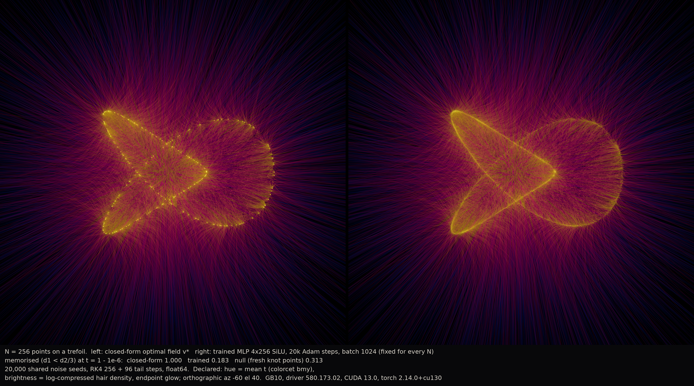

# Combed: flow-matching trajectories and memorisation

*A flow-matching model carries Gaussian noise to a trefoil knot along an ODE. The exactly optimal field for N training points combs the noise into N tight tufts; a trained network, once N is large enough, combs it into the knot instead.*

<video src="gallery/film_N_sweep.mp4" autoplay loop muted playsinline width="100%"></video> 
film_N_sweep.mp4 (25 s, 1064&times;584; <a href="gallery/film_N_sweep.gif">GIF</a>): N = 16, 64, 256, 1024, 4096, hard cuts, same shared seeds and camera (slow continuous rotation). Left panel closed-form v*, right panel trained MLP. Each segment prints the memorised fraction for both fields and the fresh-knot null for that N.

## The phenomenon

A flow-matching model transports Gaussian noise to data along an ODE, x0 ~ N(0, I) at t = 0 to a data point at t = 1. For a *finite* training set of N points, the exactly optimal velocity field has a closed form (Bertrand, Gagneux, Massias & Emonet, arXiv:2506.03719, Prop. 1 / eq. 6):

û\*(x, t) = Σᵢ λᵢ(x, t) (x⁽ⁱ⁾ − x) / (1 − t),  λ = softmax_j(−‖x − t x⁽ʲ⁾‖² / (2(1 − t)²))

This field only reproduces training points: every trajectory ends at (or extremely near) one of the N data points, because as t → 1 the softmax weights collapse onto the nearest one. The same fact holds for diffusion models (Gu et al., "On Memorization in Diffusion Models", TMLR 2025, arXiv:2310.02664; Scarvelis, Borde & Solomon, "Closed-Form Diffusion Models", arXiv:2310.12395). But **trained networks generalise once the data set is large enough** — Kadkhodaie, Guth, Simoncelli & Mallat (ICLR 2024, arXiv:2310.02557) observed the switch from memorisation to generalisation at N ≈ 10³–10⁴ on 80×80 faces. In ℝ³, with a trefoil knot as the data manifold, the whole flow — and the switch — can be seen at once: a trained MLP's trajectories, instead of collapsing to N points, spread along the knot.

## The pieces

All renders read only `cache/` (closed-form and trained dense RK4 trajectories, `t ∈ [0, 1 − 10⁻⁶]`) and draw with `art/_shared/r3d`. Declared chart throughout: identity map of ℝ³ (data coordinates = noise coordinates), orthographic camera, az −60° el 40° unless noted. Stack: GB10, driver 580.173.02, CUDA 13.0, torch 2.14.0+cu130.

**Hero — hair diptych.** [`hair_diptych_N256.png`](gallery/hair/hair_diptych_N256.png) — also at N16, N64, N1024, N4096 in the same directory. Measured: all 20,000 shared noise seeds run through both fields (RK4, 257 + 96 tail steps to t = 1 − 10⁻⁶), endpoints, and the memorised fraction (d1 < d2/3) with the fresh-knot null for that N. Declared: hue = density-weighted mean t (colorcet `bmy`), brightness = log-compressed hair density (so outer hairs and the dense core are both visible), separate endpoint glow, black ground. N = 16/64 show discrete tufts on the left panel that the right panel (trained) never fully reproduces; by N = 4096 the closed-form panel has become an almost continuous knot too — a consequence of the declared integration stop, not of the field (see Caveats and Verification).

**Film — the N sweep.** [`film_N_sweep.mp4`](gallery/film_N_sweep.mp4) ([GIF](gallery/film_N_sweep.gif)). Same construction as the hero, at N = 16, 64, 256, 1024, 4096 in sequence, hard cuts between N (flows are never interpolated across N), camera continuously and slowly rotating (az −60° → +60° over the whole film) so the same camera pattern applies to every segment. For frame-rate budget each frame shows 4,000 of the shared 20,000 seeds (declared; the static diptychs above show all 20,000). 50 frames per N at 10 fps (25 s total, 1064 px wide).

**Tube hero.** [`tubes_dark_mlp_N1024.png`](gallery/tubes/tubes_dark_mlp_N1024.png) — also plaster/dark, closed/mlp, N64/N1024, exterior/cutaway (16 images) in the same directory. Measured: the first 400 of the 20,000 shared seeds as tubes (r 0.0075) with endpoint spheres (r 0.022) at t = 1 − 10⁻⁶; the printed memorised fraction and null use all 20,000. Declared: plaster = matte off-white tubes, terracotta endpoints, one raking Lambert light (form only, no AO/shadow); dark = hue = t (colorcet `bmy`), warm-white endpoints; cutaway removes every sample on the camera side of the plane through the origin facing the camera.

**Plotter SVG.** [`plotter_closed_N64.svg`](gallery/plotter/plotter_closed_N64.svg) — also closed/mlp &times; N64/N1024 (4 SVGs + PNG previews) in the same directory. Measured: 2,000 trajectories, hidden-line rendering against a tube depth buffer (occluder radius max(0.004, 2.5 px), eps = 10&times;r). Declared: only t ≥ 0.5 is drawn — the full-length hairs are a uniform starburst that hides the knot; runs shorter than 3 px are dropped.

**Basin companion.** [`basin_R256_cutaway.png`](gallery/basin/basin_R256_cutaway.png), its null [`basin_null_voronoi_R256_cutaway.png`](gallery/basin/basin_null_voronoi_R256_cutaway.png), and [`basin_slices_R256.png`](gallery/basin/basin_slices_R256.png) — also at R128 and without the cutaway, in the same directory. Measured: every noise voxel of a 128³/256³ grid in [−2.5, 2.5]³ labelled (crisp voxels, nearest, no interpolation) by the training point (N = 16) its closed-form flow reaches at t = 1 − 10⁻⁶; the null repeats the identical render path on the Voronoi cell of the noise point itself (piecewise-planar, D = 2 exactly). Declared: categorical palette colorcet `glasbey_category10` in training-index order, one Lambert light at ambient 0.5 (form only), octant cutaway (x > 0, y < 0, z > 0), training points as spheres in their basin colour. The basin sheets are curved, not planar (76.6% voxel agreement with the planar null) — see Verification for the box-count.

**Cross-eye stereo.** [`hair_stereo_crosseye_closed_N64.png`](gallery/stereo/hair_stereo_crosseye_closed_N64.png), [`hair_stereo_crosseye_mlp_N1024.png`](gallery/stereo/hair_stereo_crosseye_mlp_N1024.png). Same glow construction as the hero. Declared: **rotation stereo** — the two eye views orbit the target at az −60° ∓ 2.5°, because an orthographic camera has no parallax under a sideways shift (`r3d.stereo_pair`); right-eye view on the left, for cross-eye viewing.

**Verification plate.** [`basin_boxcount.png`](gallery/verify/basin_boxcount.png). 3D box counting of the basin label boundary (6-neighbour sign change), basins vs. the planar-Voronoi null, at 128³ and 256³, with local slopes; see Verification below.

## What was computed

| Step | Where | Wall clock |
|---|---|---|
| M1: closed-form + trained fields, sampling, unit tests, memorisation numbers (all reused, not recomputed for M3) | CPU, ≤ 4 threads | ≈ 80 min total (see `combed-M1.md`) |
| M2: dense RK4 trajectories (10 fields), N = 16 basin volumes (128³, 256³), box counting, SVGs, heroes (all reused) | GPU (`gpu1.sh`) for dense N ≥ 64 and basins; CPU for N = 16 dense and all M2 heroes | closed-form dense 2–117 s, MLP dense ≈ 35 s each; basin 83 s (128³) / 656 s (256³); heroes chain 689 s total (see `combed-M2.md`) |
| M3: caption re-flow — new floor in `render_common.caption_strip` (font ≥ 1.4% of final image height, 1.6% safety margin), re-rendered tubes and basin images | CPU, 4 threads | tubes (16 images) 35 s; basin R=128 (5 images) 13 s; basin R=256 (5 images) 21 s |
| M3: film (`render_film.py`), 250 frames (5 N &times; 50), panel 520 px, 4,000 of 20,000 seeds/frame, camera rotating az −60→+60° | CPU, 4 threads | ≈ 7.3 s/frame → ≈ 30 min total; `ffmpeg` encode a few seconds |

## Verification

- **Continuity equation** (M1): a finite-difference check that v\* transports the Gaussian-mixture density (∂ₜp + ∇·(pv) = 0) at 20 random (x, t), float64, h = 1e-5. Worst relative residual 9.5×10⁻⁸ against a 1×10⁻⁴ threshold.
- **Step doubling** (M1): 256 vs. 512 RK4 steps, all 20,000 seeds, raw endpoint. Max gap 3.1×10⁻³–1.4×10⁻² (closed-form), 4.6×10⁻³–2.8×10⁻¹ (MLP, one seed flips basin at N = 16); p99.9 ≤ 3.9×10⁻³ everywhere. An order check on the worst and random 256 seeds at 1024/2048 steps shows the MLP converged by 512 steps; the closed-form field converges more slowly near t → 1 (softmax sharpens like 1/(1−t)²), but the residual (≤ 5×10⁻⁴) is far below the render scale (≈ 2).
- **t → 1 check**: both fields were continued from the declared stop t = 1 − 10⁻³ to t = 1 − 10⁻⁶ with 96 RK4 steps geometric in (1 − t) (checked against 192; max gap 7×10⁻⁹ closed-form, 4×10⁻¹³ MLP). All renders use the t = 1 − 10⁻⁶ run. This matters: at the coarser stop the closed-form field's declared residual width (10⁻³) exceeds the training-point spacing at N ≥ 1024 (2.9×10⁻³ at N=1024, 8.3×10⁻⁴ at N=4096), so its endpoint blends neighbours and reads as *not* memorised. At t = 1 − 10⁻⁶ the closed-form field memorises 99.8–100% at every N (table below).
- **Memorised fraction vs. N**, at the render stop t = 1 − 10⁻⁶, d1 < d2/3 criterion (Gu et al., after Yoon et al. 2023), with the fresh-knot null (20,000 points freshly sampled on the continuous trefoil, same criterion, same pipeline):

  | N | 16 | 64 | 256 | 1024 | 4096 |
  |---|---|---|---|---|---|
  | closed-form v\* | 1.000 | 1.000 | 1.000 | 0.998 | 0.998 |
  | trained MLP | 0.704 | 0.434 | 0.183 | 0.049 | 0.005 |
  | null (fresh knot points) | 0.263 | 0.367 | 0.313 | 0.333 | 0.345 |

- **Basin box counting** ([`basin_boxcount.png`](gallery/verify/basin_boxcount.png)): boundary voxels of the N = 16 basin labels (6-neighbour sign change), boxes of side ε = 1–16/1–8 voxels, at 128³ and 256³. Fitted D = 2.13 (256³) / 2.16 (128³); the planar-Voronoi null through the identical pipeline gives D = 2.10 / 2.13. The fit spans **1.2 decades** (larger boxes saturate — local slope rises toward 3), short of spec §11's two-decade target; this is declared on the plate and on the basin captions. Boundary voxel count scales 4.11× from 128³ to 256³ (a surface gives ≈4, a volume ≈8). Conclusion: the basins are curved sheets, statistically indistinguishable in dimension from the planar null. **No fractal claim.**

## Caveats

- **The Gu et al. criterion misfires on a 1D manifold.** It was designed for high-dimensional image manifolds, where a nearest/second-nearest distance ratio below 1/3 is a strong memorisation signal. On a 1D curve embedded in ℝ³, a *perfect generaliser* — 20,000 fresh points on the same continuous knot — still trips the criterion 26–37% of the time (the null column above). Every memorised-fraction number in this piece is printed beside that null for this reason.
- **Width and step budget are fixed, not swept.** Every trained MLP is the same architecture (4×256, SiLU, 207,363 parameters) trained for the same 20,000 Adam steps regardless of N. The memorisation onset seen here (70% → 0.5% as N goes 16 → 4096) is a property of *this* capacity/budget pair, not of N alone; spec §8's pitfall explicitly warns against attributing capacity effects to N.
- **The trained fraction falls below the null from N ≈ 256 on** — not because the MLP generalises "better than fresh sampling," but because its samples form a knot thickened by ≈5×10⁻³ (median distance to the continuous knot, roughly constant across N, set by the training loss's excess error 0.005–0.026). Once that blur exceeds the training-point spacing, the d1<d2/3 criterion reads "not memorised" for *blurred-along/off-the-knot* samples, which is a different thing from "new points exactly on the knot."
- **The ortho stereo pairs rotate the view rather than shift it.** An orthographic camera has zero parallax under a sideways translation, so the stereo pairs here are rotation stereo (the two eye cameras orbit the target at az ∓2.5°) rather than a true parallel-axis stereo pair.

## References

- Bertrand, Q., Gagneux, A., Massias, M. & Emonet, R. "On the Closed-Form of Flow Matching: Generalization Does Not Arise from Target Stochasticity." arXiv:2506.03719.
- Gu, X., Du, C., Pang, T., Li, C., Lin, M. & Wang, Y. "On Memorization in Diffusion Models." TMLR 2025. arXiv:2310.02664.
- Scarvelis, C., Borde, H. S. de O. & Solomon, J. "Closed-Form Diffusion Models." arXiv:2310.12395.
- Kadkhodaie, Z., Guth, F., Simoncelli, E. P. & Mallat, S. "Generalization in diffusion models arises from geometry-adaptive harmonic representations." ICLR 2024. arXiv:2310.02557.

---
See `NOTES.md` for the full decision log, resume commands and cache layout. Compute reports: `docs/superpowers/plans/reports/combed-M1.md`, `combed-M2.md`, `combed-M3.md`.
