# Depth as the Dial

**Infinitely wide random Heaviside networks draw coastlines on the sphere, and every extra layer makes them rougher: fractal dimension 2 − 2<sup>−L</sup>. Smooth activations never do this, and finite networks only fake it down to a scale of about 4/width.**

<p align="center">
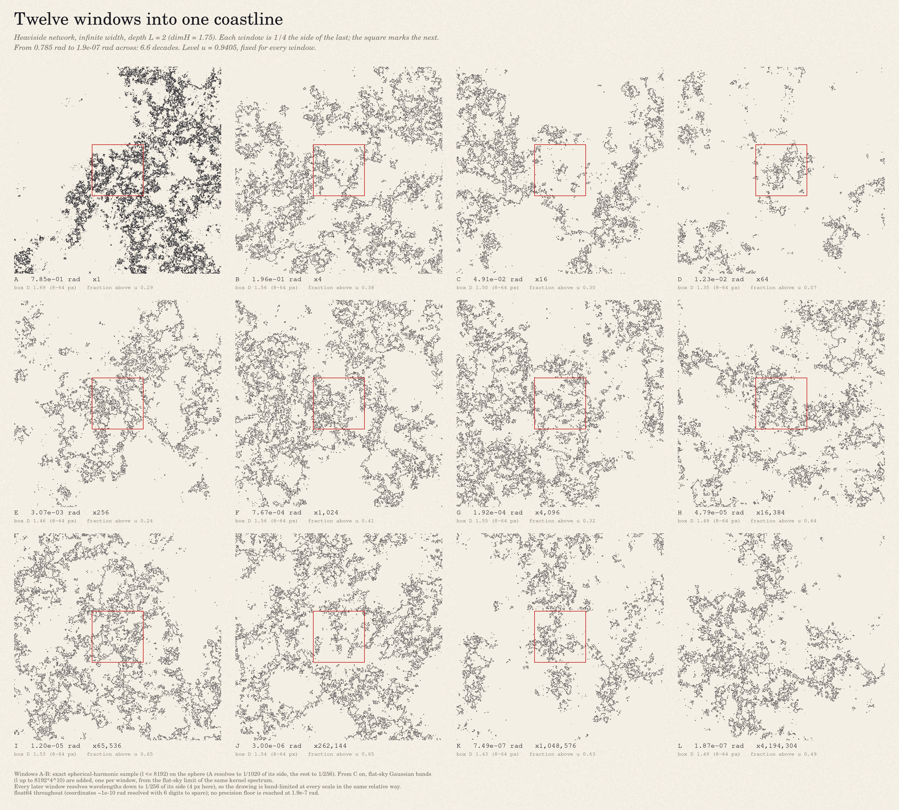<br>
<em>Twelve nested windows into one level set of a depth-2 infinite-width Heaviside network on S², from 0.785 rad down to 1.9×10⁻⁷ rad (×4,194,304). The red square marks the next window. Each deeper window adds the next octave of the same random field (see "What was computed").</em>
</p>

<table><tr>
<td width="50%">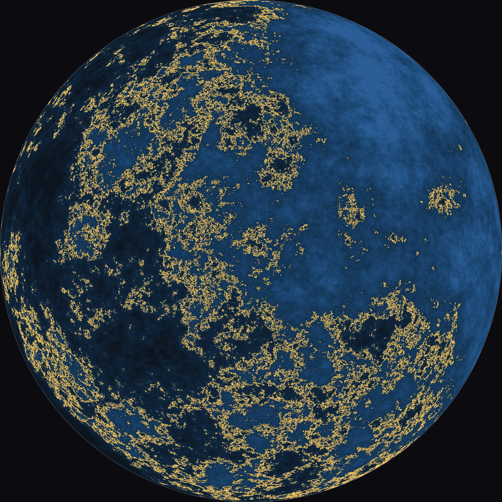<br><em>Gold line: the median level set of one depth-2 infinite-width Heaviside network on S², flat lighting. The dark relief underneath is the same field.</em></td>
<td width="50%"><video src="gallery/depth_as_time_plotter.mp4" autoplay loop muted playsinline width="100%"></video>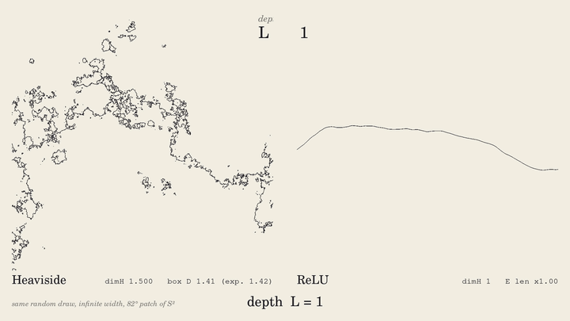<br><em>Depth as time: one random draw with depth going 1 → 8. Heaviside on the left, ReLU on the right, with the measured box dimension at each integer depth.</em></td>
</tr></table>

---

## 1. The phenomenon

**Model (Di Lillo, Marinucci, Salvi & Vigogna 2025, arXiv:2504.06250, §2.2).** The inputs are points on the unit sphere, x ∈ S² ⊂ ℝ³. Take bias variance Γ_b = 0 (every image here uses it), then

T₀(x) = W⁽⁰⁾x,  T_s(x) = W⁽ˢ⁾ σ(T_{s−1}(x)),  W⁽⁰⁾ᵢⱼ ~ N(0,1),  W⁽ˢ⁾ᵢⱼ ~ N(0, Γ_W / n),  Γ_W = 1 / E[σ(Z)²].

As the widths n → ∞, T_L becomes an isotropic Gaussian field on S² with covariance

  E[T_L(x)T_L(y)] = κ_L(⟨x,y⟩) = κ∘κ∘…∘κ(⟨x,y⟩) (L times),  κ(u) = Γ_W E[σ(Z₁)σ(uZ₁ + √(1−u²)Z₂)].

For the Heaviside step this is the normalised arc-cosine kernel of order 0, **κ(u) = 1 − arccos(u)/π**. For ReLU it is order 1, **κ(u) = (√(1−u²) + (π − arccos u)u)/π**. GELU, tanh and sin are computed here from their Hermite (Mehler) expansions.

**Covariance Regularity Index (CRI).** If κ(1−t) = 1 − c·t^β + …, the field is Hölder-β-ish. For Heaviside, β = 1/2, and composing L times gives **β_L = 2^{−L}** (paper Thm 3.5). Their two classes are:

- **Fractal class (CRI < 1, e.g. Heaviside).** With positive probability, dim_H T_L⁻¹(u) = d − β^L. On S² (d = 2) that is **2 − 2^{−L}**: 1.5, 1.75, 1.875, … → 2. The curves get crinklier with depth until they fill area.
- **Kac–Rice class (CRI > 1: ReLU, and any C² activation such as GELU, tanh or sin).** The level sets are ordinary curves (dimension 1). Their expected length is **E H¹(T_L⁻¹(u)) = 2π κ′(1)^{L/2} e^{−u²/2}**. The single parameter κ′(1) sets the regime: it is 1 for ReLU (sparse, constant length), 1.072 for GELU, 1.178 for tanh and 1.313 for sin (high-disorder, length grows exponentially with depth). The "spectral index" α of the paper is a different quantity: C_ℓ ~ ℓ^{−(α+2)}, with CRI = α/2.

**A correction to the proposal doc.** A *finite*-width Heaviside network is piecewise constant on the arrangement of its n first-layer great circles, because deeper layers only ever see binary codes. Its level sets are unions of great-circle arcs and are never fractal. The paper's result concerns the infinite-width Gaussian-field limit. So this project renders both: exact samples of the limit, and finite networks up to n = 65,536, whose roughness stops at a width-dependent scale ("width as zoom limit", §4.4).

---

## 2. Gallery

### 2.1 The tile grid: rows = depth, columns = activation

Every tile uses **the same random spherical-harmonic draw** (common random numbers) and the same 82° Lambert equal-area patch of S². Only the kernel changes. The printed numbers are measured box-counting slopes, alongside "exp", the value this estimator returns on synthetic fields of exactly the theoretical dimension (§4.1).

<table><tr>
<td width="25%"><a href="gallery/tiles_topo.png">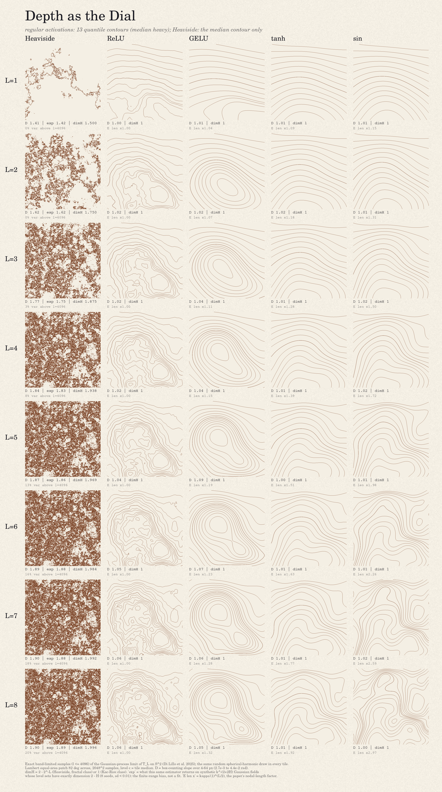</a><br><b>topographic</b>: the regular columns get 13 quantile contours so they carry visual weight. The Heaviside column shows the median contour only, since more levels would fill solid (declared).</td>
<td width="25%"><a href="gallery/tiles_plotter.png">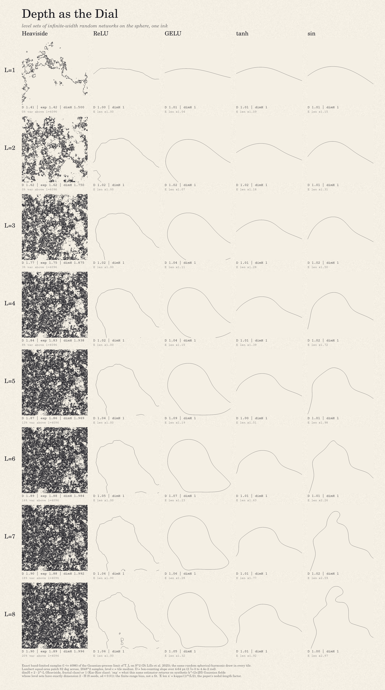</a><br><b>single-ink plotter</b>: the median level set only. This is the honest minimal version, and here the regular activations really are one smooth curve across 82°.</td>
<td width="25%"><a href="gallery/tiles_riso.png">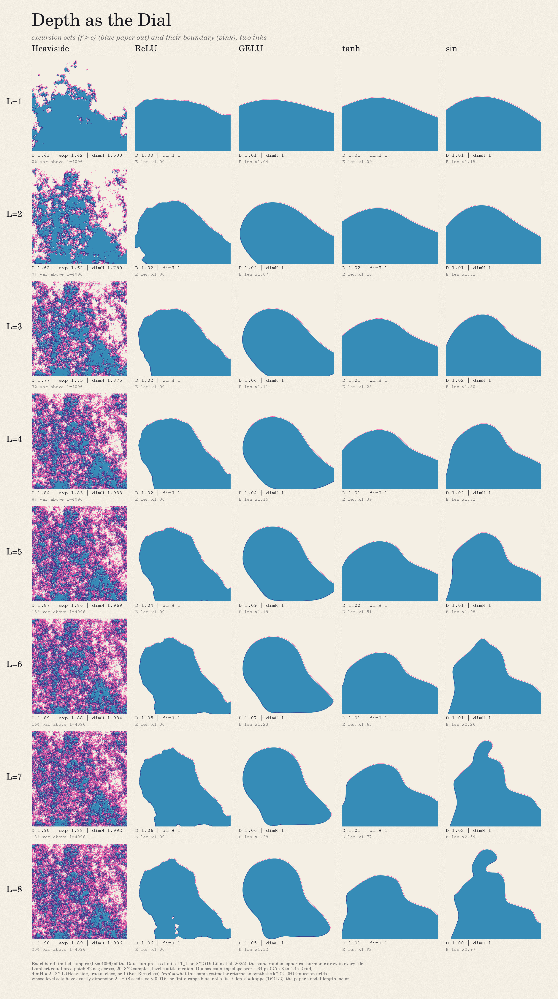</a><br><b>riso, 2 inks</b>: blue = {f &lt; c}, pink = boundary, with a declared (3, −2) px misregistration.</td>
<td width="25%"><a href="gallery/tiles_dark.png">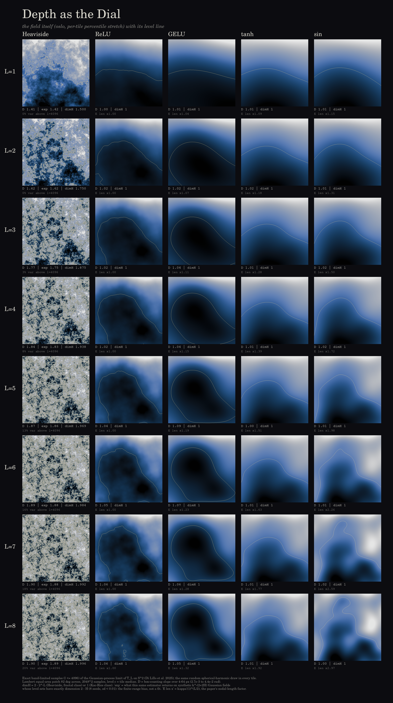</a><br><b>dark field</b>: the field itself (cmcrameri <i>oslo</i>, per-tile 1–99 % stretch, declared) with its level line in warm white.</td>
</tr></table>

Reading down the Heaviside column: D = 1.41, 1.62, 1.77, 1.85, 1.88, 1.89, 1.90, 1.90. The estimator's expectation for the true dimensions is 1.42, 1.62, 1.75, 1.83, 1.86, 1.88, 1.88, 1.89. ReLU, GELU, tanh and sin measure 1.00–1.09 at every depth.

### 2.2 Zoom: one coastline across 6.6 decades

<table><tr>
<td width="33%"><a href="gallery/zoom_plates_heaviside_L2_plotter.png"></a><br>L = 2, plotter plate book.</td>
<td width="33%"><a href="gallery/zoom_plates_heaviside_L2_riso.png">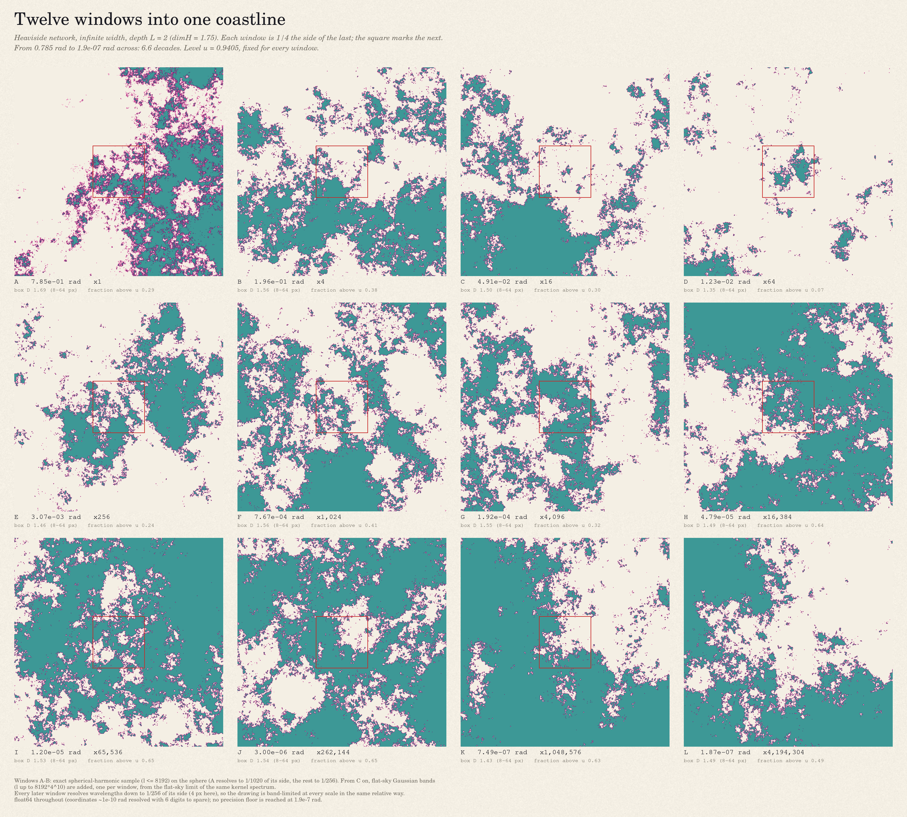</a><br>L = 2, riso: teal = {f &gt; u}, pink = boundary.</td>
<td width="33%"><a href="gallery/zoom_plates_heaviside_L2_dark.png">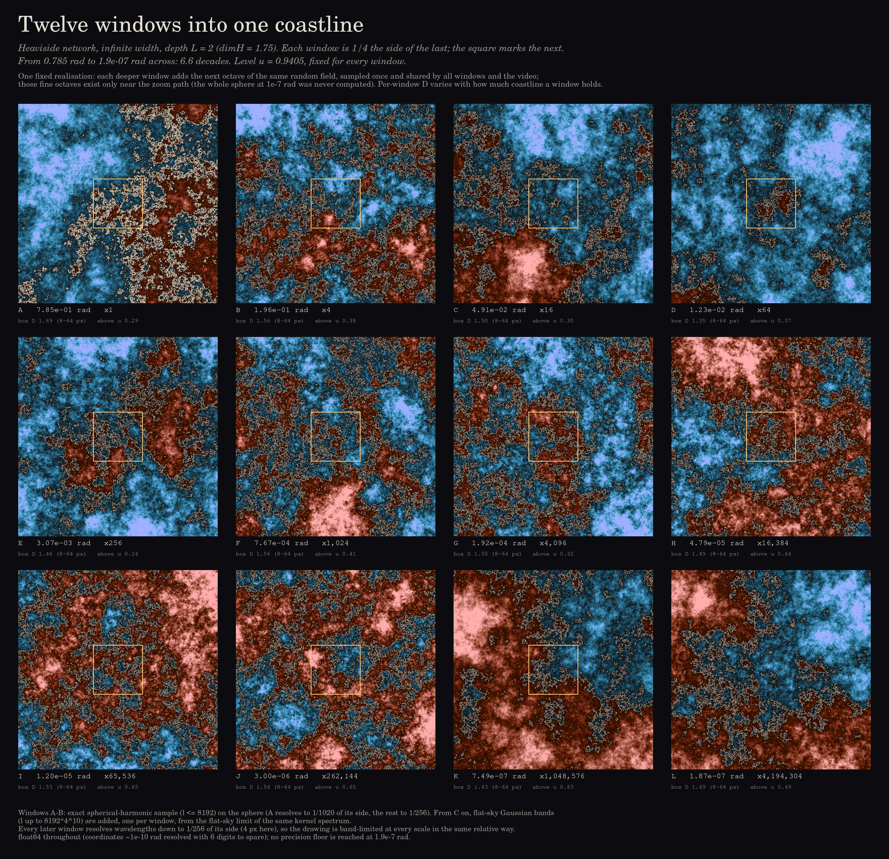</a><br>L = 2, dark: <i>berlin</i> diverging about the level u, stretched per plate (declared).</td>
</tr><tr>
<td><a href="gallery/zoom_plates_heaviside_L1_plotter.png">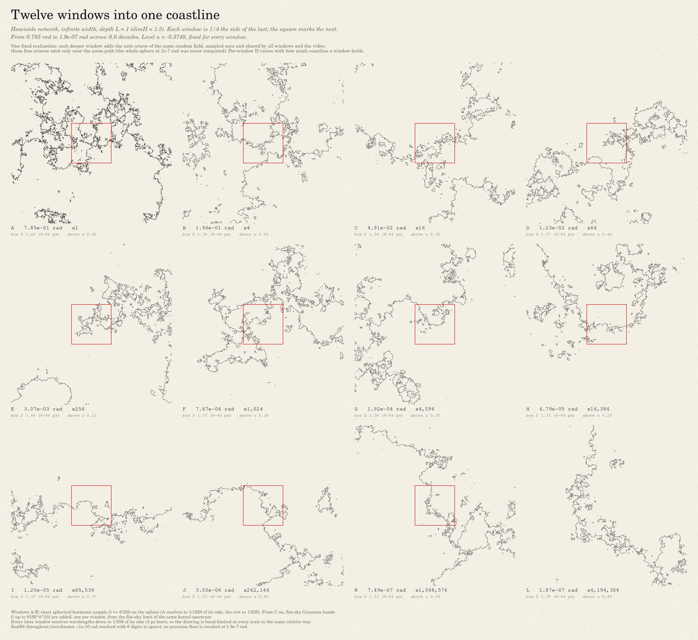</a><br>L = 1 (dim 1.5): a different seed, a sparser coastline.</td>
<td><a href="gallery/zoom_plates_heaviside_L6_plotter.png">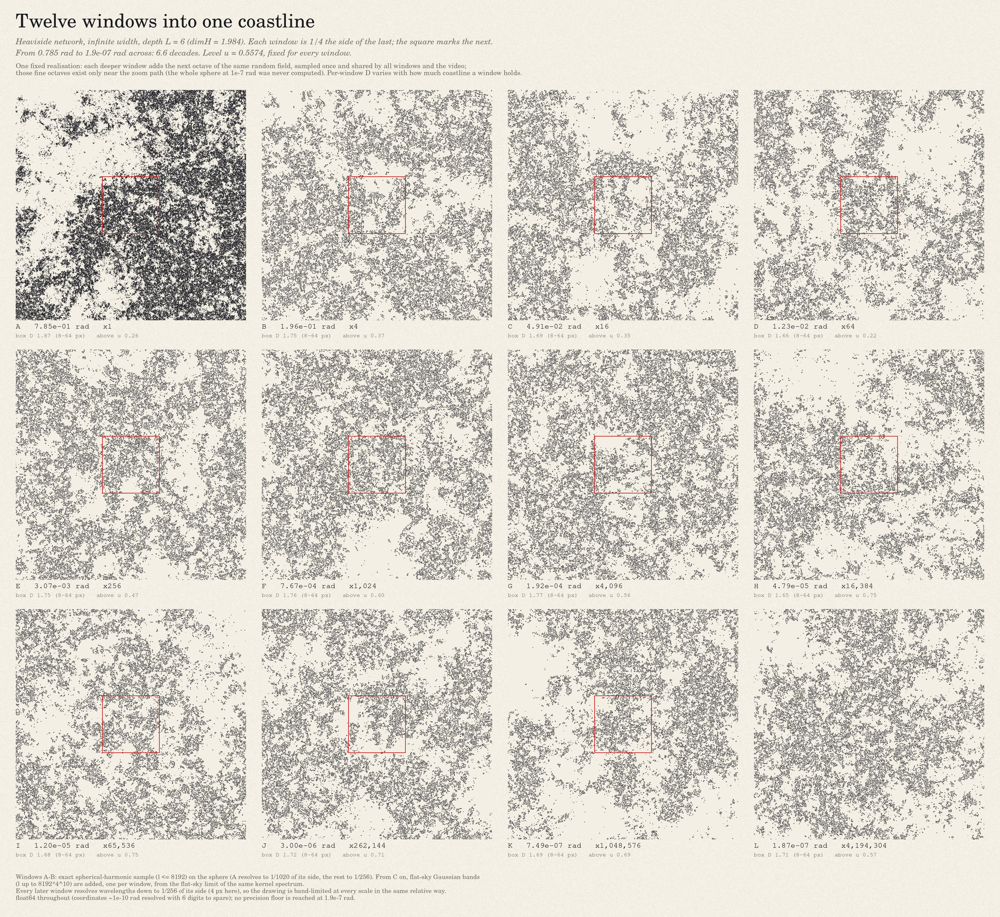</a><br>L = 6 (dim 1.984): the coastline is nearly area-filling at <i>every</i> scale. Zooming never resolves it into a line.</td>
<td><video src="gallery/zoom_heaviside_L2_plotter.mp4" autoplay loop muted playsinline width="100%"></video>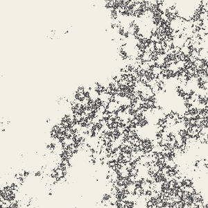<br>Continuous zoom through the same twelve windows (plotter). Dark version: <a href="gallery/zoom_heaviside_L2_dark.mp4">mp4</a> / <a href="gallery/zoom_heaviside_L2_dark.gif">gif</a>.</td>
</tr></table>

### 2.3 Width as a zoom limit

<p><a href="gallery/width_row.png">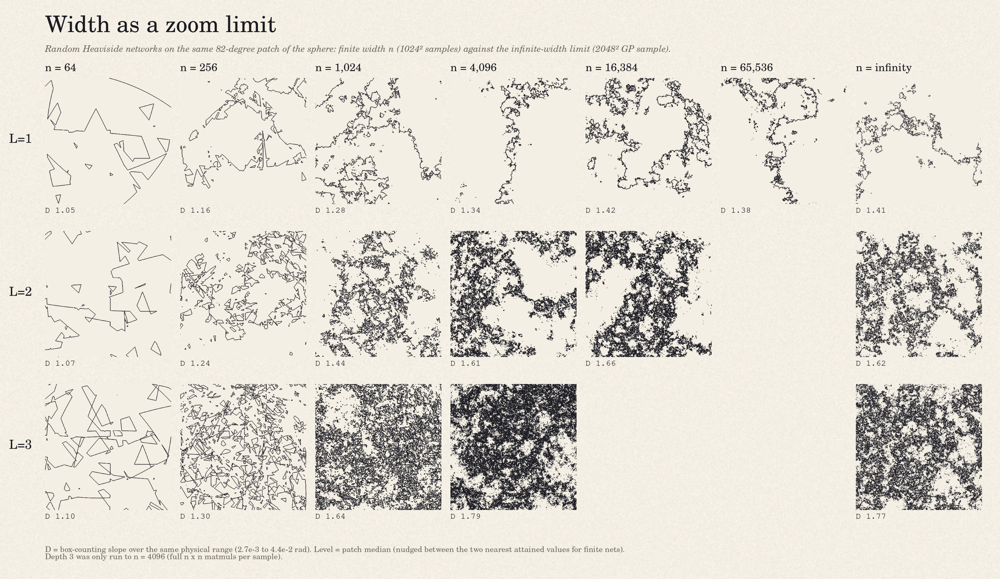</a><br>
<em>The same patch, finite Heaviside networks of width 64 … 65,536 against the limit. At n = 64 the level set is visibly a polygon of great-circle arcs. By n ≈ 10⁴ it is indistinguishable from the Gaussian-process sample at this scale.</em></p>

<video src="gallery/zoom_width_limit.mp4" autoplay loop muted playsinline width="100%"></video>
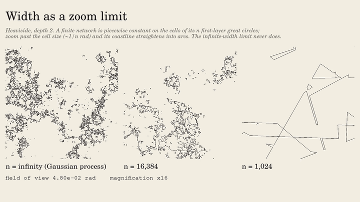
<em>Zooming into the GP limit, n = 16,384 and n = 1,024 (depth 2, each at a point on its own level set). The finite networks straighten into arcs once the field of view reaches ~tens of cells (~1/n rad per cell); the limit keeps crinkling.</em>

### 2.4 Globes

<table><tr>
<td width="50%"><a href="gallery/globes_series_plotter.png">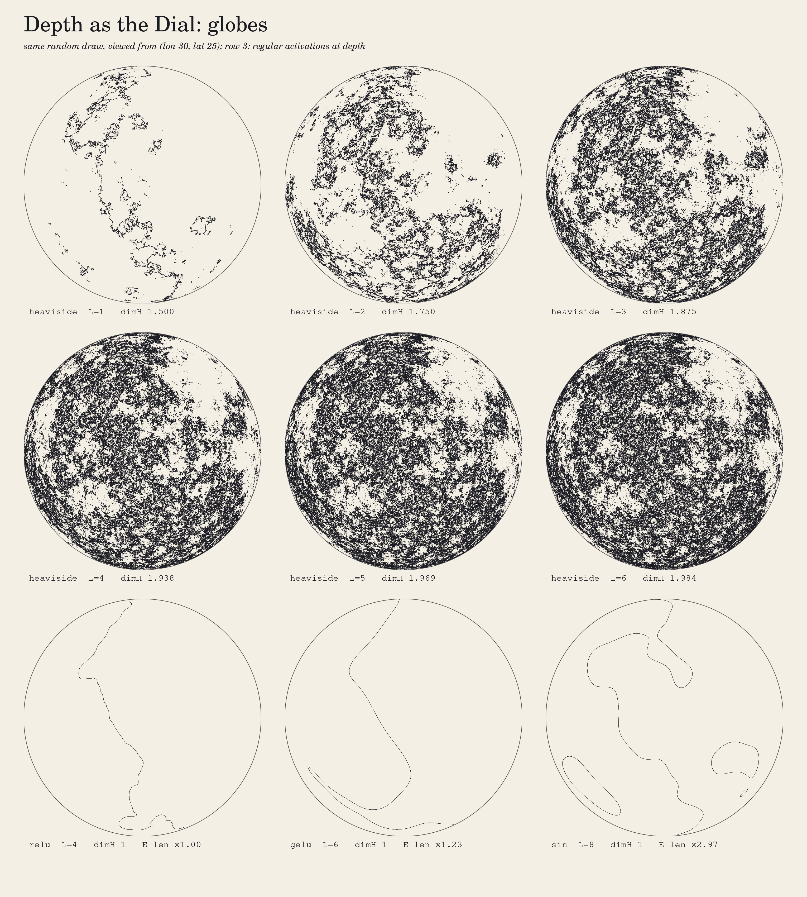</a><br>Heaviside L = 1…6 from one viewpoint, plus ReLU L=4, GELU L=6 and sin L=8 (bottom row) from the same draw.</td>
<td width="50%"><video src="gallery/globe_spin_heaviside_L2_dark.mp4" autoplay loop muted playsinline width="100%"></video>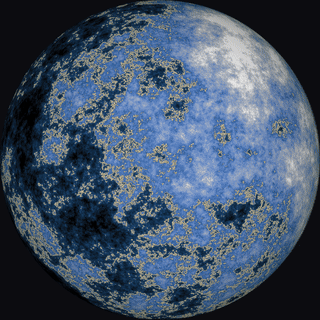<br>Rotating globe, Heaviside L=2. The field (<i>oslo</i>, limb-shaded, declared) and the gold level line.</td>
</tr><tr>
<td><a href="gallery/globe_hero_heaviside_L2_plotter.png">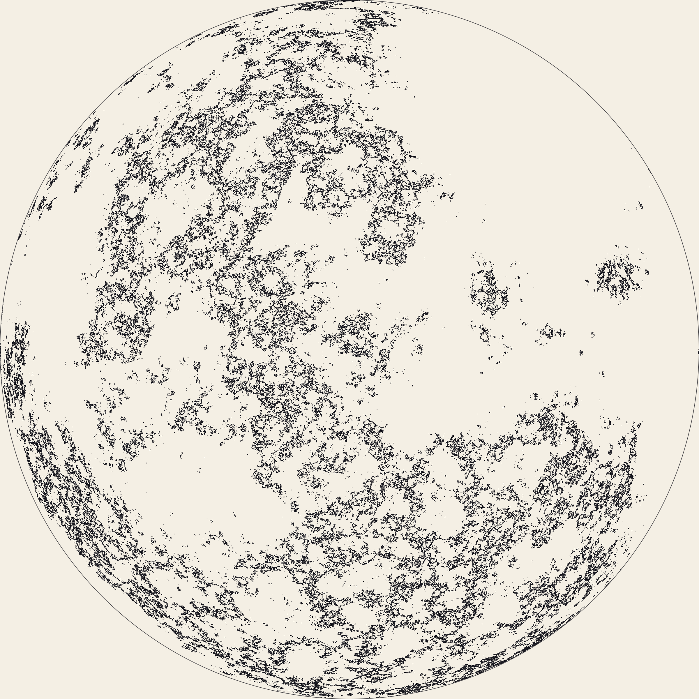</a><br>Plotter globe, L=2 (2400 px, l ≤ 4096).</td>
<td><a href="gallery/globe_hero_heaviside_L2_dark.png">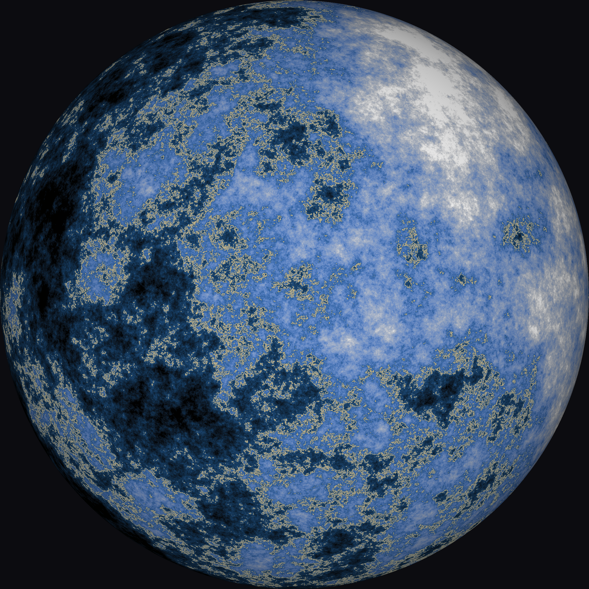</a><br>The glossy alternate. The "highlight" is the high end of the colormap plus declared limb shading, not lighting data. The flat-lit version is the hero above.</td>
</tr><tr>
<td colspan="2"><video src="gallery/globe_spin_heaviside_L3_plotter.mp4" autoplay loop muted playsinline width="49%"></video> 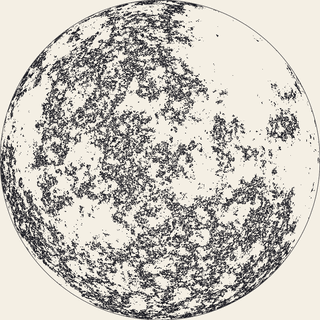<br>Rotating plotter globe, L=3.</td>
</tr></table>

### 2.5 Whole-sphere posters (Hammer equal-area)

<a href="gallery/poster_hammer_heaviside_L1_topo.png">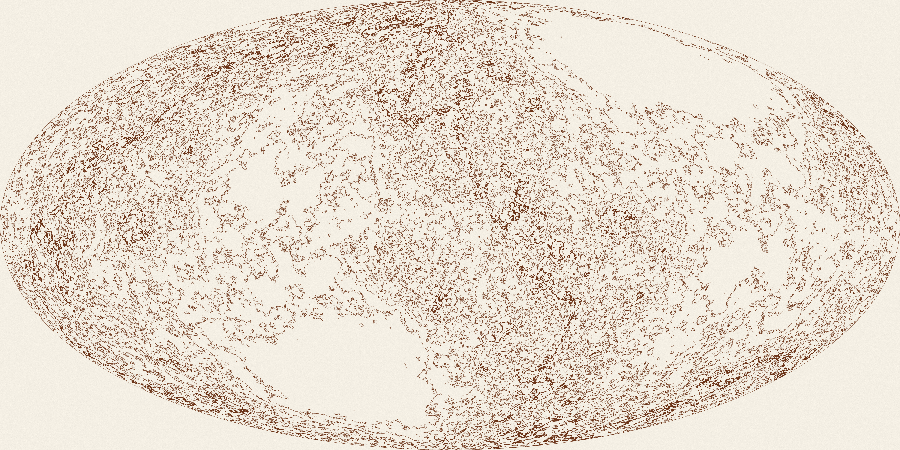</a>
<em>Depth 1 (dim 1.5), 9 quantile contours with the median heavy, 6000×3000, l ≤ 4096.</em>

<a href="gallery/poster_hammer_heaviside_L2_gold.png">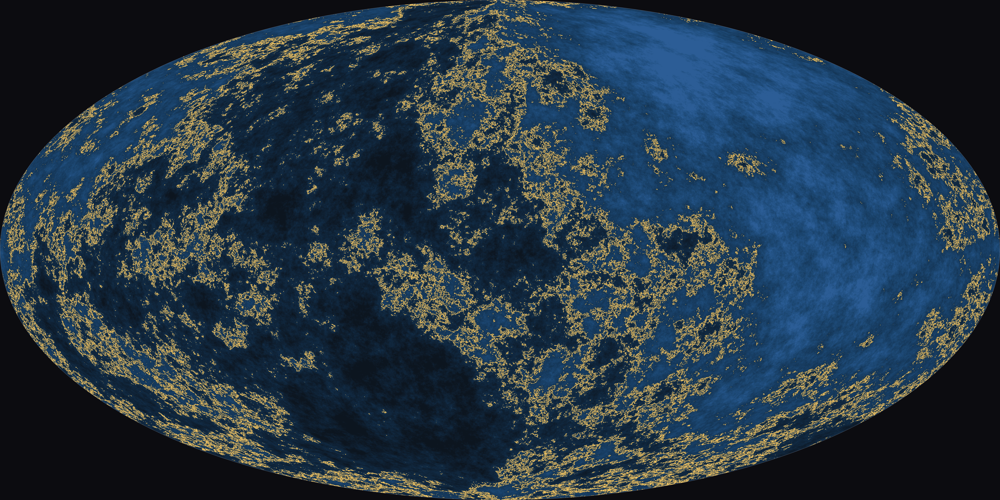</a>
<em>Depth 2, median level set in gold on the quiet field. If it looks like a CMB sky map, that resemblance is real rather than borrowed: both are isotropic Gaussian random fields on S², described entirely by an angular power spectrum C_l (Plate I). This one has C_l ~ l<sup>−2.5</sup>.</em>

### 2.6 Strata and the spectral plate

<table><tr>
<td width="33%"><a href="gallery/strata_heaviside.png">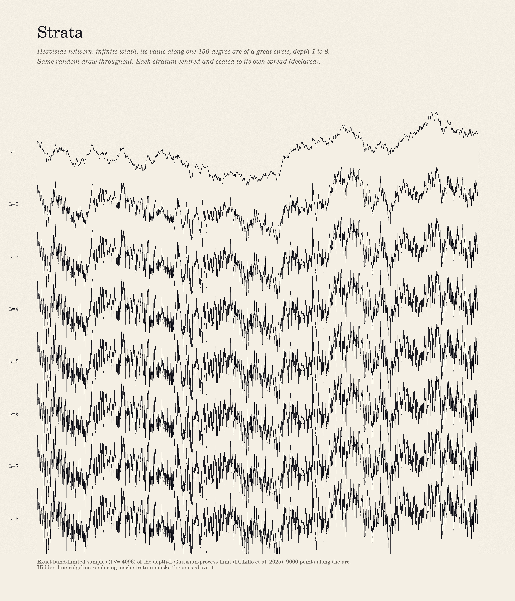</a><br><b>Strata</b>: the value of the field along one 150° great-circle arc, depth 1 (top) to 8. Hidden-line ridgelines. Each stratum is scaled to its own spread (declared), so shape is faithful but amplitude is not.</td>
<td width="33%"><a href="gallery/strata_relu.png">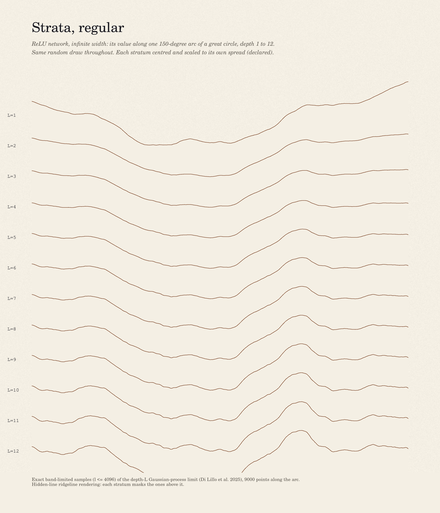</a><br>The same arc and draw for ReLU, depth 1–12.</td>
<td width="33%"><a href="gallery/plate_spectra.png">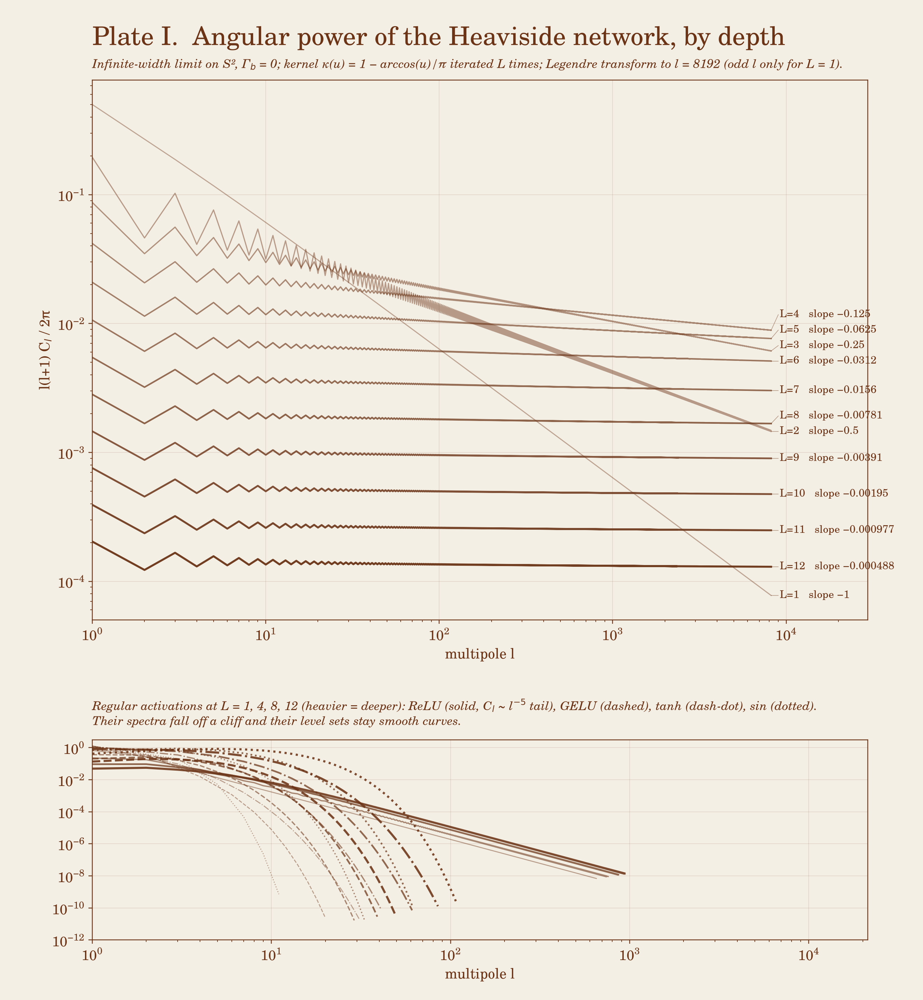</a><br><b>Plate I</b>: angular power l(l+1)C_l/2π per depth. Heaviside flattens toward l⁻² (slope −2^{1−L}), while regular activations fall off a cliff.</td>
</tr></table>

### 2.7 Spectral split (declared style, after Sohl-Dickstein's trainability fractals)

The level set splits the field into two sides. Each side is **rank (CDF) normalised on its own** and mapped onto half of matplotlib `Spectral`. In the requested **seam** mapping, the two dark ends meet at the level set: f &lt; u runs pale yellow → green → blue → purple (#5e4fa2) toward the coastline, and f &gt; u runs pale yellow → orange → deep red (#9e0142) toward it, so the coastline is the dark seam. The **colab** mapping reproduces `cdf_img` from github.com/Sohl-Dickstein/fractal exactly (readout = 'loss': negatives ranked onto [−1, −0.25], non-negatives onto [0.25, 1], sign flipped, then Spectral on [−1, 1]). There the dark ends sit at the extremes and the boundary is a pastel jump. Both are declared aesthetic mappings: rank normalisation deliberately flattens the value distribution, so colour shows *order* relative to the level, not amplitude.

<table><tr>
<td width="50%"><a href="gallery/poster_hammer_heaviside_L2_spectral_3000px.png">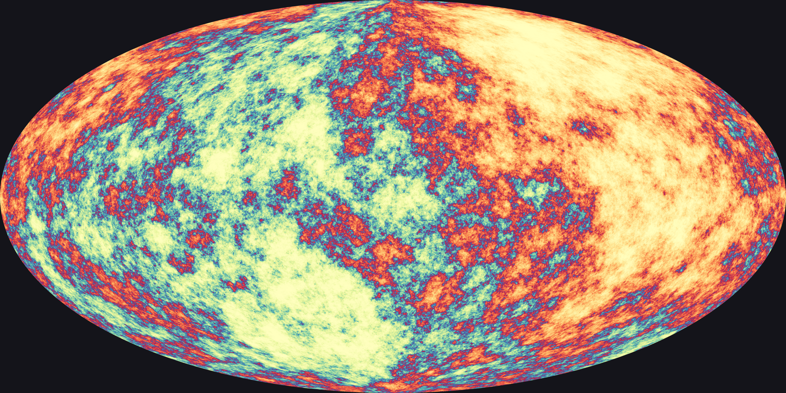</a><br>Whole sphere, depth 2, seam mapping (3000 px; 6000 px master not committed).</td>
<td width="50%"><a href="gallery/poster_hammer_heaviside_L2_spectral_colab_3000px.png">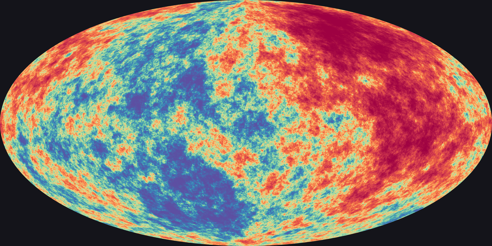</a><br>Same draw, the colab's exact normalisation.</td>
</tr><tr>
<td><a href="gallery/globe_hero_heaviside_L2_spectral.png">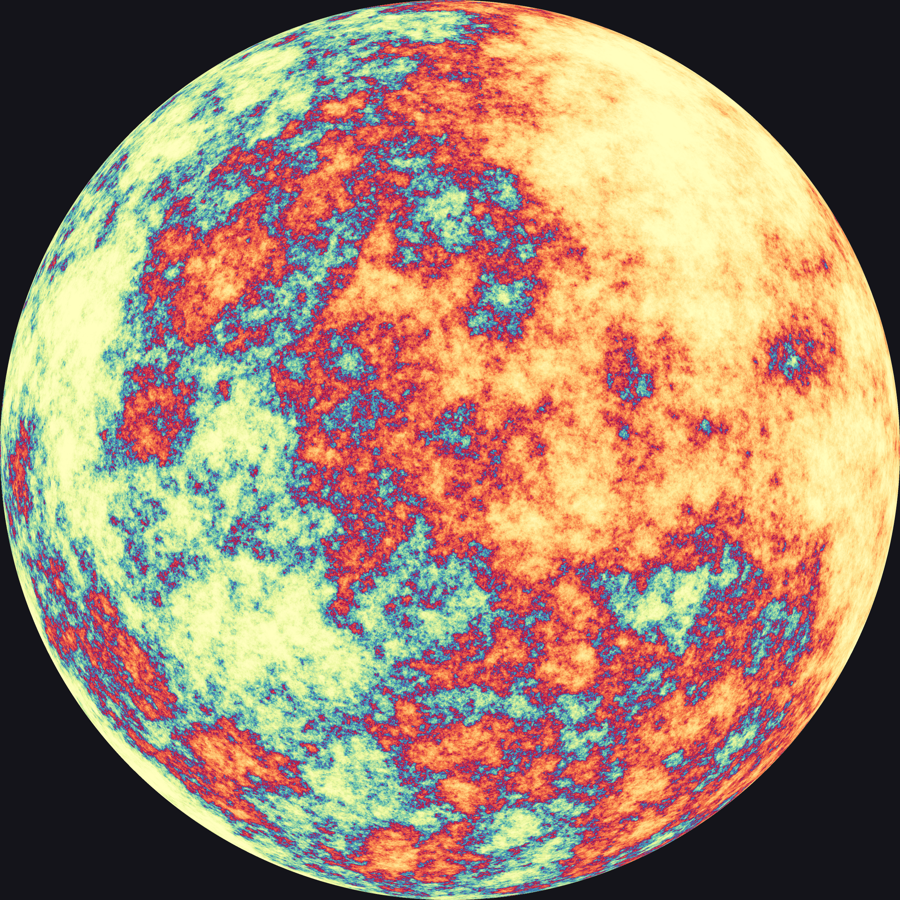</a><br>Globe, depth 2, seam mapping, rank-normalised over the visible disc.</td>
<td><a href="gallery/zoom_plates_heaviside_L2_spectral.png">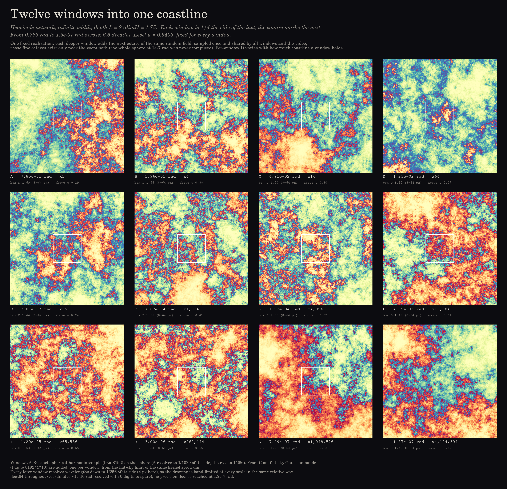</a><br>The twelve windows, seam mapping, rank-normalised per window (so every window uses the full palette whatever its local amplitude).</td>
</tr></table>

---

## 3. What was computed

Everything is random initialisation plus linear algebra; nothing is trained. Seeds: GP tiles, globes, strata and depth animation use white a_lm seed 11. The multi-scale draws use seeds 1–4. Finite networks use seed 11.

| step | script | what | size / precision | wall time |
|---|---|---|---|---|
| kernels & spectra | `common.py`, `compute_spectra.py` | κ_L for Heaviside/ReLU (closed form, iterated as 1−κ to avoid cancellation), GELU/tanh/sin (300-term Hermite series), L = 0…12, plus an RBF null kernel exp(−(1−u)/0.02²). C_l by composite Gauss–Legendre in θ with geometric grading at both poles, l ≤ 8192, GPU float64 | 66 kernels | 26 s |
| kernel check | (inline test) | κ_L vs Monte Carlo covariance of width-1024 nets, 4000 nets, L=1,3, all activations | agreement within MC error (≤ 3 %) | 1 min |
| GP tiles | `compute_tiles.py` | a_lm = √C_l · z_lm, where z is the **same** white noise for every kernel, synthesised with ducc0 `synthesis_general` at the 2048² Lambert patch (l ≤ 4096) and at 4096² (l ≤ 8192) for the resolution check. Box counting at the tile median and at 0 | float64 | ~4 min |
| calibration | `compute_calibration.py` | the same box counting on planar Gaussian fields with S(k) ∝ k^{−(2+2H)} (level-set dimension exactly 2 − H), H = 2^{−L}, with the band limit matched to each protocol | 8 seeds (tile), 32 seeds (window) | 2 min GPU |
| multi-scale zoom | `zoom_engine.py`, `compute_multiscale.py` | nested windows 0.785 → 1.9×10⁻⁷ rad around a point of the level set: exact SHT (l ≤ 8192) + 10 flat-sky Gaussian bands l ∈ (8192·4ᵏ, 8192·4ᵏ⁺¹] on 8192² periodic boxes (16 samples per shortest wavelength). Band spectra from the flat-sky Hankel transform of the same kernel (matches the Legendre C_l to ≤ 1.5 % at l ≤ 8192). Structure functions of the sampled field match theory to ≤ 3 %. Box counting on 2048² windows | Heaviside L = 1, 2, 3, 4, 6 (2–4 seeds), ReLU L=2, RBF | ~35 min GPU |
| finite networks | `nets.py`, `compute_nets.py` | exact forward passes of Heaviside nets (checked bit-exact against brute force). Layer-1 codes only change across the n great circles crossing a window, so h₂ = W₁·base + W₁[:,J]·Δa_J. W₁ columns are generated on the fly from counter-based seeds, so n = 65,536 fits | patch 1024² (L=1: n ≤ 65536; L=2: ≤ 16384; L=3: ≤ 4096); zoom windows 0.785 → 4.7×10⁻⁸ rad at 512² (256² for the widest windows of the widest nets) | ~1.5 h GPU (shared) |
| Kac–Rice check | `compute_kacrice.py` | nodal length of T_L⁻¹(0) on the whole sphere by marching squares (great-circle segment lengths), 400 independent draws per row, l ≤ 128 | | ~30 min CPU |
| renders | `render_*.py` | every still/video is rendered from cache (GP draws are re-synthesised from cached spectra + seed, which is deterministic) | | |

Level-set ink: a sample is inked if f − c changes sign against a 4-neighbour. The field is supersampled 2–4× and box-averaged to the output (anti-aliasing), and no contour smoothing is applied. PNG throughout. Fonts: URW C059 / Nimbus Mono.

**Reproduce** (from this directory, with `/home/fzeng/ml/research/art/.venv/bin/python` as `PY`; `ducc0` was installed into that venv for spherical harmonic transforms):

```bash
PY compute_spectra.py && PY compute_tiles.py && PY compute_calibration.py
../_shared/gpu_run.sh ./run_multiscale.sh ; ../_shared/gpu_run.sh ./run_multiscale2.sh
../_shared/gpu_run.sh ./run_nets.sh
PY compute_kacrice.py && PY verify_plots.py
for s in plotter riso dark topo; do PY render_tiles.py $s; done
PY render_zoom_plates.py heaviside_L2 1 plotter   # also dark, riso; heaviside_L6 1; heaviside_L1 4
./run_globes.sh ; PY render_globes.py hero heaviside_L2 gold
PY render_depth_anim.py plotter
../_shared/gpu_run.sh ./run_zoom_anim.sh ; ../_shared/gpu_run.sh ./run_widths.sh
PY render_poster.py heaviside_L1 topo ; PY render_poster.py heaviside_L2 gold
PY render_strata.py ; PY render_spectra_plate.py ; PY render_width_row.py
```

**Precision floor.** Everything is float64 except the band boxes (stored float32 with a relative precision of 10⁻⁷ of each band's own amplitude) and the finite-network hidden layers (float32 sums of ±1 weights, which is exact for the sign decisions to within ~10⁻⁶ relative). At the deepest window (1.9×10⁻⁷ rad, pixel 9×10⁻¹¹ rad), coordinates are resolved with ~6 spare digits, and field increments at pixel scale (~10⁻³ for L = 2, 2.5×10⁻⁵ for L = 1) are far above rounding. No precision floor was reached.

---

## 4. Verification / honesty

### 4.1 Dimension vs depth (did it show up? yes)

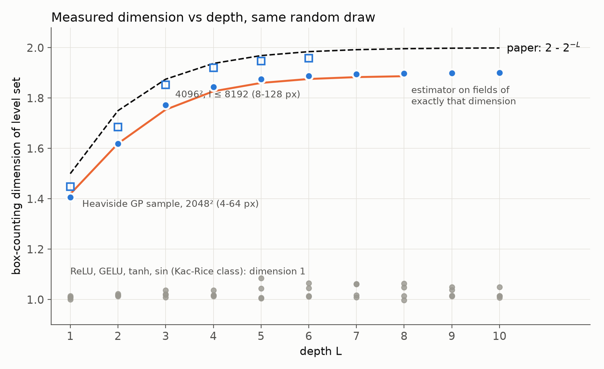

Box counting on a 2048² sample straddles two biases. Below ~4 px the band limit makes lines locally smooth (slope → 1). Above ~64 px the boxes saturate (slope → 2). A raw slope over 4–64 px is therefore not 2 − H even for a perfect fractal. So I measured the estimator itself: the same pipeline on planar Gaussian fields whose level sets have exactly dimension 2 − H.

| L | dim_H (paper) | estimator on exact-dimension fields | **Heaviside GP, 2048²** | GP, 4096², l ≤ 8192 (8–128 px) | ReLU / GELU / tanh / sin |
|---|---|---|---|---|---|
| 1 | 1.500 | 1.419 ± 0.008 | **1.406** | 1.448 | 1.00 / 1.02 / 1.01 / 1.01 |
| 2 | 1.750 | 1.619 ± 0.006 | **1.618** | 1.685 | 1.02 / 1.02 / 1.02 / 1.01 |
| 3 | 1.875 | 1.754 ± 0.009 | **1.772** | 1.853 | 1.02 / 1.04 / 1.01 / 1.02 |
| 4 | 1.938 | 1.827 ± 0.008 | **1.845** | 1.921 | 1.02 / 1.04 / 1.01 / 1.02 |
| 5 | 1.969 | 1.860 ± 0.008 | **1.875** | 1.947 | 1.04 / 1.09 / 1.01 / 1.01 |
| 6 | 1.984 | 1.876 ± 0.007 | **1.888** | 1.958 | 1.05 / 1.07 / 1.01 / 1.01 |
| 8 | 1.996 | 1.887 ± 0.007 | **1.898** | – | 1.06 / 1.05 / 1.01 / 1.00 |

The Heaviside GP matches the estimator's response to the paper's dimension to within 0.02 at every depth, and it rises monotonically with depth. The regular activations stay at 1.00–1.09. Null model: the smooth RBF GP gives 1.00–1.01 for boxes below its correlation length. The 4–64 px fit gives 1.14, because boxes ≥ 32 px approach its correlation length (≈ 30 px) and saturate. Across 6.6 decades of nested windows it gives 1.02 (below).

### 4.2 Many decades, and no end to the roughness

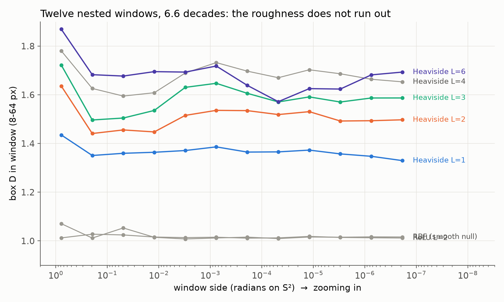

Mean box D (8–64 px) per window, averaged over seeds, from 0.785 rad to 1.9×10⁻⁷ rad. Protocol: the level is fixed at the field value at the zoom centre, and each window resolves to 1/256 of its side.

| kernel | windows | mean D over all windows (sd) | same estimator on exact 2 − H fields (32 seeds) | dim_H |
|---|---|---|---|---|
| Heaviside L=1 | 48 | 1.37 (0.03) | 1.35 ± 0.03 | 1.5 |
| Heaviside L=2 | 36 | 1.51 (0.07) | 1.48 ± 0.08 | 1.75 |
| Heaviside L=3 | 36 | 1.59 (0.09) | 1.55 ± 0.13 | 1.875 |
| Heaviside L=4 | 24 | 1.68 (0.06) | 1.59 ± 0.17 | 1.94 |
| Heaviside L=6 | 36 | 1.68 (0.12) | 1.62 ± 0.19 | 1.98 |
| ReLU L=2 (null, Kac–Rice) | 24 | 1.02 | – | 1 |
| RBF (null, smooth) | 24 | 1.02 | – | 1 |

The per-window statistics show no trend with scale over 6.6 decades (L=2 per-window means 1.44–1.64, with the widest window the high outlier because it is resolved to 1/1020 of its side rather than 1/256). This is statistical self-similarity. The single-window protocol is much noisier than the tile protocol (a window centred on the level set may hold little coastline, e.g. window D of the L=2 plate has only 7 % of its area above u), and it saturates for L ≥ 4, where it can no longer separate depths.

### 4.3 Resolution check

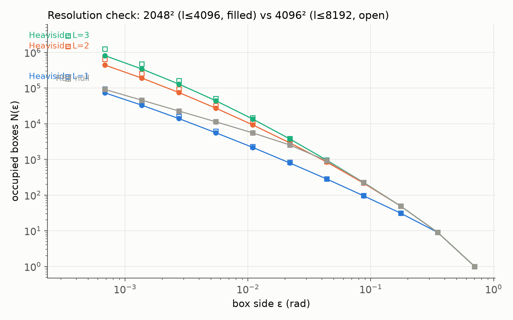

At the same physical box size, the RBF null gives identical counts at 2048² (l ≤ 4096) and 4096² (l ≤ 8192): 91,231 vs 91,195 at ε = 6.8×10⁻⁴ rad, which means it has converged. The Heaviside fields gain coastline when resolution doubles: +27 % (L=1), +45 % (L=2), +53 % (L=3) at the smallest common ε. The gain shrinks at larger ε (≤ 3 % at ε ≥ 0.04 rad). New detail keeps appearing as resolution is refined, which is what real structure does and aliasing does not. The limit here is the band limit, not float precision.

### 4.4 Finite width: the cutoff is ∝ 1/n

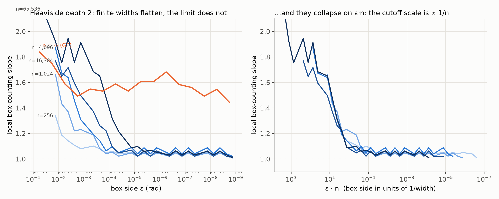

Local box-counting slopes of finite depth-2 Heaviside networks (n = 256 … 65,536), from nested windows around a boundary point found by bisection to 10⁻¹⁵. Every finite width falls to slope 1 (piecewise-flat arcs) while the GP limit stays rough across 7 decades. Plotted against ε·n, the curves collapse. The slope crosses 1.3 at **ε·n = 3.6, 3.2, 4.0, 5.1, 3.9** for n = 256, 1024, 4096, 16384, 65536. That is a 256× range of widths with the crossover constant to within a factor 1.6, so **the roughness cutoff is ε* ≈ 4/n rad**. Depth-1 networks show the same collapse, more noisily: the slope falls below 1.2 at ε·n between 2.4 and 13 for n = 256 … 16,384.

### 4.5 Kac–Rice branch (the smooth side of the theorem)

Mean nodal length of T_L⁻¹(0) on the whole sphere, 400 independent draws per row, against the paper's 2π κ′(1)^{L/2}:

| | L=1 | L=4 | L=8 |
|---|---|---|---|
| ReLU (κ′(1)=1) | 6.06 ± 0.12 / 6.28 | 5.98 ± 0.22 / 6.28 | 6.41 ± 0.33 / 6.28 |
| GELU (1.072) | 6.51 ± 0.08 / 6.51 | 7.50 ± 0.16 / 7.22 | 7.70 ± 0.25 / 8.30 |
| tanh (1.178) | 6.83 ± 0.06 / 6.82 | 8.72 ± 0.13 / 8.72 | 12.14 ± 0.19 / 12.09 |
| sin (1.313) | 7.12 ± 0.07 / 7.20 | 10.73 ± 0.16 / 10.83 | 18.23 ± 0.22 / 18.68 |

tanh agrees to within 0.3σ at every depth, and sin to within 1.2σ, 0.6σ and 2.1σ. ReLU and GELU agree to within 0.1–2.4σ. Both carry a large random constant component, which makes their length distributions skewed, and ReLU's l⁻⁵ spectral tail is truncated at l = 128 here (a slight underestimate of κ′(1)). Constant length (ReLU) and exponential growth (tanh, sin) both show up.

### 4.6 What didn't work / negative results

- **Raw box-counting slopes are not the Hausdorff dimension.** Uncalibrated, the numbers sit 0.08–0.11 below 2 − 2^{−L}, and within a single window the local slope drifts from ~1.3 to ~1.8 with box size. Only the calibration against exact-dimension fields turns them into evidence. For L ≥ 5, every practical estimator here saturates near 1.9. The distinction between 1.97 and 1.99 is invisible at any resolution I can sample.
- **Deep Heaviside fields are mostly a constant plus sub-pixel noise.** κ_L(u) → u* ≈ 0.79 for all u < 1, so as L grows the field becomes a random constant of variance 0.79 plus near-white noise. At l ≤ 4096, 7 % (L=4), 16 % (L=6) and 20 % (L=8) of the variance lies above the band limit and is simply not drawn. The tile images at L ≥ 5 are therefore smoothed views. Adding that variance back as pixel white noise was tried (plotter tiles); it changes little visually at L ≤ 2, and it was not kept.
- **The first width-cutoff estimator** (threshold on per-window D) gave meaningless exponents (−0.1, −0.3), because factor-4 windows are too coarse and the plateau is noisy. It was replaced by the local-slope collapse above.
- The regular-activation tiles at the median level really are a single curve across 82°. These fields (Γ_b = 0, inputs on S²) are very low-frequency. That is faithful, but visually lopsided, which is why the topographic variant exists.

---

## 5. Caveats

- **Infinite width is a limit, not a network.** Every "fractal" image in §2.1–2.2, 2.4–2.6 is a sample of the Gaussian-process limit. Real finite networks are piecewise constant (Heaviside) or piecewise linear (ReLU) and stop being rough below ≈ 4/n rad (§4.4). Level sets of finite ReLU nets are not fractal at any width.
- **Zoom plates and video are one fixed realisation, but not a precomputed sphere.** The octaves finer than l = 8192 are flat-sky Gaussian bands sampled once per seed, only in a neighbourhood of the zoom path (8192² boxes, 128 longest wavelengths wide). They are a legitimate sample of the same field's law at those scales, and all windows share them. In the video, bands fade in over the factor-2 range where they first become resolvable (declared). The flat-sky approximation errs at O(1/l²), with ≤ 1 % metric distortion inside 0.1 rad.
- **Depth-as-time in-betweens are not depth.** Between integer L the covariance is the mixture (1−τ)κ_L + τκ_{L+1} with the same white noise (declared). Only the holds at integer L are the paper's fields. "The same draw across depths" is a coupling I chose (common a_lm), not something the networks define: consecutive layers of a real network do not share their spherical-harmonic coefficients.
- **Level choice**: tile median, sphere median, or centre value (declared per piece). The theorem holds for every level u.
- **2D slices** (doc blind spot 2): here the domain *is* S², the paper's own setting, so there is no slicing. The patch images are flat projections (Lambert, gnomonic, orthographic, Hammer). All are bi-Lipschitz away from the limb, so dimensions are unaffected.
- **"Fractal" is used in the paper's sense**: non-integer Hausdorff dimension, supported here by calibrated box counting over 2.7 decades per window and 6.6 decades of nested windows, a resolution check, and two null models (smooth RBF; ReLU, which is non-smooth but Kac–Rice).
- **Fractal art lineage** (doc blind spot 5): the idioms are deliberately survey sheet, plate book and plotter, with every image captioned by what it measures.

**About the paper and the doc.** The paper exists and says what the doc says, with these clarifications:

1. The dimension statement holds *with positive probability*, not almost surely.
2. The doc's "single easily-computed spectral parameter" for the regular class is κ′(1), not the paper's "spectral index".
3. The paper writes the hidden-weight variance as Γ_W·n^{−1/2}. It must be Γ_W/n for its kernel recursion (eq. 2.3) to hold, and I used 1/n.
4. The recursion as printed omits Γ_W and Γ_b inside κ. With Γ_b = 0 and the stated normalisation, my κ is correct, and a Monte Carlo check confirms it.
5. Its proof asserts the same exponent β^L at u = −1. For Heaviside with L ≥ 2 the −1 endpoint actually has exponent 1/2 (κ_{L−1}(−1) is an interior point of κ). This does not affect the dimension, which is governed by u = +1.
6. The doc suggests "a 2D input slice" of a random network. The paper's object is a field on the sphere, and a finite network would not be fractal on any slice.

---

## 6. Ideas explored / not pursued

Brainstormed, with the two picks marked ★:

1. ★ **Depth strata**: ridgelines of the field along one arc, stacked by depth (`strata_*.png`). It was picked because it shows roughness as a 1D graph, where dimension 2 − H is easy to read, and because it is plotter-native.
2. ★ **Whole-sphere Hammer poster with topographic contours** (`poster_hammer_*`). It was picked because it is the only view that shows the entire S² realisation without a limb, making it a print object. (It merges seed ideas (a) and (b).)
3. **Width-as-zoom-limit diptych/triptych**: done as `width_row.png` and `zoom_width_limit.mp4`, since it was required anyway.
4. **Coastline comparison at identical draws** (Heaviside vs ReLU vs tanh): covered by the common-random-number tile grid and the depth-as-time diptych, so not made separately.
5. **Level-sweep animation** (c sweeps, islands merge): not pursued. It mostly shows percolation of excursion sets, which is generic to any rough Gaussian field, and it would dilute the depth story.
6. **Riso anaglyph of depth L vs L+1 level sets** (two inks, one per depth): not tried for lack of time. The depth-as-time animation carries the same comparison.
7. **Spectral plate** (Plate I): done, as the scientific-plate idiom.
8. **Finite ReLU networks' kink arrangements**: not pursued (no fractal content, only piecewise-linear cells).

---

## 7. Files over 20 MB (not committed)

FILES_OVER_20MB

---

## 8. References

- S. Di Lillo, D. Marinucci, M. Salvi, S. Vigogna, *Fractal and Regular Geometry of Deep Neural Networks*, 2025, arXiv:2504.06250 (read from the arXiv LaTeX source).
- S. Di Lillo, D. Marinucci, M. Salvi, S. Vigogna, *Spectral complexity of deep neural networks*, SIAM J. Math. Data Sci. 7(3), 2025.
- Y. Cho, L. Saul, *Kernel Methods for Deep Learning* (arc-cosine kernels), NeurIPS 2009.
- A. Bietti, F. Bach, *Deep Equals Shallow for ReLU Networks in Kernel Regimes*, ICLR 2021.
- R. Neal, *Bayesian Learning for Neural Networks*, 1996; A. Matthews et al. / J. Lee et al., *Deep neural networks as Gaussian processes*, ICLR 2018.
- M. Reinecke et al., *ducc0* spherical harmonic transforms (github.com/mreineck/ducc).
- K. Falconer, *Fractal Geometry: Mathematical Foundations and Applications* (box-counting and Hausdorff dimension; level sets of fBm-type fields have dimension d − H).
- Crameri, *Scientific colour maps* (cmcrameri: oslo, berlin, lajolla).
