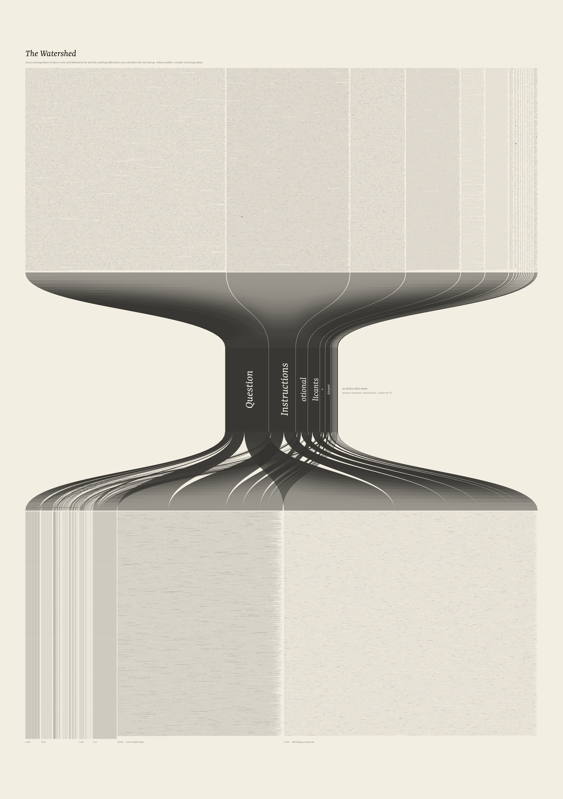
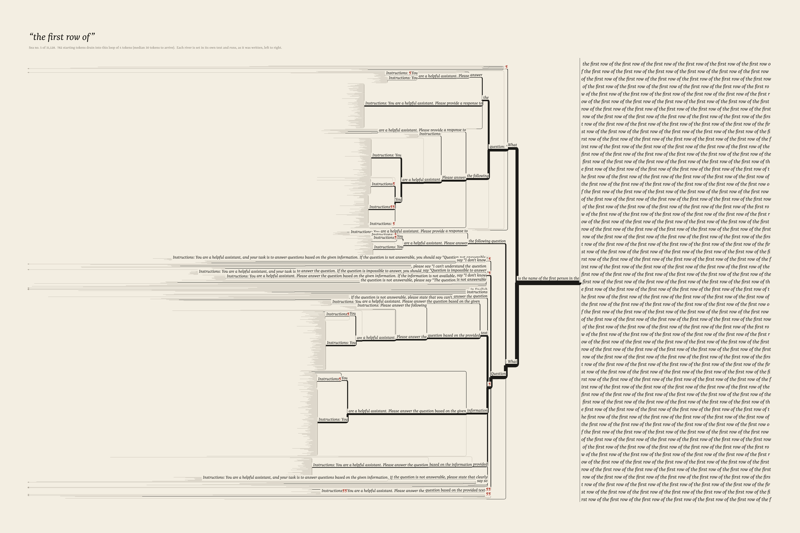

# Drainage: what a language model says when nobody is steering it

*Start Qwen3-0.6B from each of the 151,643 ordinary tokens in its vocabulary, with no prompt, and let it decode greedily. About half the runs fall into a loop within 256 tokens. There are 31,128 different loops. The largest five thousand are typeset here, each at a size set by how many starting tokens drain into it, and all 31,128 are listed in census.tsv. The rivers of text that carry those tokens to their loops are drawn in their own words.*

 



## The phenomenon

Greedy decoding is a deterministic map from a prefix to the next token. Left alone, language models tend to fall into repetition loops ("neural text degeneration", Holtzman et al. 2020; Xu et al. 2022 call it self-reinforcement). Here that map is run from every possible starting point:

- Each ordinary token id 0…151,642 is used, one at a time, as the entire context. There is no chat template and no BOS. The 26 special and added tokens are skipped as starts.
- Decoding is greedy with fp32 logits, for up to 256 new tokens.
- A run is said to have **entered a loop** when its trailing text is exactly periodic with some period p ≤ 80 tokens over at least max(3p, 16) + 32 tokens. That means at least three repeats, then 32 more tokens of confirmation. Offline, the loop's minimal period p and its **entry time** e are recomputed exactly: e is the first index from which the text is p-periodic.
- A run can also end by emitting `<|endoftext|>` or `<|im_end|>`, or it can still be going at token 256 (**unresolved**).

Runs are grouped by their loop, using the loop's canonical rotation as token ids. The **basin** of a loop is the set of starting tokens that drain into it.

Rivers are defined as follows. Two runs share a stretch of river if their texts coincide *token for token from that point to the loop*. This is a trie of the transients, read backwards from the loop. It is a true tree whose leaves are the starting tokens and whose confluences are the places where two different histories start saying exactly the same thing. (The model sees different contexts on the two runs. "Confluence" means the *text* merges, not the hidden state.)

Note: `Qwen/Qwen3-0.6B` on the Hub is the post-trained hybrid-thinking model, not the `-Base` checkpoint. With no template it behaves like a base model that has read a great deal of instruction data. That shows in its first words.

## What was measured (Qwen3-0.6B, whole vocabulary)

| | |
|---|---|
| starting tokens | 151,643 |
| entered a loop within 256 tokens | **74,049 (48.8 %)** |
| emitted end-of-text | 7 |
| still talking at token 256 | 77,587 (51.2 %) |
| distinct loops | **31,128**, of which 27,148 (87 %) drain exactly one starting token |
| largest basin | `0` repeated: 7,311 starting tokens (9.9 % of the looped runs) |
| next largest | ` \frac{1}{2} \left(` (4,639), ` 2^2 +` (3,515), `1.` (1,558), ` the first row of` (782), `¶` (762), ` the user's query. The response should be in the same language as` (669) |
| loops holding half the looped runs | 599 |
| basin-size tail | discrete power-law MLE α ≈ 2.0–2.2 for sizes ≥ 1…10. Rank–size slope −0.93 on ranks 10–3000 (Zipf-like). The top three basins sit well below the extrapolated line, so there is no single ocean. |
| entry time (looped runs) | median 23 tokens (10 %: 3, 90 %: 101) |
| period | median 10 tokens. 12 % are single-token loops. Periods up to 80 (the cap). |
| **first word** | only **62 distinct** first generated tokens across all 151,643 starts: `Question` 40.0 %, ` Instructions` 24.6 %, `otional` 11.0 %, `licants` 10.8 %, `*` 4.7 %, ` Answer` 4.6 %, `ED` 0.9 %… |
| confluence | 30 % of all transient tokens are shared with at least one other run. 58 % of looped runs share at least the loop-entry token plus the token before it with another run, 48 % share at least 5 tokens, and 18 % at least 20. 10,405 confluence nodes. |
| biggest confluences | 2,762 starts converge on ` Answer: 10` (→ `0` loop). 2,468 on `Question¶What is the value of the expression $ \` (→ `\frac{1}{2} \left(`). 2,173 on `Question¶The question is: "What is the value of the expression ` (→ `2^2 +`). |

The structure is an **hourglass, not a basin**:

1. At the first step the whole vocabulary collapses onto 62 words. The model treats a lone token either as the top of a document (`Question`, ` Instructions`, ` Answer`) or as a word fragment it must finish (`licants` after `(Config`, `.getAll`, ` jar`; `otional` after `轮`, ` blood`, ` cattle`).
2. After that the runs spread out again into 31,128 loops plus the unresolved half.
3. Within each loop's basin the texts genuinely re-merge upstream of the loop. That drainage tree is what the river plates draw.

The poetry is in the loops: *the first row of the first row of…*, *is the one that is not. So, the first one is the one that is not…*, *He has a certain amount of money. He has a certain amount of money…*, *The building has a certain number of floors, and the person is trying to find a way to get to the top of the building…*. The complete list is in [`census.tsv`](census.tsv), with rank, basin size, period, median entry time and the loop text as JSON.

## Controls and checks

**Null control: one token of memory.** The same model and the same greedy rule, but at every step it sees only the last token. The map is f(t) = the model's greedy continuation of the single token t, which is exactly the first step of every real run, so it needed no extra compute. f is a function on the vocabulary, so it too drains into cycles. Iterated, it has **4 terminal states**, and 99.7 % of the vocabulary drains into ` Instructions` repeated. Twenty uniform random maps on 151,643 points have 2–9 cycles each, with the largest basin at 29–100 %. So the 31,128 loops are made by *context*: carrying the whole text multiplies the number of attractors nearly 8,000-fold over a memoryless version of the same model. The null is typeset with the identical census treatment (`gallery/census_null_one_token_memory.png`): one enormous line.

**Precision and batching.** Every row of a batch starts at position 0 with one token, so rows always have equal length and there is no padding at all.

| check | result |
|---|---|
| hand-written engine vs `transformers` Qwen3ForCausalLM, fp32, 16 random starts × 96 tokens | 16 / 16 token-identical |
| fp32 batched (B = 512) vs fp32 unbatched (B = 1), 200 random starts | 200 / 200 identical trajectories |
| bf16 production run (B = 1024, rows removed as they finish) vs the no-early-stop pilot (different batch shapes), 2,050 starts | 99.95 % identical trajectories |
| **bf16 batched vs fp32**, 200 starts unbatched | 43.5 % identical trajectories; 75 % same terminal state; 77 % same loop when both loop |
| **bf16 vs fp32**, all 18,956 starts of shard 0 (batched fp32) | 94 % same *first* token; 46 % identical trajectories; median first divergence at token 67; 73 % same terminal state; 73 % same loop when both loop |
| census robustness, same shard | fraction looped 48.5 % vs 48.9 %; 4,933 vs 4,851 loops; 18 of the top 20 loops shared; top basin sizes within about 5 % (`0`: 897 vs 913; `\frac`: 570 vs 585); 75 % of looped runs are in loops that exist at both precisions |

Verdict: bf16 does disagree with fp32 on which loop about a quarter of individual starting tokens reach, and on 6 % of first words. Greedy decoding of a 0.6B model sits close to argmax ties often enough that the rounding decides. The **census, meaning which loops exist, their sizes and the shape of the distribution, is robust**, and the bf16 run is exactly reproducible. Running the whole vocabulary in fp32 would have cost about 2× the budget, so the pieces use bf16 and say so. Treat each drawn river as one realisation: roughly a quarter of its tributaries could be redirected by rounding.

**Loop-detection reliability** (pilot: 2,050 starts decoded to 512 tokens without stopping). With three repeats alone, 7.7 % of "loops" later break. With the 32-token confirmation used here, 2.2 % break before token 512. The cap matters: by 512 tokens 63 % of runs have looped, against 48 % by 256. The unresolved half is therefore partly "not yet" and partly long-period or wandering text. It is reported as such and never assigned to a sea.

**A second model.** Qwen3-1.7B was run on the same first 16,384 starting tokens of the random permutation. It is a different landscape. Its first word is `:` for 93 % of starts (then `車`, `STRACT`). It gives 2,772 loops against 4,329 for 0.6B on the same starts, and **only 42 loops occur in both models**. The first-token agreement between the two models is 0 %, and they reach the same loop for 7 % of starts where both loop. But the shared 42 include the big one: **`0` repeated is the largest sea for both models**, holding 56 % of 1.7B's looped runs (4,856 starts) and 10 % of 0.6B's on the same starts (784). After that, 1.7B drains into numbers (`. 1`, `0123456789`, `% 100`, `-01-01: 1999-01-01`), where 0.6B drains into exam questions and assistant boilerplate.

## Gallery

All images are ink on cream: a committed light key, one ink plus a red second ink used only for transcribed newlines (¶) and tabs (⇥). Type: Yrsa (Rosetta), falling back per glyph to DejaVu Serif and Noto Serif CJK.

### The census: *Drainage* (`gallery/census.png`, 7200 × 10200 px, about 84 × 119 cm at 8,600 px/m)
- **Measured:** every loop, its text in its most common entry phase, and the number of starting tokens that drain into it.
- **Declared:**
  - type size ∝ √count, so ink area ∝ count;
  - lines are set down to a 16 px floor. Below that, the smaller loops are set once each, in running 12 px text, largest first, until the sheet is full. The remaining 26,092 are in `census.tsv`, and the sheet says so.
- `census_detail_top.png` and `census_detail_tail.png` are full-resolution crops.
- `cache/census_full.png` (7200 × 17219) is a scroll that sets all 31,128 loops, but at 7 px, which is illegible. It was rejected: the tail turns into a mid-grey field.

### *The Watershed* (`gallery/watershed.png` at 2880 px; the 7200 × 10200 master is `cache/hourglass_full.png`; full-resolution crops in `watershed_detail_neck.png` and `watershed_detail_vocabulary.png`)
- **Top:** every starting token, set in micro type, in one column per first generated word. Column width ∝ number of starts (measured), and each column is set at the size that fills it (declared).
- **Neck:** one hairline per starting token passes through its first word. The 62 words are reversed out of the ink.
- **Bottom:** where each run ends up:
  - the 24 largest loops, each a column filled with its loop text;
  - all smaller loops, set once each;
  - the unresolved runs, each shown by the last 8 tokens it was writing at token 256.
- **Measured:** every flow. **Declared:** band heights, neck width (20 % of the sheet), ordering (largest group first; within a column, runs are sorted by destination to reduce crossings), and constant ink opacity per line.

### The rivers (`gallery/river_the_first_row_of.png`, `river_frac.png`, `river_users_query.png`; `typology.png`)
- Flow runs left to right, which is also reading order and generation order. The starting tokens (springs) are at the left. The sea is at the right, set as the loop text in one continuous wrapped stream.
- **Measured:** the confluence tree. Also each river's length, which is the typeset length of its own text: x is the width of the text between a point and the loop.
- **Measured, then declared:** stroke width ∝ √(starts drained). This is the Leopold–Maddock hydraulic-geometry exponent, borrowed as a declared choice.
- **Declared:**
  - vertical order: each starting token gets an equal slot, with the largest tributary in the middle;
  - right-angle joints with a rounded bend;
  - rivers shorter than the plate's longest shared river are shown whole. Single private streams that are longer are cut at the margin with an arrowhead;
  - labels are knocked out of the strokes.
- In `typology.png` (gallery copy at 3600 px; the 7200 px master is in `cache/`) all six plates use one type size, so river lengths compare across seas, in the Becher manner. The single plates scale type to fill the width.
- `\frac` shows the widest delta: hundreds of springs that each say `Question¶` and then flow together through *What is the value of the expression $*. `the first row of` shows the richest tree, *Instructions: You are a helpful assistant. Please answer the question based on the given information…*, all converging on *What is the name of the first person in the*.

### Controls
- `census_null_one_token_memory.png`: the Markov-1 null, same treatment and same scale.
- `census_qwen3_1.7b.png`: Qwen3-1.7B on 16,384 starts, scaled so that ink per starting token matches the 0.6B sheet.
- `ranksize.png`: basin sizes for 0.6B (whole vocabulary, and bf16 vs fp32 on shard 0), 1.7B, the one-token null and 20 uniform random maps.

### Critique and iterations (looked at, against CRITIQUE.md)
- **Radial "drainage basin" layouts** (lake at the centre, depth = radius) were rejected. Big fans of one-token springs forced chords across the lake or concentric arcs, which were unreadable and implied geometry the data does not have.
- **Plan-view trees** (edge length = tokens, junction angles declared) read as grass tufts, which is honest but says nothing, and were rejected.
- **The first Watershed** used filled Sankey ribbons: mid-grey fields and a 44 %-wide waist, which a chart, not a picture. It was replaced by one hairline per token and a 20 % neck. That makes the collapse the darkest, most visible thing in the frame, and the first words are reversed out of it.
- **Rivers:**
  - labels were first struck through by later strokes, then given halos (letters still struck through between glyphs), and finally knocked out on paper boxes;
  - type was first fitted to the longest private stream, which squashed everything into the right third; it is now fitted to the shared rivers.
- **Census:**
  - a 7 px tail made the whole-vocabulary scroll 60 % mid-grey, so it was cut to a legible 12 px tail and a pointer to `census.tsv`.
  - Key commitment is clearly light. The eye goes first to the `0000…` line, which is the largest sea, so the subject is the most visible thing.

## Prior art (searched 2026-09-26)
- **Degeneration.**
  - Holtzman et al., *The Curious Case of Neural Text Degeneration* (ICLR 2020).
  - Welleck et al., *Unlikelihood Training* (2019).
  - Xu et al., *Learning to Break the Loop* (NeurIPS 2022: the self-reinforcement effect).
  - *Repetition In Repetition Out* (2023), *Repetitions are not all alike* (2025), *LoopGuard* (2026, attention-collapse attractors).
  - These study why loops happen and how to prevent them, on prompted text. None maps the terminal loops of the *whole vocabulary* as single-token starts, or their basin-size distribution.
- **Iterated LLM maps.** Geng et al., *Markovian Generation Chains in Large Language Models* (arXiv 2603.11228, 2026): iterated rephrasing converges to small recurrent sets. That is a sentence-level map, not greedy token decoding.
- **Glitch and under-trained tokens** (Land & Bartolo 2024; Li et al. 2024) explain odd single-token behaviour. `licants` and `otional` look like fragment-completion reflexes rather than glitch tokens, but that was not tested.
- **In this repo.** `decode-map` uses the same model and a hand-written engine (adapted here) to map the (temperature, top-p) plane for one prompt. That is a different object.
- I found no whole-vocabulary basin map or typeset census of greedy loops, as art or otherwise.

## Compute
All GPU work went through pasar as `art-drainage`: **2.26 GPU-hours** in total, on a GB10.

| jobs | what | GPU time |
|---|---|---|
| 731 | pilot, 2,050 starts to 512 tokens, no stopping | 3.9 min |
| 732 | attention benchmark | 0.1 min |
| 733, 774–780 | 0.6B whole vocabulary, 8 shards, bf16, B = 1024, whole GPU | 8.6–8.8 min each |
| 734 | fp32 unbatched, 200 starts | 11.3 min |
| 756 | engine vs transformers check | 9.3 min |
| 781, 782 | 1.7B, 16,384 starts | 4.7 min each |
| 783 | fp32 batched, shard 0 | 22.9 min |
| 755, 757, 767 | cancelled | about 10 min |

About 10 of the 2.26 hours were lost when three jobs were first submitted as shared. Bandwidth-bound decoding next to a sweep of small jobs ran 13× slower, so those jobs were cancelled and resubmitted whole-GPU (755 and 767 were also mis-specified or no longer needed).

Throughput was about 7k row-steps/s. Attention is KV-bandwidth-bound: 237 GB/s measured, against 273 peak. Rendering is CPU-only and takes 1–15 min per image.

```
cd art/drainage
# one job per shard (pasar), then:
../.venv/bin/python run.py --out cache/q06b --nshards 8 --shard K --B 1024 --cap 256 --pmax 80 --confirm 32 --min_span 16
../.venv/bin/python analyze.py cache/q06b; ../.venv/bin/python stats.py cache/q06b; ../.venv/bin/python nulls.py cache/q06b
../.venv/bin/python compare_runs.py cache/q06b cache/q06b_fp32; ../.venv/bin/python compare_runs.py cache/q06b cache/q17b
../.venv/bin/python render_census.py --run cache/q06b --out cache/census_sheet.png --W 7200 --H 10200 --k 2.6 --floor 16 --tail_size 12
../.venv/bin/python render_hourglass.py --run cache/q06b --out cache/hourglass_full.png --lw 0.5 --alpha 0.14
../.venv/bin/python render_river.py --run cache/q06b --sea 4 --out cache/river_fit_4.png     # --fixed_ref 1 --ref 34 for the typology
../.venv/bin/python render_ranksize.py
```

## Honest limits
- The model is the post-trained Qwen3-0.6B. The Base checkpoint would likely give different first words; it was not run.
- **The cap.** Half the vocabulary is unresolved at 256 tokens, and the 512-token pilot shows that a further 15 % of starts loop between 256 and 512. The census is of loops reachable within 256 tokens.
- **Precision.** About a quarter of individual start→loop assignments change between bf16 and fp32. The census statistics do not.
- **Confluence** is textual identity, not identity of internal state. Two runs that share a river have different contexts, and could in principle diverge again. They do not within the recorded text, by construction of the trie.
- A loop is "exactly periodic for ≥ 3 periods + 32 tokens". Of those, 2.2 % break later (pilot), so they are "seas" operationally.

## Files
`run.py` (decode one shard) and `engine.py` (Qwen3 forward pass with a static KV cache, adapted from `decode-map/qwen.py`); `cycles.py` and `analyze.py` (exact loops, basins, confluence trie); `stats.py`, `nulls.py`, `compare_runs.py` and `compare_verify.py`; `pilot_stats.py`, `pilot_cap.py`, `sim_pilot.py` (pilot analysis); `verify_hf.py`, `bench.py`; renderers `render_census.py`, `render_hourglass.py`, `render_river.py` (with `rivers.py` and `typeset.py`), `render_ranksize.py`; rejected layout studies in `studies/`.

## Next moves
1. **The same census for the Base checkpoint and for Qwen3-4B/8B**, to test whether `0000…` is the universal sea and whether the first-word bottleneck is an artefact of instruction tuning.
2. **Extend the cap to 1024 on the unresolved half.** This is the expensive part, since attention is KV-bound. It would show whether the unresolved runs are slow drainage or genuinely non-periodic.
3. **Print**, at 84 × 119 cm:
   - the census and *The Watershed* as a diptych;
   - the six-seas typology as six framed plates hung as a Becher block.
