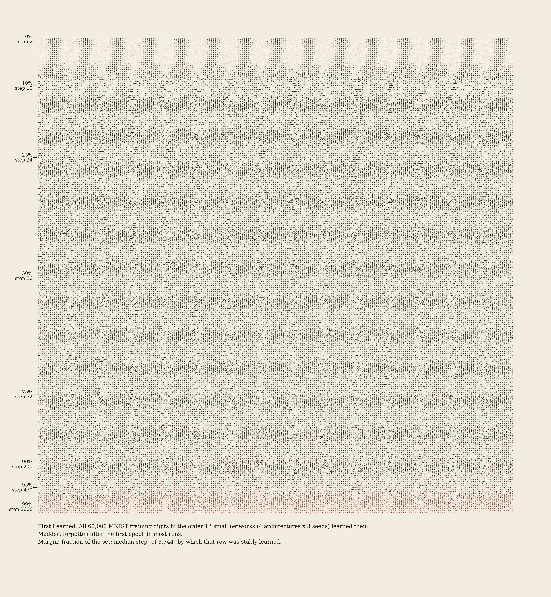
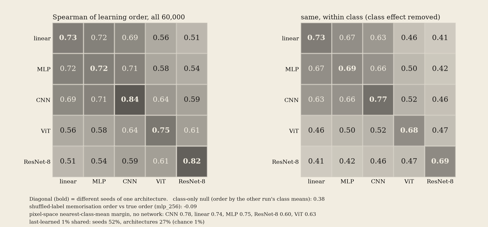
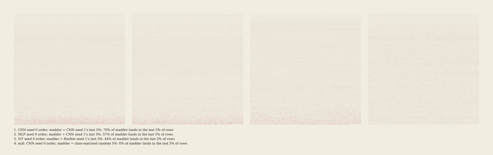
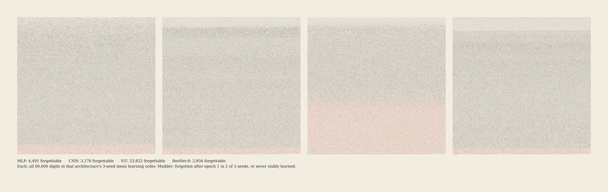
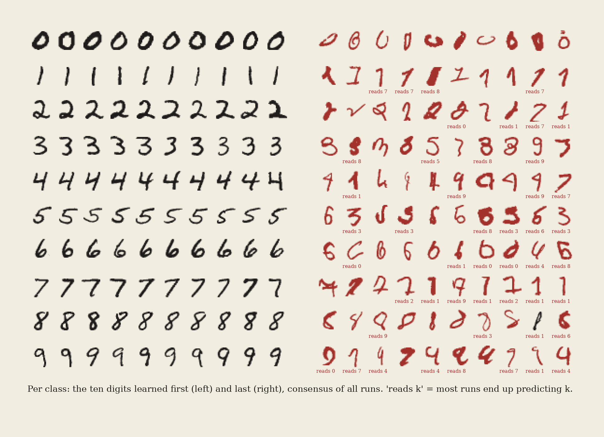
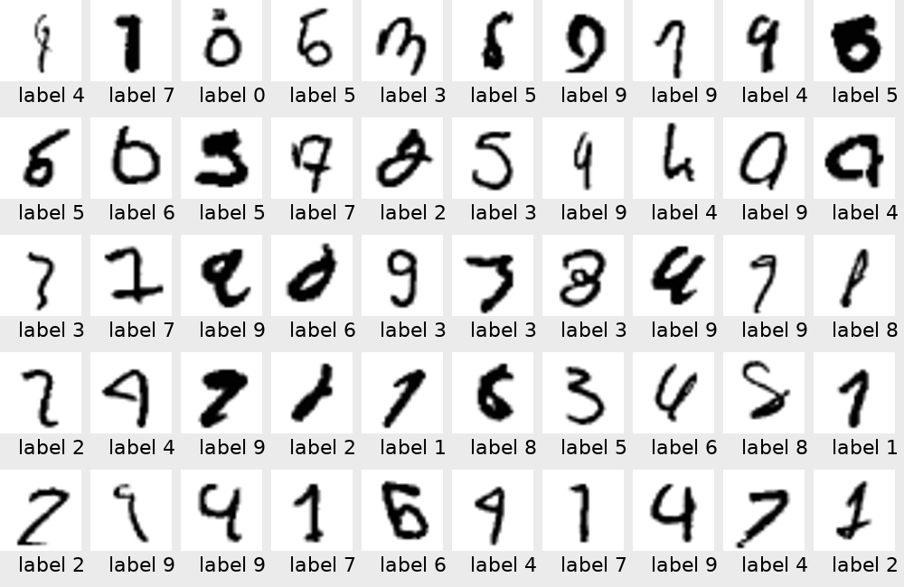
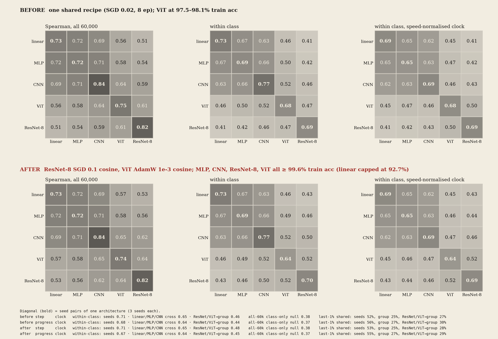

# First Learned

*All 60,000 MNIST training digits, set in the order small networks learned them.*

## The phenomenon

Networks don't learn their training set all at once. Some examples are classified correctly
within a handful of SGD steps and stay that way. Others are learned late, and a few are learned,
forgotten and learned again many times (Toneva et al. 2019, *An Empirical Study of Example Forgetting*).
Jiang et al. (2021) turned this into a per-example "consistency score", and Hacohen, Choshen &
Weinshall (2020, *Let's Agree to Agree*) showed that networks learn examples in a similar order,
most strongly within one architecture and to a lesser degree across architectures.

This piece measures the order on the whole of MNIST's training set and sets it as type: every
digit at its native 28 × 28 pixels, in reading order, with the earliest learned at the top left
and the latest at the bottom right. Then it asks the one-road question: do *different
architectures* learn the same digits first, and how close does that agreement come to the
agreement between two seeds of a single architecture?

## What was measured

- **Runs.** Five models from `one-road/models.py`, used unchanged: linear (logistic regression),
  MLP (784-256-10), CNN (2 conv + 2 FC), ResNet-8 (BatchNorm) and a 4-layer ViT (patch 4, d = 64).
  Three seeds each (the seed sets both the init and the minibatch order). All 60,000 training
  images. One recipe for every model: SGD with momentum 0.9, lr 0.02, batch 128, 8 epochs
  (3,744 steps), no augmentation, no weight decay, TF32 matmuls. There is also one MLP run with
  shuffled labels (20 epochs; memorisation null).
- **Correctness log.** Every run gets a full forward pass over all 60,000 training images,
  predicting labels in eval mode, at a declared grid of steps: every 2 steps up to 100, every 10 up
  to 500, then every 50. That makes 156 evaluations per run. This is **not** Toneva's
  per-presentation bookkeeping, since each example is checked on the whole-set grid rather than
  when its minibatch comes round.
- **Per example.** *first*: first step at which it is correct. *stable*: the step from which it
  stays correct at every later evaluation ("never" if it is wrong at the end). *forgetting events*:
  correct → wrong transitions between consecutive evaluations. The **ordering key** is *stable*,
  with ties broken by the mean correctness over the grid. The hero orders digits by the mean key
  over the 12 non-linear runs (MLP, CNN, ViT, ResNet-8 × 3 seeds).
- **Agreement.** Spearman rank correlation of the ordering key between every pair of runs, over
  all 60,000 digits and also **within class** (the mean over the 10 classes of the within-class
  Spearman, so that "all the 1s come first" can't produce agreement). Also measured: the overlap
  of the last-learned 1 / 5 / 10 %.
- **BatchNorm control.** The first ResNet runs were evaluated in eval mode, using BN running
  statistics. Early in training those statistics lag the weights, so the running-statistics
  ResNet looked slow (median stable step 180–270) and unstable. I re-ran ResNet-8 with evaluation
  on BN *batch* statistics, computed on chunks of 10k without touching the running buffers. That
  changed its numbers: median stable step 50, seed-to-seed Spearman 0.70 → 0.82. Only the
  batch-statistics runs are used below (`resnetbnb`). The confounded runs are kept in
  `cache/runs_bn_running_stats/`.

## Results

| | final train acc | median stable step | unforgettable after epoch 1 |
|---|---:|---:|---:|
| linear | 0.925–0.929 | 4 | 80 % |
| MLP | 0.996–0.998 | 8 | 92 % |
| CNN | 0.997–0.999 | 26–28 | 94 % |
| ResNet-8 | 0.997 | 48–50 | 94–95 % |
| ViT | 0.975–0.981 | 360–440 | 56–61 % |

The MLP's 92 % unforgettable matches Toneva et al.'s MNIST figure (91.7 %). The ViT did not
converge under this shared recipe, so its forgetting is the forgetting of an unfinished learner.

**Learning is front-loaded.** Across the 12 runs, the first 10 % of the set is stably learned by
step 10 (median), 25 % by step 24, 90 % by step 200, 95 % by step 470 and 99 % by step 2,600. The
left margin of the hero carries this ledger. The first 5 % of the mosaic is 1s without exception, and the first 8 % is 99 % 1s.

**Agreement (Spearman, mean over run pairs; diagonal = seeds of one architecture):**

- **Two groups, not one road and not one lane per model.** Linear, MLP and CNN agree with each
  other about as well as with themselves. MLP↔CNN is 0.71 against an MLP seed↔seed of 0.72, and
  MLP↔linear is 0.72. ViT and ResNet-8 each have high seed agreement (0.75, 0.82) but reach the
  others only at 0.51–0.64. They also disagree with each other (0.61). Within class, the
  separation is sharper: the seeds score 0.68–0.77, linear/MLP/CNN cross pairs 0.63–0.67, and
  every pair involving ViT or ResNet 0.41–0.52. So the MLP is **not** the outlier here, unlike in
  one-road's function-space atlas. It sits with the linear model and the CNN. The outliers are the
  two architectures that learn slowest and most differently: the one with residual BatchNorm and
  the one with attention.
- **Nulls, all beaten.** The class-only null (rank every digit by the other run's class mean) gives
  0.38, and every cross-architecture pair exceeds it (lowest 0.51). The within-class numbers, which
  subtract the class effect entirely, are 0.41–0.67 against an expectation of 0. The
  shuffled-label MLP memorised 29.7 % of the relabelled set in 20 epochs. Its memorisation order
  correlates with the true-label order at **−0.09**: what gets memorised first under random labels
  is, if anything, the atypical digit, not the prototypical one.
- **A trivial explanation covers most of the bulk.** A *pixel-space* score with no network in it
  (distance to your own class's mean image minus distance to the nearest other class mean)
  correlates with the learning order at 0.78 for the CNN (its seeds agree at 0.84), 0.75 for the
  MLP and 0.74 for the linear model, but only 0.60 for ResNet-8 and 0.63 for the ViT. Most of what
  the linear/MLP/CNN group "agree on" is prototypicality in pixel space, which fits early training
  being near-linear. Ink mass alone explains nothing (0.14).
- **The tail is shared more widely than the bulk.** Of the last-learned 1 %, seeds share 43–70 %
  (chance 1 %) and architectures share 16–38 %: CNN↔ResNet-8 38 %, CNN↔MLP 37 %, but the pixel
  prototype score only 12–26 %. The hardest digits are hard for every network, and they are not
  simply the pixel outliers.

*Agreement plates.* Each panel is all 60,000 digits in one run's order, drawn in pale ink, with
another run's last-learned 5 % in madder. If the two runs agree, the madder sinks to the bottom
rows. (1) CNN seed 0 vs CNN seed 1: 70 % of the madder lands in the last 5 % of rows.
(2) MLP seed 0 vs CNN seed 1: 57 %. (3) ViT seed 0 vs ResNet-8 seed 1: 44 %. (4) Null, a
class-matched random 5 %: 6 %, spread evenly.

*Becher set.* One mosaic per architecture (3-seed mean order), with forgettable digits in madder
(forgotten after epoch 1 in 2 of 3 seeds, or never stably learned). MLP 4,491, CNN 3,176, ViT
23,822, ResNet-8 2,934. The height of the madder band is the most visible difference between the
four, and ViT's 40 % mostly reflects its unfinished training (see the caveats).

**The last-learned digits.** Below are, per class, the ten learned first (ink) and the ten learned
last. Madder marks digits forgotten in most runs, and "reads k" gives what most networks predict
at the end.

I went through the 50 last-learned digits overall (`gallery/study_last50_labels.png`) by eye:
**about 18 look like a different digit from their label** (a clear 6 labelled 5, 1-like strokes
labelled 7, 4s labelled 9, a 3 labelled 5), **about 23 are ambiguous or malformed** (blotted,
fragmentary, a hooked 4 that is also an h), and **about 9 are legible as labelled but written in an
unusual style** (a dotted 0, a serifed 1, a crossed 7). This is a judgement, not a label audit. The
first-learned digits are uniformly canonical: upright 1s, round 0s, textbook 2s and 7s.

## Declared aesthetic choices

- Cream ground `#F2EDE1`, warm ink `#1E1C1A`, madder `#A3302A`. Each glyph is the raw MNIST pixel
  value used as ink opacity (a faithful glyph, no thresholding, no contrast stretch).
- 245 × 245 grid (60,025 cells, the last 25 empty), 28 px per digit, no gutter. The full-resolution
  hero is 6,860 px square (`cache/hero_full.png`, a 0.80 m print at 8,600 px/m). The gallery copy
  is downsampled 2× with a margin ledger.
- Madder marks a *categorical* flag (forgettable by a declared majority rule), not a continuous
  quantity.
- The agreement plates draw unflagged digits in pale ink (`#C4BCAE`) so that the flagged set is
  the most visible thing.
- The gallery copies of the Becher set and agreement plates are 5,000 px wide. Full-resolution
  versions are in `cache/full_*.png`.
- Measured key (mean luminance): hero 0.85, Becher 0.86, plates 0.91, specimen 0.88. All commit to
  a light key (commitment ≥ 0.35), as CRITIQUE.md asks.

## Self-critique (against CRITIQUE.md), and the iteration

- **First pass:** forgettable meant "forgotten at least once, anywhere". My dense early grid
  counts the volatile first-epoch flicker, which flagged 36 % of the set and turned the bottom 40 %
  of the hero pink: a haze, not a finding. I restricted the count to after epoch 1, which gives
  Toneva-comparable rates (92 % unforgettable for the MLP) and a madder tail in which 3,628 digits (6 %) are
  flagged, 91 % of them in the last 10 % of rows. The subject (late) is now what the colour picks out.
- **First pass:** the agreement plates drew every digit in full ink. At any viewing distance they
  were grey fields with a faint pink bottom. I redrew them with pale unflagged glyphs, and the
  sink-to-the-bottom now reads at thumbnail size. The null panel is visibly uniform.
- The hero had no sense of time, so I added a left-margin ledger (fraction of the set / median
  stable step), which shows that the top quarter of the sheet was learned in the first 24 steps.
- **Still weak:** at thumbnail size the mosaics become an even light-grey texture. The single
  strong event is the band of 1s at the top, with the madder tail as a second. The piece works at
  print scale, where each digit is legible (a Darboven/Becher register), and not as a screen
  image. The Becher set also compares madder-band heights more than orders. A visual form for
  *order disagreement* between architectures beyond the plates is still to be found.

## Prior art

- Toneva et al. 2019 show grids of unforgettable vs most-forgotten MNIST/CIFAR examples. Jiang et
  al. 2021 show high/low C-score examples. Carlini et al. 2019 ("prototypes") and Pleiss et al.
  2020 (AUM, mislabel detection) rank examples similarly.
- Hacohen, Choshen & Weinshall (ICML 2020) already report that learning order is shared across
  seeds and, more weakly, across architectures. The qualitative "architectures agree" finding is
  **not new**.
- I found no whole-training-set mosaic of MNIST ordered by learning time (a web search for
  full-dataset MNIST mosaics ordered by difficulty turned up only manifold-embedding grids).
- New here: (i) the whole-set typographic form with a time ledger; (ii) the split into a
  linear/MLP/CNN group that agrees at the seed ceiling and ViT/ResNet lanes that do not, measured
  within class; (iii) the pixel nearest-class-mean baseline, which reaches 0.78 against the CNN
  and so explains most of the shared bulk order, while the shared *tail* is not explained by it;
  (iv) the BatchNorm eval-statistics artefact, which would have manufactured an extra "ResNet lane"
  on its own.

## Caveats

- One recipe (SGD 0.02) for every model. The ViT is under-trained (97.8 % train accuracy) and the
  slow learners are exactly the ones that disagree, so "lanes" may partly be "learning speed".
  Tuning each architecture to converge at a matched rate is the obvious control. It was not run.
- There is only one shuffled-label run (MLP), and it memorised just 30 % of the set.
- Stable-step ties at the earliest steps are broken by mean correctness over the declared grid.
  The grid is denser early on, which weights early behaviour.
- The mislabel count is my own reading of 50 images.

## Compute

33 pasar jobs, ids 935–967 (`--by art-firstlearned`, tag `art-first-learned`, `--mem 4G`
sharing, up to 13 at once). The sum of job run times is 156 job-minutes (2.6 job-hours). About
17 of those minutes went to a first attempt, cancelled because evaluating every step was too
slow, and 36 to the BatchNorm control. The GPU was occupied for **24 min wall clock** (19:32 to
19:58 EDT). All GPU work finished by 19:58. Everything else (analysis, rendering) ran on CPU.

## Files

`train.py` (one run) · `submit.sh` (one pasar job per run) · `analyze.py` → `cache/stats.npz`,
`cache/agreement.json`, `logs/analyze.txt` · `render.py` (hero, Becher, agreement plates, specimen)
· `plate_agreement.py` (table) · `contact_sheet.py`.

## Next moves

1. **The control that decides lanes vs speed:** retune the ViT and ResNet-8 (Adam or a higher lr)
   so that every architecture reaches ~99.5 % train accuracy at a similar step, then re-measure
   within-class agreement. If ViT/ResNet join the group, the lanes were learning speed.
2. Fashion-MNIST and CIFAR-10 subsets. The pixel-prototype baseline should fail there, which
   tests whether the linear/MLP/CNN agreement survives once prototypicality stops explaining it.
3. A print of the hero at 6,860 px (0.8 m), plus a second print ordered by the ViT's own order,
   hung side by side as a pair.

## References

Toneva et al., *An Empirical Study of Example Forgetting during Deep Neural Network Learning*,
ICLR 2019. Jiang, Zhang, Talwar & Mozer, *Characterizing Structural Regularities of Labeled Data in
Overparameterized Models*, ICML 2021. Hacohen, Choshen & Weinshall, *Let's Agree to Agree: Neural
Networks Share Classification Order on Real Datasets*, ICML 2020 (arXiv:1905.10854). Pliushch et
al., *When Deep Classifiers Agree*, 2022. Carlini, Erlingsson & Papernot, *Prototypical Examples
for Deep Learning*, 2019. Pleiss et al., *Identifying Mislabeled Data using the Area Under the
Margin Ranking*, NeurIPS 2020.

## Follow-up (2026-09-26 night): lanes or learning speed?

**Question.** Were the two groups ({linear, MLP, CNN} vs ResNet-8 and ViT, each on its own) just
a matter of learning speed? The ViT was under-trained (97.5–98.1 % train accuracy) and both
outliers learn slowly early on.

**What was run.** I retuned ResNet-8 and ViT with 3 seeds each. The seeds, minibatch order,
evaluation grid and BN batch-statistics evaluation are the same as before.
`followup_train.py` is `train.py` plus an optimiser/schedule option, and writes to
`cache/runs_followup/`.
- ResNet-8: SGD with momentum, lr 0.1, 100-step warmup, cosine to 0, 8 epochs. Final train
  accuracy 99.92–99.94 %, reaching 99.5 % at step 1,550–1,600.
- ViT: AdamW, lr 1e-3, no weight decay, 200-step warmup, cosine to 0, 10 epochs. Final train
  accuracy 99.71–99.80 %, reaching 99.5 % at step 3,600–3,750. Test accuracy 97.4–97.8 %.
- MLP and CNN were reused because they already clear the bar: 99.64–99.85 %, reaching 99.5 % at
  steps 2,850–2,900 and 1,800–1,950. So every network reaches 99.5 % within a factor of about
  2.4 in steps. Linear is reused too, but a linear model is capped at 92.7 %.

**Speed-normalised clock** (`followup_analyze.py`). Each run's progress is
p(t) = cummax train acc(t) / its own final train acc. The correctness matrix is resampled at
the first evaluation where p reaches each rung of a fixed ladder: error-to-go 1 − p geometric
from 0.9 to 0.002, 60 rungs plus the final evaluation. Every run is then read on the same
progress grid at the same resolution. The key is (stable rung, −mean correctness over the
ladder).
- Relabelling a run's time with any monotone function would leave every Spearman unchanged.
  The ladder changes something else: it matches resolution and weighting across runs, and
  therefore changes ties and tie-breaks. That is where a fast learner's order is coarsest.
- Check: `followup_analyze.py` on the original runs reproduces `logs/analyze.txt` exactly on
  the step clock.

**Result: the groups survive. The lanes are not learning speed.** All numbers are mean
Spearman over run pairs.

| within-class Spearman | seeds (same arch) | linear/MLP/CNN cross | ResNet/ViT → linear/MLP/CNN | ResNet ↔ ViT |
|---|---:|---:|---:|---:|
| before, step clock | 0.71 | 0.65 | 0.46 | 0.47 |
| before, progress clock | 0.68 | 0.64 | 0.44 | 0.50 |
| **after, step clock** | 0.71 | 0.65 | **0.48** | 0.52 |
| **after, progress clock** | 0.67 | 0.64 | **0.45** | 0.52 |

Other statistics after retuning:
- **All 60,000:** ResNet/ViT → group 0.59 (step clock) / 0.56 (progress clock), against 0.71 /
  0.68 for the group's own cross pairs.
- **Class-only null:** 0.38 / 0.37.
- **Seed-seed baselines:** ResNet 0.70, ViT 0.64 within class.

Retuning moved the ResNet/ViT-to-group agreement by +0.02 on the step clock and +0.01 on the
progress clock. The gap to the group (≈0.18–0.19 within class) is unchanged. Getting the ViT
from 98 % to 99.8 % did not pull it toward the group. Its seed agreement fell a little
(0.68 → 0.64), and ResNet ↔ ViT rose slightly (0.47 → 0.52).

**The tail stays shared, as before.** Of the last-learned 1 %, ResNet/ViT share 28–29 % with
the group, which is no less than the group shares internally (25–27 %). Seeds share 53–55 %.
The split is in the *bulk* order, not in which digits are hardest.

**Caveats.**
- The retuned ResNet still has a median stable step of about 50 and the ViT about 280, against
  26–28 for the CNN. Early speed was not matched in steps. It is factored out only by the
  progress clock.
- Each architecture got one retune, and the optimisers now differ (AdamW for the ViT).
- 3 seeds, so the pair means carry roughly ±0.02 of spread.

*Before vs after.* The plate uses the same ink-on-cream treatment as `agreement_table.png`:
cell ink alpha is value², and the bold diagonal is seed pairs. Rows are before and after
retuning. Columns are all 60,000 digits, within class, and within class on the progress clock.
The pale ResNet/ViT band stays in every panel.

**Compute.** 6 pasar jobs, 968–973 (`--by art-lanes`, tag `art-first-learned`, `--mem 4G`
sharing). Run times are 3 × 11.1 min (ViT) + 3 × 12.4 min (ResNet), 70 job-minutes in total.
Wall clock was 20:06:47–20:19 EDT, and all GPU work was done by 20:19. The analysis and plate
ran on CPU.

**Files.** `followup_train.py`, `followup_submit.sh`, `followup_analyze.py` →
`cache/followup/agreement_followup.json` and `logs/followup_analyze.txt`, `followup_plate.py`,
and `logs/followup_jobs.jsonl`.
