# Bulk and Outliers: Hessian spectra as spectroscopic plates

*Train a network to tell C digits apart, then shine a light through its loss curvature: a huge, blurred bulk plus a few sharp isolated lines. In our runs there are **C − 1** lines, not C.*

<p align="center">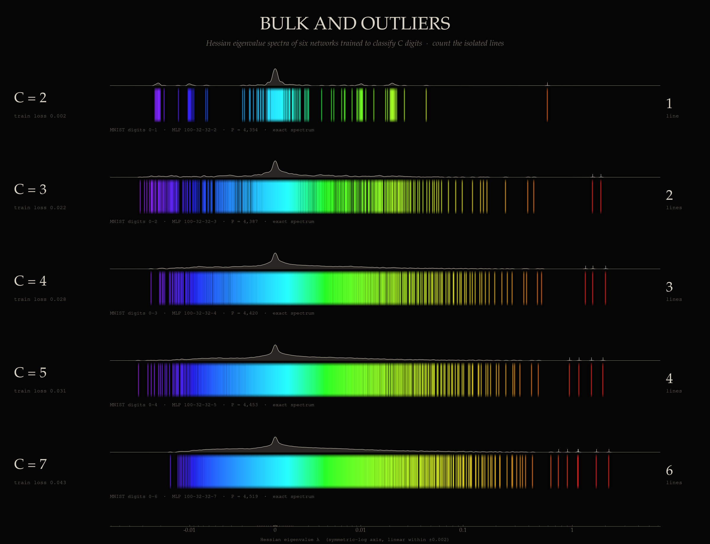</p>

## The phenomenon

For a classifier with parameters θ ∈ ℝ^P and mean cross-entropy loss L, the Hessian H = ∇²L splits (Gauss–Newton) into

  H = G + E,  G = (1/N) Σᵢ Jᵢᵀ (diag pᵢ − pᵢpᵢᵀ) Jᵢ,  E = (1/N) Σᵢ Σ_c (∂L/∂z_c) ∇²z_c,

where Jᵢ is the logit Jacobian and pᵢ the softmax output. Empirically (Sagun et al. 2017; Papyan 2019, 2020) the spectrum of H is a **bulk** of P eigenvalues near zero (both signs) plus a handful of **outliers**. Papyan explains the outliers through the class structure of G: writing G via the per-class, per-logit mean gradients d_{c,c'}, the class means d_c = Ave_{c'≠c} d_{c,c'} give a low-rank piece G₁ = (C−1)/C · Σ_c d_c d_cᵀ whose eigenvectors are the outlier directions. The folk caption is "count the lines, count the classes".

We measured the count directly, for C = 2, 3, 4, 5, 7, 10, with two independent routes (exact diagonalisation of a small MLP, and Lanczos on a 118k-parameter MLP). **We identify an outlier as a top eigenvector of H whose squared projection onto span{d_1…d_C} exceeds 0.5.** Result: **1, 2, 3, 4, 6, 9 outliers, i.e. C − 1, in all 12 cases.**

## Gallery

### Class-count plates (exact spectra, P ≈ 4.4k–4.6k)
Each strip is the full spectrum of one network: every eigenvalue is a Gaussian line (σ = 1.3 px) on a symmetric-log dispersion axis (linear within ±2·10⁻³); the plate darkens as 1 − exp(−density/0.7), so single eigenvalues stay visible and the bulk saturates. The tracing above each strip is log(1 + count per column), kernel σ = 2.5 px. Hue follows x-position (a declared spectroscope idiom, **not** a measured quantity). Tick marks above the tracing = the measured outliers.

<table><tr>
<td><br><sub><b>emission</b>: lines glow on black.</sub></td>
<td>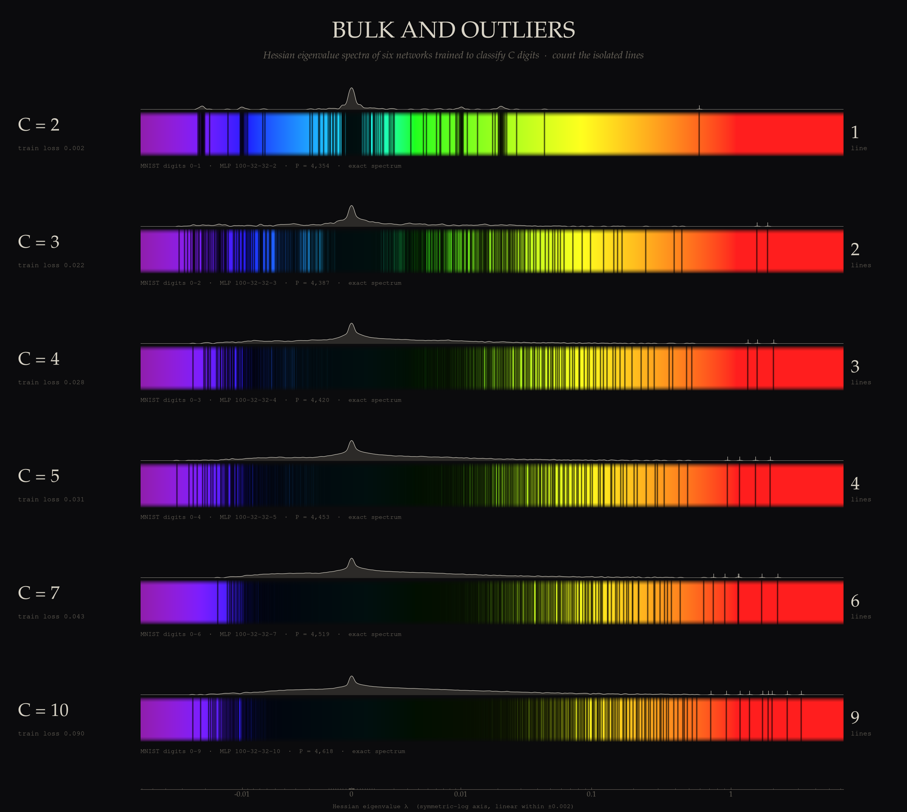<br><sub><b>absorption</b>: the same exposure subtracted from a continuum (Fraunhofer idiom).</sub></td>
</tr><tr>
<td>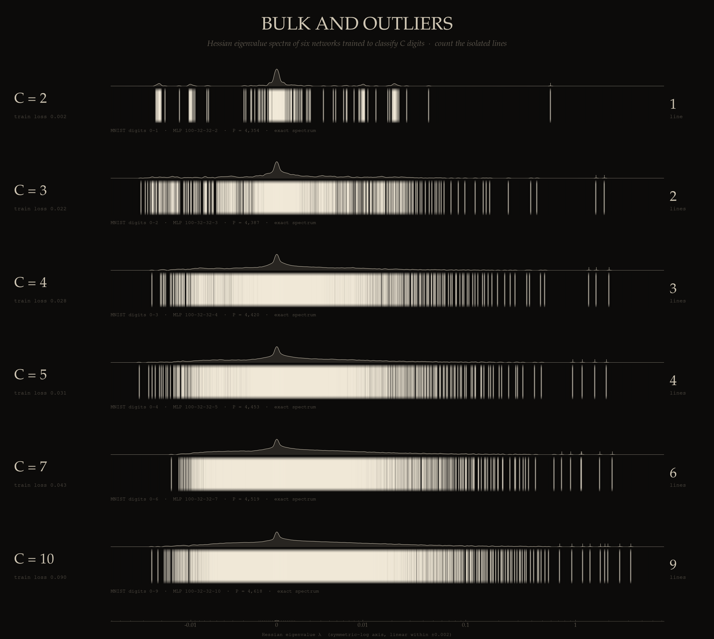<br><sub><b>silver</b>: monochrome glass plate.</sub></td>
<td>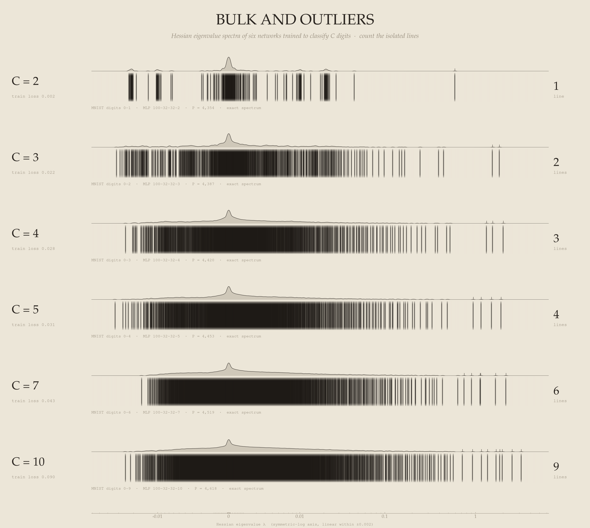<br><sub><b>negative</b>: paper print of the plate.</sub></td>
</tr></table>

Same four styles for the 784-128-128-C MLP from Lanczos (only the 200 Ritz values exist, so the bulk is sparse and incomplete; the top of the spectrum is converged): [emission](gallery/plates_lanczos_emission.png) · [absorption](gallery/plates_lanczos_absorption.png) · [silver](gallery/plates_lanczos_silver.png) · [negative](gallery/plates_lanczos_negative.png).

### The class-count ladder
<table><tr>
<td>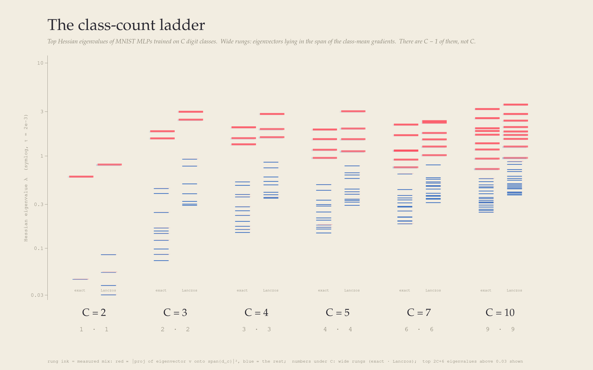<br><sub><b>riso</b>: rungs = top 2C+6 eigenvalues (λ > 0.03) of both routes. Ink is a measured mix: red ∝ overlap of the eigenvector with span{d_c}, blue ∝ the rest. Wide rungs = outliers. Misregistration is aesthetic.</sub></td>
<td>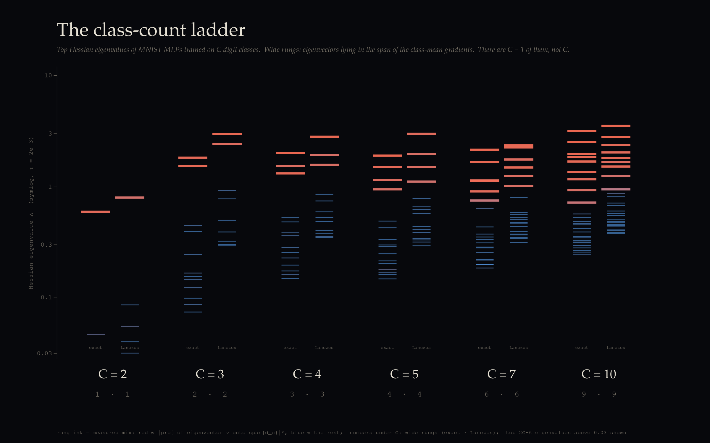<br><sub><b>night</b>: same data, colour = linear red/blue mix by overlap.</sub></td>
</tr></table>

### Barcodes and gel
<table><tr>
<td>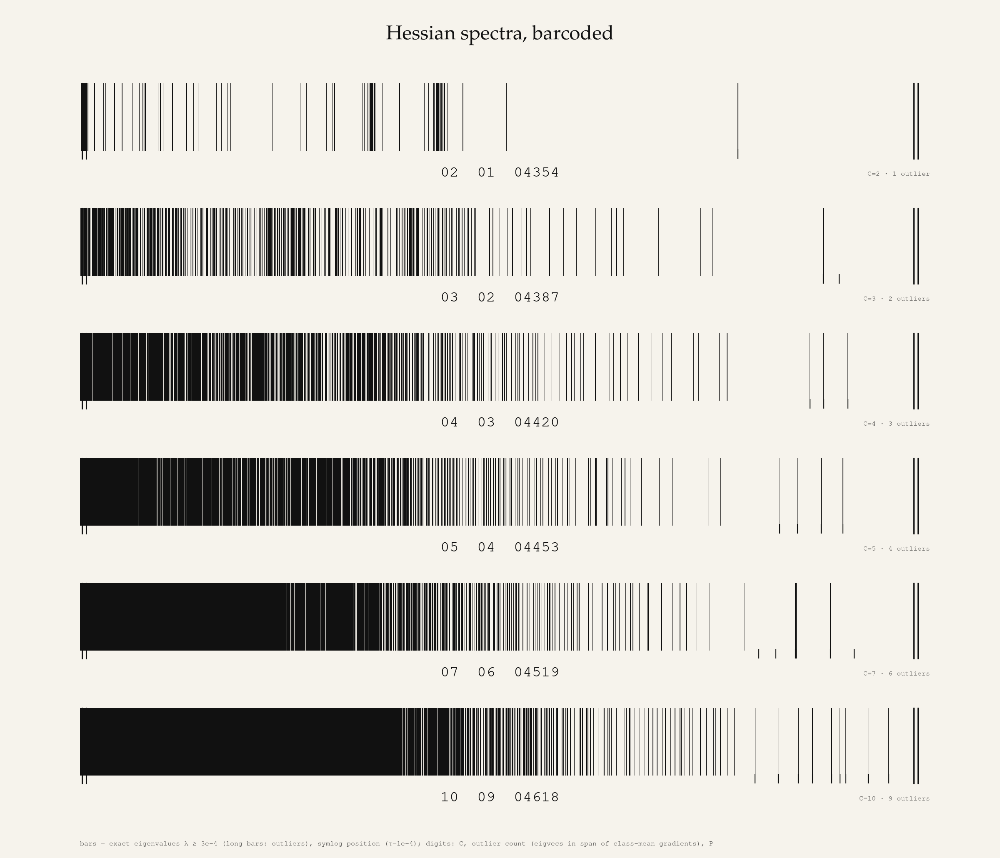<br><sub><b>barcode, paper</b>: every exact eigenvalue ≥ 3·10⁻⁴ is a hairline bar (symlog, τ = 10⁻⁴; crop declared); outlier bars drop below the code like EAN guard bars. Digits: C, outlier count, P.</sub></td>
<td>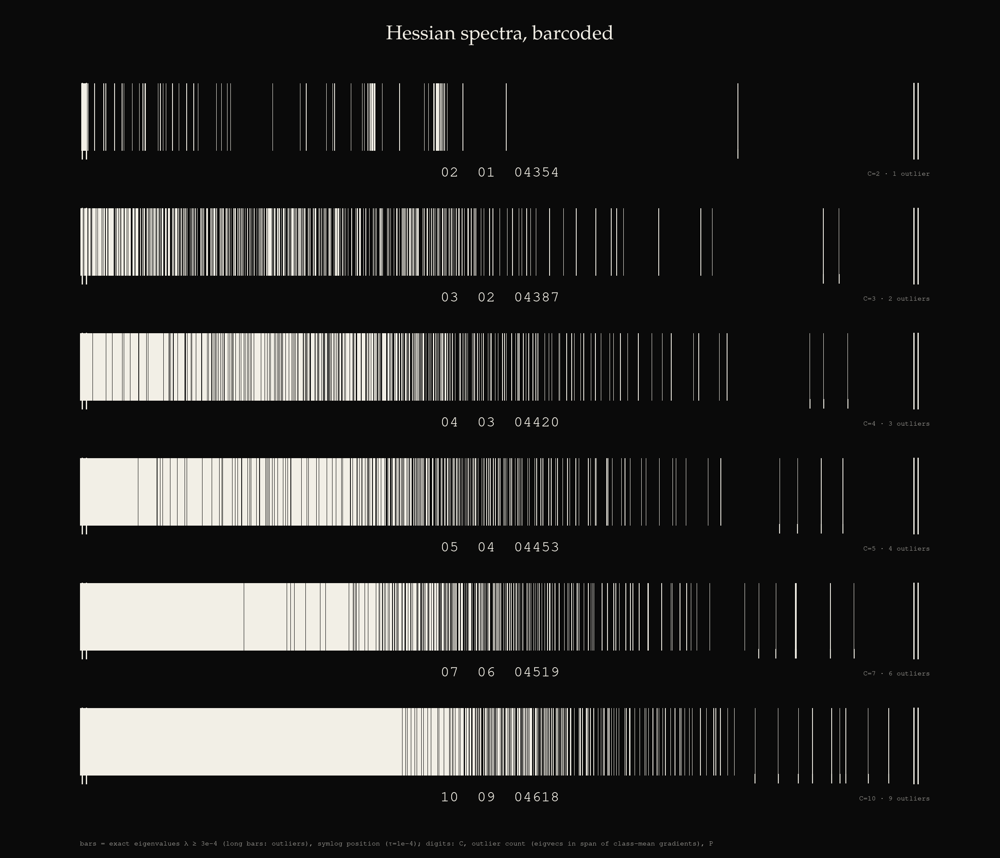<br><sub><b>barcode, night</b>.</sub></td>
<td width="28%">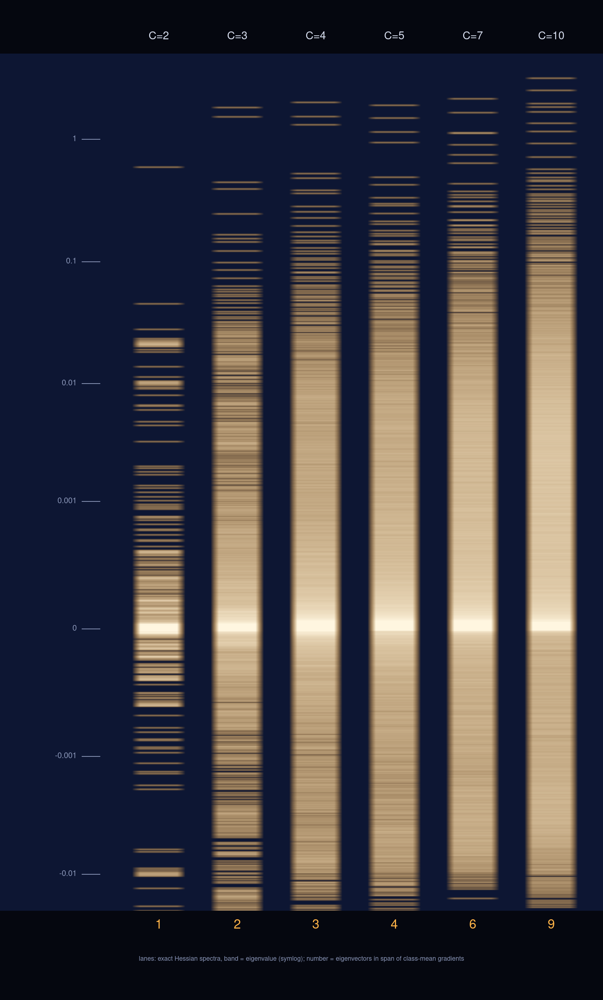<br><sub><b>gel</b>: full spectra as electrophoresis lanes (large λ at top, symlog τ = 10⁻⁴); band brightness = 0.55·exposure + 0.45·log density (declared tone curve).</sub></td>
</tr></table>

### Spectrograph over training (C = 10, exact spectra at 49 log-spaced checkpoints)
<p align="center"><video src="gallery/spectrograph_film_split.mp4" autoplay loop muted playsinline width="92%"></video></p>

Rows are training time on a log(step+1) axis (step 0 at top), columns the symlog eigenvalue (τ = 10⁻⁴). Between checkpoints the sorted eigenvalue lists are linearly interpolated in symlog space (a declared tween; the zig-zags come from real checkpoint-to-checkpoint changes). Tone = 0.6·(1 − exp(−density/0.7)) + 0.4·log(1+density)/log 61.

<table><tr>
<td>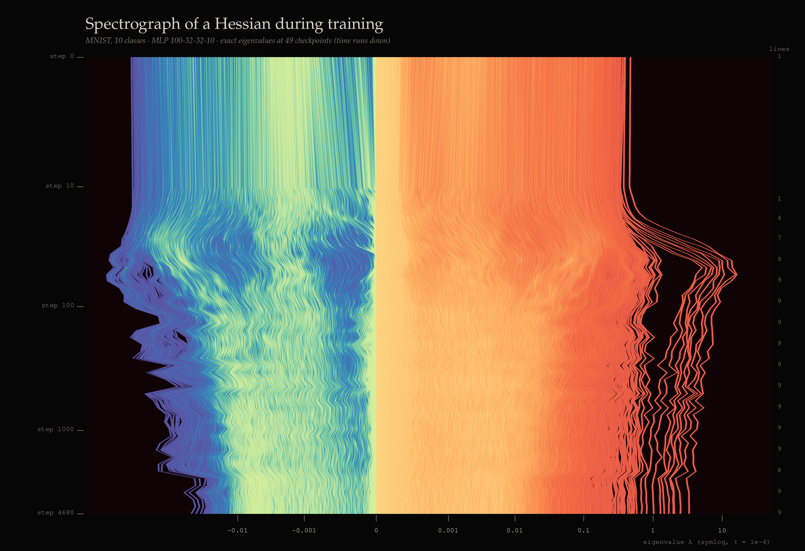<br><sub><b>Sohl-Dickstein Spectral split</b>: signed field sign(λ)·log(1+density), each side rank-normalised separately (<code>palettes.render_split</code>, 'sd_spectral'); λ < 0 purple half, λ > 0 red half; empty spectrum = dark ends. Declared aesthetic mapping.</sub></td>
<td>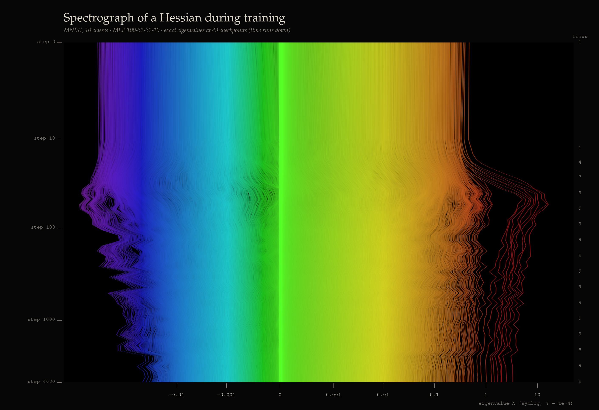<br><sub><b>spectroscope hue</b>: hue by x-position (aesthetic).</sub></td>
</tr><tr>
<td>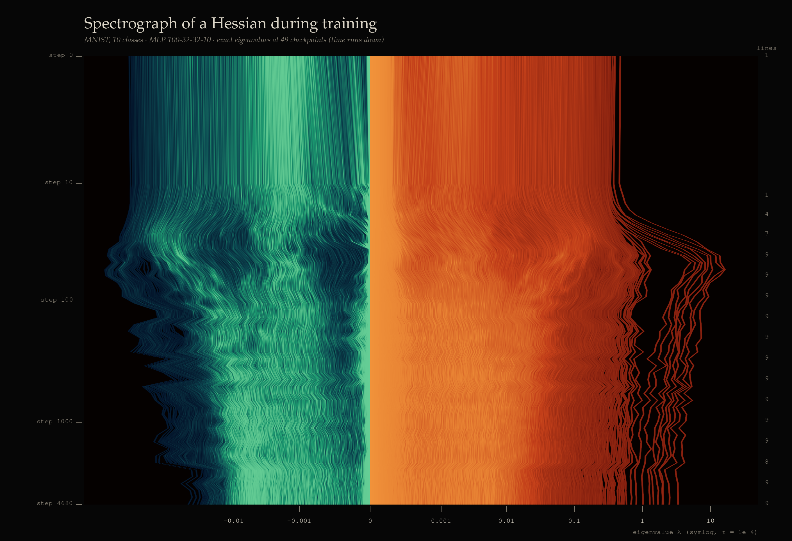<br><sub><b>palettes.py 'aurora_ember'</b> split pairing, same normalisation.</sub></td>
<td>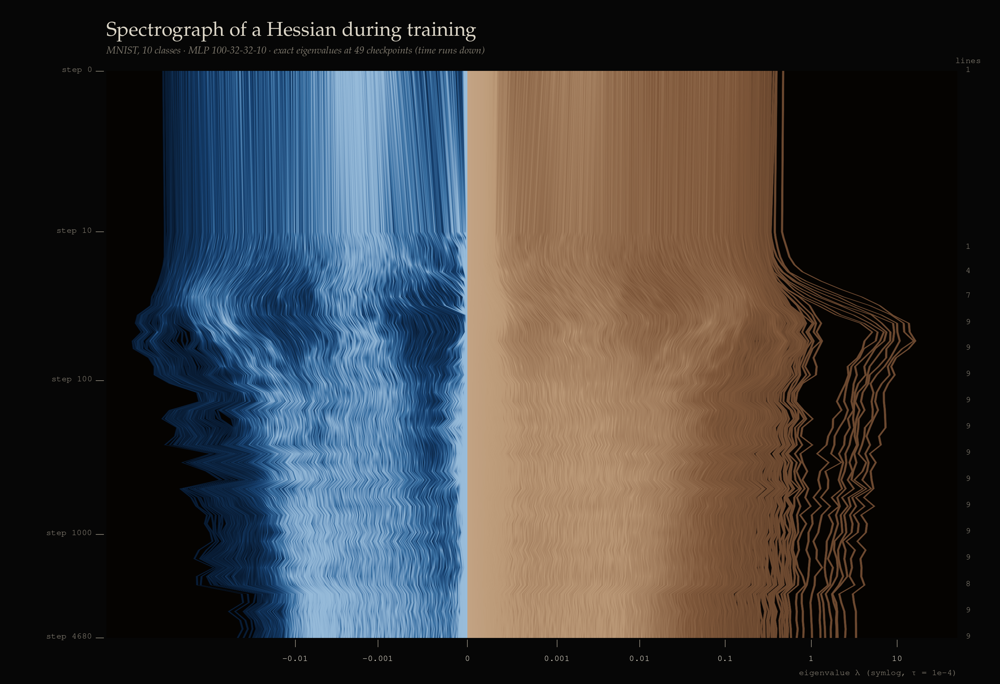<br><sub><b>palettes.py 'cyanotype_vandyke'</b> split pairing.</sub></td>
</tr><tr>
<td>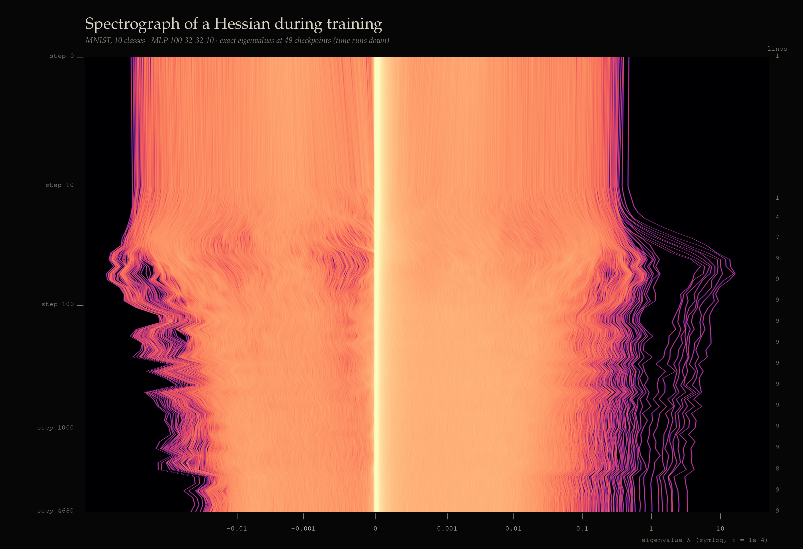<br><sub><b>magma</b> on the tone value.</sub></td>
<td>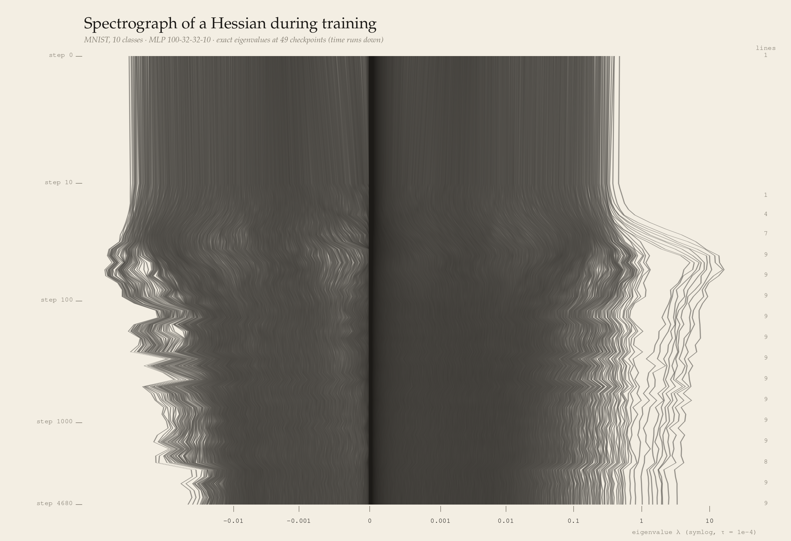<br><sub><b>paper</b>: single ink. (<a href="gallery/spectrograph_silver.png">silver</a> also rendered.)</sub></td>
</tr></table>

Films: [spectrograph_film_split.mp4](gallery/spectrograph_film_split.mp4) / [.gif](gallery/spectrograph_film_split.gif) (8.7 MB), [spectrograph_film.mp4](gallery/spectrograph_film.mp4) / [.gif](gallery/spectrograph_film.gif) (10.2 MB, hue style). 1920×1080, 30 fps, 26 s (720 frames + 72-frame hold), H.264 yuv420p, silent.

What the film shows (from `cache/exact/film_mlps_C10_pc200`): through step 17 there is a single class-mean line (λ_max ≈ 0.5). Then the lines split off in quick succession: 4 at step 19, 5 at 22, 7 at 25–28, and 9 from step 32 onward, at every later checkpoint except step 2135 (8). During the same early burst λ_max grows 30× (0.47 → 16.3 at step 55) and the most negative eigenvalue reaches −0.79. Both relax during the lr = 0.05 phase (λ_max ≈ 4–5, λ_min ≈ −0.1 to −0.3). After the learning-rate drop at step 2340 the negative side contracts to ≈ −0.04 and λ_max settles at 3.3.

## What was computed

| | class-count series, exact | class-count series, Lanczos | film |
|---|---|---|---|
| data | MNIST train, digits 0…C−1, avg-pooled to 10×10 | MNIST train, digits 0…C−1, 28×28 | MNIST 10×10, C=10 |
| model | MLP 100-32-32-C, ReLU (P = 4,354 … 4,618) | MLP 784-128-128-C (P = 117,250 … 118,282) | MLP 100-32-32-10 |
| training | SGD, momentum 0.9, lr 0.05, wd 5e-4, batch 128, 10 epochs, lr ×0.1 at 1/2 and 3/4; seed 0 | same, lr 0.02 | same, 49 log-spaced checkpoints |
| Hessian subset | 500 training images per class (N = 250C … 5000) | same | 200 per class (N = 2000) |
| spectrum | full H, G (and E) built column-by-column from vmapped float64 HVP/GN-VPs, `torch.linalg.eigh` | top-k Lanczos, m_top = 200 iterations, full reorthogonalisation, float64; SLQ m_slq = 80 iterations × nv = 4 Rademacher probes | full H, float64 |
| wall (CPU, 4 threads, contended) | 3–14 min per network | 2–13 min per network | ~25 s per checkpoint (49 checkpoints) |

Class-mean gradient directions d_c and the Papyan G₀/G₁/G₁₊₂ eigenvalues are computed from the per-class, per-logit mean gradients d_{c,c'} (`common.papyan_decomposition`). Overlaps ov_k = ‖Π_span{d_c} u_k‖² (QR of the C vectors). **GPU time: 0** (the shared GPU was saturated; everything ran on CPU).

Precision floor: all spectra in float64; the smallest |λ| drawn (≈10⁻⁶ on the τ = 10⁻⁴ plates) is well above eigh round-off (~10⁻¹³·‖H‖).

Reproduce (from this directory, `PY=/home/fzeng/ml/research/art/.venv/bin/python`):
```
./run_train_series.sh                 # 12 series networks + film run (train.py)
./run_exact_series.sh                 # exact_analyze.py --run s_mlps_C{C} --E
./run_lanczos_series.sh               # analyze.py --run s_mlp_C{C} --m_top 200 --m_slq 80 --nv 4 --per_class 500
./run_film.sh                         # exact_analyze.py --run film_mlps_C10 --steps all --per_class 200 --noG --kvec 12
$PY verify.py                         # table below (also cache/verify.json, cache/verify_table.md)
$PY render_plates.py; $PY render_plates.py --src lanczos
$PY render_ladder.py; $PY render_barcode.py; $PY render_slq.py
$PY render_film.py --stills --film; $PY render_film.py --film --film_style split
```

## Verification

### Outlier count vs C
Selected columns of `verify.py`. k_span = number of leading eigenvectors with overlap > 0.5 onto span{d_c}. Chance overlap for a random direction is C/P ≈ 10⁻³ (exact) or 10⁻⁵ (Lanczos).

| route | C | P | train loss (subset) | **k_span** | = C−1? | overlap of k-th / (k+1)-th eigvec | widest-log-gap count | that gap λ_k/λ_{k+1} | runner-up gap |
|---|---|---|---|---|---|---|---|---|---|
| exact | 2 | 4,354 | 0.0024 | **1** | yes | 0.90 / 0.30 | 1 | 13.12 | k=2: 1.62 |
| exact | 3 | 4,387 | 0.0216 | **2** | yes | 0.92 / 0.10 | 2 | 3.43 | k=4: 1.60 |
| exact | 4 | 4,420 | 0.0279 | **3** | yes | 0.92 / 0.04 | 3 | 2.51 | k=1: 1.31 |
| exact | 5 | 4,453 | 0.0308 | **4** | yes | 0.84 / 0.04 | 4 | 1.92 | k=2: 1.30 |
| exact | 7 | 4,519 | 0.0433 | **6** | yes | 0.70 / 0.17 | 7 | 1.47 | k=2: 1.46 |
| exact | 10 | 4,618 | 0.0901 | **9** | yes | 0.73 / 0.13 | 8 | 1.29 | k=2: 1.28 |
| Lanczos | 2 | 117,250 | 0.0008 | **1** | yes | 0.80 / 0.07 | 1 | 9.38 | k=2: 1.57 |
| Lanczos | 3 | 117,379 | 0.0082 | **2** | yes | 0.87 / 0.10 | 2 | 2.63 | k=4: 1.56 |
| Lanczos | 4 | 117,508 | 0.0099 | **3** | yes | 0.83 / 0.04 | 3 | 1.83 | k=1: 1.46 |
| Lanczos | 5 | 117,637 | 0.0114 | **4** | yes | 0.78 / 0.04 | 1 | 1.53 | k=4: 1.42 |
| Lanczos | 7 | 117,895 | 0.0122 | **6** | yes | 0.84 / 0.02 | 7 | 1.37 | k=2: 1.29 |
| Lanczos | 10 | 118,282 | 0.0204 | **9** | yes | 0.64 / 0.24 | 8 | 1.32 | k=1: 1.26 |

* **The count is threshold-robust.** The k-th overlap is ≥ 0.64 and the (k+1)-th ≤ 0.30 in every case, so any threshold in (0.30, 0.64) gives the same C − 1.
* **Counting by eye (widest multiplicative gap) is not reliable.** It agrees with C − 1 for C ≤ 4, then fails: at C = 7 and 10 the widest gap is barely larger than the runner-up (1.47 vs 1.46, 1.29 vs 1.28), and at Lanczos C = 5 it says 1. For C ≥ 7 the outliers merge with the top of the bulk in magnitude and are only separable through their eigenvectors. The plates are captioned with the eigenvector count and say so.
* **Magnitudes vs directions.** Papyan's G₁ eigenvalues are 10–30× smaller than the H outliers, although the directions match. At low loss the within-class gradient variance adds along the same directions.

### Why C − 1 and not C
The C class-mean directions do span C dimensions, but they are anti-correlated. Their mean pairwise cosine is −0.62, −0.34, −0.23, −0.17, −0.11, −0.07 for C = 2…10, against −1/(C−1) for a perfect simplex. ‖Σ_c d_c‖ / √(Σ_c ‖d_c‖²) is 0.57–0.65 (0 for a simplex, 1 for orthogonal). So G₁ has C − 1 strong "contrast" directions and one weaker common-mode direction: its C-th eigenvalue is only 0.18–0.55 of the (C−1)-th. That C-th direction never produces a separated H outlier in our runs. The eigenvector just after the outliers has overlap ≤ 0.30. A plausible mechanism, which we did not test separately: diag p − ppᵀ annihilates the all-ones logit direction, so each sample's Gauss–Newton term has rank ≤ C − 1, and the common-mode class-mean direction gets only the residual curvature.

**Against the literature.** Sagun et al. (2017) report that the outliers depend on the data (more clusters, more outliers). Papyan (2019, 2020) attributes them to the class means of the logit derivatives, which is usually summarised as "C outliers". The abstracts we checked do not state the exact count. A search summary claimed Papyan predicts C − 1 strong outliers plus a smaller C-th, but we could not confirm that in the text, so treat it as unverified. What we can say is that in *our* MNIST MLPs, trained to low loss with a Hessian computed on training data, the C-th direction is too weak to separate from the bulk. The caption "count lines = count classes" would be off by one here.

### SLQ smoothing
<p align="center">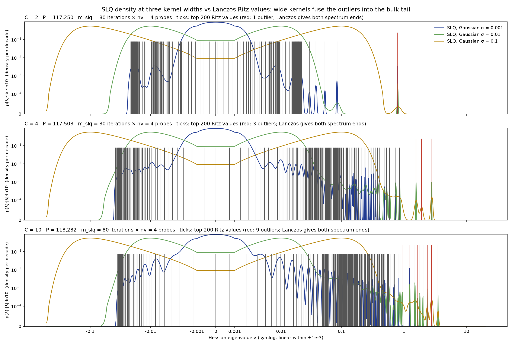</p>

SLQ density (m_slq = 80, nv = 4) at Gaussian kernel widths σ = 10⁻³, 10⁻², 10⁻¹ against the Lanczos Ritz values (Lanczos C = 2, 4, 10). At σ = 10⁻³ the outliers are resolved as separate peaks. At σ = 10⁻² the C = 10 outliers begin to fuse into the tail. At σ = 10⁻¹ everything below λ ≈ 0.1 is a single hump, and the density near 0 is dominated by the kernel, not the data. None of the art plates use SLQ densities: they draw exact eigenvalues (or Ritz values) as σ = 1.3 px lines, and every smoothing kernel is stated in its caption.

### What didn't work / negatives
* The widest-gap outlier count (above) fails for C ≥ 5–7.
* The first spectrograph tone curve (pure exposure) saturated the bulk into a flat ramp that hid all training dynamics. We replaced it with the declared exposure + log-density mix.
* No fractal or self-similar structure is claimed. The bulk texture in the spectrograph is interpolation between 49 checkpoints, not a scale-invariant pattern.

## Caveats
* **Symlog axis.** Eigenvalues are negative as well as positive (1,240 of 4,618 negative at C = 10, min −0.025). Every dispersion axis is sign(λ)·log₁₀(1 + |λ|/τ), with τ = 2·10⁻³ on the plates and ladder, and 10⁻⁴ on the barcode, gel and spectrograph. Positions within ±τ are linear, and the apparent width of the bulk depends on τ.
* **Small models.** The exact spectra come from 10×10 MNIST and a 4.6k-parameter MLP. The Lanczos route (28×28, 118k parameters) agrees on the count, but neither is a CNN, CIFAR, or a network at the interpolation threshold. Loss rises with C (0.002 → 0.09 on the exact series), so C and "how converged" are confounded.
* **One seed per C**, and the Hessian is computed on a 500-per-class training subset, not the full training set.
* **Lanczos plates show 200 Ritz values**, not the full bulk. Only the converged top of the spectrum is meaningful there.
* **Colour is aesthetic** except in the ladder, where red/blue ink is the measured overlap. The Spectral split and palettes.py variants are rank-normalised per side: a declared mapping of sign(λ) × log density.
* The spectrograph interpolates sorted eigenvalue lists between checkpoints. Individual "threads" are rank-order traces, not tracked eigenvectors.

## References
* L. Sagun, U. Evci, V. U. Güney, Y. Dauphin, L. Bottou. *Empirical Analysis of the Hessian of Over-Parametrized Neural Networks.* arXiv:1706.04454 (2017).
* L. Sagun, L. Bottou, Y. LeCun. *Eigenvalues of the Hessian in Deep Learning: Singularity and Beyond.* arXiv:1611.07476 (2016).
* V. Papyan. *Measurements of Three-Level Hierarchical Structure in the Outliers in the Spectrum of Deepnet Hessians.* ICML 2019, arXiv:1901.08244.
* V. Papyan. *Traces of Class/Cross-Class Structure Pervade Deep Learning Spectra.* JMLR 21 (2020), arXiv:2008.11865.
* B. Ghorbani, S. Krishnan, Y. Xiao. *An Investigation into Neural Net Optimization via Hessian Eigenvalue Density.* ICML 2019 (SLQ for deep-net Hessians).
* G. Golub, G. Meurant. *Matrices, Moments and Quadrature with Applications* (2010) (SLQ).
* J. Sohl-Dickstein. *The boundary of neural network trainability is fractal* (2024), github.com/Sohl-Dickstein/fractal (Spectral split idiom).
