# Invariant Tori: two learners on the energy 3-sphere

*Two players learning rock–paper–scissors conserve an energy. Each orbit therefore lives on a 3-dimensional surface that can be mapped exactly into ℝ³, so the tori and chaotic seas of their learning can be drawn in space rather than as a projection.*

<p align="center">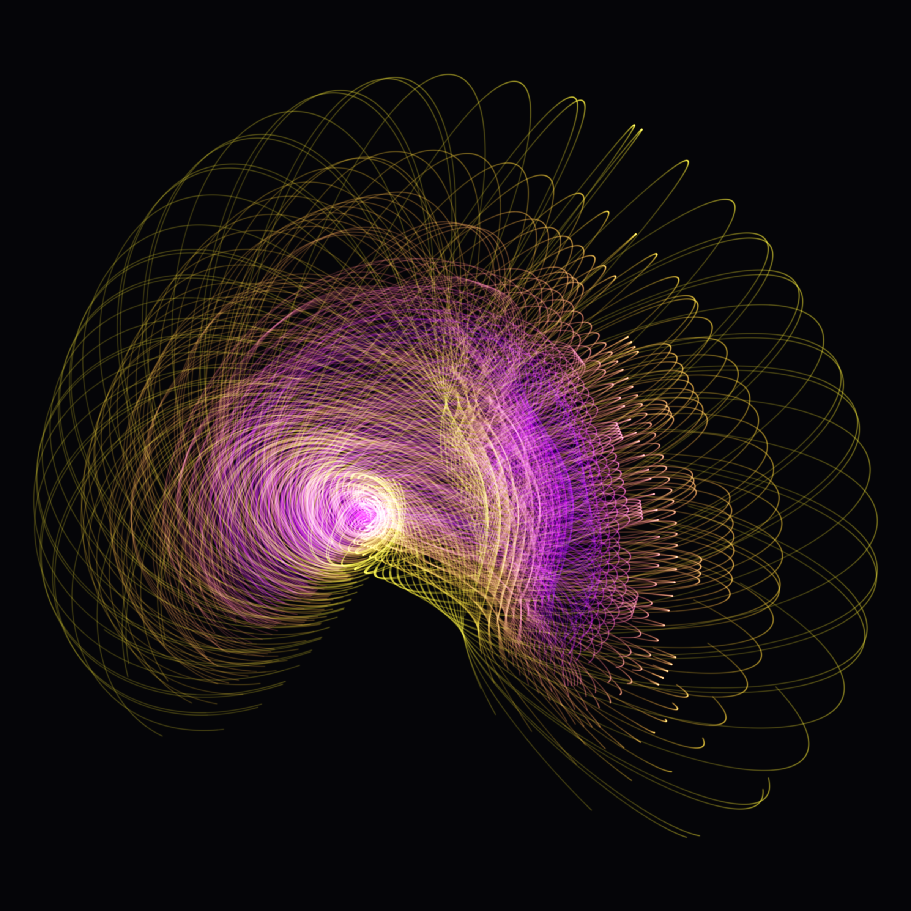 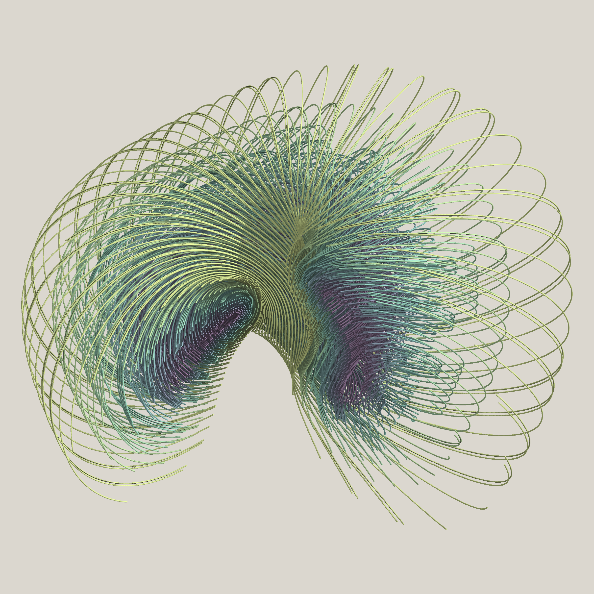</p>
<p align="center"><video src="gallery/film_eps_sweep.mp4" autoplay loop muted playsinline width="70%"></video><br>
<sub>film_eps_sweep.mp4 (<a href="gallery/film_eps_sweep.gif">GIF</a>): the tie payoff ε from 0 to 0.5 at fixed energy H = 2.8, one measured keyframe per ε, same 12 starting strategies.</sub></p>

## 1. The phenomenon

**The game and the learning rule.** Two players learn generalised rock–paper–scissors by continuous-time replicator dynamics (Sato, Akiyama & Farmer 2002):

  ẋᵢ = xᵢ[(A y)ᵢ − x·A y],  ẏᵢ = yᵢ[(B x)ᵢ − y·B x],  A = [[ε,−1,1],[1,ε,−1],[−1,1,ε]],  B = A(−ε).

The ties pay ε to player 1 and −ε to player 2, so the game is zero-sum.

**Two regimes.** The system conserves H = −⅓Σ log xᵢ − ⅓Σ log yᵢ and is Hamiltonian on its 4-dimensional state space.
- **ε = 0:** it is integrable, and every orbit winds around an invariant torus.
- **ε > 0:** tori break and chaotic orbits appear. `../game-chaos/` measured 29% chaotic orbits at ε = 0.5, H = 2.8 on the Poincaré section.

**The chart that makes this 3D picture exact.** Nothing is lost in this map, so the picture is not a projection.
1. **Logit coordinates.** Per player, the zero-mean logits z = log x − mean(log x) live in a plane. Expressed in the orthonormal basis e_a = (−1,1,0)/√2, e_b = (−1,−1,2)/√6, the two players together give u ∈ ℝ⁴.
2. **H is strictly convex in u.** Since −⅓Σ log softmax(z)ᵢ = logsumexp(z) − mean(z), we have H(u) = lse(z_x) + lse(z_y). This function is strictly convex on the zero-mean planes, with its minimum 2 log 3 at the uniform strategy (u = 0).
3. **Level sets are spheres in disguise.** Each level set H = h > 2 log 3 bounds a convex body containing 0. It is star-shaped: every ray from 0 crosses it exactly once, because t ↦ H(tq) is strictly increasing for t > 0. The radial map u ↦ q = u/|u| is therefore a homeomorphism from the level set onto S³.
4. **Stereographic projection** from a unit pole p gives X = Bᵀq / (1 − p·q) ∈ ℝ³, where B is an orthonormal basis of p⊥. This map is conformal and one-to-one on S³ minus p, and its only distortion is the length scale (1 + |X|²)/2.
5. **The inverse** runs X → q → t, solving H(tq) = h by bisection on the bracket [0, √6·h] followed by a Newton polish, then u = tq and strategies = softmax.

**Which pole.** The pole is placed as far as possible from everything drawn. It maximises the minimum angle on S³ to all 23.6 M stored orbit points, which gives **23.64°** (23.63° when measured to the chords between consecutive samples).
- Over every stored point, the chart scale runs from **0.50 to 11.9** (99th percentile 4.2).
- A first pole (§4.5) sat inside a corner island and magnified one island orbit 47×. It is kept only for the comparison plate.

## 2. The pieces

**Declared for every image:** the chart is H = 2.8 → S³ → stereographic projection from p = (0.672, −0.257, −0.666, −0.195), and all cameras are orthographic. Lighting (Lambert, AO, shadow) shows form only. Colour and position carry data or declared choices, as each caption says.

### 2.1 Nested tori, ε = 0

Twelve orbits start on a ray of the Poincaré section. The ray runs from the elliptic fixed point of the return map, which is the core periodic orbit x = y = (0.465, 0.465, 0.069), to the section fold. Torus index 0 is the innermost.

| | |
|---|---|
|  **Plaster.** The 12 orbits (t ≤ 1000, RK4 steps dt = 0.01) as tubes of radius 0.008.<br>- **Measured:** the geometry.<br>- **Declared:** the view is 52° from the doughnut axis (the least-variance direction of torus 0); a 50° half-angle wedge about that axis is removed from every torus; the tint is 0.55 white + 0.45 viridis(torus index); AO comes from a 400³ voxel occupancy of the tubes, plus one raking light.<br>- **Caveat:** the wedge is hard to see because tubes are lines, not surfaces. The interior is shown by the slice →. | 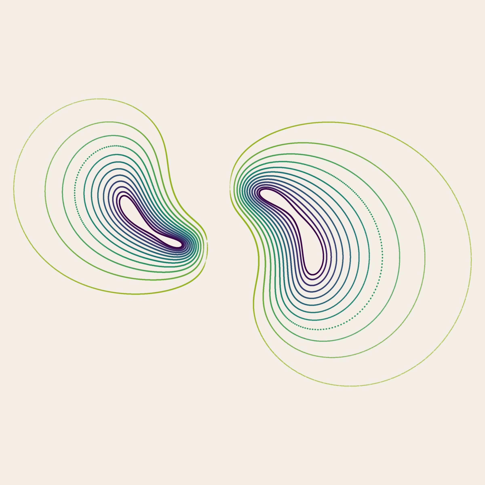 **Exact meridional slice.**<br>- **What it shows:** every crossing (t ≤ 10⁵, 163,955 dots) of the 12 orbits through the plane that contains the doughnut axis. Crossings are linearly interpolated between dt = 0.01 steps, with a largest step of 0.045 chart units.<br>- **What it proves:** nested closed curves on each side of the axis are the cross-section of nested tori. One curve is dotted: that torus is near-resonant, so its crossings return to a few places.<br>- **Declared:** viridis by torus index; ink coverage 1 − exp(−0.9·hits) with a 1.4 px Gaussian dot. |
|  **Dark glow.**<br>- **Measured:** the same orbits, same view and wedge.<br>- **Declared:** additive Gaussian hairlines coloured plasma(0.15 + 0.8·index/11), with exposure 0.22·(size/1024)^1.2.<br>- **Caveat:** there is no occlusion. The bright knot is where many strands are seen end-on (pile-up in projection), not a data maximum. | <a href="gallery/tori_plotter.svg">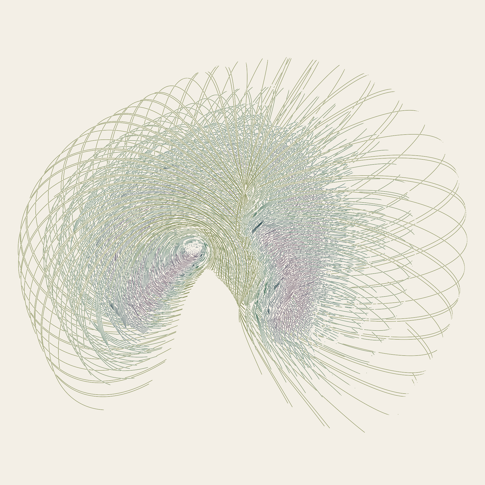</a> **Plotter SVG** (<a href="gallery/tori_plotter.svg">tori_plotter.svg</a>). Hidden lines are removed against the tube depth buffer, with one pen per torus (viridis × 0.42). |

### 2.2 Sea and islands, ε = 0.5

| | |
|---|---|
| 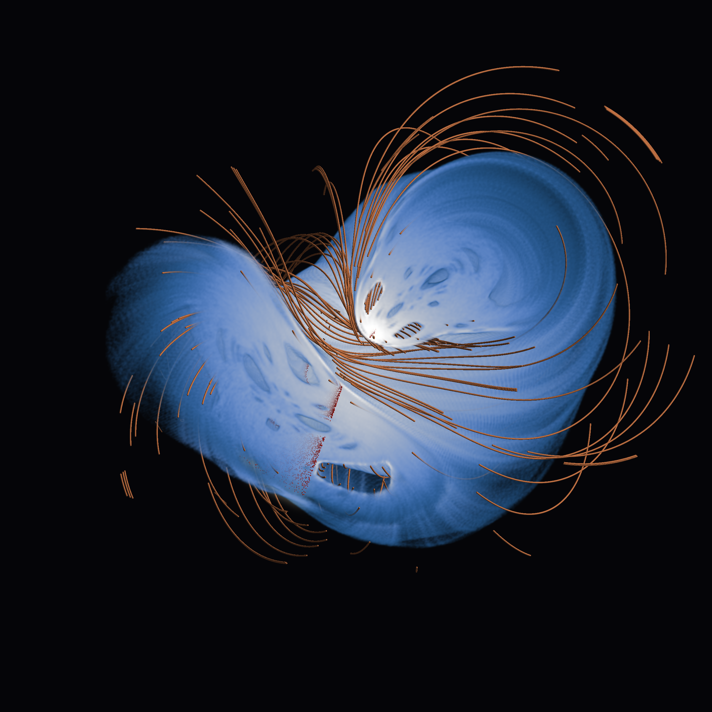 **Cutaway.** The strongest plate.<br>- **Fog:** the time density of one chaotic orbit (λ = 0.025) over T = 6·10⁶, binned on a 256³ grid. The grid covers the full support of the stored orbit segment plus 2%, and 99.95% of samples fall inside it.<br>- **Transfer function (declared):** x = log1p(count)/q99.9, colour cmc.oslo(0.15 + 0.85x), extinction 80x².<br>- **What the cut shows:** a vertical clip plane removes the near half. The dark holes in the cut face are islands, and copper tubes (8 regular orbits, λ ≤ 5·10⁻³, t ≤ 150, radius 0.009) pass through them.<br>- **Section membrane:** g = x_P − x_R + y_P − y_R = 0 with dg/dt > 0, drawn as an ivory volume sheet. Its extinction is 3·exp(−(d/1.5 voxel)²), where d = g/\|∇g\| is computed exactly on the grid. It is shown only where the fog has support (soft 2-voxel edge).<br>- **Dots:** red = chaotic-orbit crossings, dark copper = regular crossings. | 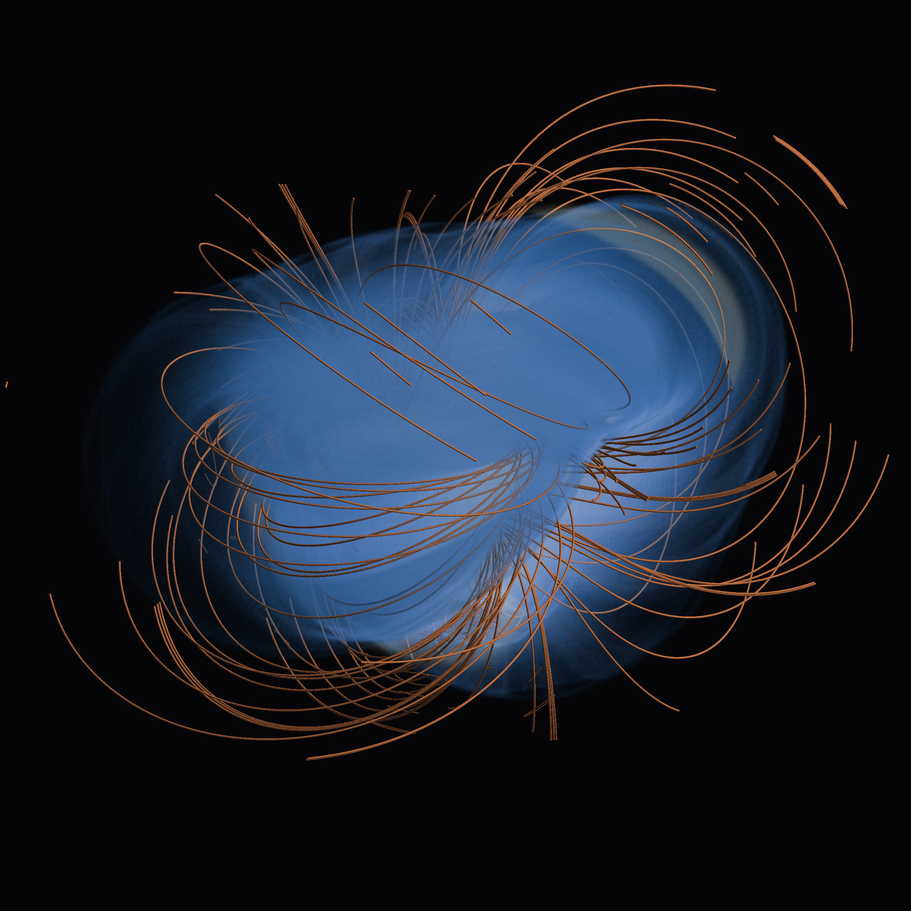 **Exterior.** The same scene with a translucent sea (extinction 12x²). The tubes are cropped to the density box, which is declared: island orbits extend beyond it. |
| 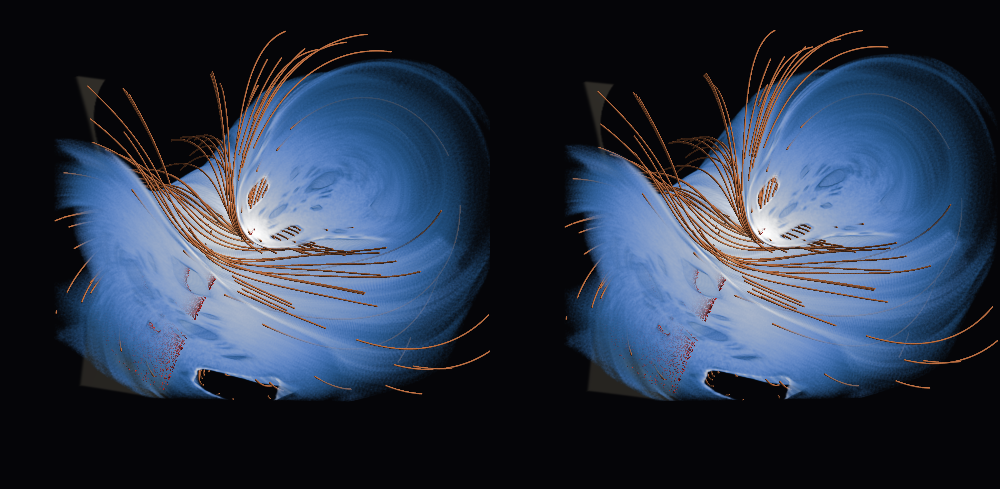 **Cross-eye stereo pair** of the cutaway. Declared: rotation stereo with eyes at azimuth ∓1.5° about the box centre (orthographic cameras have no translation parallax) and the same clip plane for both eyes. The right-eye image is on the left. | 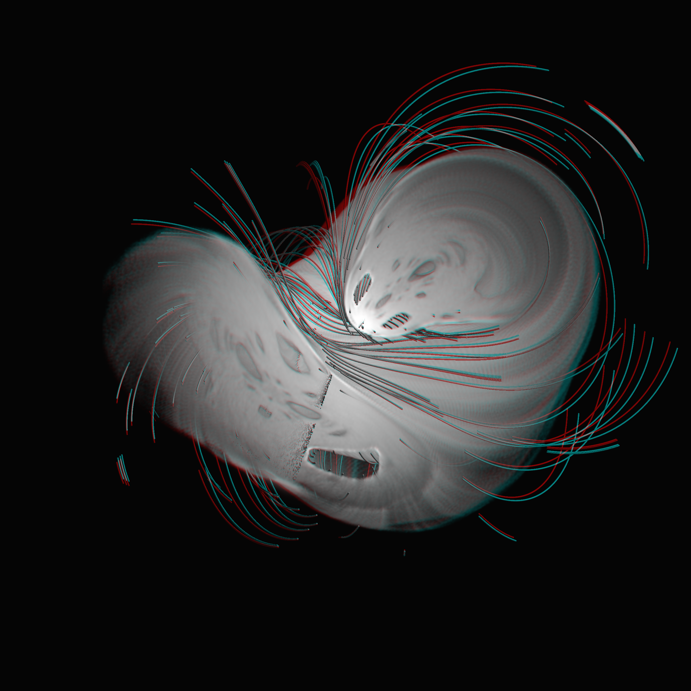 **Red–cyan anaglyph** of the same pair: red = left-eye luminance, cyan = right-eye luminance. |

<p align="center"><video src="gallery/film_turntable_sea.mp4" autoplay loop muted playsinline width="60%"></video><br>
<sub>film_turntable_sea.mp4 (<a href="gallery/film_turntable_sea.gif">GIF</a>): 360° of the cutaway, 240 frames. Declared: the clip plane turns with the camera, always removing the near half, so each frame's cut face is a different slice through the sea.</sub></p>

### 2.3 The slice plate and the second pole

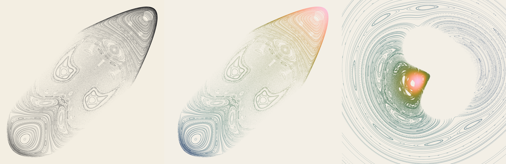

**One section, three panels.**
- **Left:** the game-chaos plate `poincare_ink_eps0.50.png` (from the game-chaos gallery), unchanged.
- **Middle:** the same 1.77 M section crossings (395 orbits) in the plate's own axes (x_R, y_P). Colour is a declared key: the rank of x_R + y_P through cmc.batlow.
- **Right:** the same crossings, same colours, placed where they lie on the membrane in the chart, framed on the fog box. The two tear-drop islands and the sea are the same objects bent by the chart.

96.9% of these dots fall inside a membrane voxel of the 128³ grid, and 100% fall in one or a face neighbour. Ink coverage is 1 − exp(−g·hits), with g three times higher in the right panel (declared).

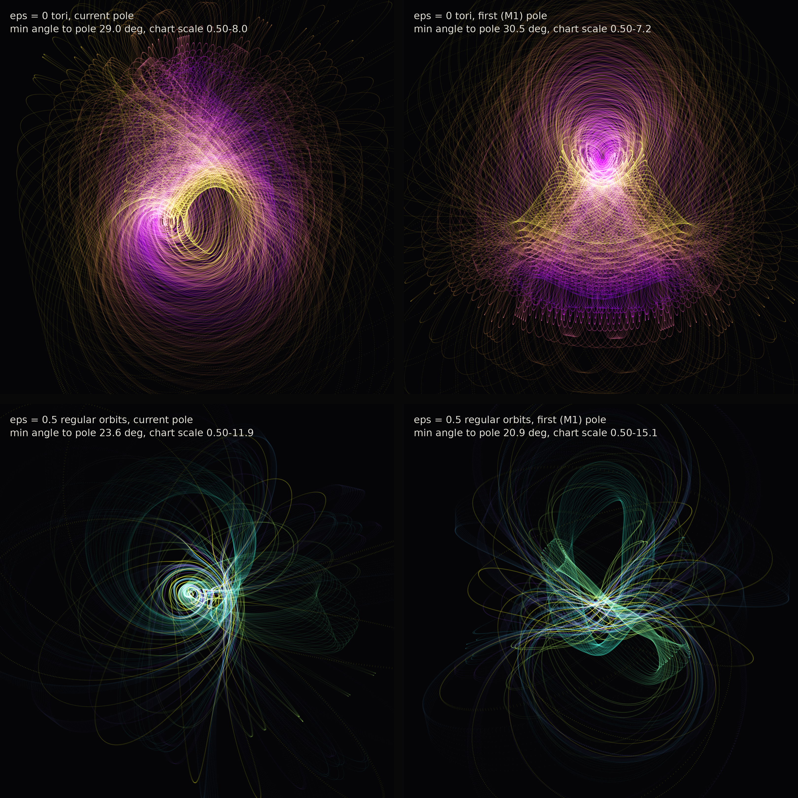

**Second pole** (spec §5 pitfall). The same orbits are drawn through the current chart (left) and the M1 chart (right). The two charts differ only in the pole.

| orbits | current pole: min angle | current pole: scale | M1 pole: min angle | M1 pole: scale |
|---|---|---|---|---|
| ε = 0 tori | 29.0° | 0.50–8.0 | 30.5° | 0.50–7.2 |
| ε = 0.5 regular | 23.6° | 0.50–11.9 | 20.9° | 0.50–15.1 |

Shapes, sizes and apparent tube thickness all change with the pole. Nesting and linking do not. **Do not compare thickness or size across the image.**

### 2.4 Film: ε from 0 to 0.5

**What each keyframe is.** Each of the 26 keyframes is measured: ε = 0, 0.02, …, 0.5 from the same 12 starts, drawing t ≤ 1000 at every RK4 step. Orbits are never interpolated.

**What is declared:**
- **Tween:** between keyframes the two renders are cross-faded (opacity only) over 6 frames, and each keyframe is held for 10 frames.
- **Camera:** it turns 60° about the torus axis over the film.
- **Colour:** regular orbits (λ ≤ 5·10⁻³ at T = 10⁴) use plasma(index) as in `tori_glow`; chaotic orbits use pale cyan.
- **Exposure:** constant across the film.

### 2.5 Object

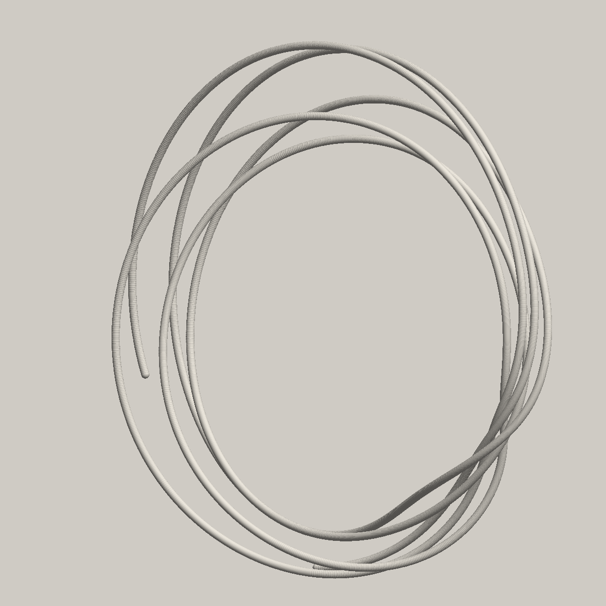

**[torus_woven_kam201.stl](gallery/torus_woven_kam201.stl): "a torus woven from its own orbit" (declared).** It is regular ε = 0.5 orbit kam 201, from the central island, built with `r3d.tube_mesh` (16 sides, capped).
- **Size:** 80 mm on the longest side (80 × 72 × 27 mm), tube radius 0.6 mm.
- **Mesh:** watertight, 162,816 faces, volume 1079 mm³.
- **Why it has only 5 windings:** the time window is t ≤ 70. A declared rule caps it at the longest window in which no two tube pieces come within 2.2 radii of each other, so the tube never intersects itself. Longer windows make neighbouring windings touch in the chart.
- **Preview:** splat spheres on the same polyline.

## 3. What was computed

**Precision and integrator:** everything is float64. It uses the C RK4 integrator from `../game-chaos/replicator_c.py`, copied here with one change: it stores logits rather than probabilities. The step is h = 0.01. λ is Benettin's largest finite-time Lyapunov exponent, renormalised every 100 steps. There are no neural networks and no datasets.

| product | what | wall clock (4 CPU threads unless noted) |
|---|---|---|
| `compute_orbits.py eps0` | fixed point by Nelder–Mead on the return map (residual 2·10⁻¹⁴); 12 orbits, T = 2·10⁴ | 3 s |
| `compute_orbits.py eps05` | chaotic orbit (game-chaos kam 190) T = 2·10⁵; 8 regular orbits (kam 32, 2, 59, 84, 121, 201, 243, 347) T = 2·10⁴ | 5 s |
| `compute_orbits.py sweep` | 26 ε × 12 starts, T = 10⁴ | 12 s |
| `compute_orbits.py fine sweep_fine` | render copies at dt = 0.01 (identical trajectories) | 5 s |
| `compute_chart.py pole` | 4·10⁵ random candidate poles, 24 refined by Nelder–Mead on a KD-tree of 23.6 M points | 47 s |
| `repole.py` | pole without kam 38, choice of its replacement | 20 s |
| `compute_chart.py density` | 256³ counts, 30 bit-identical continuation segments to T = 6·10⁶ | 94 s |
| `compute_chart.py fields256 membrane` | g, dg/dt and signed distance on 256³ and 128³ grids through the inverse chart | 110 s + 15 s |
| `compute_slice.py` | meridional crossings, 12 orbits, T = 10⁵ | 26 s |
| `render_tori.py`, `render_plates.py`, `render_secondpole.py`, `make_stl.py` | stills and STL | ≤ 40 s each |
| `render_sea.py`, `render_film.py` | sea stills, 2400² (volume on GPU through `gpu1.sh`), films at 1080² | see `logs/render_times.log` |

**Reproduce** (from this directory, `P=/home/fzeng/ml/research/art/.venv/bin/python`, `OMP_NUM_THREADS=4`):

```bash
$P compute_orbits.py eps0 && $P compute_orbits.py eps05 && $P compute_orbits.py sweep
$P compute_chart.py pole && cp cache/pole.json cache/pole_first.json      # the M1 pole
# M2: replace kam 38 (REGULAR_KAM05 in compute_orbits.py already holds the result)
$P repole.py && $P compute_orbits.py eps05 && $P compute_chart.py all
$P compute_orbits.py fine && $P compute_orbits.py sweep_fine && $P compute_chart.py stereo fields256
$P compute_slice.py && $P -m pytest -q -p no:cacheprovider test_chart.py
./render_m3.sh          # stills on CPU, sea stills and films through the GPU queue
$P make_stl.py 201 --preview
```

**Software:** GB10, driver 580.173.02, CUDA 13.0, torch 2.14.0+cu130, float32 rendering, float64 dynamics, 2026-09-15. **Files over 20 MB:** none. `cache/` (about 3 GB) is not committed.

## 4. Verification

### 4.1 The chart
All 5 tests pass (`test_chart.py`):
- **Convexity:** H(tq) is strictly increasing along 10⁴ random rays out to 1.5× the h = 2.8 radius. The smallest increment on a 601-point grid is 3.5·10⁻⁶, and the analytic derivative is > 0 for all t > 0.
- **Round trip:** the inverse chart recovers strategies on 10⁴ orbit points to **5.6·10⁻¹⁶**, using each point's own H. With h = 2.8 the error is 1.0·10⁻⁹, which is integrator drift.
- **Grid energy:** points on the chart grids come back with |H − 2.8| ≤ 1.3·10⁻¹⁵.

### 4.2 Energy drift and Lyapunov exponents

**H drift** is max |H(t) − H(0)| along each stored float64 orbit.

| orbits | T | H drift | λ (per unit time) |
|---|---|---|---|
| ε = 0, tori 0–11 | 2·10⁴ | ≤ 6.5·10⁻¹⁰ | 4.56, 4.05, 4.30, 4.43, 4.37, 4.25, 4.09, 4.43, 4.07, 4.24, 4.07, 4.18 (×10⁻⁴) |
| ε = 0.5 chaotic (kam 190) | 2·10⁵ | 3.7·10⁻⁹ | 0.0246; 0.0041–0.0256 over 30 continuation segments of 2·10⁵ |
| ε = 0.5 regular kam 32, 2, 59, 84, 121, 201, 243, 347 | 2·10⁴ | ≤ 9.2·10⁻¹⁰ | 4.17, 3.94, 4.05, 3.81, 3.60, 3.44, 3.81, 3.24 (×10⁻⁴) |
| sweep, 312 orbits | 10⁴ | ≤ 3.2·10⁻¹⁰ | see §4.3 |

λ of a regular orbit decays like log T / T, and these values are consistent with 0.

### 4.3 The measured break-up order
Counted with λ > 5·10⁻³ at T = 10⁴ over the 12 starts, for ε = 0, 0.02, …, 0.5:

0, 0, **1**, 1, 2, 1, 4, 4, 5, 4, 7, 6, 6, 7, 7, 10, 7, 8, 7, 9, 7, 7, 10, 6, 7, 8.

**The first orbit to cross the threshold is the innermost torus** (index 0, seeded nearest the core periodic orbit), at ε = 0.04. It stays chaotic at 0.06 and 0.08, joined by index 1 at 0.08. At ε = 0.10 index 0 is back below the threshold while index 1 is above, so this finite-time classification is noisy near the threshold.

**This contradicts the original proposal.** It expected the outer tori to dissolve first while islands survive inside, and the data do not show that. A plausible reading, not tested here: the core periodic orbit itself loses stability at small ε, so the thin tori around it are the first to feel the resonance.

### 4.4 Pole, voxels and membrane
- **Pole distance by group:** ε = 0 tori ≥ 29.0°, chaotic orbit ≥ 31.5°, regular orbits ≥ 23.6°, sweep ≥ 29.0°.
- **Density grid:** 30.8% of voxels are occupied, with a mean of 23 counts per occupied voxel.
- **Split-half agreement is only r = 0.61, and not because of noise.** Around t ≈ 3.4·10⁶ (segments 17–18) the chaotic orbit sticks near an island for about 4·10⁵ time units, with λ = 0.004–0.006 there. That episode really is part of the orbit's time density.
- **Membrane:** see the slice plate (§2.3).

### 4.5 First pole and its replacement
**The M1 pole was too close to one orbit.** It maximised the minimum angle over the M1 orbit set, but it sat inside the corner island at 11.85° from regular orbit kam 38, which the chart magnified 47×.
- **Fix:** kam 38 was dropped and the pole re-chosen (23.64°). kam 38 was replaced by kam 32, an island chain at 25.8° from the new pole.
- **Rule for the replacement:** the new orbit had to be at least as far from the pole as the pole's own minimum angle, so adding it could not move the pole. Re-running the search returned the identical pole.
- **Where to see the difference:** the second-pole plate (§2.3).

## 5. Negative results and surprises
- **Inner tori break first, not outer ones** (§4.3).
- **The single-orbit STL is sparse.** A self-avoiding tube of a KAM orbit allows only about 5 windings at 80 mm with 0.6 mm radius, because neighbouring windings of this thin torus come within about 0.02 chart units (0.5 mm at 80 mm) of each other by t ≈ 80. A fused (union) version was tried: at printable voxel sizes it rendered lumpy, and it was dropped.
- **A plain orbit tube hides the nesting from the outside.** Only slices show the interior honestly, hence `tori_slice.png`.
- **The 0.5–99.5 percentile box cut the fog flat.** It was replaced by the full support (M3).

## 6. Caveats
- **Stereographic scale varies across each image.** It runs from 0.5 to 11.9× over stored points, so apparent tube thickness and region size are not comparable across an image (§2.3, second pole).
- **Chaotic vs regular is a finite-time classification** at threshold λ = 5·10⁻³ (T = 10⁴ for the sweep, 4·10⁴ for the game-chaos section seeds). The fog/tube split inherits that threshold.
- **Fog is time density in chart voxels,** so it includes the chart's volume distortion. It is not the Liouville measure on the energy surface.
- **Crops are declared:** the fog box (full support + 2%), the tubes (cropped to the box in the sea plates), and the membrane (shown only on the fog's support).
- **Glow brightness** is overlap in projection, not a quantity.
- **The 8 regular orbits were chosen** by farthest-point sampling on section masks. They are representative, not exhaustive.

## 7. References
- Y. Sato, E. Akiyama, J. D. Farmer. *Chaos in learning a simple two-person game.* PNAS 99:4748 (2002).
- `../game-chaos/README.md`: the source piece. It supplies the integrator, the Poincaré section seeds (`kam_eps0.50.npz`), and the plates reproduced in §2.3.
- `art/_shared/r3d/`: the shared renderer (volumes, splat tubes, tube meshes).
