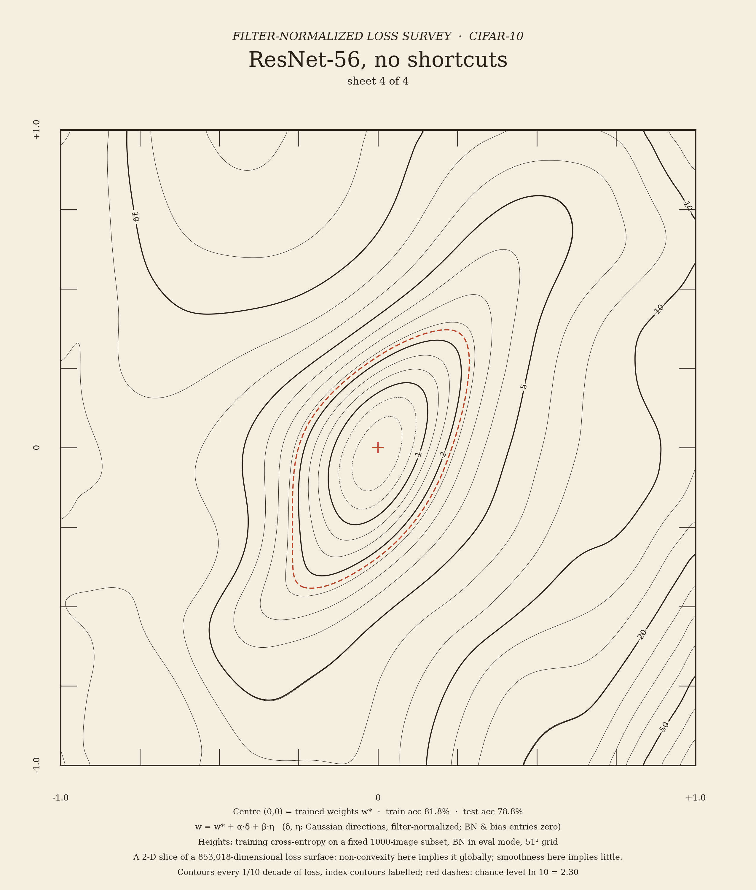
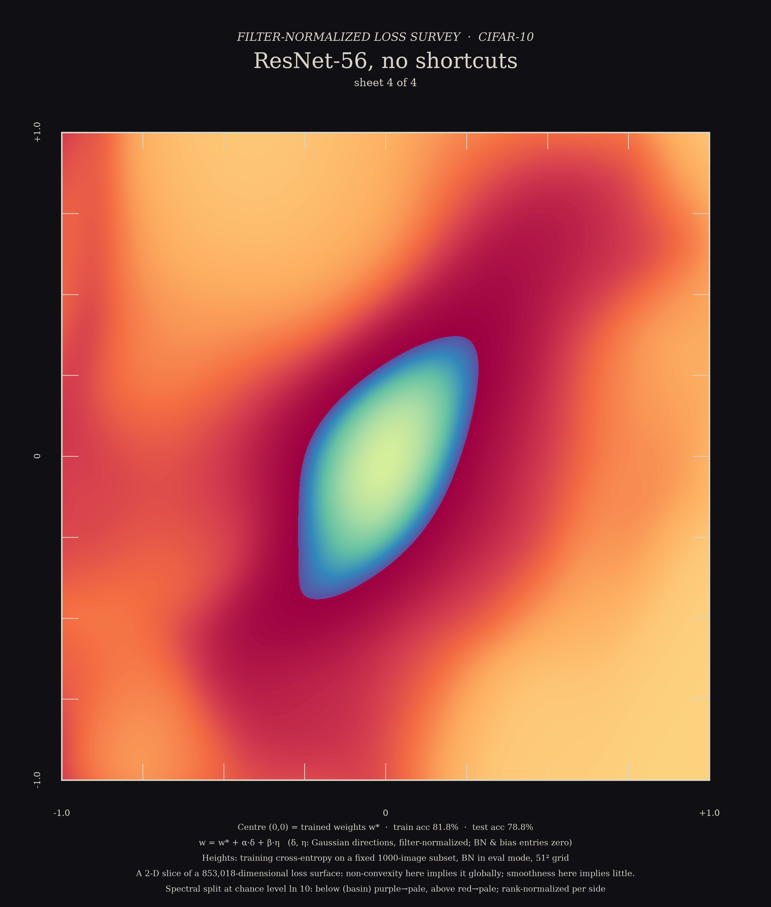

# Filter-Normalized: the loss landscape, surveyed honestly

*Four CIFAR-10 ResNets, their loss measured on a grid of weight perturbations and drawn the way a survey office draws a mountain: contour sheets, hachures, raking light and hypsometric tints, with no rainbow 3-D surfaces.*

> **Read this before looking at any picture.** Every map here is a **2-D slice** through a loss surface with 269,722 to 855,770 dimensions. When a slice is non-convex, the full loss is non-convex too. When a slice looks smooth, that says very little about the other ~10⁶ directions. Loss "sharpness" is also not reparametrization-invariant (Dinh et al. 2017). Filter normalization only removes the per-filter scale symmetry, so a wide basin in these units does not by itself mean good generalization. Li et al. (2018) warn that 1-D interpolation plots in particular can mislead.

**Status:** work in progress. The 51² surveys are rendered. The 101² hero surfaces, zoom test, PCA trails and checkpoint film are still computing (see `NOTES.md`). Results marked *pending* will be filled in when they finish.

## The phenomenon

Li et al. (NeurIPS 2018) choose two random Gaussian directions δ, η in weight space. Each filter of each direction is then rescaled to the norm of the matching filter of the trained weights w\*:

$$\delta_{i,j} \leftarrow \frac{\delta_{i,j}}{\lVert\delta_{i,j}\rVert}\,\lVert w^*_{i,j}\rVert, \qquad f(\alpha,\beta) = \mathcal L\left(w^* + \alpha\,\delta + \beta\,\eta\right).$$

BN and bias entries of the directions are set to zero. This removes the ReLU/BN scale ambiguity that otherwise makes apparent sharpness meaningless. Their well-known result is that deep networks *without* skip connections (ResNet-56-noshort) have chaotic, crumpled slices, while with shortcuts the slices become smooth, nearly convex bowls.

## Hero

 

*Left: contour survey sheet. Contours every 1/10 decade of training loss, bold index contours labelled, and a red dashed line at chance level (ln 10). Right: Sohl-Dickstein Spectral split at the chance-level contour. Below chance (the basin) runs purple→pale; above chance runs deep red→pale. Each side is rank-normalized separately. The colour mapping is a declared aesthetic choice.*

## Gallery (51² surveys, all four models)

| style | measured | aesthetic (declared) |
|---|---|---|
| `survey_*` contour sheets | log10 train loss, shared clip [0.08, 150] | one ink + red chance line, title block, graticule |
| `hachure_*`, `hachure_dark_*` | fall line and slope of log10 loss | Lehmann-style strokes between 1/10-decade contours, weight ∝ slope |
| `hillshade_*` | log10 loss | raking light from the NW at 40°, 0.35× exaggeration, faint contours |
| `hypsometric_*` | log10 loss in 24 bands | declared Imhof-like ramp × hillshade |
| `spectral_*`, `hubble_*` | sign of log(L/ln 10) | rank-normalized split palettes (Spectral; palettes.py `hubble_sho`) |
| `curvature_split_g51.png` | smaller principal curvature λ_min of L on the slice | Spectral split at λ_min = 0 |
| `atlas_g51.png` | all four sheets on one shared scale | 2×2 atlas |


  


*Principal-curvature map. The red side is locally convex (λ_min > 0); the purple side has negative curvature. Inside the chance contour only 3–5% of grid points are non-convex. Outside it, most of the slice curves downward, because the loss is saturating toward a plateau.*

Pending: 101² heroes (`*_g101`), STL heightfields + `stl_preview_g101.png`, ridgelines `ridge_*`, the raking-light sweep film `sweep_g101.mp4`, the zoom test `zoom_test.png`, the PCA trails `pca_trail_*.png`, and the checkpoint film `ckpt_slices.mp4` / `ckpt_ridge.png`.

## What was computed

- **Models:** the Li et al. CIFAR ResNets (16-32-64 channels, BasicBlocks, 1×1 projection shortcuts). The `noshort` variants drop every shortcut. Code: `common.py`.
- **Training** (`train.py`): SGD with Nesterov momentum 0.9, lr 0.1, wd 5e-4, batch 128, standard augmentation, bf16 autocast, seed 0. **40 epochs** instead of Li et al.'s 300, with ×0.1 decays at epochs 20/30/37 (the same fractions). Training ran for 17–30 min per model.

| model | params | train acc | test acc | train loss |
|---|---|---|---|---|
| ResNet-20 | 272,474 | 95.6% | 90.4% | 0.131 |
| ResNet-20 noshort | 269,722 | 92.9% | 87.9% | 0.205 |
| ResNet-56 | 855,770 | 96.8% | 90.9% | 0.097 |
| ResNet-56 noshort | 853,018 | **81.8%** | 78.8% | 0.522 |

  In 40 epochs the 56-layer net without shortcuts could not fit the training set, which is the trainability half of Li et al.'s story.
- **Surfaces** (`landscape.py`): training cross-entropy on a fixed subset of **1000** training images (`fixed_subset(1000)`, seed 0), BN in eval mode, fp32 with TF32 disabled. Directions come from seeds 1 and 2, filter-normalized per checkpoint. The grid is α, β ∈ [−1, 1], 51² (spacing 0.04), and the heroes are 101² (the 51² points are reused). Speed on the contended GB10 was ~1.7 points/s for ResNet-56 and ~4 points/s for ResNet-20. The 51² ResNet-56-noshort surface took 26 min.
  The subset size was cut from the full set to 1000 so the job fits a shared GPU. A check against n = 5000 on a 101-point slice is *pending* (`render_extra.py lines` prints the median |log10 ratio|).
- **Analysis:** `analyze_surf.py` computes principal curvatures by finite differences, strict local minima and quadratic-fit residuals, and writes `cache/surf_stats_<tag>.json`. `pca_dirs.py` computes the PCA directions of the checkpoint trajectory.
- **Rendering:** `render_maps.py` and `render_extra.py`, CPU only, from the cache.

```bash
PY=/home/fzeng/ml/research/art/.venv/bin/python; G=/home/fzeng/ml/research/art/_shared/gpu_run.sh
$G $PY train.py --depth 56 --noshort --epochs 40
$G $PY landscape.py --n 1000 --model resnet56_noshort --res 51 --tag g51
$PY analyze_surf.py g51 && $PY render_maps.py --tag g51 && $PY render_extra.py curv --tag g51
# full job list: jobs/chainA.sh, jobs/chainB.sh, jobs/chainC.sh
```

## Verification / honesty

**51² slice statistics** (`cache/surf_stats_g51.json`):

| model | centre loss | strict local minima (interior) | basin (L < ln 10) area | non-convex fraction inside basin | quad-fit RMS residual (log10) |
|---|---|---|---|---|---|
| ResNet-20 | 0.124 | 2 (1 in basin) | 17.0% | 2.7% | 0.227 |
| ResNet-20 noshort | 0.207 | 1 | 22.2% | 4.2% | 0.187 |
| ResNet-56 | *pending* | | | | |
| ResNet-56 noshort | 0.528 | 1 | 7.1% | 4.9% | 0.198 |

**Negative result against Li et al. (so far):** at 0.04 spacing, our ResNet-56-noshort slice is **not chaotic**. It shows one elongated, tilted valley with a single minimum, wavy non-convex shoulders and a basin much *narrower* (7% vs 17–22% of the square) than the shallower nets. It does not reproduce the crumpled terrain in Li et al.'s Fig. 5. Likely reasons, none tested yet:
1. The schedule is 7.5× shorter. Our noshort-56 stopped at 81.8% train accuracy, far from the near-interpolating minimum Li et al. surveyed.
2. The loss is measured on a 1000-image subset.
3. It is one pair of random directions.

The 101² hero and the α = 0.5 ± {0.5, 0.05, 0.005, 0.0005} zoom (the two finest windows in float64) test whether finer spacing reveals roughness. *Pending.*

**PCA trajectory surprise:** for ResNet-56-noshort, PCA over all checkpoints puts 99.3% of the variance on one component. Epoch-1 weights sit at distance 412 from the final weights: a large early growth of weight norm that weight decay then shrinks, which is harmless for BN nets because of scale invariance. That plane just shows radial shrinkage, so the trail sheet uses epochs ≥ 10 (92.1% / 5.4%). ResNet-56 over all epochs: 76.6% / 9.8%.

## Caveats

- **Slice, not landscape** (see the box at the top). Non-convexity in a slice implies global non-convexity; smoothness implies little. Dinh et al. (2017) show that sharpness can be changed arbitrarily by reparametrization, so no "flat = generalizes" reading is licensed.
- The height is **log10** training loss with a shared clip [0.08, 150] across models, which exaggerates the bottom of the bowl relative to linear-loss plots.
- Cubic-spline upsampling of the grid (51² or 101² up to 600–1600 px) is a rendering step. Structure finer than the grid spacing is not measured.
- BN is in eval mode with the running statistics of the unperturbed net, as in Li et al.'s code. Perturbed nets would be scored differently if BN statistics were recomputed.
- 40-epoch training, one seed, one direction pair, a 1000-image subset.

## References

- H. Li, Z. Xu, G. Taylor, C. Studer, T. Goldstein. *Visualizing the Loss Landscape of Neural Nets.* NeurIPS 2018. Code: github.com/tomgoldstein/loss-landscape.
- L. Dinh, R. Pascanu, S. Bengio, Y. Bengio. *Sharp Minima Can Generalize for Deep Nets.* ICML 2017.
- I. Goodfellow, O. Vinyals, A. Saxe. *Qualitatively characterizing neural network optimization problems.* ICLR 2015.
- J. Sohl-Dickstein. *The boundary of neural network trainability is fractal.* 2024 (Spectral split style).
- E. Imhof. *Cartographic Relief Presentation.* 1965. J. G. Lehmann's hachure system (1799).
