# Number Knot: circles inside a language model

*The seven days of the week sit on a ring in every one of Qwen3-0.6B's 29 layers, and OLMo-2-1B winds the numbers 0–999 ten times around a measured circle of period 100.*

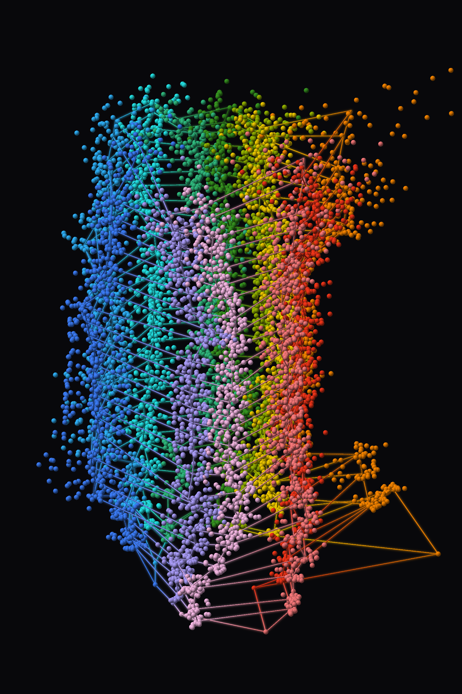 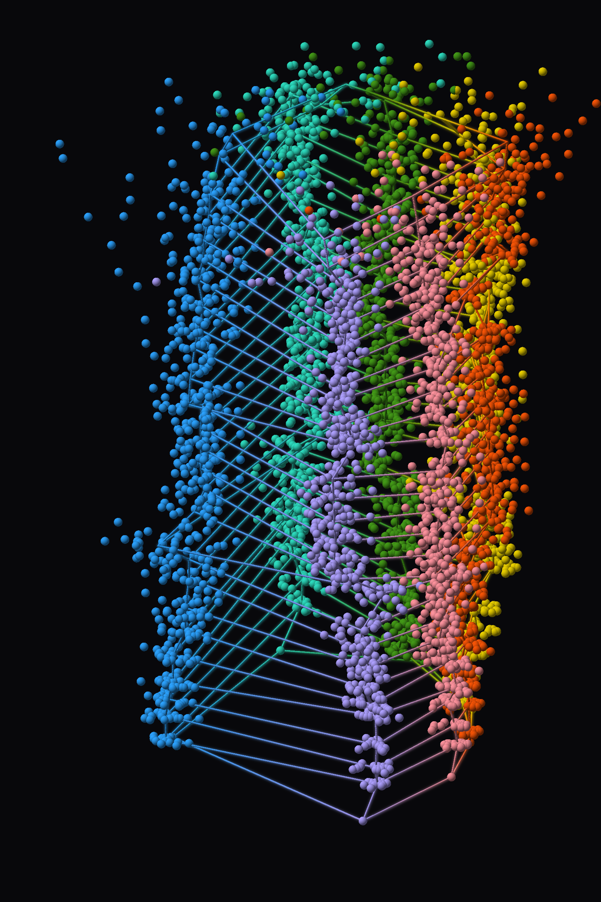

<video src="gallery/film_turntable_months.mp4" autoplay loop muted playsinline width="60%"></video>

## The phenomenon

Language models represent some quantities on circles. Kantamneni & Tegmark (2025) found that GPT-J, Pythia-6.9B and Llama-3.1-8B hold the integers 0–99 on a *generalised helix*. They took the top-100 principal components of the residual stream at the number token, PCA(ha), and regressed them on

B(a) = [a, cos 2πa/T, sin 2πa/T, …], T ∈ {2, 5, 10, 100}.

Engels et al. (2025) found circular features for days of the week and months of the year using sparse autoencoders.

This piece asks the same questions of two small open models, with nulls.

- **Days and months.** Qwen3-0.6B reads ` Monday` … ` Sunday` and ` January` … ` December` as single tokens, each placed in 24 declared templates.
  - Method: at every layer, take the class means over templates. Their top-2 principal plane is the *supervised mean-difference plane*, and a circle regression P = c + A[cos 2πk/K, sin 2πk/K] is fitted in it. The fit uses one half of the templates and is scored on the other half.
  - Result: held-out R² is 0.77–0.92 for days (best at layer 12) and 0.70–0.92 for months (best at layer 13). The day order is exact at 28 of 29 layers, and the true order ranks **1st of all 360** possible cyclic orders at 27 of 29 layers.
- **Numbers.** Qwen3 splits numbers into single digits, so it has no per-number token. OLMo-2-0425-1B tokenises every integer 0–999 as a single token, so the number pieces use it, with the K&T recipe applied at every layer.
  - Result: every K&T period beats both nulls by 5–10× on 0–999. The T=100 circle is genuinely circular.
  - But the effects are small: each circle explains 1.5–5 % of the 100-PC variance.
  - T=10 is mostly *ten ordered clusters* rather than a smooth ring.
  - On the K&T range 0–99 alone, only T=100 clears the null, and there it is indistinguishable from smooth curvature (see Verification).

## The pieces

**Declarations shared by every 3-D image.**
- *Chart.* The map into ℝ³ is a fitted subspace of the residual stream: either the supervised plane or the K&T fit frame. Orthographic camera.
- *Tower height* is the layer index. This is declared, not a spatial quantity.
- *Per-layer scaling.* Each layer's plane is divided by that layer's RMS bead radius. The in-plane RMS radius grows from 0.3 at Qwen3's embedding to about 45 at the last layers (OLMo-2: 1.1 → 4.7). **Radii and heights are therefore not comparable between layers.** Only the shape within a layer is.
- *Rotation.* Each calendar layer is rotated or reflected by orthogonal Procrustes so its class means face the calendar angles (numbers: the fit fixes the phase).
- *Light.* One Lambert key light (glow), or a raking light plus ambient occlusion (plaster). Light shows form only.
- *Colour.* Colour encodes the cyclic label.
  - Dark ground: colorcet `cyclic_rygcbmr_50_90_c64_s25`, chosen for near-constant lightness, L* 55–84.
  - Plaster: cmcrameri `romaO` pigment, 55 % colour + 45 % white.
  - Plotter: single ink `#1f1d1b` on `#f3efe6`.
- *Connectors are declared.* Rings join the class means of one layer in calendar order. Threads join one class's means across layers. Hairlines join consecutive integers. The *fit line* is the fitted K&T curve C·B(a). It is thinner and lower-contrast than the measured beads (darkened on the dark ground, lightened on plaster), so the data dominates.

**Every bead is a measured hidden state, projected.**

### Depth towers (Qwen3-0.6B days and months)

| | |
|---|---|
|  **Days, glow (hero).** 24 templates × 7 days × 29 layers (bottom = embedding, top = layer 28). Held-out-template circle R² 0.77–0.92 at layers 0–26 (0.69 and 0.50 at the last two). Hue columns follow Mon → Sun around the tower at 28 of 29 layers. |  **Months, glow (hero).** 24 templates × 12 months. Held-out R² 0.70–0.92. The flare at the lower right is the embedding and first blocks. Exact cyclic order holds at 18 of 29 layers; Jul/Aug/Sep crowd together elsewhere. |
| 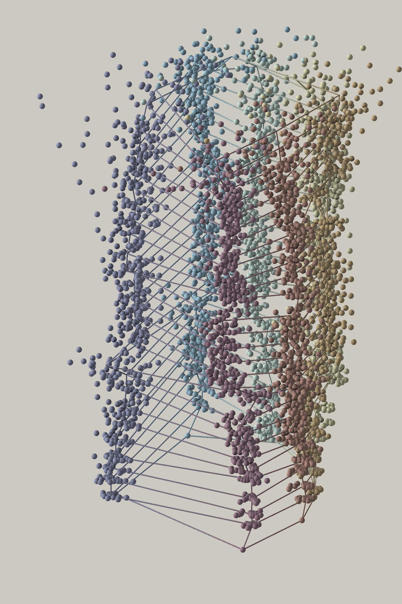 **Days, plaster.** Same geometry; raking light plus AO on a 256³ union-of-balls field (form only). | 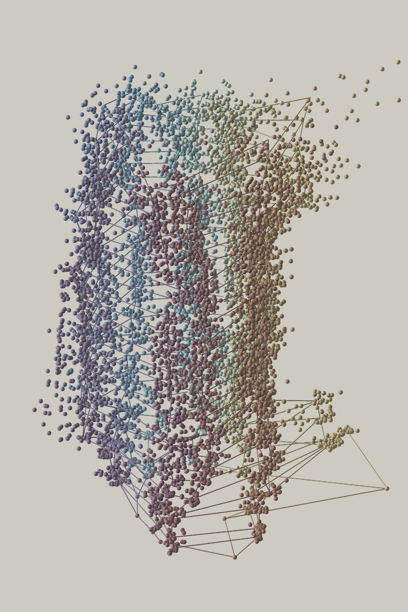 **Months, plaster.** |

Plotter versions (hidden-line SVG): [`hero_tower_days_plotter.svg`](gallery/hero_tower_days_plotter.svg), [`hero_tower_months_plotter.svg`](gallery/hero_tower_months_plotter.svg).

**With their nulls.** In each image the right panel is the same pipeline after shuffling all point labels: plane, Procrustes and scaling all rerun. Its class means collapse onto the axis, and the beads form a structureless column.

| | |
|---|---|
| 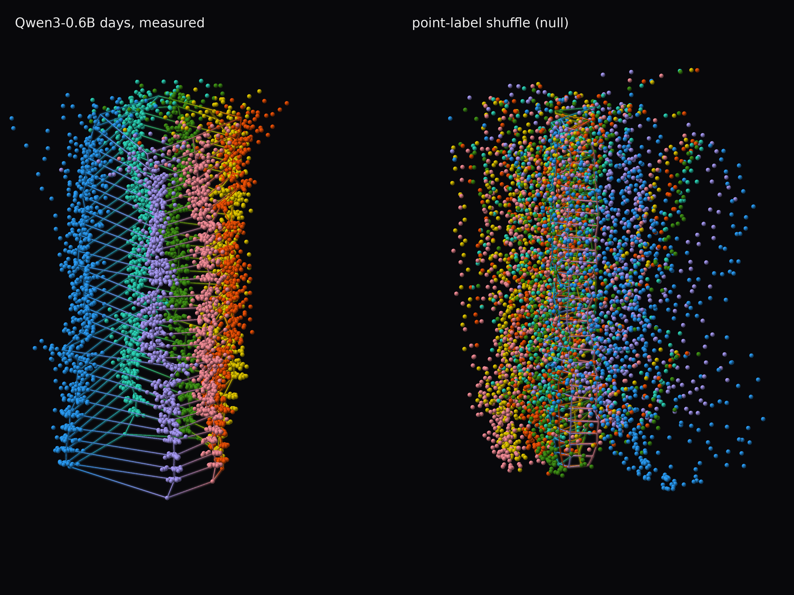 days, measured \| null (glow) | 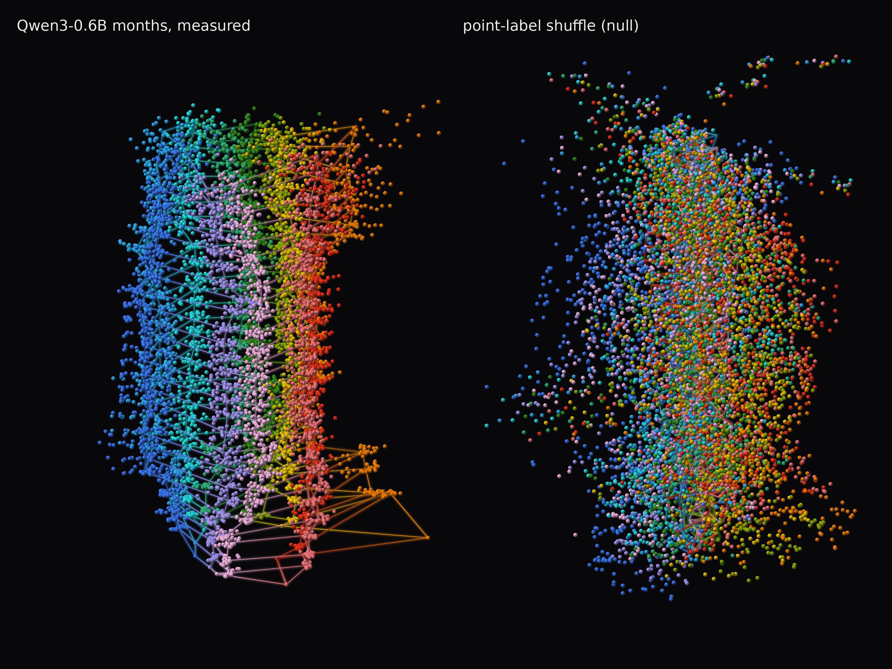 months, measured \| null (glow) |
| 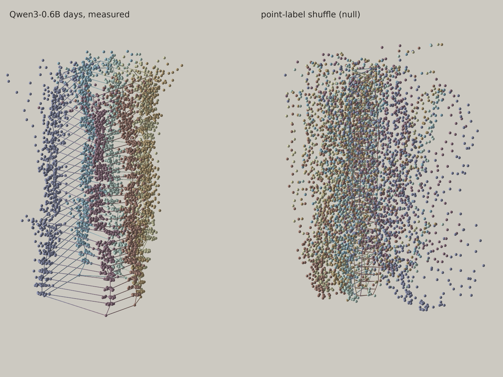 days, plaster | 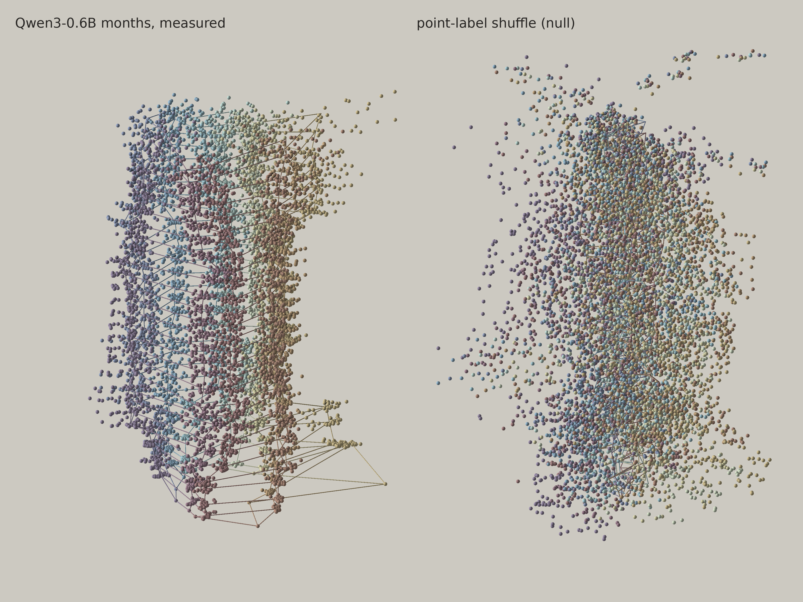 months, plaster |

Plotter: [`tower_days_plotter.svg`](gallery/tower_days_plotter.svg), [`tower_months_plotter.svg`](gallery/tower_months_plotter.svg).

**Slice atlases: the inside of each tower.** Every layer's plane on its own, in the tower's coordinates, titled with its held-out R² and whether the angular order is exact.

| | |
|---|---|
| 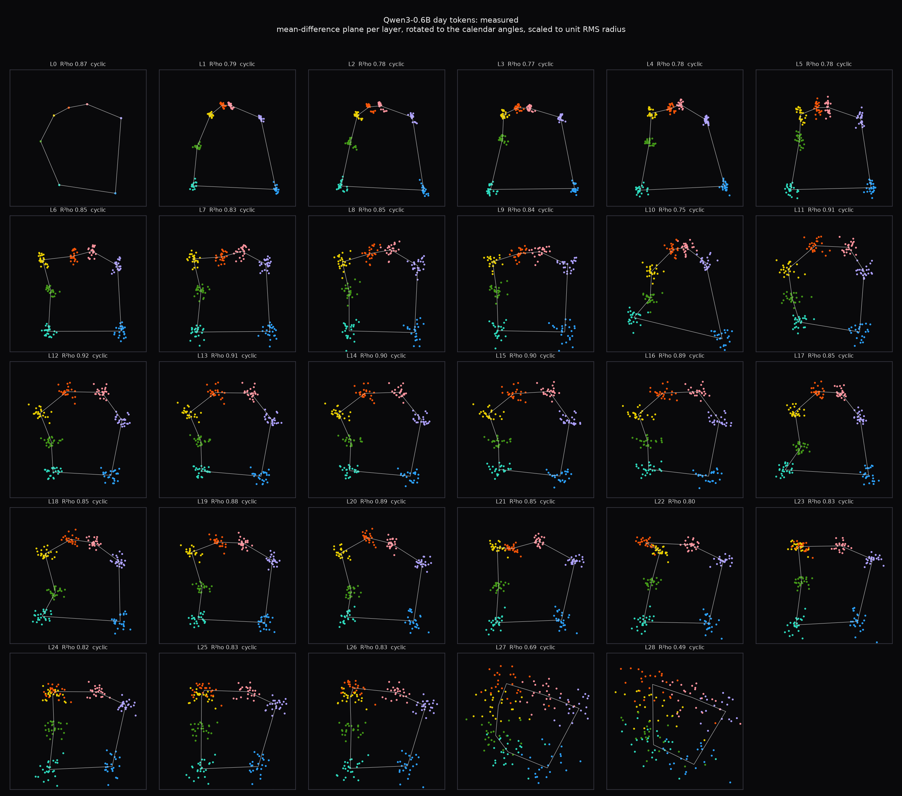 days, measured | 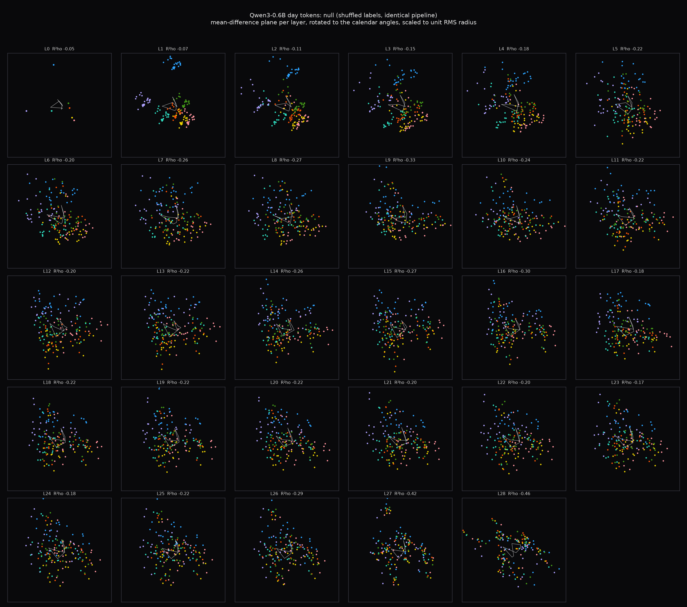 days, point-label null |
| 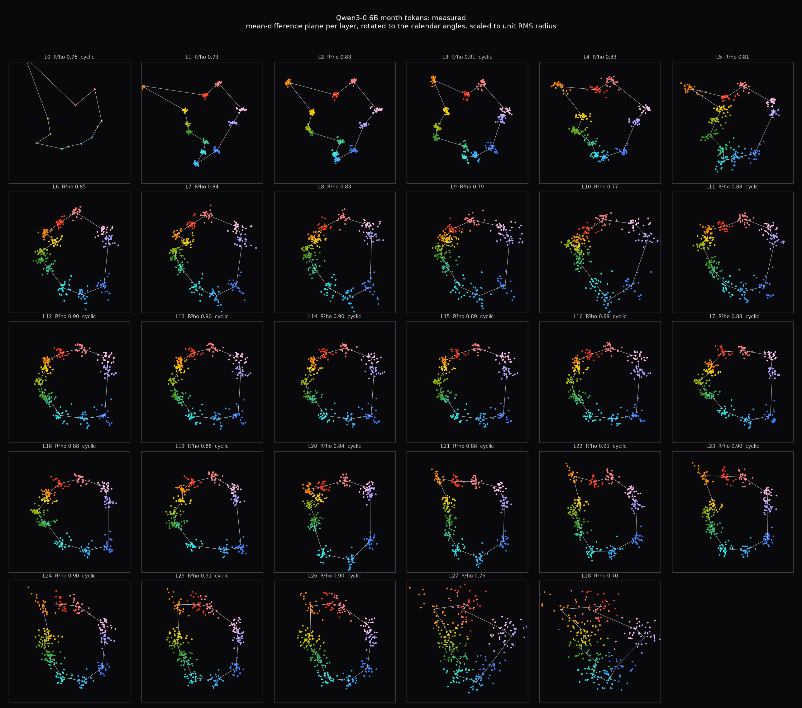 months, measured | 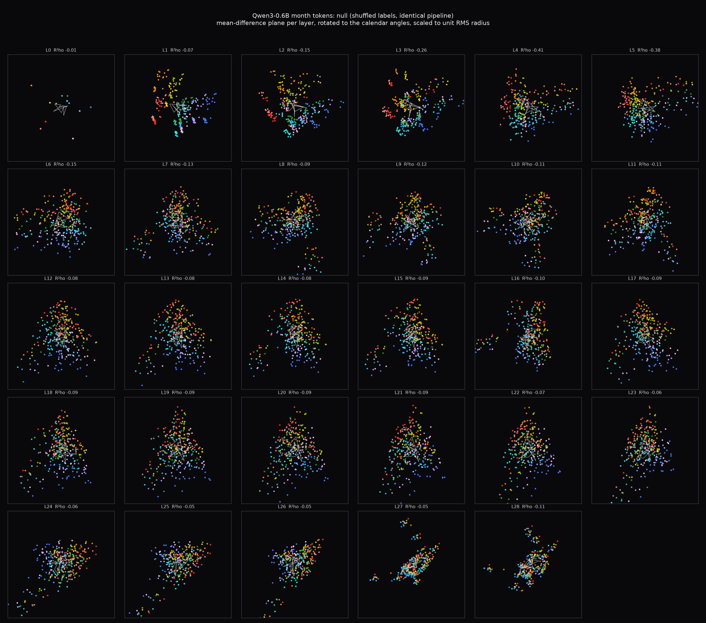 months, point-label null |

**Films.** Glow style, 1024², 30 fps, 24 s, H.264 CRF 27 (re-encoded from `write_film`'s CRF 18 so each file stays under 20 MB). The camera orbits once around the vertical axis at elevation 28°, with a fixed ortho height (the maximum over azimuths).

<video src="gallery/film_turntable_days.mp4" autoplay loop muted playsinline width="45%"></video> <video src="gallery/film_turntable_months.mp4" autoplay loop muted playsinline width="45%"></video>

GIFs: [`film_turntable_days.gif`](gallery/film_turntable_days.gif), [`film_turntable_months.gif`](gallery/film_turntable_months.gif).

### The helix (OLMo-2-0425-1B, numbers 0–999)

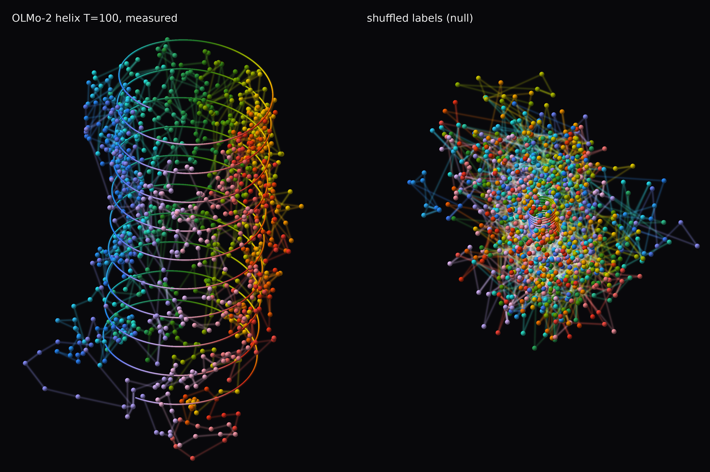

**Helix, glow: measured \| shuffled-label null, same units and camera.**
- Template and layer: `The number {a}`, layer 1 (the output of block 0, K&T's h⁰).
- Beads: the measured states, orthogonally projected in the 100-PC space onto a frame built from the fit. The frame is e1 = fitted cos100, e2 = sin100 made orthogonal to e1, and e3 = the linear direction made orthogonal to both. Units are residual-stream units.
- Fit quality: the circle explains ΔR² = 0.048 of the 100-PC variance (the 100 PCs hold 47.8 % of the layer's variance); the null's fit explains 0.002. The linear coordinate correlates with a at r = 0.975. The median angle error is 10.8° in-sample, against 65° for the null.
- Colour is a mod 100, the period drawn (declared; a last-digit colouring turns into confetti at this period).
- The dim line is the fit, and the faint hairlines join consecutive integers. Both are declared.
- The null's fitted helix collapses to a small coil at the centre of the blob.

| | |
|---|---|
| 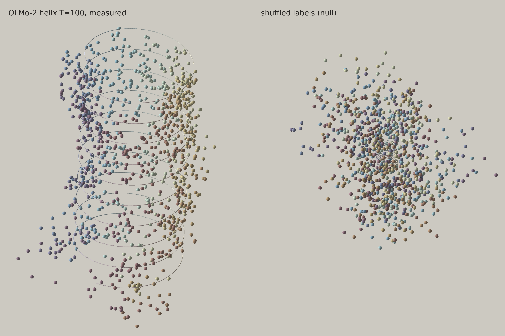 helix, plaster | plotter: [`helix_plotter.svg`](gallery/helix_plotter.svg) (beads + fit line; hairlines omitted) |

**Layer sweep (film).** Layer is time.
- Each measured layer holds for 1 s. The 0.5 s morphs between layers are **linear interpolations, not measurements** (declared).
- Camera fixed. Both panels are divided by the measured layer's RMS in-plane radius.
- 1080×720, 25 s. Measured and null share one camera, centred on their bead means.
- **Declared per-layer zoom:** the frame height is fitted to every bead of that layer in both panels and interpolated during morphs; the overlay prints the zoom relative to layer 0. Bead size is in world units, so beads look smaller when the frame zooms out.
- The helix is present from the embedding through layer 14, then loosens in the last two layers (ΔR²_T100 falls to 0.014 at layer 16).

<video src="gallery/film_sweep_helix.mp4" autoplay loop muted playsinline width="80%"></video> GIF: <a href="gallery/film_sweep_helix.gif">film_sweep_helix.gif</a>

### The knot (secondary plate)

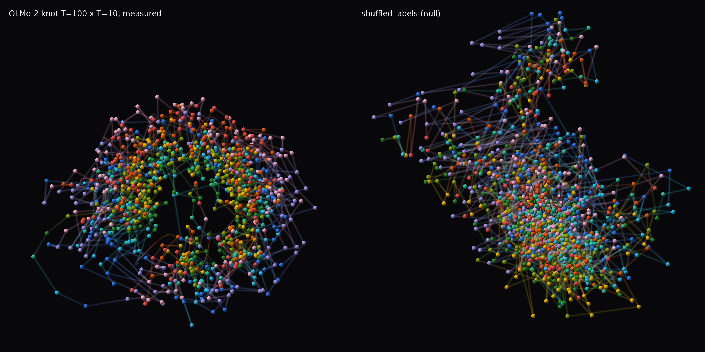

**Knot, glow: measured \| null.**
- θ, ρ are the measured angle and radius of each number in its T=100 plane. φ, r are the measured angle and radius in its T=10 plane, at the same cell.
- They are composed into a torus, ((ρ + s·r·cos φ) cos θ, (ρ + s·r·cos φ) sin θ, s·r·sin φ).
  - The **torus embedding is a declared composition**.
  - s = 0.35 is a declared scale: the measured minor radius is close to the major one, so the unscaled torus would self-intersect.
- The dim line is the fitted (1,10) torus knot, drawn once for 0 ≤ a < 100. Colour is the last digit.
- **T=100 is a genuine ring; T=10 is an ordered ring of clusters.**
  - T=100 explains ΔR² 0.048 (4.8 % of the 100-PC variance) and carries 16 % of all mod-100 structure, against 2 % if that structure were clusters with no ring.
  - T=10 explains ΔR² 0.031 and carries 27 % of all mod-10 structure, against 22 % for clusters.
- **Weakness, stated plainly:** bead noise (12° median angle error plus radial scatter) hides the T=10 winding. The measured image shows the ring and its hole, and the minor winding is readable mainly from the fit line.

| | |
|---|---|
| 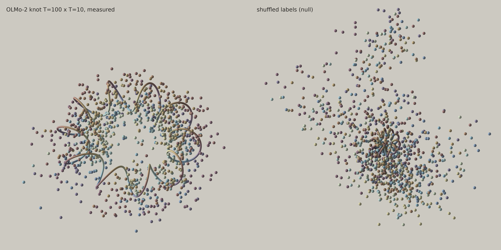 knot, plaster | plotter: [`knot_plotter.svg`](gallery/knot_plotter.svg) |

### Numbers depth tower (OLMo-2, T=100 plane per layer)

| | |
|---|---|
| 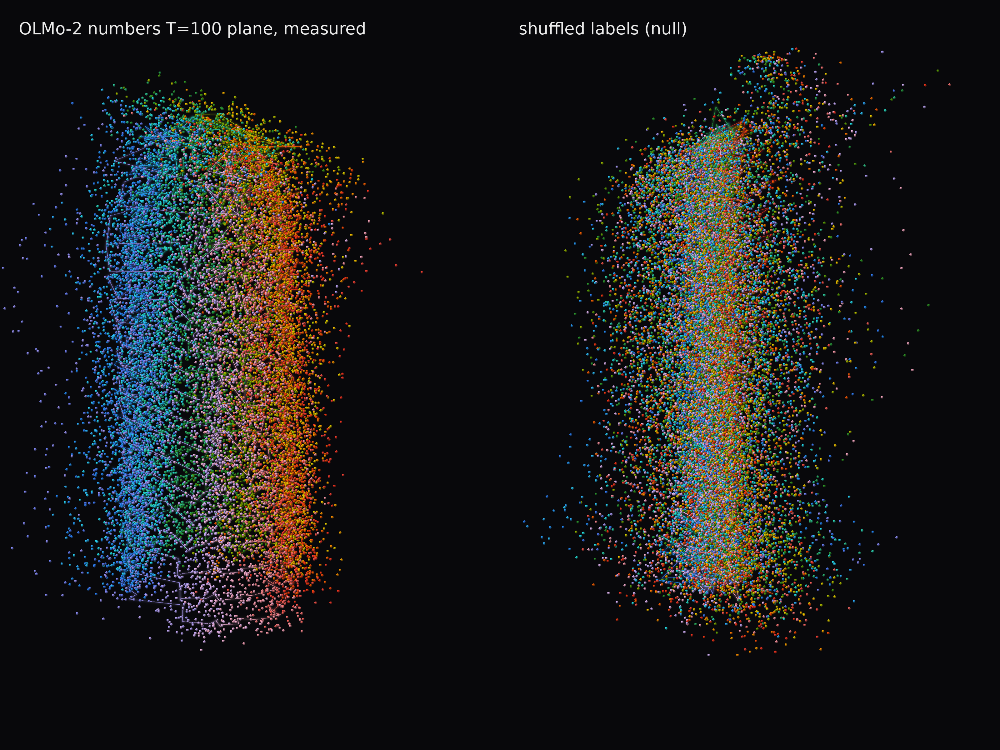 **Numbers tower, glow: measured \| shuffled a.** 1000 numbers × 17 layers, each projected onto that layer's fitted T=100 plane. Colour = a mod 100. Rings join the 100 residue-class means per layer; the null's bright core is its collapsed ring of means. | 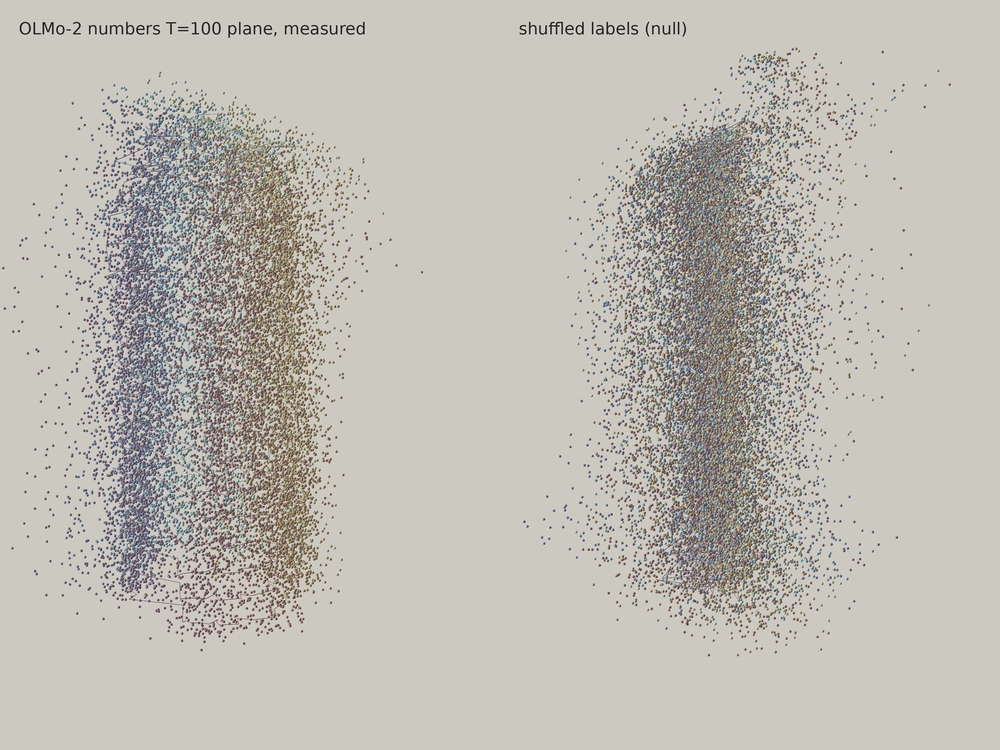 numbers tower, plaster |
| 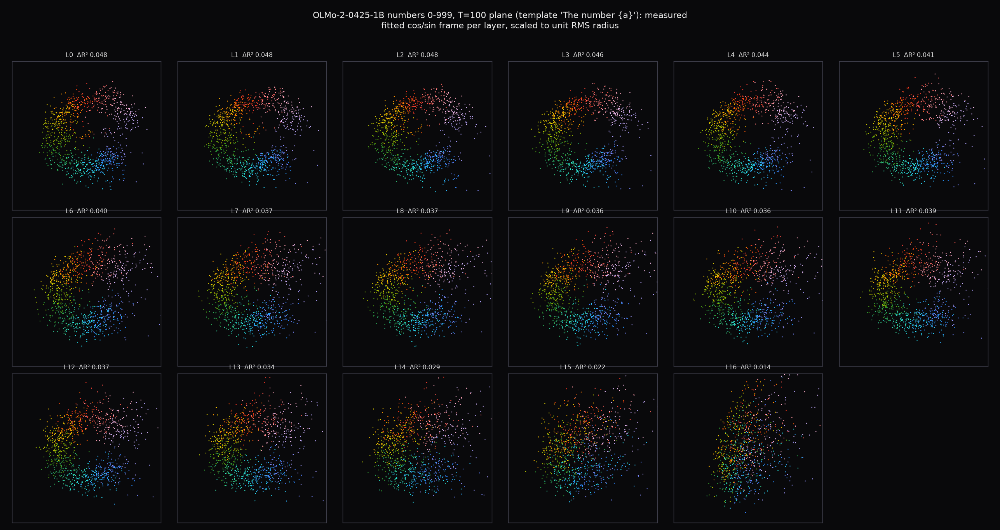 numbers atlas, measured (titled with ΔR²_T100 per layer) | 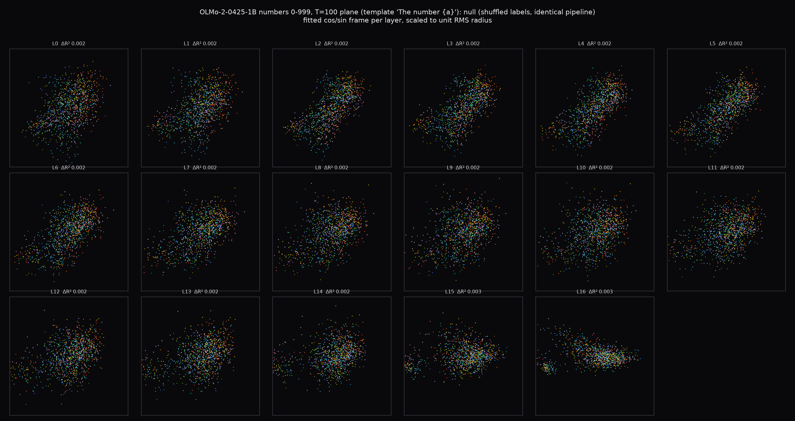 numbers atlas, shuffled-label null |

## What was computed

| Step | Script | What | Wall time |
|---|---|---|---|
| Forward passes | `extract.py --device cpu` | OLMo-2-0425-1B: 4 templates × (1000 numbers + 1000 random single tokens), residual at the target token after the embedding and every block (hooks, so the last layer is before the final norm). Qwen3-0.6B: 24 templates × 7 days and 24 × 12 months. fp32 compute, float16 storage. | **526 s** CPU (GB10 Grace, 4 threads) |
| Fits and nulls | `analyze.py` | PCA-100, K&T helix R² for T ∈ {2,5,10,100} on 0–99 and 0–999, 200 shuffles, random-token null, Fourier spectra, mod-m and poly3 comparators; calendar circle fits with held-out templates, 200 order and 200 point shuffles, exact 360-order enumeration for days | **146 s** CPU |
| Geometry | `geometry.py` | fit frames, bead projections, tower Procrustes and scaling, knot composition, sweep | 20 s |
| Stills | `render_m2.py --size 2400 --device cpu` | r3d `splat_spheres`, `splat_additive`, `ambient_occlusion`, `visible_runs`; 2400 px on the long side | 8.5 min (glow 1–10 s, plaster 39–59 s, plotter < 1 s per image; per-image timings in `timings_2400.json`) |
| Atlases | `render_atlas.py` | matplotlib 2-D plates | 10 s |
| Films | `films.py` | Day and month turntables (720 frames at 1024²) and the helix layer sweep (750 frames at 1080×720), glow style, via `r3d.write_film` (H.264 yuv420p + palette GIF); turntable MP4s re-encoded at CRF 27 | ≈ 590 s per turntable (CPU shared with a still render), 573 s for the sweep |

- **Stack:** GB10, driver 580.173.02, CUDA 13.0, torch 2.14.0+cu130, transformers 5.15. All compute ran on the CPU in fp32, 2026-09-15. No new packages were installed.
- **Tests:** `test_fits.py` (6 synthetic checks) passes.
- **Files over 20 MB:** none.
- **Reproduce** from `art/number-knot/`: run `extract.py --device cpu`, then `analyze.py`, `geometry.py`, `render_atlas.py`, `render_m2.py --size 2400 --device cpu` and `films.py`, all with `OMP_NUM_THREADS=4`.

**Templates (declared).**
- **OLMo-2.** BOS `<|endoftext|>` is prepended to every prompt; the tokenizer adds none. The templates are `{a}`, `The number {a}`, `x = {a}` and `Output ONLY a number. {a}`. The last is K&T's GPT-J prefix; it replaces the plan's `{a}+`, whose state at the number token is causally identical to `{a}`'s. OLMo-2 always emits a separate space token before a number, and that is kept.
- **Random-token null.** 1000 vocabulary tokens that decode to ≥ 2 ASCII letters and round-trip as one token, placed in the number slot at the id level.
- **Qwen3.** 24 day and 24 month templates such as `Today is{w}` and `She was born in{w}` (full list in `common.py`). Every target was asserted to be a single token, and every prompt was asserted to tokenise as prefix + [target].

## Verification

**Numbers, OLMo-2, `The number {a}`, 0–999.** ΔR²_T = R²([1, a, cos, sin]) − R²([1, a]) on the 100 PCs.
- Nulls: shuffled a on the number states, and random tokens with random labels, 200 permutations each. The family-wise 99 % point (max over layers, larger of the two nulls) is 0.0034 / 0.0042 / 0.0046 / 0.0051 for T = 2 / 5 / 10 / 100.
- "share" columns: the fraction of all residue-class structure that the circle captures. If the numbers merely formed residue clusters with no circular arrangement, the expected share would be 0.22 for T=10 and 0.02 for T=100.

| layer | R²_lin | ΔR² T=2 | ΔR² T=5 | ΔR² T=10 | ΔR² T=100 | share T=10 of mod-10 | share T=100 of mod-100 |
|---|---|---|---|---|---|---|---|
| 0 (emb) | 0.078 | 0.015 | 0.031 | 0.031 | 0.048 | 0.27 | 0.16 |
| 1 | 0.085 | 0.016 | 0.031 | 0.031 | 0.048 | 0.27 | 0.16 |
| 4 | 0.127 | 0.017 | 0.030 | 0.028 | 0.044 | 0.26 | 0.15 |
| 8 | 0.104 | 0.023 | 0.030 | 0.027 | 0.037 | 0.24 | 0.13 |
| 12 | 0.097 | 0.025 | 0.035 | 0.031 | 0.037 | 0.24 | 0.12 |
| 16 | 0.123 | 0.012 | 0.015 | 0.012 | 0.014 | 0.21 | 0.08 |

The Fourier power over a has sharp peaks, each ≥ 10× its shuffle envelope:
- T = 100, 50, 25 (0.051, 0.042, 0.020);
- T = 10, 5, 2 (0.033–0.034), T = 2.5 (0.025) and T = 3.3 (0.013).

The 10-periodic structure spreads over its harmonics, which is what residue clusters produce. T=100 dominates its own family.

**Numbers, 0–99 (K&T's range).** Family-wise 99 % null: 0.029 / 0.036 / 0.038 / 0.038.

| layer | ΔR² T=2 | ΔR² T=5 | ΔR² T=10 | ΔR² T=100 | ΔR² poly3 [a², a³] |
|---|---|---|---|---|---|
| 1 | 0.021 | 0.042 | 0.042 | 0.116 | 0.114 |
| 4 | 0.023 | 0.047 | 0.040 | 0.122 | 0.123 |
| 12 | 0.030 | 0.057 | 0.049 | 0.108 | 0.111 |

- T = 2, 5 and 10 reach only 0.9–1.8× the family-wise null on 100 points.
- T=100 clears it, but equals the smooth cubic comparator (same column count). **No T=100 circle is claimed on 0–99.**

**Days and months, Qwen3-0.6B.** Columns:
- *R²ho*: held-out R², with plane and circle fitted on even templates and scored on odd (and swapped).
- *ord99*: 99th percentile over 200 shuffles of the class order.
- *pts99*: 99th percentile over 200 shuffles of all point labels.
- *rank*: exact rank of the true day order among all 360 cyclic orders, counted up to rotation and reflection.

| layer | days R²ho | ord99 | pts99 | cyclic | rank / 360 | months R²ho | ord99 | pts99 | cyclic |
|---|---|---|---|---|---|---|---|---|---|
| 0 (emb) | 0.87 | 0.68 | 0.02 | yes | 1 | 0.76 | 0.40 | 0.01 | yes |
| 4 | 0.78 | 0.65 | −0.01 | yes | 1 | 0.83 | 0.45 | −0.15 | no |
| 8 | 0.85 | 0.66 | −0.04 | yes | 1 | 0.83 | 0.43 | −0.03 | no |
| 12 | **0.92** | 0.69 | −0.05 | yes | 1 | 0.90 | 0.44 | −0.02 | yes |
| 13 | 0.91 | 0.68 | −0.06 | yes | 1 | **0.90** | 0.44 | −0.03 | yes |
| 16 | 0.89 | 0.66 | −0.10 | yes | 1 | 0.89 | 0.44 | −0.06 | yes |
| 20 | 0.89 | 0.72 | −0.08 | yes | 1 | 0.84 | 0.45 | −0.03 | yes |
| 24 | 0.82 | 0.69 | −0.08 | yes | 1 | 0.90 | 0.47 | −0.03 | yes |
| 28 | 0.49 | 0.39 | −0.14 | yes | 1 | 0.70 | 0.41 | −0.03 | no |

- Days: the true order ranks 1st at 27 of 29 layers and 2nd at layers 10 and 22.
- Months: held-out R² exceeds the maximum of 200 order shuffles at all 29 layers.
- Full per-layer tables for all templates and both ranges are generated by `analyze.py` into `cache/tables_M1.md`.

**Rendering checks.**
- Every numbers image and every tower has its null rendered through the identical pipeline, camera and scale.
- The slice atlases reproduce the M1 preview planes (same mean-difference planes).
- The connector sampling spacing is ≤ radius/2. The first render pass showed a string-of-pearls artefact, which was fixed.

## Caveats

- **Numbers explain little variance.** Each circle is 1.5–5 % of the 100-PC variance, even though it beats its null 5–10×. The helix picture shows a real but faint axis through a cloud.
- **T=10 is ten ordered clusters, not a smooth circle.** Its share of the mod-10 structure is only slightly above what clusters with no ring would give (0.27 vs 0.22). The knot's minor winding is therefore an ordered ring of clusters, and bead noise hides it.
- **0–99 is underpowered.** On K&T's own range, OLMo-2-1B shows no significant T = 2/5/10 circles in R², and T=100 there cannot be told apart from curvature.
- **Templates matter.**
  - The number results use one chosen template, picked by a declared rule over 4 templates × 17 layers. The four templates give margins within about 30 % of each other, and `x = {a}` is the weakest.
  - Layer 0 (the embedding) is identical across templates.
  - The calendar results average over 24 templates, and the held-out halves are template splits.
- **Per-layer scaling.** Tower radii are normalised per layer, and the in-plane RMS radius grows from 0.3 to about 45 (Qwen3). Tower silhouettes do not show norm growth, and heights are layer indices.
- **Method differs from Engels et al.** They discovered day/month circles *unsupervised*, with sparse-autoencoder feature clustering. Here the plane is *supervised*: it is the top-2 principal plane of the class means. Order is not used to find the plane, so the exact cyclic order is independent evidence. Still, these circles are a supervised projection, not SAE features.
- **In-sample geometry.** Bead positions are projections onto planes fitted with the same labels. The M1 held-out and shuffle numbers are the calibration for how much of that shape a fit invents.
- **Films interpolate.** In the layer sweep, the frames between layers are linear interpolations.

## References

- Kantamneni & Tegmark, *Language Models Use Trigonometry to Do Addition*, 2025. arXiv:2502.00873. Recipe checked against the paper: PCA-100 at the number token, regression of the PCs on [a, cos, sin] with T = [2, 5, 10, 100], layer-0 output, activation patching (they report no R²).
- Engels, Michaud, Liao, Gurnee & Tegmark, *Not All Language Model Features Are One-Dimensionally Linear*, ICLR 2025. arXiv:2405.14860. Checked: day and month circles found with sparse autoencoders.
- Zhou, Fu, Sharan & Jia, *Pre-trained Large Language Models Use Fourier Features to Compute Addition*, 2024. arXiv:2406.03445. Title and authors checked; NeurIPS 2024 per `ml-art-3d.md`, not confirmed on the abstract page.
- Štefánik, Mickus, Kadlčík, Højer, Spiegel, Vázquez, Sinha, Kuchař, Mondorf & Stenetorp, *Language Models Learn Universal Representations of Numbers and Here's Why You Should Care*, 2025. arXiv:2510.26285. Checked: sinusoidal number embeddings. The abstract does not mention OLMo 2, so the claim in `ml-art-3d.md` that they study OLMo 2 is unverified.
- Models: allenai/OLMo-2-0425-1B; Qwen/Qwen3-0.6B.
