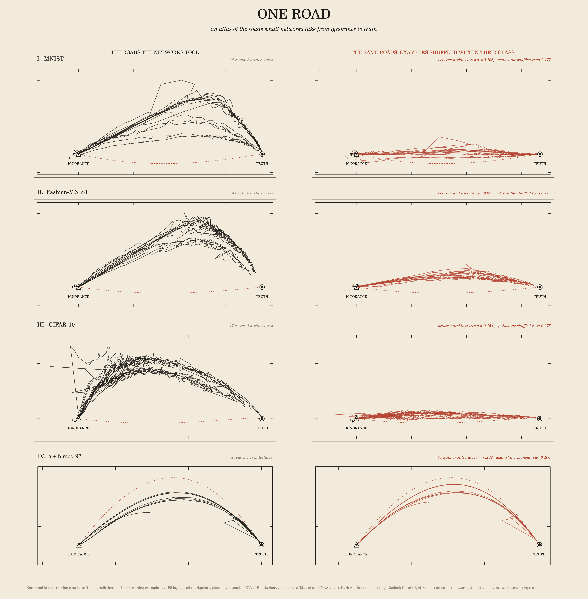

# One Road

*An atlas of the roads small networks take from ignorance to truth. Every training run is drawn as a road
on one map per task, in the shared space of predictions. The question the atlas asks is whether many
architectures take one road. At this scale the answer is: one road with separate lanes.*



## The idea

Weight spaces differ between architectures, so their loss landscapes cannot be laid on one map. Function
space can. Describe a network only by its softmax predictions on a fixed set of probe examples, and an MLP,
a ResNet and a GRU become points in the same space. Mao, Griniasty, ..., Sethna & Chaudhari (PNAS 2024,
*The training process of many deep networks explores the same low-dimensional manifold*) embedded
thousands of CIFAR-10 training runs this way and found that very different networks travel nearly the same
low-dimensional path. The path runs from **ignorance** (the uniform prediction) to **truth** (the one-hot
labels).

This piece redraws that result as a surveyor's atlas. There is one strip map per task. Every run is an
ink road. Ignorance is a triangulation pillar and truth is a town. Beside each map is the null, drawn
with identical treatment in the same embedding, which shows what the map would look like if the roads
coincided only because they share a loss curve.

## What was computed

**Tasks.** All local, in `art/data/`, each with a fixed 10,000-example training subset.

- MNIST, Fashion-MNIST and CIFAR-10 (10 classes).
- *a + b mod 97*: 40% of the 9,409 pairs are used for training (3,763), and the rest are held out.

**Architectures** (`models.py`, default PyTorch initialisation):

| images | mod 97 |
|---|---|
| logistic regression; MLP 1×256; MLP 1×2048; MLP 4×512; CNN (2 conv + 2 fc); ResNet-8 with BatchNorm; ViT (patch 4, d 64, depth 4); GRU reading rows | logistic regression on one-hot a ⊕ b; MLP on embeddings; 1-layer and 2-layer transformers in the style of Nanda et al. |

**Runs.** There are 64 pasar jobs, one per run.

- Each image task has:
  - 8 architectures trained with Adam (lr 1e-3, batch 125, 20 epochs for MNIST and Fashion, 30 for CIFAR);
  - a second seed for MLP 1×256, CNN, ResNet-8 and ViT;
  - SGD with momentum 0.9 for MLP 1×256 and the CNN;
  - on CIFAR only, three earlier SGD pilots: ResNet-8 at lr 0.05, and ViT at lr 0.02 with two seeds. These used batch 128 for 40 epochs, or batch 125 for 40 epochs.
- mod 97 is trained full-batch for 20,000 steps:
  - AdamW with weight decay 1 (this setting groks): transformer-1L ×2 seeds, transformer-2L, MLP ×2 seeds;
  - Adam with no weight decay (these memorise only): transformer-1L, MLP, logistic regression.
- **Shuffled-label runs** use a fixed random relabelling of the training subset:
  - CNN and MLP 1×2048 on each image task, Adam, 60 epochs;
  - transformer-1L and MLP on mod 97, Adam, 6,000 steps.
- **Untrained networks**: 8 extra random initialisations of every architecture, evaluated on the CPU.

**Probes.** 1,000 training examples and 1,000 held-out examples, the same for every run. Log-softmax
is recorded at 90 log-spaced checkpoints for images and 120 for mod 97, with step 0 always included.

**Embedding.** `analyze.py` and `metrics.py` follow the Mao et al. recipe exactly:

- d_B(P_u, P_v) = −(1/N) Σ_n log Σ_c √(p_u^n(c) p_v^n(c)). This is the intensive Bhattacharyya distance: the per-example average.
- W = −½ L D L with L = I − 11ᵀ/m, then the eigendecomposition W = U Λ Uᵀ. Coordinates are U √|Λ|, ordered by |Λ|.
- Explained stress = 1 − √(Σ_{k>d} Λ_k² / Σ Λ_k²). Negative eigenvalues ("time-like" axes) count through Λ², as in the paper. Their share of stress was ≤ 0.5% everywhere except mod 97 on held-out pairs, where it was 6%.
- Progress s = the position on the geodesic Ignorance → Truth that is closest in the per-example arccos distance d_G.
- Trajectory distance (their eq. 5): d_traj = mean over a grid of progress s of d_B between the two runs' checkpoints nearest in s.

A **robustness metric** repeats everything with the per-example Hellinger distance, 1 − mean BC. This
is exactly a squared Euclidean distance between the stacked √p vectors, so its "InPCA" is plain PCA of
√p. It is bounded, and it has no negative eigenvalues.

## The nulls

1. **Examples shuffled within their class (the main null).** Take a run's own predictions and permute the probe examples among those with the same true label. The result has an **identical loss curve**, an identical distance to ignorance and to truth at every checkpoint, identical progress, and identical per-class behaviour. Only *which example is learned when, and confused with what* is scrambled. If the roads coincided merely because the metric and the loss curve force it, then d(A, B) ≈ d(A, shuffled B).
2. **The straight road.** This is the geodesic Ignorance → Truth on the sphere of √p, where every example is equally confident. A label-smoothing mixture (1−α)·uniform + α·one-hot was also tried; it lies on the geodesic to within drawing width.
3. **Untrained networks.** Where does each architecture start?
4. **Shuffled labels.** Do networks memorising noise take the same road?

## What was found

Distances below are medians over run pairs, at matched progress, on the training probe, in nats of d_B.
For scale, d(Ignorance, Truth) = 1.151 for 10 classes and 2.287 for 97.

| task | seed ↔ seed | arch ↔ arch | arch ↔ shuffled-within-class | median ratio | pairs closer than null | stress, top 1 / top 3 |
|---|---:|---:|---:|---:|---:|---:|
| MNIST | 0.042 | 0.106 | 0.177 | 0.68 | 83/83 | 91% / 96% |
| Fashion-MNIST | 0.041 | 0.075 | 0.171 | 0.48 | 83/83 | 88% / 96% |
| CIFAR-10 | 0.098 | 0.154 | 0.275 | 0.55 | 121/121 | 77% / 90% |
| a + b mod 97 | 0.242 | 0.282 | 0.406 | 0.69 | 22/22 | 94% / 98% |

- **The shared road is real, and it is not forced by the metric.** Every one of the 309 cross-architecture pairs is closer than the same pair after class-preserving shuffling. The ratio is 0.44–0.69, depending on the task and the probe split (0.81 on held-out mod 97). In the Bhattacharyya map this is the most visible thing on the sheet: the real roads bow out together in one arc, while the shuffled roads, which have the same loss curves, collapse onto the straight road. The "tube" measure is the distance from each run's checkpoints to the pooled checkpoints of *other* architectures. It is 0.022 against 0.090 for its shuffled self on MNIST, 0.025/0.129 on Fashion and 0.073/0.170 on CIFAR.
- **But it is one road with lanes, not one road.** Different architectures sit **1.6–2.5× further apart than two seeds of the same architecture** on the image tasks. Seeds of one architecture, and Adam against SGD, overlap almost exactly. On MNIST the MLPs and the CNN share a high lane, while ResNet-8, ViT and the GRU run a lower, straighter one (peak heights 0.31–0.40 against 0.11–0.23 on the plate). The between-architecture distance is about as large as each road's distance from the trivial straight road (MNIST 0.106 against 0.114). The "one road" is a shared *direction of deviation* from the straight road, not a single line. Mao et al. reported this too ("network architecture does produce distinguishable paths").
- **Untrained networks all start at ignorance.** d(init, Ignorance) is 0.0001–0.044 against a road length of 1.151. The farthest starts are logistic regression and the ViT.
- **On examples never seen, the roads fork** (`plate_roads_cifar_te.png`, `one_road_atlas_te.png`). On held-out CIFAR images the atlas splits into three valleys. The MLPs climb away into confident errors (overfitting). The CNNs and GRU take a middle road. ResNet-8 and ViT take a low road. None reaches truth. The null ratio is unchanged (0.53), but the picture is no longer one road.
- **Memorising shuffled labels takes the other road** (`other_road_tr.png`). Measured against the true labels of the same training examples, shuffled-label runs make *zero* progress (s = 0.00–0.03). On the image tasks they end 3.8–8.8 nats from truth, 3–8× further than ignorance is; on mod 97 they end 12–26 nats away. They leave ignorance at a steep angle to every true road. Their tube distance to the true roads is 0.09–0.28, against 0.02–0.07 between true roads.
- **mod 97 is the weak case.** On the training pairs, the road is only a little more shared than its shuffled null: tube 0.038 against 0.052, and ratio 0.69 against 0.44–0.55 for images. That fits memorisation being example-by-example. On held-out pairs (`long_way_round_modadd_H.png`), the grokking roads (AdamW, weight decay 1) first walk *away* from truth while they memorise, reaching held-out loss of about 25 nats, and then swing back and arrive (■ marks 99% held-out accuracy). The roads without weight decay stall in the field. **The Bhattacharyya map breaks here:** at 25 nats it is dominated by probabilities of 1e-11, the final grokked checkpoints no longer land on the truth point, and 6% of stress is time-like. That plate therefore uses the Hellinger embedding, as a declared choice. The Bhattacharyya version is kept for comparison (`long_way_round_modadd.png`).
- **The picture is metric-sensitive; the numbers are not** (`one_road_atlas_tr_H.png`). Under the Hellinger embedding the shuffled roads also bow, to roughly half the height of the real ones. The flat red null in the hero sheet is therefore partly a property of the Bhattacharyya embedding. The quantitative ratio barely moves (0.72 / 0.54 / 0.61 / 0.75), and every cross-architecture pair is still closer than the null.
- **Straight line in weight space** (`straight_line_becher.png`). Along θ(α) = (1−α)θ_init + α θ_final, training loss falls monotonically between init and solution for 27 of 30 seed-0 runs, as Goodfellow et al. (2015) found. The exceptions have rises under 0.01 nats (two MLPs) or, for ResNet-8, a bump of 0.02–0.11 nats before the drop. ResNet-8 and the transformers sit on a flat plateau for most of the line and fall off a cliff only in the last ~10–20%. For the grokking transformers and MLP, held-out loss (red) falls with train loss along the whole line. The ResNet line stops at α ≥ 1.05 because the forward pass returns NaN there. The likely cause is extrapolated BatchNorm running variances going negative; this was not checked.

**Verdict.** The "one road" claim holds at small scale in its measurable form: across 8 architectures
and 3 image tasks, training trajectories are about twice as close to each other as the class-preserving
null allows, and the top 3 components carry 90–96% of the stress. It does not hold in its strongest form:
architectures take separate, reproducible lanes, the held-out picture forks, and on modular addition
the shared part is small.

## Images

| file | what |
|---|---|
| `gallery/one_road_atlas_tr.png` | **Hero.** Four strip maps (training probe), roads beside their class-shuffled null; 6400 px wide (74 cm at 8,600 px/m) |
| `gallery/plate_roads_cifar_te.png` | The held-out fork on CIFAR-10, with every lane named |
| `gallery/long_way_round_modadd_H.png` | Grokking as a detour, with memorised and grokked markers |
| `gallery/other_road_tr.png` | Shuffled-label roads (red) against the true roads (ink) |
| `gallery/one_road_atlas_te.png` | The atlas surveyed on held-out examples |
| `gallery/one_road_atlas_tr_H.png` | Robustness: the same atlas under the Hellinger embedding (the null bows too) |
| `gallery/plate_roads_{mnist,fashion,cifar}_tr.png` | Single-task plates with named lanes |
| `gallery/straight_line_becher.png` | Goodfellow line in a Becher grid, identical axes |
| `gallery/contact_sheet.png` | Contact sheet of six |

## Declared aesthetic choices

- **Register:**
  - ink `#1c1a17` and surveyor's red `#b3402f` on cream `#f2ebdc`, set in Century Schoolbook (C059);
  - a double neat-line frame with ticks every 0.1 map units;
  - red is reserved for construction and nulls: the straight road, the shuffled roads, and the shuffled-label runs.
- **Orientation:**
  - the (PC1, PC2) plane is rotated so that Ignorance → Truth runs left to right;
  - PC2 is flipped so the real roads bow upward;
  - each map is scaled so that |Ignorance → Truth| in the plane is 1.
  - These are isometries plus one scale per map. Rows of a sheet share the horizontal scale, and each row is cropped to its own height.
- **Roads:** straight segments between measured checkpoints, with no smoothing. Jaggedness is real checkpoint-to-checkpoint movement: mini-batch noise, and SGD or Adam spikes. The wild strokes near ignorance on CIFAR are early MLP 1×2048 (Adam) and BatchNorm-in-eval-mode excursions, kept as measured.
- **Labels:** place names sit at each architecture's first road apex, with leader lines. The stacking of labels is layout, not data.
- **Symbols:** Ignorance is a trig pillar; Truth is a town symbol; + marks an untrained network.

## Prior art

- Mao et al. (PNAS 2024; arXiv 2305.01604):
  - their figures are 3D InPCA scatter and line plots of CIFAR-10 and ImageNet trajectories, coloured by configuration;
  - they note that initialisations start near P0, and they mention fitting random labels first as a way to start elsewhere;
  - they report no class-preserving null, no held-out fork, no algorithmic or grokking task, and no metric-robustness check.
- InPCA itself is from Quinn et al. (2019).
- The same group maps *tasks* rather than runs in "A picture of the space of typical learnable tasks" (Ramesh et al., 2023).
- The straight-line probe is Goodfellow, Vinyals & Saxe (2015).
- A search found no atlas or typology rendering of these trajectories, and no study putting grokking runs in prediction space.

**New here:**

- a typology of four tasks in one frame;
- the within-class shuffle null, which holds the loss curve fixed and puts a number on the "is it forced by the metric?" question;
- the held-out fork;
- shuffled-label memorisation as a separate road;
- grokking as a detour in prediction space, together with the finding that d_B breaks on it;
- the observation that the visual contrast of the null depends on the metric.

## Compute

- **GPU:** 64 pasar jobs, ids 665–730 (tag `art-one-road`, by `art-oneroad`), all shared (`--mem 3–4G`).
  - The sum of job wall time is **2.45 h**, inside the 3 h budget.
  - The GPU was shared with the other overnight agent's jobs throughout, so actual GPU occupancy was far lower.
  - Two jobs were cancelled to stay in budget: #667, an eager-mode duplicate, and #722, the second seed of transformer-2L.
  - Job #717 was a profile run. It found that `emb[tok]` indexing had a 24 ms/step backward; this was replaced with `F.embedding`.
- **CPU:**
  - distance matrices: ≈ 1 min per task;
  - the straight-line losses: ≈ 15 min;
  - rendering: ≈ 1 min per sheet.

```
cd art/one-road
../.venv/bin/python prep_data.py                      # CPU: 10k subsets, probes, shuffled labels
./drive_queue.sh queue_images.txt 4; ./drive_queue.sh queue_modadd.txt 5   # pasar, one job per run (submit.sh)
for t in mnist fashion cifar modadd; do ../.venv/bin/python analyze.py --task $t
  ../.venv/bin/python metrics.py --task $t; ../.venv/bin/python metrics.py --task $t --metric H; done
../.venv/bin/python lineloss.py
../.venv/bin/python render_plates.py hero hero_te hero_H memo grok plate_mnist:tr plate_cifar:te plate_cifar:tr plate_fashion:tr
../.venv/bin/python render_lines.py; ../.venv/bin/python contact_sheet.py
```

Distances, embeddings and per-pair tables are in `cache/metrics_<task>[_H].json`, under the keys `dtraj_rows`, `tube_rows` and `per_run`.

## Honest limits and next moves

- **Scale and coverage:**
  - the training subset is 10,000 examples, the networks are tiny, and training is short and constant-lr;
  - only 4 of 8 architectures have a second seed;
  - there is one shuffled-label run per architecture.
- **Probe:** the probe is 1,000 examples, and d_traj uses nearest-checkpoint matching in progress.
- **Metric dependence:**
  - the within-class shuffle is one null among several possible ones;
  - a stronger null would keep each example's *difficulty*, meaning its correct-class trajectory, and scramble only the confusions. That would split the shared road into "same easy examples" and "same mistakes".
- **Most promising next move:** the held-out fork. Run 5 seeds per architecture on CIFAR-10 held-out probes and test whether the three valleys (MLP, conv or recurrent, ResNet or ViT) are stable, separable lanes, for example by the seed-vs-architecture distance ratio per valley. Then draw that sheet as the second hero: *one road on what they were taught, three roads on what they were not.*
