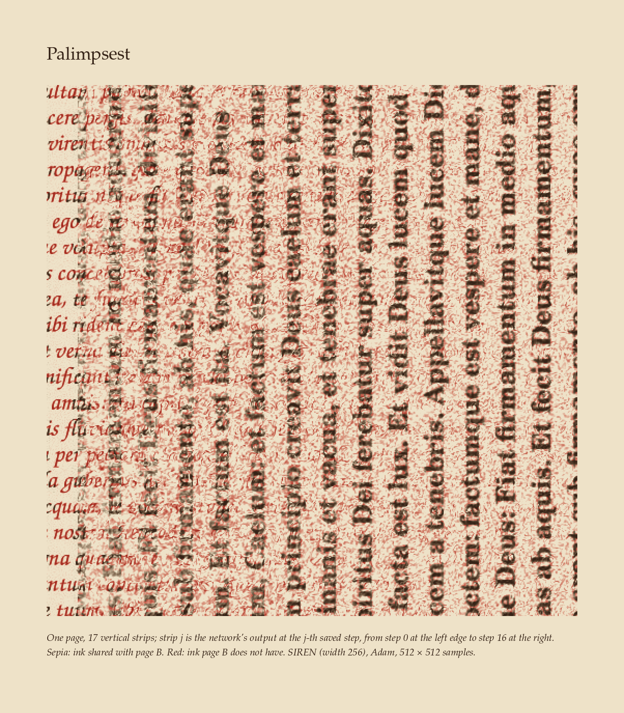
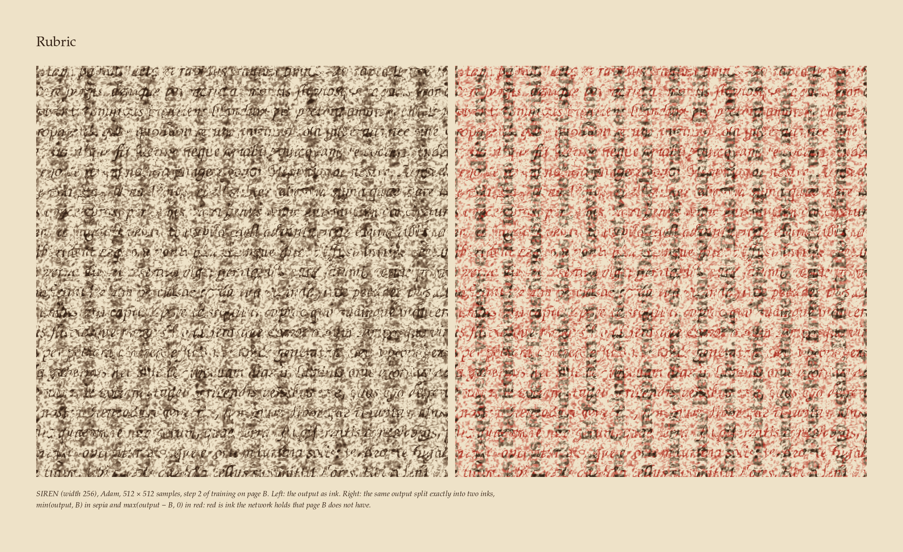
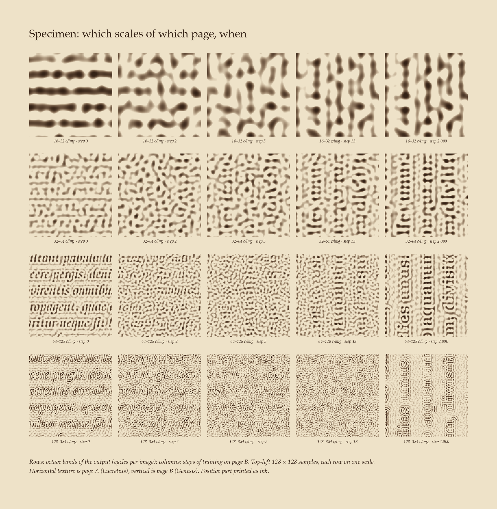
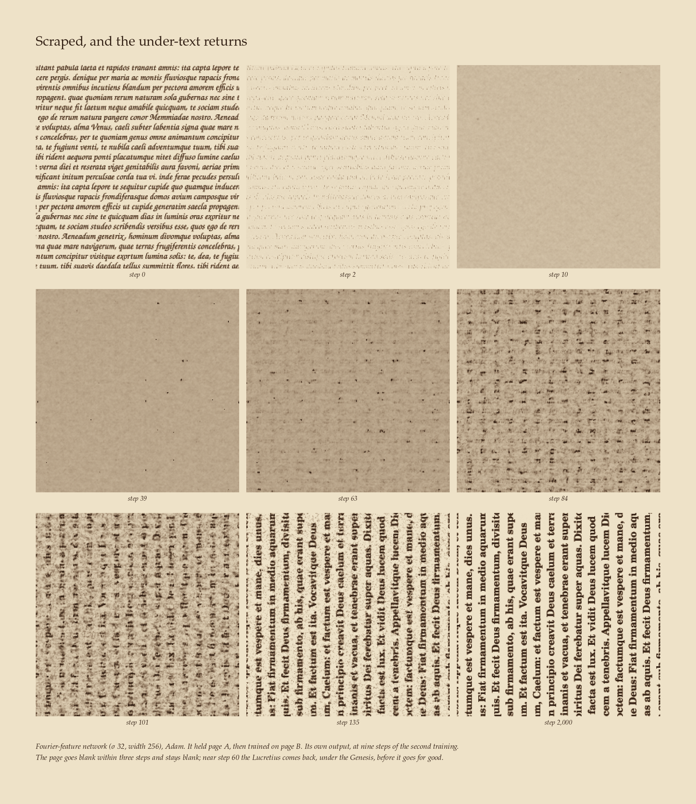
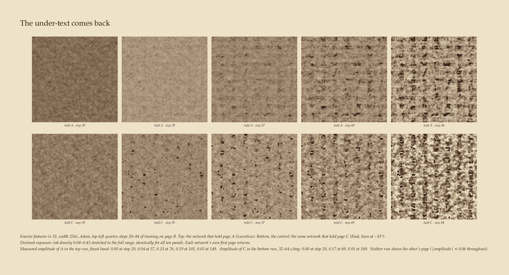
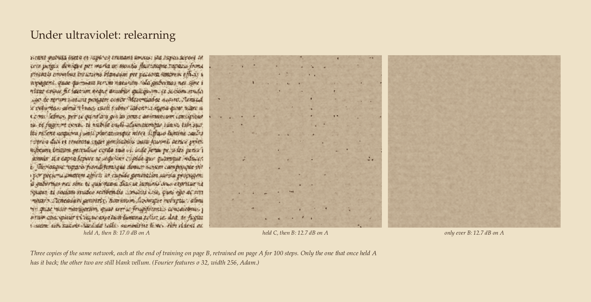
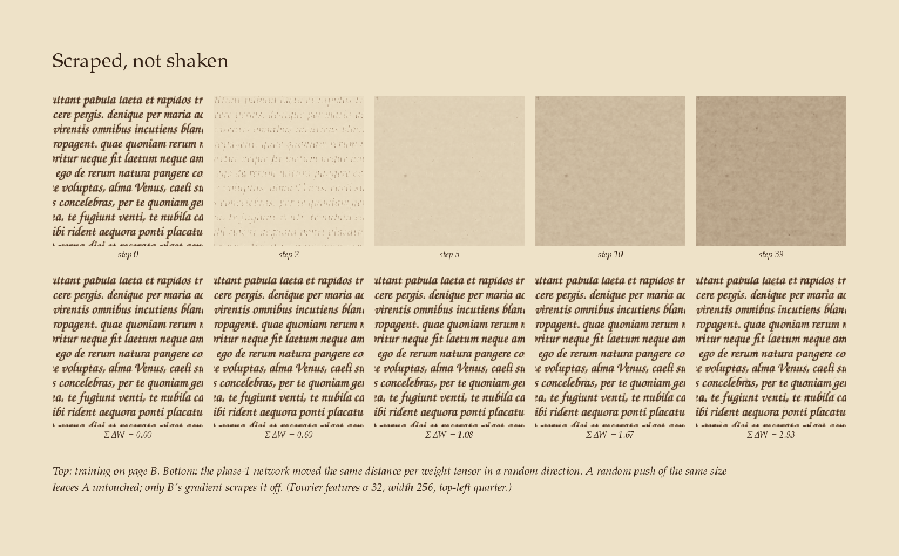
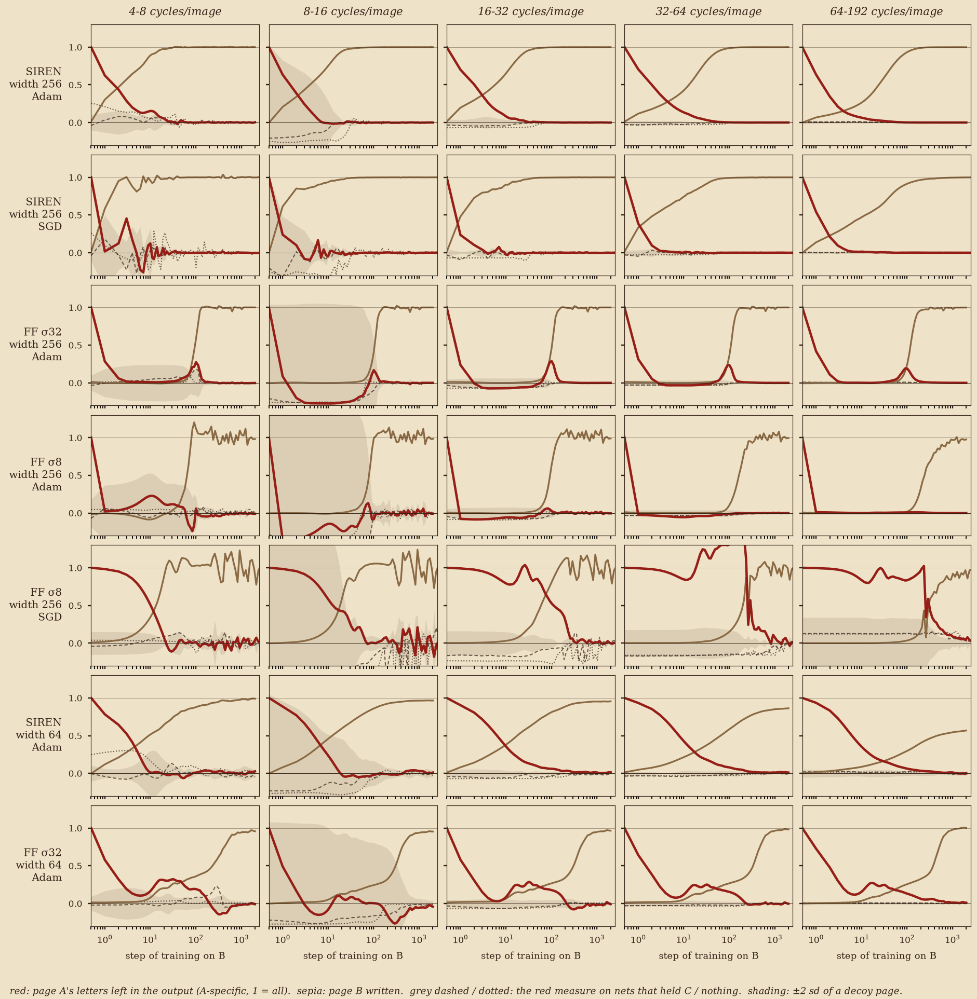

# Palimpsest

*Train a small coordinate network to draw one page of Latin, then train it on a second page written across the first. Does the old text survive under the new one, as on a scraped and rewritten parchment? On the pixel grid, at the end: no, in every network tried. On the way there: yes, for a few steps, and in two different ways depending on the architecture. In one of them the under-text comes back after the page has gone blank, and the weights keep it after the output has lost it.*



## The finding

1. **At the end, nothing is left on the grid.** When phase 2 converges, the amount of A's letters left in the output of every width-256 SIREN or Fourier-feature network is below 0.003 in every band from 8 cycles/image up. The coarse bands read up to 0.015, but so do the controls that never saw A. There is no ghost to find in the final page. The underparameterised width-64 networks leave faint on-grid traces, each from one seed:
   - Fourier features σ 32 keeps **0.008** of A's finest band (decoy sd 0.0009; controls −0.001 and −0.0003);
   - Fourier features σ 8 keeps 0.006 (sd 0.002);
   - SIREN keeps 0.10 ± 0.03 of its coarsest band, with controls at −0.02 and −0.03, which is too noisy to claim.

   Under 1% is not a ghost anyone could see.
2. **SIREN: the hypothesis holds, briefly.** B's broad strokes land in 1–4 steps while A's finest letters are still there. The palimpsest index, the largest overlap over time of "B written at 2–16 c/img" with "A left at the finest bands", is 0.34–0.49. The reverse ordering (A's coarse structure under B's fine detail) scores 0.16–0.21. This holds for 2 seeds, SGD, width 64 and 512 px. But A is erased faster than B is written at *every* scale (A half-life 1–4 steps; B half-life 0.7 steps at the coarsest band, 24 at the finest). So between the two texts there is a scraped moment, around steps 4–6 (3–18 at 512 px), when the finest band holds at most 16% of either page (9% at 512 px). The specimen plate shows it.
3. **Fourier features: scraped blank, then the under-text returns.** With Adam, A vanishes from every band in under one step (half-life 0.7–0.9). The page stays uniform grey for about 40 steps. Then A comes *back*, reaching amplitude 0.19–0.34 around step 100 alongside the first strokes of B, and fades by step 150–200. This happened in both seeds, at width 64 as well. There is no spectral ordering at all: B is written in every band at once (half-life 96–124 steps), and the reverse index wins (0.29–0.31 against 0.19–0.21). **Control:** the same network trained on C (the Iliad) then B brings back *C* instead (0.17 at 32–64 c/img around step 69) and never A (|amplitude| < 0.06 throughout).
4. **The optimiser decides whether erasing and writing are the same process.** With Fourier features σ 8 and SGD with momentum, A fades at the rate B is written, band by band: the ratio of the two half-lives is 0.8–2.8, as a linearised network predicts. With Adam on the same network the ratio is 0.003–0.012: A is scraped wholesale before anything is written. Caveat: SGD learned this page less well in phase 1 (13.9 dB against 25.5 dB), and on SIREN, SGD scraped as fast as Adam.
5. **Why: B's gradient points at A.**
   - **Random kick.** Moving the phase-1 weights the same distance per tensor in a *random* direction leaves A intact: Fourier features keep 0.99–1.01 of A in every band at the distance where training on B has left ≤ 0.02 in the three finest bands (step 5), and SIREN keeps 0.67–1.03 where training has left 0.12–0.27 (step 5).
   - **Tangent kernel.** After phase 1, the Fourier network's kernel gain along A's finest band is **317×** its gain along B's, and **35×** along decoy pages in the same hand. At initialisation both ratios are about 1. The network has become an instrument tuned to page A, so any gradient step moves A first. SIREN's kernel is barely A-specific (1.5× B, 1.0× decoys). Instead, training on *any* page widens SIREN's kernel bandwidth by four orders of magnitude at the finest band (gain 28 → 4 × 10⁵). That is why a SIREN that held A or C writes B's fine detail 6.6× faster than a fresh one (half-life 24 vs 158 steps).
6. **Under ultraviolet: the weights remember what the page forgot (Fourier features only).** After phase 2, the Fourier network's kernel is *still* aligned with A's letters: 4.0× and 7.8× the decoys at the finest band for seeds 0 and 1, against 1.0 for the controls. Retrained on A, it has the Lucretius back at **26.3 dB after 150 steps, against 13.2 and 13.0 dB** for the copies that held C or nothing (still blank). SIREN shows no A-specific savings: 34.0 dB after 100 steps, against 33.1 for C→B, while scratch reaches 24.1. That is transfer from "having held a page", not memory of A.
7. **Between the pixels, a trace is measurable but not legible.** Sampled half a pixel off the training grid, the final network still holds A in its finest band:
   - SIREN: 0.019 and 0.018 (2 seeds);
   - Fourier features, width 256: 0.023 and 0.027;
   - Fourier features, width 64: **0.136**.

   The decoy sd there is 0.001–0.003 and the controls read ≤ 0.007. On the grid the same numbers are < 0.001. The training data only constrains the grid points, and some of A survives in what they cannot see. But off-grid, B itself is only reproduced to 17–22 dB, and its error swamps the trace. A band-pass or directional filter did not make the letters readable, so no recovery plate is shown. It can be detected by correlation with the known text, which is collation, not reading.

Per-configuration numbers (half-lives exclude the 1–2 c/img band; decoy sd at the end is ≤ 0.0003 in the finest band for width 256):

| network | phase-1 PSNR on A | final PSNR on B | A half-life (steps, by band) | B half-life | B-coarse-over-A-fine / reverse | A left at end, finest band (A→B / C→B / none) | relearn A, 100 steps (A→B / C→B / none) |
|---|---:|---:|---|---|---|---|---|
| SIREN w256 Adam s0 | 43.3 | 51.1 | 1.4–3 | 2.3–24 | 0.41 / 0.21 | +0.0001 / +0.0000 / +0.0001 | 34.0 / 33.1 / 24.1 |
| SIREN w256 Adam s1 | 47.3 | 44.7 | 1.1–3 | 2.5–24 | 0.39 / 0.17 | +0.0001 / – / +0.0001 | 36.1 / – / 25.9 |
| SIREN w256 Adam s0 512px | 27.6 | 30.4 | 0.9–2 | 2.2–94 | 0.34 / 0.18 | +0.0003 / – / – | 21.3 / – / – |
| SIREN w256 SGD s0 | 39.6 | 53.3 | 0.7–1 | 0.9–12 | 0.47 / 0.16 | -0.0000 / -0.0001 / -0.0003 | 27.6 / 26.7 / 19.6 |
| SIREN w64 Adam s0 | 17.3 | 17.3 | 4.4–7 | 3.3–457 | 0.49 / 0.19 | -0.0002 / -0.0031 / +0.0012 | 14.8 / 14.7 / 14.9 |
| FF σ32 w256 Adam s0 | 46.4 | 48.8 | 0.8–1 | 96.3–119 | 0.21 / 0.31 | +0.0002 / +0.0002 / +0.0003 | 17.0 / 12.7 / 12.7 |
| FF σ32 w256 Adam s1 | 49.4 | 48.4 | 0.8–1 | 95.7–124 | 0.19 / 0.29 | +0.0002 / – / -0.0001 | 21.6 / – / 12.7 |
| FF σ32 w64 Adam s0 | 31.8 | 26.7 | 1.2–2 | 237.0–374 | 0.19 / 0.28 | +0.0083 / -0.0010 / -0.0003 | 14.8 / 13.3 / 12.9 |
| FF σ8 w256 Adam s0 | 25.5 | 38.6 | 0.7–1 | 63.8–242 | 0.00 / 0.04 | +0.0003 / +0.0004 / +0.0006 | 15.3 / 13.9 / 12.9 |
| FF σ8 w256 SGD s0 | 13.9 | 36.3 | 10.7–253 | 13.4–296 | 1.10* / 0.09 | +0.0009 / +0.0009 / +0.0006 | 13.0 / 12.7 / 12.6 |
| FF σ8 w64 Adam s0 | 23.6 | 19.6 | 0.7–1 | 78.9–361 | 0.13 / 0.38 | +0.0058 / +0.0020 / +0.0001 | 13.7 / 12.7 / 12.7 |
| relu w256 Adam s0 | 13.3 | 11.2 | 0.6–1 | 1.3–1602 | -0.00 / 0.06 | +0.0055 / – / +0.0053 | 12.9 / – / 12.6 |

\* Inflated: this run barely learned A's fine bands in phase 1, so their normalised amplitude is noise.

**Real or null?** The final-state palimpsest is a null. The transient is real and reproducible, and so is the latent memory in the Fourier network. Both depend on the architecture, and the transient also depends on the optimiser, in the specific ways above. The plain ReLU MLP never learned more than A's coarse layout (13.3 dB), so it had nothing to forget, and it is left out of the plates.

## The pieces



**Rubric** (`rubric_siren_n512.png`). SIREN at 512 × 512 samples, step 2 of training on B. On the left, the output printed as one ink: the italic Lucretius runs under the Genesis columns. On the right, the same output split *exactly* into two inks. The part of the output within page B's ink prints in sepia; the excess prints in madder red, as a rubricator's ink. The red is precisely the ink the network holds that page B lacks.

**Palimpsest** (`palimpsest_slit_siren_n512.png`, top of page). One page cut into 17 vertical strips, with time running left to right: strip j is the output at step j (0–16). Because B's lines are vertical, each strip holds whole columns of B. A's lines run horizontally across the strips, so you can read the Lucretius until it fades.



**Specimen** (`specimen_bands_siren_n512.png`). Rows are octave bands of the output and columns are steps. Horizontal texture is A and vertical texture is B, so the plate can be read without a key:
- at step 2, A's letters are still sharp at 128–384 c/img, while B's columns have started at 16–32;
- at steps 5–13, the fine bands hold mostly neither page (the scraped moment);
- by step 2,000, only B remains.



**Scraped, and the under-text returns** (`scraped_ff32_w256.png`). The Fourier-feature network, with nine steps in a 3 × 3 typology. Blank at steps 10 and 39. The return is easier to see in **The under-text comes back** (`resurface_ff32_w256.png`), which crops the top-left quarter under a declared, identical exposure. It has the C→B control underneath: each network brings back its *own* first page.





**Under ultraviolet: relearning** (`uv_relearn_ff32_w256.png`). Three copies of the Fourier network at the end of training on B (held A / held C / held nothing), each retrained on A for 100 steps. Only the first has the page back.



**Scraped, not shaken** (`kick_ff32_w256.png`). Top row: training on B. Bottom row: the same distance moved in a random direction. In high dimensions a random direction is mostly inert, so this control says the erasure is *directed*, not merely *large*. The kernel measurement says the direction is A.



**The measurement** (`measurement_curves.png`). Per band and per network, in the same register:
- red: A's letters left in the output (A-specific, 1 = all);
- sepia: B written;
- grey dashed / dotted: the same red measure on nets that held C / nothing (never saw A);
- shading: ±2 sd of a single decoy page.

In the FF σ8 SGD row, the finest bands of A were barely learned in phase 1 (fit 0.20 and 0.04), so their normalised curves are noise.

Also in `gallery/`: `broad_strokes_siren_n512.png` and `broad_strokes_siren_w256.png` (SIREN typologies: B's columns over A's letters at steps 1–5), `rubric_siren_w256.png`, and `contact_sheet.png`.

## Declared aesthetic choices

- **Register:** iron-gall sepia (#342216) and madder red (#9e261c) on calf vellum (#eee2c8). This is a light key, and every sheet uses the same frame, margin, caption block and typeface (URW P052).
- **Ink law:** density d prints as vellum × (ink/vellum)^d per channel (Beer–Lambert), so overlapping inks darken multiplicatively.
- **Two-ink split:** output = min(output, B) + max(output − B, 0). This is an exact identity, not a filter. Red therefore includes any excess ink (noise as well as A), and the captions say so.
- **Enlargement:** nearest-neighbour only (one sample = k × k print pixels). No interpolation.
- **One exposure stretch:** `resurface_ff32_w256.png` maps density 0.08–0.45 to 0–1, identically for all ten panels, stated on the plate. Every other panel prints density as measured.
- **Band specimen:** each row is scaled by its own 99.5th percentile of |band-passed output|, across that row's panels, and only the positive part prints.
- **The choice of steps and crops is mine.** The "palimpsest moment" (step 2) is where the palimpsest index peaks.
- **Print size:** the hero pages are 512 samples wide. At 8,600 px/m with 2 print pixels per sample, the honest print is about 12 cm: a manuscript leaf, not a wall.

## What was computed

**The pages** (`pages.py`). Every page is drawn with PIL at 1024 px and box-filtered down to the training resolution. The value is ink density: 1 is ink, 0 is bare vellum.

| page | text | hand (font) | line direction | line pitch (at 1024 px) | role |
|---|---|---|---|---|---|
| **A** | Lucretius, *De rerum natura* I.1–26 | URW Z003 (a chancery italic) | horizontal | 50 px | the under-text |
| **B** | Vulgate, Genesis 1:1–8 | URW C059 Bold (a book hand) | vertical (90°) | 69 px | the over-text |
| **C** | *Iliad* I.1–10, in Greek | DejaVu Serif | −33° | 59 px | unrelated first page (null b) |
| **D1–D4** | the words of A, shuffled | same as A | same as A | same as A | decoys (null c) |

B runs at right angles to A, as the prayer-book text of the Archimedes Palimpsest runs across Archimedes. That choice is also a measuring instrument: in any band-passed picture, horizontal texture is A and vertical texture is B. Pixel correlations between pages at 256 px: A–B 0.006, A–C 0.000, B–C 0.006; A–decoy 0.37 (shared ruling and hand, by construction).

**The networks** (`train.py`). All take (x, y) and return one ink density, with 4 hidden layers. Full-batch MSE on every pixel.
- **SIREN** (Sitzmann et al. 2020): ω₀ = 30, the paper's initialisation; Adam lr 1e-4.
- **Fourier features + ReLU MLP** (Tancik et al. 2020): 256 Gaussian frequencies with σ = 8 or 32 cycles per image; Adam lr 3e-4.
- **Plain ReLU MLP**: Adam lr 1e-3.
- **SGD with momentum 0.9**: SIREN lr 1e-2, FF σ=8 lr 1e-1. These were the only SGD settings that learned anything in a 400-step pilot (jobs 768–773). The other SGD runs sat at the mean-ink PSNR (12.6 dB).
- **Widths**: 64 and 256 at 256 × 256 px. Width 64 has 13k parameters for 65k pixels, so it cannot fit a page exactly; width 256 has 200k. Width-512 runs were launched and then cancelled to stay near budget.
- **Hero**: SIREN width 256 at 512 × 512 px, with 160 snapshots. It reached 27.6 dB on A and 30.4 dB on B; at 0.76 parameters per pixel it cannot fit either page exactly.
- **Seeds**: seed 1 for SIREN and FF σ32 (width 256, Adam; A→B and none→B).

**The protocol.**
1. Phase 1: fit A for 2,000 steps (4,000 for SGD).
2. Phase 2: a *fresh* optimiser (a new task), then fit B for the same number of steps. The output is saved at 80 log-spaced steps.
3. Phase 3 ("relearning"): from the final network, a fresh optimiser, fit A again for 300 steps.

The nulls run the identical protocol with phase 1 on C (null b) or with no phase 1 (null a: B from scratch).

**The ghost** (`metrics.py`). At each saved step, take the residual r = output − B and split it into octave bands of radial spatial frequency (1–2, 2–4, …, 32–64 and 64–192 cycles per image, hard annuli). For a template page T, the ghost amplitude in band k is

  g_k(T) = ⟨P_k r, P_k T⟩ / ⟨P_k T, P_k T⟩,

the least-squares amount of T's band-k content that is still in the residual. It is 1 if the band is all still there and 0 if none of it is. With T = B it is minus the fraction of B not yet written. The **A-specific ghost** is g_k(A) − mean g_k(D1…D4): what is left after subtracting what A's hand and ruling alone would explain.

**Two mechanism measurements** (CPU, from saved weights):
- `kick.py`: the matched random kick. At each snapshot, each weight tensor has moved some distance from where phase 1 left it. Move the phase-1 network the same distance per tensor in a random Gaussian direction instead (3 draws), and measure how much of A survives.
- `kernel.py`: the tangent-kernel gain. For a band-passed page v, R(v) = ‖Jᵀv‖² / ‖v‖², which is the rate at which a gradient step moves the output along v. It is measured at initialisation and at the end of phase 1.

## Iteration notes (looking at the renders)

- **Round 1.**
  - The first "UV" rendering was a red/cyan pseudocolour copied from Archimedes Palimpsest imaging (red channel = page B, green/blue = output). It was loud and off-register, and made the unwritten part of B the most visible thing. It was replaced by the exact two-ink split, which stays in sepia/madder and gives red only to ink that B lacks.
  - The first band grid printed the band-passed *residual* (output − B). At early steps that is dominated by −B, so it showed B's columns, not A's ghost. It was replaced by band-passed *output*, where the 90° page geometry says which page each texture belongs to.
- **Round 2.**
  - A two-ink "moment" plate for the Fourier network at step 101 was cut. The red layer was mostly the network's grey veil and speckle, not A, so the thing the plate was about was not the most visible thing in it.
  - The resurfacing is shown instead under a declared, uniform exposure, with the C→B control beneath it.
  - The slit-scan first spanned steps 0–40, which spends 80% of the page on finished B. It was re-cut to steps 0–16.
- **Against CRITIQUE.md.**
  - Every sheet commits to a light key on the same vellum, and none uses rank or histogram equalisation.
  - The weak point is the Fourier typology: two of its nine panels are uniform mid-grey. That grey is the finding (a scraped page), but it is also the "mid-grey field" the critique warns about. The cropped, exposed resurfacing row is the stronger image of the same event.
- **Off-grid "UV" recovery was tried and failed visually** (band-pass, and a directional wedge keeping horizontal structure). It is reported as a measurement only.

## Compute

- **Jobs (pasar, `--by art-palimpsest`, tag `art-palimpsest`, `--mem 3G`/`5G` sharing):**
  - learning-rate pilots: 746–754 (cancelled as too long) and 768–773;
  - main sweep: 784–825;
  - hero: 826, with its null 827 cancelled.
- **Totals:** 37 completed and 22 cancelled. Cancelled were all width-512 jobs (790–792, 799–801, 808–810), relu C→B (812) and the FF σ8 seed-1 pair (824, 825), all for budget.
- **GPU time:**
  - The wall-clock time during which any of my jobs held the GPU was **1.29 h**.
  - The summed pasar run time is **15.9 h**, because up to 21 of these small jobs shared the GPU at once, alongside two other agents' work, and each one's run time stretched accordingly.
  - Counted as summed job time, this **exceeds the 2 GPU-hour budget** by a wide margin. Counted as occupancy, it is within it. The same work run serially would be roughly 1–1.5 h.
- **CPU:** the random-kick and tangent-kernel measurements, the analysis and all rendering ran on the CPU, taking a few minutes each. Prototypes at 128 px ran on the CPU (`cache/proto/`) and are not used in any claim.

```
cd art && python palimpsest/submit.py main|sgd|seeds|hero     # one pasar job per configuration
cd palimpsest
../.venv/bin/python analyze.py cache/runs && ../.venv/bin/python table.py cache/runs > cache/runs/table.txt
../.venv/bin/python kick.py cache/runs <run> 3 ; ../.venv/bin/python kernel.py cache/runs <run> [init|final]
../.venv/bin/python gallery_plates.py all ; ../.venv/bin/python plot_curves.py cache/runs <groups> _s0_n256 gallery/measurement_curves.png 4
```

Per-run numbers are in `cache/runs/table.txt`, `*_kick.txt` and `*_kernel*.txt` (cache/ is gitignored).

## Caveats

- **Pages are synthetic** text rendered with PIL. A and B are at 90° with different line pitch by design, so their spectra overlap only partly. The decoy pages (same hand, same ruling, shuffled words) remove what A's layout alone would explain. The pixel correlation between A and B is 0.006.
- **One learning rate per optimiser and architecture**, chosen by a 400-step pilot, with a fresh optimiser for phase 2.
  - Adam's first steps are sign-like and full-size on every weight. The wholesale scraping, and plausibly the Fourier network's blank page, may be a property of restarting Adam, not of forgetting in general. AdamW, warm-up, or carrying the optimiser state across would test this, and none of them was run.
  - SGD learned the pages much less well in phase 1 (FF σ8: 13.9 dB).
- **Seeds:** two seeds for the headline SIREN and Fourier-feature results, one for everything else.
- **The blank page** in the Fourier network is uniform mean ink density. The likely mechanism is ReLU units switched off by Adam's first steps and re-awakening with their A-tuned input weights intact. This is **untested**.

## Next moves

1. **Pin the resurfacing.** Log the fraction of active ReLU units and the output-layer weights through phase 2, and rerun with AdamW, warm-up, a carried-over optimiser state, and SGD at a matched phase-1 PSNR. If a warm-up removes the blank page and the return of A, the "under-text returns" is an Adam-restart phenomenon, and should be titled that way.
2. **Latent memory as an object.** The Fourier network's final tangent kernel still carries A's letters (4–8× decoys at the finest band). Render the kernel's top eigenvectors on the pixel grid after phase 2. If A's letters appear there, that *is* the UV reading this piece wanted, and it would be a measured image rather than a relearned one.
3. **Print.** Re-run the SIREN hero at width 512 (the regime of the 256 px sweep) and 1024 × 1024 samples for a ~24 cm leaf at the honest print density.

## Prior art (searched 2026-09-26)

- **"Palimpsest" is already a term of art for neural memory.** Nadal, Toulouse, Changeux & Dehaene (1986) and Parisi (1986) called Hopfield networks with bounded weights "palimpsest memories": new patterns overwrite old ones, and the most recent are recalled best. That is a claim about attractor capacity, not about spatial frequency. The name here is borrowed from the manuscript, and the overlap is acknowledged.
- **Continual learning of neural fields.** *Knowledge Distillation for Continual Learning of Biomedical Neural Fields* (arXiv 2511.21409) shows that INRs (positional-encoding ReLU, SIREN, FINER, DINER) forget catastrophically, and finds SIREN and FINER the most susceptible. It reports task-level PSNR/SSIM/Dice only: no per-band analysis, no picture of the old signal inside the new one, and no optimiser comparison. iMAP / *Continual Neural Mapping* (Yan et al., ICCV 2021) note severe forgetting of a global scene INR without replay.
- **Forgetting as an adversarial alignment.** *On the Implicit Adversariality of Catastrophic Forgetting* (arXiv 2510.09181) argues that new-task gradients align with the old task's sharp directions. The random-kick and tangent-kernel measurements below are an image-space, per-frequency instance of that claim.
- **Spectral bias** (Rahaman et al. 2019; Xu et al.'s frequency principle) is about the order of *learning*. Frequency-domain continual-learning papers (e.g. arXiv 2410.06645, 2503.22175) decompose the *input* images by frequency. I found no work measuring which spatial frequencies of an old target survive inside a coordinate network's output while it learns a new one, and no artwork rendering a network's forgetting as a palimpsest.

**What is new here, as far as the search found:**
1. per-band measurement of an old target inside a coordinate network's output during retraining, with decoy pages and C→B / scratch controls;
2. the architecture split: coarse-over-fine for SIREN, blank-then-return with no spectral order for Fourier features;
3. the Adam/SGD contrast (erasing ≠ writing under Adam; erasing ≈ writing under SGD, on the one pair tested);
4. the matched random-kick and tangent-kernel evidence that B's gradient is aimed at A. For Fourier features, the kernel stays A-aligned after A has left the output, and relearning savings follow;
5. the rendering of all this as a two-ink palimpsest.

The literature already establishes that INRs forget catastrophically, that SIREN is especially susceptible, and that relearning is faster than learning ("savings", Ebbinghaus; common in continual learning). Those are not claimed as new.
