# Rough Skin: depth as the dial, one dimension up

*The zero set of a random Heaviside network on the 3-sphere is a rough surface whose dimension is fixed by depth alone — 3 − 2⁻ᴸ, measured here up to L = 2 before the estimator saturates — and the same weights through a ReLU give back a smooth one.*

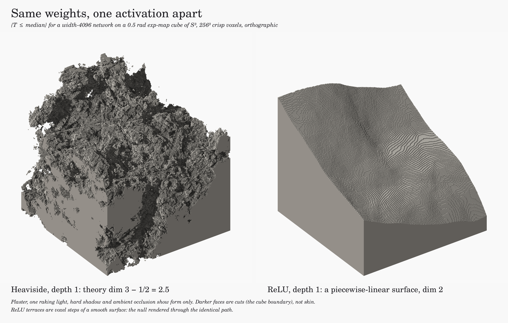

<video src="gallery/film_rough_skin.mp4" autoplay loop muted playsinline width="100%"></video> 
film_rough_skin.mp4 (<a href="gallery/film_rough_skin.gif">GIF</a>): depth L = 1 → 4 on one draw (hard cuts, measured D per frame where it exists), then a turntable of the L = 1 cast.

## The phenomenon

Di Lillo, Marinucci, Salvi & Vigogna (arXiv:2504.06250) prove that infinite-width Gaussian networks on the sphere S^d, with an activation whose covariance kernel has regularity index β ∈ (0, 1), have level sets of Hausdorff dimension d − β^L: the dimension climbs toward d with every layer, at a rate fixed by the activation alone. `art/depth-roughness/` measured this on S² for Heaviside and found β = 1/2 (L = 2 gave 1.618 against 1.619 for a field built to have that exact dimension). This piece lifts the same nets to S³ ⊂ ℝ⁴, where the prediction is **3 − 2⁻ᴸ**: 2.5, 2.75, 2.875, 2.9375 for L = 1…4. A finite-width net's zero set is a genuine rough surface down to a cutoff of about 4/n of the width; past that, roughening stalls and it stops climbing toward the theory line, so the measurement has to sit between the cutoff and the size of the patch. The same weights run through a ReLU stay a smooth, piecewise-linear surface (dimension 2) at every depth — the one-line control for the whole piece.

## The pieces

### Diptych and cast

| | |
|---|---|
|  **Same weights, one activation apart.** {T ≤ median} for a width-4096 network on the 0.5 rad exp-map cube, 256³ crisp voxels, plaster with one raking light + hard shadow + AO (light shows form only). Left caption is the **measured** D (3-draw mean ± sd, calibrated 3D box counting) beside theory; ReLU (right) is the identical weights and render path, one activation swapped. | 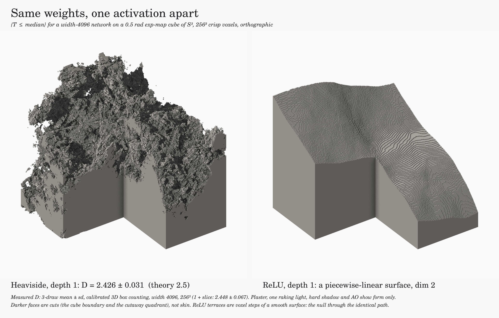 **Cutaway version**, quadrant x > 0, y < 0 removed through the full height. Darker plaster marks cut faces (the cube boundary and the cutaway planes), not skin. |
| 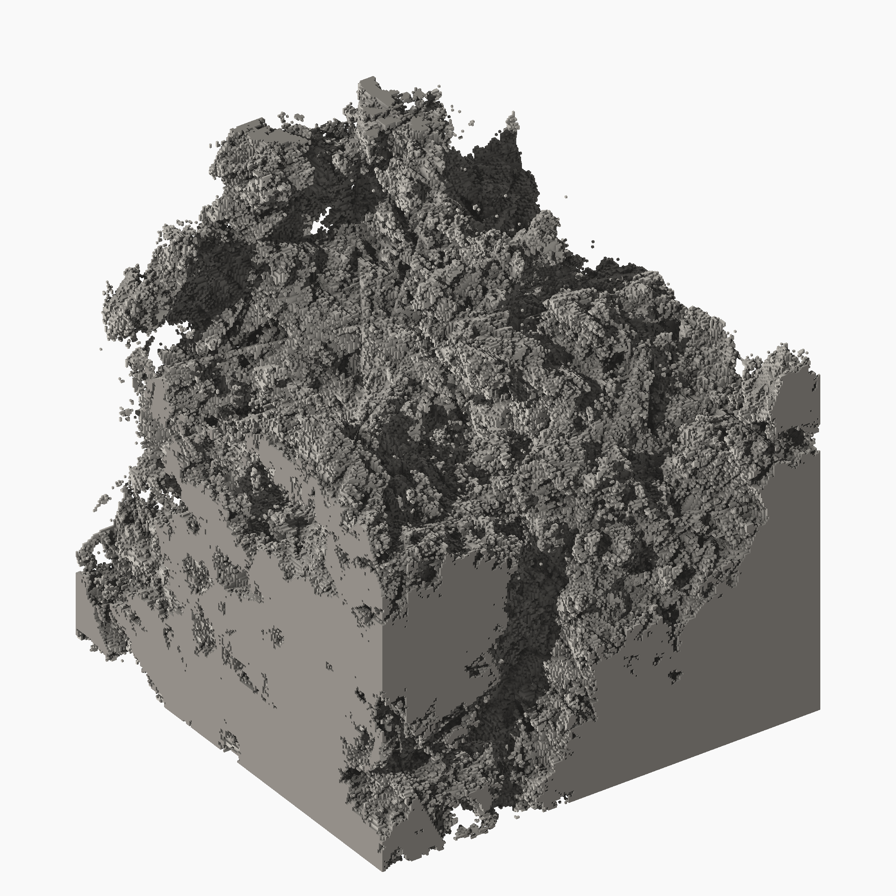 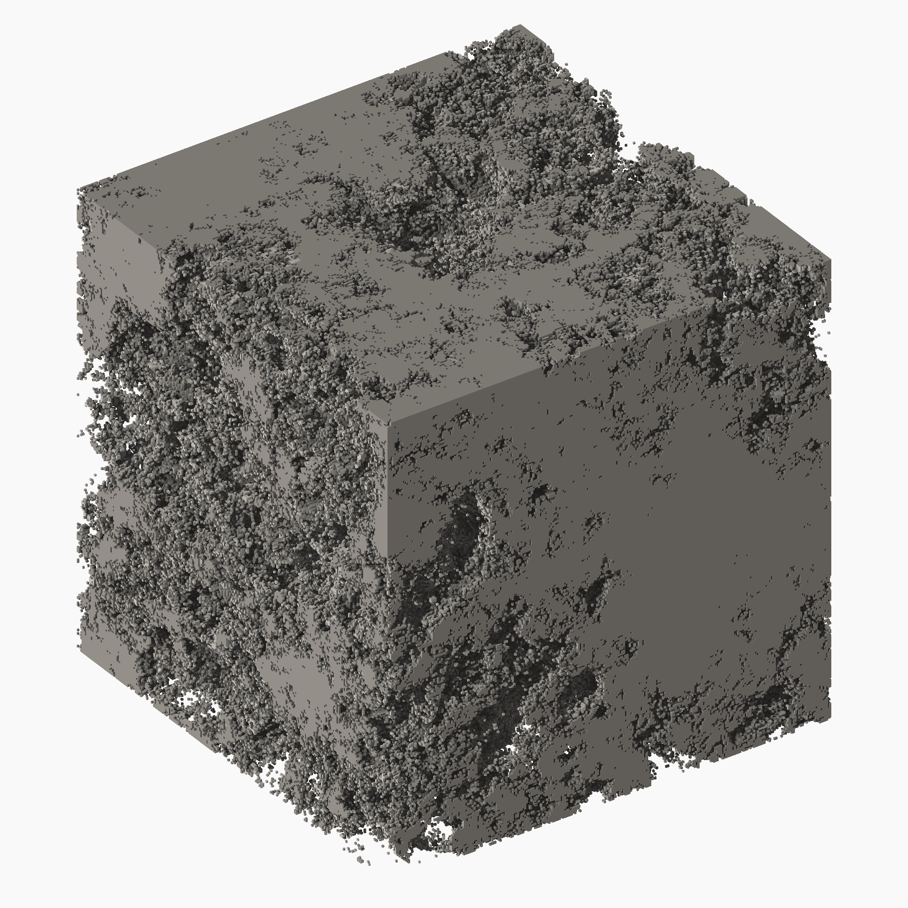 **Heaviside L = 1 (left, D = 2.426 ± 0.031, theory 2.5) and L = 2 (right, D = 2.774 ± 0.076, theory 2.75).** Same field, level, camera and light as the diptych. L = 2 already reads as foam from outside — its roughness is carried by the slice atlas below, not by this exterior view. | 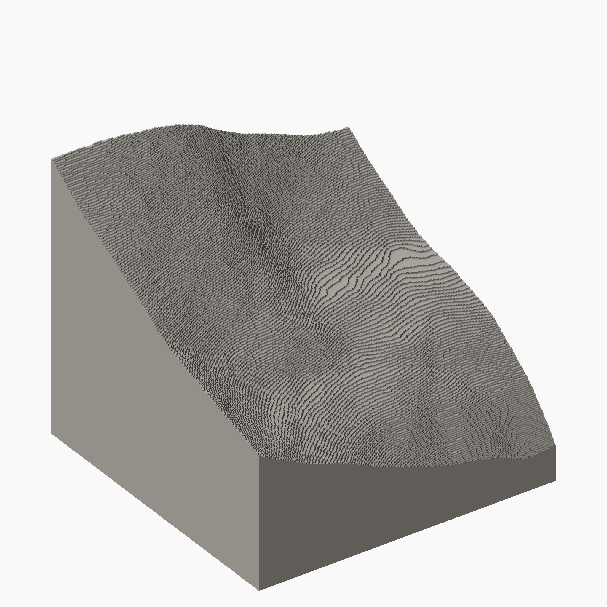 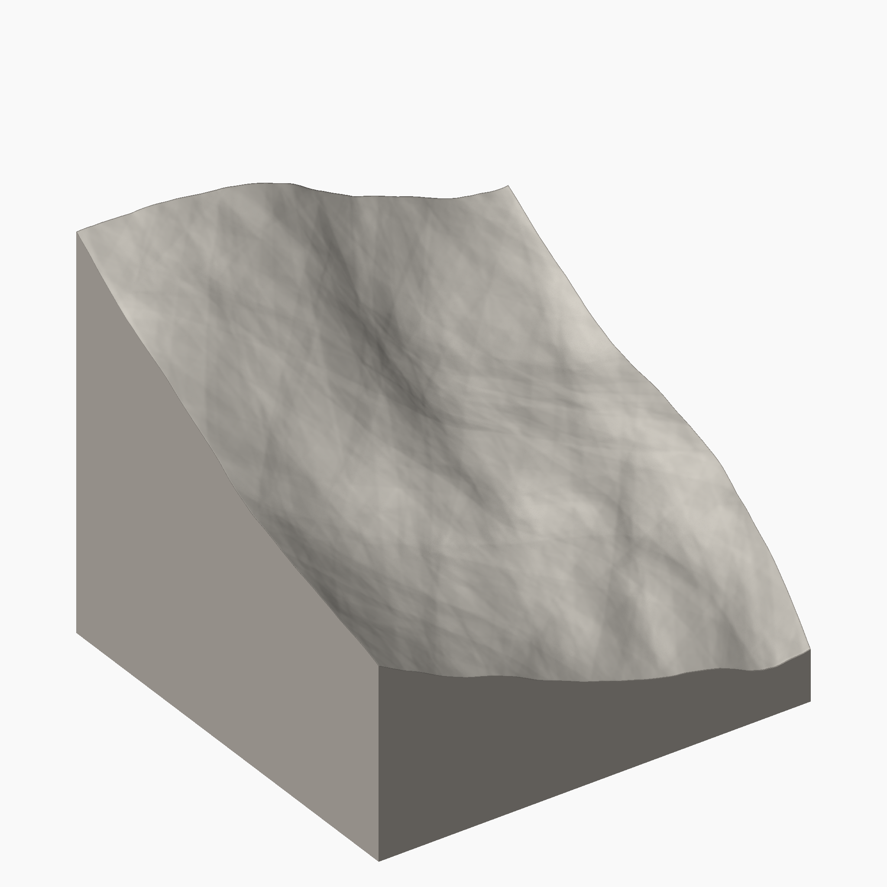 **ReLU L = 1: crisp voxels (left, the null rendered through the identical path as the Heaviside casts) and a linear isosurface (right, allowed for ReLU only).** Both show one smooth sheet; the iso's faint creases are the kinks of a piecewise-linear network, not roughness. |

Cutaway twins of all four casts (cast_heaviside_L1_voxel_cutaway.png, cast_heaviside_L2_voxel_cutaway.png, cast_relu_L1_voxel_cutaway.png, cast_relu_L1_iso_cutaway.png) exist in the gallery folder and are not repeated here.

### Slice atlas

| | |
|---|---|
| 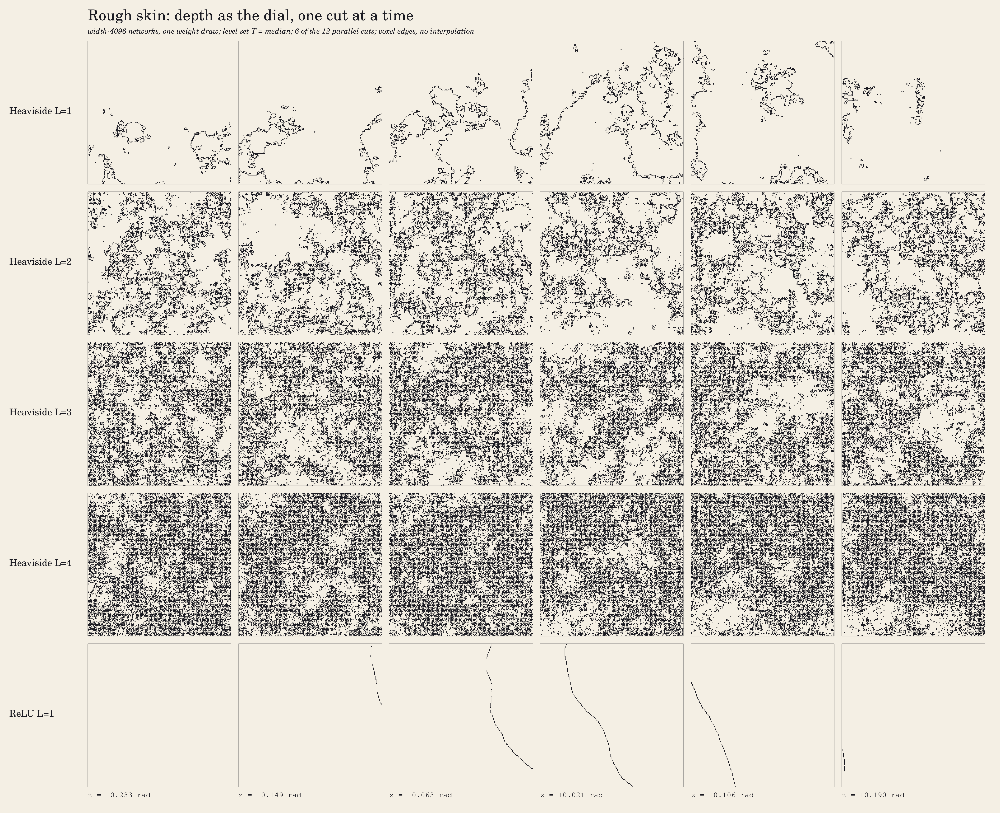 **Depth as the dial, one cut at a time.** Rows are Heaviside L = 1…4 and the ReLU L = 1 null; columns are 6 of 12 parallel z = const cuts of the exp-map chart. Coastline = {T = median}, drawn along voxel edges between opposite-sign 4-neighbours — no interpolation, no smoothing. L = 1 is coastline islands, L = 2 is lace, L = 3–4 are close to noise at voxel scale, and ReLU stays a single smooth curve that never crosses the lowest cuts. This is the plate that carries the dial past L = 2, where the 3D exterior view stops being legible. |
| 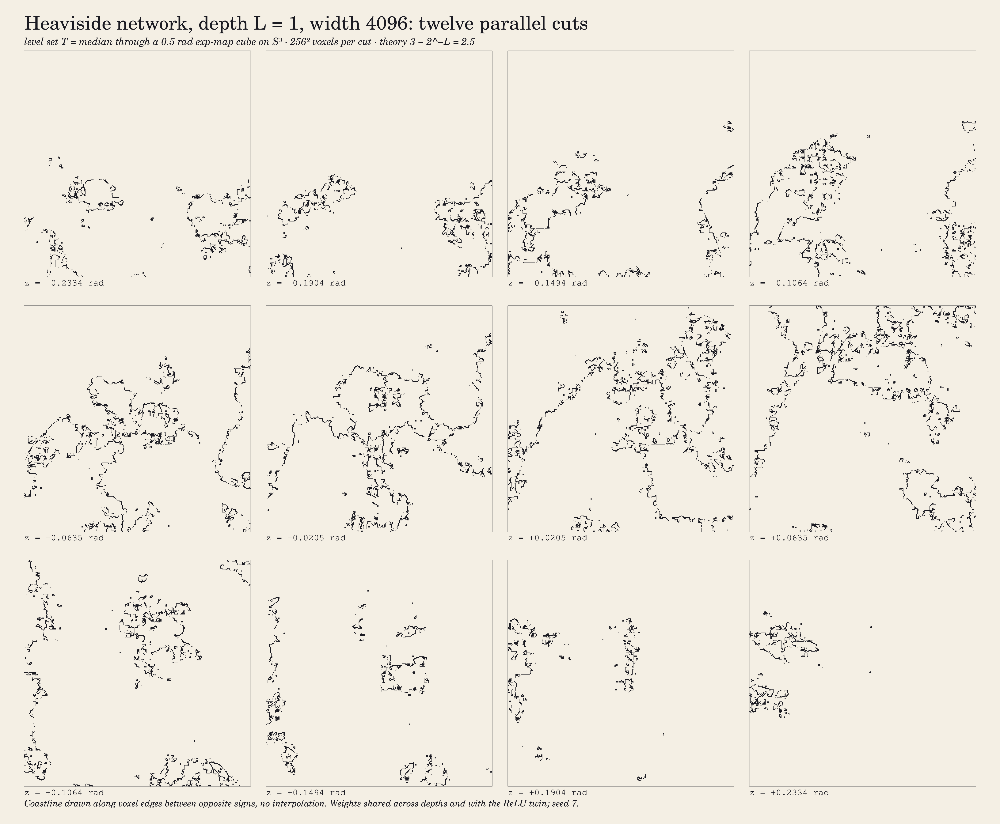 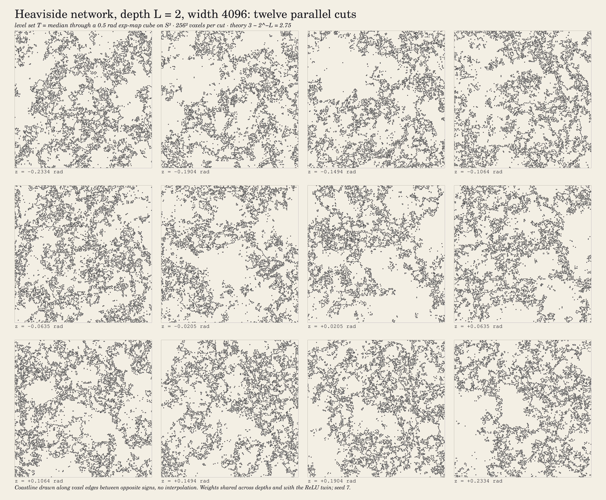 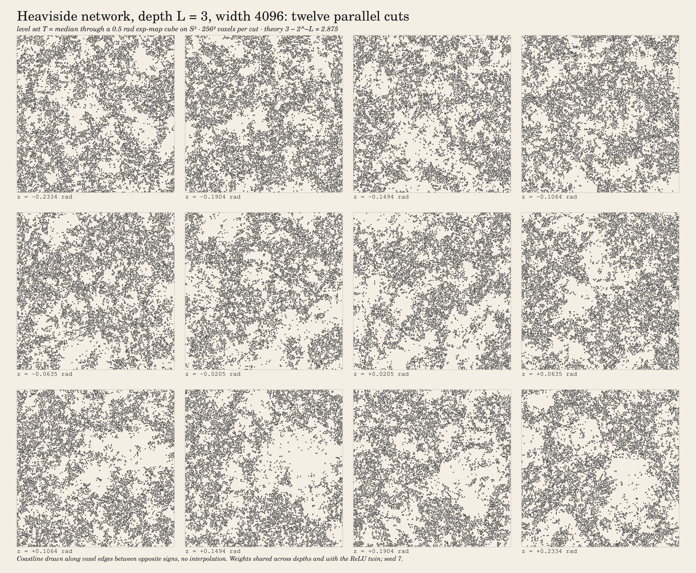 **All 12 cuts per depth** (L = 1, 2, 3 shown; L = 4 and the ReLU null are also in the gallery folder), depth-roughness's plotter idiom (warm paper, near-black ink, URW C059). |

### Spectral split fog

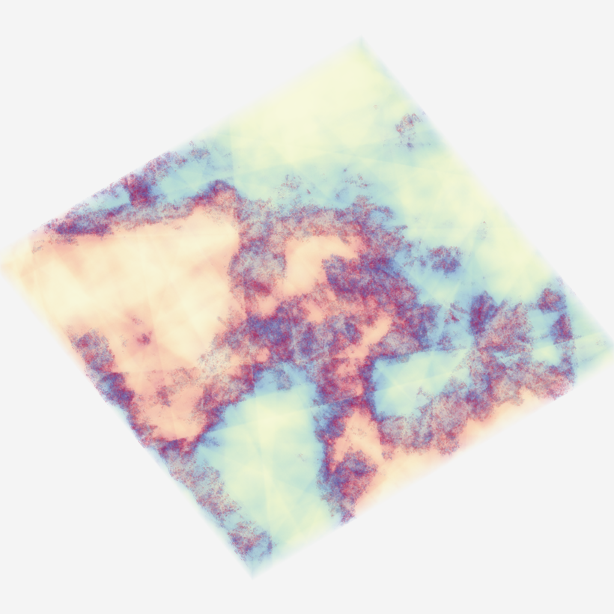 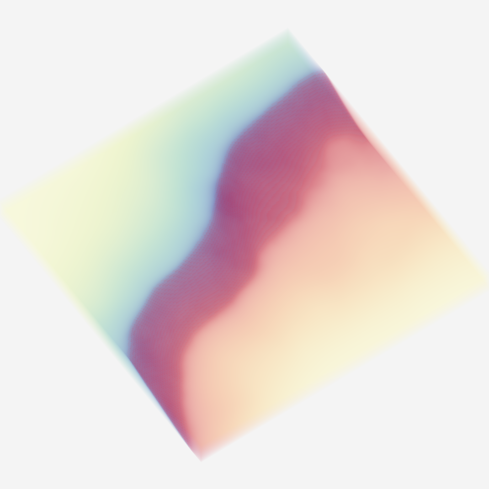

**Heaviside L = 1 (left) and the ReLU null (right)**, a 24-voxel slab (0.047 rad) volume-rendered with a declared Sohl-Dickstein Spectral split: each side of the level is rank-normalised on its own, below runs pale yellow → `Spectral` purple at the level, above runs `Spectral` red at the level → pale yellow, so the level set reads as a dark seam. Opacity 0.10 + 0.90(1 − |2x−1|)²⁴, extinction density 25/world unit, nearest-voxel sampling (fractal data at voxel resolution). Heaviside shows a lace of dark seams around pastel islands; the ReLU null, run through the identical function, shows one soft band — the renderer is not the fractal. (fog_split_heaviside_L2_paper.png is also in the gallery folder.)

### Plate reproduction against `depth-roughness`

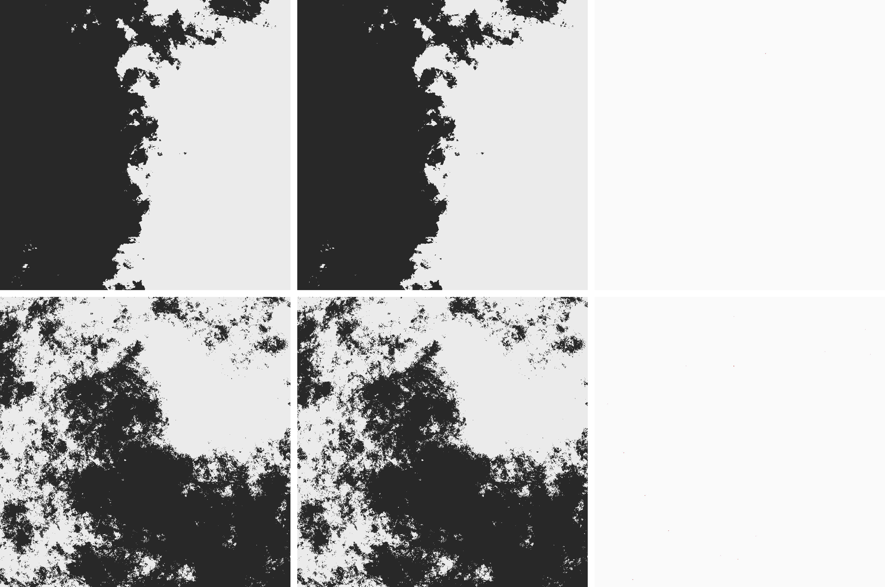

The great 2-sphere {x₄ = 0} ⊂ S³ is S² itself, so a width-n net here restricted to it is exactly `depth-roughness`'s own net on S² with input weights `W0[:, :3]`. This plate feeds `depth-roughness`'s own n = 4096, seed-11 weights through this piece's code and compares with its cached patch, unmodified. Left to right, top to bottom: L = 1 (depth-roughness / here / disagreement mask), L = 2 (same). **3 and 27 of 1,048,576 pixels disagree in sign** (L = 1, 2) — single hidden units flipping at exact ties between float32 here and float64 there.

### Film and casts

The hero film (top of this page) has two parts, hard-cut, never morphed into one another:
- **Depth dial**, L = 1 → 4 on the seed-7 draw: L = 1 and L = 2 are the same 3D crisp-voxel cast as above, captioned with the measured D beside theory; L = 3 and L = 4 switch to the plotter idiom (one of the 12 atlas cuts, enlarged) captioned "saturated", because past L = 2 the 3D estimator has no measured value to show (see Verification) and the isosurface itself is unreadable foam.
- **Turntable**, 360° of the L = 1 Heaviside cast, same field/level/light as the dial's first frame.

### Objects

[`cast_heaviside_L1_zeroset.stl`](gallery/cast_heaviside_L1_zeroset.stl) and [`cast_relu_L1_zeroset.stl`](gallery/cast_relu_L1_zeroset.stl): printable solids of the L = 1 level set (both scaled to 80 mm, both watertight). See Verification/Caveats for the grid each was meshed at and why they differ.

## What was computed

M1 and M2 (fields, dimensions, first renders) are reported in full in `docs/superpowers/plans/reports/rough-skin-M1.md` and `rough-skin-M2.md`; this table covers M3.

| step | script | what | wall time |
|---|---|---|---|
| diptych re-render | `render_diptych.py` | measured D added beside theory in the caption (M2→M3 ruling) | < 1 s (CPU, composed from existing casts) |
| STL | `make_stl.py` | Heaviside L = 1 (96³, native re-evaluation: the 128³ cache mesh was 584k faces / ~29 MB, over the 20 MB budget) and ReLU L = 1 (128³, cache subsample, 154k faces / 7.7 MB), both `marching_cubes(closed=True)`, `is_watertight`, `scale_to_mm(80)` | 6.1 s (CPU + GPU for the 96³ re-evaluation) |
| film | `render_film.py` | depth dial (4 held depths, 2 GPU casts + 2 CPU coastlines) + 240-frame GPU turntable of the L = 1 cast, 1080², 24 fps, 528 frames / 22 s; re-encoded CRF 18 → 23 (21.3 → 13.1 MB) to clear the 20 MB budget | 8.4 min GPU (queued ~45 min behind another art job) |

Hardware/software: GB10, driver 580.173.02, CUDA 13.0, torch 2.14.0+cu130, float32 (float64 checked on a slab in M1), 2026-09-15.

## Verification

Full detail (calibration curves, draw statistics, float32/64 flip tables) is in the M1/M2 reports and `cache/dims_tables.md`; this is the summary the captions rely on.

- **3D box counting**, boundary voxels (6-neighbour sign change), fit over b = 2–64 voxels at 256³ — **1.5 decades**, short of spec §11's two decades (declared shortfall; a single 256³ volume cannot reach two decades, and the 128³ → 256³ doubling below adds only one octave).
- **Calibration**: synthetic power-law Gaussian fields of exact level-set dimension, window protocol (non-periodic windows of a periodic 1024³ box — chosen because the cube is a window of a field on the whole S³, not a periodic tile) as primary, sub-voxel roughness matched to the net's ≈ 4/n finite-width cutoff (k = 1 octave at width 4096, 256³). Two systematics, each about the size of the draw-to-draw scatter:
  - **protocol**: periodic instead of windowed calibration moves D by **−0.07**;
  - **sub-voxel assumption**: k = 0 instead of k = 1 moves D by **+0.04**.
- **Measured D (3-draw mean ± sd, seeds 7/8/9, width 4096, 256³, level = volume median):**

  | L | theory | 3D calibrated | 1 + slice (12 oblique planes) |
  |---|---|---|---|
  | 1 | 2.500 | **2.426 ± 0.031** | **2.448 ± 0.067** |
  | 2 | 2.750 | **2.774 ± 0.076** | **2.769 ± 0.040** |
  | 3 | 2.875 | no claim — estimator saturates | 2.936 (n = 1 in range) |
  | 4 | 2.938 | no claim — estimator saturates | no claim |

  **No D claim for L ≥ 3**: synthetic fields of exact D = 2.938 / 2.969 already read 2.93 / 2.94 through this estimator at 256³ — at or above the net's own raw 3D value — so the calibration curve cannot be inverted there, and the net's raw values (2.96–2.99) sit past where the calibration is monotone. This is a property of the estimator at this resolution, not of the surface.
- **Slice consistency** (Marstrand–Mattila, spec §11.2): 12 random oblique planes (normals ≥ 15° from every axis), calibrated the same way as the volume. L = 1 and L = 2 agree with the 3D value within 0.13 and 0.04 respectively — an expectation for typical slices, not a guarantee.
- **Plate reproduction** (spec §0.7/§11.3) against `depth-roughness`'s own cached patch on the shared great 2-sphere: 3 and 27 of 1,048,576 pixels disagree in sign at L = 1, 2 (single-unit float32/float64 tie flips).
- **Resolution doubling**: the 128³ grid is the exact even-node subsample of the 256³ grid (same physical nodes), so this is one net at two resolutions. Calibrated 3D D agrees within errors: L1 2.393 (256³) / 2.368 (128³), L2 2.856 / 2.861. Boundary-voxel counts at matched physical box size *increase* under refinement for Heaviside (ratio 256³/128³ up to 1.28 at the finest box) and *decrease slightly* for ReLU (0.93–0.96) before both converge to 1.00 at coarse boxes — real structure gains surface on refinement; a smooth surface's coarse-voxel staircase overcounts.
- **float32 vs float64** (32 central z-planes, width 4096, seed 7, output sign at the level): Heaviside flip rate 0 (L1), 1.6×10⁻⁵ (L2), 6.5×10⁻⁵ (L3), 1.8×10⁻⁴ (L4); ReLU 1.4×10⁻⁶–2.4×10⁻⁶. float32 is adequate for the sign decision that drives every measurement and render here.
- **ReLU null**: through the identical estimator, protocol and render path as Heaviside, raw 3D D = 2.01–2.06 at every depth, consistent with the smooth-null calibration control (2.03–2.06) — below the power-law calibration's usable range, so it is compared with the smooth null rather than calibrated.
- **Chart distortion** (declared, spec §14.3): exponential map at p = (0.3, −0.5, 0.8, 0.1)/‖·‖ of the 0.5 rad tangent cube. Never stretches (max singular value 1 + 10⁻¹⁰); compresses transversally by up to **3.10 %** at the cube corners (analytic 1 − sin(0.433)/0.433, matched to 10⁻¹⁰); max anisotropy 1.032. Size is not exactly comparable across the frame, by this much.

## Caveats

- **L ≥ 3 has no measured D** (estimator saturation, above) — the dial past L = 2 is carried entirely by the slice atlas and the film's coastline frames, not by a number.
- **1.5 decades**, not spec §11's two, is the box-counting range available from a single 256³ volume; the 128³/256³ doubling is a same-net consistency check, not an extra decade.
- **Calibration is protocol-dependent** by about as much as the draw-to-draw scatter (−0.07 window vs. periodic, +0.04 for the sub-voxel octave count) — the measured L = 1/L = 2 values above should be read with those systematics attached, not as exact.
- **L = 2 is foam from outside**: the exterior cast is a porous cube whose cut faces show more foam, not a readable interface: its roughness is legible only in the slice atlas and the fog.
- **STL grids differ** (Heaviside 96³ native re-evaluation, ReLU 128³ cache subsample) because the 128³ Heaviside mesh was over the 20 MB budget; both are declared marching-cubes solids that smooth sub-voxel roughness, coarser for Heaviside than for the cast/atlas renders.
- **"Zero set"** in the spec's own language is this piece's declared level set {T = median}, not literally T = 0: the kernel's constant component means the literal zero level can miss the 0.5 rad patch entirely (same reasoning as `depth-roughness`'s tiles).
- **PCA/PCA-free**: no fitted subspace is used anywhere in this piece — the chart is an exact map (exponential map of a tangent cube), so spec §14.4's blind spot does not apply here.

## References

- S. Di Lillo, D. Marinucci, M. Salvi, S. Vigogna, *Fractal and Regular Geometry of Deep Neural Networks*, 2025, arXiv:2504.06250.
- `art/depth-roughness/` — the S² sibling piece: net definitions (`nets.py`), the box-counting and calibration protocol, and the cached patch this piece's plate reproduces.
- `art/ml-art-3d.md` §7, §0, §11 — this piece's spec.
- `art/_shared/r3d/` — the shared renderer.
- `docs/superpowers/plans/reports/rough-skin-M1.md`, `rough-skin-M2.md`, `rough-skin-M3.md` — the milestone reports.
