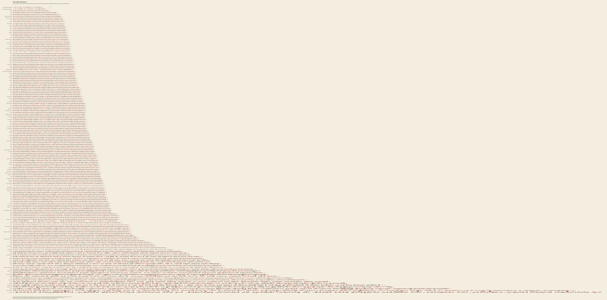
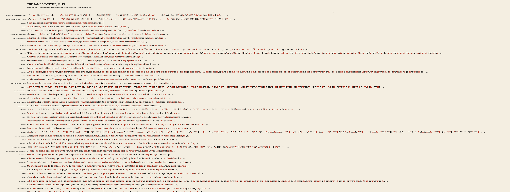

# The Same Sentence

*Article 1 of the Universal Declaration of Human Rights in 161 languages. Each line is set exactly as long as the number of tokens a language model needs to read it.*





## The phenomenon

A language model does not read letters or words. It reads **tokens**: pieces of text from a fixed vocabulary that was learned mostly from English web text. The same meaning therefore costs different amounts in different languages. It fills more of the context window, needs more compute, and costs more money per request. Petrov et al. (NeurIPS 2023) call this tokenizer unfairness. Ahia et al. (EMNLP 2023) measured what it costs users of commercial APIs.

Article 1 reads: *"All human beings are born free and equal in dignity and rights."* This piece sets that sentence in 161 languages. Each line's length is its cost in tokens. The declaration of equality is printed in a form that measures its inequality.

## What was measured

- **Texts.** Source is [UDHR in XML](https://github.com/eric-muller/udhr), commit `588b3f4` (2026-07-28). This is Eric Muller's continuation of Unicode's *UDHR in Unicode*, which Unicode stopped hosting in January 2024 (unicode.org/udhr now points to OHCHR).
  - All 527 translations at stage ≥ 4 have an Article 1.
  - Preparation: whitespace collapsed, paragraphs joined with a space, NFC applied.
  - 20 source texts are not in NFC. For them, the raw form is kept and counted separately (see the note below).
- **Plate set (161 texts).** One text for each (ISO 639-1 language, script) pair. Ties are broken in this order:
  1. the file named by its ISO 639-3 code;
  2. the shortest file key;
  3. the alphabetically last key (the most recent where keys are years: `deu_1996`, `ron_2006`).

  There is one hand override: Greek uses the monotonic text, not the polytonic one. The statistics are reported for both the plate set and all 527 texts.
- **Tokenizers** (all run with `tokenizers` 0.22, no special tokens, no chat template):

| name | vocab | kind | source |
|---|---:|---|---|
| GPT-2 | 50,257 | byte-level BPE | downloaded `openai-community/gpt2` |
| GPT-NeoX | 50,254 | byte-level BPE + NFC | local `fla-hub/rwkv7-*-pile` |
| Llama-2 | 32,000 | SentencePiece BPE + byte fallback | local `fla-hub/gla-*` |
| OLMo-2 | 100,278 | byte-level BPE (cl100k-like) | local `allenai/OLMo-2-0425-1B` |
| Qwen2.5 / Qwen3 | 151,643 | byte-level BPE + NFC | local; **identical counts and spans on all 527 texts** |
| BLOOM | 250,680 | byte-level BPE, multilingual | downloaded `bigscience/bloom-560m` |
| XLM-R | 250,002 | SentencePiece unigram + NFKC | downloaded `FacebookAI/xlm-roberta-base` |

- **Correctness checks.**
  - For every byte-level and byte-fallback tokenizer, `decode(encode(text)) == text` holds exactly for all 527 texts.
  - The token pieces also concatenate byte-for-byte back to the UTF-8 text. That is how each token's byte span is obtained, and the spans are exact.
  - XLM-R fails the round trip on 67 of 527 texts, because of NFKC and `<unk>`. It emits `<unk>` in 46 texts (12 in the plate set). Examples: Maldivian 26 of 60 tokens are `<unk>`, Tibetan 20 of 41, Grantha 27 of 59. **Its low counts for these scripts mean it cannot read them, not that reading them is cheap.** XLM-R is therefore reported but never drawn.

### Results (plate set, 161 texts; tax = tokens ÷ English tokens)

| | median tax | 5–95% | max | lines > 2× English | lines > 5× |
|---|---:|---:|---|---:|---:|
| characters | 0.98 | 0.68–1.36 | 2.20 | | |
| UTF-8 bytes | 1.14 | 0.85–3.26 | 4.57 | | |
| GPT-2 | 2.70 | 1.73–15.6 | 22.0 (Burmese, 726 tok) | 83% | 32% |
| GPT-NeoX | 2.52 | 1.55–11.3 | 21.2 (Sanskrit/Grantha, 698) | 75% | 17% |
| Llama-2 | 2.38 | 1.50–10.3 | 20.5 (Grantha, 696) | 70% | 16% |
| OLMo-2 | 2.42 | 1.48–10.2 | 20.7 (Grantha, 684) | 68% | 17% |
| **Qwen3** | **2.24** | 1.42–7.76 | **16.3 (Maldivian, 539)** | 61% | 13% |
| BLOOM | 1.97 | 1.06–8.18 | 16.4 (Maldivian, 556) | 47% | 7% |

- **English costs 33 tokens in every byte-level BPE** (34 in Llama-2 and BLOOM). This is the sanity row. Changing the tokenizer barely changes English. It changes everyone else.
- **The cheapest line is not English.** Under Qwen3 and BLOOM, simplified Chinese costs 27 tokens, 0.82× English. Under GPT-2 the same line costs 86 tokens, because most Han characters are split into byte pieces. On the GPT-2 plate those pieces show as characters cut into red and black slivers.
- **Longest lines under Qwen3.**
  - Maldivian: 539 tokens for 586 bytes, which is 0.92 tokens per byte. The largest vocabulary here holds almost no Thaana merges.
  - Sanskrit in Grantha script: 515 tokens.
  - Burmese: 400. Tibetan: 348. Panjabi: 340.
- **Ranks move.** Spearman ρ between GPT-2 and Qwen3 counts is 0.84. Between GPT-2 and BLOOM it is 0.63.
- **How much the bigger vocabulary helps depends on the script.** Median GPT-2 ÷ Qwen3 token ratio:

| script | GPT-2 ÷ Qwen3 |
|---|---:|
| Korean | 3.58 |
| Thai | 3.19 |
| Chinese | 3.19 |
| Cyrillic (17 languages) | 2.06 |
| Arabic | 2.04 |
| Latin (104 languages) | 1.13 |
| Thaana | 1.09 |
| Gurmukhi | 1.07 |

  So the scripts that were already worst off gained least. Vietnamese dropped from 178 tokens to 47, which is 3.8×.

### The null: is it just bytes?

UTF-8 already charges most non-Latin scripts 2–3 bytes per character. So part of the tax is the encoding, not the tokenizer.

- Write tax = (byte ratio) × (tokens-per-byte ratio). Under Qwen3, log byte ratio accounts for R² = 0.80 of the variance in log tax. Its covariance share is 0.71.
- **The encoding is most of the story across scripts, but not all of it.** For the 104 Latin-script languages the median byte ratio is 1.03, so their bytes cost about the same as English. Their Qwen3 tax is still **2.00**. That factor comes entirely from the vocabulary's English-heavy merges.
- Same-script, near-English controls:
  - Scots costs 45 tokens (171 bytes).
  - Jamaican Creole English costs 76 tokens (210 bytes, 2.3×). It uses the same alphabet as English but a less frequent orthography.
- The null plates show this decomposition with the same treatment as the main plate (`null_quartet.png`). The same 161 lines, in the same order, are set in four measures: characters, UTF-8 bytes, Qwen3 tokens, GPT-2 tokens. They are scaled so that English has the same length on all four.
  - A character reader gives a near-rectangle (median 0.98×).
  - A byte reader gives a short ragged step at the bottom (≤ 4.6×).
  - The tokenizers stretch the tail to 16–22×.

**Encoding-form note.** Qwen3 and GPT-NeoX apply NFC themselves, so for them NFC changes nothing. GPT-2, OLMo-2 and BLOOM do not normalize. On the 20 source texts that are not in NFC, the decomposed form usually costs more (a few, e.g. Panjabi, cost 1–5 tokens less):

| text | NFC | raw (decomposed) |
|---|---:|---:|
| Vietnamese, OLMo-2 | 84 | 134 (+50) |
| Vietnamese, GPT-2 | 178 | 191 |
| Bamun, GPT-2 | | +31 |

Same text, same meaning, different code points. All plates use NFC.

## The form (declared choices)

- **Line length = tokens × u**, with u = 29.9 px per token on the main plate. At 8,600 px/m that is 3.5 mm. u is chosen so that the median language (2.24× English) is set at roughly its natural width. English is therefore strongly condensed and the long tail is extended.
- **How the length is reached.** Each line is shaped with HarfBuzz as a whole, so Arabic joins, Indic conjuncts and Tibetan stacks are correct. Then FreeType rasterizes it with a horizontal scale matrix, so glyphs are condensed or extended as outlines, never resampled. Within a line the scale is uniform: token boundaries sit at their natural typographic positions.
  - I tried setting each token in an equal-width cell. It crushes long English tokens into black clumps and stretches commas.
- **Token ink.** Tokens alternate black and a rubric red, the two-colour letterpress convention.
  - Token ownership is exact at the byte level.
  - A HarfBuzz glyph cluster that is split by a token boundary is split in the image. The cluster's ink is cut vertically in proportion to the bytes each token takes, in reading direction.
  - This is why Han characters under GPT-2, and Tamil or Tibetan syllables under every tokenizer, appear cut into red and black slivers. That rendering is literal: the tokenizer has cut the letter.
- **Type.** Noto throughout, one family designed for every script: the serif cut where Noto has one, Sans otherwise, Naskh for Arabic, Noto Serif CJK. Weight is 560 on the variable `wght` axis. Noto Sans Thaana is set 1.4× larger, an optical correction because at the common em it reads at Latin x-height. Language names are in true small caps (`smcp`/`c2sc`); counts use old-style figures.
- **Layout.** Lines are sorted by Qwen3 count, all left-aligned to one margin. RTL lines therefore begin reading at their right end.
  - A grey hairline marks the length of the English line, with ×2, ×4, ×8 and ×16 ticks at the top and bottom.
  - The empty upper right of the plate is the distribution itself: 61% of lines are longer than 2× English, and a few scripts run to 16×.
- **Key.** Cream stock and ink only. It is a light-key specimen sheet, per CRITIQUE.md, with no colormap.

## Images (`gallery/`)

- `plate_qwen3.png` (6000 px preview) and `plate_qwen3_full.png`: the main plate. The full file is 16,647 × 8,253 px, which is **1.94 m × 0.96 m at 8,600 px/m**, the print master. Type is 26 px/em, about 3 mm.
- `plate_gpt2.png`: the same lines, in the same order, in GPT-2 tokens. Rank changes appear as a ragged edge: Chinese, Arabic, Vietnamese, Russian, Hebrew, Korean and Bulgarian stick out as extended bars among the condensed Latin lines. Full size (22,238 px, 2.6 m) is in `cache/`.
- `diptych_gpt2_qwen3.png`: the 2019 plate above the 2025 plate, at the same scale.
- `plate_pairs.png` ("What a larger vocabulary buys"): one language per script. Each is shown twice, GPT-2 at 45% ink above Qwen3, ordered by the ratio. Full size is 20,539 px, in `cache/`.
- `null_quartet.png`: characters | bytes | Qwen3 | GPT-2, at a common English length.
- Details at 1:1 or 2:1: `detail_qwen3_head.png`, `detail_qwen3_tail.png`, `detail_qwen3_end.png`, `detail_gpt2_head.png`, `detail_pairs_head.png`.
- `contact_sheet.png`.

**Critique, honestly.** At 1:1 the plates work: they read as type specimens and the cut letters are legible events. At thumbnail size the full plates are pale. Thin type across a 17,000 px sheet thins to hairlines, and what survives is the wedge silhouette. That silhouette is the right thing to survive, but it is faint. This is a print to walk along, not an image to scroll past. For screens, the details and the diptych carry it. The pairs plate is a 4.4:1 frieze and only reads at 1:1. `detail_gpt2_head.png` is the strongest single image.

## Prior art

- **Petrov, La Malfa, Torr & Bibi (NeurIPS 2023), "Language Model Tokenizers Introduce Unfairness Between Languages."** They report tokenization parity on parallel text, up to about 15× (Shan under cl100k), with bar and scatter plots. The search also surfaced UDHR-based token-count plots across about 400 translations, so using the UDHR as the measuring text is not new either.
- **Ahia et al. (EMNLP 2023), "Do All Languages Cost the Same?"** Measures API cost per language.
- **Yennie Jun (2023), "All languages are NOT created (tokenized) equal."** Charts and an interactive app over the MASSIVE dataset.
- **Token viewers** (the OpenAI tokenizer page, tiktokenizer, the HF tokenizer playground) already colour consecutive tokens alternately. **The alternating-colour convention is not new.**
- **What is new here, as far as I found:**
  - making each line's *length* equal its token cost by condensing or extending the actual letterforms;
  - cutting glyphs at sub-character (byte) token boundaries, so byte-fallback splits are visible inside a letter;
  - setting 161 languages as a single specimen sheet under one register, with character and byte versions as the null.

  The measurements themselves are a replication, and they agree with the papers in direction and magnitude.

## Compute

CPU only, with no GPU and no pasar jobs. Tokenizing 527 texts × 8 tokenizers takes seconds. Each plate renders in about 15 s. The whole pipeline takes under 2 minutes.

```
python prep.py      # parse UDHR, tokenize, exact byte spans + round-trip checks -> cache/{article1,tokens}.json
python analyse.py   # statistics -> cache/{table,summary}.json, cache/analyse_out.txt
python render.py    # plates (HarfBuzz + FreeType; needs cache/pylib: uharfbuzz, freetype-py; fonts in cache/fonts)
python compose.py   # quartet, diptych, details, contact sheet
```

- `cache/pylib` was installed with `uv pip install --target cache/pylib uharfbuzz freetype-py`. The shared venv was not modified.
- Fonts come from google/fonts (OFL). Ten Noto Serif script faces were downloaded; the other fonts were copied from `unsayable/cache/fonts`.

## Next moves

1. **Print one strip at true size.** A single Maldivian line against the English line, at 3.5 mm per token, is 1.9 m against 12 cm. It needs no plate.
2. **Add a modern API tokenizer** (o200k via `tiktoken`, or Gemma's 256k SentencePiece if it can be downloaded without gating). That would make a third plate for 2024–25 and show whether the Thaana/Grantha tail has moved at all.
3. **Use all 527 texts as a scroll.** The plate set is ISO 639-1 languages only. The languages *without* two-letter codes are exactly the low-resource ones, and their tail is longer.
4. **Model the cost, not just the count.** Swap line length for measured per-line inference FLOPs or price at current API rates. It stays proportional under a linear model, but a quadratic-attention version would bend the tail further.
