# Four over d

*The steepness of a neural scaling law is set by the dimension of the data manifold: measured here on 16 teacher/student manifolds and three image datasets, and drawn as log paper, fans of slopes, and a zoom that ends on a flat plane.*

## The phenomenon

Sharma & Kaplan (JMLR 2022) argue as follows. A ReLU network with N parameters is piecewise linear. If the data lie on a d-dimensional manifold, N parameters buy about N linear cells, each of side s ∝ N^(−1/d). Inside a cell, a smooth target is approximated to second order, so the error is ∝ s², and the squared-error loss is ∝ s⁴:

    L(N) ∝ N^(−α),   α ≈ 4/d        (MSE, piecewise-linear approximation of a smooth function)

You can measure d independently. Take the activations of the network's last hidden layer and count neighbours: N(r) ∝ r^d. This work uses the TwoNN estimator (Facco 2017) and the Levina–Bickel MLE. The prediction is that **4/α equals the intrinsic dimension (ID)**. The loss exponent is the α-line, the neighbour-count slope is the d-line, and the pieces below put them side by side.

## Hero

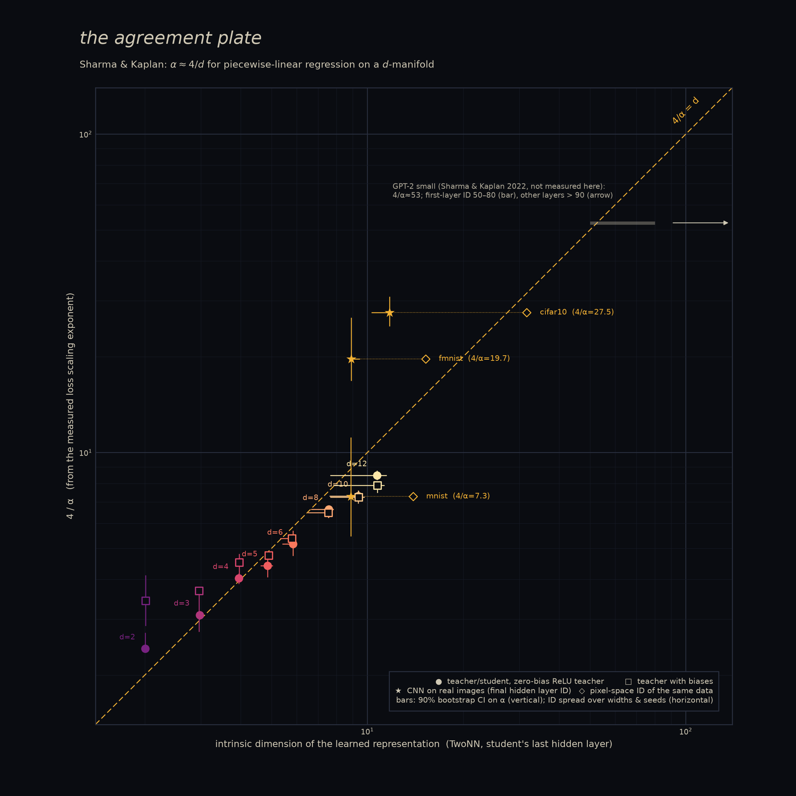 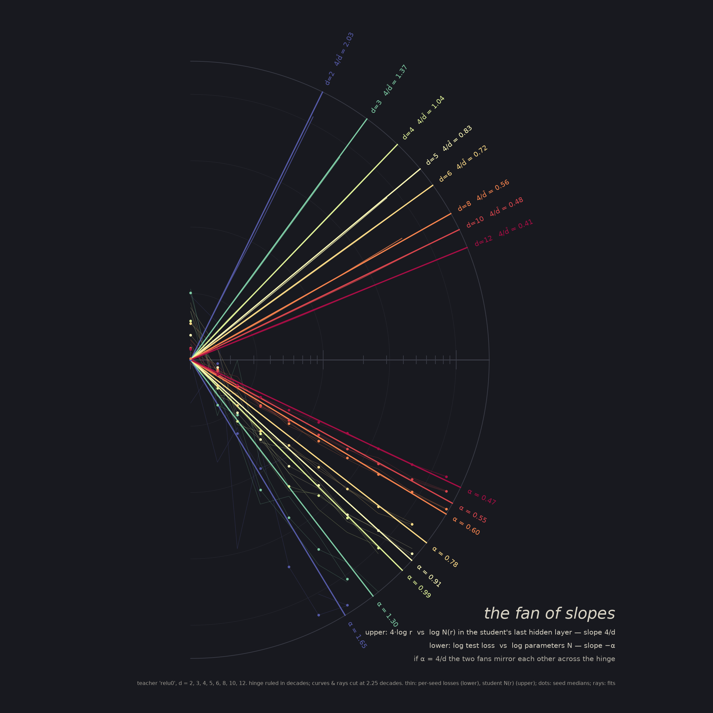

<video src="gallery/zoom_dark.mp4" autoplay loop muted playsinline width="49%"></video>

## Gallery

### 1. Diptych: the α-line and the d-line
Left: measured test loss against student parameters N, one colour per manifold dimension d. Hollow dots are medians over 3 seeds, small dots are single seeds, and each line is a least-squares power law. Right: neighbour counts N(r) in the last hidden layer of a 45-wide student, with the fitted d-slope drawn as a wide translucent band. The ledger underneath lists d, 4/α and the TwoNN ID. All positions are measured. Colour is an ordinal ramp over d (declared). Teacher: zero-bias ReLU ("relu0").

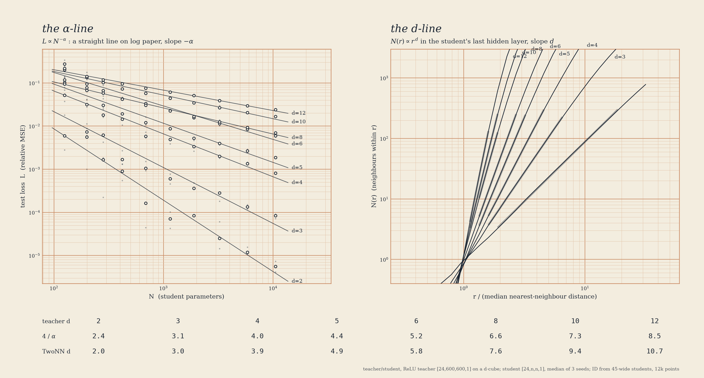 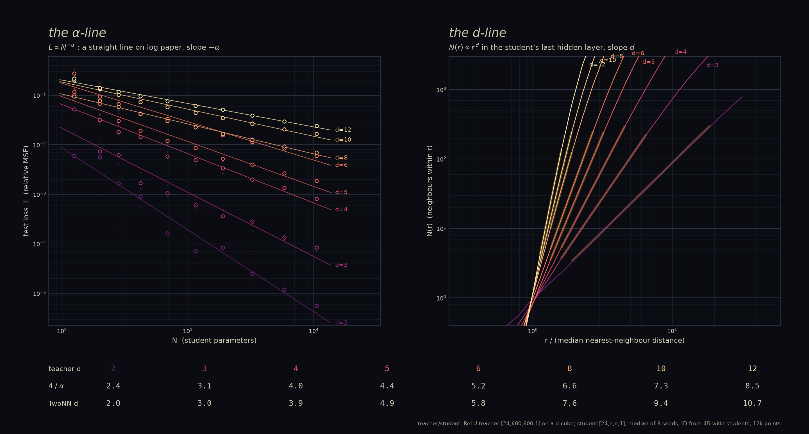
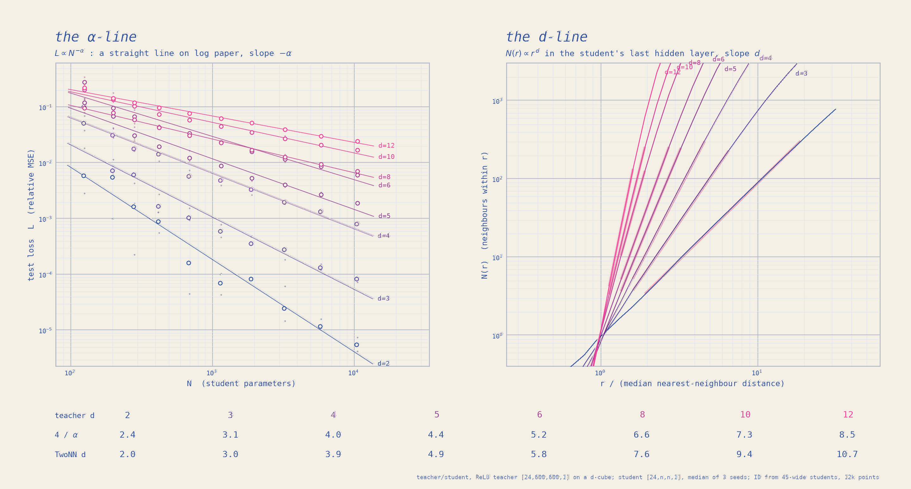 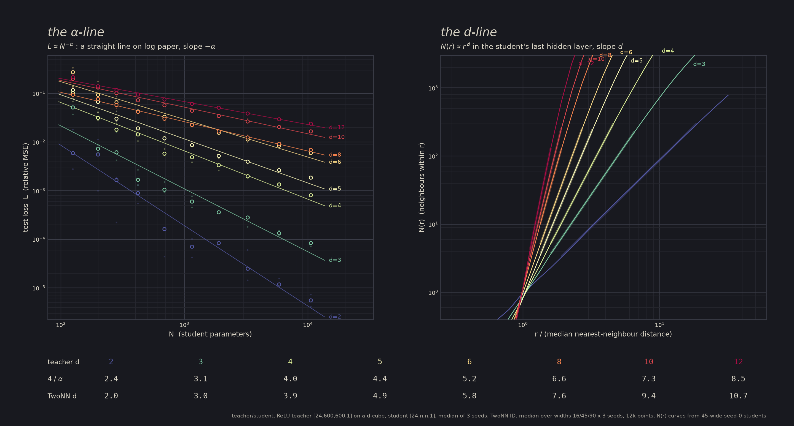

*paper*: K&E-style log paper, orange ruling, one ink · *dark*: magma ramp over d · *riso*: Federal Blue → Fluorescent Pink mix over d, with the pink plate misregistered by (3, −2) px (declared) · *spectral*: ColorBrewer Spectral as an ordinal ramp over d on charcoal. d is not a signed quantity, so this is not the two-sided Sohl-Dickstein split. It is a labelled variant.

### 2. The fan of slopes
Everything shares one hinge at the origin. **Lower fan**: log(L/L₀) against log(N/N₀) for each d, with the fitted slope −α as the heavy ray. **Upper fan**: 4·log(r/r₀) against log N(r) from the student's hidden layer, so its ray has slope 4/d̂. If α = 4/d, the two fans are mirror images across the hinge. Look at the d = 3–6 rays: the mirror nearly holds. At d = 2 the lower ray is shallower than its mirror, and at d ≥ 8 it is steeper. Cutting everything at a 2.25-decade radius is a composition choice.

 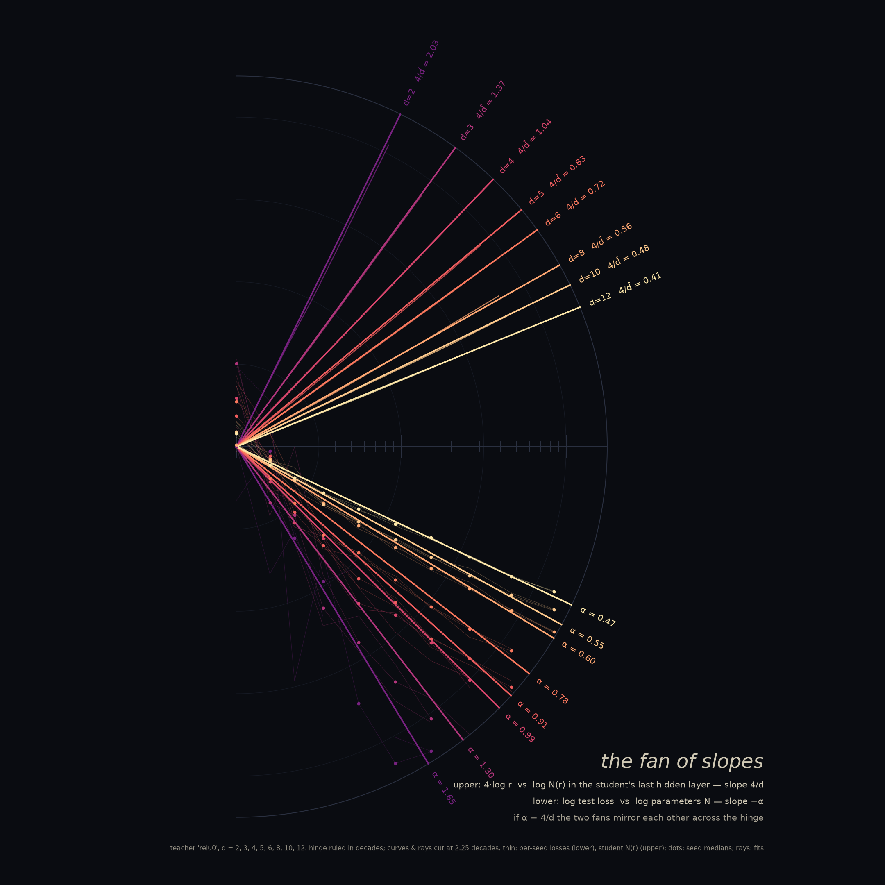
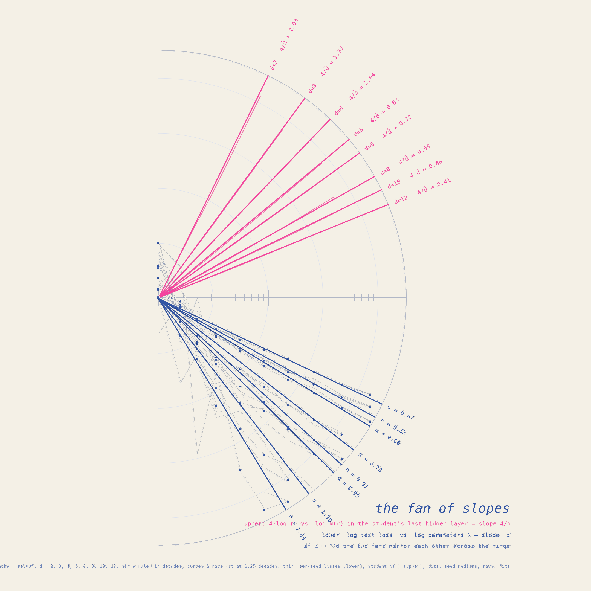 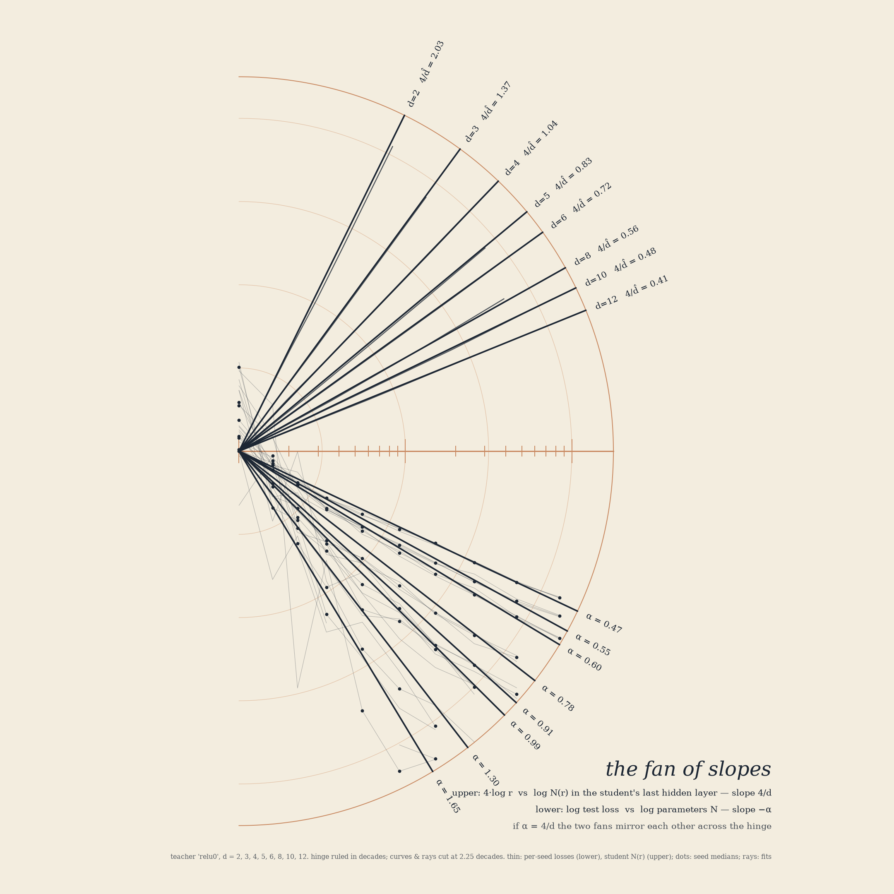

*riso* is the clearest to read: the lower fan (loss) is printed in blue and the upper fan (geometry) in pink. *paper* uses one ink, so the rays are identified by their labels.

### 3. The agreement plate
x = TwoNN ID of the student's last hidden layer (median over widths 16/45/90 × 3 seeds; the horizontal bar is the min–max). y = 4/α. The thin vertical bar is a 90% bootstrap CI over seeds. The faint wide bar shows 4/α refitted on only the small-N half versus only the large-N half of the sweep. Filled circles: zero-bias teacher. Hollow squares: teacher with biases. Stars: CNNs on real images, with a diamond at the pixel-space ID of the same dataset. The grey bar and arrow mark GPT-2 as reported by the paper, not measured here.

 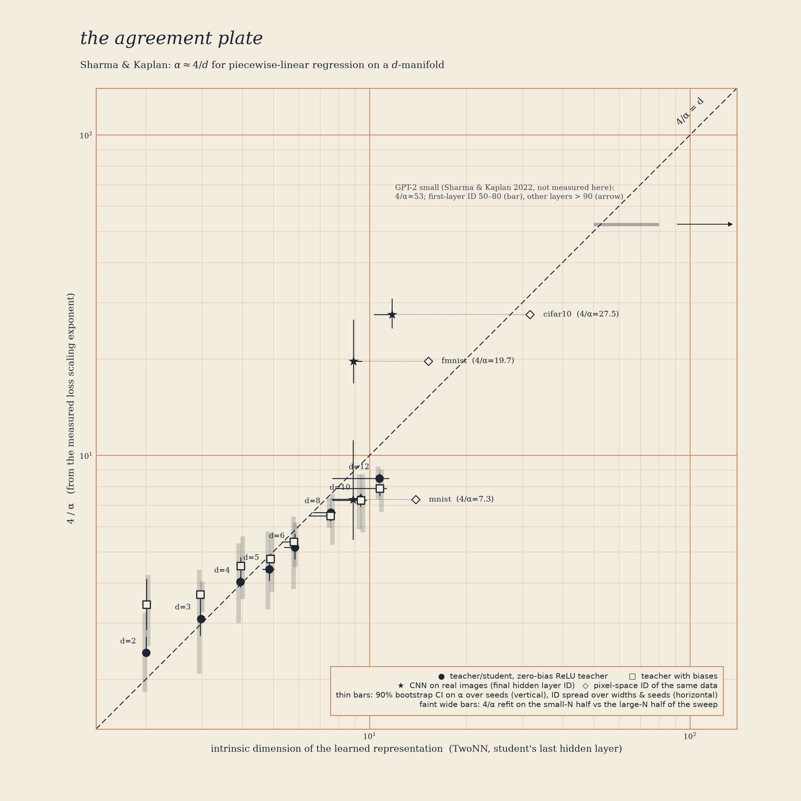
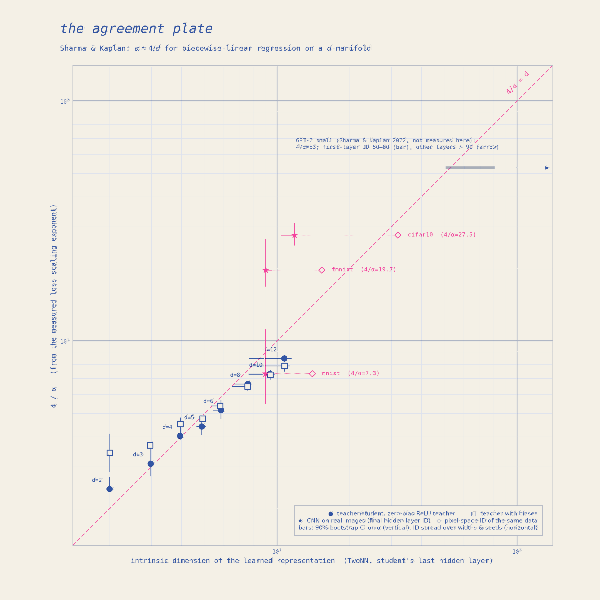 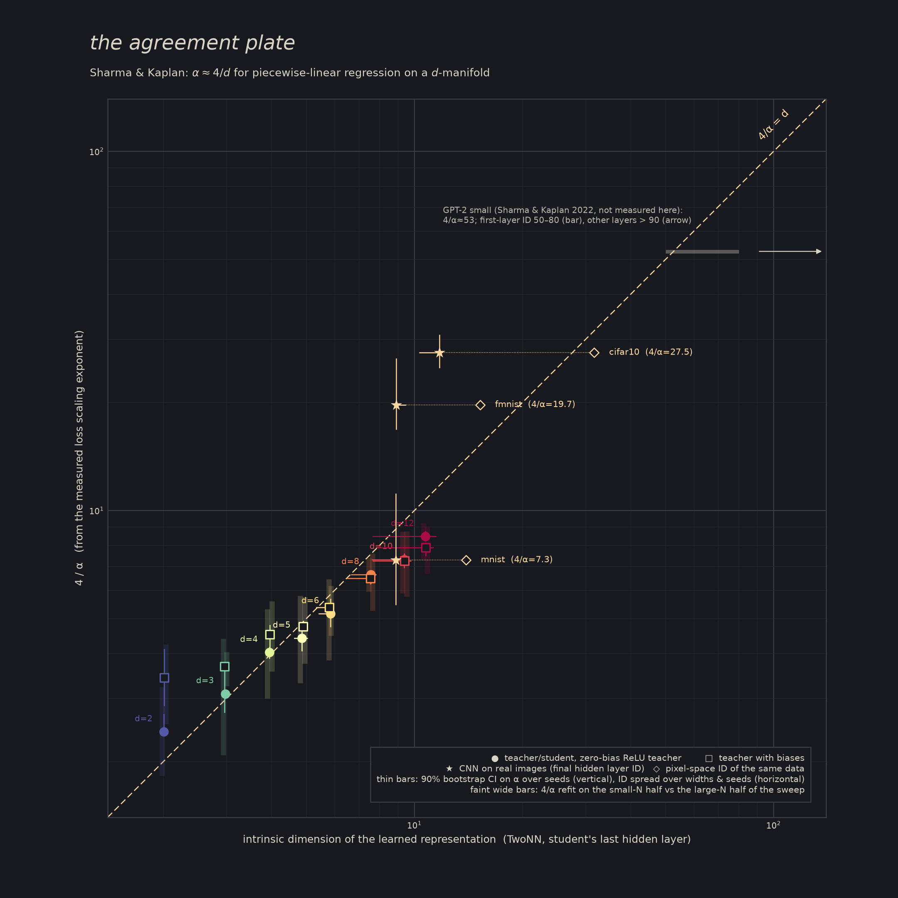

### 4. Scale-invariance zoom film
This is the d = 2 biased teacher T(z) and four students (N = 199, 689, 3241, 10531; seed 0), shown as surfaces over the same 80,000 random points in a square window around z₀ = (0.137, −0.083). Over 900 frames the window half-width shrinks from 0.2 to 6.3·10⁻⁴ (2.5 decades). Heights are measured relative to the teacher's tangent plane at z₀ and divided by the window size, so the zoom is isotropic. What you see:
- **The teacher's creases vanish.** A piecewise-linear function seen close enough is a plane. The teacher's RMS height drops from 1.8 to 0.001. The zoom has no fractal texture: it is scale-*invariant* only in the trivial sense that every ReLU surface becomes flat. (Declared: points outside a height slab |0.5·h| ≤ 0.9 are clipped.)
- **The students peel away.** Each student's absolute error ε stays fixed while the window shrinks, so its relative deviation grows like ε/ρ. It leaves the teacher once the window is about the size of its own error. The smallest student (N = 199, L = 1.1·10⁻²) has left by zoom ×3–4. The three larger ones separate between ×10 and ×50. **Honest note:** among the three large students the order of departure does not follow N. At a single point z₀ the pointwise error is random, and the scaling law holds only on average over the manifold.

<video src="gallery/zoom_dark.mp4" autoplay loop muted playsinline width="32%"></video>
<video src="gallery/zoom_paper.mp4" autoplay loop muted playsinline width="32%"></video>
<video src="gallery/zoom_riso.mp4" autoplay loop muted playsinline width="32%"></video>

Committed MP4s are 720² at 30 fps, H.264 CRF 32, 30 s. GIFs are 420 px at 10 fps (8–9 MB): `gallery/zoom_dark.gif`, `gallery/zoom_paper.gif`, `gallery/zoom_riso.gif`. The 1080² masters (`gallery/zoom_{dark,paper,riso}_1080.mp4`, 85–96 MB) are over the 20 MB commit limit and **not committed**. The 80k-point clouds are incompressible noise to H.264. In *riso* the teacher is blue and all students share the pink plate, so they are not distinguished by colour (declared).

## Results

### Teacher/student (full table in `cache/main/summary_table.md`)

| teacher | d | α | 90% CI (seed bootstrap) | **4/α** | 4/α, small-N / large-N half | **student TwoNN** | TwoNN w90 | MLE k=10 w90 | data TwoNN |
|---|---|---|---|---|---|---|---|---|---|
| relu0 | 2 | 1.654 | [1.47, 1.67] | **2.42** | 1.83 / 3.23 | **2.01** | 2.01 | 2.00 | 1.96 |
| relu0 | 3 | 1.295 | [1.29, 1.34] | **3.09** | 2.09 / 4.40 | **2.97** | 2.97 | 2.97 | 3.02 |
| relu0 | 4 | 0.994 | [0.96, 1.03] | **4.02** | 2.99 / 5.32 | **3.94** | 3.99 | 3.92 | 3.93 |
| relu0 | 5 | 0.907 | [0.84, 0.98] | **4.41** | 3.31 / 5.79 | **4.86** | 4.95 | 4.88 | 4.86 |
| relu0 | 6 | 0.775 | [0.71, 0.84] | **5.16** | 3.83 / 6.44 | **5.84** | 5.88 | 5.82 | 5.53 |
| relu0 | 8 | 0.604 | [0.59, 0.64] | **6.63** | 5.94 / 7.37 | **7.55** | 7.80 | 7.73 | 7.26 |
| relu0 | 10 | 0.548 | [0.53, 0.58] | **7.30** | 5.89 / 8.71 | **9.36** | 9.44 | 9.49 | 8.85 |
| relu0 | 12 | 0.473 | [0.46, 0.49] | **8.46** | 7.31 / 9.24 | **10.73** | 11.30 | 11.20 | 10.40 |
| relub | 2 | 1.168 | [0.98, 1.40] | **3.42** | 2.54 / 4.23 | **2.01** | 2.04 | 2.00 | 1.96 |
| relub | 3 | 1.086 | [1.07, 1.46] | **3.68** | 3.25 / 4.04 | **2.96** | 2.98 | 2.96 | 3.02 |
| relub | 4 | 0.885 | [0.83, 0.97] | **4.52** | 3.56 / 5.59 | **3.96** | 3.96 | 3.93 | 3.93 |
| relub | 5 | 0.843 | [0.84, 0.84] | **4.75** | 3.75 / 5.74 | **4.89** | 4.89 | 4.89 | 4.86 |
| relub | 6 | 0.744 | [0.74, 0.78] | **5.38** | 4.48 / 6.16 | **5.79** | 5.83 | 5.81 | 5.53 |
| relub | 8 | 0.618 | [0.62, 0.64] | **6.47** | 5.26 / 7.60 | **7.54** | 7.72 | 7.64 | 7.26 |
| relub | 10 | 0.552 | [0.53, 0.56] | **7.24** | 5.75 / 8.76 | **9.39** | 9.58 | 9.47 | 8.85 |
| relub | 12 | 0.508 | [0.51, 0.53] | **7.88** | 6.66 / 9.04 | **10.75** | 11.24 | 11.05 | 10.40 |

**Did it show up? Yes, qualitatively and for mid-range d quantitatively.**
- 4/α rises monotonically with d in both families. For the zero-bias teacher at d = 3, 4, 5, 6 it lands within 0.1, 0.1, 0.5 and 0.7 of the ID.
- The student ID tracks the true d almost exactly: TwoNN 2.01 → 11.3 for d = 2 → 12 at width 90. It is slightly above the data's own TwoNN, which is 10.4 at d = 12 (the estimator's finite-sample underestimate).
- Least-squares slope through the origin: 4/α ≈ 0.84·ID over all d in both families, and 0.81 (relu0) / 0.77 (relub) for d ≥ 6.

## Verification and honest disagreements

1. **For d ≥ 8, 4/α falls below d.** At d = 12, 4/α is 8.5 against an ID of 10.7–11.3. That means the loss falls *faster* than 4/d predicts. Sharma & Kaplan also treat 4/d as a lower bound on α (4/α ≤ d), so this is consistent with the paper, but it is not "equality".
2. **α depends on the fit range, and this is the largest uncertainty.** Every L(N) curve is concave on log paper: the local slope decreases as N grows. Refitting on the small-N half versus the large-N half moves 4/α by ±30–40% (the faint bars on the agreement plate). The large-N half puts 4/α *above* d for d ≤ 6. For example, relu0 d = 3 gives 4.4. The likely cause is optimisation: 60k Adam steps and float32, where the paper used 240k steps and the best of 10 trials. We report the full-range fit as the headline and make no claim that it is the "true" α.
3. **The seed-bootstrap CIs are too narrow.** With 3 seeds, resampling seeds gives nearly degenerate intervals (for example relub d = 5, [0.84, 0.84]). Use the fit-range bars as the honest error.
4. **Biased teacher at d = 2–3.** It gives 4/α = 3.4 and 3.7 against an ID of 2.0 and 3.0. With N ≤ 10⁴ the students do not resolve the biased teacher's kinks at low d. Its loss curves are shallower and noisier.
5. **The real-data check mostly fails.** The setup is small CNNs (Conv c–pool–Conv 2c–pool–Conv 2c–Dense 2c–Dense 10), 8 widths, 12 epochs, 1 seed, early-stopped on test cross-entropy.

   | dataset | N range | α (test CE) | 4/α | 4/α from error rate | hidden-layer TwoNN (3 widest) | pixel TwoNN |
   |---|---|---|---|---|---|---|
   | MNIST | 442–52.7k | 0.549 | **7.3** | 7.4 | **8.9** | 13.9 |
   | FashionMNIST | 442–52.7k | 0.203 | **19.7** | 18.6 | **8.9** | 15.2 |
   | CIFAR-10 | 590–69.3k | 0.145 | **27.5** | 23.8 | **11.8** | 31.6 |

   MNIST agrees roughly. FashionMNIST and CIFAR-10 give 4/α two to three times the representation ID. The paper, training 50 epochs × 40 runs, reports that CIFAR-10 "matches 4/α = d quite well" and gives FMNIST test 4/α ≈ 5.95 with ID 9.4. Our discrepancy most plausibly comes from four things:
   - cross-entropy has an irreducible floor that a pure power law ignores, which flattens α;
   - 12 epochs with a single seed;
   - the representation ID saturates because the last hidden layer has only 2c units (c = 2 → 4 units);
   - a clean power law is not even visible for FMNIST below N ≈ 1.6k.

   We did not fit L − L∞, because 8 points cannot constrain three parameters. This is a negative result for a cheap replication, not evidence against the paper.
6. **Doc claim "GPT-2 d ≥ 90": essentially right, but incomplete.** Sharma & Kaplan §3.3 report GPT-2 small (117M) with α = 0.076, so 4/α ≈ 53. They estimate ID from 10k last-token activations at every layer. ID is roughly constant across layers *except the first layer, which is significantly smaller (50–80) and matches 4/α*. They conclude "since d > 90, d ≥ 4/α ≈ 53", and warn in their appendix that ID estimators underestimate when d is above about 20. IDs from the 1024 tokens of a single passage are only about 7. We did not measure GPT-2. The plate shows the paper's numbers as a grey bar and arrow.
7. **Fractal claims: none.** N(r) ∝ r^d is a straight line across about 2 decades of count (3–300 neighbours), and its slope is an integer-like d, because these are smooth d-manifolds embedded by ReLU maps. The zoom film's scale-invariance is the *absence* of fine structure: the teacher becomes exactly planar (RMS height 0.001 at ×266). No box-counting dimension is claimed.

## What was computed

- **Teacher/student** (`ts_train.py`):
  - Data: z ~ U[−½, ½]^d, embedded in R²⁴ by a random orthonormal Q_d.
  - Teachers: random MLP [24, 600, 600, 1] with N(0, 1/fan_in) weights. "relu0" has zero biases, as in the paper. "relub" has biases N(0, 0.1²).
  - Students: [24, n, n, 1] with n ∈ {4, 6, 8, 11, 16, 23, 32, 45, 64, 90}, i.e. N = 125…10,531.
  - d ∈ {2, 3, 4, 5, 6, 8, 10, 12}, 3 seeds, all 480 students of a width trained batched on the GPU.
  - Training: 1M-sample pool per (family, d), 200k test points, teacher outputs standardised so L is a relative MSE, Adam at lr 3·10⁻³ held for 40% of steps then cosine-decayed to 3·10⁻⁶, batch 1024, 60k steps, float32.
  - Wall time 72 min on a shared GB10.
- **Analysis** (`ts_analyze.py`, `idlib.py`, tested by `test_idlib.py`):
  - α fit: least squares of log L on log N using the seed-median L, with a 400× bootstrap that resamples seeds per width.
  - ID: final hidden layer of students at widths 16/45/90, 12k points each; TwoNN (Facco 2017, linear fit through the origin, top 10% of μ discarded) and Levina–Bickel MLE with k = 5, 10, 20.
  - Also: N(r) curves with radii in units of the median NN distance, and the input-data ID. 3.4 min.
- **Real data** (`real_train.py`): MNIST, FMNIST, CIFAR-10 CNNs at c ∈ {2, 3, 4, 6, 8, 12, 16, 24}; Adam at 1e-3, batch 256, 12 epochs, best-test-loss epoch; final-hidden TwoNN/MLE on the hidden activations of the full test set (10k images); pixel ID on 10k images. About 25 min of GPU.
- **Zoom** (`zoom_compute.py`, `render_zoom.py`): the teacher value and gradient at z₀ are computed in float64 (central differences). Frames evaluate the teacher and students in float32 on 80k fixed random offsets (common across frames). Heights are divided by ρ and stored in float16. Precision floor: float32 relative error of about 1e-7 on T ≈ O(1), divided by ρ_min = 6.3e-4, gives about 2e-4 in plotted height, below one pixel. The final teacher RMS of about 0.001 is therefore close to the numerical floor. The N = 199 student overflows float16 after about ×60, but it is clipped out of the frame long before that. Rendering 900 frames per style takes about 1.5 min with 4 CPU workers.
- **Total GPU**: about 1.8 h.

Reproduce (from this directory, `PY=/home/fzeng/ml/research/art/.venv/bin/python`):
```
../_shared/gpu_run.sh $PY ts_train.py --widths 6,16,45,4,11,32,90,8,23,64 --dims 2,3,4,5,6,8,10,12 --families relu0,relub --seeds 3 --steps 60000 --batch 1024 --decay_frac 0.6 --pool 1000000 --ntest 200000 --log_every 5000 --out cache/main/ts_main.npz
$PY ts_analyze.py cache/main/ts_main.npz --id_widths 16,45,90
../_shared/gpu_run.sh $PY real_train.py --data cifar10,fmnist,mnist --widths 2,4,8,16,3,6,12,24 --epochs 12 --batch 256 --seeds 1 --out cache/real/real.json
$PY render_plates.py --pieces diptych,fan,agree --styles paper,dark,riso,spectral --idw 45 --dpi 180
$PY zoom_compute.py --npz cache/main/ts_main.npz --fam relub --widths 6,16,45,90 --frames 900 --K 80000 --decades 2.5 --rho0 0.2 --out cache/zoom/zoom.npz
for s in dark paper riso; do OMP_NUM_THREADS=1 $PY render_zoom.py --data cache/zoom/zoom.npz --style $s --out gallery/zoom_$s; done
```

## Caveats

- ID estimators underestimate at high d with finite samples. At d = 12, TwoNN on the *input* gives 10.4, so the x-axis compresses at the top.
- The paper's 4/d argument is for MSE on smooth targets. A ReLU teacher is itself piecewise linear, so it is smooth only at scales above its own cell size. At large N the students may begin resolving its kinks, and the prediction then changes.
- α is a property of a finite N range under a particular optimiser budget, not an asymptotic constant (see the fit-range bars).
- Colours for d are declared ordinal ramps. The Spectral plates are *not* a two-sided split, because nothing here is signed.
- One seed per real-data point. The CNN ID is capped by the 2c-unit last layer.

## References

- U. Sharma, J. Kaplan. *Scaling Laws from the Data Manifold Dimension.* JMLR 23 (2022), arXiv:2004.10802. Setup and GPT-2 numbers checked against the text in `refs/`.
- E. Facco, M. d'Errico, A. Rodriguez, A. Laio. *Estimating the intrinsic dimension of datasets by a minimal neighborhood information* (TwoNN). Sci. Rep. 2017.
- E. Levina, P. Bickel. *Maximum likelihood estimation of intrinsic dimension.* NeurIPS 2004.
- A. Ansuini et al. *Intrinsic dimension of data representations in deep neural networks.* NeurIPS 2019.
- J. Kaplan et al. *Scaling Laws for Neural Language Models.* 2020.
- J. Sohl-Dickstein, *The boundary of neural network trainability is fractal* (Spectral colour idiom), 2024.
