# Order and Chaos, and the Finite-Width Frontier

*A deep random network is either a machine that forgets (every input collapses to the same output) or one that scrambles (nearby inputs fly apart). At infinite width the line between the two is a smooth curve; one fixed network of width 100 turns it into a laminated, filamentary coastline that you can zoom into by a factor of 65,000 and still not reach a smooth edge.*

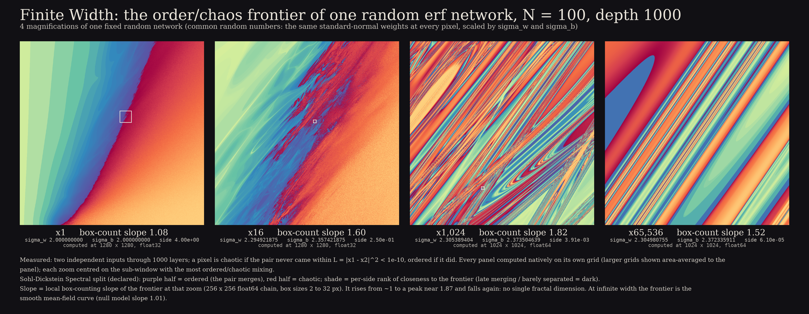

## 1. The phenomenon

Take an MLP with layer map h^l = W^l φ(h^{l-1}) + b^l, with W_ij ~ N(0, σ_w²/N) and b_i ~ N(0, σ_b²). Feed in two inputs and watch their correlation c^l as depth l grows.

**Mean field (N → ∞; Poole et al. 2016, Schoenholz et al. 2017).** The length q^l = |h^l|²/N and the correlation c^l obey deterministic maps:

- q^l = σ_w² E_z[φ(√q^{l-1} z)²] + σ_b² → a fixed point q\*
- c^l = (σ_w² E[φ(u₁)φ(u₂)] + σ_b²) / q\*, u₁,u₂ jointly Gaussian with correlation c^{l-1} → a fixed point c\*
- χ₁ = σ_w² E[φ'(√q\* z)²] is the slope of the correlation map at c = 1.

If χ₁ < 1 every pair of inputs is driven to c\* = 1 (**ordered**: the net forgets its input); if χ₁ > 1, c = 1 is unstable and nearby inputs decorrelate (**chaotic**). Correlations approach c\* like e^{-l/ξ_c}, with ξ_c = −1/log(σ_w² E[φ'(u₁)φ'(u₂)]), which diverges on the critical line χ₁ = 1. Schoenholz et al. showed that nets deeper than about 6 ξ_c do not train, so the trainable region is a band around the critical line.

**Finite width (D'Inverno et al. 2025, arXiv:2508.03222).** Fix *one* random draw of standard-normal weights and biases for all depths and scale it by (σ_w, σ_b) at every pixel (common random numbers). Push two independent inputs x₁, x₂ through D = 1000 erf layers of width N and call a pixel chaotic if the pair never merges. At N = ∞ the frontier is the smooth mean-field curve; at N = 100 it becomes rough, and the paper reports a box-counting dimension of ≈ 1.85 for MLPs.

This project renders both halves: **Part A** reproduces and measures the tanh phase diagram; **Part B** zooms into the finite-width frontier with native-resolution computations at every magnification and tests the fractal claim honestly.

## 2. Hero pieces

<table>
<tr>
<td width="50%">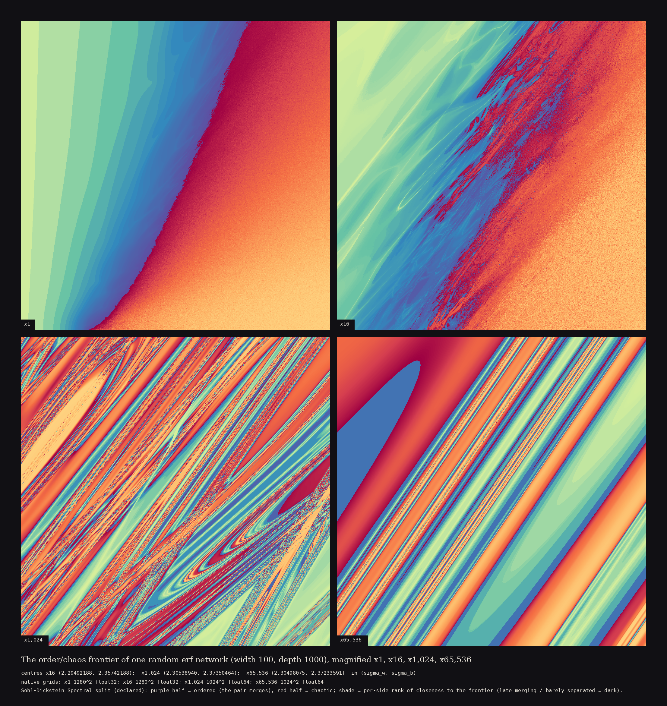 <b>Four magnifications, 2×2 poster (Spectral split).</b> x1, x16, x1024, x65536 of the same N = 100 network; each panel computed natively (see captions).</td>
<td width="50%">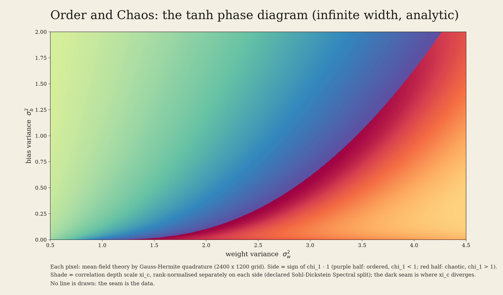 <b>The tanh phase diagram, infinite width.</b> Side = sign(χ₁ − 1); shade = ξ_c rank-normalised per side (declared Spectral split); the dark seam is where ξ_c diverges.</td>
</tr>
</table>

<video src="gallery/deepzoom_spectral.mp4" autoplay loop muted playsinline width="640"></video> 
<b>Deep zoom, x1 → x4096</b> into the N = 100 frontier: 13 native 1280² float32 keyframes, one per doubling (GIF: <a href="gallery/deepzoom_spectral.gif">deepzoom_spectral.gif</a>).

## 3. Gallery

### Part B: the finite-width frontier (erf, N = 100, D = 1000, one fixed random network)

Signed field for the split styles (declared): **ordered** pixels (the pair reached L = |x₁ − x₂|²/N < 1e-10) are shaded by how late they merged, **chaotic** pixels (never merged within 1000 layers) by log10(L / 1e-10). Both magnitudes are small near the frontier; each side is rank-normalised separately per image and mapped onto one half of the palette, so the dark ends meet at the frontier.

<table>
<tr><td>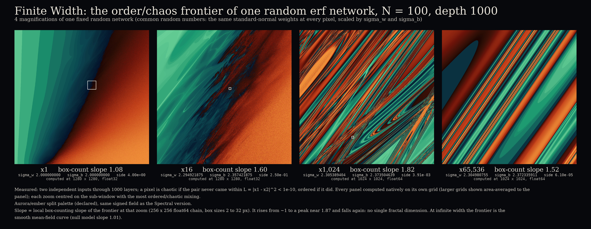</td><td>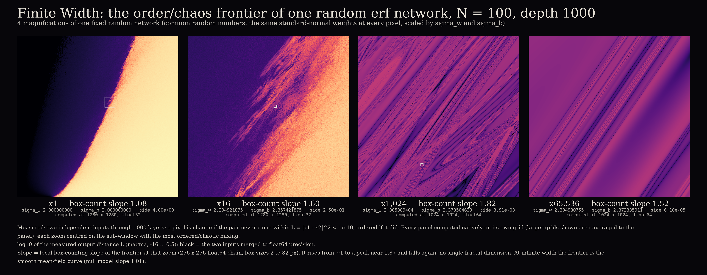</td></tr>
<tr><td>Aurora/ember split (declared palette), same signed field.</td><td>Magma: log10 L on [−16, 0.5], no normalisation; black = the inputs merged to float precision.</td></tr>
<tr><td>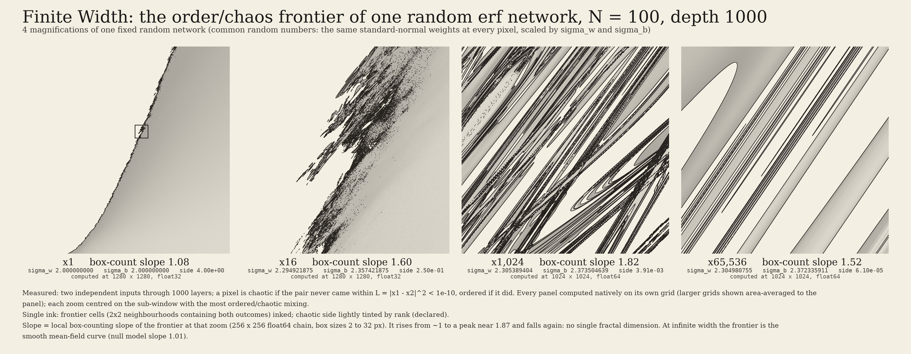</td><td>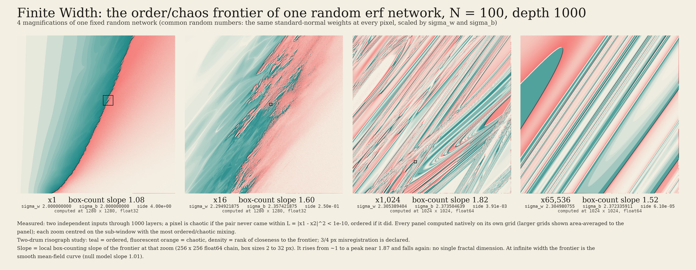</td></tr>
<tr><td>Single ink: frontier cells (2×2 neighbourhoods with both outcomes) inked; chaotic side lightly tinted.</td><td>Two-drum riso: teal = ordered, fluorescent orange = chaotic; density = closeness rank; 3/4 px misregistration declared.</td></tr>
</table>

Single native plates (no text, one pixel per computed point): `gallery/frontier_N100_x{1,16}_f32_r1280_{style}_raw.png`, `gallery/frontier_N100_x{1024,65536}_f64_r1024_{style}_raw.png`.

**Motion.**

<table>
<tr>
<td><video src="gallery/deepzoom_magma.mp4" autoplay loop muted playsinline width="100%"></video> Deep zoom, magma (log10 L).</td>
<td><video src="gallery/deepzoom_ink.mp4" autoplay loop muted playsinline width="100%"></video> Deep zoom, single ink (frontier cells).</td>
</tr>
<tr>
<td><video src="gallery/width_as_time_spectral.mp4" autoplay loop muted playsinline width="100%"></video> <b>Width as time</b>, N = 8 → 512 → ∞: the same master weights (width-N net = top-left N×N block), 512² per width. Frames are separate measurements; dissolves between them are declared. Also <a href="gallery/width_as_time_magma.mp4">magma</a>, <a href="gallery/width_as_time_ink.mp4">ink</a>.</td>
<td><video src="gallery/depth_dial_spectral.mp4" autoplay loop muted playsinline width="100%"></video> <b>Depth as the dial</b>: one N = 100 network read out at l = 1 … 1000 (left) beside the mean-field closed form (right). Also <a href="gallery/depth_dial_magma.mp4">magma</a>, <a href="gallery/depth_dial_ink.mp4">ink</a>.</td>
</tr>
</table>

<table>
<tr>
<td width="50%">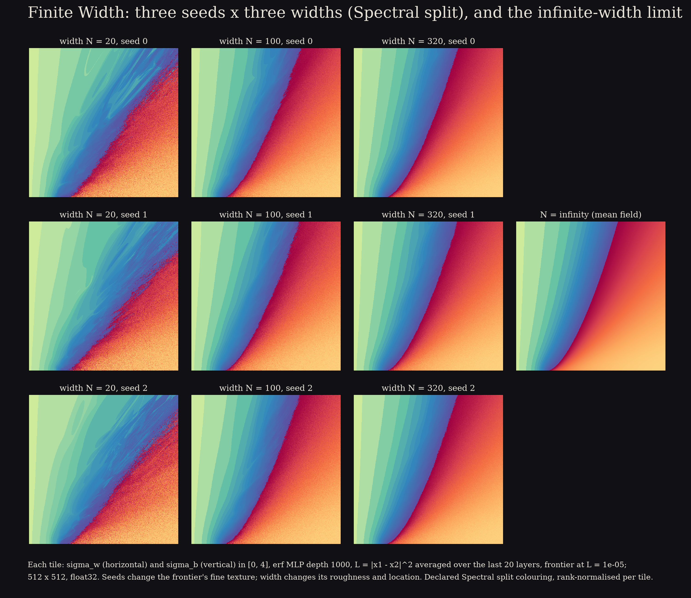 Three seeds × three widths and the N = ∞ limit (mean-field ordered side shaded by its closed-form merge depth).</td>
<td width="50%">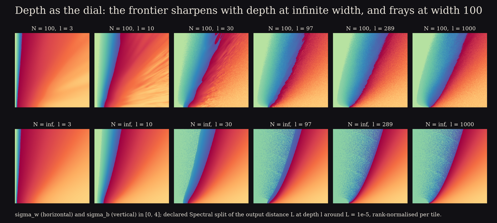 Depth dial as small multiples.</td>
</tr>
<tr>
<td>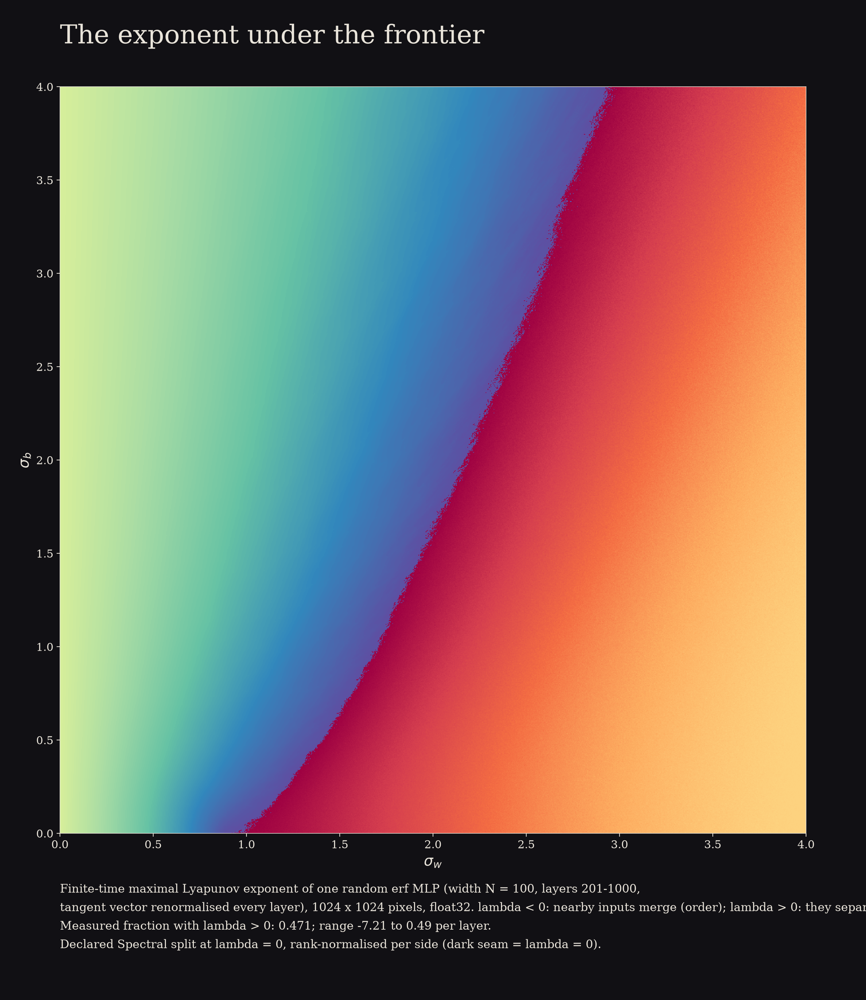 <b>Finite-time Lyapunov exponent</b> λ(σ_w, σ_b) of the same network (N = 100, 1024², float32), split at λ = 0 (Spectral, declared). 47.1% of pixels have λ > 0. Also <a href="gallery/lyapunov_cyanotype_vandyke.png">cyanotype/Van Dyke</a>, <a href="gallery/lyapunov_vik_linear.png">vik linear</a>.</td>
<td>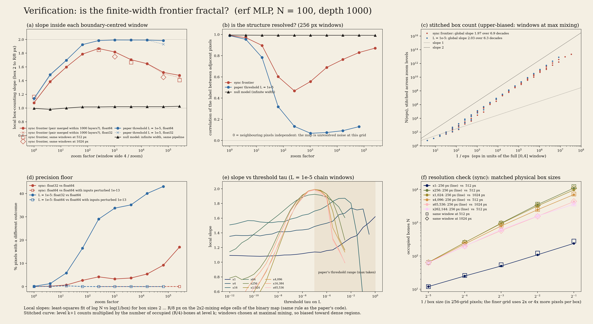 Verification sheet: local box-counting slope vs zoom (two labels), null model, precision and resolution checks, threshold dependence.</td>
</tr>
</table>

### Part A: the tanh phase diagram, analytic and measured

<table>
<tr><td width="50%">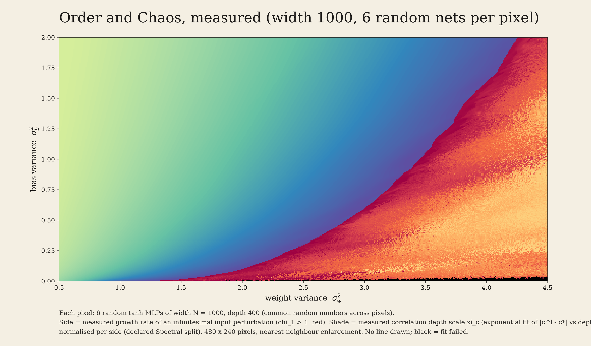</td><td width="50%">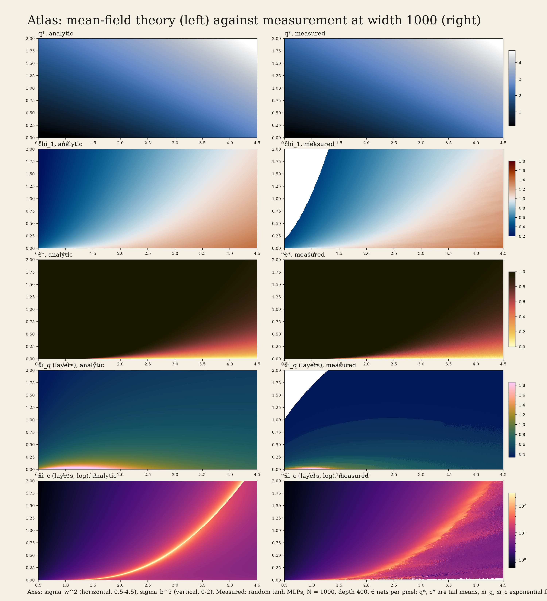</td></tr>
<tr><td><b>Measured</b> (N = 1000, 6 nets per pixel, 480×240): side = sign of measured χ₁ − 1, shade = measured ξ_c rank per side (Spectral split, declared).</td><td>Atlas: analytic vs measured q\*, c\*, χ₁, ξ_c.</td></tr>
<tr><td>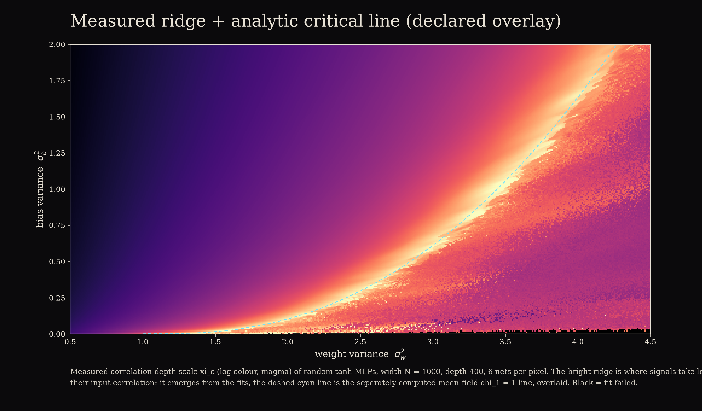</td><td>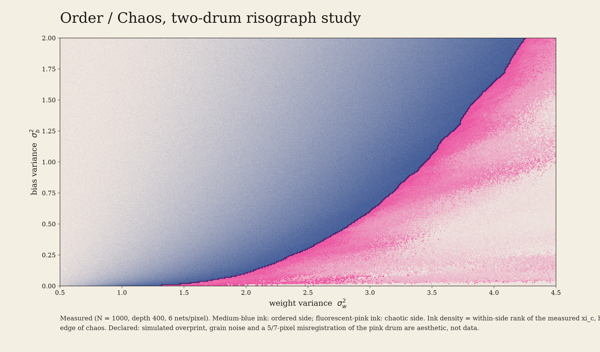</td></tr>
<tr><td>Measured ξ_c ridge (magma, log scale) with the analytic critical line as a hairline. Also <a href="gallery/phase_ridge_magma_measured.png">without the line</a>.</td><td>Riso study of the measured map (declared spot colours).</td></tr>
<tr><td>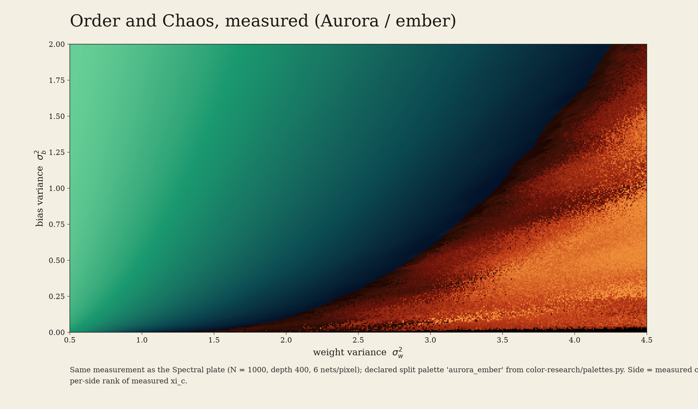</td><td>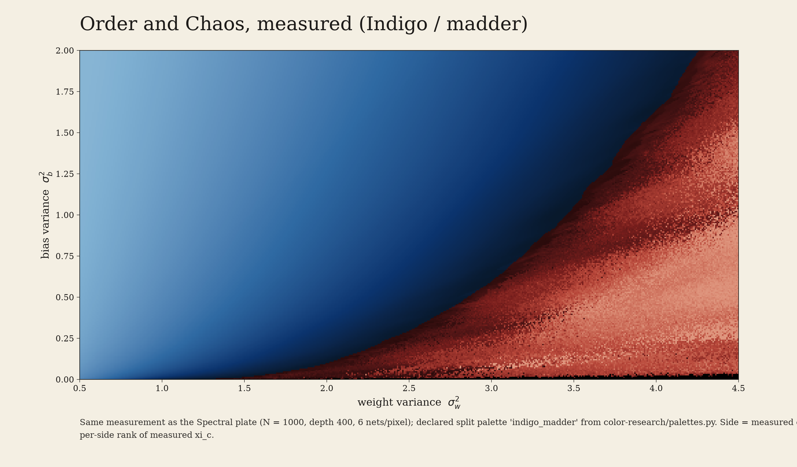</td></tr>
<tr><td>Aurora/ember split, measured.</td><td>Indigo/madder split, measured.</td></tr>
<tr><td>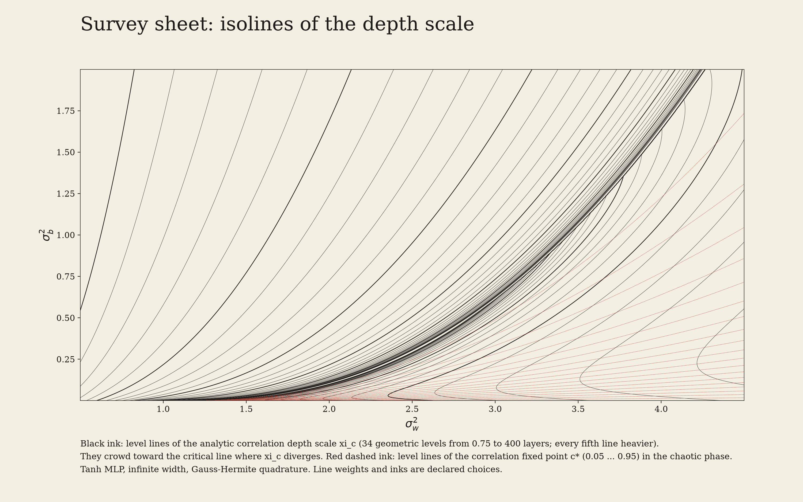</td><td>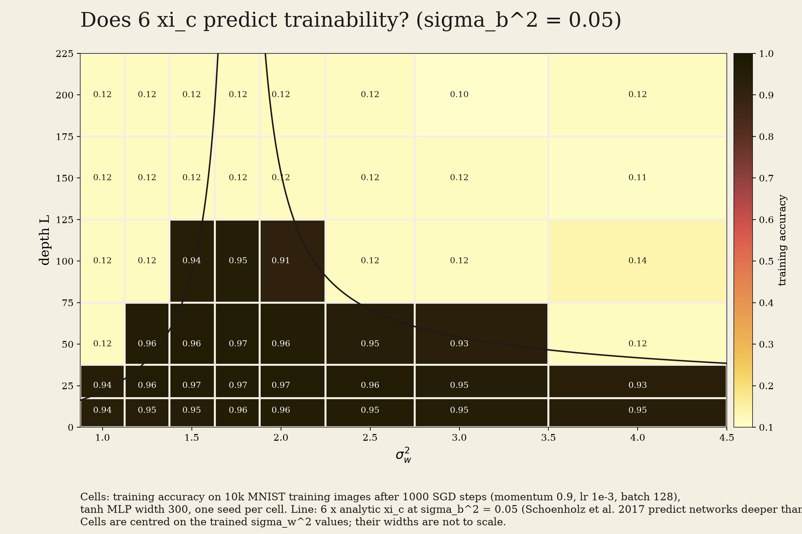</td></tr>
<tr><td>Survey-sheet contours of analytic ξ_c on paper.</td><td>Trainability check: MNIST, width 300, max trainable depth vs 6 ξ_c.</td></tr>
</table>

<table>
<tr>
<td width="50%"><video src="gallery/flow_correlation_spectral.mp4" autoplay loop muted playsinline width="100%"></video> <b>Correlation flow</b> (measured, N = 1000): pairs starting at c = 0 (top) and c = 0.99 (bottom) over depth. Shade = per-side rank of log10(1 − c), split by measured χ₁ (declared). Also <a href="gallery/flow_correlation_oslo.mp4">oslo</a>, <a href="gallery/flow_correlation_cyanotype.mp4">cyanotype</a>.</td>
<td width="50%">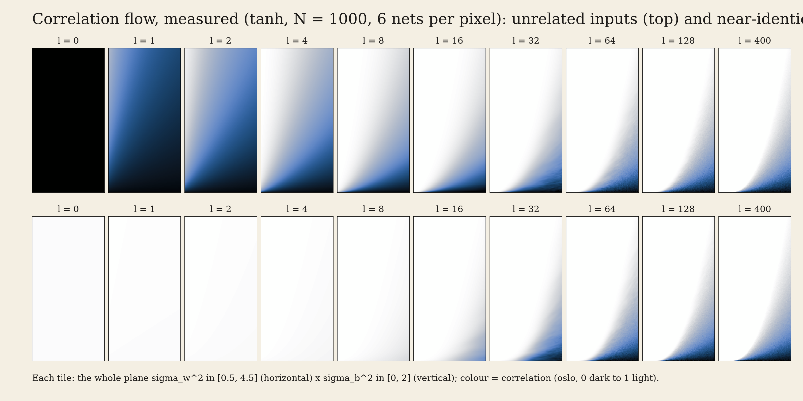 Correlation flow small multiples, log10(1 − c) on [−4, 0] (oslo).</td>
</tr>
</table>

## 4. What was computed

All code is in this directory; compute scripts write `cache/`, render scripts read only `cache/`. Python: `/home/fzeng/ml/research/art/.venv/bin/python` (torch 2.14, CUDA, NVIDIA GB10). `PY=/home/fzeng/ml/research/art/.venv/bin/python; G=../_shared/gpu_run.sh`.

**Part A (tanh).**
- Analytic map: `$PY compute_meanfield_tanh.py --W 2400 --H 1200` (Gauss–Hermite quadrature, bisection for q\*, largest root for c\*; σ_w² ∈ [0.5, 4.5], σ_b² ∈ [0, 2]; float64; 800 s).
- Measured map: `$PY compute_empirical_tanh.py --W 480 --H 240 --N 1000 --D 400 --K 6 --chunk 4096` (no mean-field formula; per pixel K = 6 CRN realisations, inputs A, B (independent), C (c₀ = 0.99), plus a 1e-3 perturbation pair for χ₁; float32; 8,670 s).
- Trainability: `$PY compute_trainability.py --steps 1000 --depths 10 25 50 100 150 200` (MNIST, width 300, σ_b² = 0.05, SGD momentum 0.9, lr 1e-3, batch 128; 4,620 s).

**Part B (erf, paper setup).** W ~ N(0,1)/√N, b ~ N(0,1), fresh per layer, same draw at every pixel, scaled by (σ_w, σ_b) ∈ [0, 4]²; x = h/√N; D = 1000; seed 0; `sp_core.frontier_grid` (torch.compile, batched over pixels).
- Zoom chains, ×4 per level, next window centred on the sub-window with the most ordered/chaotic mixing: `$PY compute_zoom_chain.py --N 100 --levels 10 --step 4 --res 256 --dtype f64 --tag B --label sync`, then the same windows in float32 and with 1e-13 input perturbation (`--centers ... --dtype f32`, `--tag Bpert --perturb 1e-13`). Chain A (paper threshold, L_avg > 1e-5): `--tag A` (9 levels).
- Resolution check: the same windows at 512² float64 (`--tag Bres`, `Bres2`, `Bres3`) and 1024² float64 (`Bplate2a`, `Bplate2b`).
- Video keyframes, ×2 per level, 13 levels, 1280² float32: `--tag Bvideo` / `Bvideo2` with `cache/win_Bvideo*.json`; merged by `merge_chains.py`.
- Width maps: `$PY compute_width_maps.py --res 512 --seeds 0 --Ns 8 10 13 16 20 25 32 40 50 64 80 100 128 160 200 256 320 400 512` (+ seeds 1, 2 for N = 20, 100, 320; float32); mean-field t_hit: `$PY compute_mf_thit.py`.
- Extras: `$PY compute_lyapunov.py --N 100 --res 1024 --tag full`; `$PY compute_depth_dial.py --N 100 --res 512`.
- Analysis: `$PY analyze_fractal.py --tag B --label sync --null_levels 10` and `--tag A` → `cache/fractal_report_*.json`.
- Renders: `render_phase.py`, `render_flow.py`, `render_width.py`, `render_depth_dial.py`, `render_lyapunov.py`, `render_verification.py`, `render_zoom_plates.py --chain <file:level> ...`, `render_zoom_video.py --chain cache/zoom_Bvideoall_N100_D1000_s0_f32_r1280.npz`.

Total GPU time: see §5 (end).

## 5. Verification and honesty

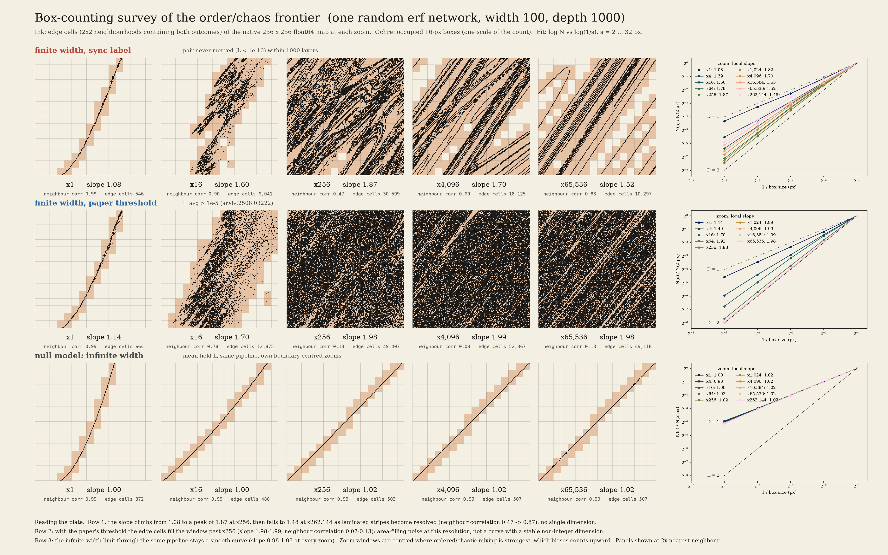 
<b>Box-counting survey plate.</b> Rows: finite width with the sync label, finite width with the paper's threshold, and the infinite-width null model. Ink = edge cells of the native 256² float64 map; ochre = occupied 16-px boxes; right = N(s) for every zoom level.

 
<b>Verification sheet.</b> (a) local slope vs zoom, (b) neighbour correlation of the label, (c) stitched N(ε), (d) precision floor, (e) threshold dependence, (f) resolution check.

### Part A: did mean-field theory show up in our measurements?

Yes. The analytic critical point at σ_b² = 0.05 is σ_w² = 1.7610 (Schoenholz et al. report ≈ 1.76). The measured map (N = 1000, 6 networks per pixel) matches the closed form. Numbers are measured/analytic median ratios.

| quantity | ordered side | chaotic side |
|---|---|---|
| q\* | 0.997 | 0.997 |
| c\* | 1.000 | 1.003 |
| χ₁ | 1.002 | 0.999 |
| ξ_c | 0.99 | 0.83 (noisy: c approaches c\* < 1 from both sides and the log-fit is short) |
| ξ_q | 0.67 | 0.64 (ξ_q is under one layer, so the fit is crude) |

- The measured sign of χ₁ − 1 agrees with theory on 99.7% of pixels.
- The ridge of maximal measured ξ_c sits a median 0.026 in σ_w² (3 px) from the analytic line.
- Trainability (MNIST, width 300, 1000 SGD steps): the largest trainable depth tracks 6 ξ_c at σ_w² = 1.0 … 4.0. Close to criticality every net deeper than 100 still failed, which we attribute to the 1000-step budget, not to signal propagation.

### Part B: is the finite-width frontier fractal?

**Short answer: rough, intricate and deterministic, yes. A fractal with a single, stable non-integer dimension, no.** The number the paper reports depends on the label, the threshold, the zoom level and the box range.

**The paper (arXiv:2508.03222) checked against its code.** The setup is an erf MLP with W ~ N(0,1)/√N and b ~ N(0,1), redrawn per layer and shared by every pixel (common random numbers). The frontier is found by thresholding L = |x₁ − x₂|². The dimension is fitted with box sizes 1–49 px on a single image and reported as the **maximum over thresholds τ ∈ [1e-5, 1]**, which is 1.85 for MLPs. Taking a max over 25 thresholds of a noisy slope biases it upward. On our x1 map (256², box sizes 2–32 px) the slope at τ = 1e-5 is 1.14, and the max over the paper's τ range is 1.62.

**Two labels, two zoom chains** (256² float64 at every level, ×4 per level, each window centred on the sub-window with the most ordered/chaotic mixing):

| zoom | sync label: slope | neighbour corr | f32≠f64 | paper label L_avg > 1e-5: slope | neighbour corr | f32≠f64 | f64 perturbed 1e-13 ≠ f64 | null (N = ∞) slope |
|---|---|---|---|---|---|---|---|---|
| ×1 | 1.08 | 0.99 | 0.02% | 1.14 | 0.99 | 0.1% | 0.02% | 1.00 |
| ×4 | 1.39 | 0.97 | 0.2% | 1.49 | 0.95 | 1.3% | 0.10% | 0.98 |
| ×16 | 1.60 | 0.90 | 0.7% | 1.70 | 0.78 | 5.9% | 0.35% | 1.00 |
| ×64 | 1.79 | 0.60 | 2.7% | 1.92 | 0.32 | 16.5% | 0.04% | 1.02 |
| ×256 | **1.87** | 0.47 | 4.2% | 1.98 | 0.13 | 29.0% | 0.01% | 1.02 |
| ×1,024 | 1.82 | 0.56 | 3.3% | 1.99 | 0.07 | 33.8% | 0 | 1.02 |
| ×4,096 | 1.70 | 0.69 | 3.7% | 1.99 | 0.08 | 35.2% | 0.003% | 1.02 |
| ×16,384 | 1.65 | 0.76 | 5.4% | 1.99 | 0.09 | 40.1% | 0 | 1.02 |
| ×65,536 | 1.52 | 0.83 | 9.2% | 1.98 | 0.13 | 43.1% | 0 | 1.02 |
| ×262,144 | 1.48 | 0.87 | 17.0% | | | | | 1.03 |

Reading the table:

- **Paper label: area-filling past ×256, not a stable non-integer dimension.** The local slope climbs 1.14 → 1.49 → 1.70 → 1.92 and then sits at 1.98–1.99 from ×256 to ×65,536. There, the label of adjacent pixels is almost uncorrelated (0.07–0.13), so at every grid we can afford the frontier fills the window like noise. D → 2 means "unresolved at this resolution"; it is not evidence of a fractal curve. The ordered/chaotic classification is nonetheless *deterministic*: re-running in float64 with inputs perturbed by 1e-13 flips at most 0.35% of pixels (0 at most deep levels), so this is real sensitivity of a 1000-layer map to (σ_w, σ_b), not roundoff. float32, in contrast, flips up to 43%.
- **Sync label: a hump, not a plateau.** With "did the pair ever merge (L < 1e-10)?" the slope rises to a peak of 1.87 at ×256 and then falls steadily to 1.48 at ×262,144, while the neighbour correlation recovers from 0.47 to 0.87. Deep windows show laminated stripes (see the ×4,096 and ×65,536 plates) that become resolved as we zoom: a frontier that is smooth below some scale (≈ 1e-8 in σ at depth 1000) would look exactly like this. Finite depth sets an inner cutoff; there is no evidence of self-similarity continuing indefinitely. SYNC_PERT_TBD
- **Null model.** The N = ∞ mean-field frontier through the identical pipeline (its own boundary-centred zoom chain) gives slope 0.98–1.03 at every level, and neighbour correlation 0.99. The roughness is a finite-width effect.
- **Resolution check.** The same windows recomputed at 512² float64 give local slopes 1.16 (×1), 1.85 (×256), 1.67 (×4,096), against 1.08, 1.87, 1.70 at 256², and box counts at matched physical box sizes agree to within a few per cent (panel f). RES1024_TBD
- **Stitched count.** Multiplying box counts across nested windows gives global slopes of 1.97 (sync, 6.9 decades of ε) and 2.03 (paper label, 6.3 decades). These numbers are upper-biased by construction, because every window is chosen at maximal mixing. We report them only for completeness.
- **Threshold dependence.** At a fixed window the slope varies strongly with τ. At ×4 it spans 1.35–1.74 over τ ∈ [1e-12, 1], and deeper windows range from below 0.5 to 1.99. A dimension quoted without its τ, zoom and box range is not meaningful.
- **Where the frontier is.** From ×16 on, every zoom window lies entirely on the *chaotic* side of the mean-field line (mean-field chaotic fraction 1.00). At N = 100 the frontier is shifted into the mean-field chaotic phase, so the roughness is not a thickening of the mean-field curve.
- **Lyapunov map.** The finite-time Lyapunov exponent of the same network is a smooth field (47.1% of pixels have λ > 0). The intricacy lives in the binary merge/no-merge outcome, not in λ.

**Precision floor.** float64 is used for every chain and every plate at ×256 and deeper. float32 is used for the video keyframes, width maps, depth dial and Lyapunov map. Label mismatches between float32 and float64 are listed in the table. float32 slopes agree with float64 to within 0.03 (sync) and 0.05 (paper label), so the float32 video shows representative texture, not the exact float64 answer.

### What did not work, and what was not pursued

- The trainability check cannot resolve the critical band beyond depth 100 with 1000 SGD steps (budget).
- Measured ξ_c on the chaotic side is 17% short of the closed form, and ξ_q is too short to fit well.
- Width maps for N = 640 and 1024 were skipped (GPU budget); the width film runs N = 8 … 512, then ∞.
- Several early 1024² plate jobs were killed by the shared-GPU queue and recomputed from their saved windows.
- Explored and built: the Lyapunov map and the depth dial. Not pursued: the backprop (gradient) version of the frontier, CNN/FDF architectures, an uncertainty-exponent estimator, a 3D width stack, and sonification.

## 6. Caveats

- **Mean field is an N → ∞, i.i.d.-Gaussian statement.** The ordered/chaotic plane of Part A describes typical wide random nets at initialisation, not trained nets, and not architectures with residuals or normalisation.
- **The finite-width frontier is a property of one random draw.** Change the seed and the fine texture changes completely (see the seeds grid); only statistics (roughness, location drift) are reproducible. Nothing here says anything about trained networks.
- **The label depends on choices**: depth D = 1000, the merge threshold (1e-10) or the paper's L_avg > τ, and the pair of inputs. The measured dimension depends on all of them (§5).
- **Zoom windows are chosen where mixing is maximal**, which biases every multi-level (stitched) dimension upward.
- **Colour**: every split-palette image uses per-image, per-side rank normalisation (Sohl-Dickstein style). This equalises the histogram and can make featureless gradients look banded; the magma variants are the unnormalised reference.
- **Precision floor**: float64 throughout the deep chains and plates; float32 for video keyframes, width maps, depth dial and Lyapunov map. At deep zoom float32 flips up to 17% of labels (§5), so float32 deep frames show representative texture, not the exact float64 answer.
- Trainability (Part A) used only 1000 SGD steps, so near criticality depth > 100 nets fail, probably from the step budget rather than signal propagation.

## 7. References

- B. Poole, S. Lahiri, M. Raghu, J. Sohl-Dickstein, S. Ganguli. *Exponential expressivity in deep neural networks through transient chaos.* NeurIPS 2016.
- S. Schoenholz, J. Gilmer, S. Ganguli, J. Sohl-Dickstein. *Deep Information Propagation.* ICLR 2017.
- M. D'Inverno, J. Dong, et al. *Fractal structure in deep information propagation* (arXiv:2508.03222, 2025); code github.com/jon-dong/fractal-deep-info-prop. Checked: erf MLP, CRN across pixels, frontier from L = |x₁ − x₂|², box sizes 1–49 px on one image, dimension = max over τ ∈ [1e-5, 1].
- J. Sohl-Dickstein. *The boundary of neural network trainability is fractal.* arXiv:2402.06184, 2024; Spectral split style from github.com/Sohl-Dickstein/fractal.
- Fractals companion doc §3 and §11, main doc §6 (`../ml-art-fractals.md`, `../ml-art-directions.md`).
