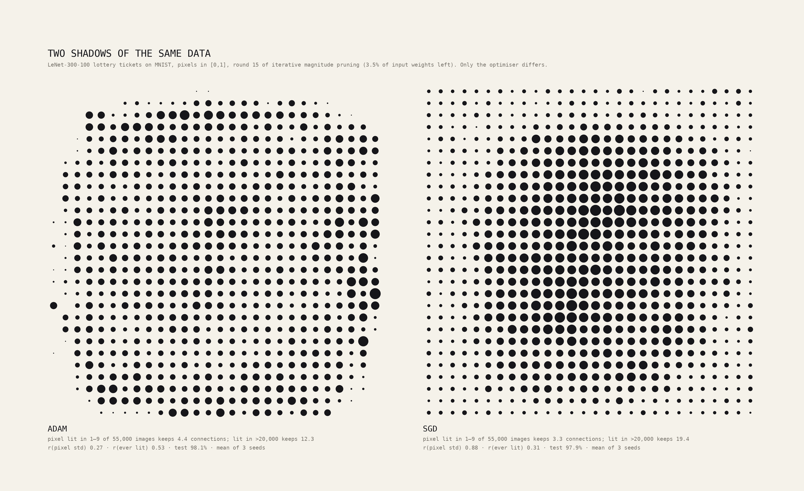
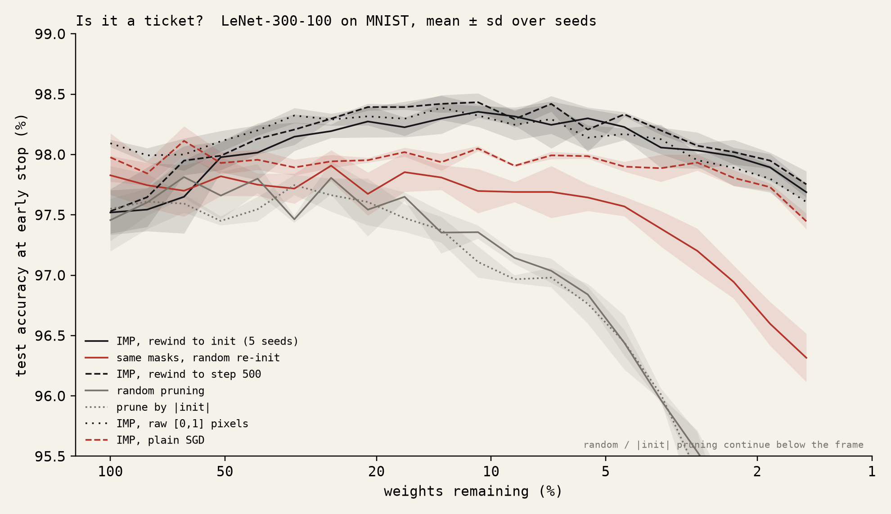
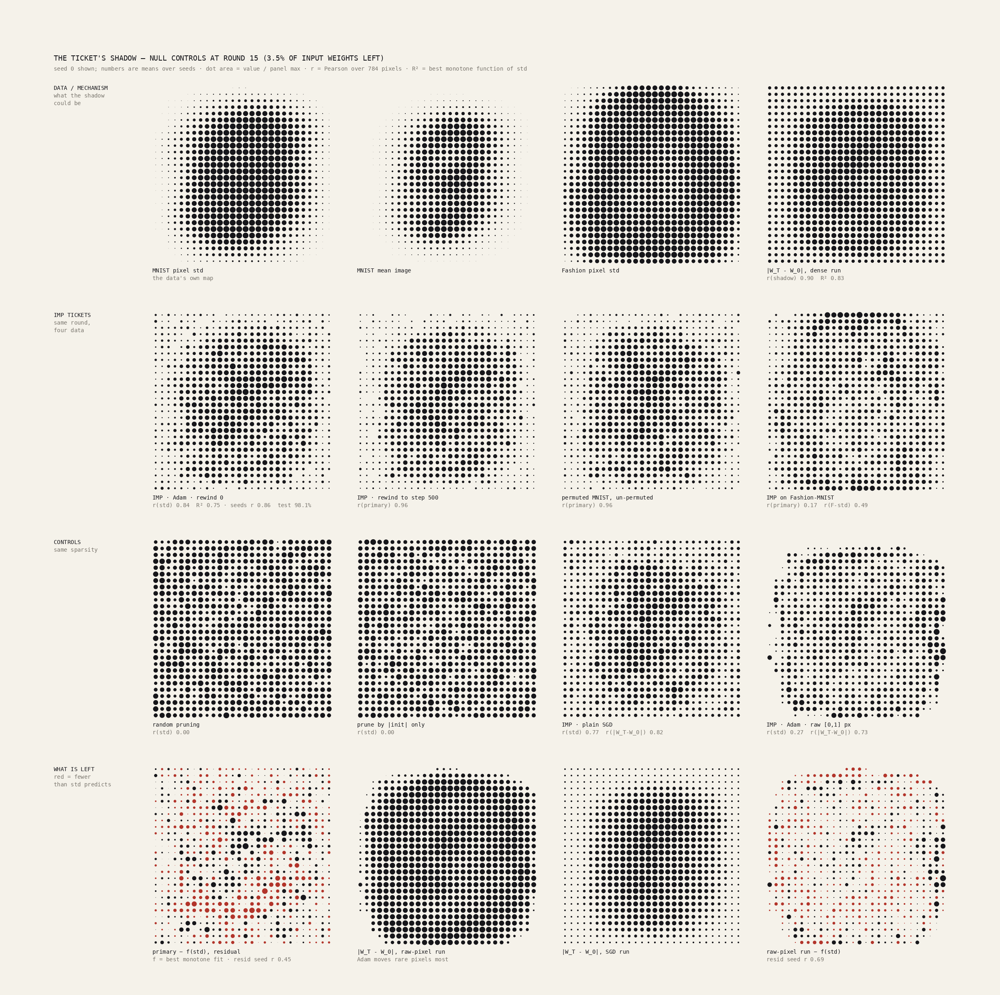
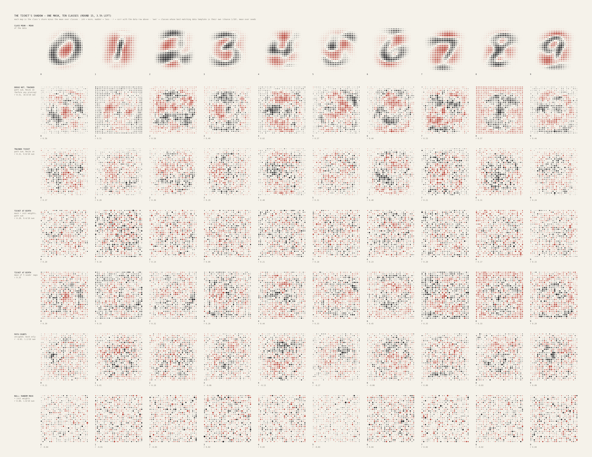
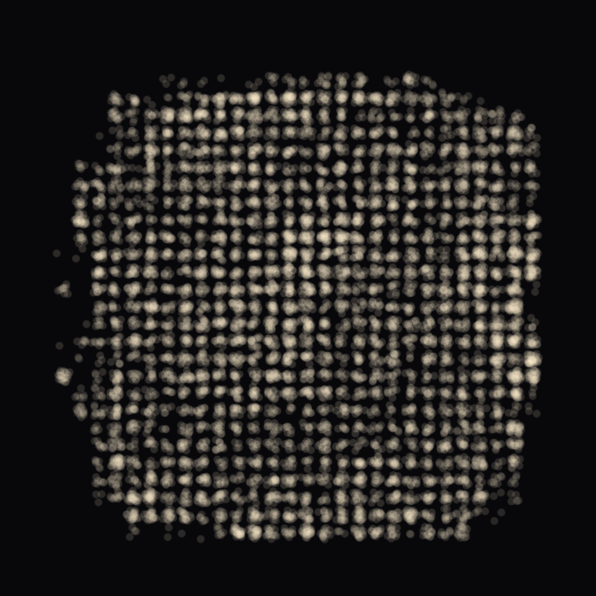
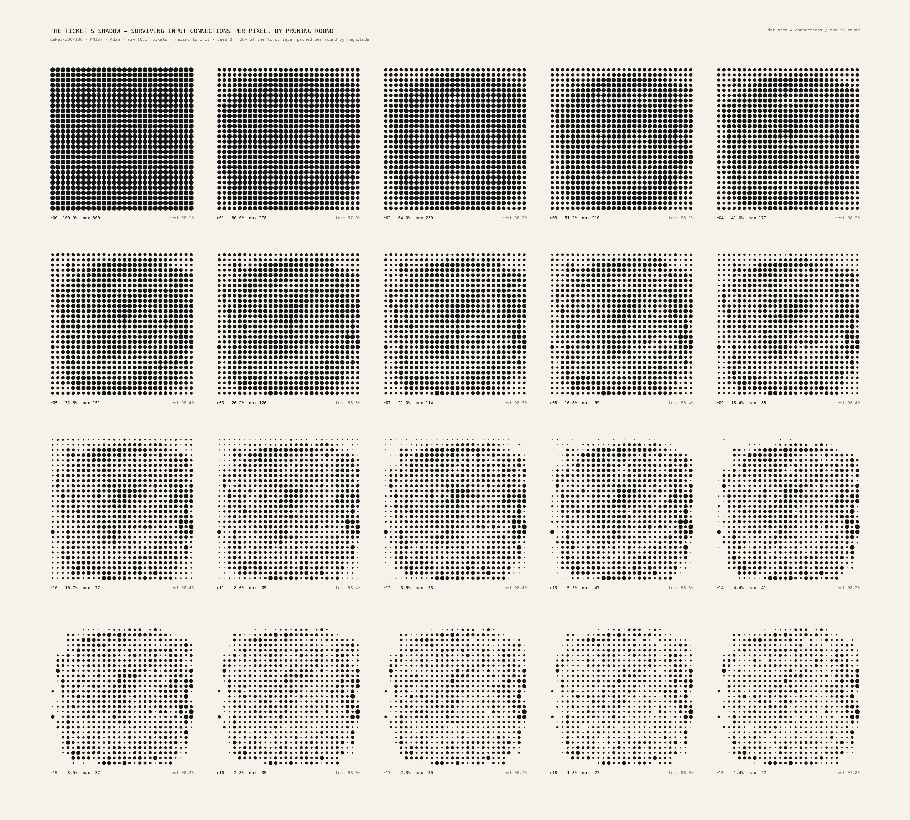
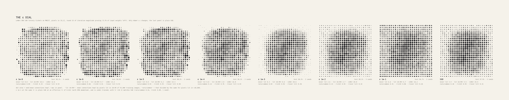
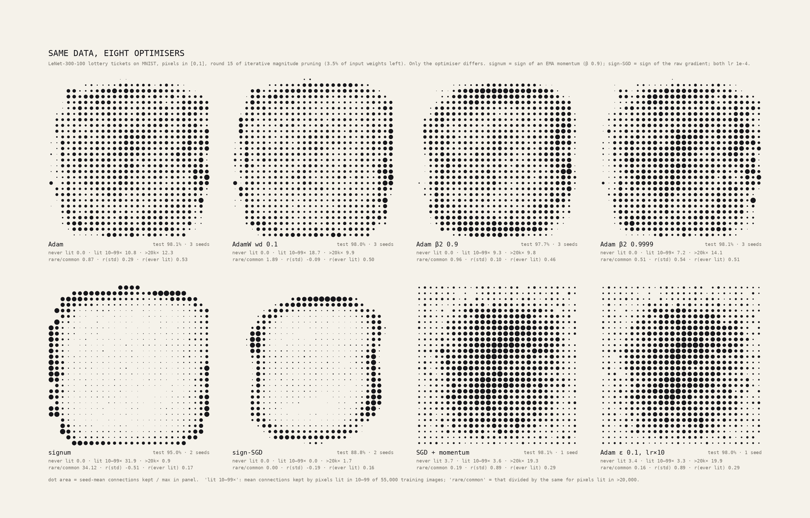

# The Ticket's Shadow

*Prune a small network down to its lottery ticket. Count the connections that survive at each input pixel, and you get a 28×28 picture of where the network decided the data lives. Cut one hole per surviving connection into a sheet, light it from behind, and that picture falls on the wall.*



**The finding.** Most of the shadow is a trivial map of the data. The rest is set by the optimiser. With standardised pixels, or with plain SGD, the shadow is a soft bright core. A monotone function of the pixel-variance map explains R² 0.62–0.79 of it, and it correlates r 0.77–0.88 with the variance map. With **Adam on raw [0,1] pixels**, the shadow becomes a flat plateau with a hard edge: the *support* of MNIST. At 3.5% of the input weights:
- the 67 pixels that are never lit keep **0** connections;
- a pixel lit in only 10–99 of 55,000 training images keeps **10.8** connections;
- a pixel lit in more than 20,000 images keeps **12.3**.

Under SGD on the same data, those three numbers are 3.4, 3.5 and 19.4. Adam normalises each weight's update by its own gradient history, so rarely-active pixels take full-size steps and survive magnitude pruning. The shadow records the optimiser as much as the data.

**The per-class shadows do not look like digits.** This is a null, and the class plate shows it.

## The phenomenon

Frankle & Carbin (ICLR 2019) introduced iterative magnitude pruning (IMP) with rewinding:
1. Train the network.
2. Remove the smallest-magnitude weights.
3. Reset the survivors to their initial values.
4. Retrain, and repeat.

The sparse subnetwork that results, the "winning ticket", trains to the dense network's accuracy or better. In an MLP, the first layer's mask is 784 × 300, and each row belongs to one input pixel. The row sums form a 28 × 28 image, and that image is the ticket's shadow.

## What was computed

**Network.** LeNet-300-100 (784-300-100-10, ReLU), set up as in Frankle & Carbin:
- Gaussian Glorot init, zero biases;
- Adam, lr 1.2e-3, batch 60;
- 55k/5k train/validation split, test on the 10k test set;
- each round prunes 20% of the surviving weights in each hidden layer and 10% in the output layer, layer-wise by |final weight|. Biases are never pruned.

**Rounds.** 20 rounds, from dense down to 1.44% of the first layer (1.49% of all weights).

**Deviation from the paper, declared.** Each round trains for **20k iterations**, not 50k, to fit the budget. Test accuracy is read at the iteration of minimum validation loss (evaluated every 1k steps).

**Implementation.** `imp.py` trains all seeds of a condition side by side as stacked, independent MLPs (bmm). The loss is a sum of per-model means and the optimisers are elementwise, so each model trains exactly as it would alone. Masks, final weights (fp16), init weights and accuracy curves are saved every round in `cache/<cond>/round_XX.npz`.

| condition (job) | what varies | seeds |
|---|---|---|
| `mnist_adam_norm_rw0` (658) | **primary**: MNIST standardised with the global mean/std (the torchvision/open_lth convention), rewind to init | 5 IMP + 5 same-mask random re-init |
| `mnist_adam_norm_rw500` (659) | late rewinding to step 500 (then 19.5k steps per round) | 3 |
| `mnist_nulls` (660) | random pruning, and pruning by \|init\| only, at matched per-layer counts | 3 + 3 |
| `pmnist_adam_norm_rw0` (661) | pixel-permuted MNIST, with a fixed permutation per seed; the shadow is un-permuted afterwards | 3 |
| `fashion_adam_norm_rw0` (692) | Fashion-MNIST | 3 |
| `mnist_sgd_norm_rw0` (663) | plain SGD, lr 0.1 | 3 |
| `mnist_adam_raw_rw0` (664) | raw [0,1] pixels, so border pixels are exactly 0 | 3 |
| `mnist_sgd_raw_rw0` (728) | raw pixels + SGD (the mechanism test) | 3 |

**Analysis** (`analyze.py`, `stats.py`, `support_table.py`; CPU):
- **Shadow:** `shadow[i]` = the number of surviving first-layer weights leaving pixel i.
- **Path counts:** `paths[c,i]` = (M1·M2·M3)[i,c], the exact number of surviving input→class paths.
- **Signed path sum (declared definition):** `signed[c,i]` = ((W1⊙M1)(W2⊙M2)(W3⊙M3))[i,c]. This is the sum over surviving paths of the product of trained weights, which is the network with every ReLU switched on.
- **Ticket at birth:** `signed0` is the same sum using the rewound (init) weights.
- **Class test:** each class map is turned into a contrast, K_c = map_c/Σ map_c − the mean over classes. It is correlated with the data contrast T_c = (class-c mean image) − (mean of the class means). "Own" counts the classes whose best-matching data template is their own (chance: 1 of 10).

## Is it a ticket? Yes.



Test accuracy at early stop, mean ± sd over seeds:

| | dense | 3.5% of layer 1 (round 15) | 1.4% of layer 1 (round 19) |
|---|---:|---:|---:|
| IMP ticket (5 seeds) | 97.52 ± 0.18 | **98.06 ± 0.17** | **97.69 ± 0.07** |
| same masks, random re-init | — | 97.39 ± 0.15 | 96.32 ± 0.20 |
| random pruning | — | 95.97 | 92.11 |
| pruning by \|init\| | — | 96.01 | 91.65 |

The ticket peaks at 98.35% at round 10 (10.7% of layer 1). Every IMP condition stays at or above its dense accuracy to at least 3.5% of the first layer.

## Null controls: what the shadow is made of



Numbers are at round 15 (3.5% of layer 1), as seed means. "R² (iso)" is how much of the shadow the best *monotone* function of the pixel-std map explains, which is the most any "it's just the variance map" story can claim.

| condition | r(std) | R² iso(std) | shadow r across seeds | residual r across seeds | r with primary |
|---|---:|---:|---:|---:|---:|
| primary (Adam, standardised) | 0.84 | **0.75** | 0.86 | 0.45 | — |
| late rewind k=500 | 0.87 | 0.80 | 0.89 | 0.50 | 0.96 |
| permuted MNIST, un-permuted | 0.85 | 0.77 | 0.87 | 0.45 | 0.96 |
| SGD, standardised | 0.77 | 0.62 | 0.71 | 0.27 | 0.89 |
| SGD, raw pixels | 0.88 | 0.79 | 0.86 | 0.33 | 0.93 |
| **Adam, raw pixels** | **0.27** | **0.38** | 0.80 | **0.69** | 0.46 |
| Fashion-MNIST (vs Fashion std) | 0.49 | 0.31 | 0.68 | 0.55 | 0.17 |
| random pruning | 0.00 | 0.01 | 0.03 | — | 0.02 |
| pruning by \|init\| | 0.00 | 0.00 | 0.00 | — | 0.00 |

**The plain statement.** For the faithful replication, the pixel-variance map explains about three quarters of the shadow (R² 0.75 at 3.5%, 0.65 at 1.4%).

**What is left over.** The residual is only half reproducible: its correlation across seeds is 0.45. It is not noise, but it is not a strong second image either.

**The mechanism.** A better predictor than any data statistic is how far each pixel's weights moved during the *first, dense* training run, mean |W_T − W_0| per pixel. That predicts the round-15 shadow with R² 0.83 in the primary run and 0.85 under SGD with raw pixels. The shadow is decided in round 0: magnitude pruning keeps the weights that training moved, and training moves the weights of pixels that carry gradient.

**What each control shows:**
- **Random and |init| pruning:** flat shadows (r ≈ 0), as they must be.
- **Permuted MNIST:** matches the primary (r 0.96). This is a *pipeline* check, not a discovery: an MLP has no spatial prior, so permuted MNIST is the same problem with relabelled inputs.
- **Fashion-MNIST:** a different shadow (r 0.17 with MNIST's). It is less explained by its own variance map, because Fashion's std is a flat plateau over most of the frame.
- **Late rewinding:** does not change the shadow (r 0.96).

**The preprocessing and optimiser result** (`support_table.py`). This table gives mean connections kept per pixel at round 15, binned by how many of the 55,000 training images light that pixel (value > 0):

| condition | never (67 px) | 1–9 (67) | 10–99 (84) | 100–999 (103) | 1k–5k (109) | 5k–20k (149) | >20k (205) |
|---|---:|---:|---:|---:|---:|---:|---:|
| Adam, standardised | 2.6 | 2.9 | 3.2 | 5.4 | 10.8 | 14.8 | 18.0 |
| **Adam, raw [0,1]** | **0.0** | 4.4 | **10.8** | 13.6 | 13.6 | 11.1 | **12.3** |
| SGD, standardised | 6.0 | 6.1 | 6.2 | 6.7 | 9.4 | 12.7 | 16.3 |
| SGD, raw [0,1] | 3.4 | 3.3 | 3.5 | 4.6 | 8.9 | 14.2 | 19.4 |

- **Adam on raw pixels (the anomalous row).** Once a pixel has been lit at all, its connection count is flat. The rare rim pixels hold as many connections as the centre, or more (the thick rim is visible in the typology). The never-lit pixels keep exactly zero, because their weights get exactly zero gradient and stay at init magnitude while everything else grows.
- **SGD.** The gradient on a weight is proportional to the pixel's value, so rare pixels barely move, and the shadow is graded like the variance map.
- **Standardised pixels.** Never-lit pixels sit at a constant −0.42 rather than 0, so they *do* receive gradient (as a redundant bias). The hard edge disappears.

The brief's premise, that "border pixels never receive gradient", holds only for raw pixels.

## One mask, ten classes: a null



| map (primary, round 15) | mean r with the class-contrast image | classes matched to their own template |
|---|---:|---:|
| unsigned path counts M1·M2·M3 | **−0.02** | 1.2 / 10 (chance 1) |
| ticket at birth, signed (mask × init weights) | 0.20 | 9.4 / 10 |
| same, mean of the 5 seeds' maps | 0.37 | — |
| trained ticket, signed | 0.31 | 10 / 10 |
| dense trained net, signed (round 0) | 0.51 | 10 / 10 |
| random mask × init weights | 0.00 | 1.0 / 10 |
| random mask, trained, signed | 0.26 | — |

- **Counting paths through the mask gives no digits at all.**
- **Signed path sums of the trained ticket do resemble the digit contrasts, but that is not a ticket property.** The dense network resembles them *more* (0.51), and a randomly pruned network trained to convergence does about as well (0.26). Pruning makes the linearised network *less* digit-like.
- **The one ticket-specific signal is "at birth".** The rewound init weights, restricted to the ticket's mask, already correlate with the class contrasts (r 0.20; 9.4 of 10 classes match their own template; 0.00 for a random mask). This is the known "masks select weights whose signs already agree with the trained solution" effect (Zhou et al. 2019). It is real, but at r 0.2 it does not *look* like a digit, and the plate shows that.

## The object (a simulation of an object, declared as such)



**The sheet** (`render_object.py`): `gallery/object_mnist_adam_raw_rw0_s0_r15.svg`. It is 368 × 368 mm with 28 × 28 pixel cells on a 12 mm pitch, and has **8,275 holes** of 0.34 mm, one per surviving first-layer weight. The source is the deepest ticket that still matches dense accuracy in the Adam/raw run: seed 0, round 15, test 98.25%.
- Each cell has 300 slots, one per hidden unit, on a Vogel sunflower spiral of radius 5.5 mm.
- A hidden unit occupies the same slot in every cell. Units are assigned to slots in descending order of their total surviving degree (declared).
- A hole is cut if and only if that weight survives, so the sheet *is* M1, folded into image coordinates. At most 37 holes fall in one cell.
- For fabrication, a 0.34 mm hole at about 0.55 mm pitch suits photo-etched 0.2 mm brass or a fine laser on card. The hole diameter is a parameter.
- The SVG uses mm units, with a red hairline outline and black hole circles.

A second sheet, `object_mnist_adam_norm_rw0_s0_r19.svg` (3,390 holes, round 19, test 97.76%), is the primary replication's deepest matching ticket.

**The backlit render.** This is a declared physical model, not a photograph:
- **Light:** a uniform disc source 0.6 m behind the sheet, with the wall 1.2 m in front. Magnification is 3×, so the wall image is 1.1 m wide.
- **Geometric optics:** each hole projects the source's image, a disc of diameter source × 1.2/0.6 (the pinhole-camera blur), weighted by hole area.
- **Diffraction:** approximated by a Gaussian with the Airy-core FWHM, 1.03λb/d = 2.0 mm at λ = 550 nm.
- **Falloff:** cos³θ across the wall.
- **Tone (declared exposure):** E → 1 − exp(−1.6E/E₉₉.₅), warm light on a near-black wall.
- **Source sizes:** three are rendered: 2 mm (`_sharp`: every hole visible), 8 mm (`_medium`: holes merge into pixel cells) and 20 mm (`_soft`: a glowing window).

The soft render's circular "bokeh" is real: each hole paints its own image of the source.

## Series



The typologies, `typology_<cond>_s0_panel.png`, are 20 rounds in a 5 × 4 grid, ink on cream. Only the pruning round changes. There are three: Adam/raw (the window forms and the rim thickens), Adam/standardised (a soft core condenses), and SGD/raw (a core without an edge).

## Declared aesthetic choices

- **Register:** specimen sheets, one ink (#16161a) on cream (#f5f2ea). Madder red is used only for negative values (fewer connections than predicted, or class contrast below the mean). Captions are set in DejaVu Sans Mono.
- **Dots:** each pixel is a dot whose **area** is proportional to the value. In typologies and plates the value is divided by the panel's maximum, and the caption gives the max. Early rounds therefore look uniform: nearly every pixel has nearly all of its 300 connections, and that is true.
- **Seed averaging:** the diptych averages 3 seeds' shadows; the typologies and object show seed 0.
- **Object:** the 12 mm cell pitch, sunflower slot layout, degree-ordered slot assignment, hole size, light geometry and exposure are all design choices, and all are parameters in `render_object.py`.

## Prior art (searched 2026-09-26)

- **Lee, Ajanthan & Torr, SNIP (ICLR 2019), Fig. 2** is the closest prior art. They average LeNet-300-100's first-layer mask to 28 × 28, per class, on MNIST and Fashion-MNIST. In their figure the digit shapes emerge, because SNIP scores connections on class-specific batches *at initialisation*. Our class maps come from a single IMP mask via path counting. Done that way, the digits do *not* emerge (the null above).
- **Frankle & Carbin (2019), App. F.6, Figs. 23–24** give histograms of outgoing connections per input unit. They note bimodality from uninformative edge pixels. They show no 28 × 28 image.
- **Han et al. (NeurIPS 2015), Fig. 4** shows the raw 784 × 300 sparsity pattern of pruned LeNet-300-100, with bands corresponding to the image centre.
- **Vischer, Lange & Sprekeler (ICLR 2022), Fig. 1** shows IMP removing the MNIST rim over rounds.
- **Pellegrini & Biroli (2021)** show per-pixel surviving connections, on ImageNet32, and a two-hop mask product.
- SynFlow and PHEW use path products for *scoring*. I found no per-class path-count images.
- **Artworks:** no perforated or laser-cut piece made from a pruning mask was found. The nearest is ANU's *Perceptron Apparatus*, a laser-cut device that computes MNIST classifications; I saw only a search snippet.

**What is new here:**
1. the null decomposition: variance map R² 0.75, the weight-displacement mechanism, and the pixel-activity table;
2. the finding that Adam on raw pixels turns the shadow into the data's *support*, while SGD or standardisation makes it a variance map;
3. the per-class path-count null, and the small "ticket at birth" signal;
4. the perforated sheet as a literal folding of M1.

Some citations above come from a search agent's reading of the PDFs. SNIP Fig. 2, F&C App. F.6 and Vischer Fig. 1 were reported as read. The SynFlow/PHEW figures and the ANU record were not.

## Compute

- **Jobs:** pasar 657 (timing smoke), 658–661, 663, 664, 692 and 728. All used `--mem 3G` sharing, ran by `art-ticket` under tag `art-ticket-shadow`, and completed.
- **Cancelled job:** 662 was launched without `--dataset fashion`, so it trained MNIST. It was cancelled after 9 rounds, and its output is kept only as `cache/_dup_mnist_as_fashion_bug/`. It is not used anywhere.
- **GPU time:** the summed pasar run time of all jobs is **4.36 h**. They ran concurrently, so the wall-clock time during which any of my jobs held the GPU was **0.80 h**. Counted as summed job time, this **exceeds the 2.5 GPU-hour budget**. Most of the excess is the slowdown from sharing: the same work serially would be about 1.5 h. No further GPU jobs were run.
- **CPU:** analysis takes about 10 s; each render takes seconds.

```
cd art && for each condition: pasar submit ... -- .venv/bin/python ticket-shadow/imp.py --cond <name> [flags in table]
cd ticket-shadow
../.venv/bin/python analyze.py && ../.venv/bin/python stats.py > cache/stats_table.txt && ../.venv/bin/python support_table.py
../.venv/bin/python render_typology.py --cond mnist_adam_raw_rw0 --cell 26    # and the other two conditions
../.venv/bin/python render_diptych.py --round 15
../.venv/bin/python render_plates.py --round 15
../.venv/bin/python render_object.py --cond mnist_adam_raw_rw0 --round 15
../.venv/bin/python contact.py
```

## Honest next moves

1. **Make the diptych the piece.** *Two Shadows of the Same Data* is the strongest image and a real finding. The physical version is two perforated sheets, Adam and SGD, hung side by side and lit identically.
2. **Test Adam's rim effect directly.** Two cheap runs would do it: Adam with a large ε (1e-3), which makes it behave like SGD for small gradients, and AdamW. If the plateau flattens back into a graded core, the mechanism is nailed down.
3. **Run the paper's training length.** 50k iterations, 5 seeds, primary and Adam/raw: about 1 GPU-hour if run serially. This checks that the shadow statistics are stable to training length.
4. **Cut a test tile.** A 6 × 6-cell tile of the SVG in card, lit with a real LED, would check the simulated blur model against a photograph before committing to the 37 cm sheet.

## Follow-up (2026-09-26 evening): what Adam does to the shadow



**Verdict: the hypothesis holds, and the dial is monotone.** Adam's per-weight normalisation is what turns the shadow into MNIST's support. Turn ε up so that the normalisation stops acting, and the flat plateau melts, step by step, into SGD's graded core. Push the other way, to pure sign steps with momentum (signum), and the shadow *inverts*: only the rim of the support survives.

**What was run** (`adam_dial.py`). The same protocol as `imp.py`: LeNet-300-100, raw [0,1] MNIST, batch 60, 20k steps per round, rewind to init. This run stops at round 15 (3.5% of layer 1). Many optimiser configurations train side by side as stacked independent MLPs, under one elementwise optimiser with per-model hyperparameters.
- The optimiser was checked on the CPU against `torch.optim.Adam`, `AdamW` and `SGD`: they agree to 1e-7 over 20 steps.
- Adam at ε 1e-8 reproduces job 664: rare/common 0.84 against 0.87, r(std) 0.33 against 0.29.
- Metrics (`followup_dial.py`): the README's table bins; **rare/common** = connections kept by pixels lit in 10–99 of 55k images ÷ by pixels lit in >20k; r of the seed-mean shadow with pixel std and with "ever lit"; and the round-0 displacement mean|W_T − W_0| per pixel.
- Renders: `render_dial.py`.

**The ε dial** (Adam, lr 1.2e-3, 3 seeds each; per-seed rare/common in brackets):

| ε | never lit | lit 10–99× | lit >20k× | rare/common | r(std) | round-0 displacement, rare/common | test |
|---|---:|---:|---:|---:|---:|---:|---:|
| 1e-8 | 0.0 | 10.6 | 12.6 | **0.84** (0.84, 0.84, 0.85) | 0.33 | 0.68 | 98.1 |
| 1e-6 | 0.0 | 8.7 | 13.2 | 0.66 (0.69, 0.65, 0.64) | 0.41 | 0.53 | 98.0 |
| 1e-5 | 0.0 | 6.2 | 14.3 | 0.43 (0.44, 0.40, 0.45) | 0.55 | 0.36 | 98.2 |
| 1e-4 | 0.0 | 2.0 | 16.8 | 0.12 (0.13, 0.10, 0.13) | 0.76 | 0.19 | 98.1 |
| 1e-3 | 0.3 | 0.6 | 20.6 | **0.03** (0.04, 0.03, 0.02) | **0.92** | 0.08 | 98.2 |
| 1e-2 | 2.6 | 2.7 | 20.0 | 0.13 | 0.93 | 0.05 | 98.1 |
| 1e-1 | 6.6 | 6.7 | 16.2 | 0.41 | 0.86 | 0.04 | 96.7 |
| SGD lr 0.1 (job 728) | 3.4 | 3.5 | 19.4 | 0.18 | 0.93 | 0.04 | 97.9 |

- **1e-8 to 1e-3.** The dial is monotone in every column, with tight seeds. Round-0 displacement is monotone all the way to SGD (0.68 → 0.04), and its correlation with pixel std rises from 0.53 to 0.97.
- **1e-2 and 1e-1.** Here ε exceeds almost every weight's gradient RMS, so Adam is plain momentum-SGD at an effective lr of lr/ε. At 1e-1 that is 0.012, which under-trains (96.7%). Weights that barely moved then compete with init magnitudes, which lifts the never-lit floor (6.6) and so the ratio.
- **Controls for that regime.** With lr ×10 at ε 0.1 (effective lr 0.12), the shadow *is* SGD's: rare/common 0.16, r(std) 0.89. SGD + momentum 0.9 at lr 0.01 gives the same (0.19, 0.89). The honest reading is a monotone dial from "support" to "variance" that saturates at SGD once ε exceeds the gradient scale.



**Which part of Adam** (`gallery/followup_mech_r15.png`):

| optimiser | seeds | never / 10–99× / >20k× | rare/common | r(std) |
|---|---:|---|---:|---:|
| AdamW, wd 0.01 | 3 | 0.0 / 12.1 / 12.1 | 1.00 | 0.24 |
| AdamW, wd 0.1 | 3 | 0.0 / 18.7 / 9.9 | **1.89** | −0.09 |
| Adam β2 0.9 | 3 | 0.0 / 9.3 / 9.8 | 0.96 | 0.10 |
| Adam β2 0.99 | 3 | 0.0 / 12.7 / 10.9 | 1.17 | 0.13 |
| Adam β2 0.999 (default) | 3 | 0.0 / 10.6 / 12.6 | 0.84 | 0.33 |
| Adam β2 0.9999 | 3 | 0.0 / 7.2 / 14.1 | 0.51 | 0.54 |
| **signum** (sign of EMA momentum), lr 1e-4 | 2 | 0.0 / **31.9** / **0.9** | **34** (31, 38) | **−0.51** |
| signum, lr 3e-5 / 3e-4 | 1 each | 0.0 / 27.0 / 2.4 ; 0.0 / 39.7 / 0.5 | 11 ; 77 | −0.45 ; −0.53 |
| sign-SGD (no momentum), lr 1e-4 | 2 | 0.0 / 0.0 / 1.7 (lit 1k–5k×: 46.5) | 0.00 | −0.19 |
| sign-SGD, lr 3e-5 / 3e-4 | 1 each | peak at 1k–5k× (28.5 ; 51.8) | 0.03 ; 0.00 | 0.13 ; −0.19 |
| SGD + momentum 0.9, lr 0.01 | 1 | 3.7 / 3.6 / 19.3 | 0.19 | 0.89 |

- **Every Adam variant keeps the hard edge** (never-lit pixels keep exactly 0) and a near-flat interior.
  - A longer second-moment memory (β2 0.9999) grades it somewhat (0.51). The trend in β2 is not monotone (0.96, 1.17, 0.84, 0.51).
  - Decoupled weight decay makes the support *more* uniform. At wd 0.1, rare pixels keep twice what common ones do, presumably because decay erodes the weights of noisy, sign-flipping common-pixel gradients faster than drift can hold them up. That explanation is not tested.
- **The caller's prediction was half right.** "Sign-SGD should be the extreme support detector" holds only with momentum.
  - **Signum** is more than a support detector: it *inverts* SGD's shadow. Pixels lit in 1–99 images keep 30–57 connections; the centre (>20k) keeps about 1. Round-0 displacement is 7.7× larger for rare pixels than common ones. This is robust across a 10× range of lr and 2 seeds (shadow r across seeds 0.97).
  - The likely mechanism: after a rare pixel is lit, the sign of its momentum buffer persists, so its weights take full lr steps in a consistent direction on every step until an opposing hit. Common pixels' buffers flip sign and random-walk.
  - **Plain sign-SGD** moves a weight only on steps where its pixel is lit. It keeps a **ring** of the pixels lit 100–5,000 times, the digits' outer strokes, and drops both the rare rim and the centre. It also trains badly (88.8% at round 15, 94.6% dense), so this ring is weaker evidence.
- **The mechanism in one line.** Magnitude pruning keeps what training moved. SGD moves a weight in proportion to its gradient (pixel variance). Adam moves any weight that gets *some* gradient about as far as one that gets a lot (support). Signum moves rarely-driven weights *further*, because nothing cancels their momentum's sign (the rim).

**The new image.** *The ε dial* (`gallery/followup_dial_r15.png`) is one strip of eight shadows, ink on cream, the house typology register. The plateau with its hard edge thins row by row into a soft core. The ε 1e-1 caveat is printed on the plate. The mechanism plate's signum and sign-SGD panels (a rim; a ring) are the most striking single shadows in the project, and the natural next physical piece is a **triptych of perforated sheets: SGD (core), Adam (plateau), signum (rim)**. Both follow-up plates replace the Adam-standardised typology and the class-null plate on `gallery/contact_sheet.png`.

**Declared choices.**
- Same dot-area convention (value ÷ panel max) and palette as the other typologies.
- Seed-mean shadows; the seed count is printed on every panel.
- Adam ε 1e-8 in the dial is this run's reproduction; in the mechanism plate it is job 664.

**Prior art (brief search, 2026-09-26).**
- Sign-descent readings of Adam are established: Balles & Hennig, *Dissecting Adam* (ICML 2018), and Bernstein et al., *signSGD / Signum* (ICML 2018), both cited from memory. So is Adam's rescaling of sparse gradients (Kingma & Ba 2015).
- arXiv 2603.25325 reports that rarely-firing SAE features survive LLM weight pruning better than frequent ones. That is a related "rare survives" effect, seen only as a search snippet.
- I found no image of how the optimiser, rather than the data, sets a pruning mask's input shadow, and no ε sweep of lottery-ticket masks.

**Compute.** pasar 857 and 859 (smokes; 859 tested the compiled optimiser), 872 (ε dial, 21 models), 873 (mechanism + sign, 9 models), 879 (β2 / AdamW seeds 1–2), 880 (signum / sign-SGD lr and seed checks). All used `--by art-adam`, tag `art-adam-followup`, `--mem 3G`, and all completed. Summed run time: 30 + 51 + 1023 + 826 + 725 + 697 s = **0.93 GPU-h**. The palimpsest follow-up used the rest of the shared 1.5 h budget (0.46 h), for **1.40 GPU-h** in total.

```
cd art && pasar submit ... -- .venv/bin/python ticket-shadow/adam_dial.py --family eps          # mechsign --seeds 0; mech --seeds 1,2 --tag _s12; signlr --seeds 1
cd ticket-shadow && ../.venv/bin/python followup_dial.py 15 && ../.venv/bin/python render_dial.py dial && ../.venv/bin/python render_dial.py mech && ../.venv/bin/python contact.py
```

**Honest limits and next moves.**
- **One learning rate per optimiser family**, except the signum / sign-SGD lr sweep and the ε 0.1 lr×10 control.
- **The protocol stops at round 15**, not 20.
- **The signum rim costs accuracy.** Tickets fall from 97.7% dense to 95.0% at round 15, so it is a shadow of a worse ticket.
- **Next:**
  - repeat the dial on standardised pixels, where Adam's plateau should not appear because never-lit pixels do get gradient;
  - check whether signum's rim ticket still "wins" against random re-init at the same mask.
