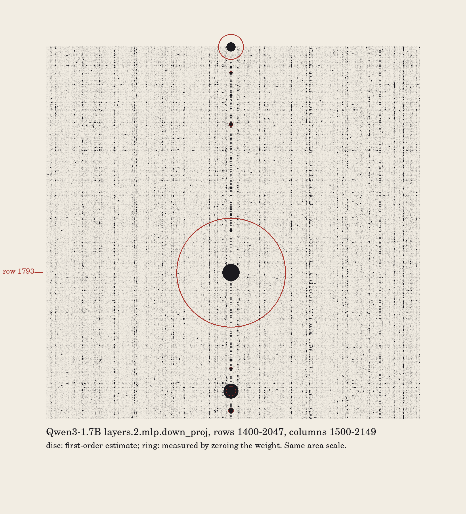
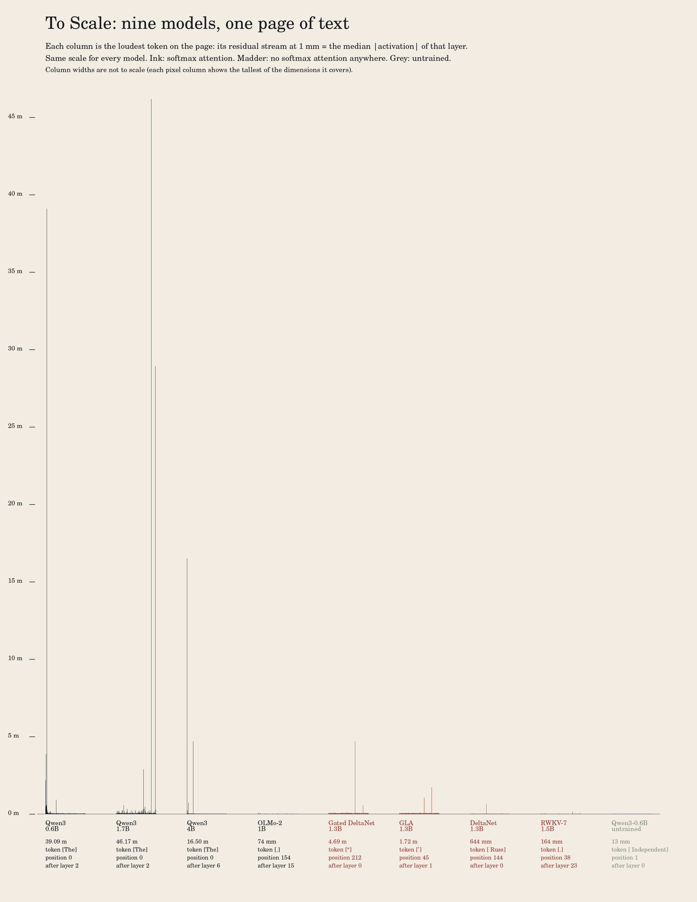

# To Scale: massive activations and the super weight

*If the median activation in Qwen3-0.6B's residual stream were drawn 1 mm tall, the first token's dimension 35 would be 39 metres tall.*

<video src="gallery/banner_film.mp4" autoplay loop muted playsinline width="360"></video>

 

## The phenomena

- **Massive activations** (Sun et al., 2024). A few residual-stream dimensions, at a few tokens, reach values thousands of times the median. They behave like fixed biases, and they are tied to attention sinks.
- **The super weight** (Yu et al., 2024). One scalar in an early `mlp.down_proj` writes the massive activation. Zeroing it wrecks the model.

## What was measured

Text is fineweb-edu: the validation shard in `day3/data`, decoded from GPT-2 ids and re-tokenised by each model. Measurement uses pages 0–15 (up to 512 tokens each, about 8k tokens per model). Held-out perplexity uses pages from index 1000 on.

### 1. Massive activations across nine models

`measure.py` runs one model at a time in bf16. For every decoder layer's output (the residual stream after the block) it records top-1 |h|, the median |h| over all tokens and dims, where the top entries sit, and each token's maximum.

"Massive tokens" are tokens whose largest |h| is at least 1000× the median at the peak layer, over about 8k tokens.

| model | attention | max / median (layer) | same, excluding position 0 | massive tokens | where they sit |
|---|---|---:|---:|---:|---|
| Qwen3-0.6B | softmax | **43,691** (L2) | 61 | 16 | position 0 of all 16 pages, whatever the word; dim 35 |
| Qwen3-1.7B | softmax | **54,117** (L2) | 69 | 16 | position 0 only; dim 1793 |
| Qwen3-4B | softmax | **38,346** (L6) | 107 | 16 | position 0 only; dim 4 |
| OLMo-2-0425-1B | softmax | 158 (L15) | 158 | 0 | none |
| Gated DeltaNet 1.3B | none (linear) | **4,855** (L0) | 4,855 | 49 | apostrophes and quote marks (’ “ .” ,”); not the BOS token; dim 1363 |
| GLA 1.3B | none (linear) | **3,495** (L1) | 3,495 | 52 | the BOS `<s>` on all 16 pages, plus apostrophes and quotes; dim 1653 |
| DeltaNet 1.3B | none (linear) | 733 (L0) | 733 | 0 | none |
| RWKV-7 1.5B (Pile) | none (recurrent) | 208 (L23) | 206 | 0 | none |
| **Null:** Qwen3-0.6B, random init | softmax, untrained | **15** | 13 | 0 | none |

- **Attention sinks.** `attn_sink.py` measures the mean attention from queries at positions ≥ 32 to key 0.
  - Qwen3-0.6B: 0.00 / 0.00 / 0.01 in layers 0–2, then **0.66** at layer 3, right after the massive activation appears at layer 2. It stays at 0.31–0.78 through layer 27.
  - OLMo-2-1B: 0.0004–0.016 in every layer, roughly uniform attention. It has no massive activation and no first-token sink.
- **Verdict on the cross-architecture question.** This is real, and more interesting than yes or no.
  - Massive activations are **not exclusive to softmax attention**. GLA and Gated DeltaNet contain no softmax attention anywhere, and they grow 3,500–4,900× outliers.
  - GLA even puts them on its BOS token, as a transformer does.
  - Softmax attention **does not guarantee** them either: OLMo-2-1B has neither the outlier nor the sink.
  - The linear models differ in *where* the outliers sit. Theirs are written already by layer 0–1 and sit on punctuation. The Qwen models put theirs at position 0 at layer 2 (layer 6 in the 4B).
  - Two linear/recurrent models (DeltaNet, RWKV-7) have none. The fla models were trained on 100B tokens of SlimPajama; RWKV-7 on the Pile. Treat this as four models, not a law.
- **Check that the loaders are right.** Mean next-token NLL on the 16 pages is 2.41–3.08 nats for every trained model, against 12.1 for the untrained null.
  - The Gated DeltaNet checkpoint uses an older fla format. I split its fused `gate_proj` by hand, and its 2.55 NLL confirms the split is right.
- The GLA and Gated DeltaNet embeddings are not large (max |E| 0.38 and 1.1). The outliers are produced by the layer-0 block.

### 2. The super weight (Yu et al.'s recipe), with null controls

`superweight.py`, fp32.

**Locating it.** Find the first `down_proj` whose output spikes (more than 50× the median over layers). Row = the spiking output dim. Column = the input channel with the largest |input|. Then decompose the spike into per-weight contributions W[row, c]·x_c.

**Qwen3-1.7B: a textbook super weight.**
- `layers.2.mlp.down_proj.weight[1793, 1821]` = −0.820. It is the largest-magnitude weight in the 12.6M-weight matrix.
- It writes **99.8%** of the 11,808 massive activation (x₁₈₂₁ = −14,361).
- Held-out perplexity (16 pages): **16.59 → 109.6** when it is zeroed.
- Zeroing it but putting the single super activation back restores the model: **11.41 vs 11.41 baseline** (2 pages).
- **Null** (2 pages, baseline 11.410). No other weight lies within 10% of its magnitude, so the band widened to ±75%: |w| 0.21–0.52, a pool of 656. Zeroing 100 random weights from that pool one at a time gives 11.408–11.412. Zeroing all 100 together gives 11.411.
- Greedy text:

  | model | "My favourite condiment is" … |
  |---|---|
  | intact | "…ketchup. I like it because it's sweet and it's easy to use." |
  | super weight zeroed | "…the one that is the most plentiful. 20000000000000000000" |

**Qwen3-0.6B: no single super weight, a committee of six.**
- The recipe points to [35, 55], but that weight writes only 33% of the 6,541 activation.
- Six weights in row 35 write 99.9% of it:
  - columns 55, 128, 1489, 321, 46, 646;
  - |w| = 0.570–0.582. These are the six largest weights in the matrix, tied to within bf16 rounding.
- Held-out perplexity (16 pages, baseline 21.73):
  - zeroing any one: 21.9–22.6;
  - zeroing the top 3: 42.6;
  - zeroing all six: **1,562**.
- All 64 subsets were measured (`committee.png`). The loss depends on how much of the activation is gone:
  - removing 50% costs +0.16 nats;
  - removing 78% costs +0.67;
  - removing 90% costs +2.6;
  - removing all of it costs +4.28.
- Restoring the super activation with [35, 55] zeroed brings perplexity back to baseline (21.74).
- **Null** (4 pages, baseline 17.429; |w| 0.146–0.381, pool of 316): 100 random same-band weights give 17.420–17.435 one at a time and 17.429 all together.
- The largest-|w| weight other than the candidate is [35, 46], itself one of the six: 21.94.

**The fragility map and its calibration.**
- For every weight of the super-weight matrix, the map shows the first-order |w·∂L/∂w|. The gradient comes from 4 pages (0.6B) or 2 pages (1.7B).
- To calibrate it, I zeroed individual weights and measured the exact change: the top 50/30 by first-order score and 50/30 uniformly random ones (`fragility_calibration.png`).
- **Random weights:** first order is essentially exact from 10⁻⁶ to 10⁻⁴ nats.
- **The top weights:** it is right to within about 3×.
- **The 1.7B super weight:** first order is **blind**.
  - It predicts 0.059 nats, but the measured cost is **2.42 nats**, 41× more.
  - By first order it is only 1.35× the runner-up [1999, 1821], whose real cost is 0.017.
- So the map is drawn as two layers, and the image says which is which:
  - an ink field of first-order discs (estimated);
  - madder rings at the weights that were really ablated (measured), on the same area scale.

In Qwen3-0.6B the six are the most fragile weights by both measures, but they are not alone. 18 weights exceed 10% of the maximum first-order score and 261 exceed 1%. They line up along the six input columns that carry the huge channels (55, 128, 1489, 321, 46, 646), not just along row 35. The images show that instead of a single point.

## Images

All are ink on cream: light key, with commitment of 0.36–0.38 on the fields.

- **`banner_print_1px_per_mm.png`** (1,424 × 40,492 px). The print file at the true ratio.
  - It shows Qwen3-0.6B's first token "The" after layer 2: 1,024 bars, 1 px = the layer's median |h| = 0.167.
  - Dim 35 is 6,528 = 39,092 px. Dim 13 is 3,880 px, dim 1 is 2,180 px, and the token's own median bar is 10.7 px.
  - **Physical size.** Printed at 1 mm per pixel it is a banner **1.02 m wide with a 39.1 m bar**, a 12–13-storey building (1.42 × 40.5 m with margins). Printed at the house rate of 8,600 px/m it is **16.6 cm × 4.71 m**, which just fits a tall ceiling with the bar alone at 4.55 m. At that rate the median bar is 0.116 mm, one acuity cell at 40 cm.
  - Over all 16 pages the ratio reaches 43,691 (43.7 m). Qwen3-1.7B reaches 54,117 (54 m).
- **`banner_film.mp4`** (1080 × 1920, 20.5 s, for the feed).
  - It opens with all 1,024 bars across the frame, with three running off the top. The camera then pulls back, exponentially, with cosine easing, until the whole 39 m bar is in frame and the grass has shrunk below a pixel.
  - A ruler on the right relabels itself (cm, then m).
  - `banner_film_first.png` and `banner_film_last.png` are its end frames.
- **`typology.png`**. Nine models, one page, the same scale: each column is that page's loudest token.
  - Three Qwen towers stand 16–46 m tall. The linear models' spikes are 0.6–4.7 m. OLMo-2, RWKV-7 and the untrained null are grass: 74, 164 and 13 mm.
- **`superweight_field_1.7b.png`** (all 12,582,912 weights of Qwen3-1.7B `layers.2.mlp.down_proj`) and **`superweight_detail_1.7b.png`** (rows 1400–2047, columns 1500–2149).
  - The field is quiet dust. One column (1821, the huge input channel) is beaded.
  - One madder ring, the measured cost of the super weight, dwarfs everything, including its own first-order disc.
- **`committee.png`**. All 64 ablations of the six weights in Qwen3-0.6B.
  - x = massive activation removed (measured), y = number removed, hairlines = the 6-cube, disc area ∝ loss rise.
  - The cliff sits at the right.
- **`fragility_field.png`** / **`fragility_detail.png`**. The Qwen3-0.6B map: six beaded threads, with the largest pearls on row 35.
- `fragility_calibration.png` (specimen plot) and `banner_folded.png` (the 39 m banner cut into 3 m lengths side by side). The folded view is too faint at screen size; it is kept as a study only.
- `contact_sheet.png` shows the best eight.

### Declared aesthetic choices

- **Banner.**
  - Bar height is |h|/median exactly, anti-aliased at the top pixel, never clipped or compressed.
  - Bar pitch is 1 mm with no gaps; width is not a measured quantity.
  - The unit is the median over all tokens and dims *of that layer*. Layer 2 was chosen because the ratio is largest there and that is where the activation is born. By layer 26 the median has grown 35× and the ratio falls to 1,210.
- **Film.**
  - Bars are floored at 2 px wide so a 1 mm bar stays visible from far away. Heights are untouched.
  - The zoom is exponential with cosine easing, and the tallest bar drifts to the centre.
- **Typology.**
  - Widths are not to scale: every model gets a 150 px column and each pixel column shows the tallest dimension it covers.
  - Colour marks family: ink = softmax, madder = no softmax, grey = untrained.
- **Fragility maps.**
  - Disc *area* ∝ score (linear, no log, no equalisation).
  - The 0.6B field sets the largest first-order disc to 48 px. The 1.7B field sets the largest *exact* ring to 190 px, and first-order discs share that scale.
  - Sub-cell discs become fractional cell coverage.
  - Rings under 3 px radius are omitted.
  - The row mark in the margin is an annotation.
- **Committee.** The y axis (count removed) and the hairlines are structure, not data.

## Prior art (searched 2026-09-26)

- **The science.**
  - Sun et al. 2024 (COLM) and their repository plot massive activations as 3-D bar charts per layer.
  - Yu et al. 2024 ("The Super Weight in LLMs") list super weights for Llama, Mistral and OLMo.
  - "Super Weights in LLMs and the Failure of Selective Training" (arXiv 2607.08733) and a Qwen3 detection recipe exist.
  - I found no report that Qwen3-0.6B spreads its massive activation over a committee of six weights while Qwen3-1.7B uses one. I also found no report that first-order saliency misses the super weight by 41× (Yu et al. locate it from activations, not gradients).
- **Linear attention.** "Massive Activations in Hybrid Linear Attention LLMs" (arXiv 2608.12149) studies RetNet/HGRN/GLA/DeltaNet/GDN *hybrids*, where the spikes sit before full-attention layers. Its abstract does not cover pure linear models. "A Circuit, Not The Circuit: … the Mamba-2 State Sink" (arXiv 2606.00930) is related. The pure-linear results above (GLA and GDN yes, DeltaNet and RWKV-7 no, OLMo-2 no despite softmax) look new, but this is a four-model sample.
- **Art.** I found no work that draws an activation at true physical scale. The film borrows the grammar of the Eameses' *Powers of Ten* (1977). The banner's closest kin is a to-scale solar-system model.

## Compute

29 pasar jobs (ids 828–856), `--by art-toscale`, tag `art-to-scale`, all shared-memory slices.
- Total job wall-time was **111.8 min**, inside the 2-hour budget. That includes a slow super-weight run (829) that I cancelled after 18 min and replaced with a leaner one, plus about 5 min of failed jobs:
  - driver OOM at context creation;
  - DeltaNet's fp32 kernel refusing to run;
  - OLMo-2 correctly reporting "no spike".
- Rendering was CPU only, about 5 min. Code runs from the root `.venv` (which has `fla` 0.5.2 and transformers 5.17); `pasar_job` is imported from `art/.venv`.

```
python measure.py --model Qwen/Qwen3-0.6B            # likewise for the other 7 models, and --random_init
python superweight.py --quick --tag q-qwen3-0.6b     # locate, contributions, 64 subsets (16 held-out pages)
python superweight.py --n_cal 4 --n_held 4 --subsets 0                       # 0.6B nulls + fragility map
python superweight.py --model Qwen/Qwen3-1.7B --tag qwen3-1.7b --n_cal 2 --n_held 2 --n_top 30 --n_rand 30 --subsets 0
python attn_sink.py --model Qwen/Qwen3-0.6B ; python attn_sink.py --model allenai/OLMo-2-0425-1B
python summarize.py; python render_banner.py; python render_typology.py; python render_committee.py
python render_fragility.py; python render_fragility.py 1.7b; python contact_sheet.py
```

## Caveats

- Held-out perplexities for the lean runs use 2–4 pages. Treat them as within-run comparisons. The 16-page numbers are the ones to quote.
- Qwen and OLMo tokenizers add no BOS token. The fla models add `<s>`. Qwen's massive activation sits on whatever word comes first, so it is positional, not lexical.
- For GLA and Gated DeltaNet no single super weight is possible at layer 0. The largest input to the spiking down_proj (106 and 21) times the largest weight in the row (0.91 and 1.46) is at most 6% of the spike, so it is written collectively.

## Next moves

1. **Print the 4.71 m strip** at 8,600 px/m and hang it floor to ceiling. It is the one object here that needs to be seen physically.
2. **Committee vs single weight across the Qwen3 family.** 4B/8B/14B are cached, and each is one short job. Does the committee appear only in the smallest model? That is the most promising scientific follow-up.
3. **The attention-sink ↔ massive-activation link in GLA.** GLA has a BOS outlier but no softmax, so what reads it? Measure GLA's gate and state-decay response at the BOS position.
