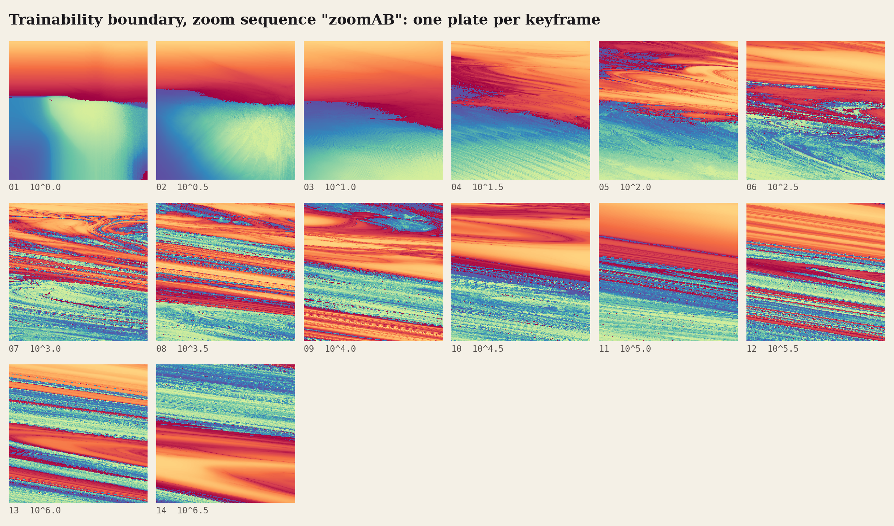
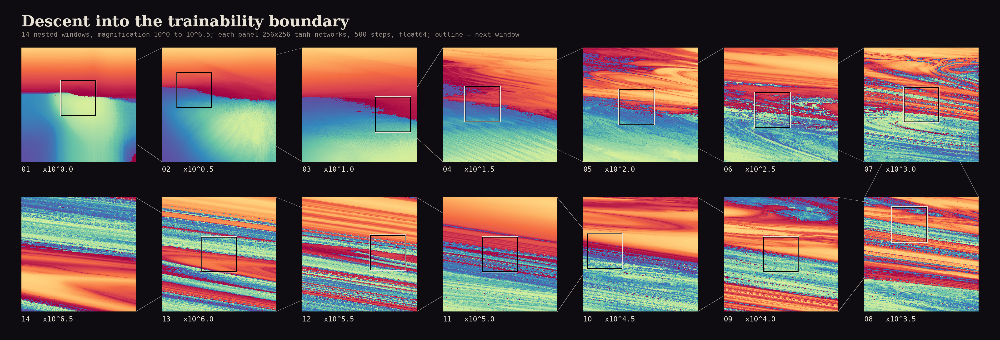
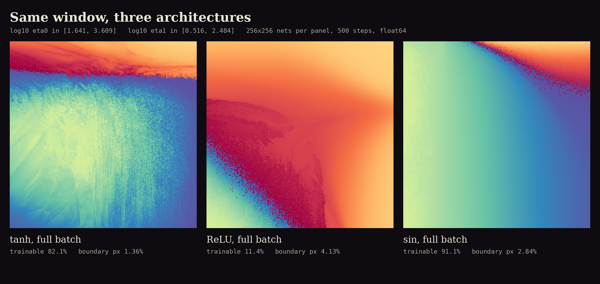
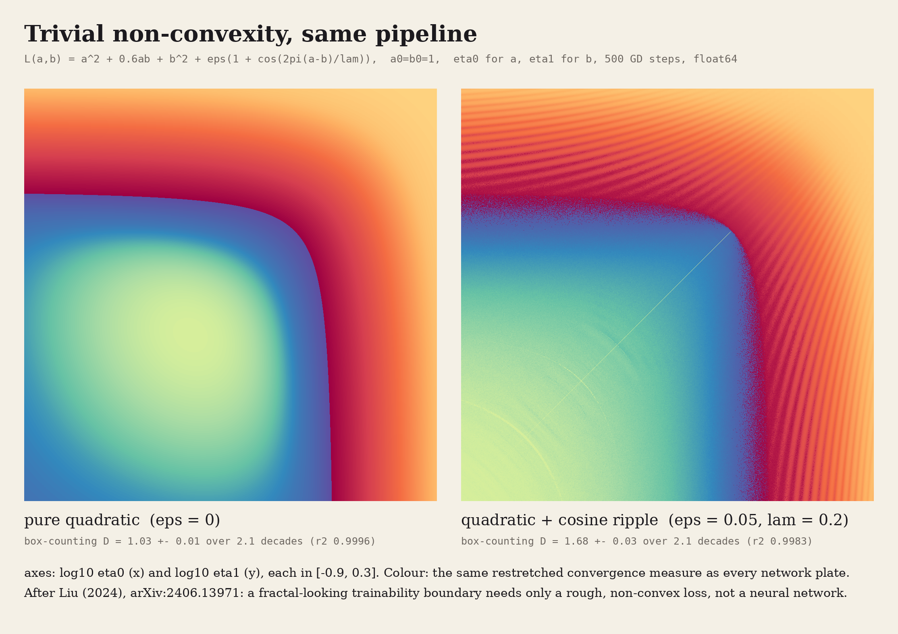
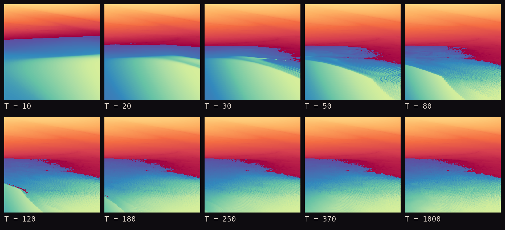
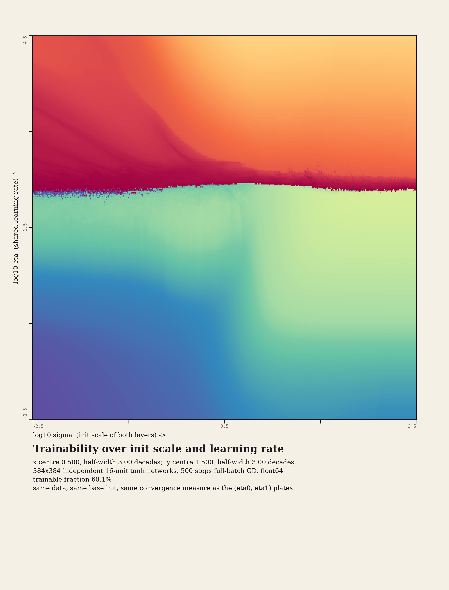
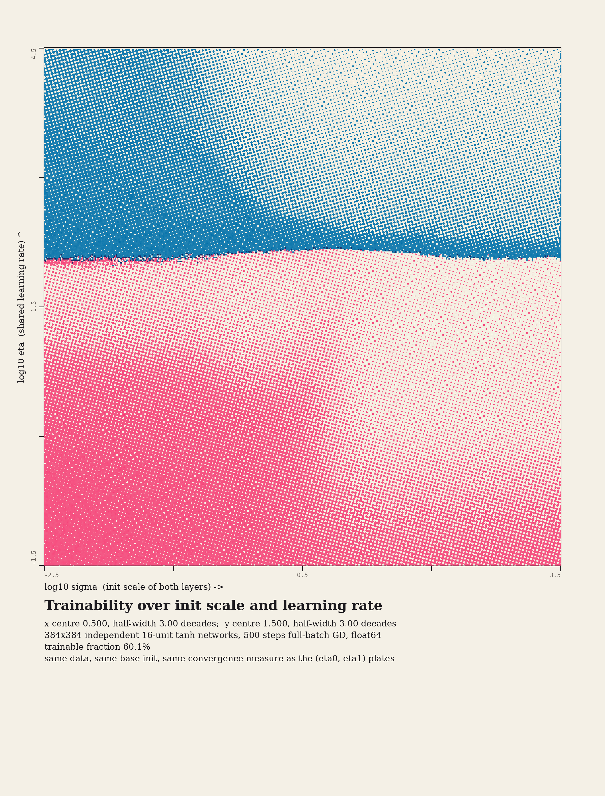
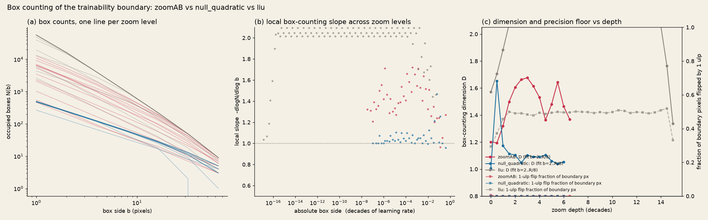
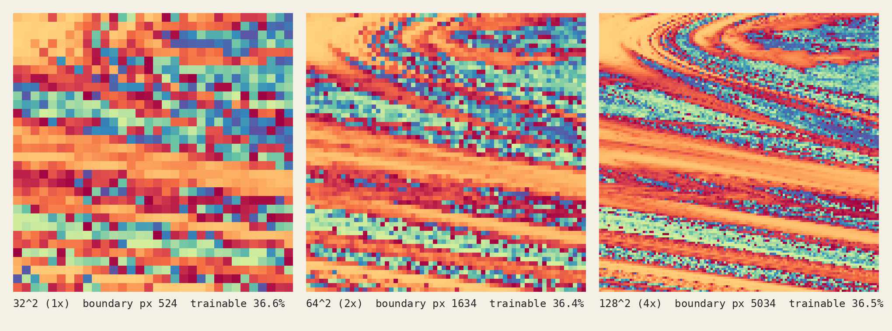

# Trainability: the fractal edge of gradient descent

*Every pixel is a separate neural network trained for 500 steps. Colour says whether it learned, and how quickly. The line between learning and blowing up is jagged at every scale we could afford to look at.*

<!-- HERO -->

## The phenomenon

Sohl-Dickstein (2024) pointed out that neural-network training has the same structure as a Mandelbrot iteration. You apply one map over and over, here a gradient-descent step, and ask whether the result stays bounded. Fix everything about a tiny network except two hyperparameters and colour a grid of them by the outcome. The boundary between *trains* and *diverges* is then intricate, and he measured it to be fractal over more than ten decades.

The setup reimplemented here is his (github.com/Sohl-Dickstein/fractal, read directly; declared differences are listed below):

$$\hat y(x) = \tfrac{1}{n}\, W_1\, \phi\!\Big(\tfrac{1}{\sqrt n} W_0 x\Big),\qquad \phi(z)=\tanh(\sqrt2\, z)\ \text{ or }\ \sqrt2\,\mathrm{relu}(z),\qquad n=16$$

$$\mathcal L = \tfrac1N\sum_i (\hat y(x_i)-y_i)^2,\qquad W_0 \leftarrow W_0-\eta_0\,\nabla_{W_0}\mathcal L,\quad W_1 \leftarrow W_1-\eta_1\,\nabla_{W_1}\mathcal L$$

There are no biases. $W_0\in\mathbb R^{16\times16}$ and $W_1\in\mathbb R^{1\times16}$ start from $\mathcal N(0,1)$. The dataset has $N = 272$ points, equal to the parameter count, with $x,y\sim\mathcal N(0,1)$. Init and data are shared by every pixel. The two image axes are $\log_{10}\eta_0$ (input layer) and $\log_{10}\eta_1$ (output layer).

**Convergence criterion and colour (his `convergence_measure`, replicated exactly).** Let $v_t = \min(\ell_t/\ell_0,\ 10^6)$, with non-finite losses set to $10^6$ before normalising. A run *converged* if $\operatorname{mean}(v_{T-20..T}) < 1$. The pixel value is $-\sum_t v_t$ if it converged and $+\sum_t 1/v_t$ if it diverged. Small magnitude means fast convergence or fast divergence, and large magnitude means the run sat near the edge for a long time.

**Colouring (his `cdf_img`, replicated exactly).** Each sign is rank-normalised separately: converged values map into $[-1,-0.25]$ and diverged values into $[0.25,1]$, the sign is kept, the result is negated, and it is shown through matplotlib `Spectral` with nearest-neighbour pixels. Converged runs go from pale yellow-green (fast) to deep purple (slow). Diverged runs go from pale orange (fast) to deep red (slow). The two dark ends meet at the boundary. This colour mapping is a declared aesthetic choice; the sign and the rank of the measure are the data.


## Gallery

### 1. Deep zoom, one plate per half-decade



The sequence runs from the $(\eta_0,\eta_1)\in[10^{-3},10^{6}]^2$ overview (plate 1) to a window of half-width $4.5\times10^{-6}$ decades at magnification $10^{6.5}\approx3\times10^{6}$ (plate 14). Every window lies inside the previous one and is centred on a boundary pixel of it. Each plate is 256² float64 networks. Full-page plates, each with its coordinates, 1-ulp flip fraction and a locator inset: [Spectral](gallery/plates_zoomAB_spectral/), [two-ink riso](gallery/plates_zoomAB_riso/), [plotter isolines](gallery/plates_zoomAB_isolines/) ([sheet](gallery/zoom_zoomAB_isolines_contact_sheet.png)), and [aurora/ember split palette](gallery/plates_zoomAB_aurora_ember/) ([sheet](gallery/zoom_zoomAB_aurora_ember_contact_sheet.png)). The isolines are contours of the within-phase speed rank, pre-smoothed with a Gaussian of σ = 0.8 px (aesthetic), drawn in ink on the converged side and red on the diverged side. The heavier line is the converge/diverge boundary. In the riso style, converged runs print in pink and diverged runs in blue, with halftone density set by the within-phase speed rank. Screens, inks and misregistration are aesthetic.

<video src="gallery/zoom_zoomAB_spectral.mp4" autoplay loop muted playsinline width="70%"></video>

**Zoom film** ([MP4](gallery/zoom_zoomAB_spectral.mp4), 1080², 54 s, [GIF](gallery/zoom_zoomAB_spectral.gif)). The camera zooms exponentially through the 14 keyframes, 4 s per half-decade, about the fixed point of each window-to-window similarity map. Colour uses his interpolation: every layer is rank-normalised against both neighbouring keyframes, the two are blended, and then the colour map is applied. Nearest-neighbour sampling is used throughout, so no value is invented between networks. Near the end of each transition the outer ring shows the previous keyframe's 256² pixels as coarse blocks. You can also see the texture change at the edge of the inset window when a finer keyframe takes over; this is the unresolved pixel-level texture described under "Resolution check", not a rendering bug. Camera path, timing and the blend are aesthetic.



**Descent poster.** The same 14 keyframes in snake order on a dark ground. Each panel carries the outline of the next window (boxes drawn at least 14 px wide), and the connectors are the classic zoom-figure lines. Variant: [aurora/ember split palette](gallery/descent_zoomAB_aurora_ember.png).

### 2. Same window, three architectures



The window is $\log_{10}\eta_0\in[1.64, 3.61]$, $\log_{10}\eta_1\in[0.52, 2.48]$, with 256² networks per panel, 500 steps, float64 and identical data and init. The activation changes: $\tanh(\sqrt2 z)$, $\sqrt2\,\mathrm{relu}(z)$, and $\sin(\sqrt2 z)$, which is smooth but non-monotone. The trainable fraction is 82% / 11% / 91%. Only tanh has its boundary at the top of the frame. ReLU's boundary is a wide diagonal band of dust, and sin's is a thin arc. Colour is Spectral (primary); variants: [magma](gallery/diptych_B_magma.png), [three-ink overprint of the boundaries alone](gallery/diptych_B_overprint.png).

### 3. The deflationary companion: no neural network at all



The same pipeline, colour map and edge detector are applied to a two-parameter loss $L(a,b)=a^2+0.6ab+b^2+\epsilon(1+\cos(2\pi(a-b)/\lambda))$, with learning rate $\eta_0$ on $a$ and $\eta_1$ on $b$. Left: $\epsilon=0$, a pure quadratic, gives box-counting $D=1.03\pm0.01$. Right: $\epsilon=0.05,\ \lambda=0.2$ gives $D=1.68\pm0.03$ (1024²) and $1.77\pm0.01$ (2048²). The 2048² native render is at [print](gallery/hero_liu_ripple_2048_spectral_print.png) / [labelled](gallery/hero_liu_ripple_2048_spectral_labelled.png) / [magma diptych](gallery/deflation_liu_diptych_magma.png) / [line-only](gallery/deflation_liu_2048_line.png).

### 4. Training time as the animation axis

<video src="gallery/steps_steps_zoomA2_384_spectral.mp4" autoplay loop muted playsinline width="60%"></video>



One 384² run of 1000 steps over the window $\log_{10}\eta_0\in[0.41,1.31]$, $\log_{10}\eta_1\in[1.93,2.83]$ (the $10^{1}$ zoom plate). His measure is re-evaluated at T = 10, 20, …, 1000 from the same trajectories: converged if the mean of the last 20 normalised losses before T is below 1, and $\sum_{t\le T}$ normalised by T. Each frame is rank-normalised on its own (aesthetic, declared), so colour shows within-frame speed and is not comparable between frames. The boundary is measured. At T = 10 it is an almost straight line (box-counting $D=1.05$). It then frays: $D$ = 1.27 at T = 30, 1.37 at 100, 1.42 at 250, and 1.41 at 500 and 1000. The trainable fraction settles at the same time (64.8 % → 49.3 % at T = 100 → 48.9 % at T = 1000). So in this window the rough edge is an effect of long iteration, and it has stopped changing well before the 500 steps used everywhere else. [GIF](gallery/steps_steps_zoomA2_384_spectral.gif).

### 5. Semantic axes: initial scale × learning rate

 

Here both layers share one learning rate η (vertical) and both weight matrices are scaled at init by σ (horizontal), over six decades each, with 384² float64 networks. The trainability edge sits at $\eta\approx10^{2.0}$–$10^{2.2}$ across all six decades of σ: the learning rate decides trainability almost alone. The edge is ragged at small σ and smoother at large σ; box counting gives $D=1.21\pm0.05$ over the whole plate (b = 2–32 px). The trainable fraction is 60.1 %. Variants: [magma](gallery/sem_sigma_lr_384_magma.png), [boundary line only](gallery/sem_sigma_lr_384_line.png).
<!-- SEM-WD -->

## What was computed

| piece | grid | steps | precision | wall time (shared GB10) |
|---|---|---|---|---|
| zoom keyframes (tanh, full batch) | 256² each, 14 keyframes | 500 | float64 | 5–38 min each (29–200 px/s under contention) |
| overview hero | 1024² | 500 | **float32** (see verification) | <!-- HEROT --> |
| architecture diptych | 3 × 256² | 500 | float64 | ~5 min each |
| quadratic null zoom | 13 × 256² | 500 | float64 | ~90 s each |
| Liu-type toy | 1024², 2048², zoom 31 × 256² | 500 | float64 (CPU) | 50–180 s |
| probes, 1-ulp floor blocks, resolution check | 64²–128² | 500 | float64 / float32 | minutes |

**Engine** (`tfractal.py`). Each pixel is an independent network stored as rows of a batched tensor $(P,16,16)$ + $(P,16,1)$. Forward and backward passes are written by hand (checked against autograd to $4\times10^{-16}$) in an $(N, P\cdot n)$ layout, so the two large matrix products are single GEMMs. The step is `torch.compile`d, chunked at 32 768 networks to stay under a 10 % memory fraction, and run through `gpu_run.sh`. One approximation is used: **early exit**. A pixel whose loss becomes non-finite or exceeds $10^{100}$ is frozen at its clamped $v$ for the remaining steps. On a 128² overview this gave 0 label flips and a maximum relative change of the measure of $1.4\times10^{-5}$ against the exact loop, and 0 flips on 1600 pixels of the high-$\eta_0$ region.

**Declared differences from his colab.** RNG: torch Generator seed 0 instead of JAX PRNGKey, so this is a different draw of init and data and not his exact picture. Width 16 (the paper value; the colab default is 8). 500 steps. Zoom targets are picked automatically (below) instead of by mouse.

**Automatic zoom targets** (`zoom_compute.py`, `choose_next`). The next window is centred on a **boundary pixel** of the current keyframe, chosen as the pixel with the highest *mixing* score. Mixing is $\min(f,1-f)$, where $f$ is the converged fraction in a box of the next window's size. It is multiplied by *coherence*, the fraction of the box's edge pixels that survive removal of connected components under 6 px, and by a mild centre preference. Two earlier choosers failed and are recorded in "What didn't work".

**Reproduce** (from this directory):
```
../_shared/gpu_run.sh ../.venv/bin/python zoom_compute.py --tag zoomA --res 256 --dec 0.5 --depth 2.5
../_shared/gpu_run.sh ../.venv/bin/python zoom_compute.py --tag zoomB --res 256 --dec 1.0 --depth 3 \
    --c0 1.0748861791423199 --c1 2.2984270722598947 --hw 0.0014230249470757708
../_shared/gpu_run.sh ../.venv/bin/python window_compute.py --name hero_overview_tanh_1024_f32 --res 1024 --dtype float32
for NL in tanh relu sin; do ../_shared/gpu_run.sh ../.venv/bin/python window_compute.py --name dip_B_$NL --nonlin $NL --res 256 --c0 2.625 --c1 1.5 --hw 0.984; done
../_shared/gpu_run.sh ../.venv/bin/python zoom_compute.py --tag null_quadratic --nonlin quadratic --res 256 --dec 0.5 --depth 6
OMP_NUM_THREADS=4 ../.venv/bin/python liu_toy.py --name liu_eps05_1024 --res 1024 --eps 0.05 --lam 0.2   # and --eps 0, --res 2048
OMP_NUM_THREADS=4 ../.venv/bin/python zoom_compute.py --tag liu --nonlin liu --device cpu --res 256 --dec 0.5 --depth 15 --c0 -0.3 --c1 -0.3 --hw 0.6
python merge_zoom.py; python render_zoom.py zoomAB --plates --video; python render_hero.py hero_overview_tanh_1024_f32 overview_tanh
python render_windows.py diptych B; python render_windows.py liu; python verify.py zoomAB null_quadratic liu
```
Sanity tests: `test_core.py` (gradients, early exit, checkpoints) and `test_early_exit_speckle.py`.

## Verification / honesty



**Did it appear?** Yes. Moving down the zoom, the boundary goes from an almost straight seam (overview) to interleaved filaments of converged and diverged runs. Box-counting on his sign-change edge set, fitted over box sizes 2–32 px of each 256² keyframe (1.2 decades per image, $r^2\ge0.992$), gives:

<!-- DTABLE:start (python readme_tables.py) -->
| plate | magnification | trainable | boundary px | D (network), b=2..32 px | 1-ulp flips (boundary px) | D (quadratic null, same magnification) |
|---|---|---|---|---|---|---|
| 1 | 10^0.0 | 58% | 0.7% | 1.20 ± 0.02 | 0.6% | 1.01 |
| 2 | 10^0.5 | 59% | 0.8% | 1.19 ± 0.04 | 0.0% | 1.65 |
| 3 | 10^1.0 | 49% | 1.6% | 1.32 ± 0.04 | 0.0% | 1.17 |
| 4 | 10^1.5 | 49% | 3.2% | 1.50 ± 0.01 | 0.0% | 1.11 |
| 5 | 10^2.0 | 51% | 8.3% | 1.61 ± 0.03 | 0.0% | 1.10 |
| 6 | 10^2.5 | 49% | 10.9% | 1.66 ± 0.03 | 0.0% | 1.05 |
| 7 | 10^3.0 | 55% | 19.6% | 1.68 ± 0.07 | 0.0% | 1.10 |
| 8 | 10^3.5 | 46% | 16.7% | 1.61 ± 0.07 | 0.0% | 1.09 |
| 9 | 10^4.0 | 42% | 10.2% | 1.53 ± 0.07 | 0.2% | 1.09 |
| 10 | 10^4.5 | 48% | 5.3% | 1.36 ± 0.04 | 0.0% | 1.10 |
| 11 | 10^5.0 | 49% | 9.8% | 1.48 ± 0.02 | 0.1% | 1.06 |
| 12 | 10^5.5 | 45% | 14.1% | 1.64 ± 0.07 | 0.0% | 1.04 |
| 13 | 10^6.0 | 51% | 9.9% | 1.46 ± 0.08 | 0.0% | 1.05 |
| 14 | 10^6.5 | 50% | 3.6% | 1.37 ± 0.02 | 0.0% | - |
<!-- DTABLE:end -->

In short: from $10^{1.5}$ to $10^{6.5}$ (11 plates) the network boundary has $D$ = 1.36–1.68 (median 1.53). The quadratic null, run through the same pipeline, gives 1.04–1.11 over the same magnifications. $D$ is not constant along the path. It rises and falls with how much boundary each window happens to hold (compare the boundary-pixel column).

**Across decades.** No single image covers more than 1.2 decades of box size. The multi-decade evidence is that the local slope stays well above 1 at every zoom level from $10^{1.5}$ to $10^{6.5}$ (panel b plots the slopes against absolute box size in decades of learning rate). It is not a single straight line over many decades. The estimate also depends on where the window sits: it rises as the window closes in on the boundary, so this is a *local* dimension of the region we zoomed into. Sohl-Dickstein reports 1.66 for tanh full batch (median over ~50 frames); our deep frames are in the same range.

**Null model (quadratic, same pipeline).** The loss $\ell(a,b)$ of $\hat y = Xa/\sqrt n + \phi(XW_0/\sqrt n)\,b/n$ with $W_0$ frozen is exactly quadratic, so GD is linear. Its stability boundary is the algebraic curve $\rho(I-P\,\nabla^2\ell)=1$. Through the identical zoom, chooser, colour and box counter, it stays a smooth curve and then a straight line. $D$ = 1.01 at the overview and 1.04–1.11 at every level from $10^{1}$ to $10^{6}$ (one outlier, 1.65, at $10^{0.5}$, where the window contains a sharp corner and only ~500 edge pixels). The rendering does not manufacture a fractal.

**Precision floor ("seeing").** At every keyframe a 64² block on the boundary is recomputed with both learning rates multiplied by $(1+2^{-52})$, one ulp. The quoted number is the fraction of boundary pixels whose converge/diverge label flips: at most 0.2 % of boundary pixels at every network plate from $10^{0.5}$ to $10^{6.5}$ (exactly 0 on 11 of those 13; 0.2 % at $10^{4}$, 0.1 % at $10^{5}$), and 0.6 % at the overview. For the network, labels are essentially deterministic to one ulp all the way down, so the filaments are resolved structure and not roundoff noise. The learning-rate grid itself stays representable: relative pixel spacing is $2.6\times10^{-8}$ at the deepest plate, far above $2.2\times10^{-16}$, so the float64 floor for this 256² grid would sit around $10^{13}$ magnification. We were limited by GPU time, not precision.

**Resolution check (2×, 4×).** The central 32×32 px of plate 6 ($10^{2.5}$) was recomputed over the identical learning-rate window at 2× (64²) and 4× (128²) density.



The trainable fraction is stable (36.6 %, 36.4 %, 36.5 %), so the phase areas are converged. Boundary-pixel counts go 524 → 1634 → 5034, which scales as $r^{1.63}$ with density $r$. A resolved smooth curve would give $r^{1}$, and pixel-scale noise would give $r^{2}$. The 4× block shows what that exponent means. Some of the texture resolves into coherent swept filaments that were aliased at 1×. Other bands stay salt-and-pepper mixtures of converged and diverged runs even at 4×; box counting on the 128² block alone gives $D=1.94\pm0.10$ over b = 2–32 px. The labels are deterministic (0 flips under a 1-ulp nudge), so these bands are real structure finer than a 4× grid, not roundoff. Only 77–83 % of 1× labels are reproduced by the subsampled 2×/4× grids, which means the pixel-level texture of any single 256² plate is one sampling of an unresolved set. Only its statistics (phase fraction, D) are stable.

**Isolated red specks** (single diverged pixels inside the converged region at $\eta_0\sim10^{5.5}$, visible in early exploration). Recomputing a 64² block at 2× density gave 87 specks against 26 in the same area at 1× (3.3×, against 4× more pixels), and the diverged fraction stayed at 0.55–0.63 %. They are genuine isolated divergent runs, a sparse "dust" that is not resolved at either resolution. They are not a rendering artifact. A 1-ulp nudge flips 6 % of boundary pixels there, against 0 % along the chosen zoom path, so this region is also closer to roundoff sensitivity. Zoom windows were steered away from it.

**The overview hero is float32.** Under GPU contention a float64 1024² run was estimated at 5–6 h. A 256² float32 overview matches float64 on 99.8 % of pixels, with median relative difference of the measure $1.5\times10^{-5}$. **20 % of boundary pixels change label**, so the hero's large-scale geometry is faithful, but its pixel-level edge texture is a float32 realisation. Every zoom plate is float64.

**Liu-type toy: a negative worth stating.** With these parameters ($\epsilon=0.05,\lambda=0.2$, 500 steps) the ripple toy's boundary band is *chaotic at one ulp*. From $10^{1.5}$ down, ~50 % of boundary pixels flip under a 1-ulp nudge and the "dimension" saturates at 2.08, which means the band is space-filling noise. Its $D\approx1.7$ at the overview is therefore partly a roundoff-chaos measurement. The deflationary point still stands (a trivially non-convex loss makes a rough boundary with no network), but in our runs the network's boundary is *more* deterministic under zoom than the toy's.

### What didn't work
- **Chooser v1** (most raw edge boxes) walked into the $\eta_0\sim10^{5.5}$ speck dust. Plates there show converged-speed texture with scattered red pixels and no visible boundary; the reviewer rightly rejected them.
- **Chooser v2** (13×13 grid of candidate windows) could drift off the boundary. It was replaced by the boundary-centred mixing chooser.
- **Throughput.** On a shared GB10, float64 ran at 29–200 px/s. The half-decade sequence was switched to decade steps after $10^{2.5}$ to reach $10^{6.5}$ in the available time. Minibatch-16 and hillshaded relief were built and tested at 128² but not rendered at gallery scale.
- **The first zoom video** alpha-blended RGB keyframes and showed visible rectangles. It was rewritten to use his scheme: blend rank-normalised values against both neighbouring keyframes, then colour map.

## Ideas explored / not pursued
1. **Automatic motif hunt / specimen drawer.** Score windows by coherent-boundary mixing and cluster the motifs. The scorer exists (`choose_next`); the drawer was not rendered because of GPU time.
2. **Hillshaded relief** of signed log speed (`styles.hillshade`). Tested on toys. At 256² it reads as noise-dominated relief, and it needs ≥1024² native keyframes.
3. **Training-step animation**: rendered (section 4). His measure is taken at many T from one run; checkpoint test gives 6e-8 agreement with separate runs.
4. **Semantic axes** (σ × η, λ × η): σ × η rendered at 384² (section 5).
5. **sin activation** included in the diptych. Minibatch-16 toy computed, not included.
6. **Cyclic colour map**: skipped. No quantity here is genuinely cyclic.

## Caveats
- **Fractality may not be a deep-learning fact.** Liu (2024, arXiv:2406.13971) shows that adding or multiplying a cosine ripple to a quadratic produces fractal trainability boundaries once the "roughness" $\epsilon/\lambda^2$ crosses the point where the loss turns non-convex ($\theta_+=1/(2\pi^2)$). A pure quadratic gives a single smooth threshold. The honest caption is therefore *this is what iteration near an instability looks like, and training is iteration near an instability*, not *neural networks are secretly fractal*. Section 3 reproduces the point in 2D.
- **A 2D slice.** Structure in this slice implies structure in the full hyperparameter space. A smooth slice would imply little.
- **Finite steps.** "Converged" means the mean of the last 20 normalised losses is below 1 after 500 steps. Longer training moves the boundary, and some pixels near it are still undecided.
- **One draw of data and init** (seed 0). A different seed gives a different, statistically similar picture.
- **Box counting here is local** (1.2 decades per image) and depends on the window; it is not a global Hausdorff dimension.
- **Colour is aesthetic.** Spectral with rank normalisation is his choice and is reproduced for continuity. Rank normalisation per image means colours are not comparable between plates; only sign and rank within a plate are data.

## References
- J. Sohl-Dickstein, *The boundary of neural network trainability is fractal*, 2024. arXiv:2402.06184. Code: github.com/Sohl-Dickstein/fractal (read for the exact setup, measure, `cdf_img` and zoom interpolation).
- Y. Liu, *Complex fractal trainability boundary can arise from trivial non-convexity*, 2024. arXiv:2406.13971.
- *Mapping the Edge of Chaos: Fractal-Like Boundaries in the Trainability of Decoder-Only Transformer Models*, 2025. arXiv:2501.04286 (cited in the brief; not reproduced).
- H.-O. Peitgen, H. Jürgens, D. Saupe, *Chaos and Fractals*.

Files over 20 MB not committed: none (cache/ is gitignored).

