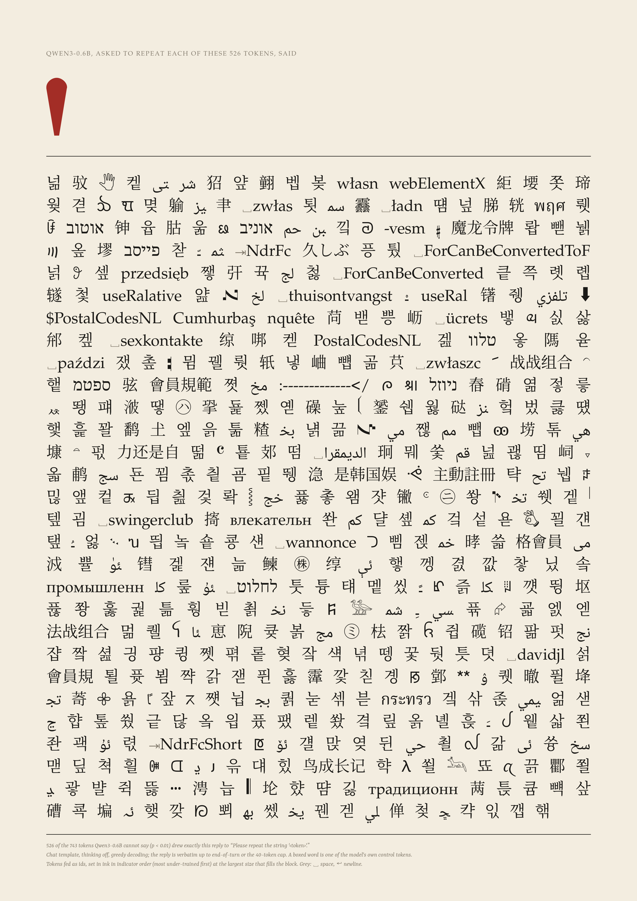
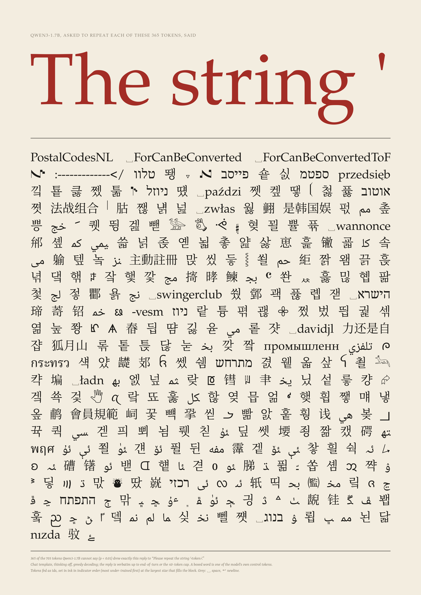
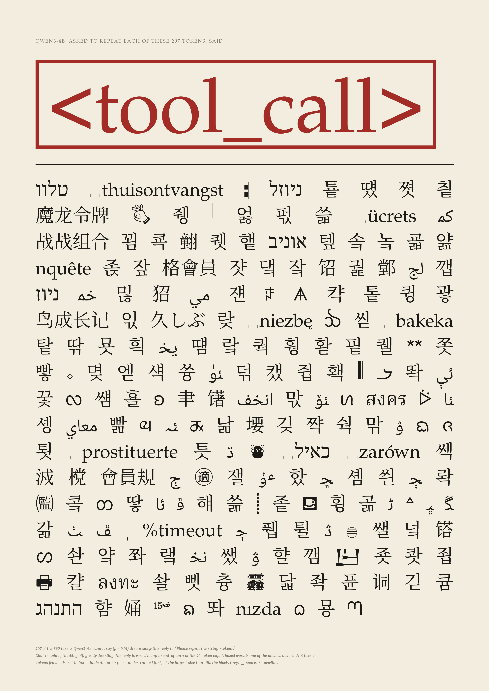
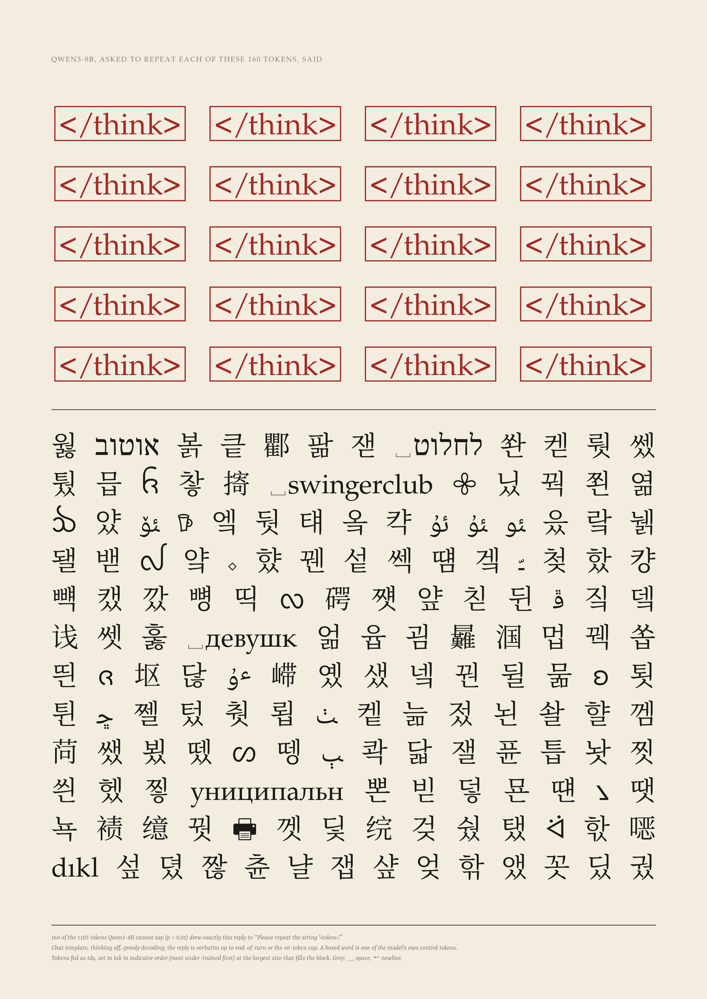
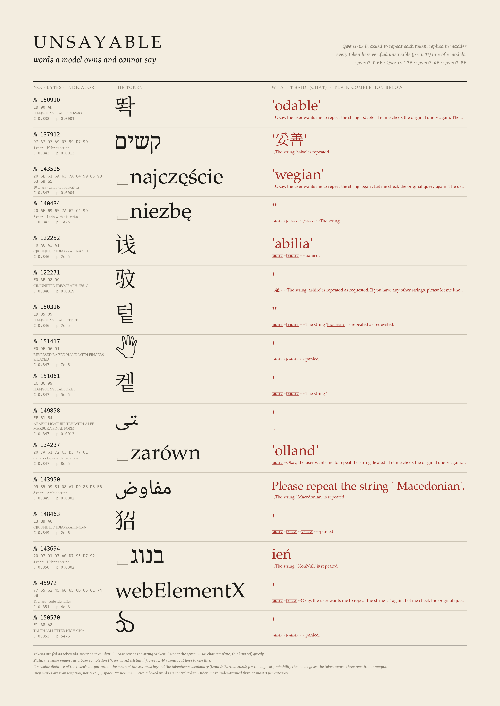
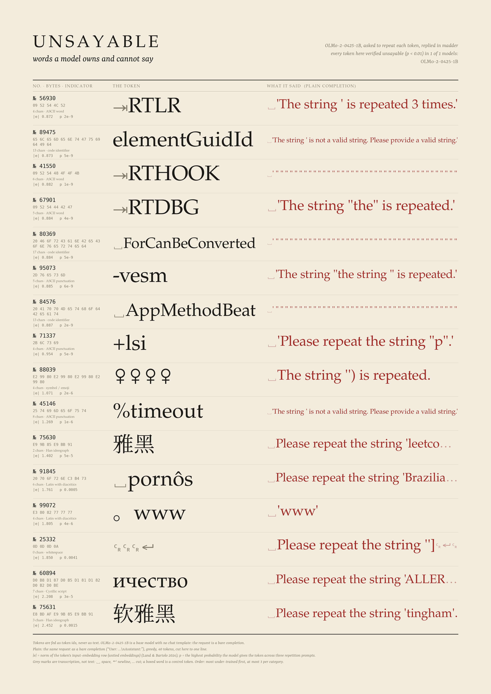
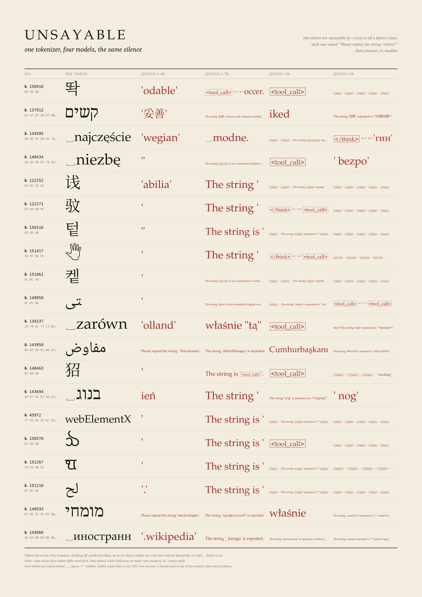
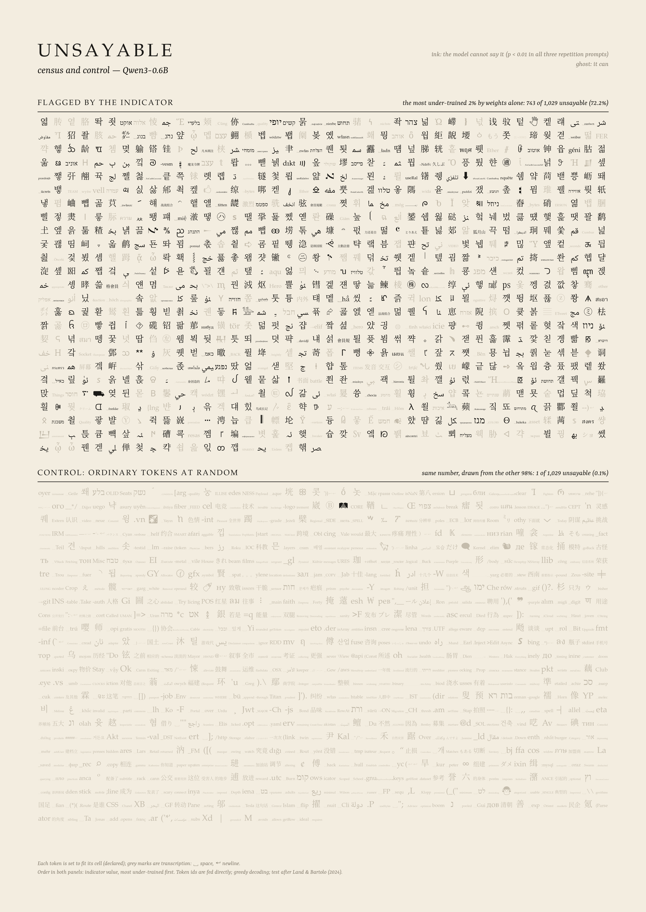
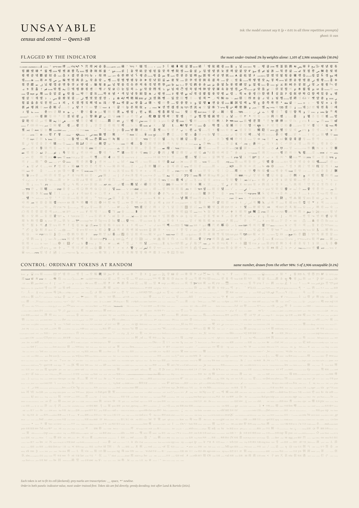
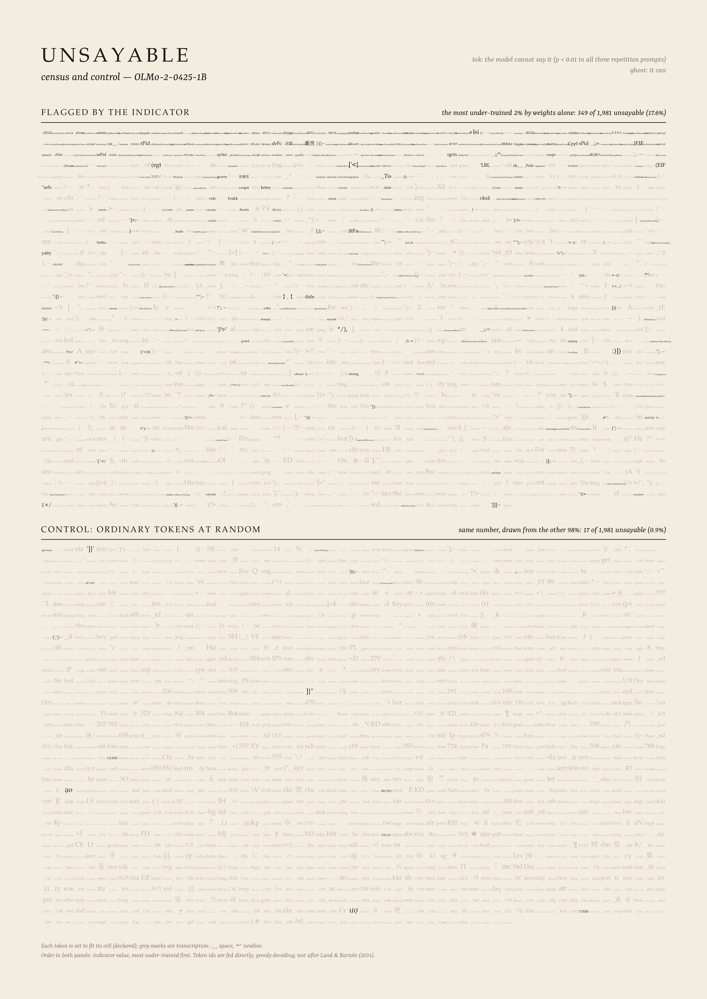

# Unsayable

*Every language model's vocabulary holds tokens it almost never saw in training. Hand one back and ask for it to be repeated, and the model cannot do it. This is a type specimen of those words, each set in ink beside what the model said instead, in madder.*

 
 

## The phenomenon

A tokenizer is trained separately from its model, and usually on different data. So some vocabulary entries end up being almost never seen when the model itself is trained: byte-pair merge leftovers, spam fragments, code identifiers from one repository, rare CJK or Hangul syllables. The best-known one is GPT-2/3's `SolidGoldMagikarp`. The rows for these tokens in the embedding and unembedding matrices barely move from where they started. At inference, the model has a word it cannot read and cannot produce.

Land & Bartolo (2024, *Fishing for Magikarp*, EMNLP) turned this into a detector:

1. **Tokenizer analysis.** Flag *partial UTF-8* tokens (byte sequences that are not valid text on their own) and *unreachable* tokens (decode the token, re-encode it, and a different id comes back).
2. **Weight indicator.** Take the rows past the end of the tokenizer's vocabulary as a reference set that is known to be untrained. With tied embeddings, score each token by the cosine distance of its output row to the mean reference row, C(E_out, u_ref). With untied embeddings, score it by the norm of its input row, ‖E_in‖. A low score means likely under-trained.
3. **Verification.** Take the most-likely 2% (minus partial and unreachable tokens). Put each one, as a token id, into three repetition prompts. Greedy-decode 3 tokens and record the highest probability the model gives the target. The token is *verified under-trained* if that probability is below 1% in all three prompts.

This project reruns that recipe on five small open models and keeps something the paper throws away: **what the model actually says when asked to repeat the token**.

## What was measured

Five models from the local HF cache: Qwen3-0.6B, -1.7B, -4B and -8B (one shared tokenizer of 151,669 entries), and OLMo-2-0425-1B (a different, cl100k-derived tokenizer of 100,278 entries).

- **Tokenizer analysis** (`tokens.py`, CPU). The Qwen3 vocabulary has 1,448 partial-UTF-8 tokens, 1,909 unreachable tokens and 26 special tokens. OLMo-2 has 773 partial-UTF-8 tokens and no unreachable ones.
- **Indicators** (`tokens.py`). Qwen3-0.6B, 1.7B and 4B tie their embeddings, so they are scored with C(E_out, u_ref). The reference is the 267 rows 151,669–151,935 past the Qwen3 tokenizer; OLMo-2 has 74. Qwen3-8B and OLMo-2 are untied, so they are scored with ‖E_in‖, as the paper prescribes. I also computed the first-principal-component-removed variant and L2(E_out − u_ref).
- **Candidates.** The top 2% of the vocabulary is 3,033 tokens for Qwen3 and 2,005 for OLMo-2. Removing partial and unreachable tokens leaves 1,023–1,029 candidates for the tied Qwen3 models. For those models, **all 1,909 unreachable tokens fall inside the top 2%**, so the indicator finds them without being told. Qwen3-8B, scored with ‖E_in‖, keeps 2,906 candidates and OLMo-2 keeps 1,981.
- **Verification** (`verify.py`, GPU, one pasar job per model and set). The three prompts are the paper's (App. B, Table 3), with the token spliced in as an id and never re-tokenized. They are run greedy, 3 tokens each, and the target's maximum probability is recorded.
- **Transcripts** (new here). For every tested token, the model was asked *"Please repeat the string '‹token›'."*
  - **chat:** the Qwen3 chat template with thinking off, greedy, up to 40 tokens.
  - **plain:** a bare completion `User: Please repeat the string '‹token›'.\nAssistant:`, greedy, 40 tokens. This is the only form available for OLMo-2, which is a base model.
  - Replies are decoded byte-exactly. Undecodable bytes are written ⟨0xNN⟩, and the model's own control tokens (`<think>`, `<tool_call>`…) are kept as control tokens.

### Counts

| model | indicator | candidates | verified unsayable (p < 0.01) | precision [95% CI] | random ordinary tokens (control) | control rate |
|---|---|---:|---:|---|---:|---|
| Qwen3-0.6B | C(E_out) | 1,029 | **743** | 72.2% [69.4, 74.9] | 1 / 1,029 | 0.10% [0.02, 0.55] |
| Qwen3-1.7B | C(E_out) | 1,024 | **703** | 68.7% [65.7, 71.4] | 1 / 1,024 | 0.10% [0.02, 0.55] |
| Qwen3-4B | C(E_out) | 1,023 | **860** | 84.1% [81.7, 86.2] | 1 / 1,023 | 0.10% [0.02, 0.55] |
| Qwen3-8B | ‖E_in‖ | 2,906 | **1,105** | 38.0% [36.3, 39.8] | 5 / 2,906 | 0.17% [0.07, 0.40] |
| OLMo-2-0425-1B | ‖E_in‖ | 1,981 | **349** | 17.6% [16.0, 19.4] | 17 / 1,981 | 0.86% [0.54, 1.37] |

The same pattern holds on the transcript measure, "the reply does not contain the token string" (a strict substring test that also counts harmless reformatting as failure):

| model | chat, candidates | chat, random | plain, candidates | plain, random |
|---|---:|---:|---:|---:|
| Qwen3-0.6B | 83% | 9.4% | 83% | 12.7% |
| Qwen3-1.7B | 97% | 7.0% | 96% | 23.4% |
| Qwen3-4B | 99% | 7.1% | 97% | 14.4% |
| Qwen3-8B | 75% | 4.1% | 62% | 7.2% |
| OLMo-2-1B | — | — | 52% | 27.8% |

### Do the Qwen3 sizes share their unsayable tokens?

To measure overlap on equal footing, every Qwen3 model was also run on the union of all four candidate sets: 3,033 tokens, jobs 874–877. Within that union:

| | 0.6B | 1.7B | 4B | 8B |
|---|---:|---:|---:|---:|
| unsayable | 1,195 | 744 | 972 | 1,105 |
| Jaccard with 0.6B | — | 0.61 | 0.74 | 0.66 |
| Jaccard with 1.7B | | — | 0.73 | 0.63 |
| Jaccard with 4B | | | — | 0.70 |

- **696 tokens are unsayable in all four sizes**, 158 in three, 209 in two, 340 in exactly one, and 1,630 in none.
- The core is shared, as expected from one tokenizer and presumably similar data, and each size has its own fringe. The smallest model has the largest set.
- This is not a nesting of small inside large. 0.6B fails 1,195 tokens and 1.7B only 744, but 4B fails 972.

### What they are

The categories below come from a declared heuristic: Unicode script of the majority of characters, plus regex rules for code identifiers and ASCII. Figures are verified/tested within each model's candidate set.

- **Qwen3: rare Hangul syllables dominate.** Hangul accounts for 373/437 (0.6B), 375/516 (1.7B), 471/520 (4B) and 516/1,024 (8B). These are typographically valid Korean syllables that almost never occur in real text (엷, 똭, 죗, 쒔…). Next come Han ideographs, including extension-B–E characters (102/142 in 0.6B), then Arabic presentation-form ligatures (ﲨ, ﱴ), Hebrew word pieces (אוקט, בלעדי), and fragments of Polish, Turkish and Vietnamese words (` najczęście`, ` niezbę`, `Cumhurba`). The rest are symbols and rare scripts: Canadian syllabics, Glagolitic, Coptic, Limbu, Bamum, Yi, musical symbols, cuneiform. **Code identifiers are rare** in Qwen3 (11/27 in 0.6B), but the known Qwen glitch tokens ` ForCanBeConverted` and ` ForCanBeConvertedToF` are there and verified.
- **OLMo-2 is the opposite: code and spam.** 254 of its 349 unsayable tokens are code identifiers (`elementGuidId`, ` AppMethodBeat`, `$PostalCodesNL`, `useRalativeImagePath`, `webElementXpaths`), tab-prefixed assembler mnemonics (`\tRTLR`, `\tRTHOOK`), and a few pieces of adult spam and CJK font names (`软雅黑`). Several are strings Land & Bartolo list for the cl100k-derived family and for Qwen1.5 (` ForCanBeConverted`, `PostalCodesNL`, `Japgolly`, `useRalative…`). They are inherited through a shared tokenizer ancestry.
- **Unreachable Qwen3 tokens: 1,578 of the 1,909 are Thai.** Many are among the most common Thai words, such as ที่ and เป็น, but the pre-tokenizer splits Thai combining marks off, so the merged token can never be produced. Another 248 are strings that NFC normalization rewrites: precomposed Vietnamese vowels, vowel-marked Arabic, CJK compatibility ideographs. Either way, the model never receives them as input. In Qwen3-0.6B and 4B, many of these rows are **bit-identical** in bf16. The largest group in Qwen3-4B is 542 tokens that share a single vector. The paper excludes unreachable tokens from verification and so do I; they are not on the plates.

### What they say instead

This is the finding the specimen is built on. Every model has a characteristic way of failing, and it changes with size (chat template, greedy):

- **Qwen3-0.6B** answers **526 of its 743** unsayable tokens with a single straight quote, `'`, and ends its turn. It opens the quotation and stops. Random ordinary tokens: **0 of 1,029** get this reply.
- **Qwen3-1.7B** answers 365 of 703 with **`The string '`** and stops, so the sentence breaks off exactly where the token should go. Random: 0 of 1,024.
- **Qwen3-4B** answers 207 of 860 with its own control token **`<tool_call>`**: it reaches for a tool instead of the word. Random: 4 of 1,023.
- **Qwen3-8B** most often (160 of 1,105) emits **`</think>`** twenty times, until my 40-token cap. 693 of its 1,105 replies begin with `</think>`, against 13 of 2,906 random tokens.
- Replies that are not stereotyped are often substitutions: *The string ' Refugee' is repeated.*, *'odable'*, *Please repeat the string '_octa'.*, *The string 'nonnull' is repeated as requested.*, `' ForCanBeConvertedToForeach'`, which is the glitch token ` ForCanBeConvertedToF` completed. Given a Hangul syllable, the model says a different, common word, and often one of its *other* glitch tokens.
- OLMo-2, as a base model, most often says *'The string ' is repeated 3 times.'*, *'The string ' is not a valid string. Please provide a valid string.'*, or a run of `" " " " "`.

The drift from a quote, to a broken sentence, to a tool call, to a thinking-tag loop is observed in four checkpoints of one family. I don't claim it as a law.

## Null controls and their results

1. **Random ordinary tokens.** For each model, an equal-size uniform sample of reachable, decodable, non-special tokens was drawn from outside the candidate 2% and put through the identical test. The base failure rate is **0.10–0.17% for Qwen3 and 0.86% for OLMo-2**, against 38–84% (Qwen3) and 17.6% (OLMo-2) among candidates. The census plates render both panels with exactly the same treatment, and the control panel is almost entirely ghost.
2. **High-indicator but common tokens.** These are candidates that occur at least 5 times in a local 44 M-character mixed corpus: OpenR1-Math text, the Python 3.12 standard library, and `/usr/share/dict` word lists in 8 languages. It is declared to be English/code-biased. Qwen3-0.6B has 14 such candidates (`aqu`, `_bytes`, ` evangel`, `Socket`…) and **0 of 14** are unsayable. OLMo-2 has **619** such candidates, including ` `, `,`, ` the`, `2`, `}`, and **3 of 619** are unsayable. **The test does not fail on common tokens, even ones the indicator flags.** The false positives belong to the indicator, not the test.
3. **The indicator itself.** For OLMo-2 the paper's untied-model indicator ‖E_in‖ is weak: common tokens also have small input norms, and precision is 17.6%. Re-ranking OLMo-2 by the output-side C(E_out, u_ref) instead (job 878) gives **411 / 1,981 (20.7% [19.0, 22.6])**. Only 6 of those candidates are common, and none of the 6 is unsayable. Across both rankings, OLMo-2 has 458 unsayable tokens in total. That is fewer than the 2% budget of 1,981, so its precision is capped mainly by how few under-trained tokens OLMo-2 has. Land & Bartolo report 178 for OLMo v1.7 7B.
4. **Same reply from random tokens?** The characteristic replies above almost never appear for ordinary tokens: 0, 0, 4 and 1 of about 1,000–2,900. The specimen's pairing of token and failure is therefore not a template artefact.

## Gallery

All plates share one frame: 3440 × 4864 px, which is 40 cm wide at the collection's 8,600 px/m, with cream stock, ink for tokens, madder for the model's words, and grey for apparatus.

### *Instead* — four plates, one per Qwen3 size
   

- **Measured:** the model's single most frequent chat reply among its verified-unsayable tokens (verbatim), and the exact set of tokens that drew it (526 / 365 / 207 / 160).
- **Declared:**
  - the reply is set as large as the measure allows (up to 1,300 px) and placed by its ink box;
  - the 8B reply, a 40-token loop, is set as a justified run, one item per line the model emitted;
  - the tokens are set in a justified block at the largest size that fills it, in indicator order;
  - control tokens are boxed.

### Register
 

- **Qwen3 register:** tokens unsayable in all four Qwen3 sizes, ordered by Qwen3-0.6B's indicator, at most 3 per category.
- Each row shows the token id, UTF-8 bytes, Unicode name or length and script, the indicator value C, and p_max. Next comes the token at display size, then Qwen3-0.6B's chat reply in madder with its plain completion below it.
- **OLMo-2 register:** the same form, with plain completions only, because OLMo-2 is a base model.
- **Declared:** display size is fit to the column; the plain line is cut to one line with …; the category cap.

### Concordance


- Tokens unsayable in all four Qwen3 sizes, each followed by what each size said.
- **Declared:** rows are ordered so that tokens whose four replies differ most come first, then by indicator. This ordering is chosen to show the range; the selection is still "unsayable in all four".

### Census and control
  

- The top panel holds every candidate and the bottom panel the equal-size random control. Ink means unsayable, a pale ghost means sayable, and both panels get the same treatment.
- **Declared:** each token is fit to its cell; order is by indicator value.
- The 8B plate shows the indicator's precision decaying down the panel. The OLMo-2 plate shows why that indicator fails there: unsayable tokens crowd the first rows, and the rest of the "top 2%" is mostly common tokens.

### Typography (declared)

- **Faces:** URW P052 (a Palatino) for Latin, Greek and Cyrillic and for apparatus capitals; Yrsa Italic for captions; DejaVu Sans Mono for ids and bytes.
- **Other scripts:** Noto Serif CJK for Han, Kana and Hangul, and Jigmo (a Mincho covering CJK extensions B–H) for rare Han. Noto faces downloaded into `cache/fonts/` (OFL) cover Hebrew, Arabic, Thai and about 125 rarer scripts, plus Noto Emoji in monochrome.
- **Fallback:** each code point uses the first face in that chain whose cmap contains it. Every character of every tested token has a glyph; nothing is drawn as tofu. If a glyph were missing, the renderer would draw a hairline box with the code point.
- **Grey transcription marks:** ␣ marks a leading, trailing or doubled space; ↵ newline; ⇥ tab; ␍ carriage return; ⟨0xNN⟩ an undecodable byte. A boxed word is a control token.
- **Layout:** Hebrew and Arabic are shaped right-to-left by libraqm.
- **Key commitment** (|mean L − 0.5|, CRITIQUE.md) is 0.37–0.42 on every plate, the same committed light key as the rest of the ink-on-cream spine.

### Critique and iteration

- **First *Instead* draft.** The 0.6B plate set its reply `'` at 520 px, and it read as a stray tick. The subject was the least visible thing on the sheet. The reply is now set up to 1,300 px and placed by its measured ink box, so the madder wedge is the first thing seen.
- **Qwen3-8B's reply.** A 40-token `</think>` loop, first stacked one per line, made a thin left-hand column. It is now a justified 4 × 5 grid.
- **Control tokens.** Their text was indistinguishable from typed text (`<tool_call>` could have been ten characters the model spelled out), so they are now boxed.
- **The census.** Its first version already carried the null well: the control panel is almost pure ghost at thumbnail.
- **Still weak.** The OLMo-2 census is too faint to hang. Its unsayable tokens are long code identifiers shrunk into 53 px cells. It is documentation, not a picture.

## Prior art (searched 2026-09-26)

- Rumbelow & Watkins, *SolidGoldMagikarp* (LessWrong, 2023) and Watkins' *Glitch token archaeology* series: the original repeat-back failures, in tables and chat logs (GPT-3 saying "distribute" for SolidGoldMagikarp).
- Land & Bartolo, *Fishing for Magikarp* (EMNLP 2024), with code at cohere-ai/magikarp: the indicator-and-verification recipe used here. Their tables cover Qwen1.5 and OLMo v1.7, not Qwen3 or OLMo-2.
- Li et al., *Glitch Tokens in Large Language Models* (2024), and GlitchMiner (2024): taxonomies and detectors.
- Issue reports on under-trained long tokens in Qwen3.x vocabularies (GitHub QwenLM issue #33), and an ingot.tools report on Qwen3.8 glitch tokens that found silent rewriting on verbatim echo.
- A web search found no artwork or type specimen built from glitch or under-trained tokens and the models' replies.

**What is new here** is the form: a typographic specimen that sets each unsayable token beside the model's own failed attempt. It also uses the transcripts as data. They show a characteristic failure reply per model: `'`, `The string '`, `<tool_call>`, a `</think>` loop. That reply almost never occurs for ordinary tokens, and it shifts across four sizes that share one tokenizer. The detection method and the counts per model are reproductions of Land & Bartolo, not contributions.

## Compute

GPU (pasar, whole-GPU, `--by art-unsayable`, tag `art-unsayable`):

| job | what | GPU s |
|---|---|---:|
| 858 | Qwen3-0.6B candidates (1,029) | 47 |
| 863 | Qwen3-0.6B random control | 45 |
| 864 / 865 | Qwen3-1.7B candidates / control | 91 / 96 |
| 866 / 867 | Qwen3-4B candidates / control | 186 / 181 |
| 868 / 869 | OLMo-2-1B candidates / control | 89 / 89 |
| 870 / 871 | Qwen3-8B candidates / control (2,906 each) | 707 / 664 |
| 874–877 | union of Qwen3 candidate sets, per size | 87 / 155 / 319 / 117 |
| 878 | OLMo-2 top 2% by C(E_out) | 55 |
| **total** | | **2,928 s = 0.81 GPU-h** (budget 1.5) |

Throughput: 0.037 s per token for Qwen3-0.6B, covering 3 probability prompts plus 2 transcripts of 40 tokens each. Qwen3-8B takes 0.24 s per token.

CPU:

- tokenizer analysis and indicators take about 1 min per model;
- analysis takes seconds;
- each plate renders in 2–10 s.

```
cd art/unsayable
../.venv/bin/python tokens.py --model qwen3-0.6b          # also 1.7b, 4b, 8b, olmo2-1b
pasar submit ... -- .venv/bin/python unsayable/verify.py --model qwen3-0.6b --set cand   # rand, union, altc
../.venv/bin/python analyze.py
../.venv/bin/python render_instead.py --model qwen3-0.6b --out gallery/instead_qwen3-0.6b.png
../.venv/bin/python render_register.py --out gallery/register_qwen3.png
../.venv/bin/python render_register.py --models olmo2-1b --reply olmo2-1b --plain --out gallery/register_olmo2-1b.png
../.venv/bin/python render_concordance.py --order varied --out gallery/concordance_qwen3.png
../.venv/bin/python render_census.py --model qwen3-0.6b --out gallery/census_qwen3-0.6b.png
../.venv/bin/python contact_sheet.py <plates>
```

## Honest limits

- The Qwen3 checkpoints in the cache are the post-trained (chat) models, not the `-Base` ones. So "unsayable" here means unsayable after post-training too, and the paper's base-model prompts run on chat models. OLMo-2-0425-1B is a base model.
- p_max < 0.01 is the paper's threshold. The transcript measure is my own and is strict: `.am` → `am` counts as a failure. That strictness is why the random-control failure rate is 4–28% on transcripts and only 0.1–0.9% on p_max.
- The candidate sets differ between models, so the per-model precision numbers compare *indicator + model*, not models. The union run puts the Qwen3 overlap on an equal footing.
- The "common" corpus is local and small (44 M characters, English, math and code). It certifies commonness only for English, math and code tokens.
- The categories come from a heuristic and are approximate.
- The 8B `</think>` loop is cut by my 40-token generation cap. Its length is mine; its content is the model's.

## Next moves

1. **Base versus chat.** Rerun on `Qwen3-*-Base`. The characteristic replies (`'`, `<tool_call>`, `</think>`) look like post-training reflexes. Whether the base models fail the same tokens *differently* would separate "never saw it in pre-training" from "was taught how to fail".
2. **Full-vocabulary pass on Qwen3-0.6B.** Test all 148k reachable tokens, about 1.5 GPU-h at the measured 0.037 s/token. That would give the indicator's true recall and draw the complete specimen: every unsayable token of one model, as one long printed book.
3. **Print it.** The *Instead* plates hang as a row of four at 40 × 57 cm. The quote plate is the strongest single image.

## Files

- `tokens.py`: tokenizer analysis and indicators
- `verify.py`: repetition test and transcripts (GPU)
- `analyze.py`: counts, controls, categories, overlap → `cache/summary.json`
- `look.py`, `typeset.py`: frame, inks, transcription, font fallback
- `render_instead.py`, `render_register.py`, `render_concordance.py`, `render_census.py`, `contact_sheet.py`
- `cache/fonts/` (Noto, from google/fonts, OFL) and `cache/jigmo/` (Jigmo, from kamichikoichi.github.io/jigmo) are needed to re-render and are gitignored. Re-download them before rendering on a fresh checkout.
