# Block Quant: real LLM weights under NVFP4 and MXFP4

*The 4-bit formats that Blackwell-class hardware stores, applied to Qwen3's shipped bf16 weights. Rendered bit by bit, block by block, and scale by scale.*

<p align="center">
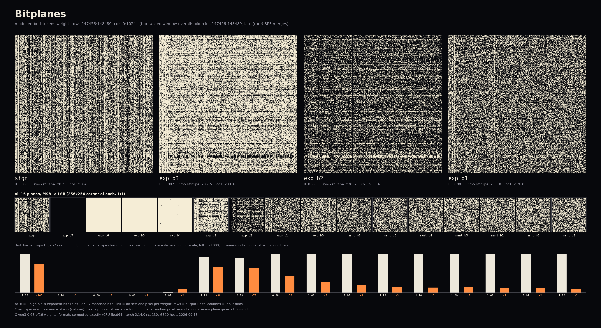
</p>

*Hero 1, Bitplanes.* The 16 stored bits of a window of Qwen3-0.6B's embedding table (token ids 147456–148480, the late, rare BPE merges). The sign plane and exponent bits b3, b2, b1 are shown large; all 16 planes appear as an index strip, with measured entropy and stripe strength underneath. Constant planes show up as blank tiles. Structure lives in the sign and in exponent bits b3–b1. The mantissa is coin flips.

<table><tr>
<td width="55%">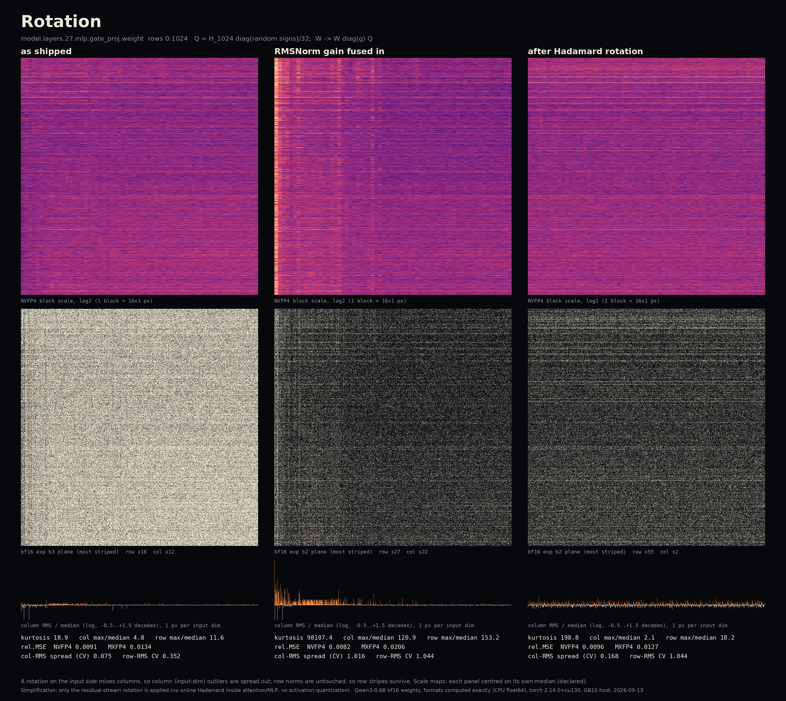</td>
<td width="45%">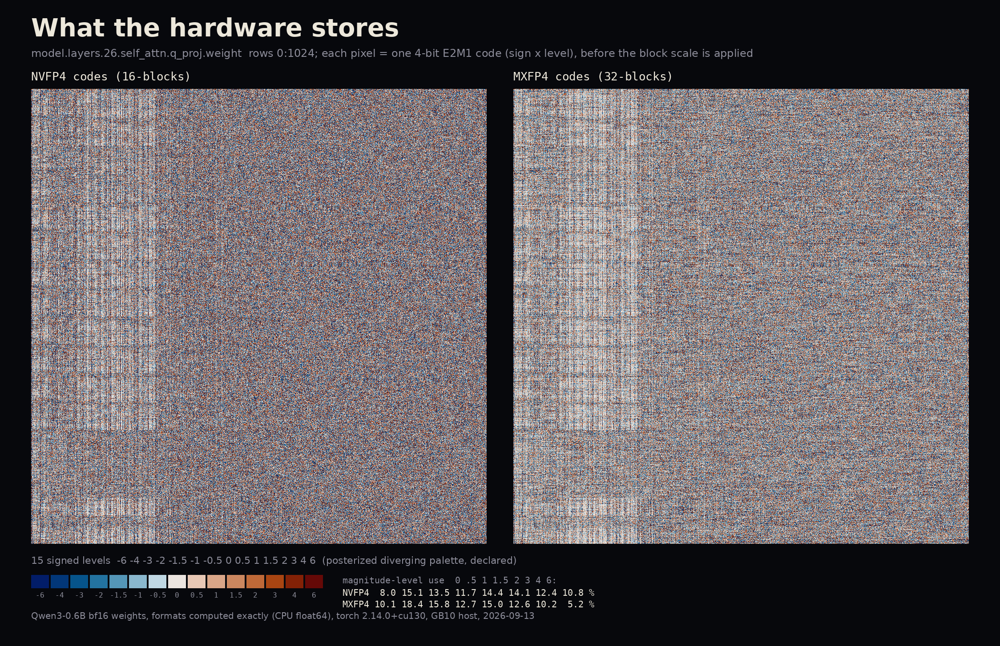</td>
</tr><tr>
<td><i>Hero 2, Rotation.</i> Layer-27 <code>gate_proj</code> as shipped, with its RMSNorm gain fused in (what a QuaRot-style pipeline actually quantizes), and after a randomized Hadamard rotation. The gain's outlier dimensions (dim 1 has gain 192, against a median of 3.1) become column stripes. The rotation dissolves them (column max/median 121 → 2.1). Row stripes survive.</td>
<td><i>Hero 3, what the hardware stores.</i> Each pixel is one 4-bit E2M1 code of layer-26 <code>q_proj</code>, NVFP4 on the left and MXFP4 on the right. Where a block contains large weights (the left 250 input dims, head-aligned patches), the other codes collapse towards 0 (pale), and block seams show.</td>
</tr></table>

---

## 1. The phenomenon

Block-scaled 4-bit formats store each weight as a 4-bit float code (E2M1: sign, 2 exponent bits, 1 mantissa bit). The code can represent only **±{0, 0.5, 1, 1.5, 2, 3, 4, 6}**. Each small block of weights shares one scale:

| | block | element | block scale | tensor scale |
|---|---|---|---|---|
| **MXFP4** (OCP MX v1.0) | 32 | E2M1 | E8M0, a pure power of two 2^k (bias 127, 0xFF = NaN) | none |
| **NVFP4** (NVIDIA) | 16 | E2M1 | FP8 E4M3 (max 448) | one FP32 per tensor |

**MXFP4 scale rule** (OCP MX spec §6.3 / Rouhani et al. 2023, Algorithm 1):
`X = 2^( floor(log2 max_i|V_i|) − emax_elem )`, with `emax_elem = 2` for E2M1. Then `P_i = E2M1(V_i / X)`, clamped to ±6.
Because `max|V|/X` lies in [4, 8), whenever the block max falls in (6, 8)·X it gets **clipped**. If frac(log2 max) is uniform, that happens in 1 − log2(1.5) = **41.5 %** of blocks.

**NVFP4** (NVIDIA, arXiv:2509.25149; TensorRT Model Optimizer `nvfp4_tensor.py`):
`s2 = max|W| / (6·448)` (FP32), `s_b = E4M3( max_block|w| / (6·s2) )` clamped to [2⁻⁹, 448], `q_i = E2M1( w_i / (s_b·s2) )`, `ŵ_i = q_i·s_b·s2`.

**Rounding.** Elements use round-to-nearest with ties-to-even (the MX default, and what ModelOpt's `searchsorted` recipe does) or **stochastic rounding** (round up with probability (x−lo)/(hi−lo)). The E4M3 scale cast is always RTNE, and the E8M0 exponent always uses the floor rule. Blocks run along the last axis (`in_features`) of each `nn.Linear` weight.

What an image of a quantized matrix can show:
* **Stripes.** Rows are output units and columns are input (residual) dimensions, so a unit or dimension with large weights raises the scale of every block it touches.
* **Mosaic.** The per-block scale is a coarse image, 16× (NVFP4) or 32× (MXFP4) narrower than the matrix.
* **Posterization.** E8M0 allows only powers of two, so the same structure is quantized into a handful of octaves.
* **Weave.** Every weight's error is (its block's step size) × (a rounding residual). The first factor is block-constant, and the second is close to white noise.

## 2. Gallery

Every caption says what is measured. Every palette, texture, crop and sort is a declared aesthetic choice and is named on the plate. The stack line on every plate reads: *Qwen3-0.6B bf16 weights, formats computed exactly (CPU float64), torch 2.14.0+cu130, GB10 host, 2026-09-13*.

### 2.1 Bitplanes (1-bit riso, night, duotone; 4×4 grids, magnified, sorted)

<table>
<tr><td width="50%">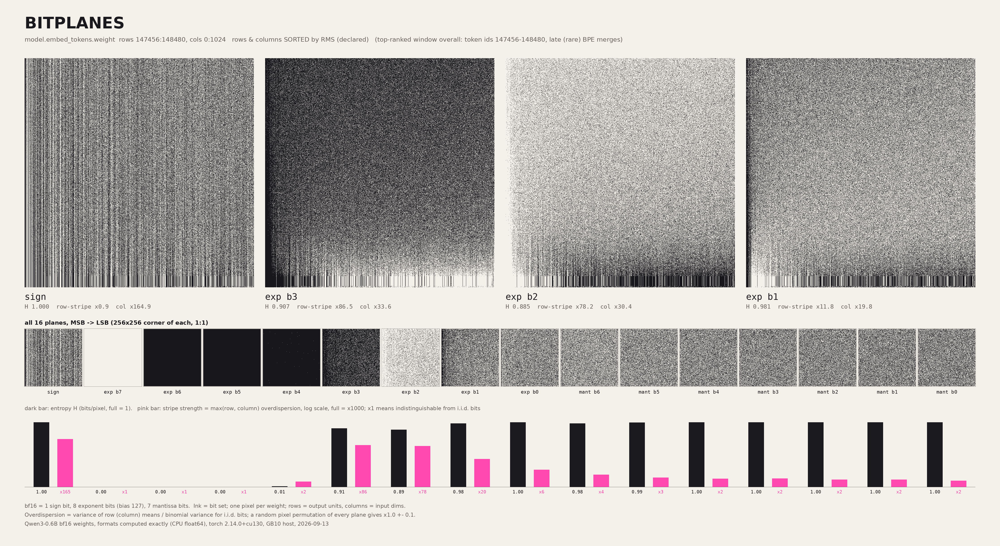</td><td>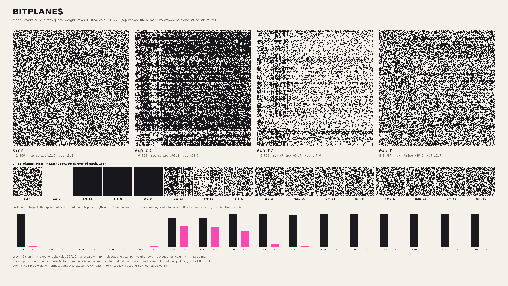</td></tr>
<tr><td><b>Sorted riso</b> (rare-token embeddings, rows and columns sorted by RMS, declared). <b>The smooth gradient comes from the sort and is not a finding.</b> What it does show: the sign plane stays striped by dimension, and a band of low-magnitude rows (bottom) is near-identical across all planes. Stripe statistics are permutation-invariant, so the numbers match the unsorted plate.</td>
<td><b>Riso, layer-26 q_proj</b>, the top-ranked linear layer by exponent-plane stripes (exp b3: rows ×90, cols ×59). Its sign plane is noise (×1.0 / ×1.2).</td></tr>
<tr><td>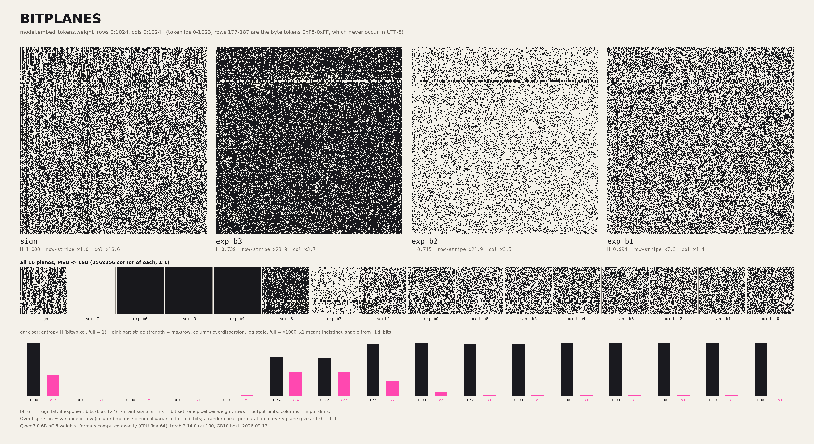</td><td>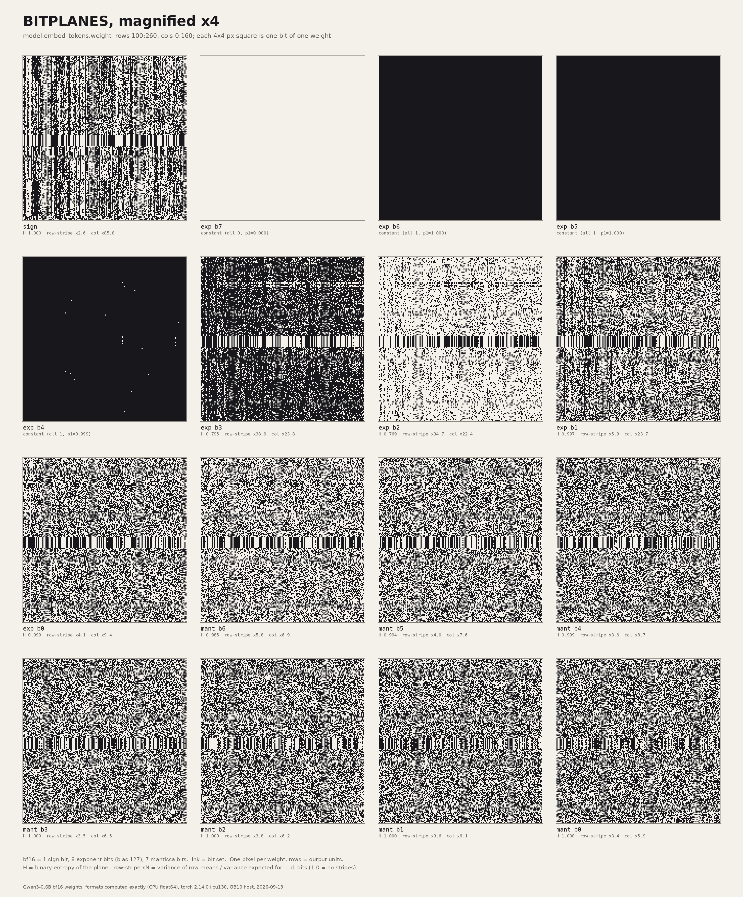</td></tr>
<tr><td>Token ids 0–1023. The barcode band at rows 177–187 is the byte tokens <code>õ…ÿ</code> = bytes 0xF5–0xFF, which can never occur in valid UTF-8. Their embeddings are near-identical (mean relative difference 0.13 %) and ~3× smaller than normal rows, so the barcode runs through every plane down to mantissa b0.</td>
<td>The same band magnified ×4 (one 4×4 px square = one bit of one weight).</td></tr>
</table>

4×4 grids (the literal "all 16 bitplanes" object, MSB top-left): [riso rare-embed](gallery/bitplanes_riso_embed_rare.png) · [night rare-embed](gallery/bitplanes_night_embed_rare.png) · [duotone rare-embed](gallery/bitplanes_duotone_embed_rare.png) (blue exponent, pink sign + mantissa) · [riso q_proj L26](gallery/bitplanes_riso_L26_q_proj.png) · [night q_proj L26](gallery/bitplanes_night_L26_q_proj.png) · [duotone q_proj L26](gallery/bitplanes_duotone_L26_q_proj.png) · [riso embed head](gallery/bitplanes_riso_embed_head.png) · [night embed head](gallery/bitplanes_night_embed_head.png) · [duotone embed head](gallery/bitplanes_duotone_embed_head.png) · [zoom rare-embed](gallery/bitplanes_zoom_riso_embed_rare.png) · [zoom q_proj](gallery/bitplanes_zoom_riso_L26_q_proj.png) · [night hero q_proj](gallery/bitplanes_hero_night_L26_q_proj.png) · [night hero embed head](gallery/bitplanes_hero_night_embed_head.png) · [sorted q_proj](gallery/bitplanes_hero_riso_L26_q_proj_sorted.png) · [sorted embed head](gallery/bitplanes_hero_riso_embed_head_sorted.png)

**Bitplanes of the quantized codes**: FP8 E4M3 bytes (per-tensor scale), NVFP4 and MXFP4 nibbles, and their scale bytes (pink, stretched across their block, declared).

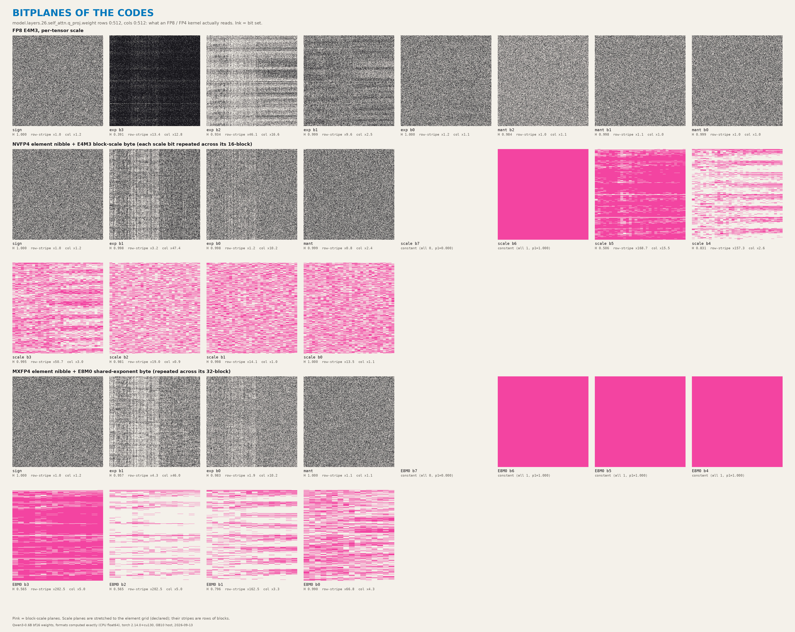

The E8M0 byte uses only 5–8 exponent values, so its top planes are constant and its low planes are sparse horizontal dashes. The E4M3 scale planes carry the head-structured mosaic. The FP4 element nibble planes are nearly noise (the sign plane exactly so). [rare-embed codes](gallery/bitplanes_codes_riso_embed_rare.png) · [gate_proj L27 codes](gallery/bitplanes_codes_riso_L27_gate_proj.png)

### 2.2 Rotation: Hadamard before/after

<table>
<tr><td width="50%">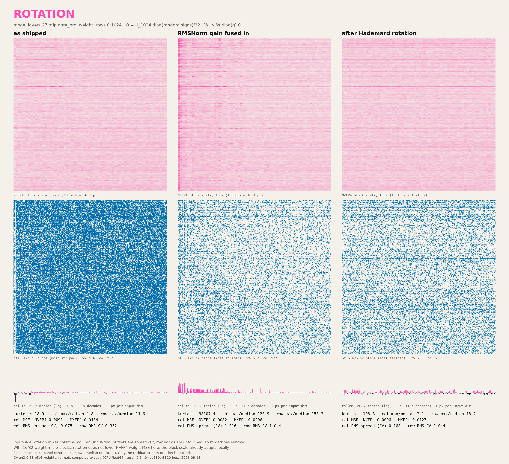</td><td>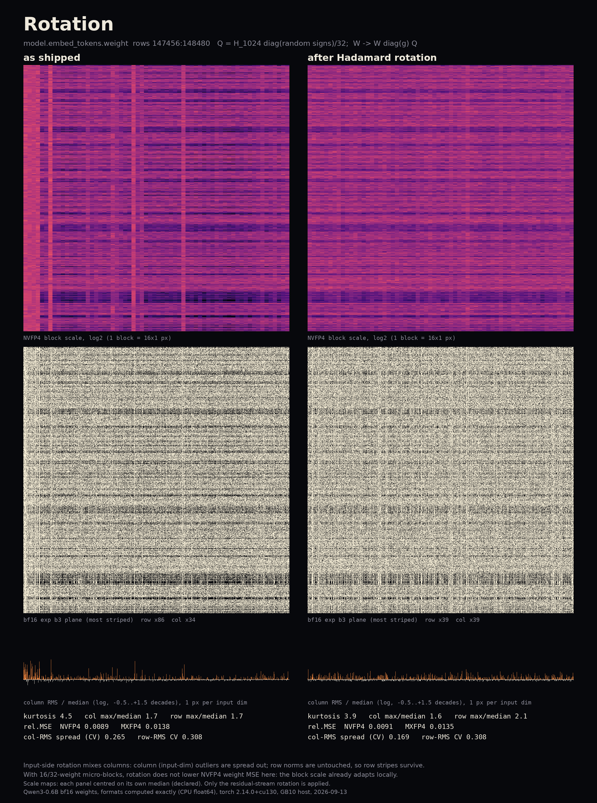</td></tr>
<tr><td>Riso version of hero 2. Each panel shows the NVFP4 block-scale mosaic (1 block = 16×1 px), its most striped exponent bitplane, and the per-column RMS profile.</td><td>Rare-token embeddings: column RMS spread (CV) 0.265 → 0.169. NVFP4 rel. MSE 0.0089 → 0.0091, i.e. <b>no gain</b>.</td></tr>
</table>

[night k_proj L16](gallery/hadamard_night_L16_k_proj.png) · [riso k_proj L16](gallery/hadamard_riso_L16_k_proj.png) · [riso rare-embed](gallery/hadamard_riso_embed_rare.png) · extra: [q_proj L26](gallery/extra/hadamard_night_L26_q_proj.png), [down_proj L6 (output side, Qᵀ W)](gallery/extra/hadamard_night_L06_down_proj.png)

### 2.3 Scale maps (night, tesserae, survey contours, riso overprint)

<table>
<tr><td width="55%">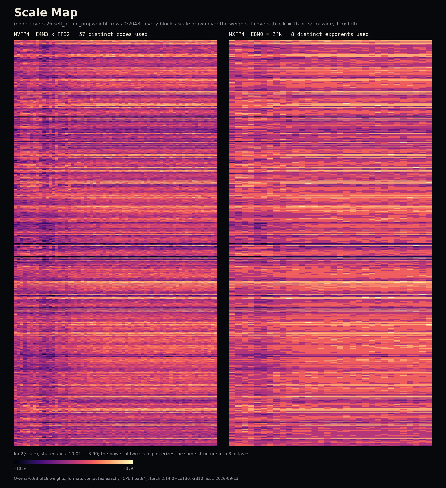</td><td>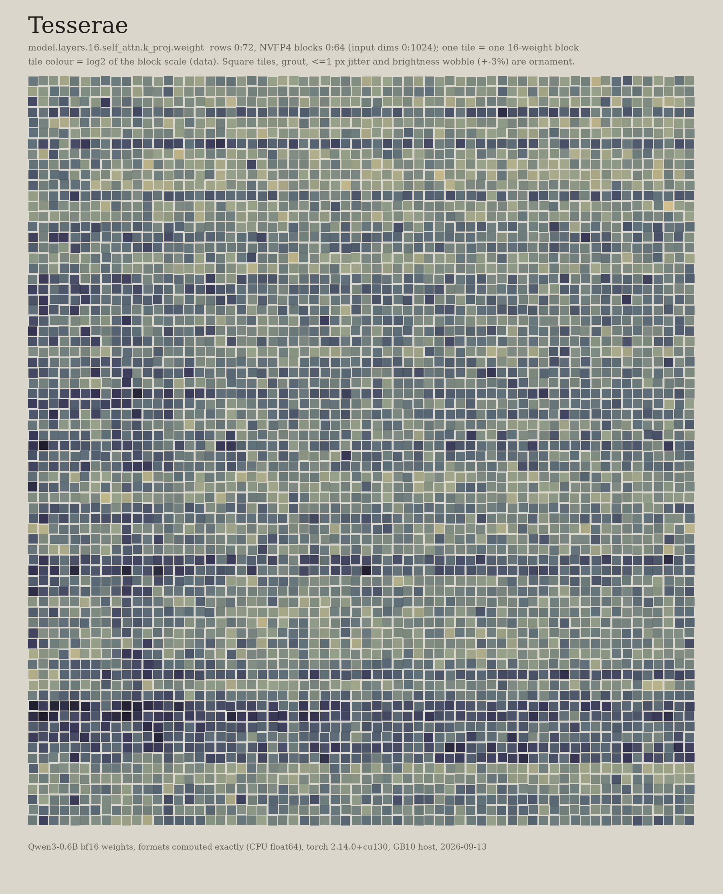</td></tr>
<tr><td><b>Night.</b> Layer-26 q_proj, every block's scale drawn over the weights it covers. NVFP4 uses 57 distinct E4M3 codes; MXFP4 uses <b>8</b> exponents for the same structure. Head bands every 128 rows and input-dim columns ~150–250 are visible.</td>
<td><b>Tesserae.</b> One tile per NVFP4 block of layer-16 k_proj (declared square geometry, grout, ≤1 px jitter). Row-wise bands are output units.</td></tr>
<tr><td>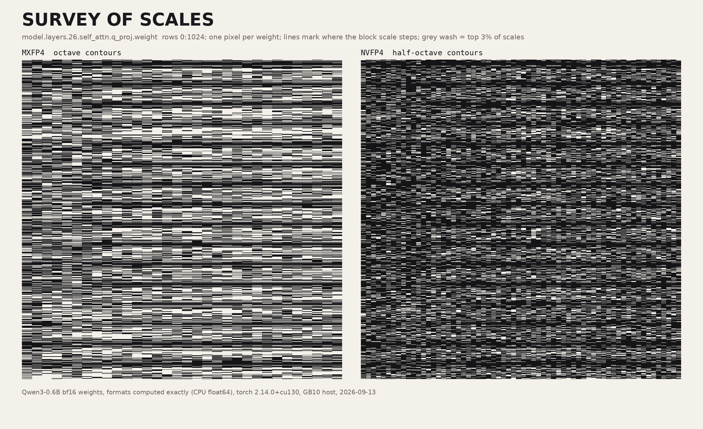</td><td>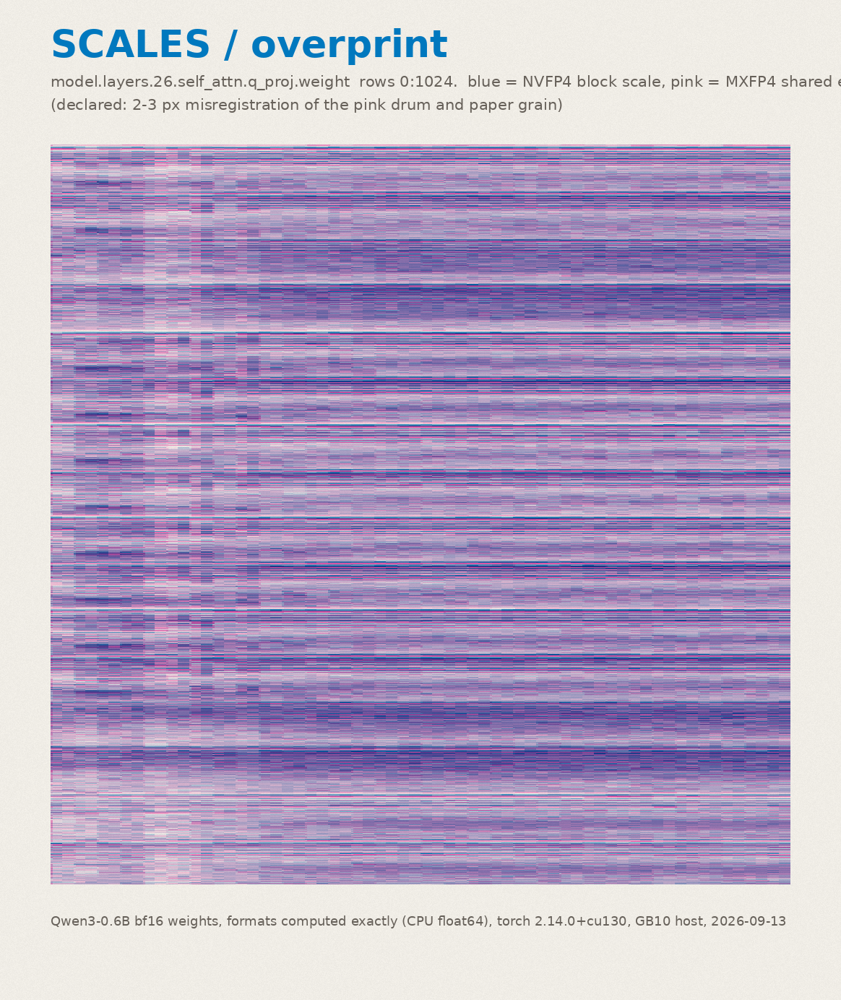</td></tr>
<tr><td><b>Survey sheet.</b> Single ink, a line wherever the scale steps an octave (MXFP4) or half-octave (NVFP4). Grey wash marks the top 3 % of scales.</td><td><b>Riso overprint.</b> Blue drum = NVFP4 scale, pink drum = MXFP4 exponent (declared 2–3 px misregistration).</td></tr>
</table>

More: night [k_proj L16](gallery/scalemap_night_L16_k_proj.png), [gate L27](gallery/scalemap_night_L27_gate_proj.png), [rare-embed](gallery/scalemap_night_embed_rare.png); tesserae [q L26](gallery/scalemap_tesserae_L26_q_proj.png), [gate L27](gallery/scalemap_tesserae_L27_gate_proj.png), [rare-embed](gallery/scalemap_tesserae_embed_rare.png); survey [k L16](gallery/scalemap_survey_L16_k_proj.png), [gate L27](gallery/scalemap_survey_L27_gate_proj.png), [rare-embed](gallery/scalemap_survey_embed_rare.png); riso [k L16](gallery/scalemap_riso_L16_k_proj.png), [gate L27](gallery/scalemap_riso_L27_gate_proj.png), [rare-embed](gallery/scalemap_riso_embed_rare.png).

### 2.4 Codes (what the hardware stores)
[night q L26](gallery/codes_night_L26_q_proj.png) · [paper q L26](gallery/codes_paper_L26_q_proj.png) · [night k L16](gallery/codes_night_L16_k_proj.png) · [paper k L16](gallery/codes_paper_L16_k_proj.png) · [night gate L27](gallery/codes_night_L27_gate_proj.png) · [paper gate L27](gallery/codes_paper_L27_gate_proj.png) · [night rare-embed](gallery/codes_night_embed_rare.png) · [paper rare-embed](gallery/codes_paper_embed_rare.png). 15 signed levels on a posterized 15-step `vik` palette (declared). Level-use histograms are printed on each plate: MXFP4 puts only 5.2 % of weights on ±6 against NVFP4's 10.8 % (q L26), because its floor rule leaves the top level half-empty.

### 2.5 Spectral lines (spectrograph plate, night, plotter line, block units)

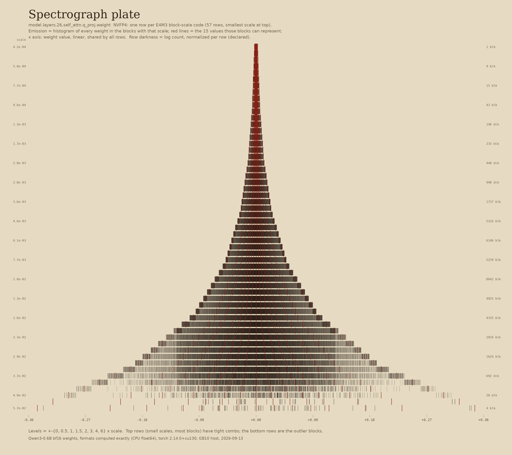

**Spectrograph plate.** This one is exact. Every NVFP4 block with the same E4M3 scale code has identical representable values, so each row is one code (57 rows, smallest scale at top). The emission is the histogram of every weight in those blocks, and the red lines are the 15 values those blocks can represent. The lines fan out as the scale grows, and the bottom rows (1–28 blocks) are the outlier blocks with widely spaced lines. A single block has only 16 values, so grouping by the shared scale is what makes a histogram meaningful.

<table><tr>
<td width="50%">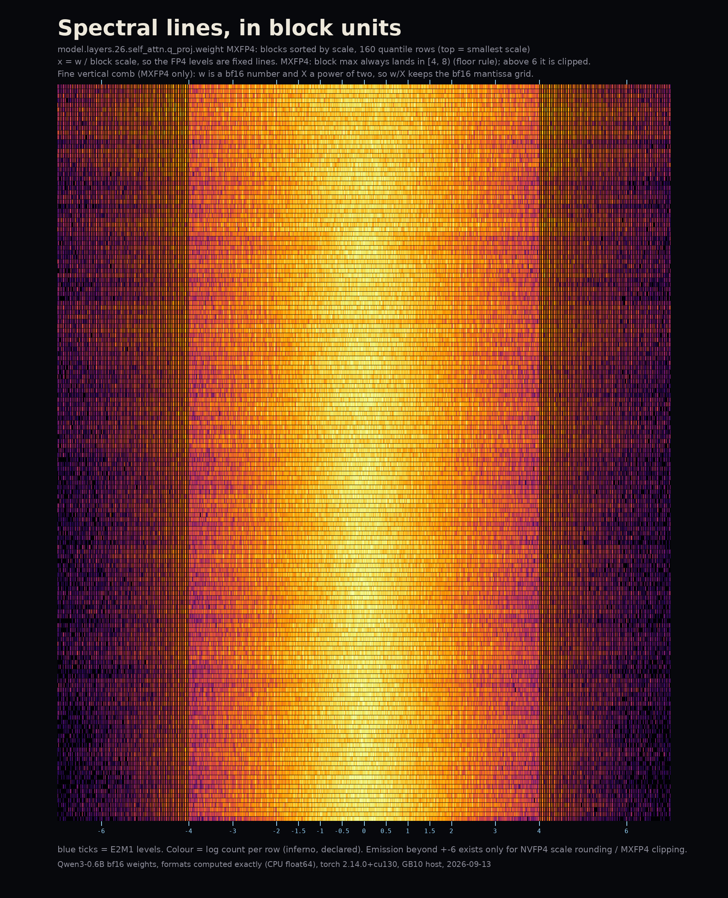</td>
<td>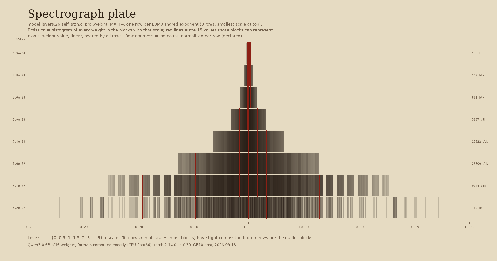</td></tr>
<tr><td><b>Block units, MXFP4.</b> x = w / X, so the levels are fixed. The hard edge at ±4 is the floor rule (the block max always lands in [4, 8)), and emission beyond ±6 is clipped weight. The fine vertical comb is real: w is bf16 and X is a power of two, so w/X keeps the bf16 mantissa grid. The NVFP4 version has no comb (<a href="gallery/spectral_lines_blockunits_NVFP4_L26_q_proj.png">link</a>).</td>
<td><b>MXFP4 plate</b>: 8 exponents, 8 rows.</td></tr></table>

[night NVFP4](gallery/spectral_lines_night_NVFP4_L26_q_proj.png) · [plotter line NVFP4](gallery/spectral_lines_line_NVFP4_L26_q_proj.png) · gate L27: [plate](gallery/spectral_lines_plate_NVFP4_L27_gate_proj.png), [night](gallery/spectral_lines_night_NVFP4_L27_gate_proj.png), [line](gallery/spectral_lines_line_NVFP4_L27_gate_proj.png), [MXFP4 plate](gallery/spectral_lines_plate_MXFP4_L27_gate_proj.png), [block units NV](gallery/spectral_lines_blockunits_NVFP4_L27_gate_proj.png) / [MX](gallery/spectral_lines_blockunits_MXFP4_L27_gate_proj.png)

### 2.6 Where the power of two hurts (NVFP4 vs MXFP4)

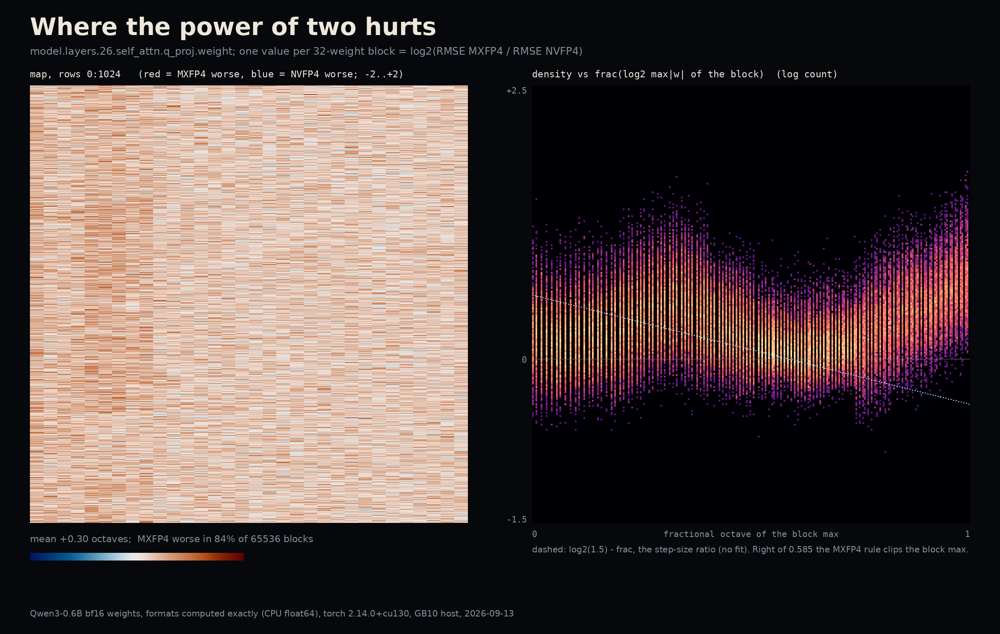

log2(RMSE_MXFP4 / RMSE_NVFP4) per 32-weight block: as a map, and as a density against the fractional octave of the block max. The dashed line log2(1.5) − frac is the step-size ratio (not a fit). The density follows it down to frac ≈ 0.585, then turns back up as MXFP4 starts clipping the block max: a **V-shaped sawtooth** set purely by where each block's max falls within its octave. MXFP4 is worse in 84 % of blocks. Others: [k L16](gallery/nvmx_diff_L16_k_proj.png) · [gate L27](gallery/nvmx_diff_L27_gate_proj.png) · [rare-embed](gallery/nvmx_diff_embed_rare.png)

### 2.7 Spectral (Sohl-Dickstein style, declared) for the signed quantities

<table><tr>
<td width="50%">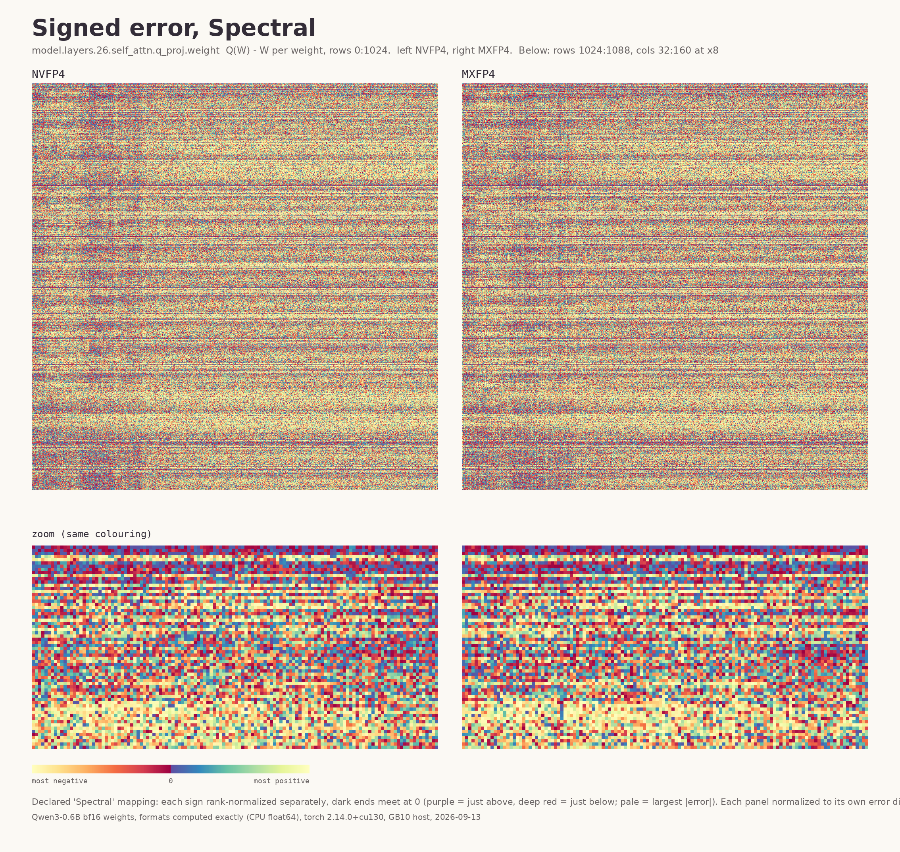</td>
<td>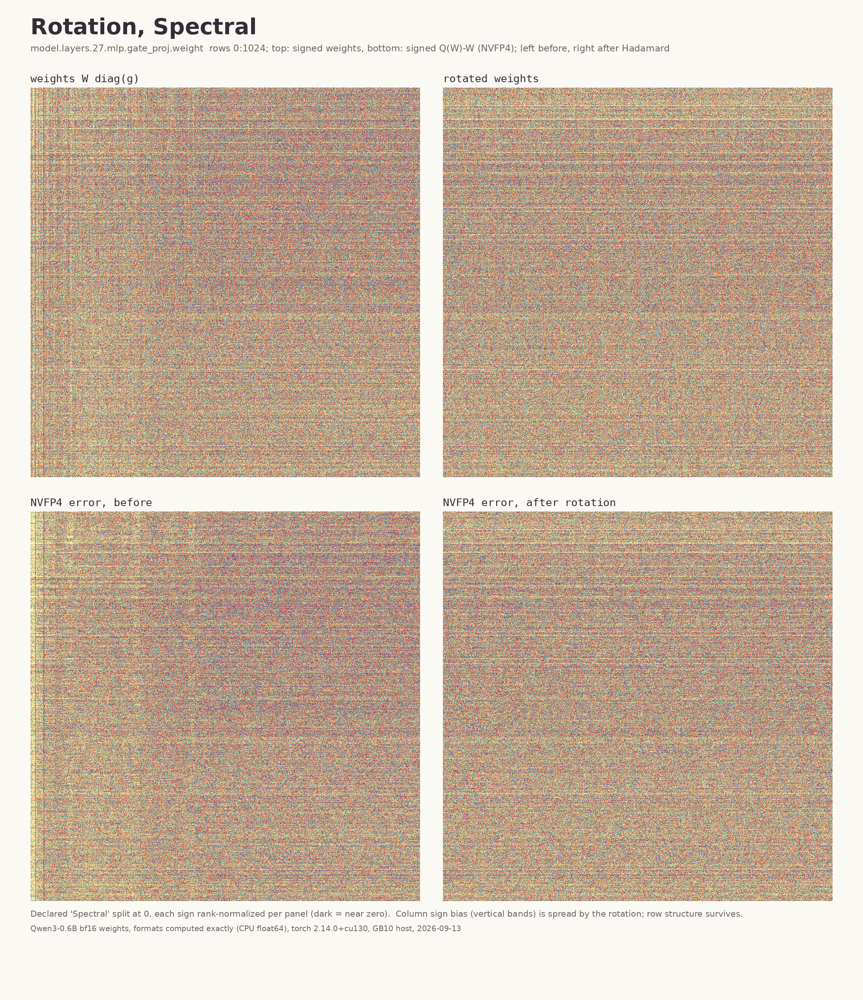</td></tr>
<tr><td>Signed error Q(W) − W, NVFP4 | MXFP4, with a zoom. Split at 0, each sign rank-normalized separately onto half of matplotlib <code>Spectral</code>, so purple (just above 0) and deep red (just below) meet in a dark seam.</td>
<td>Rotation in Spectral. Top: signed fused weights, before and after the Hadamard rotation. Bottom: signed NVFP4 error. The sign-biased columns at left dissolve.</td></tr></table>

[NV−MX log-ratio, Spectral q L26](gallery/spectral_nvmx_L26_q_proj.png) · [gate L27](gallery/spectral_nvmx_L27_gate_proj.png) · signed error [rare-embed](gallery/spectral_signed_error_seam_embed_rare.png), [k L16](gallery/spectral_signed_error_seam_L16_k_proj.png) · rotation [rare-embed](gallery/spectral_hadamard_embed_rare.png), [k L16](gallery/spectral_hadamard_L16_k_proj.png), [q L26](gallery/spectral_hadamard_L26_q_proj.png) · **colab-exact variant** [q L26](gallery/spectral_signed_error_colab_L26_q_proj.png). His `cdf_img` (buffer 0.25) puts the dark ends at the *extremes* with a pastel gap at 0; the brief's description puts them *at* 0. Both are rendered, and the "seam" version follows the brief.

### 2.8 Layer atlas and depth animation

<table><tr>
<td width="38%">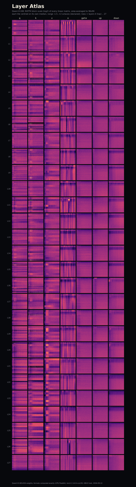</td>
<td>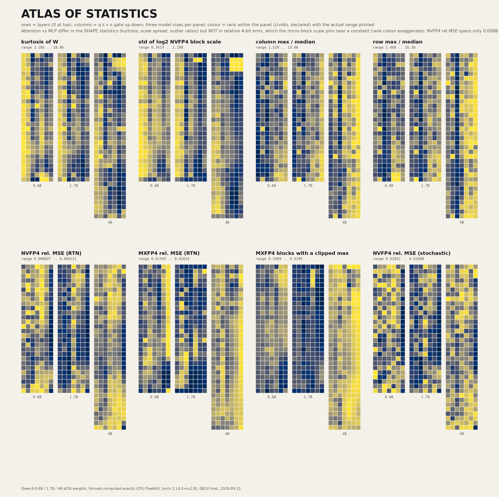<br><video src="gallery/atlas_depth_Qwen3-0.6B.mp4" autoplay loop muted playsinline width="100%"></video></td></tr>
<tr><td>All 28 layers × 7 matrices of Qwen3-0.6B: NVFP4 scale mosaics (area-averaged to 96², each centred on its own median, declared). q/k show head-row stripes. o_proj shows column blocks of 128 dims (head outputs). v shows patches. gate/up are nearly featureless.</td>
<td>Statistics for 0.6B / 1.7B / 4B (rank colour, declared, ranges printed), plus the depth animation (<a href="gallery/atlas_depth_Qwen3-0.6B.gif">GIF</a>).</td></tr></table>

[riso atlas](gallery/atlas_NVFP4_scale_riso_Qwen3-0.6B.png) · [|W| atlas](gallery/atlas_absW_night_Qwen3-0.6B.png)

### 2.9 Block-size sweep

<video src="gallery/blocksweep.mp4" autoplay loop muted playsinline width="100%"></video>

Block sizes 4 → 1024 with the NVFP4 recipe and the MX recipe: the scale maps coarsen, and rel. MSE is plotted for 21 matrices ([GIF](gallery/blocksweep.gif), [still](gallery/blocksweep_frame16.png)).

### 2.10 The element-level error plates (kept, but not the point)

<table><tr><td width="50%">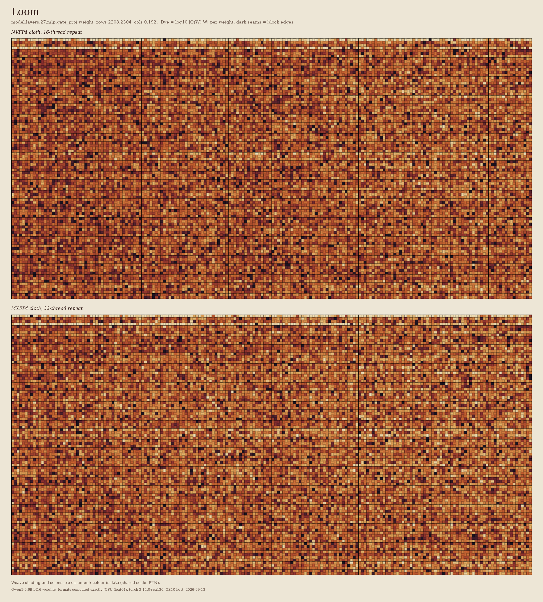</td><td>Per-element |Q(W) − W| looks almost like white noise at every zoom. The rounding residual dominates, and the block weave is faint (see §4). The <b>Loom</b> textile (dye = log|error|; weave shading and seams are ornament) is the best of these. Others are in <code>gallery/extra/</code>: <a href="gallery/extra/blockerr_zoom_nocturne_L27_gate_proj.png">nocturne zoom</a>, <a href="gallery/extra/blockerr_zoom_ledger_L27_gate_proj.png">ledger</a>, <a href="gallery/extra/blockerr_riso_L27_gate_proj.png">riso overprint</a>, <a href="gallery/extra/blockerr_rounding_L27_gate_proj.png">RTN vs stochastic</a>, <a href="gallery/extra/blockerr_nocturne_L27_gate_proj.png">full-resolution nocturne (17.9 MB)</a>, <a href="gallery/extra/blockerr_zoom_nocturne_embed_head.png">embedding barcode rows</a>.</td></tr></table>

## 3. What was computed

* **Weights.** Qwen3-0.6B from the local HF cache, read straight from `model.safetensors` via a hand-parsed header and memory map (`weights.py`). All 311 tensors are stored as **BF16**. The torch bf16 view was cross-checked against an independent numpy decoder (bit-identical). `lm_head.weight` is bitwise equal to `embed_tokens.weight` (tied). Qwen3-1.7B (28 layers) and Qwen3-4B (36 layers), also BF16, were used for the atlas statistics.
* **Formats** (`formats.py`): float64 on CPU, no GPU used at all. Stochastic-rounding seeds: 1234 (matrix caches), 7 (atlas). Hadamard sign seed: 0.
* **Matrices rendered.** Layers 0, 13, 27 × {q, k, v, o, gate, up, down}; plus the most structured matrices from the atlas (L16 k_proj, L26 q_proj, L26 gate_proj, L6 down_proj); plus embedding windows (ids 0–3071, 60000–63071, 147456–150527, 148864–151935). **How heroes were chosen:** `compute_atlas.py` ranks matrices by row and column max/median, kurtosis and log2-scale spread. `compute_bitplane_scan.py` ranks all 196 linear matrices and 13 embedding windows by exponent-plane stripe overdispersion. The top embedding window (147456) and the top linear layer (L26 q_proj) became the heroes.
* **Commands** (Python `/home/fzeng/ml/research/art/.venv/bin/python`, run in this directory):
  ```
  python validate_formats.py            # 15 checks, cache/validation.json          (~1 min)
  python compute_blockerr.py            # cache/mat_*.npz                           (~30 s)
  python compute_atlas.py Qwen3-0.6B Qwen3-1.7B Qwen3-4B   # cache/atlas_*.npz      (~55 min CPU)
  python compute_bitplanes.py; python compute_bitplane_scan.py    # (~15 min CPU)
  python compute_hadamard.py            # cache/hadamard_*.npz                      (~1 min)
  python blocksweep.py compute          # cache/blocksweep.npz                      (~3 min)
  python render_bitplanes.py; python render_hadamard.py; python render_scalemap.py
  python render_spectrallines.py; python render_spectral_style.py; python render_atlas.py
  python blocksweep.py render; python render_blockerr.py
  ```
* **Sources for the specs.** The OCP MX v1.0 PDF returned HTTP 403 to the fetcher, so the MXFP4 rule was taken from Rouhani et al. 2023 (arXiv:2310.10537, Algorithm 1, which is the spec's conversion algorithm) and checked against Microsoft's `microxcaling` reference code (`_shared_exponents`: floor(log2 max) − emax, clamp to ±127). The E8M0 facts (bias 127, single NaN 0xFF, no Inf) come from secondary sources quoting the spec. NVFP4 was taken from arXiv:2509.25149 and ModelOpt `nvfp4_tensor.py` (`amax/(6·448)`, block scale clamp [2⁻⁹, 448], zero block → 1.0, E2M1 `searchsorted` with odd-bound tie fix).

## 4. Verification and honesty

**Format validation** (`cache/validation.json`, all pass):
* My E4M3 RTNE cast agrees 100 % with `torch.float8_e4m3fn` on 400k values, including every exact midpoint. My E2M1 rounding agrees with ModelOpt's recipe on 500k values including ties.
* The vectorized NVFP4 and MXFP4 match brute-force scalar implementations written from the spec text, bit for bit.
* E2M1 on N(0,1) at a fixed scale: MSE by numeric integration 0.012702 vs Monte Carlo 0.012682.
* Stochastic rounding is unbiased (mean error 8e-5 ± 2.7e-4). Its MSE ratio to RTN on uniform data is 1.99 (theory 2).
* MXFP4 clip fraction on log-uniform block maxima is 0.4149 (theory 1 − log2 1.5 = 0.4150).
* i.i.d. Gaussian blocks give rel. MSE NVFP4 0.00905, MXFP4 0.01324 (RTN); stochastic rounding gives 0.0189 and 0.0252.

**On real weights:**
* **Relative error is set by the format, not the model.** NVFP4 RTN rel. MSE is 0.0088–0.0091 for *every* linear matrix of all three models, and MXFP4 is 0.0131–0.0163. Both equal the i.i.d.-Gaussian numbers. MXFP4's blocks-with-clipped-max fraction is 0.40–0.42 (0.6B), which matches the 41.5 % prediction. The model's structure lives in the absolute scale, not in the relative error.
* **Weave (the doc's central claim) is present but weak.** For per-element |error|, the between-block share of variance is 0.21 (NVFP4) and 0.16 (MXFP4) on L27 gate_proj, against 0.08 and 0.035 for an i.i.d. Gaussian matrix of the same shape, and most of the excess is row structure. The correlation of |error| between neighbours inside a block vs across a block edge is 0.084 vs 0.063 (L22 o_proj). For |W| itself, which has no block grid, the two correlations are equal (e.g. 0.228 / 0.225 on q_proj). **The element-level error map reads as noise.** The weave is legible in the scale map, the code image and the Loom plate, not in raw |error|.
* **Bitplanes.** Measured statistics for L26 q_proj rows 0:1023 (row / column overdispersion, null = random permutation, ×1.00 ± 0.1):
  * sign: H 1.000, ×1.0 / ×1.2
  * exp b7–b5: constant
  * exp b4: H 0.01 (only |w| < 2⁻¹⁵)
  * exp b3: H 0.88, ×90 / ×59
  * exp b2: H 0.87, ×65 / ×47
  * exp b1: ×29 / ×3
  * exp b0: ×2
  * all 7 mantissa planes: ×1.0

  **The doc's claim that "the sign plane shows model structure" is false for every linear layer checked** (sign overdispersion ≈ 1). It is **true for embeddings**: in the rare-token window the sign plane has column overdispersion ×165. Dims 1, 3, 429, 7 and 27 have the *same sign for more than 99.9 % of the 3072 rare tokens*. These dims rank 4, 9, 1, 3 and 2 by RMS over the whole vocabulary, with global means of about −2σ to +1.8σ. Dims 1, 7, 27 and 106 also carry the largest layer-27 post-attention RMSNorm gains (192, 15.3, 17.0, 12.4 against a median of 3.1).
* **Hadamard.** Fusing L27's post-attention RMSNorm gain gives kurtosis 98 107 and column max/median 121. After rotation these fall to 199 and 2.1. Row max/median goes from 153 (fused) to 18, and row-RMS CV stays at 1.044 (row norms are invariant). **MXFP4 rel. MSE improves 0.0206 → 0.0127, while NVFP4 gets slightly *worse*, 0.0082 → 0.0096.** On unfused matrices the change is within about 3 % for both. **Negative result:** with 16/32-weight micro-blocks, rotation does not reduce weight-quantization MSE here. The block scale already adapts locally. Rotation papers (QuaRot, SpinQuant) report gains for per-channel or per-tensor INT4 and for *activations*, where one outlier sets the scale of a whole channel or tensor. Those settings were not tested here.
* **Block-size sweep.** The NVFP4 recipe is monotone: 0.0050 at 4, 0.0090 at 16, 0.014–0.016 at 1024. **The MX recipe is not.** It is best at 32–64 (0.0131–0.0140) and *worse* at 4 (0.0153), because with few elements the clipped or wasted block max carries a large share of the block's energy. Smaller MX blocks do not help.
* **Attention vs MLP.** They differ clearly in *shape* statistics (0.6B means): kurtosis q 7.7, k 6.0 vs v 3.8, up 4.1; std of log2 NVFP4 scale q 0.68, k 0.63 vs up 0.44; and visibly in the atlas mosaics. They do **not** differ in relative 4-bit error.
* **Nothing here is claimed to be fractal.** The only periodic structures are the block grid, the 128-dim head grid and the bf16 mantissa comb, all of which are exact consequences of the formats and architecture.

## 5. Caveats

* **Weights only, RTN or SR only.** No activation quantization, no GPTQ/AWQ-style error compensation, no accuracy or perplexity measurement. Rel. MSE is not model quality.
* **Simplified Hadamard pipeline.** Only the residual-stream rotation is applied (norm gains fused into input-side matrices, Qᵀ on the output side). There is no online Hadamard inside attention or on down_proj's input, and the rotated matrices were not re-run through the model.
* **Quantization noise is not claimed to be white.** It is close to white *within a block* for these busy weights (the rounding residual), but it is scaled per block and clipped at the top of MXFP4 blocks. The comb and the sawtooth plates are counterexamples.
* **Readability choices.** Rank/CDF colour normalizations (Spectral, atlas metrics) exaggerate tiny differences: NVFP4 rel. MSE spans only 0.0088–0.0091. Sorted plates manufacture their gradients. Tile geometry, grout, weave shading, grain and misregistration are ornament.
* **Crops.** Bitplane plates are 1024² crops (rows 0:1024), and the embedding table is shown only in windows.
* **Exact computation, no measurement noise.** Every number is exact math on the stored bits, so none of it depends on the GB10 except the date and stack line. No timing was done.

## 6. Ideas explored / not pursued

Explored and kept:
1. **Hadamard rotation before/after** (§2.2): chosen, honest negative result for micro-blocks.
2. **Block-size sweep animation** (§2.9): chosen, found the non-monotone MX curve.
3. The NVFP4 − MXFP4 sawtooth (§2.6).
4. Spectral lines in block units, with the bf16 comb (§2.5).
5. Sorted-row bitplanes (§2.1, declared).
6. Depth animation of scale mosaics (§2.8).

Explored and demoted: per-element |error| plates (noise-dominated; moved to `extra/`), and the per-block relative-error map (flat: NVFP4 block rel. error doesn't depend on the block, so it was not rendered).

Not pursued:
* A 0.6B vs 4B scale-map comparison (only statistics were done).
* Code-usage tapestry as a 16-colour categorical weave (superseded by the code image).
* 2D FFT "diffraction" of the error field to measure the 1/16 comb. The block-constant modulation predicts sinc *zeros*, not peaks, at the harmonics, so the within/boundary correlation was used instead.
* Emulating SpinQuant's learned rotations.
* Activation-side quantization (needs forward passes).
* FP8 E4M3 vs E5M2 comparison.

## 7. Files

* **Compute:** `formats.py`, `weights.py`, `validate_formats.py`, `compute_blockerr.py`, `compute_atlas.py`, `compute_bitplanes.py`, `compute_bitplane_scan.py`, `compute_hadamard.py`, `blocksweep.py`.
* **Render:** `render_*.py`, `styles.py`.
* **Cache:** `cache/` (~3 GB, git-ignored). `gallery/extra/` holds secondary plates.
* **Size limit:** no file exceeds the 20 MB commit limit. The largest is `extra/blockerr_nocturne_L27_gate_proj.png` at 17.9 MB.
* **GPU time:** 0.

## References

- OCP Microscaling Formats (MX) Specification v1.0, 2023 (PDF not fetchable here, HTTP 403; algorithm verified via the two sources below)
- Rouhani et al., "Microscaling Data Formats for Deep Learning", arXiv:2310.10537 (Algorithm 1)
- Microsoft `microxcaling` reference implementation, `mx/mx_ops.py`
- NVIDIA, "Pretraining Large Language Models with NVFP4", arXiv:2509.25149
- NVIDIA TensorRT Model Optimizer, `modelopt/torch/quantization/qtensor/nvfp4_tensor.py`
- NVIDIA Technical Blog, "NVFP4 Trains with Precision of 16-Bit and Speed and Efficiency of 4-Bit"
- Micikevicius et al., "FP8 Formats for Deep Learning", arXiv:2209.05433
- Ashkboos et al., "QuaRot: Outlier-Free 4-Bit Inference in Rotated LLMs", 2024; Liu et al., "SpinQuant", 2024
- Sohl-Dickstein, "The boundary of neural network trainability is fractal", github.com/Sohl-Dickstein/fractal (`cdf_img` colouring)
- Widrow & Kollár, *Quantization Noise*, 2008
