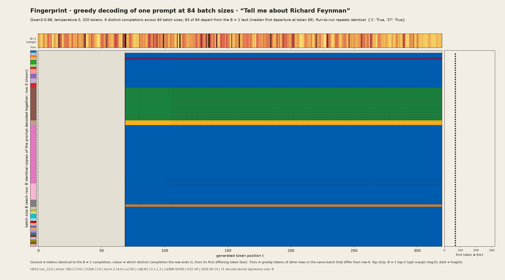
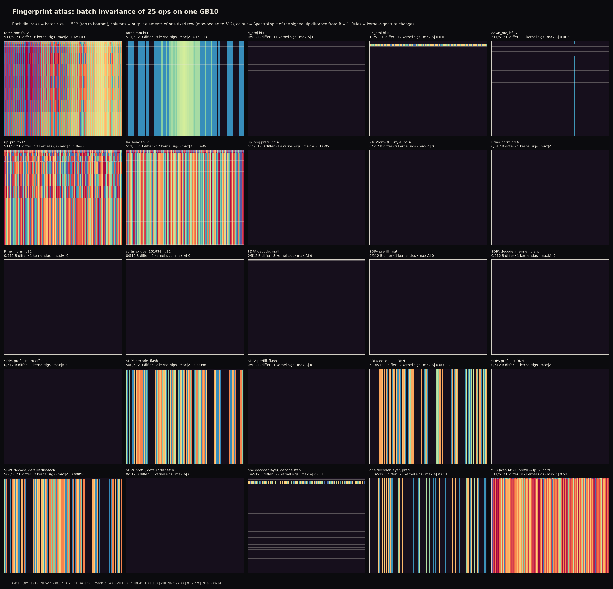
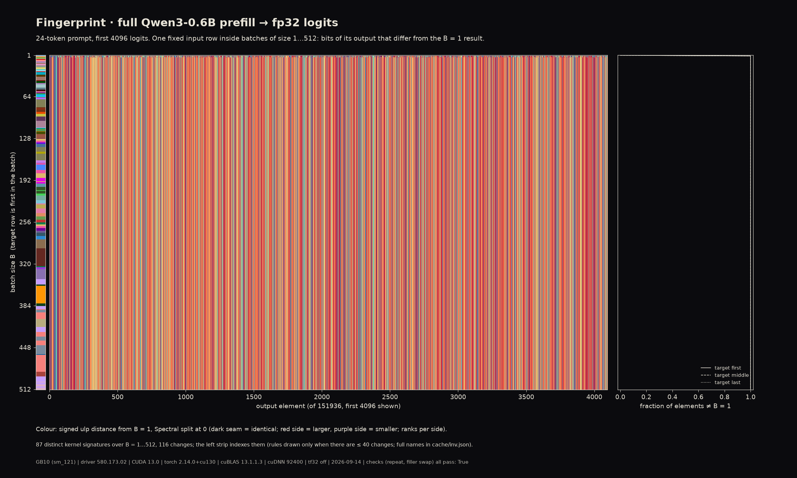
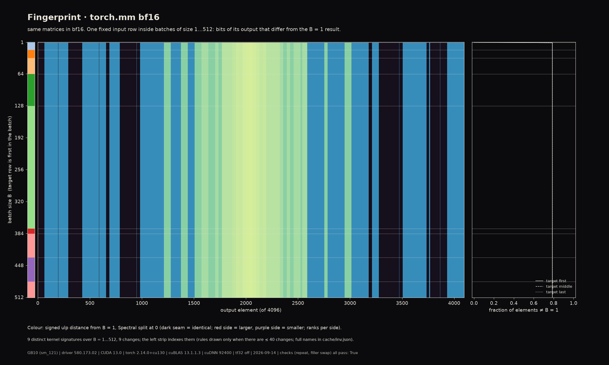
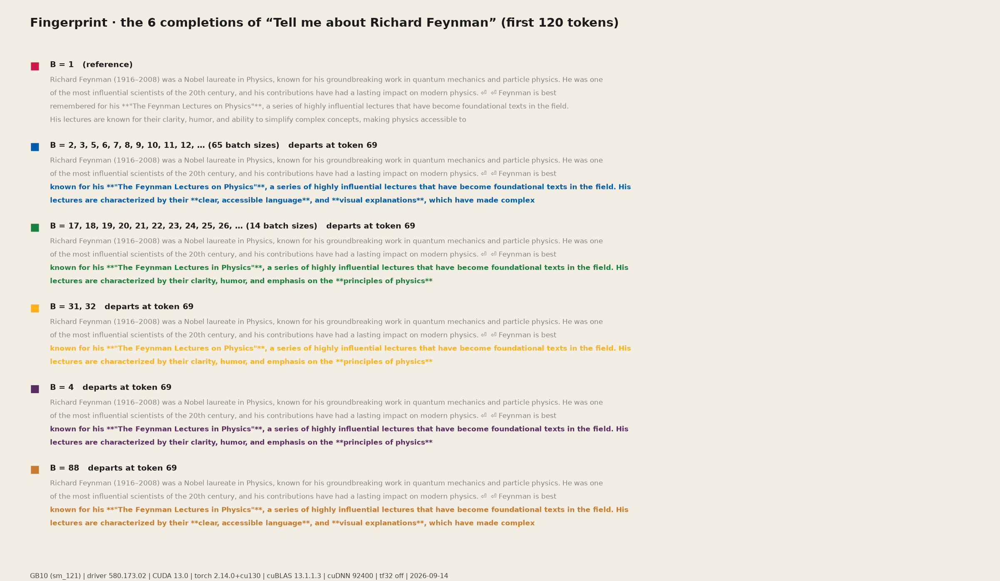
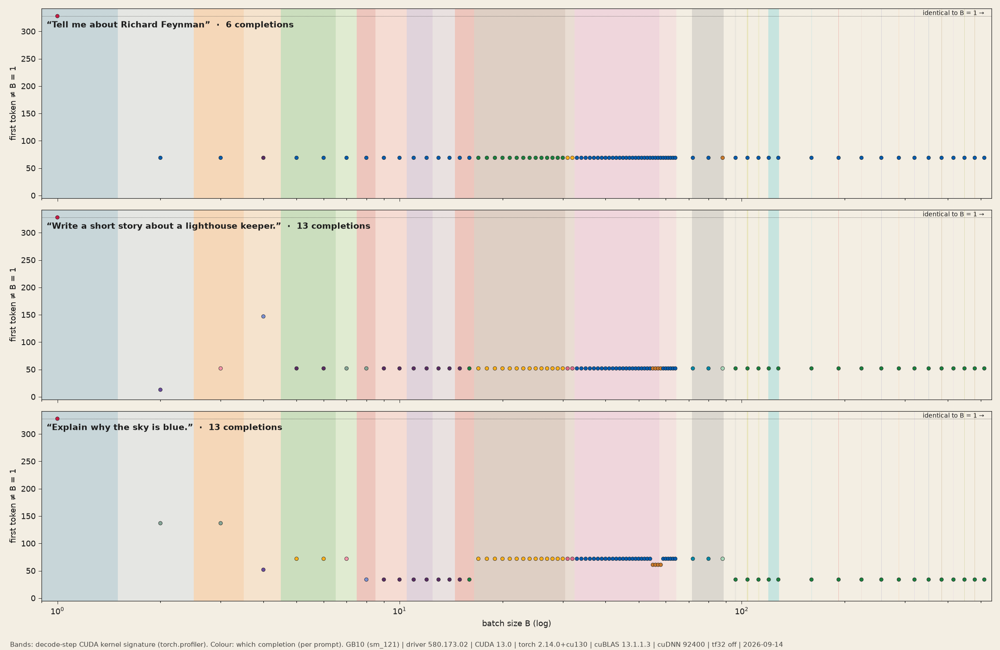
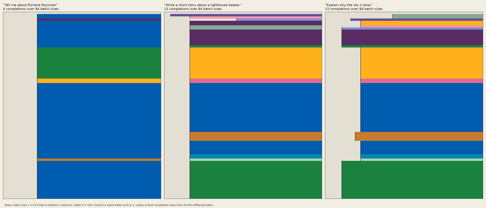

# Fingerprint: why the same prompt decodes differently at different batch sizes

*Send one fixed row through a GPU kernel inside batches of size 1 to 512 and record every output bit. The row's own arithmetic should not care who its neighbours are. On this GB10 it does: matmuls, attention and the whole of Qwen3-0.6B change their answer with the batch size, in bands that follow the kernel the library chose. Greedy decoding then turns a rounding difference into a different sentence.*

Hero: greedy decoding of “Tell me about Richard Feynman” at 84 batch sizes (rows), 320 tokens (columns), Qwen3-0.6B, temperature 0. Grey = tokens identical to the B = 1 completion; colour = which of the 6 distinct completions the row ends in, from its first differing token. Every batch size from 2 upwards leaves the B = 1 text at token 69. All of that is measured; the colours are a declared categorical palette.

## The phenomenon

A GPU kernel adds up a dot product in some order, in some chunking, with some intermediate precision. Floating-point addition is not associative, so two orders give results that differ in the last bits. Libraries pick the kernel by *shape*: a batch of 1 row goes to a matrix-vector kernel, 2 to 16 rows to a small tensor-op tile, 17 to 32 to another, and so on, and every kernel has its own reduction order. So the arithmetic performed on **one row** depends on **how many other rows are in the batch**. Thinking Machines Lab (He et al., 2025) traced the nondeterminism of LLM inference at temperature 0 to exactly this lack of *batch invariance* in matmul, RMSNorm and attention kernels. This project measures it on one machine, bit by bit, then follows the difference through a whole model until it flips a token.

## Stack

| | |
|---|---|
| GPU | NVIDIA GB10 (sm_121, capability 12.1), ~120 GB unified memory |
| Driver / CUDA | 580.173.02 / 13.0 |
| torch | 2.14.0+cu130, cuBLAS 13.1.1.3 (cublasLt 130000), cuDNN 92400, TF32 off |
| Model | Qwen3-0.6B, the hand-written implementation from `art/decode-map/qwen.py` (bf16 body, fp32 lm_head, static KV cache, eager, no padding) |
| Date | 2026-09-14, idle GPU (0 % util, 36 °C before the sweep; no other compute process) |

## Hero plates

<table>
<tr><td width="50%"></td><td width="50%"></td></tr>
<tr><td>Atlas of 25 ops. Each tile: rows = batch size 1…512, columns = the fixed row's output elements, colour = signed ulp distance from the B = 1 result (Spectral split at 0; dark = identical). Invariant ops are blank; variant ops are striped, and the stripes change at kernel switches.</td>
<td>The whole model: fp32 logits of a 24-token prompt, one fixed prompt inside batches of random prompts. 511 of 512 batch sizes differ from B = 1; 87 kernel signatures over B.</td></tr>
</table>

<table>
<tr><td width="50%"></td><td width="50%"></td></tr>
<tr><td>Thinking Machines' `torch.mm` example in bf16. B = 1 runs a gemv kernel; every B ≥ 2 runs one of eight tensor-op kernels, and all eight agree with each other bitwise on this input. The stripes are the elements where the gemv rounds to the other bf16 neighbour.</td>
<td>The six completions. All depart at token 69, where the B = 1 model's top-2 logit margin is 0.013 and the choice is “Lectures **on** Physics” vs “Lectures **in** Physics”.</td></tr>
</table>

## Findings

**Piece 1: batch invariance of 25 ops.** One target row inside batches of B = 1…512 (positions first / middle / last), fillers from a fixed random pool. Per B: raw output bits, number of differing elements vs B = 1, max |difference|, and the CUDA kernel signature (torch.profiler). "Distinct outputs" counts bitwise-different results for the target row over all 512 batch sizes.

| op | dtype | B that differ from B = 1 | distinct outputs over 512 B | kernel signatures | max \|Δ\| | signature determines output? |
|---|---|---|---|---|---|---|
| `torch.mm`, TM linspace example, D = 4096 | fp32 | 511 | **8** | 8 | 1641 | no (same sgemm tiling, different result at different B) |
| same | bf16 | 511 | 2 | 9 | 4096 | yes |
| Qwen3 L13 q_proj 1024→2048 | bf16 | **0** | 1 | 11 | 0 | yes |
| up_proj 1024→3072 | bf16 | 16 (B = 17…32) | 3 | 12 | 0.016 | yes |
| down_proj 3072→1024 | bf16 | 511 | 3 | 13 | 0.002 | yes |
| up_proj | fp32 | 511 | 8 | 13 | 1.9e-6 | no |
| lm_head 1024→151936 | fp32 | 511 | 3 | 12 | 3.3e-6 | yes |
| up_proj, prefill [B, 32, 1024] | bf16 | 511 | 2 | 14 | 6.1e-5 | yes |
| RMSNorm, HF-style (fp32 inside) | bf16 | 0 | 1 | 2 | 0 | yes |
| `F.rms_norm` fused | bf16 / fp32 | 0 | 1 | 1 | 0 | yes |
| softmax over 151936 | fp32 | 0 | 1 | 1 | 0 | yes |
| SDPA decode (1 × 256 keys, GQA 16/8): math, mem-efficient | bf16 | 0 | 1 | 3 / 1 | 0 | yes |
| SDPA decode: flash, default dispatch | bf16 | 506 (B ≥ 7) | 2 | 2 | 0.00098 | yes |
| SDPA decode: cuDNN | bf16 | 509 (B ≥ 4) | 2 | 2 | 0.00098 | yes |
| SDPA prefill (64 × 64 causal), all 5 backends | bf16 | 0 | 1 | 1 | 0 | yes |
| one decoder layer, decode step (KV 127) | bf16 | 14 (B = 17…30) | 2 | 27 | 0.031 | yes |
| one decoder layer, prefill (32 tokens) | bf16 | 510 | 2 | 70 | 0.031 | yes |
| **full Qwen3-0.6B prefill → fp32 logits** | bf16 body | 511 | **5** (B = 1 / 2–3 / 4 / 5–16 / 17–512) | 87 | 0.52 | yes |

What the table says:

- **Matmuls are batch-variant, normalisation and softmax are not.** Every GEMM except q_proj bf16 changes the row's result with B. q_proj happens to be invariant on this input at this shape (the tensor-op kernels round identically here), which shows invariance is a property of the (kernel, shape, data) triple, not of the op.
- **The number of distinct answers is small.** bf16 GEMMs give 1 to 3 distinct outputs over 512 batch sizes because the fp32 accumulation differences mostly vanish when the result is rounded to bf16. fp32 GEMMs keep them: 8 distinct outputs, one per tiling regime, and even the *same* cutlass simt sgemm tiling gives different bits at different B (split-K or a different grid, invisible in the kernel name).
- **B = 1 is usually the odd one out.** It runs a gemv (`gemvx`, `gemv2T`) that no other batch size uses. The stripes in the torch.mm plate are the elements where that gemv rounds to the other bf16 neighbour; the eight tensor-op kernels used at B ≥ 2 agree with each other bitwise.
- **The kernel signature determines the output** in every bf16 case: same signature, same bits. Different signatures often give the same bits, so the bitmap has fewer bands than the kernel strip.
- **Attention depends on the backend.** The math and memory-efficient SDPA backends are batch-invariant here; flash and cuDNN switch kernel at B = 7 and B = 4 respectively and differ by up to 1 bf16 ulp afterwards. torch's default dispatch on this stack picks flash for the decode shape. All prefill-shaped attention (64 × 64 causal) is invariant.
- **The full model amplifies.** Per-op differences of 1e-3 become logit differences of 0.52 after 28 layers. The logits fall into 5 classes over B; the majority class (B = 17…512, 496 batch sizes) is bitwise identical throughout.
- **Position in the batch matters only for the full model.** For every single op the target row's bits are the same whether it is first, middle or last in the batch. For the full model they are not (prefill kernels see the row at different tile positions), see `position_model_prefill_fp32logits_night.png`.
- **The Thinking Machines snippet reproduces:** `(torch.mm(a[:1], b) - torch.mm(a, b)[:1]).abs().max()` = **1641** on this machine (their blog reports 1642 on theirs).

**Piece 2: greedy decoding at 84 batch sizes.** The prompt “Tell me about Richard Feynman” (19 tokens with the chat template, thinking off) is prefilled and decoded as B identical copies, B ∈ {1…64, 72…128 by 8, 160…512 by 32}, L = 320 tokens, temperature 0. Row 0 of each batch is compared with the B = 1 run.

| | |
|---|---|
| batch sizes whose text departs from B = 1 | **83 of 84** (every B ≥ 2) |
| first differing token | **69 for all of them** |
| distinct completions | 6 (B = 1; 65 sizes; 14 sizes B = 17…30; B = 31, 32; B = 4; B = 88) |
| what changed at token 69 | “The Feynman Lectures **on** Physics” → “**in** Physics”, then the sentences diverge |
| B = 1 top-2 logit margin at token 69 | 0.013 (the smallest in the first 69 steps; 9 of them are below 0.5) |
| max \|Δlogit\| vs B = 1, before the split | median 0.31, max 1.0 per step |
| rows *within* one batch that disagree with row 0 | at B = 4, 17…32, 55…58, 72, 80, 88 (up to 22 rows); 0 elsewhere |
| run-to-run repeats (B = 1, 37) | bitwise identical |

So the mechanism is exactly the blog's: the per-step logit noise from batch-dependent kernels (0.3 to 1.0) is larger than the margin at a fragile token (0.013), and greedy decoding is a step function of the logits. Before token 69 the B ≥ 2 rows already carry different logits (the drift plate), but no margin was small enough to flip. The completion classes line up with the up_proj / decoder-layer classes of piece 1 (B = 17…30 and 31…32 form their own groups in both).

**The other two prompts** (same protocol, L = 320):

| prompt | depart from B = 1 | distinct completions | first differing token | fragile tokens |
|---|---|---|---|---|
| “Tell me about Richard Feynman” | 83 / 84 | 6 | 69 for every B ≥ 2 | margin 0.013 at t = 69 |
| “Write a short story about a lighthouse keeper.” | 83 / 84 | 13 | 52 for 81 sizes; B = 2 at 13; B = 4 at 147 | margins 0.056 (t = 13), 0.017 (t = 52), 0.004 (t = 147) |
| “Explain why the sky is blue.” | 83 / 84 | 13 | 34 for B = 8…16 and every B ≥ 96; 72 for B = 5…7 and 17…64; 61 for B = 55…58; 137 for B = 2, 3; 52 for B = 4 | margins 0.10 (t = 34), 0.03 (t = 52), 0.04 (t = 61), 0.06 (t = 72), 0.08 (t = 137) |

The sky prompt is the clearest map of the mechanism (`divergence_firstdiv_paper.png`): which token flips first is a step function of the batch size, and the steps sit on the decode-kernel bands of piece 1 (B = 2…4, 5…7, 8…16, 17…64, ≥ 96). The B = 1 text survives longest at B = 2…4, the sizes whose kernels are closest to the gemv path. Every batch size decodes its own text deterministically (run-to-run identical at B = 1 and 37 for all three prompts), so this is not noise: it is a lookup table from batch size to sentence.

## Gallery

All plates carry the stack line. Print versions (`*_print.png`) are the native bitmap: 4096 columns (or D if smaller) × 512 rows × 4, with the kernel strip on the left.

**Piece 1, per-op bitmaps** (rows = B, columns = output element; six heroes × five styles): `bitmap_<op>_{night,spectral,paper,riso,oslo}.png` for `mm_tm_bf16`, `lin_down_bf16`, `lin_head_fp32`, `sdpa_decode_cudnn_bf16`, `layer_decode_bf16`, `model_prefill_fp32logits`.

| style | what colour means |
|---|---|
| night | number of differing bits, 0 = ground, 1…16 (bf16) or 1…32 (fp32) = ramp (cet_fire) |
| spectral | signed ulp distance from B = 1, Sohl-Dickstein Spectral split at 0, rank-normalised per side (declared aesthetic mapping of a signed quantity) |
| paper | differing bits on paper white, single ink |
| riso | two inks: pink = differs when the row is first in the batch, blue = when it is last; overprint = both |
| oslo | differing bits with cmcrameri oslo |

**Overviews:** `atlas_{night,paper,spectral}.png` (all 25 ops, columns max-pooled to 512), `bands_{paper,night}.png` (fraction of differing elements vs B as a step plot, kernel bands shaded and named where wide enough), `position_<op>_night.png` (first / middle / last triptychs; the full-model one is the only triptych whose panels differ).

**Piece 2, per prompt** (`
` ∈ feynman, story, sky): `divergence_raster_
_{paper,night,riso}.png` (the hero layout), `divergence_texts_
_paper.png` (the completions with the departure in colour), `divergence_drift_
_{night,paper}.png` (log10 max |Δlogit| vs B = 1 per step, grey once the prefix differs, with the B = 1 margin below). **Across prompts:** `divergence_triptych_{paper,night}.png` (the three rasters side by side), `divergence_firstdiv_{paper,night}.png` (first differing token vs B on a log axis, decode-kernel bands shaded). **Films:** `divergence_film_{feynman,sky}_paper.{mp4,gif}`, the raster revealed token by token with the B = 1 text underneath.

<table>
<tr><td width="50%"></td><td width="50%"></td></tr>
<tr><td>First differing token vs batch size for the three prompts. Bands = decode-step kernel signature. The sky prompt flips at token 34, 52, 61, 72 or 137 depending on which band B falls in.</td>
<td>The three rasters at the same scale: 6, 13 and 13 completions.</td></tr>
</table>

## What was computed

`invariance.py` (GPU, 12 min): for each op, inputs are a pool of 513 rows (index 0 = target, 1…512 = fillers from a seeded Gaussian, or the model's own weights and a random-token prompt pool for the model ops). For B = 1…512 and positions {0, B/2, B−1} the batch is assembled by `index_select`, the op runs under `inference_mode`, and the target row's output is stored as raw integer bits (first 4096 elements) plus the differing-element count and max |Δ| over the full row. Kernel signatures come from `torch.profiler` on a separate call per B (sorted set of CUDA kernel names). `torch.cuda.empty_cache()` after every B, otherwise the caching allocator keeps 512 different block sizes and exhausts the unified pool. Per-op checkpoints in `cache/inv_parts/`. Output: `cache/inv.npz` + `inv.json`; `cache/inv_summary.json` and `cache/inv_distinct.json` are the tables above.

`divergence.py` (GPU, ~1 min per prompt after a restart, ~25 min fresh): prefill + greedy decode of B copies with decode-map's model, per-B checkpoint. Stores tokens, top-2 margin, max and median |Δlogit| vs the B = 1 logits at every step, within-batch disagreement counts, kernel signatures of the prefill and of one decode step, and the decoded texts.

`render_invariance.py`, `render_divergence.py`: CPU only, everything from the caches.

## Verification

- **Run-to-run:** at B ∈ {1, 7, 64, 333, 512} the op is repeated 3 times; bitwise identical for all 25 ops. The decode is repeated at B ∈ {1, 37}; identical. So nothing here is *random*: the result is a deterministic function of the batch shape.
- **Filler swap:** at the same B the filler rows are replaced by the reversed pool; the target row's bits are unchanged for all 25 ops. The dependence is on the batch *size*, not on the neighbours' values.
- **Position:** first / middle / last are bitwise identical for every single op, and differ only for the full model.
- **Reference numbers:** the TM snippet gives 1641 vs the blog's 1642 (different GPU and library); the first-token-69 split is reproduced at every B ≥ 2 on a fresh run after the first attempt was lost.
- **GPU state:** `nvidia-smi` before/after each run is in `logs/smi_*.txt`; no other compute process.

## Caveats

- This is one machine, one driver, one cuBLAS/cuDNN version, one model implementation. The bands are a property of the library's dispatch heuristics on this shape set; a different torch build moves them.
- The kernel signature is the *set* of kernel names in one call; split-K factors and grid sizes are not in the name, which is why fp32 GEMMs show different bits under an identical signature.
- The "first 4096 elements" bitmaps for lm_head and the full model show 2.7 % of the row; the differing-element counts and max |Δ| use the whole row.
- Piece 2 uses identical copies of one prompt, so the batch shape is the only thing that varies. In a real server the neighbours also vary in length, which adds padding and different attention shapes on top of what is measured here.
- decode-map's model computes attention with torch's default SDPA dispatch (flash for the decode shape here), so its batch variance includes the flash-vs-splitkv switch at B = 7.

## References

- He et al. (Thinking Machines Lab), "Defeating Nondeterminism in LLM Inference", 2025 — the `torch.mm` snippet and the batch-invariance framing
- Goldberg, "What Every Computer Scientist Should Know About Floating-Point Arithmetic", ACM Computing Surveys, 1991
- In-repo: `art/decode-map/` (the model and the sampling-side view of the same problem), `hardware/lattice/` (which kernel cuBLAS picks per shape, and the parity/alignment structure of that choice)
