# The Ruler: representable numbers as a self-similar comb

*Every number format is a ruler. A binary float is uniform inside an octave and doubles from one octave to the next, so its ticks repeat exactly at every scale. An integer format is the boring null ruler.*

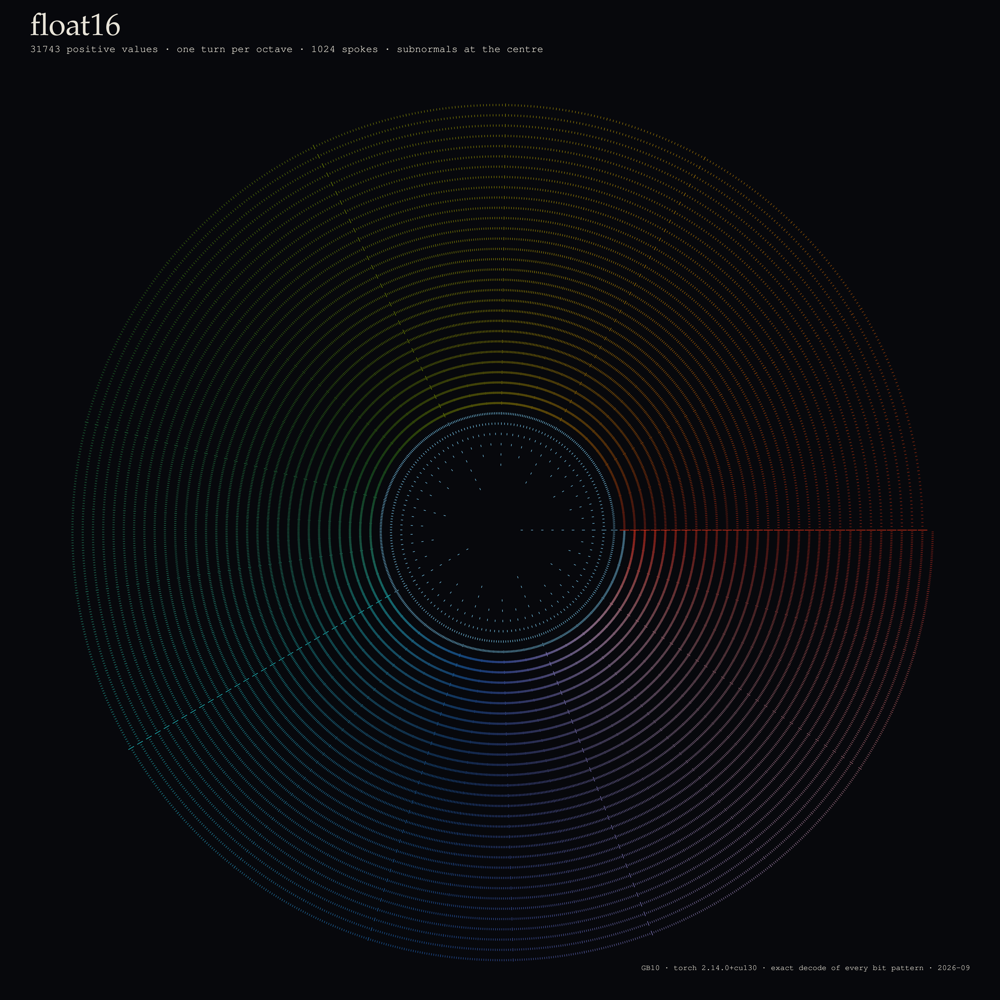
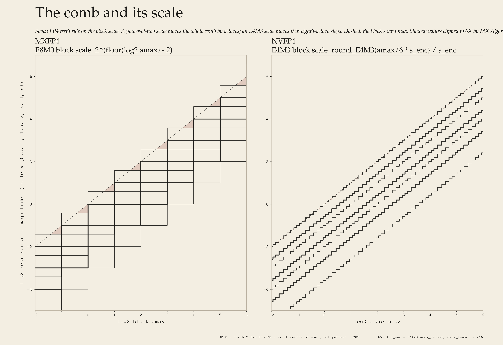

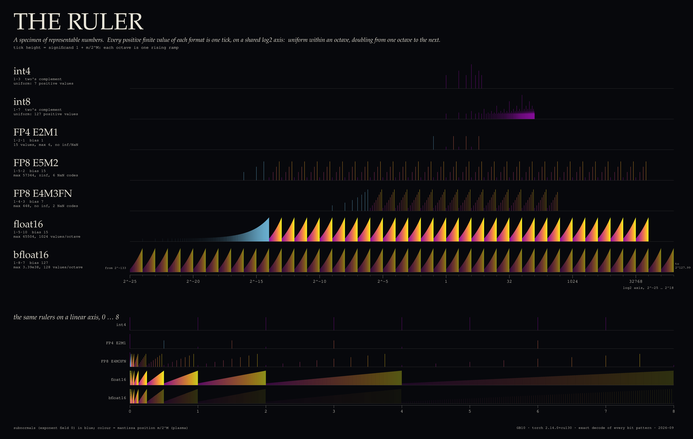

## The phenomenon

A binary floating-point value with E exponent bits and M mantissa bits is

    normal     v = (-1)^s · 2^(e - bias) · (1 + m / 2^M),      e = 1 … 2^E − 2 (or −1 for some formats)
    subnormal  v = (-1)^s · 2^(1 - bias) · (m / 2^M),          e = 0

Inside one exponent the 2^M values are evenly spaced (linear). Going up one exponent multiplies every value by exactly 2: **v(e+1, m) = 2·v(e, m)**. So the set of floats is a comb that is linear locally and logarithmic globally, with density ∝ 1/|x|. The statement is exact, and every picture here is a rendering of the decoded bit patterns (`verify_formats.py` checks it for E4M3: identity holds for all e = 1…13).

Two places break the self-similarity. At the **top** the range ends: E4M3FN's last octave has only 7 values (256 … 448), because the all-ones pattern is NaN. At the **bottom**, subnormals fill [0, smallest normal] with the *same spacing* as the lowest normal octave. That makes the floor a translated copy of the lowest octave, not a scaled one.

Block-scaled 4-bit formats put a per-block scale in front of the 15-value FP4 comb {0, ±0.5, ±1, ±1.5, ±2, ±3, ±4, ±6}. On a log axis a scale *translates* the comb. MXFP4's E8M0 scale is a pure power of two, so it can move the comb only in whole octaves. NVFP4's E4M3 scale has 8 steps per octave.

## Gallery

### Type specimen: one ruler per format on a shared log2 axis

| | |
|---|---|
| 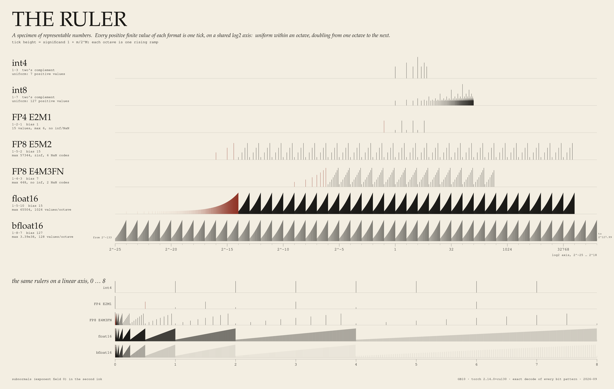 |  |
| **engraved, sawtooth.** Tick height = significand 1 + m/2^M, so every octave is one ramp. float16/bfloat16 become rows of identical teeth. Bottom band: the same rulers on a linear 0…8 axis, where each ramp stretches 2× per octave. | **observatory, sawtooth.** Same data. Colour = mantissa position m/2^M (plasma). Subnormals in blue. |
| 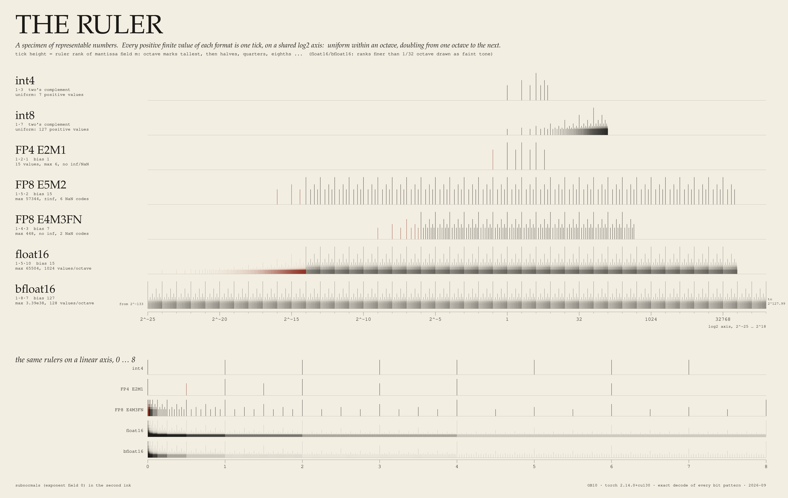 | 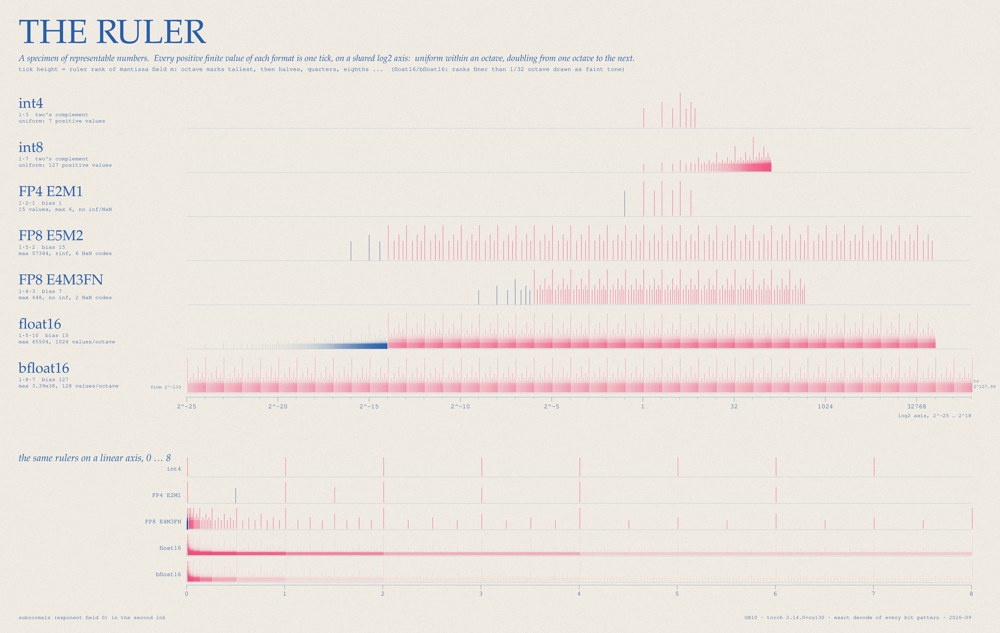 |
| **engraved, ruler.** Tick height = ruler rank of the mantissa field (octave marks tallest, then halves, quarters …). For float16/bfloat16, ranks finer than 1/32 octave are drawn as a faint tone so the ruler still reads. | **riso, ruler.** Two spot inks: pink = normal values, blue = subnormals, rules and type, with deliberate 5 px misregistration. |

Also available: `specimen_observatory.png`, `specimen_riso_sawtooth.png`.
Measured/exact: tick positions and heights. Aesthetic: inks, fonts, ink-accumulation gain, grain, misregistration.

### Nautilus: a log spiral, one turn per octave

angle = 2π·log2 v, radius grows one ring per octave. Because v(e+1, m) = 2·v(e, m), all octaves land on the same angles and the ticks stack into **exactly 2^M straight spokes**: 2 for FP4, 4 for E5M2, 8 for E4M3, 128 for bfloat16, 1024 for float16. The spoke counts are computed (distinct `frexp` mantissas), not assumed. Near the centre the evenly spaced subnormals dissolve the spokes. Integers do not form a comb: n and m share an angle only when n/m is a power of two, so int8's 127 values scatter over 64 angles with 1–7 ticks each. (A reviewer expected FP4 to show 4 spokes; it shows 2, because FP4 has 2 significands, 1.0 and 1.5.)

| | | |
|---|---|---|
|  | 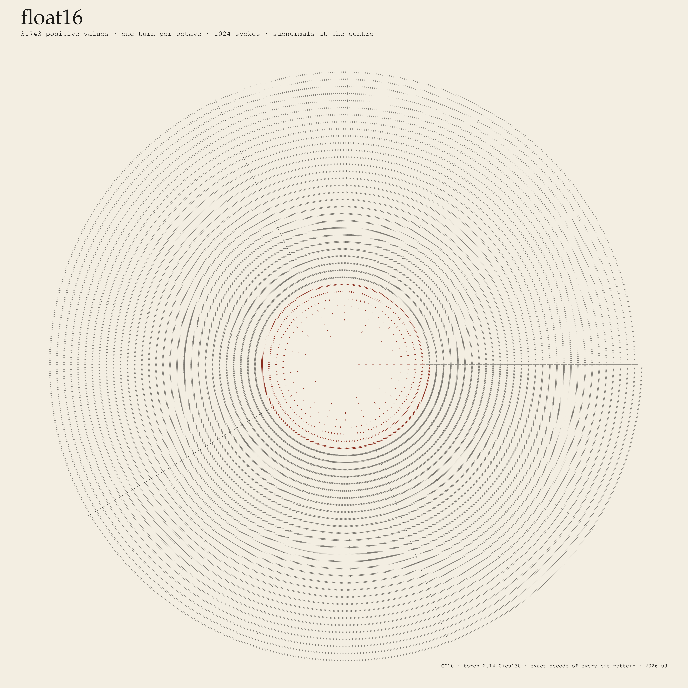 | 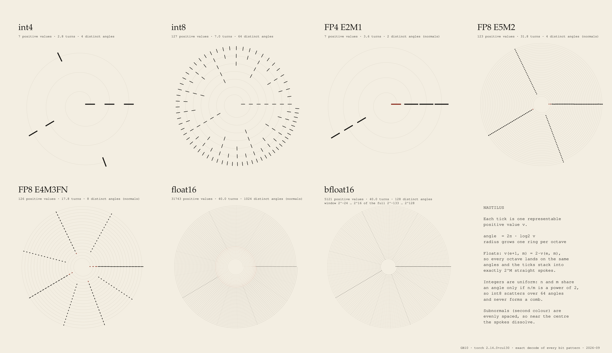 |
| **float16 hero, observatory.** 31,743 positive values, 40 turns. Colour = mantissa position = angle, on a cyclic map (colorcet C6), because this quantity really is cyclic. Tick length and opacity follow ruler rank. | **float16 hero, engraved.** Subnormals in red at the centre. | **specimen sheet, engraved.** All 7 formats. bfloat16 is shown over the window 2^-24 … 2^16 (40 of its 261 turns). |

Also available: `nautilus_sheet_observatory.png`, `nautilus_sheet_riso.png`.

### Octave zoom and octave stack (the exact proof)

<video src="gallery/octave_zoom_observatory.mp4" autoplay loop muted playsinline width="100%"></video>

`octave_zoom_observatory.mp4` / `.gif` / `octave_zoom_engraved.mp4`: the window [0, W] shrinks 2× per octave from W = 2^9 to 2^-26 (35 octaves, 36 frames/octave, 30 fps). E4M3, E5M2 and float16 redraw the same picture every octave until the window reaches the top of their range or their subnormal floor. The caption on each row is **computed per frame**: it compares the exact tick set in [W/64, W] with the set one octave earlier. That flag reads "identical" for E4M3 at W = 2^8 … 2^1, for E5M2 at 2^9 … 2^-7, and for float16 at 2^9 … 2^-7. The subnormal floor breaks it below those.

| | | |
|---|---|---|
| 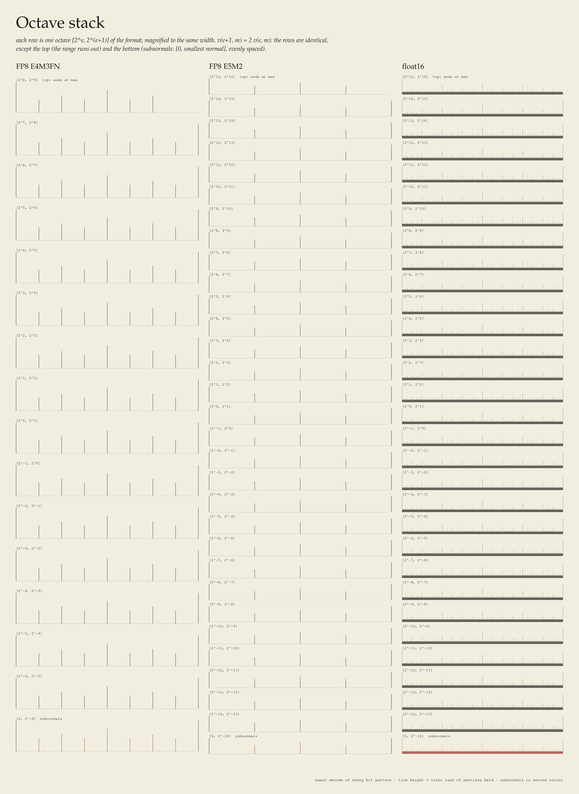 | 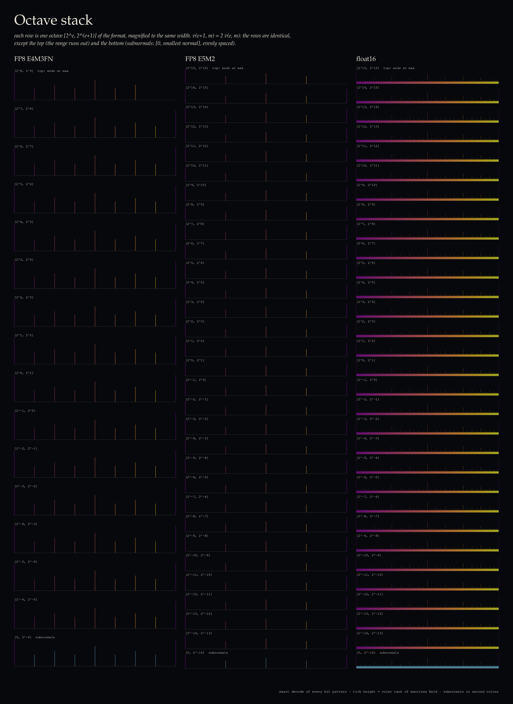 | 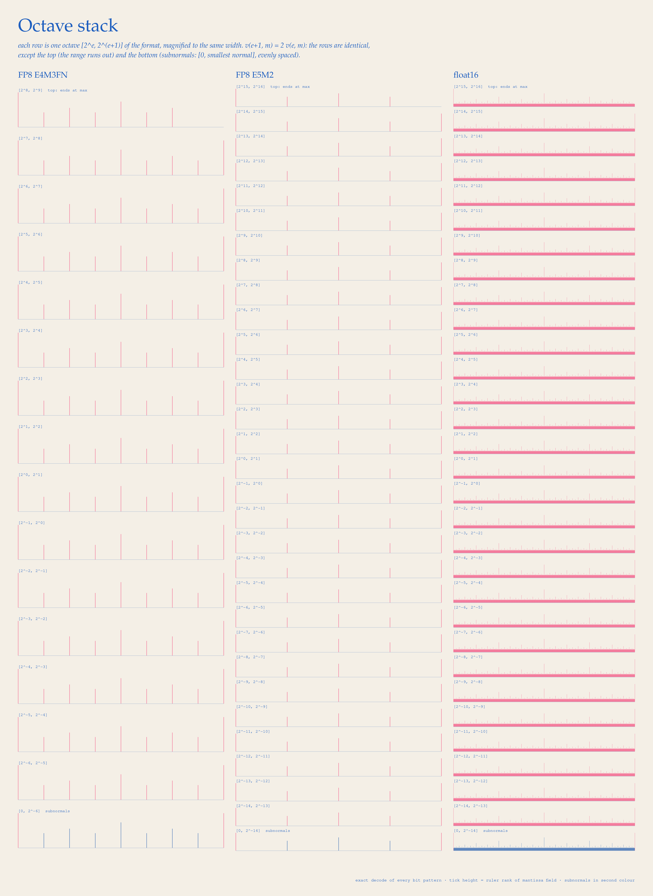 |

**Octave stack.** Every octave [2^e, 2^(e+1)] of E4M3, E5M2 and float16, magnified to the same width and stacked. All rows are identical except the top one (range ends) and the bottom one (the subnormal interval [0, 2^emin], which has the same spacing and is therefore visually the same row again, in the second ink). This is the proof plate: repetitive by design.

### Block scales: sliding the FP4 comb

| | | |
|---|---|---|
|  | 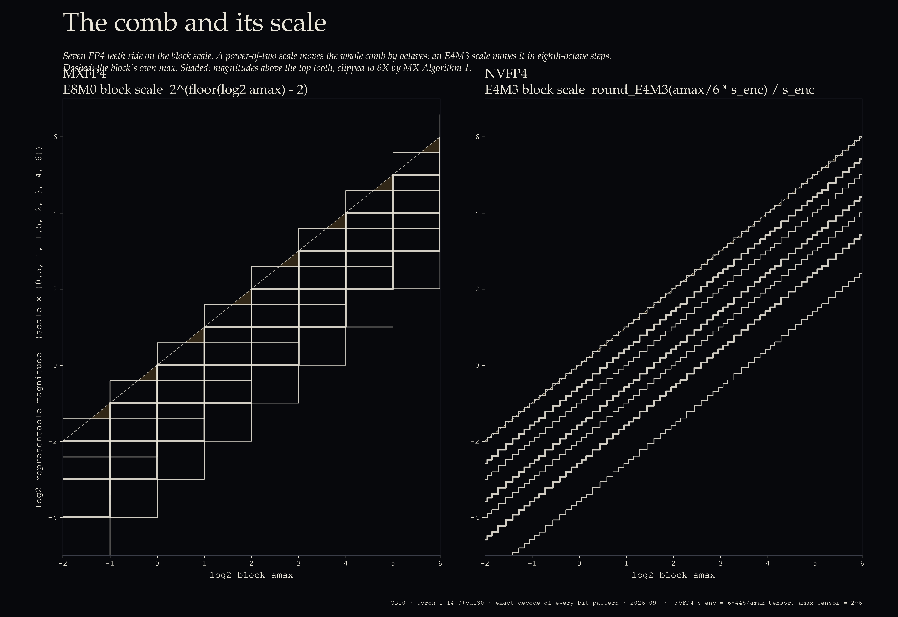 | 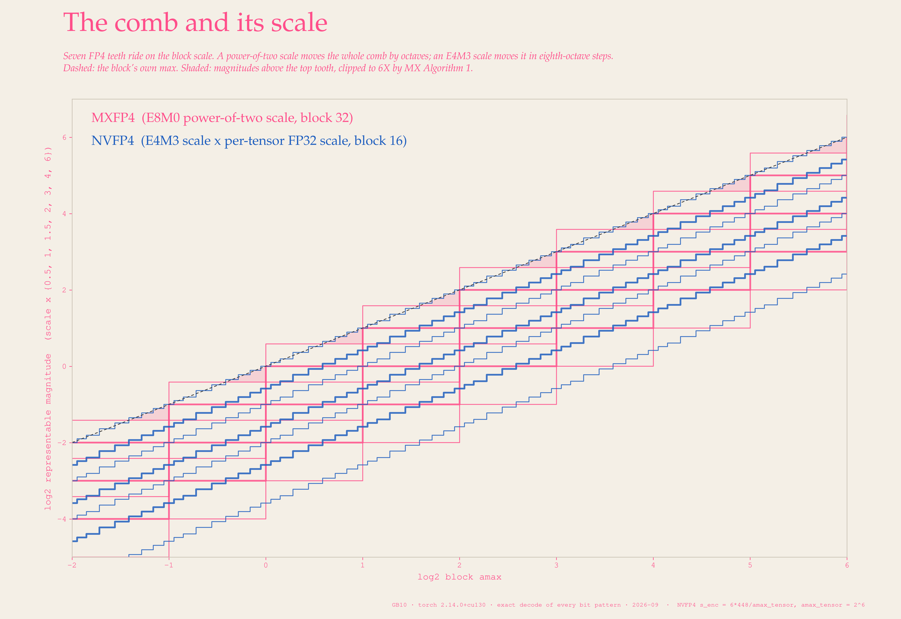 |

**The comb and its scale.** x = block amax (log2), y = the 7 positive representable magnitudes scale × {0.5, 1, 1.5, 2, 3, 4, 6}. MXFP4 (OCP MX v1.0 reference Algorithm 1: X = 2^(floor(log2 amax) − 2)) is an octave staircase. The shaded triangles are magnitudes between 6X and amax, which that algorithm clips to 6X. For amax in [6·2^k, 8·2^k) the top of the block is clipped every time. NVFP4 (block scale = round_E4M3(amax/6 · s_enc)/s_enc, with s_enc = 6·448/amax_tensor) is an eighth-octave staircase whose top tooth tracks amax. The riso version overprints both formats in two inks.

<video src="gallery/blockscale_slide.mp4" autoplay loop muted playsinline width="100%"></video>

`blockscale_slide.mp4` / `.gif`: a fixed 32-value Laplace block × gain 2^u, u sweeping 0 → 4 → 0. Row 1 is MXFP4 (one block of 32, one E8M0 scale). Rows 2 and 3 are NVFP4 (two blocks of 16, each with its own E4M3 scale). Every value is connected to the tooth it quantises to. Bottom panels: top-tooth staircase and relative MSE over the sweep. **Measured on this sweep:** MXFP4 used 5 distinct scale codes and NVFP4 33. Mean relative MSE was 0.0168 (MXFP4) vs 0.0100 (NVFP4). The largest value was clipped in 43% of MXFP4 frames. These are illustrative numbers for one synthetic block, not a benchmark.

## What was computed

Everything is exact enumeration on CPU. No GPU, no timing.

| script | does |
|---|---|
| `formats.py` | generic minifloat decoder (E, M, bias, special-value convention) |
| `verify_formats.py` | decodes every bit pattern; cross-checks against torch/numpy; writes `cache/formats.npz`, `cache/verification.json` |
| `render_specimen.py [engraved observatory riso]` | specimen sheets (7200×4560) |
| `render_spiral.py sheet\|hero [styles]` | nautilus sheets (7800×4500) and float16 heroes (5400²) |
| `render_zoom.py stills\|video [styles]` | octave stacks (5400×7400), zoom MP4/GIF (1920×1080, 1261 frames) |
| `compute_blockscale.py` → `render_blockscale.py fan\|video` | MX/NV block-scale sweep (720 frames) and fan plates |
| `raster.py`, `plate.py` | ink-accumulation tick rasteriser, styles |

Reproduce: `cd hardware/float-ruler && P=/home/fzeng/ml/research/art/.venv/bin/python; $P verify_formats.py && $P render_specimen.py && $P render_spiral.py sheet engraved observatory riso && $P render_spiral.py hero && $P render_zoom.py stills && $P render_zoom.py video && $P compute_blockscale.py && $P render_blockscale.py fan && $P render_blockscale.py video`. Total wall time is about 25 min on 4 cores. Stack: GB10 (aarch64), torch 2.14.0+cu130, numpy 2.5.3, matplotlib, colorcet, cmcrameri.

## Verification / honesty

**Decoded formats vs torch/numpy.** Each was decoded by bit enumeration and compared with the same bits reinterpreted by torch/numpy. All matched exactly:

| format | layout (s/e/m, bias) | distinct finite values | max | min normal | min subnormal | spacing at 1 | NaN / inf patterns | check |
|---|---|---|---|---|---|---|---|---|
| FP4 E2M1 | 1/2/1, 1 | 15 | 6 | 1 | 0.5 | 0.5 | 0 / 0 | = OCP table {0, .5, 1, 1.5, 2, 3, 4, 6} |
| FP8 E4M3FN | 1/4/3, 7 | 253 | 448 | 2^-6 | 2^-9 | 0.125 | 2 / 0 | = `torch.float8_e4m3fn` view, `finfo` |
| FP8 E5M2 | 1/5/2, 15 | 247 | 57344 | 2^-14 | 2^-16 | 0.25 | 6 / 2 | = `torch.float8_e5m2` view, `finfo` |
| float16 | 1/5/10, 15 | 63487 | 65504 | 2^-14 | 2^-24 | 2^-10 | 2046 / 2 | = numpy and torch views |
| bfloat16 | 1/8/7, 127 | 65279 | 3.3895e38 | 2^-126 | 2^-133 | 2^-7 | 254 / 2 | = torch view, `finfo` |
| float32 | 1/8/23, 127 | — | — | — | — | — | — | 4M random patterns = numpy |
| E8M0 (MX scale) | 8-bit exponent, bias 127 | 255 | 2^127 | — | 2^-127 | — | 1 (0xFF) / 0 | = `torch.float8_e8m0fnu` |

**Doc claims checked.**
- §2's table is correct: FP4 has 15 values ±{0, .5, 1, 1.5, 2, 3, 4, 6}, E4M3FN max 448 with no inf, E5M2 max 57344, and the bit layouts of fp16 and bf16 are right. It omits the special-value counts listed above.
- "bf16 = fp32's range" is approximately right: bf16 max is 3.3895e38, fp32 max 3.4028e38.
- Note that `torch.finfo(float8_e4m3fn).tiny` reports the smallest *normal* value (2^-6); subnormals go down to 2^-9.
- **MXFP4** (Rouhani et al. 2023, Table 1; OCP MX v1.0 via FPRox's summary, since the OCP PDF itself returned 403): block 32, E8M0 scale (bias 127, 0xFF = NaN, no zero or inf encoding), E2M1 elements with no inf/NaN. The doc is correct.
- **NVFP4** (NVIDIA blog "Introducing NVFP4…"; arXiv:2509.25149): block 16, E4M3 block scale, FP32 per-tensor scale s_enc = 6·448/amax. The doc is correct.
- The E4M3 vs E4M3FN distinction matters: this is the FN variant, where the all-ones pattern is NaN, so the top octave is truncated at 448.

**Self-similarity.** This is exact algebra, not an empirical fractal claim, so no box counting was done. The comb is a discrete set with a finite number of octaves, so it has no fractal dimension. The self-similarity is the exact identity v(e+1, m) = 2v(e, m), verified by array equality, plus the per-frame tick-set comparison in the zoom video.

**Didn't work / changed.**
- The first specimen draft drew float16/bfloat16 ticks as vector hairlines, which saturated into black bars. Replaced with an ink-accumulation rasteriser plus rank-based thinning or the sawtooth encoding.
- A 4×4 grid of zoom frames was repetitive and unreadable; replaced by the octave stack.
- bfloat16's full spiral (261 turns) moirés into grey at print size, so the sheet shows a 40-octave window, stated on the plate.

## Ideas explored / not pursued
- **Nautilus "grow" animation**: code exists (`render_spiral.py grow`) but was not rendered, for time.
- **2D representable-pair lattice** (FP8 x × y as a point grid): not rendered. The octave stack and nautilus carried the same message more clearly. It is a natural next plate (log-log it is an exact tiling of identical 8×8 tiles).
- **FP6 (E2M3/E3M2), MXINT8, NF4**: decodable with `formats.py` but not drawn.
- **Real LLM-weight blocks** instead of a synthetic Laplace block for the slide: left to §4 *Block Error*.

## Caveats
- The block-scale MSE numbers are for one synthetic block and the reference conversion recipes. Both specs allow other recipes: MX implementations may use ceil or a search for the shared exponent, and NVFP4 tooling may use MSE-optimal scales. Don't read the MSE numbers as a format comparison.
- "Density ∝ 1/|x|" holds for normal floats only. Subnormals are uniform.
- Colours are declared choices. The only cyclic colormap is used where the quantity is genuinely cyclic (angle on the spiral).

## References
- OCP Microscaling Formats (MX) Specification v1.0 (2023). Values cross-checked through Rouhani et al., "Microscaling Data Formats for Deep Learning", arXiv:2310.10537 (Table 1, Algorithm 1), and FPRox, "OCP MX Scaling Formats".
- NVIDIA Technical Blog, "Introducing NVFP4 for Efficient and Accurate Low-Precision Inference" (2025); NVIDIA, "Pretraining Large Language Models with NVFP4", arXiv:2509.25149.
- Micikevicius et al., "FP8 Formats for Deep Learning", arXiv:2209.05433.
- Goldberg, "What Every Computer Scientist Should Know About Floating-Point Arithmetic", ACM Computing Surveys, 1991.
- IEEE 754-2019.
