# Divergence: the same chaotic computation in different precisions

*A float with m mantissa bits tells the truth about a chaotic orbit for about m steps. After that, because the format has only finitely many states, every orbit falls into a cycle. For float16 and bfloat16 that cycle structure can be drawn completely.*

<p align="center">
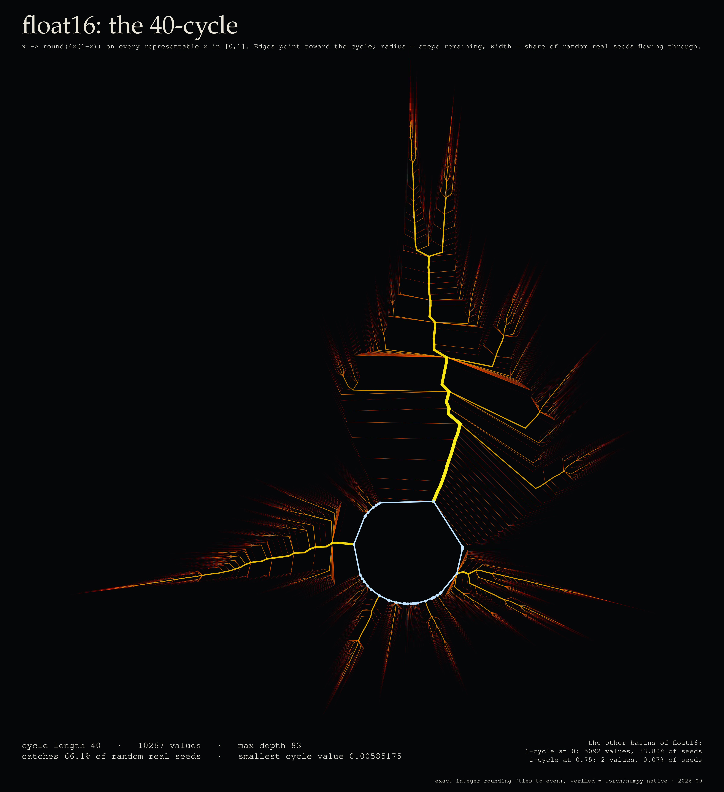
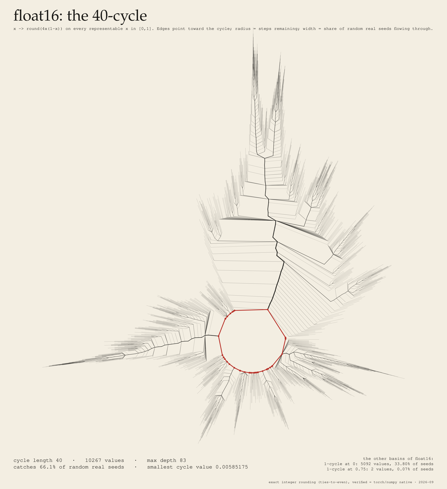
</p>

## The phenomenon

The logistic map at r = 4, x_{n+1} = 4 x_n (1 − x_n), is chaotic with Lyapunov exponent exactly ln 2. On average, a small error doubles every step. A binary float with p = m + 1 significand bits makes a rounding error of order 2^-p at every step, so its orbit should leave the true orbit after about **m steps**: 7 (bfloat16), 10 (float16), 23 (float32), 52 (float64).

A float format is also a **finite set**. The map x ↦ round(4·x·(1 − x)) sends that set into itself, so it is a *functional graph*: every state has exactly one successor, every orbit is eventually periodic, and the whole state space splits into basins, each one a cycle with trees draining into it. float16 has 15,361 values in [0, 1] and bfloat16 has 16,257, so the graph can be computed **exactly** and drawn completely. Chaos theory (Grebogi, Ott & Yorke 1988; Beck & Roepstorff 1987) predicts that a chaotic map on a lattice behaves like a random map on N_eff effective states. A random map on N states has about √(πN/2) states on cycles.

## Hero: every orbit ends in a cycle (float16)

<p align="center">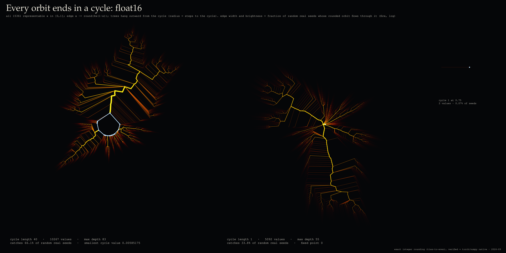</p>

**float16, complete census.** 15,361 states, 3 cycles:

| cycle | states in basin | share of random real seeds | max depth |
|---|---|---|---|
| 40-cycle (smallest value 0.00585175) | 10,267 | **66.1%** | 83 |
| fixed point 0 | 5,092 | **33.8%** | 55 |
| fixed point 0.75 | 2 | 0.07% | 1 |

**bfloat16:** the fixed point 0 takes 14,797 states and **91.9%** of seeds. The 4-cycle at 0.2754 takes 1,395 states and 7.5%; the fixed point 0.75 takes 65 states and 0.6%.

The share of seeds (called "traffic" below) is exact: it is the Lebesgue measure of the real seeds in [0, 1] whose rounded orbit passes through each edge. In the rivers style it sets edge width and brightness.

## Gallery

### Functional graph: single-basin prints

| | | |
|---|---|---|
|  |  | 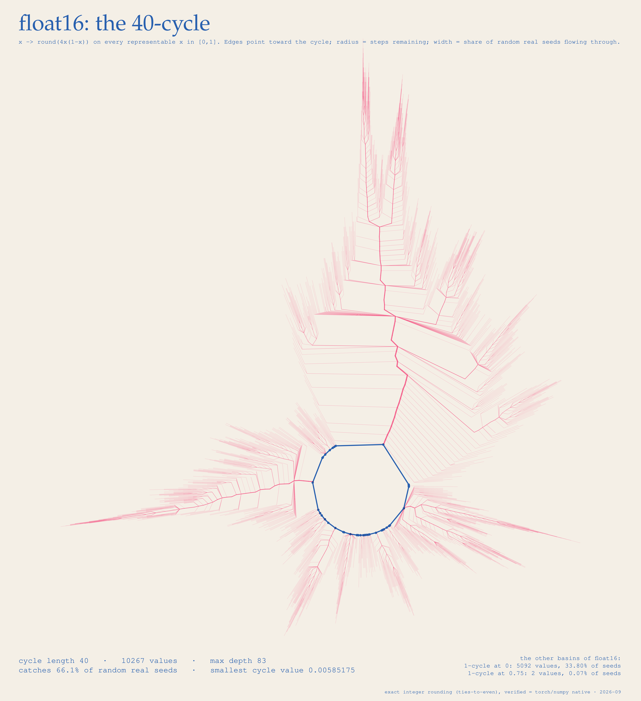 |
| float16 40-cycle, **rivers** (edge width ∝ traffic^½; colour = log traffic on colorcet *fire*) | **plotter** (black ink, cycle in red) | **riso** (pink trees, blue cycle, 5 px misregistration) |
| 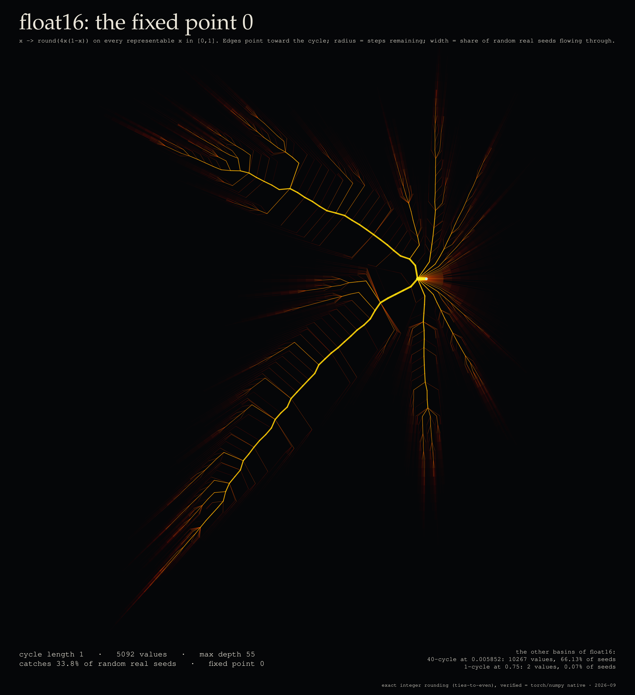 | 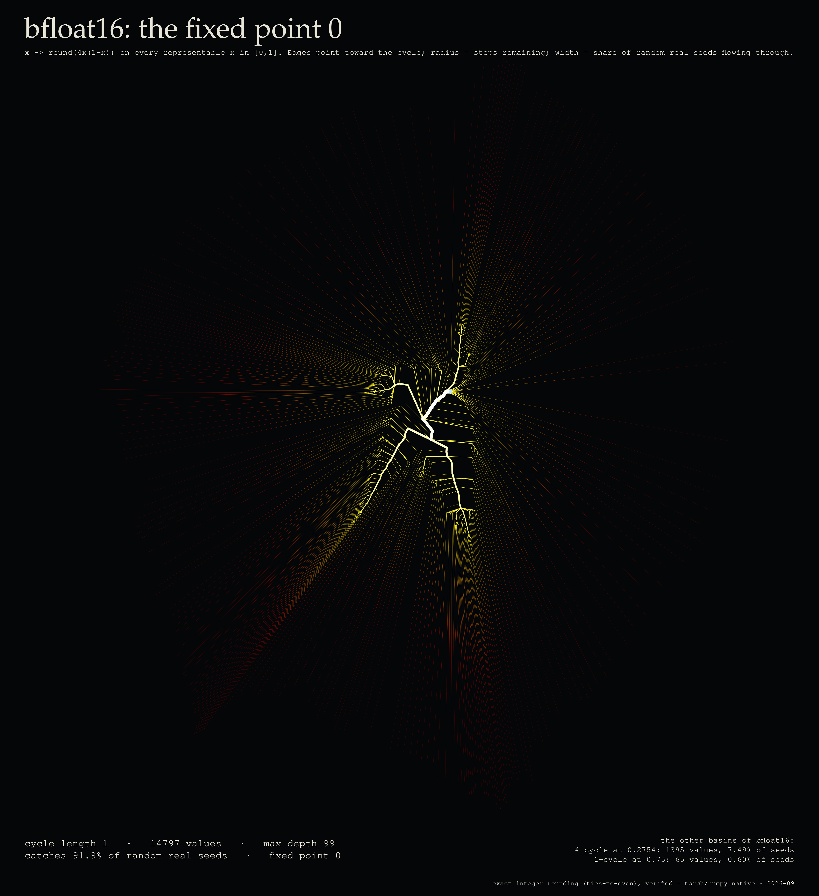 | 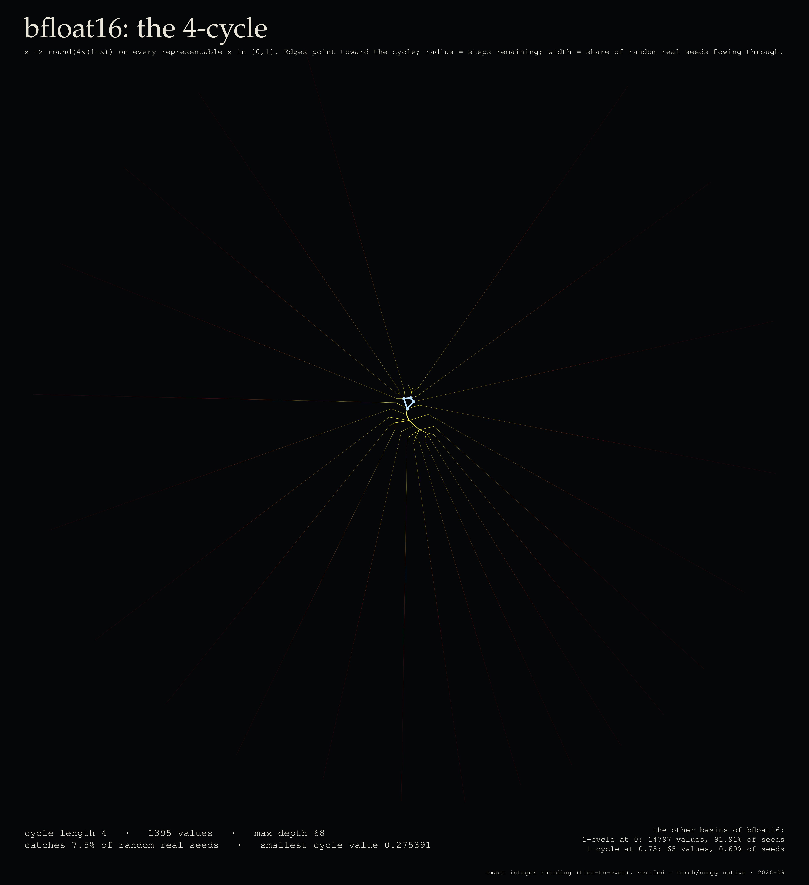 |
| float16 basin of **0** (33.8% of seeds). The dark fan next to the root is x = 1, which maps to 0 and has 46 preimages: every float16 x close enough to 0.5 rounds 4x(1−x) up to exactly 1. | bfloat16 basin of **0** (91.9%). The faint sunburst rays are the tiny-number ladders x → 4x (see below). | bfloat16 4-cycle (7.5%) |

Also available: `hero_float16_c0_plotter.png`, `hero_bfloat16_c0_plotter.png`, `hero_bfloat16_c1_plotter.png`.
Full-census plates (all basins side by side): `graph_{float16,bfloat16,FP8_E4M3,FP8_E5M2}_{rivers,plotter,riso}.png`.

**Exact:** nodes, edges, cycles, depth, traffic. **Declared layout:** each cycle sits on a ring. Trees hang outward with radius = steps to the cycle, and each subtree gets an angular wedge ∝ (leaf count)^0.75. Children are ordered heaviest-in-the-middle. An earlier value-ordered layout produced long straight "rungs" between a spine and its leaves; that was a layout artefact, fixed by this ordering. The parallel strands that remain are data: chains of in-degree-1 states, 75% of float16's states and 97% of bfloat16's.

### Braid, cable, river delta

| | |
|---|---|
| 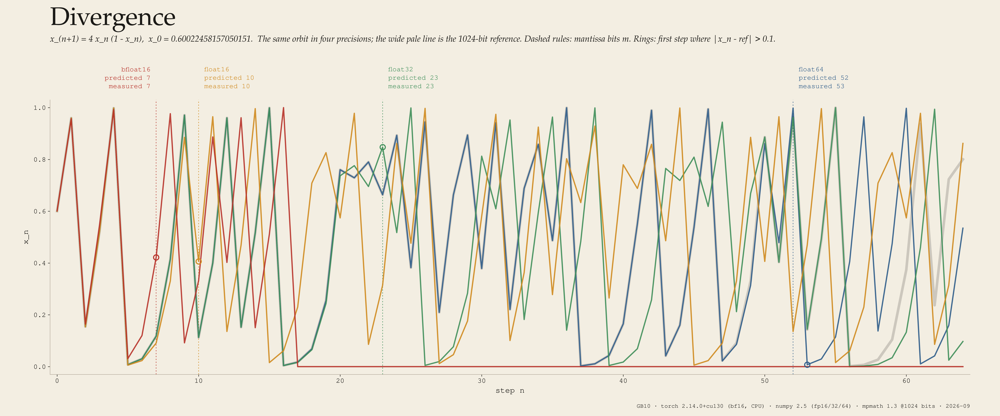 | 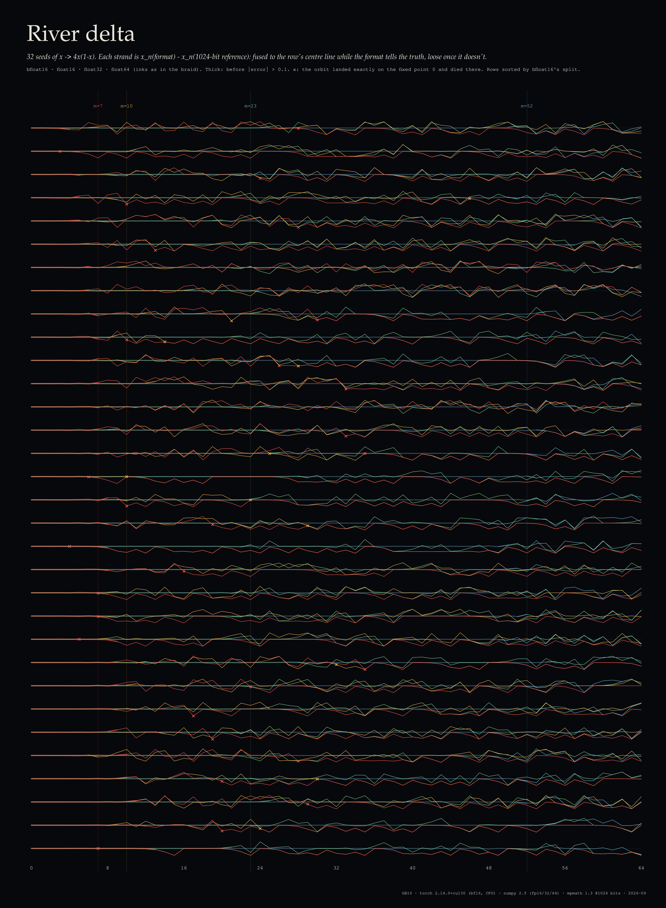 |
| **Braid** (paper; also `braid_observatory.png`, `braid_riso.png`). One seed, x_0 = 0.60022458157050151, chosen as the seed closest to the median divergence step in every format. Four precisions plus the 1024-bit reference (pale). Rings mark the measured split: 7 / 10 / 23 / 53. At step 17 the **bfloat16 orbit lands exactly on 0 and stays there forever**: a chaotic orbit dies on a representable fixed point. That event links the braid to the graph above. | **River delta: cable** (observatory; also `_paper`, `_riso`). 24 seeds. Each strand is x_n(format) − x_n(reference). Before |error| > 0.1 the formats are drawn as nested bands of one cable (bf16 outermost, fp64 core). After the split each strand is thin and fades over about 8 steps. × marks an orbit that reached the fixed point 0. |
| 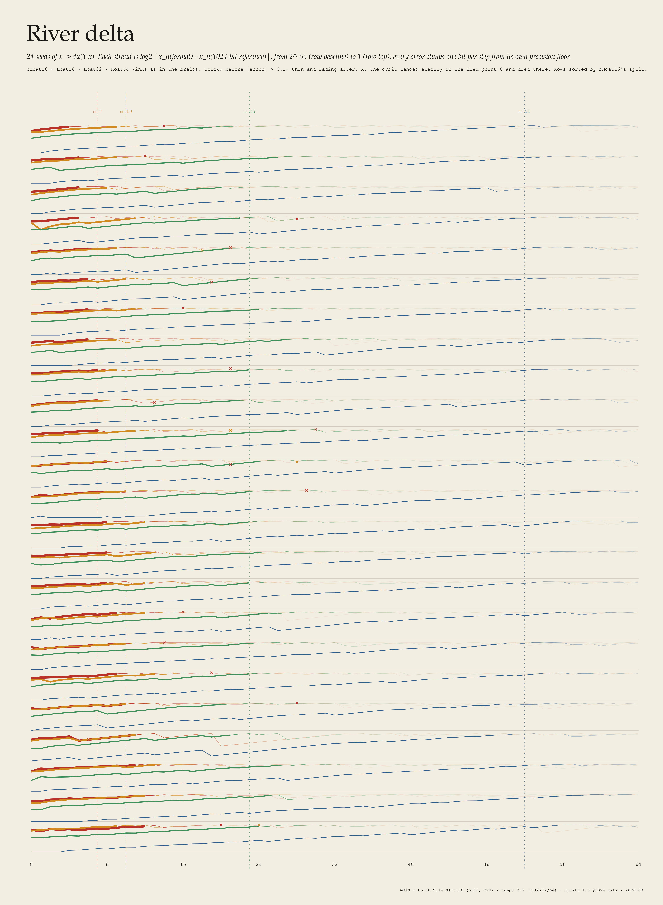 | 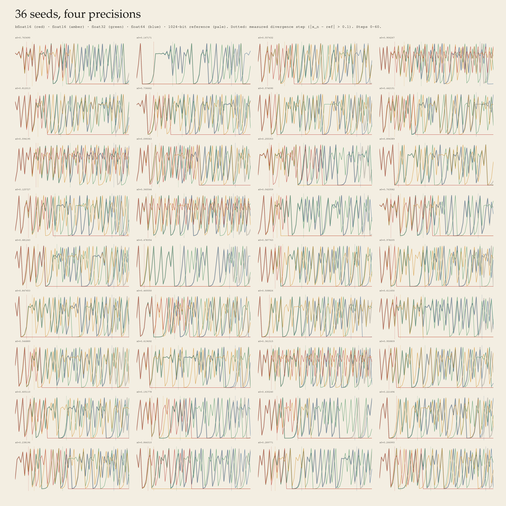 |
| **River delta: log error** (`river_delta_*_log.png`). Strand height = log2 \|error\| from 2^-56 to 1. Every format's error climbs one bit per step from its own precision floor: four parallel ramps per row. | **36 seeds** small multiples (`braid_grid_{paper,observatory}.png`). |

### Measurements

| | |
|---|---|
| 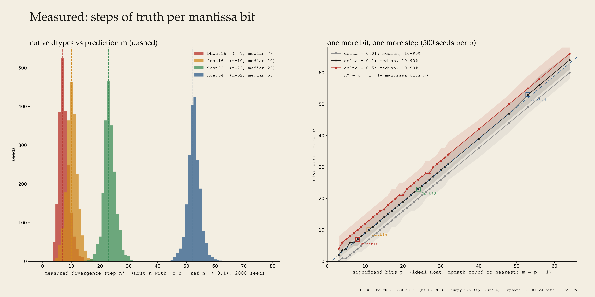 | 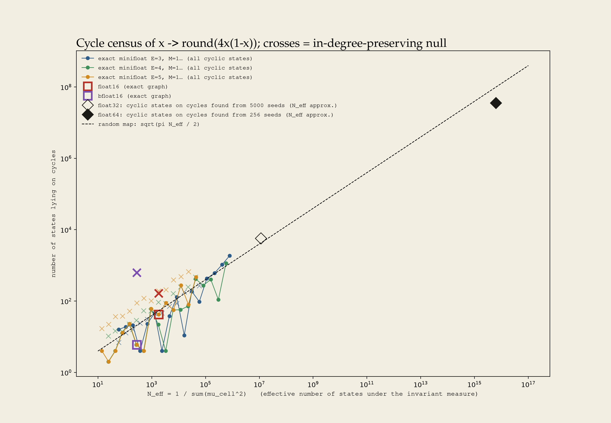 |
| Divergence-step distributions (2000 seeds) and the one-bit-one-step sweep over ideal p-bit floats | Cycle census vs random-map theory across 16 orders of magnitude of N_eff |
| 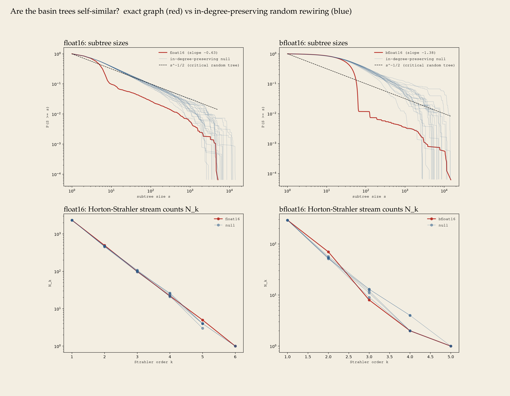 | 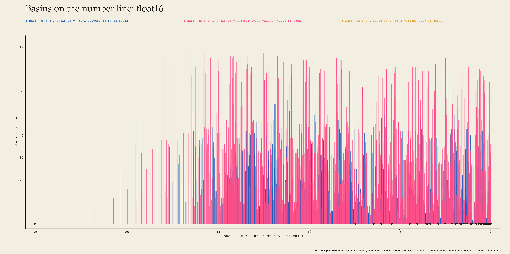 |
| Are the trees self-similar? (subtree sizes, Horton–Strahler), vs null | Basin-coloured number line on log2 x (also `basin_line_bfloat16_plotter.png`); secondary plate |

### Precision floor of a fractal (Mandelbrot, float32 vs float64 vs binary128)

<video src="gallery/mandel_floor_zoom.mp4" autoplay loop muted playsinline width="100%"></video>

`mandel_floor_zoom.mp4` / `.gif`: seahorse valley, c = −0.743643887037151 + 0.131825904205330i. The frame zooms from width 3 to 3 × 10⁻¹⁵ over 480 frames, with float32 on the left and float64 on the right. Every quantity is computed in the stated type, **including the pixel coordinates** c = centre + (i − W/2 + ½)·width/W. The overlays give the measured number of distinct pixel x-coordinates and the share of pixels whose escape count differs.

| | | |
|---|---|---|
| 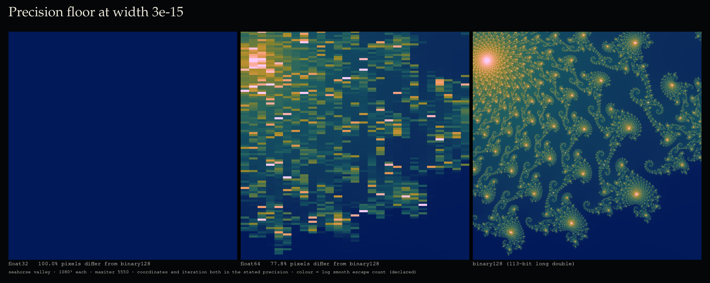 | 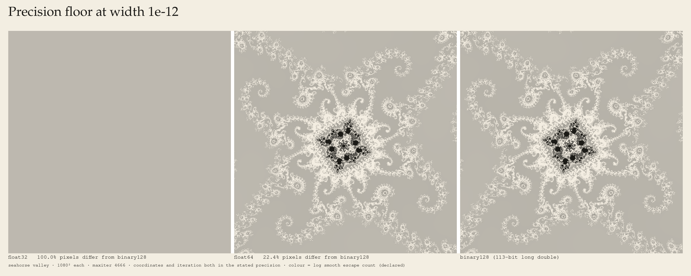 | 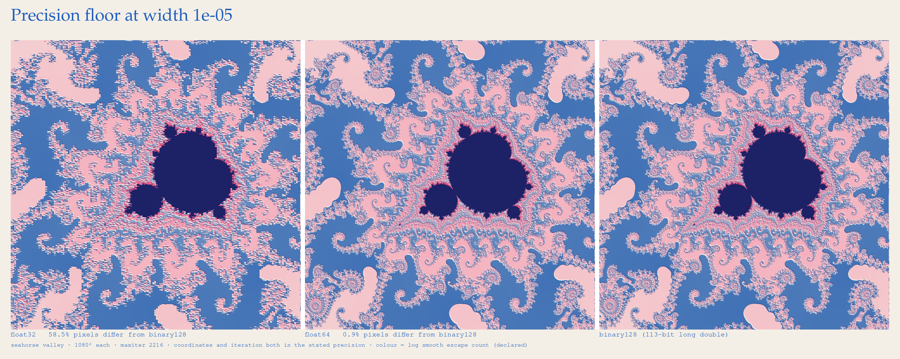 |
| **width 3e-15, dark** (batlow on log smooth count). float32 is a single colour. float64 has dissolved into rectangular blocks. binary128 still resolves the spirals. | **width 1e-12, paper** (14 iso-bands of log count, one ink). float32 is empty; float64 and binary128 look identical. | **width 1e-5, riso** (two inks by band parity). float32's horizontal smear appears first: x ≈ 0.74 has 8× coarser spacing than y ≈ 0.13. |

All widths × styles: `mandel_floor_{1e-05,1e-12,3e-14,3e-15}_{dark,paper,riso}.png`; measured curves: `mandel_floor_curve.png`.

## What was computed

| script | does | wall |
|---|---|---|
| `minifloat.py`, `test_minifloat.py` | exact integer, correctly rounded (ties-to-even) 4x(1−x) on any binary minifloat; checks against Fractions, numpy float16, torch bfloat16 (CPU and CUDA), numpy float32 | 1 min |
| `graph.py`, `compute_graphs.py` | functional graphs of FP4, E5M2, E4M3, float16, bfloat16 (two evaluation orders); minifloat family E∈{3,4,5}, N ≤ 5M; null models | 3 min |
| `compute_layout.py`, `layout.py`, `render_graph.py` | traffic, radial layouts, plates and single-basin prints | 5 min |
| `analyze_trees.py`, `analyze_scaling.py` | self-similarity diagnostics; cycle scaling | 2 min |
| `orbit_cycles.c` | Brent cycle detection, float32 (5000 seeds) and float64 (256 seeds), OpenMP | 3 min |
| `compute_divergence.py`, `render_braid.py` | 2000 seeds × 120 steps in bf16/fp16/fp32/fp64 plus mpmath (1024 bits, checked at 2048); ideal p-bit floats p = 3…64 (500 seeds) | 4 min |
| `mandel.c`, `compute_mandel.py`, `render_mandel.py` | Mandelbrot zoom 3 → 3e-15, 480 frames of 960×1080 in f32 and f64; 1080² stills in binary128 | ~45 min (zoom, 4 threads) + ~10 min (binary128 stills) |

Reproduce (from `hardware/precision-divergence`, `P=/home/fzeng/ml/research/art/.venv/bin/python`):
```
$P test_minifloat.py && $P compute_graphs.py && $P compute_layout.py && $P analyze_trees.py
gcc -O2 -ffp-contract=off -fopenmp orbit_cycles.c -o cache/orbit_cycles
./cache/orbit_cycles f32 5000 1 > cache/cycles_f32.tsv && ./cache/orbit_cycles f64 256 1 > cache/cycles_f64.tsv
$P analyze_scaling.py && $P compute_divergence.py
$P render_graph.py graph && for s in "float16 1" "float16 0" "bfloat16 0" "bfloat16 1"; do $P render_graph.py hero $s; done
$P render_graph.py line plotter float16 bfloat16
$P render_braid.py braid && $P render_braid.py grid && $P render_braid.py measure && $P render_braid.py delta
gcc -O2 -ffp-contract=off -fopenmp mandel.c -o cache/mandel -lm
$P compute_mandel.py zoom && $P compute_mandel.py deep && $P render_mandel.py video && $P render_mandel.py stills && $P render_mandel.py curve
```
Everything ran on CPU (GB10 Grace, aarch64). The only GPU use was a one-off pointwise check that CUDA float16/bfloat16 4x(1−x) equals the exact result (it does, all 15,361 / 16,257 states). Stack: torch 2.14.0+cu130, numpy 2.5.3, mpmath 1.3.0, gcc (aarch64, `long double` = IEEE binary128).

## Verification / honesty

**Arithmetic is what we think it is.**
- The exact integer rounding matches brute-force Fraction rounding on E4M3, E3M2 and E4M4.
- On all states it matches numpy float16 (0 mismatches / 15,361), torch CPU and CUDA float16 (0), torch CPU and CUDA bfloat16 (0 / 16,257), and numpy float32 on 20,000 random states (0).
- mpmath at p = 53 reproduces numpy float64 orbits bit for bit, and p = 24 reproduces float32. No upcasting and no FMA: the C code is compiled with `-ffp-contract=off`.

**Divergence: "≈ m steps" confirmed.**
Median divergence step n\*(δ = 0.1) over 2000 seeds (10–90% range):

| format | m | protocol A (double seed rounded on input) | protocol B (bf16-representable seed) |
|---|---|---|---|
| bfloat16 | 7 | **7** (6–10) | 8 (6–11) |
| float16 | 10 | **10** (8–13) | 11 (9–14) |
| float32 | 23 | **23** (21–26) | 25 (23–29) |
| float64 | 52 | **53** (50–55) | 56 (54–59) |

- The threshold shifts n\* by log2 of the ratio: δ = 0.01 gives about −3 steps and δ = 0.5 about +3, so "m steps" is exact for δ ≈ 0.1.
- Over ideal p-bit floats the median n\*(0.1) = p − 1 for 8 ≤ p ≤ 48, a slope of one step per bit.
- Protocol B has no input rounding and gains about 1–3 steps.

**Finite-precision death at 0.** Share of orbits sitting exactly on 0 by step 120: bf16 91.9%, fp16 34.3%, fp32 1.5%, fp64 0%. Longer-run shares from Brent cycle detection: fp32 18.9%, fp64 15.2%. The path is an x close enough to 0.5 that 4x(1−x) rounds to exactly 1, then 1 → 0 (the braid seed: 0.51171875 → 1 → 0 at step 17), or an underflow.

**Cycle census across formats.**

| format | states in [0,1] | cycles (length: share of seeds) |
|---|---|---|
| FP8 E4M3 | 57 | 0: 90%, 0.75: 10% |
| FP8 E5M2 | 61 | 0: 57%, 2-cycle: 22%, 0.75: 21% |
| float16 | 15,361 | 40: 66.1%, 0: 33.8%, 0.75: 0.07% |
| bfloat16 | 16,257 | 0: 91.9%, 4: 7.5%, 0.75: 0.6% |
| float32 (5000 seeds, Brent) | 1.07 × 10⁹ | 4344: 66.5%, 0: 18.9%, 836: 11.2%, 436: 3.3%, 136: 0.1% |
| float64 (256 seeds, Brent) | ~4.6 × 10¹⁸ | 5,638,349: 65.2%, 0: 15.2%, 14,632,801: 10.2%, 10,210,156: 3.9%, 2,441,806: 3.1%, 2,625,633: 2.0%, 234,209: 0.4% |

float64 tails are long: the median is 4.0 × 10⁷ steps before the cycle.

**Random-map theory holds, in the N_eff form.**
- With N_eff = 1/Σ μ_cell² (μ = invariant measure 1/(π√(x(1−x))) integrated over each rounding cell), the exact minifloat family (E = 3, 4, 5; up to 3.7M states) gives cyclic states ∝ N_eff^0.63, with a median ratio of 0.76 to √(πN_eff/2). The scatter is large because single formats fluctuate by up to 10×.
- float16: 42 cyclic states vs √(π·1799/2) = 53.
- float32: 5,753 states on the cycles found vs 4,247 predicted (N_eff from a continuum integral, which is approximate).
- float64: ≥ 3.6 × 10⁷ found vs 9.8 × 10⁷ predicted. Only cycles reached from 256 seeds were counted, so this is a lower bound.
- Against the in-degree-preserving null (random rewiring on the raw N states), real graphs have fewer cyclic states and shallower trees:
  - float16: 42 vs 165 ± 92 cyclic states; max depth 83 vs 278 ± 86.
  - bfloat16: 6 vs 630 ± 393 cyclic states; max depth 99 vs 832 ± 215.
- The reason is that the invariant measure concentrates the dynamics on far fewer effective states than the raw count.
- The largest basin catches 65–66% of seeds in float16, float32 and float64. Noted, not claimed as a law. It is suggestively close to the random-mapping expectation for the largest component, ≈ 0.76 of states, but the measure here is seed measure, not state count.

**Are the basin trees self-similar? Mostly no, beyond generic randomness.**
- float16's trees are statistically indistinguishable from random trees with the same in-degree sequence:
  - Subtree-size CCDF slope: −0.63 (real) vs −0.64 ± 0.06 (null). A critical random tree gives −0.5.
  - Horton–Strahler bifurcation ratios: 4.8, 4.9, 4.6, 4.4, 5.0 (real) vs about 4–6 (null).
- The constant bifurcation ratio *is* a topological self-similarity, but it is the generic one of any critical random tree. There is no extra self-similar structure from the map.
- **bfloat16 is the exception.** Its subtree-size slope is −1.38 vs −0.61 ± 0.07 for the null, because 97% of its states are in-degree-1 chains.
- Most bfloat16 states are tiny numbers (126 octaves below 1). For those, 1 − x rounds to 1, so the map is exactly x → 4x: a ladder that climbs two octaves per step until it merges into the dynamics.
- So the bfloat16 graph is dominated by a deterministic 128-mantissa × 2-parity ladder comb, not by chaos.
- No fractal-dimension claim is made for any of these objects.

**Evaluation order matters.** `4x − 4x·x` instead of `4x(1−x)` gives a different graph:
- float16: 6 cycles (1, 25, 30, 17, 4, 1) instead of 3.
- bfloat16: cycles 1, 17, 1, and the 17-cycle takes 64% of states.

The pictures are of the left-to-right C/torch order `4.0 * x * (1.0 - x)`.

**Mandelbrot precision floor (measured).**
- **Coordinate floor.**
  - float32 pixel x-coordinates start to collide at width 5.6 × 10⁻⁵, where 941 of 960 are distinct. Prediction: 960 × ulp32(0.7436) = 5.7 × 10⁻⁵.
  - float32 is down to 117 distinct at 6.9 × 10⁻⁶ and to **1** at ≤ 1.1 × 10⁻⁸ (a uniform frame).
  - float64 collides from 1.03 × 10⁻¹³ (prediction 960 × ulp64 = 1.07 × 10⁻¹³) and has 219 distinct at 2.4 × 10⁻¹⁴.
- **Escape-count disagreement** between f32 and f64 starts long before the coordinate floor, because of arithmetic error near the boundary:
  - 0.1% of pixels at width 3, 4.4% at 0.04, 28% at 6 × 10⁻⁵.
  - The curve is non-monotone because the share of boundary pixels changes along the zoom path.
  - ≥ 99% from 10⁻⁸.
- **Against binary128:**

| width | float32 differs | float64 differs |
|---|---|---|
| 10⁻⁵ | 58.5% | 0.9% |
| 10⁻¹² | 100% | 22.4% (visually identical: boundary-pixel chaos only) |
| 3 × 10⁻¹⁴ | 100% | 52.1% |
| 3 × 10⁻¹⁵ | 100% | 77.8% (blocks) |

- binary128 is the reference only down to about 10⁻³⁰, far below these widths. It is not a ground truth for chaotic escape counts of boundary pixels.

**Didn't work / changed after review.**
- The value-ordered radial layout drew long parallel rungs; it was replaced by heaviest-in-the-middle ordering.
- The first river delta (48 rows, uniform strands) read as noise. It became the nested cable with fading strands.
- A 2-panel graph composition left 40% empty; it became single-basin prints.
- The linear-axis basin number line was bar noise; only the log2 panel was kept.
- The first Mandelbrot run passed `repr(np.float64)` to C, so every frame had width 0. It was caught by inspecting the frames and rerun.

## Ideas explored / not pursued
- **Full float32 functional graph** (1.07 × 10⁹ states): feasible (about 4 GB successor array), but not done. Brent orbit census instead.
- **Trainability fractal at fp32 vs fp64**: `art/trainability-fractal/` was not reused. The Mandelbrot shows the same failure mode with a cleaner cause.
- **Perturbation-theory deep zoom**: beyond binary128, not needed to show the floor.
- **Animation of flow along the graph** (seeds as particles draining into the 40-cycle): natural next piece.
- **Other r values and maps** (tent map, doubling map, where rounding is trivial): not run.

## Caveats
- Divergence is defined against a threshold δ, and n\* moves by about log2(δ ratio). "m steps" is a statement about δ ≈ 0.1. The per-seed spread is ±3 steps.
- The functional graph depends on evaluation order, rounding mode (ties-to-even here) and format details; it is an object of *this* expression.
- Traffic assumes seeds uniform on [0, 1], rounded on input. Other seed distributions reweight the rivers but leave the graph unchanged.
- N_eff for float32/float64 comes from a continuum integral that is only accurate to tens of percent (for float16 it gives 1497 against the exact 1799). The float64 census is a lower bound on cycles.
- Radial layout, colours and widths are declared choices; only topology, depth and traffic are data.

## References
- Grebogi, Ott & Yorke, "Roundoff-induced periodicity and the correct computation of chaotic trajectories", *Phys. Rev. A* 38, 3688 (1988).
- Beck & Roepstorff, "Effects of phase space discretization on the long-time behavior of dynamical systems", *Physica D* 25 (1987).
- Flajolet & Odlyzko, "Random mapping statistics", EUROCRYPT 1989 (expected cyclic nodes √(πN/2)).
- Lanford, "Informal remarks on the orbit structure of discrete approximations to chaotic maps", *Experimental Mathematics* 7 (1998).
- Persohn & Povinelli, "Analyzing logistic map pseudorandom number generators for periodicity induced by finite precision floating-point representation", *Chaos, Solitons & Fractals* 45 (2012).
- Brent, "An improved Monte Carlo factorization algorithm", *BIT* 20 (1980) (cycle detection).
- Horton (1945) / Strahler (1957) stream ordering; Tokunaga self-similar trees.
- Goldberg, "What Every Computer Scientist Should Know About Floating-Point Arithmetic" (1991).
