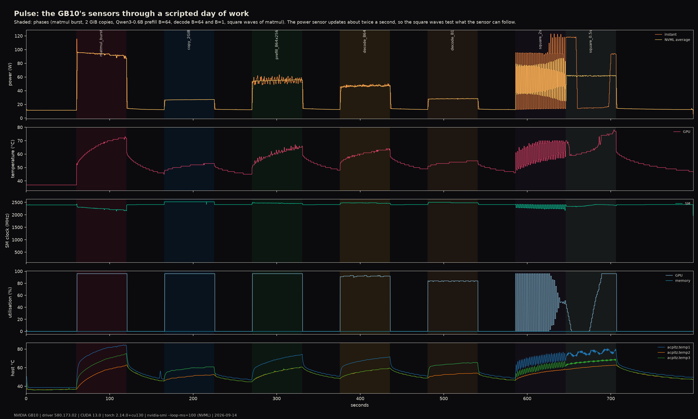

# Pulse: the GB10's sensors through a scripted day of work

*Sample power, temperature, clocks and utilisation ten times a second while the GPU idles, multiplies, copies, prefills and decodes, then flashes a matmul on and off. The traces are a portrait of the machine's metabolism: what each kind of work costs in watts and degrees, how the clock sags as the chip heats, and, in the square-wave test, the exact rhythm at which the power sensor stops being able to see.*

Hero: 811 s of nvidia-smi at 100 ms (power instant and NVML average, GPU temperature, SM and memory clocks, utilisation) plus the host ACPI thermal zones at 250 ms. Shaded bands are the phases the workload script logged with wall-clock timestamps. Everything drawn is a sensor reading; the composition and colours are declared.

## The phenomenon

A GPU's power and temperature respond to work on very different time scales: power in milliseconds (the current the chip draws), the die temperature in seconds, the heatsink and chassis in minutes. The sensor that reports each has its own bandwidth, and NVML's power reading on many boards is an average over a window of the order of a second. So there are three clocks in play, the work's, the chip's and the sensor's, and the interesting piece is where they disagree. The proposal asked whether the token rate of decoding could be seen in the power trace; the 10-minute feasibility check said the power sensor changes only about twice a second. This is the full recording, with a square-wave test to pin down what that sensor can follow.

## Stack

| | |
|---|---|
| GPU | NVIDIA GB10, driver 580.173.02, CUDA 13.0, torch 2.14.0+cu130 |
| Sensors | `nvidia-smi --query-gpu=... --loop-ms=100` (NVML): power.draw.instant, power.draw.average, temperature.gpu, clocks.sm, clocks.mem, utilization.gpu/memory, clocks_event_reasons; host `/sys/class/hwmon` (7 ACPI thermal zones, NVMe, Wi-Fi) and cpufreq at 250 ms |
| Workload | `workload.py`: idle 60 s, then 60 s each of 8192² bf16 matmul, 2 GiB device copy, Qwen3-0.6B prefill (B = 64 × 256 tokens), decode B = 64, decode B = 1, square wave 1 s on / 1 s off, square wave 0.25 s on / 0.25 s off, idle 90 s, with 45 s idle gaps; `--soak 900` for the thermal piece |
| Conditions | 2026-09-14 11:45–11:59 (phases), 11:59–12:20 (soak); machine otherwise idle, CPU rendering pinned to cores 16–17 |

## Findings

**What each kind of work costs** (median over the phase after its first 2 s):

| phase | power | GPU °C (start → end) | SM clock | util | throughput | energy per unit |
|---|---|---|---|---|---|---|
| idle | 11.4 W | 37 | 2398 MHz | 0 % | | |
| 8192² bf16 matmul, 60 s | 93.7 W (peaks 123 W in the first samples) | 54 → 73 | 2249 MHz, sagging 2400 → 2150 | 96 % | 5292 iters, 97 TFLOP/s | |
| 2 GiB device copy | 26.9 W | 48 → 53 | 2522 MHz | 96 % | 3307 copies, 237 GB/s | 0.11 J per GiB moved |
| Qwen3-0.6B prefill, B = 64 × 256 | 55.1 W (noisy, 63 W peaks) | 52 → 67 | 2470 MHz | 96 % | 20.8 k tokens/s | **2.6 mJ per token** |
| Qwen3-0.6B decode, B = 64 | 47.0 W | 54 → 64 | 2483 MHz | 92 % | 2044 tokens/s | **23 mJ per token** |
| Qwen3-0.6B decode, B = 1 | 28.2 W | 51 → 55 | 2483 MHz | 84 % | 84 tokens/s | **0.34 J per token** |

- **Idle is 11 W and 37 °C.** Every phase returns there within its 45 s gap in power; the temperature does not (the floor creeps from 37 to 47 °C over the session).
- **A sustained matmul draws 94 W and the clock sags.** The first samples of the burst read 116 to 123 W; within seconds the reading settles at 94 W and the SM clock drifts from 2400 to 2150 MHz as the die goes from 54 to 73 °C. The driver's `clocks_event_reasons` flags **no** power-cap or thermal slowdown at any point (only the idle bit when idle), so the sag is reported here without an attribution.
- **Decode at batch 1 is the least efficient thing the GPU does**: 28 W for 84 tokens/s, 0.34 J per token, 13× the per-token cost at batch 64 and 130× the prefill cost. The chip is 84 % "utilised" while moving 1.2 GB of weights per token and doing almost no arithmetic (see `hardware/roofline/`, The Chain).
- **Host thermal zones follow the GPU** with a lag: ACPI zones 1 and 6 reach 84 °C during the burst (they read the SoC), zone 2 stays under 63 °C.

**What the power sensor can follow** (`pulse_square_phases_night.png`):

| square wave | mean instant power in on-halves | in off-halves | contrast |
|---|---|---|---|
| 1 s on / 1 s off | 76.2 W | 35.9 W | **40.3 W**: the sensor follows, one sample late; the NVML average lags a further ~1 s |
| 0.25 s on / 0.25 s off | 46.6 W | 47.2 W | **−0.6 W**: no correlation with the work at all |

At 0.25 s on/off the instant reading sits at a flat 118 W for the first 13 s of the phase and then a flat 14 W for the remaining 47 s, while the GPU temperature climbs from 59 to 78 °C (the hottest point of the session) and the utilisation counter, itself a ~1 s window, drifts from 100 % to 0 % and back. The GPU is doing the work; the sensor is not seeing it. The reading changes 1.9 times per second over the whole recording (819 distinct values in 8059 samples), so a 2 Hz square wave is sampled stroboscopically and the sensor freezes at whatever phase it happens to be in. Anything faster than about 1 Hz is invisible to NVML on this board, and the token rhythm of decoding (84 Hz at B = 1, 2 kHz at B = 64) is far beyond it. The proposal's rhythm piece is therefore impossible with this sensor, and this plate is the proof rather than the piece.

**Thermal soak** (`pulse_soak_soak_night.png`: 60 s idle, 900 s of 8192² bf16 matmul, 300 s idle):

| | |
|---|---|
| heating fit T0 + ΔT(1 − e^(−t/τ)) | T0 = 59 °C, ΔT = +20.4 °C, **τ = 30 s** |
| plateau (120–500 s) | 80–82 °C, 89 W, SM 2145–2160 MHz |
| sustained throughput over 900 s | 77 537 iterations, **94.7 TFLOP/s** (vs 101 warm-median in the roofline) |
| unexplained event at ~560 s | power wobbles 80–90 W for a minute, clock dips to 2110 MHz, then the die runs 4 °C cooler (78 °C) at the same 89 W for the rest of the soak: a fan step is the obvious guess, and there is no fan in hwmon to confirm it |
| cooling fit | ΔT = −17.4 °C, **τ = 44 s**; 77 → 58 °C in 10 s, 48 °C at 60 s, 43 °C at 300 s |
| clock recovery | 2170 → 2400 MHz within one sample of the load ending |

The die is a fast thermal object: half a minute to heat, three quarters of a minute to cool, and the clock follows the temperature down by ~10 % (2400 → 2150 MHz) with the driver flagging no throttle reason. The sustained 94.7 TFLOP/s is 6 % under the warm one-minute roofline figure, which is the size of the thermal penalty for this workload on this chassis.

## Gallery

- `pulse_phases_{night,paper}.png`: the full recording, five strips.
- `pulse_square_phases_{night,paper}.png`: zoom on the two square waves, with the on-halves shaded.
- `pulse_soak_soak_{night,paper}.png`: the 15 min sustained matmul with heating and cooling fits (see below).

## What was computed

`record.py --tag phases` starts `nvidia-smi --loop-ms=100` and a host sampler thread, runs `workload.py`, which executes the phases with `torch.cuda.synchronize()` at each boundary and writes `cache/phases_phases.json` (name, t0, t1, iterations, per-iteration FLOPs/bytes/tokens), then stops the samplers. `record.py --tag soak --soak 900`: 60 s idle, 900 s of 8192² bf16 matmul, 300 s idle. `render_pulse.py` reads the CSVs (header units stripped, `clocks.current.*` aliased) and draws the plates; the soak plate fits `T(t) = T0 + ΔT (1 − e^(−t/τ))` to the heating and cooling segments.

## Verification

- Phase boundaries come from the workload's own timestamps, so the shaded bands are aligned to the work, not inferred from the trace.
- Sampler cadence: median 101 ms between rows, 8059 rows over 811 s, no gaps.
- Throughputs in the table are computed from the workload's iteration counts and agree with the roofline measurement (97 vs 101 TFLOP/s for the matmul, 237 vs 247 GB/s for the copy) within the thermal state.
- The sensor's update rate was measured twice: 0.5 s per change at 20 ms sampling in the feasibility check, 1.9 changes per second here.

## Caveats

- NVML's `power.draw.instant` is whatever the board's power controller exposes; its update rate (≈ 2 Hz) is a property of this board and driver, not of GPUs in general.
- Energy per token divides the phase's median power by its throughput; it includes the idle floor (11 W) and excludes the host CPU.
- The clock sag is observed, not attributed: the driver reported no throttle reason.
- One session, one thermal history: the temperature floor rose 10 °C over the 14 minutes, so later phases start warmer.

## References

- NVIDIA NVML API reference, `nvmlDeviceGetPowerUsage` / `nvmlDeviceGetFieldValues` (power readings and their averaging)
- In-repo: `misc/burst/` (the thermal drop under sustained load that motivated the soak), `hardware/roofline/` (the same kernels timed), `hardware/fingerprint/` (the same decode, bit by bit)
