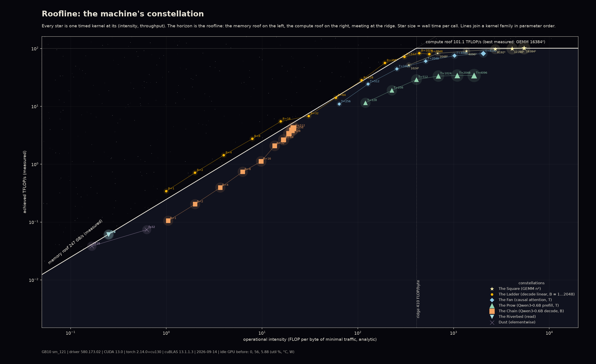

# Roofline: the machine's constellation

*Two measured ceilings, the memory roof and the compute roof, drawn as a horizon. Every kernel this machine runs for language models is a star at its measured operational intensity and throughput. Some stars sit on the horizon, some far below it, and a few float above the memory roof because their data never left the L2 cache.*

Hero: idle GB10, 2026-09-14. Roofs: 101.1 TFLOP/s (bf16 GEMM 16384², the best measured kernel) and 247 GB/s (4 GiB device copy). Stars: bf16 kernels timed with CUDA events, median of ≥ 7 reps, warm; intensity = analytic FLOPs / minimal bytes (every tensor read or written once). Size = wall time per call. Lines join a family in parameter order. The star field and the haze are decoration.

## The phenomenon

The roofline model (Williams, Waterman & Patterson, 2009) says a kernel's attainable throughput is min(peak compute, bandwidth × operational intensity). Below the ridge point it is memory-bound and its speed is set by how many bytes it must move; above it, compute-bound. LLM inference lives on both sides: prefill and large GEMMs to the right, decode (one token per sequence, the whole weight matrix per step) far to the left, where every step is a bandwidth-bound read of the weights. A roofline of one machine with its own kernels on it is therefore a portrait of what that machine is good at and what it is wasting.

## Stack

| | |
|---|---|
| GPU | NVIDIA GB10 (sm_121, capability 12.1, 48 SMs, 24 MB L2, 3.0 GHz max SM clock), ~120 GB unified memory |
| Driver / CUDA | 580.173.02 / 13.0 |
| torch | 2.14.0+cu130, cuBLAS 13.1.1.3, cuDNN 92400, TF32 off |
| Model | Qwen3-0.6B via `art/decode-map/qwen.py` (bf16 body 440 M params, fp32 lm_head 156 M) |
| Conditions | idle GPU (0 % util, 56 °C, 5.9 W before; 70 °C, 52 W after), no other compute process, ~1 min wall |

## Findings

**Roofs.** Peak bf16 GEMM 101.1 TFLOP/s at 16384² (day2's 30 s sustained measurement gave 95.5; the vendor peak is 118.8). Peak device bandwidth 247 GB/s from a 4 GiB copy (read + write counted), consistent across 1 to 4 GiB and with a pure read (`sum`) at 241 to 245 GB/s; day2 gave 222, vendor 273. Ridge 410 FLOP/byte. The same script run at 05:13 on a GPU shared with two other jobs gave 60 TFLOP/s and 91 GB/s: contention halves both roofs, which is why `misc/burst/task.md` distrusted the working-tree baseline.

| constellation | what | measured |
|---|---|---|
| The Square (GEMM n²) | 1024² → 16384² | 52 → 101 TFLOP/s; 1024² is only 51 % of the roof at OI 341, still launch/tail-bound |
| The Ladder (decode linear [B, 1024] × [1024, 3072]) | B = 1 → 2048 | B ≤ 16: 342–359 GB/s, **above** the memory roof; B = 512: 72 TFLOP/s; B = 1024: 83 TFLOP/s |
| The Fan (SDPA flash, causal, 16 heads × 128) | T = 256 → 8192 | 11 → 82 TFLOP/s, 81 % of the roof at T = 8192 |
| The Prow (Qwen3 prefill, B = 1) | T = 128 → 4096 | 11.5 → 34 TFLOP/s, flat at 34 % of the roof from T = 1024 |
| The Chain (Qwen3 decode step, KV 512) | B = 1 → 512 | 101 → 197 GB/s effective weight bandwidth, 41 % → 80 % of the memory roof; 12.4 ms → 160 ms per step |
| The Riverbed (copy, read) | 1–4 GiB | 240–247 GB/s |
| Dust (elementwise add, softmax over 151936) | | add 230 GB/s (93 %); softmax 118 GB/s (48 %) |

What the sky says:

- **The decode linear floats above the roof.** Its weight is 6.3 MB, a quarter of the 24 MB L2, so across warm repeated calls it is served from cache and the analytic "bytes from DRAM" overstates traffic. Stars above the horizon are the roofline's way of saying "this working set fits in L2". The whole-model decode has 1.2 GB of weights per step, cannot be cached, and sits properly below the roof.
- **Decode on this box is bandwidth-bound until B ≈ 512.** At B = 1 a step takes 12.4 ms for 1.25 GB of weights and KV (101 GB/s, 41 % of roof); doubling B costs almost nothing until B = 16, then the step time grows roughly linearly. B = 512 reaches 197 GB/s (80 %). The chain never reaches the ridge (OI 21 at B = 512 vs ridge 410), because the fp32 lm_head and fp32 logits (311 MB per step at B = 512) dominate the byte count.
- **Prefill sits at a third of the roof.** The hand-written eager model has no kernel fusion, so between its GEMMs it spends time in RMSNorm, RoPE, SiLU and cache writes that carry almost no FLOPs. The GEMMs alone (Square, Ladder at large B) reach 80 to 100 %.
- **Attention scales as the theory says:** intensity doubles with T and throughput follows the roof up to T = 2048, then flattens toward 82 TFLOP/s.
- **The ridge is at 410 FLOP/byte.** Everything with OI < 410 is memory-bound: all of decode, the small GEMMs, the elementwise ops. The full prefill at T ≥ 512 is compute-bound on paper (OI 410 to 1640) and yet runs at 34 %, which is the honest gap between a roofline and an unfused implementation.

## Gallery

- `roofline_night.png`, `roofline_paper.png`: the same data on a night sky and on paper (single-ink markers with coloured constellations).
- `cache/roofline_stars.md`: every star as a table (FLOPs, bytes, OI, ms, TFLOP/s, GB/s, fraction of the roof it sits under).
- `test_roofline_{night,paper}.png`: the **contaminated** 05:13 run on a shared GPU, kept as the contention exhibit (roofs 60 TFLOP/s / 91 GB/s, tiny kernels at 1 to 3 ms because of time-slicing).

## What was computed

`measure.py` (GPU, ~1 min idle): each kernel is warmed 3×, then timed with CUDA events in windows of ≥ 50 ms (or 50 calls), median of 5 to 10 windows. GEMM n² bf16 for n ∈ {1024, …, 16384}; device copy and fp32 sum on 1, 2, 4 GiB; `F.linear` [B, 1024] × [3072, 1024]ᵀ for B = 1…2048; flash SDPA causal (1, 16, T, 128) for T = 256…8192; Qwen3-0.6B prefill (B = 1, T = 128…4096) and one decode step at KV length 512 (B = 1…512) with decode-map's model; add on 2²⁸ bf16 and softmax on 512 × 151936 fp32. FLOPs are analytic (2·m·n·k for GEMMs, 4·T²·d·H/2 for causal attention, 2·params·tokens + attention for the model). Bytes are the declared minimum: every input and output tensor once in its dtype, weights once per call, KV written once, fp32 logits once; activations inside the model are not counted. The compute roof is the best measured kernel of any kind; the memory roof is the best copy/read bandwidth. `nvidia-smi` before and after in `logs/smi_{before,after}_roofline.txt`.

`render_roofline.py`: CPU, from `cache/roofline.json`; `--tag test_roofline` renders the contaminated run.

## Verification

- Roofs agree with the independent day2 measurement (95.5 TFLOP/s, 222 GB/s, ridge 429) within the difference between a 30 s sustained run and a warm median; both are 80 to 90 % of the vendor peaks.
- Bandwidth is the same for copy and pure read and for 1, 2 and 4 GiB (240 to 247 GB/s): no cache effect at these sizes.
- The GEMM series is monotone toward the roof; the flash series follows the roof slope until the compute ceiling. Stars above the memory roof are all kernels whose working set is < 24 MB (the Ladder at B ≤ 16, and B = 128 and 256 at 104 to 119 %), none larger.
- The contaminated run reproduces the failure mode `misc/burst/task.md` describes: roofs at 60 % / 37 % of the idle values and small kernels 50 to 100× slower.

## Caveats

- Byte counts are declared minima. Real traffic is higher (activations, re-reads, KV reads during prefill), so real intensities are lower than plotted; and cache-resident working sets make real DRAM traffic lower, which is why some stars are above the roof. The plot is a model, not a measurement of bytes.
- The model stars measure decode-map's eager implementation, not an optimised inference engine; a fused server would move the Prow up and the Chain right.
- Warm medians on a cold-ish chip (56 → 70 °C in one minute); a sustained run throttles (see `misc/burst/`).
- One machine, one driver, one library version, one date.

## References

- Williams, Waterman & Patterson, "Roofline: An Insightful Visual Performance Model for Multicore Architectures", *CACM* 52(4), 2009
- In-repo: `day2/roofline.json`, `day2/bench_throughput.py`, `misc/burst/task.md` (the contention story), `hardware/lattice/` (where the per-shape GEMM throughput comes from), `hardware/fingerprint/` (the same model, viewed for bit-exactness instead of speed)
