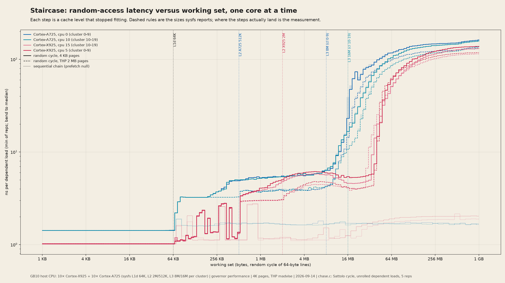

# Staircase: the memory hierarchy of the GB10's host CPU, one core at a time

*Chase a pointer through a random cycle of cache lines and grow the cycle from 1 KB to 1 GB. Each time the working set stops fitting in a cache level, the time per load steps up. The two core types in the Grace CPU climb two different staircases, huge pages lower the top step by a fixed amount, and a second piece listens to a fixed chunk of loads repeated a million times and hears the kernel's 1 kHz tick.*

Hero: nanoseconds per dependent load (minimum of 5 repetitions, band to the median) against working set, for one Cortex-A725 and one Cortex-X925 core in each of the two clusters, with 4 KB pages (solid) and transparent huge pages (dashed). Dotted: the same bytes chained in address order, which the prefetcher follows at L1 speed all the way to 1 GB. Dashed rules: the cache sizes sysfs reports. Log-log axes and the colours are declared; everything else is measured.

## The phenomenon

A dependent load (`p = *(void **)p`) cannot be issued until the previous one returns, so a chain of them measures latency, not bandwidth. If the chain is a single random cycle over all the lines in a buffer (Sattolo's algorithm), the hardware prefetcher has no stride to follow and every load pays the full cost of wherever the line lives: L1, L2, the cluster's L3, or DRAM after a page walk. Plotting that cost against the buffer size draws the memory hierarchy as a staircase, and where the steps land is a measurement of the cache sizes and page-table reach, independent of what the datasheet says.

## Stack

| | |
|---|---|
| Host CPU | NVIDIA GB10 Grace: 10 × Cortex-X925 (3.9 GHz, L2 2 MB each) + 10 × Cortex-A725 (2.8 GHz, L2 512 KB each), L1d 64 KB per core, two clusters (cpus 0–9 and 10–19) with sysfs L3 8 MB and 16 MB; unified LPDDR5X with the GPU |
| Kernel | Linux 6.17.0-1031-nvidia, HZ = 1000, NO_HZ_FULL, THP `madvise` |
| Governor | performance; cores pinned with `sched_setaffinity` |
| Conditions | 2026-09-14 10:07–11:45, GPU idle throughout, no other compute process |

## Findings

**The staircases** (`cache/stair_c{0,5,10,15}_huge{0,1}.tsv`, min over 5 reps of 20 M loads per size, 8 sizes per octave):

| core | L1 (≤ 64 KB) | L2 region | plateau 2–8 MB | leaves the plateau (> 10 ns) | > 50 ns | 1 GB, 4 KB pages | 1 GB, THP |
|---|---|---|---|---|---|---|---|
| A725, cpu 0 | 1.43 ns (4 cycles) | 3.3–5 ns to 512 KB | 5.6 ns | 12 MB | 19 MB | 162 ns | 137 ns |
| A725, cpu 10 | 1.43 ns | same | 5.7 ns | 12 MB | 32 MB | 158 ns | 134 ns |
| X925, cpu 5 | 1.03 ns (4 cycles) | 1.2–2.8 ns to 512 KB, 3–5 ns to 2 MB | 6.0 ns | **42 MB** | 59 MB | 138 ns | 118 ns |
| X925, cpu 15 | 1.02 ns | same | 5.6 ns | 38 MB | 64 MB | 131 ns | 115 ns |

- **The L1 step lands exactly on 64 KB** for all four cores, and the L2 step on the sysfs sizes (512 KB for A725, 2 MB for X925). Both core types run L1 at 4 cycles; the X925 is faster only because its clock is.
- **The two core types see different last-level reach.** Both A725 cores leave the ~5.6 ns plateau at 12 MB, both X925 cores at ~40 MB. sysfs attributes an 8 MB L3 to cluster 0–9 and 16 MB to cluster 10–19, but the measured knee follows the *core type*, not the cluster: cpu 5 (X925, "8 MB" cluster) holds the plateau to 42 MB while cpu 10 (A725, "16 MB" cluster) loses it at 12 MB. Whatever the 24 MB of L3 plus the 20 MB of X925 L2 actually form, the X925 can use far more of it for one thread than the A725 can. This is reported, not explained.
- **Huge pages lower the top step by a constant ≈ 20–25 ns** (162 → 137, 138 → 118) and the mid plateau by ≈ 1.6 ns (5.6 → 3.9 ns on the A725). With 4 KB pages a random access over 1 GB misses the TLB every time and pays a page walk; 2 MB pages cover the whole buffer with 512 entries. The plateau shift shows the walk is being paid even inside the L3 region.
- **The sequential null stays flat at 1.6–2.0 ns to 1 GB**: the same lines, chained in address order, are prefetched perfectly. The random cycle is the honest measurement; the sequential one is what streaming code sees.
- **DRAM random latency on this box is 115–160 ns** depending on core and page size, and is still rising slowly at 1 GB (row-buffer and TLB-walk cache effects at larger footprints).
- **An unexplained X925 texture.** Between 64 KB and 512 KB the X925 alternates between ~1.2 ns and ~2.0–2.8 ns depending on the exact size (slow at 140–166 KB, 197 KB, 279–332 KB, 395 KB; fast at 128, 181, 215–256, 362, 430–512 KB). It is identical on both X925 cores, identical with 4 KB and 2 MB pages (so not TLB), and identical across the 5 reps. It is real and it is not understood here; a set-index hash or way-predictor interacting with the random cycle is a guess, not a finding.
- **Node-size diagnostic** (`staircase_nodesize_paper.png`): the same bytes chained with 8-byte nodes (eight per line, each line visited eight times per cycle) climb earlier and more gradually than the 64-byte chain. The two chains touch the same lines, so the difference is in how the core handles eight scattered revisits of a line vs one; kept as a diagnostic, not interpreted.

**Heartbeat** (`cache/hb_c{0,5}_{l1,dram}.bin`: 1 000 000 chunks of 2000 L1-resident loads, 300 000 chunks of 2000 loads over 64 MB, back to back, timestamped):

| | A725 cpu 0 | X925 cpu 5 |
|---|---|---|
| L1 chunk, median / p99 / p99.9 / max | 1.416 / 1.43 / 2.35 / 77 ns per load | 1.024 / … ns per load |
| slow L1 chunks (> 1.3 × median) | 2846 of 1 000 000, **spaced 1.000 ms** (p10–p90: 0.999–1.002) | 2063, spaced 1.000 ms |
| excess time per slow chunk | 1.6 µs | 1.06 µs |
| 64 MB chunk median | 119 ns per load | 61 ns (the 64 MB set is still partly in the X925's reach) |

The L1 heartbeat is a clock: exactly one chunk per millisecond runs 1 to 1.6 µs long, which is the kernel's scheduler tick (`CONFIG_HZ=1000`) landing on a pinned, otherwise undisturbed core. Folded into 1 ms rows it is a single vertical line (`heartbeat_c0_l1_night.png`). The rest of the raster is black: p99 is within 1 % of the median. The 64 MB heartbeat (folded at 64 ms rows) shows a fainter line at a 64 ms period and spikes every 0.5 to 1 s of ~130 µs, unattributed.

## Gallery

- `staircase_paper.png`, `staircase_night.png`: the hero (min of reps with band to median). `staircase_median_paper.png`: medians instead of minima. `staircase_plotter.png`: single-ink plotter sheet, labels at the line ends.
- `staircase_nodesize_paper.png`: 64-byte vs 8-byte nodes, A725 and X925.
- `heartbeat_c{0,5}_{l1,dram}_{night,paper}.png`: folded rasters (rows = wall time, columns = position within the fold period, colour = log2 of ns/load over the median) with the raw trace below.

## What was computed

`chase.c` (`gcc -O2`): allocates the buffer with `mmap` (`madvise(MADV_HUGEPAGE)` for `--huge`), builds one random cycle over all 64-byte nodes (splitmix64 + Sattolo), or an address-order cycle for `--seq`, or an 8-byte-node cycle for `--node 8`; pins to one core; walks the chain `loads` times per rep with an 8-way unrolled dependent load, `reps` times; reports min/median/max ns per load. Sizes are log-spaced, 8 per octave, 1 KB to 1 GB (256 MB for node 8). `--heartbeat N` walks a fixed N-byte cycle in chunks of 2000 loads and writes (timestamp, duration) per chunk. `run_all.sh` runs the campaign (cpus 0, 5, 10, 15 × {4 KB, THP} × random, plus sequential nulls, node-8 runs and heartbeats), ~1 h 40 min. `render_stair.py` draws everything from `cache/`.

## Verification

- Repetition: 5 reps per size; the min-to-median band is invisible below 8 MB and a few percent in the DRAM region.
- Nulls: the sequential chain is flat (prefetcher), so the steps are not an artefact of the walk itself. THP vs 4 KB isolates the TLB component.
- Two cores per type, in different clusters, give the same staircase to within 5 %.
- The L1 step at 64 KB and the L2 steps at 512 KB / 2 MB agree with sysfs; the disagreement about last-level reach is stated above rather than smoothed over.
- Contention: GPU idle, no other processes, rendering pinned to the cluster not being measured.

## Caveats

- Latency under one thread, on an idle machine. With 20 cores busy the L3 and DRAM numbers rise.
- "Min of reps" is the best case for that size; medians (`staircase_median_paper.png`) are within a few percent below 8 MB.
- Buffer sizes that are not powers of two use a cycle over ⌊bytes/64⌋ lines; the random cycle's footprint in sets is what matters, and the X925 texture shows that footprint is not the whole story.
- The heartbeat attributes the 1 kHz event to the scheduler tick by its period and the kernel config; it was not traced.

## References

- Sattolo, "An algorithm to generate a random cyclic permutation", *Information Processing Letters* 22(6), 1986
- Drepper, "What Every Programmer Should Know About Memory", 2007 (the pointer-chase staircase as a method)
- Arm Cortex-X925 and Cortex-A725 Technical Reference Manuals (cache and TLB parameters)
- In-repo: `hardware/roofline/` (the GPU side of the same memory), `hardware/lattice/`
