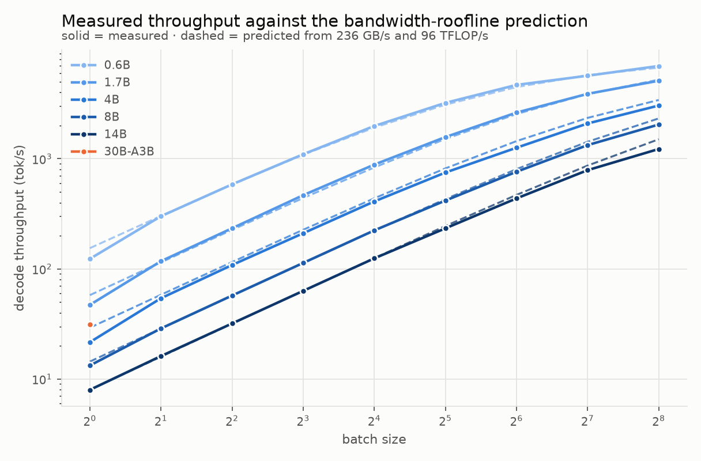
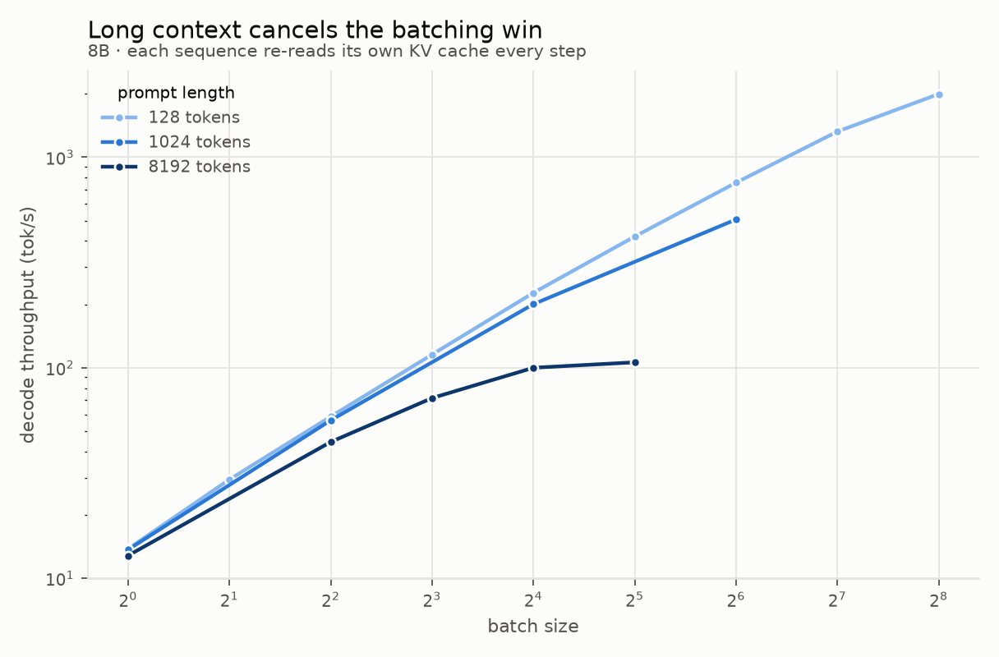

# What can a DGX Spark actually serve?

An inference capability survey of a single **NVIDIA GB10** across model size, batch
size, and context length — the kind of measurement people run when new hardware
lands, but with every number checked against a roofline measured on the machine
rather than against a spec sheet.

Everything here is reproducible from this directory. The memory safety machinery is
not incidental: GB10 has *unified* memory, so an over-allocation starves the host
instead of raising a clean CUDA OOM.

> **Status:** decode results are complete for the five dense models and partial for
> the MoE. Prefill and TTFT numbers from this run are **invalid** (see *What went
> wrong*) and are excluded pending a re-measurement.

## The machine

| | |
|---|---|
| GPU | NVIDIA GB10, Blackwell `sm_121`, **48 SMs** |
| Memory | **121.7 GiB unified** LPDDR5X — host and GPU share one pool |
| CPU | 20-core ARM: 10× Cortex-X925 + 10× Cortex-A725 |
| OS | Ubuntu 24.04.4, kernel 6.17 (aarch64), driver 580.173.02, CUDA 13.0 |
| Stack | vLLM 0.23.0, FlashInfer 0.6.12, torch 2.11.0+cu130, transformers 5.12.1 |

Two things about this machine shape everything below.

**There is no framebuffer.** `nvidia-smi` reports `memory.used = N/A`, because there
is no separate GPU memory to report. `torch.cuda.get_device_properties(0).total_memory`
returns the entire 121.7 GiB system pool. Any memory the model takes is memory the
operating system does not have.

**Compute badly outruns bandwidth.** That ratio, not the FLOP number, is what
decides how this machine behaves on inference.

## Measured roofline

From `hw_probe.py` — sustained, not peak-of-one-iteration:

| Quantity | Measured | Reference | Fraction |
|---|---:|---:|---:|
| BF16 dense GEMM | **95.9 TFLOP/s** | ~125 (derived) | 77 % |
| FP8 (e4m3) GEMM | **145.5 TFLOP/s** | — | 1.52× BF16 |
| Memory bandwidth, read | **236.4 GB/s** | 273 (spec) | 87 % |
| Memory bandwidth, copy | **220.9 GB/s** | 273 (spec) | 81 % |

BF16 throughput climbs to 95.9 TFLOP/s by n=8192 and falls back slightly at 16384.
Note also that vLLM logs `Not enough SMs to use max_autotune_gemm` on this device —
48 SMs is below the threshold PyTorch's inductor expects.

**The ridge point is 95.9 TFLOP/s ÷ 236.4 GB/s = 406 FLOP/byte.**

## What 406 FLOP/byte implies

During decode, a dense model reads all its weights to produce one token per
sequence, and does ~2 FLOP per parameter per token. With a batch of *B* sequences,
the same weight read serves all *B*, so arithmetic intensity is approximately **B**.

Setting that equal to the ridge gives the headline result:

> **Decode on GB10 stays memory-bound until batch ≈ 406.**

Below that batch the GPU's arithmetic units are idle waiting on LPDDR5X, and every
doubling of batch is nearly free throughput. This is not unique to GB10 — it is the
standard shape of LLM decoding — but the ridge is unusually high here, and GB10 is
unusual in having enough memory to chase it.

`perf_model.py` turns this into predictions (BF16, 1 k-token context):

| model | weights | KV per token | predicted tok/s @ B=1 | largest batch that fits | predicted tok/s there |
|---|---:|---:|---:|---:|---:|
| Qwen3-0.6B | 1.4 GiB | 112 KiB | 145 | 512 | 1750 |
| Qwen3-1.7B | 3.8 GiB | 112 KiB | 56 | 512 | 1688 |
| Qwen3-4B | 7.5 GiB | 144 KiB | 29 | 256 | 1174 |
| Qwen3-8B | 15.3 GiB | 144 KiB | 14 | 256 | 1011 |
| Qwen3-14B | 27.5 GiB | 160 KiB | 8 | 128 | 564 |

Two predictions worth testing, both of which fall out of the arithmetic:

1. **Single-stream decode is slow and entirely bandwidth-determined.** At batch 1,
   tok/s is just bandwidth ÷ weight bytes. A 14B model cannot exceed ~8 tok/s on
   this machine no matter how good the kernels are.
2. **Long context cancels the batching win.** KV traffic grows with `batch × context`
   while the weight read stays fixed, so past some point batching buys nothing. At
   8 k context the model predicts an 8B saturating near **190 tok/s regardless of
   batch** — arithmetic intensity never gets near the ridge, because KV, not
   weights, dominates the read.

## Memory is the binding constraint, and it is KV

For the Qwen3 family, KV cache per token is large — 112–160 KiB — because these
models are deep with 8 KV heads of dimension 128. The consequence is that **KV
cache, not weights, decides how much batch this machine can hold**:

| Qwen3-0.6B @ 4 k context | weights | KV | total |
|---|---:|---:|---:|
| batch 8 | 1.4 GiB | 3.5 GiB | 10.9 GiB |
| batch 32 | 1.4 GiB | 14.0 GiB | 21.4 GiB |
| batch 128 | 1.4 GiB | **56.0 GiB** | 63.4 GiB |
| batch 256 | 1.4 GiB | **112.0 GiB** | *refused* |

A 0.6B model — 1.4 GiB of weights — is stopped at batch 256 by 112 GiB of KV cache.
That is the real story of serving on a 128 GB unified box, and it is why the
survey's memory budgeting had to be exact rather than approximate.

## Method

### Protocol

Cells are (model, batch, input length, output length). For each cell:

1. **Warm up at the exact shape and discard it.** The first generation of an unseen
   shape triggers Triton JIT compilation; without this it lands inside the
   measurement.
2. **A prefill-only pass** (`max_tokens=1`) gives time-to-first-token.
3. **A full pass** gives total time; decode throughput is the remaining tokens over
   the remaining time.

Prompts are synthetic random token IDs so input length is exact, and sampling uses
`ignore_eos` so every sequence does identical work. Cheap cells are repeated 3×,
expensive ones 2×, and the median is reported.

Engine startup on GB10 costs ~100 s, so all cells for a model share one engine
process rather than one process per cell — that choice alone saves about four hours
across the grid. The engine's KV pool is sized once for the largest cell, and
`bench.py` records the pool's real capacity so that a cell which would be silently
split into waves is flagged rather than reported as a genuine concurrent batch.

### Memory safety

Four independent layers, because the failure mode is a wedged host, not an exception:

1. **A hard 60 % ceiling** (73 GiB). `gpu_memory_utilization` is computed per cell
   and never exceeds it.
2. **A pre-flight gate.** `budget.py` costs every cell *before* an engine exists.
   Cells that do not fit are refused and recorded — never silently shrunk, which
   would emit a row labelled with a batch size that never ran.
3. **A watchdog.** Each run is its own process group; if `/proc/meminfo`
   `MemAvailable` falls below 12 GiB the whole group is killed. Process *group*
   because vLLM's EngineCore is a separate process; `MemAvailable` because, as
   above, there is no NVML counter to read.
4. **Strictly serial execution**, one model at a time.

The harness also refuses partially downloaded checkpoints. A half-fetched model
looks smaller than it is, which under-estimates the budget in the one direction
that risks an OOM.

## Results

83 cells, BF16, vLLM 0.23. Every planned cell fit under the memory ceiling; none
was silently split into waves.

### Decode throughput

128-token prompts, 128 output tokens:

| model | batch-1 tok/s | best tok/s | at batch | speedup |
|---|---:|---:|---:|---:|
| Qwen3-0.6B | 123 | 6956 | 256 | 56× |
| Qwen3-1.7B | 47 | 5107 | 256 | 108× |
| Qwen3-4B | 22 | 3041 | 256 | 141× |
| Qwen3-8B | 13 | 2044 | 256 | 154× |
| Qwen3-14B | 8.0 | 1226 | 256 | 154× |
| Qwen3-30B-A3B | 31 | *(partial)* | — | — |

Single-stream decode is poor and that is structural, not a tuning failure: a 14B
produces **8 tok/s**, slower than most people read. The same model with 256
concurrent sequences produces 1226 tok/s. **GB10 is a throughput machine; using it
one request at a time wastes roughly 99 % of it.**

### The roofline predicts the machine

Measured ÷ predicted, where the prediction has no free parameters — just measured
bandwidth, measured FLOP/s, and the model's own weight and KV bytes:

| model | B=1 | B=8 | B=64 | B=256 |
|---|---:|---:|---:|---:|
| Qwen3-0.6B | 0.80 | 1.01 | 1.05 | 1.04 |
| Qwen3-1.7B | 0.82 | 1.06 | 1.03 | 0.98 |
| Qwen3-4B | 0.74 | 0.93 | 0.87 | 0.89 |
| Qwen3-8B | 0.92 | 1.00 | 0.95 | 0.88 |
| Qwen3-14B | 1.00 | 1.00 | 0.93 | 0.82 |
| Qwen3-30B-A3B | 0.89 | — | — | — |

Across three orders of magnitude of throughput, a one-line bandwidth argument lands
within a few percent of what a heavily-optimised serving stack actually does. The
14B is exact from batch 1 to 16.

The two places it misses are informative. At **batch 1** the measurement falls
*below* prediction (0.74–0.92) because a step takes only milliseconds and fixed
launch overhead dominates — except on the 14B, where the step is long enough that
overhead vanishes and the ratio is 1.00. At **batch 256** the larger models fall to
0.82–0.89, where scheduling and attention work the model omits start to matter.



### The sparse model decodes like a small dense one

Qwen3-30B-A3B holds 128 experts per layer and routes each token to 8. Deriving the
active fraction from its config gives **6.2 GiB read per token out of 56.9 GiB
resident** — 3.3 B active parameters of 30.5 B, matching Qwen's published figure.

The consequence on a bandwidth-bound machine is direct: the MoE decodes at
**31 tok/s at batch 1, roughly 4× faster than the 14B dense model** (8.0 tok/s)
despite being more than twice its size. Predicted from active parameters alone:
35.2 tok/s, a ratio of 0.89 — the same accuracy as the dense ladder.

This is the single best argument for a 128 GB unified-memory box. Sparse models
trade capacity, which this machine has in abundance, for bandwidth, which it does
not.

### Context erodes the batching win

Qwen3-8B decode tok/s:

| prompt | B=1 | B=4 | B=8 | B=16 | B=64 | B=256 |
|---|---:|---:|---:|---:|---:|---:|
| 128 tok | 13 | 57 | 113 | 224 | 762 | 2044 |
| 1024 tok | 13 | 55 | — | 195 | 531 | — |
| 8192 tok | 13 | 45 | 72 | — | — | — |

At batch 8 an 8 k prompt already costs 36 % of the throughput a 128-token prompt
gets (72 vs 113 tok/s), because each sequence re-reads its own KV cache every step.

**This table understates the effect and should be read with care.** The long-context
rows stop early because batch was capped there to bound prefill cost, so the
measurements show the divergence beginning but do not reach the saturation the model
predicts (~190 tok/s regardless of batch). Extending 8 k to batch 16 and 32 fits the
memory ceiling comfortably and is the first thing to run next.



## What went wrong

Three failures worth recording, since a survey that reports only its successes is
not much use to the next person.

**Prefill and TTFT from this run are invalid.** vLLM enables prefix caching by
default. The warmup pass primes the cache with exactly the prompts the measured
passes reuse, so prefill was served from cache: the harness recorded 624,577 tok/s
for a 0.6B whose compute-bound ceiling is 63,916 tok/s — about 10× faster than
physically possible. The fix (`enable_prefix_caching=False`) is committed, but the
affected numbers are excluded rather than published. Decode is unaffected: with
prefill cached, the measured interval is essentially pure decode, and its
independent agreement with the roofline is the corroboration.

**The MoE tripped the memory watchdog, for a reason no budget model would catch.**
The first 30B attempt was killed at 10.9 GiB available. The cause was not weights or
KV cache. FlashInfer JIT-compiles fused MoE kernels — which no dense model triggers —
and its ninja build defaults to `nproc+2`, here **22 concurrent `nvcc` processes at
51 GiB of resident compiler memory**. On unified memory that comes out of the same
pool as the model. Capping `MAX_JOBS=4` cut peak compiler memory to 17.8 GiB and the
retry stayed above 24 GiB available. *A memory budget for a unified-memory machine
has to account for the toolchain, not just the model.*

**The watchdog's process-group kill has a hole.** Those `nvcc` jobs are spawned via
`sh -c` and were reparented to init, so they outlived the kill and kept allocating
after the engine was dead. Prevention (capping parallelism) is the fix actually in
place; cleanup alone was not sufficient.

## Still to do

- Re-measure prefill and TTFT with prefix caching disabled
- Finish the 30B MoE sweep (1 of 16 cells so far; kernel cache is now warm)
- Extend 8 k context to batch 16 and 32 to demonstrate saturation
- The serving phase (`serve_bench.py`): TTFT/TPOT/p99 under arrival-rate load

## Reproducing

```bash
python3 hw_probe.py                 # roofline -> results/roofline.json
python3 sweep.py --dry-run          # show the grid and every cell's memory budget
python3 sweep.py                    # run it (resumable; skips completed cells)
python3 serve_bench.py --model Qwen/Qwen3-8B
/path/to/.venv/bin/python plot.py   # figures + summary tables
```

Tests (no GPU required):

```bash
python3 test_budget.py && python3 test_guard.py && python3 test_perf_model.py
/path/to/.venv/bin/python test_plot.py
```

`plot.py` needs matplotlib, which lives in the repo's `.venv`; everything else runs
on the system python that has vLLM.

## Files

| File | Role |
|---|---|
| `hw_probe.py` | Roofline microbenchmarks |
| `budget.py` | Pure memory model; the pre-flight gate |
| `perf_model.py` | Throughput prediction from the measured roofline |
| `guard.py` | Process-group memory watchdog |
| `bench.py` | Runs one model's cells inside one engine |
| `sweep.py` | Orchestrates the grid; resumable |
| `serve_bench.py` | Online serving latency via `vllm bench serve` |
| `plot.py` | Figures and summary tables |
