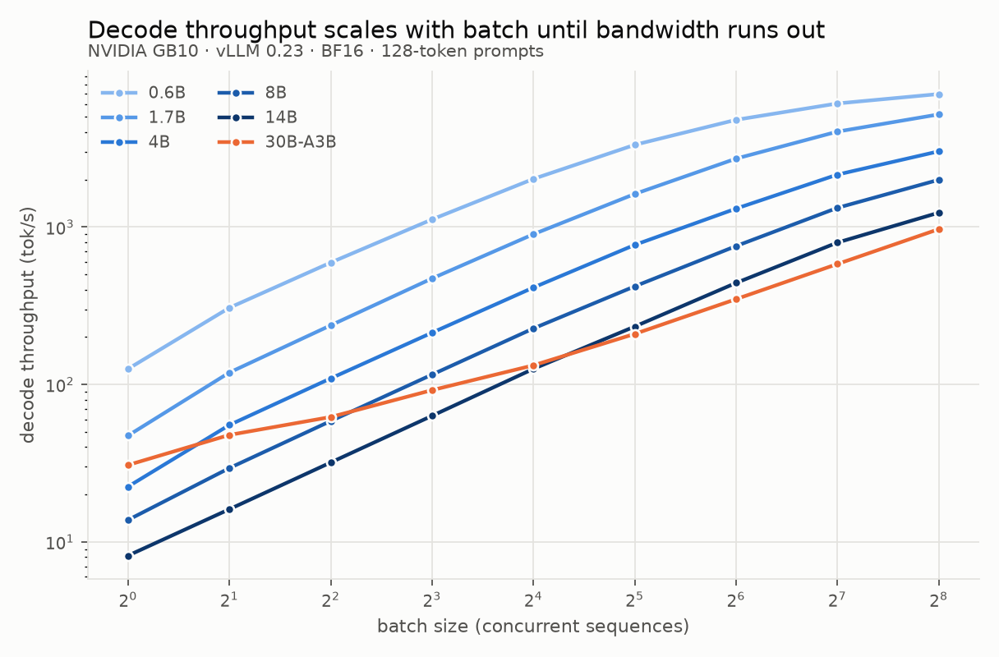
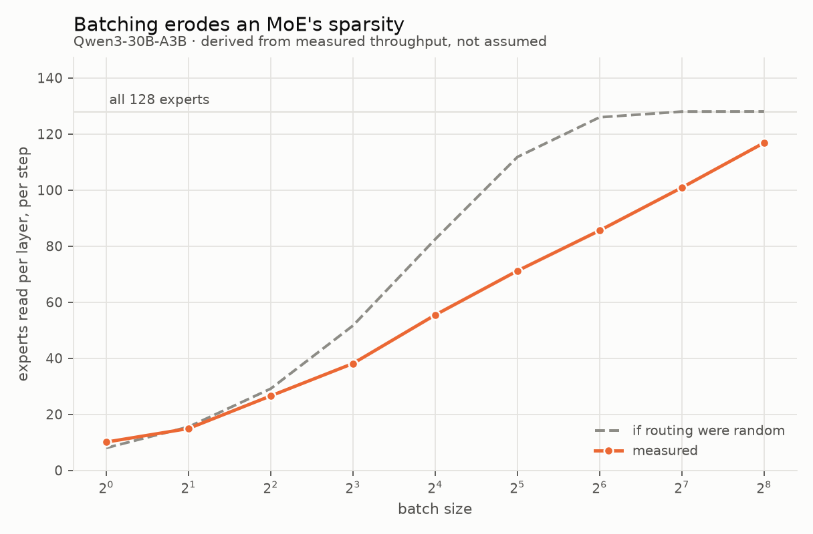

# What can a DGX Spark actually serve?

An inference capability survey of a single **NVIDIA GB10** across model size, batch
size, and context length — the kind of measurement people run when new hardware
lands, but with every number checked against a roofline measured on the machine
rather than against a spec sheet.

Everything here is reproducible from this directory. The memory safety machinery is
not incidental: GB10 has *unified* memory, so an over-allocation starves the host
instead of raising a clean CUDA OOM.

**Findings, in one line each:**

- Decode is bandwidth-bound up to batch ≈ 406. A parameter-free roofline prediction
  lands within ~5 % of measured throughput for every dense model from batch 1 to 256.
- Single-stream use wastes the machine: a 14B gives 8 tok/s alone, 1233 tok/s at
  batch 256.
- A 30B MoE is 3.8× faster than a dense 14B for one user, and *slower* at batch 256,
  because a batch reads the union of every sequence's experts: 120 of 128 at batch 256.
- At 8 k context, batching stops helping by batch 16–32. The roofline gets the shape
  right but misses the level by 22 %, because it ignores attention compute.

## The machine

| | |
|---|---|
| GPU | NVIDIA GB10, Blackwell `sm_121`, **48 SMs** |
| Memory | **121.7 GiB unified** LPDDR5X — host and GPU share one pool |
| CPU | 20-core ARM: 10× Cortex-X925 + 10× Cortex-A725 |
| OS | Ubuntu 24.04.4, kernel 6.17 (aarch64), driver 580.173.02, CUDA 13.0 |
| Stack | vLLM 0.23.0, FlashInfer 0.6.12, torch 2.11.0+cu130, transformers 5.12.1 |

Two things about this machine shape everything below.

**There is no framebuffer.** `nvidia-smi` reports `memory.used = N/A`, because there
is no separate GPU memory to report. `torch.cuda.get_device_properties(0).total_memory`
returns the entire 121.7 GiB system pool. Any memory the model takes is memory the
operating system does not have.

**Compute badly outruns bandwidth.** That ratio, not the FLOP number, is what
decides how this machine behaves on inference.

## Measured roofline

From `hw_probe.py` — sustained, not peak-of-one-iteration:

| Quantity | Measured | Reference | Fraction |
|---|---:|---:|---:|
| BF16 dense GEMM | **95.9 TFLOP/s** | ~125 (derived) | 77 % |
| FP8 (e4m3) GEMM | **145.5 TFLOP/s** | — | 1.52× BF16 |
| Memory bandwidth, read | **236.4 GB/s** | 273 (spec) | 87 % |
| Memory bandwidth, copy | **220.9 GB/s** | 273 (spec) | 81 % |

BF16 throughput climbs to 95.9 TFLOP/s by n=8192 and falls back slightly at 16384.
Note also that vLLM logs `Not enough SMs to use max_autotune_gemm` on this device —
48 SMs is below the threshold PyTorch's inductor expects.

**The ridge point is 95.9 TFLOP/s ÷ 236.4 GB/s = 406 FLOP/byte.**

## What 406 FLOP/byte implies

During decode, a dense model reads all its weights to produce one token per
sequence, and does ~2 FLOP per parameter per token. With a batch of *B* sequences,
the same weight read serves all *B*, so arithmetic intensity is approximately **B**.

Setting that equal to the ridge gives the headline result:

> **Decode on GB10 stays memory-bound until batch ≈ 406.**

Below that batch the GPU's arithmetic units are idle waiting on LPDDR5X, and every
doubling of batch is nearly free throughput. This is not unique to GB10 — it is the
standard shape of LLM decoding — but the ridge is unusually high here, and GB10 is
unusual in having enough memory to chase it.

`perf_model.py` turns this into predictions (BF16, 1 k-token context):

| model | weights | KV per token | predicted tok/s @ B=1 | largest batch that fits | predicted tok/s there |
|---|---:|---:|---:|---:|---:|
| Qwen3-0.6B | 1.4 GiB | 112 KiB | 145 | 512 | 1750 |
| Qwen3-1.7B | 3.8 GiB | 112 KiB | 56 | 512 | 1688 |
| Qwen3-4B | 7.5 GiB | 144 KiB | 29 | 256 | 1174 |
| Qwen3-8B | 15.3 GiB | 144 KiB | 14 | 256 | 1011 |
| Qwen3-14B | 27.5 GiB | 160 KiB | 8 | 128 | 564 |

Two predictions worth testing, both of which fall out of the arithmetic:

1. **Single-stream decode is slow and entirely bandwidth-determined.** At batch 1,
   tok/s is just bandwidth ÷ weight bytes. A 14B model cannot exceed ~8 tok/s on
   this machine no matter how good the kernels are.
2. **Long context cancels the batching win.** KV traffic grows with `batch × context`
   while the weight read stays fixed, so past some point batching buys nothing. At
   8 k context the model predicts an 8B saturating near **190 tok/s regardless of
   batch** — arithmetic intensity never gets near the ridge, because KV, not
   weights, dominates the read.

## Memory is the binding constraint, and it is KV

For the Qwen3 family, KV cache per token is large — 112–160 KiB — because these
models are deep with 8 KV heads of dimension 128. The consequence is that **KV
cache, not weights, decides how much batch this machine can hold**:

| Qwen3-0.6B @ 4 k context | weights | KV | total |
|---|---:|---:|---:|
| batch 8 | 1.4 GiB | 3.5 GiB | 10.9 GiB |
| batch 32 | 1.4 GiB | 14.0 GiB | 21.4 GiB |
| batch 128 | 1.4 GiB | **56.0 GiB** | 63.4 GiB |
| batch 256 | 1.4 GiB | **112.0 GiB** | *refused* |

A 0.6B model — 1.4 GiB of weights — is stopped at batch 256 by 112 GiB of KV cache.
That is the real story of serving on a 128 GB unified box, and it is why the
survey's memory budgeting had to be exact rather than approximate.

## Method

### Protocol

Cells are (model, batch, input length, output length). For each cell:

1. **Warm up at the exact shape and discard it.** The first generation of an unseen
   shape triggers Triton JIT compilation; without this it lands inside the
   measurement.
2. **A prefill-only pass** (`max_tokens=1`) gives time-to-first-token.
3. **A full pass** gives total time; decode throughput is the remaining tokens over
   the remaining time.

Prompts are synthetic random token IDs so input length is exact, and sampling uses
`ignore_eos` so every sequence does identical work. Cheap cells are repeated 3×,
expensive ones 2×, and the median is reported.

Engine startup on GB10 costs ~100 s, so all cells for a model share one engine
process rather than one process per cell — that choice alone saves about four hours
across the grid. The engine's KV pool is sized once for the largest cell, and
`bench.py` records the pool's real capacity so that a cell which would be silently
split into waves is flagged rather than reported as a genuine concurrent batch.

### Memory safety

Four independent layers, because the failure mode is a wedged host, not an exception:

1. **A hard 60 % ceiling** (73 GiB). `gpu_memory_utilization` is computed per cell
   and never exceeds it.
2. **A pre-flight gate.** `budget.py` costs every cell *before* an engine exists.
   Cells that do not fit are refused and recorded — never silently shrunk, which
   would emit a row labelled with a batch size that never ran.
3. **A watchdog.** Each run is its own process group; if `/proc/meminfo`
   `MemAvailable` falls below 12 GiB the whole group is killed. Process *group*
   because vLLM's EngineCore is a separate process; `MemAvailable` because, as
   above, there is no NVML counter to read.
4. **Strictly serial execution**, one model at a time.

The harness also refuses partially downloaded checkpoints. A half-fetched model
looks smaller than it is, which under-estimates the budget in the one direction
that risks an OOM.

## Results

105 cells, BF16, vLLM 0.23, prefix caching off. Three cells were refused by the
memory gate (below); none of the rest was silently split into waves. Every row
passes `validate_results.py`, which checks each number against physical limits:
prefill cannot exceed the compute roof, and decode cannot read fewer bytes per step
than the model's active weights.

### Decode throughput

128-token prompts, 128 output tokens:

| model | batch-1 tok/s | batch-1 TTFT | best tok/s | at batch | speedup |
|---|---:|---:|---:|---:|---:|
| Qwen3-0.6B | 126 | 12 ms | 6990 | 256 | 56× |
| Qwen3-1.7B | 47 | 24 ms | 5190 | 256 | 110× |
| Qwen3-4B | 22 | 47 ms | 3024 | 256 | 135× |
| Qwen3-8B | 14 | 83 ms | 1994 | 256 | 145× |
| Qwen3-14B | 8.2 | 147 ms | 1233 | 256 | 151× |
| Qwen3-30B-A3B | 31 | 177 ms | 969 | 256 | 31× |



Single-stream decode is poor, and that comes from the hardware, not from tuning: a
14B produces **8 tok/s**, slower than most people read. The same model with 256
concurrent sequences produces 1233 tok/s. **GB10 is a throughput machine; using it
one request at a time wastes more than 99 % of it.** Even at batch 256 the dense
models are nowhere near the batch-406 ridge, so none of these curves has flattened
because of compute.

### The roofline predicts the machine

Measured ÷ predicted, where the prediction has no free parameters. It uses only the
measured bandwidth, the measured FLOP/s, and the model's own weight and KV bytes
(active weights for the MoE):

| model | B=1 | B=8 | B=64 | B=256 |
|---|---:|---:|---:|---:|
| Qwen3-0.6B | 0.81 | 1.03 | 1.07 | 1.04 |
| Qwen3-1.7B | 0.82 | 1.07 | 1.07 | 0.99 |
| Qwen3-4B | 0.77 | 0.94 | 0.90 | 0.88 |
| Qwen3-8B | 0.96 | 1.02 | 0.94 | 0.86 |
| Qwen3-14B | 1.02 | 1.00 | 0.94 | 0.82 |
| Qwen3-30B-A3B | 0.87 | *0.34* | *0.19* | *0.21* |

Across three orders of magnitude of throughput, a one-line bandwidth argument comes
within a few percent of what a heavily optimised serving stack actually does, for
every dense model. The 14B is exact from batch 1 to 16. The decode numbers also
reproduce an earlier run, made before the prefix-cache fix, to within 2 %.

The dense misses tell us something too. At **batch 1** the measurement falls *below*
prediction (0.77–0.96). A step takes only milliseconds, so fixed launch overhead
dominates. On the 14B the step is long enough for that overhead to vanish, and the
ratio is 1.00. At **batch 256** the larger models fall to 0.82–0.88, where scheduling
and attention work the model leaves out start to matter.

The MoE row collapses at batch 8 and above. That miss is the next finding.


### A sparse model is fast alone and loses its edge in a batch

Qwen3-30B-A3B has 128 experts per layer and routes each token to 8. Deriving the
active fraction from its config gives **6.2 GiB read per token out of 56.9 GiB
resident**: 3.3 B active parameters of 30.5 B, matching Qwen's published figure.

At batch 1 that works exactly as the bandwidth argument promises. The MoE decodes at
**31 tok/s, 3.8× faster than the 14B dense model** (8.2 tok/s), despite storing more
than twice as many weights. The prediction from active parameters alone is within
13 %.

**But the advantage is gone by batch 32.** The MoE's decode curve is visibly
shallower than every dense curve: 31× from batch 1 to 256, against 145–151× for the
8B and 14B. It falls behind the 4B by batch 2, the 8B at batch 4, and the 14B between
batch 16 and 32. At batch 256 it is
the slowest model in the survey (969 tok/s, versus 1233 for the 14B).

The reason is that the prediction assumed each step reads 8 experts per layer. That
holds for one token, not for a batch. Each sequence picks its own 8, and the step
has to read the **union**. Since decode here is bandwidth-bound, the measured
throughput can be inverted to get bytes read per step (`bandwidth × batch ÷ tok/s`).
Subtracting the non-expert weights and the KV cache leaves the number of experts
actually touched:

| batch | 1 | 2 | 4 | 8 | 16 | 32 | 64 | 128 | 256 |
|---|---:|---:|---:|---:|---:|---:|---:|---:|---:|
| experts read / layer, derived | 10 | 15 | 27 | 38 | 56 | 72 | 86 | 103 | 120 |
| if routing were uniform random | 8 | 16 | 29 | 52 | 82 | 112 | 126 | 128 | 128 |



By batch 256 the step reads 120 of 128 experts, so the MoE is paying the bandwidth
cost of nearly all 30 B parameters while computing with only 3 B of them per token.
It is not a bug in vLLM: it is what sparsity means once a batch exists. The derived
counts sit below the uniform-random curve at mid-batch, which means routing is
correlated: different sequences favour overlapping experts.

Two caveats bound this. First, the inversion treats every byte of the step time as
reading. The batch-1 value of 10 against a true 8 suggests a ~25 % overhead from
routing and grouped expert kernels, so the derived counts are upper bounds. Second,
the prompts are random token IDs, which do not route like real text. Real traffic
is probably *more* correlated across sequences, so the erosion would be somewhat
slower than measured here.

The practical reading: **on a bandwidth-bound machine, an MoE is the right choice for
one user and the wrong one for a crowd.** This box holds 128 GB, enough to park a
large sparse model, which makes that trade tempting. It pays off at low concurrency.

### Context erodes the batching win

Qwen3-8B decode tok/s:

| prompt | B=1 | B=4 | B=8 | B=16 | B=32 | B=64 | B=256 |
|---|---:|---:|---:|---:|---:|---:|---:|
| 128 tok | 14 | 59 | 116 | 227 | 420 | 757 | 1994 |
| 1024 tok | 14 | 56 | — | 200 | — | 506 | — |
| 8192 tok | 13 | 44 | 72 | 100 | **106** | — | — |

With an 8 k prompt, **going from batch 16 to 32 buys 6 %**. KV cache traffic grows
with `batch × context` while the weight read stays fixed, so at long context
every added sequence brings its own 1.1 GiB of cache to read every step, and
batching stops helping. At batch 32 an 8 k prompt gets a quarter of the throughput a
128-token prompt does (106 vs 420 tok/s).

The roofline predicts this shape but not the level. Measured ÷ predicted at 8 k is
0.95, 1.00, 0.99, 0.95 for batch 1–16, then **0.78 at batch 32**. The model predicts
an asymptote near 194 tok/s; the measurement flattens around 106. The gap is
attention *compute*, which the model leaves out because it counts only `2 × params`
FLOPs per token. At 8 k tokens and batch 32, attending over 264 k cached tokens per
step is no longer negligible. It is the one place in the survey where the
bandwidth-only model is clearly wrong, and it says where to extend it.


### Prefill and time to first token

Batch-1 TTFT by prompt length:

| model | 128 tok | 1 k tok | 8 k tok |
|---|---:|---:|---:|
| Qwen3-0.6B | 12 ms | 27 ms | 267 ms |
| Qwen3-1.7B | 24 ms | 54 ms | 473 ms |
| Qwen3-4B | 47 ms | 120 ms | 1.1 s |
| Qwen3-8B | 83 ms | 210 ms | 1.7 s |
| Qwen3-14B | 147 ms | 408 ms | 3.0 s |
| Qwen3-30B-A3B | 177 ms | 321 ms | 1.7 s |

Best 8 k-prompt prefill as a fraction of the 95.9 TFLOP/s roof (`2 × active params ×
tok/s`):

| model | prefill tok/s | % of roof |
|---|---:|---:|
| Qwen3-0.6B | 31,316 | 49 % |
| Qwen3-1.7B | 17,538 | 74 % |
| Qwen3-4B | 7,268 | 61 % |
| Qwen3-8B | 4,687 | 80 % |
| Qwen3-14B | 2,736 | 84 % |
| Qwen3-30B-A3B | 4,946 | 34 % |

Prefill is compute-bound, as expected, and saturates at batch 1 for the larger dense
models: batching a 14B's 8 k prompts gives 2,736 tok/s at every batch size. The
utilisation figures understate how busy the GPU is for the small models, because at
8 k tokens attention is a large share of their compute and the `2 × params` count
leaves it out.

The MoE is the outlier at 34 %. Per token it does less work than the 4B, yet it
prefills more slowly (4,946 vs 7,268 tok/s). Grouped expert kernels are much less
efficient than one dense GEMM. Its 8 k TTFT still beats the dense 8B, but not by the
~2.5× its active parameter count suggests.

<!-- SERVING -->

## What went wrong

Four failures worth recording. A survey that reports only its successes is not much
use to the next person.

**The first full run measured prefill from cache.** vLLM enables prefix caching by
default. The warmup pass primes the cache with exactly the prompts the measured
passes reuse, so prefill was served from cache. The harness recorded 624,577 tok/s
for a 0.6B whose compute-bound ceiling is 63,916 tok/s, about 10× faster than
physically possible. With `enable_prefix_caching=False` every cell was re-run; the
contaminated rows are archived in `results/results_stale_prefixcache.jsonl`.
`validate_results.py` now checks every row against the roofline, so this class of
error cannot pass silently again. Decode was unaffected: the clean re-run
reproduces it within 2 %.

**The MoE tripped the memory watchdog, for a reason no budget model would catch.**
The first 30B attempt was killed at 10.9 GiB available. The cause was not weights or
KV cache. FlashInfer JIT-compiles fused MoE kernels, which no dense model triggers,
and its ninja build defaults to `nproc+2`: here **22 concurrent `nvcc` processes
holding 51 GiB of compiler memory**. On unified memory that comes out of the same
pool as the model. Capping `MAX_JOBS=4` cut peak compiler memory to 17.8 GiB, and the
retry stayed above 24 GiB available. *A memory budget for a unified-memory machine
has to account for the toolchain, not just the model.*

**The watchdog's process-group kill has a hole.** Those `nvcc` jobs are spawned via
`sh -c` and were reparented to init, so they outlived the kill and kept allocating
after the engine was dead. The fix actually in place is prevention (capping
parallelism); cleanup alone was not enough.

**Interruptions cost whole models.** The machine is shared, and the sweep was stopped
several times to hand the GPU back. `sweep.py` originally parsed a model's results
only after its engine process exited, so stopping mid-model discarded every finished
cell for that model, 40 minutes of 14B work in one case. Rows are now written as each
cell completes (`guard.run_guarded(on_line=...)`), and the sweep resumes from the
last recorded cell.

## Still to do

- Extend the roofline with attention compute (`∝ batch × context`). It is the one
  term whose absence is visible in the data (8 k context, batch 32).
- Re-run the MoE expert-union measurement on real text to see how much more
  correlated real routing is than random token IDs.
- FP8 weights: the probe shows 1.52× the BF16 FLOP rate, and halving weight bytes
  should nearly double batch-1 decode on a bandwidth-bound machine.

## Reproducing

```bash
python3 hw_probe.py                 # roofline -> results/roofline.json
python3 sweep.py --dry-run          # show the grid and every cell's memory budget
python3 sweep.py                    # run it (resumable; skips completed cells)
python3 validate_results.py        # every row within physical limits?
./run_serving.sh                    # online serving latency
/path/to/.venv/bin/python plot.py   # figures + summary tables
```

Tests (no GPU required):

```bash
python3 test_budget.py && python3 test_guard.py && python3 test_perf_model.py
/path/to/.venv/bin/python test_plot.py
```

`plot.py` needs matplotlib, which lives in the repo's `.venv`; everything else runs
on the system python that has vLLM.

## Files

| File | Role |
|---|---|
| `hw_probe.py` | Roofline microbenchmarks |
| `budget.py` | Pure memory model; the pre-flight gate |
| `perf_model.py` | Throughput prediction from the measured roofline |
| `guard.py` | Process-group memory watchdog |
| `bench.py` | Runs one model's cells inside one engine |
| `sweep.py` | Orchestrates the grid; resumable |
| `serve_bench.py` | Online serving latency via `vllm bench serve` |
| `run_serving.sh` | Runs the serving phase for the 8B and the MoE |
| `validate_results.py` | Rejects rows that exceed physical limits |
| `report.py` | Markdown tables for this README |
| `plot.py` | Figures and summary tables |
