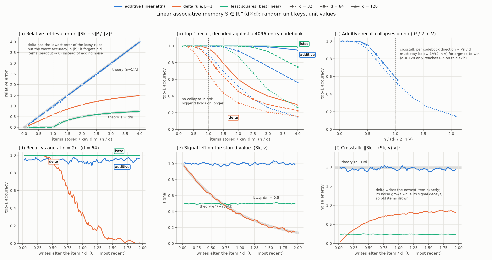

# Linear associative memory capacity

**Question:** a linear-attention state $S \in \mathbb{R}^{d \times d}$ stores $n$ key/value pairs. Does retrieval fall apart once $n > d$, as the "only $d$ orthogonal keys" argument suggests? Does the write rule (additive vs. delta) change that?

**Run:** `python capacity.py && python plot.py`. It is CPU-only numpy and takes about 1 minute. Output goes to `results/`.

**Setup:**
- Keys are random unit vectors in $\mathbb{R}^d$.
- Values come from a codebook of $V = 4096$ random unit vectors.
- $d \in \{32, 64, 128\}$, $n/d \in [0.125, 4]$, 30 trials per point.
- Write rules:
  - additive: $S = \sum v k^\top$
  - delta: $\beta = 1$, applied in order
  - least squares: $S = V^\top (K^\top)^+$, the best any linear map can do
- Reading $r_j = S k_j$ is scored four ways:
  - relative error
  - top-1 decode against the codebook
  - signal: $\langle r_j, v_j \rangle$
  - crosstalk energy

## Findings

1. **Error follows theory closely.** Additive error is $(n-1)/d$, within 1% at $d = 64$. Least-squares error is $\max(0, 1 - d/n)$. So $d$ is a hard limit for *exact* linear recall, and even least squares starts losing energy at $n = d$.
2. **Recall does not fail at $n = d$.** With nearest-neighbour decoding, additive recall is still 99.8% at $n = d$ and 94% at $n = 2d$ ($d = 64$). Accuracy does not collapse on $n/d$. It does collapse on $n / (d^2 / 2\ln V)$ (panel c):
   - Per codebook direction, crosstalk is about $\sqrt{n}/d$.
   - The argmax picks the right value while that stays below $1/\sqrt{2 \ln V}$.
   - So approximate-recall capacity scales like $d^2/\log V$, not $d$.
   - The "retrieve noise after $d$ keys" story is right about error and wrong about recall.
3. **With unique random keys, delta ($\beta = 1$) is worse than additive.** It has *lower* MSE but *worse* accuracy.
   - Each later write multiplies $S$ by $(I - k k^\top)$. The signal on an old item decays as $e^{-\text{age}/d}$ (panel e, measured vs. predicted: 0.80 vs. 0.78 at age $d/4$, 0.39 vs. 0.37 at age $d$).
   - Crosstalk grows at the same time (panel f).
   - Net effect: a recency window of roughly $0.6d$ items, beyond which recall drops to chance.
   - The old items shrink toward zero instead of picking up noise, which is why the MSE looks good.
4. **Why delta rules exist anyway.** Their benefit is overwriting a key that repeats. Additive attention can only sum the old and new values for that key, and this experiment never repeats a key. Getting a real comparison needs a task with key reuse, or $\beta < 1$.

## Not tested

- Repeated / updated keys, where delta should win.
- $\beta < 1$, and gated / decayed additive rules.
- Structured or learned keys instead of random ones.
- $d_v \ne d_k$.
- Softmax readout as a reference.
