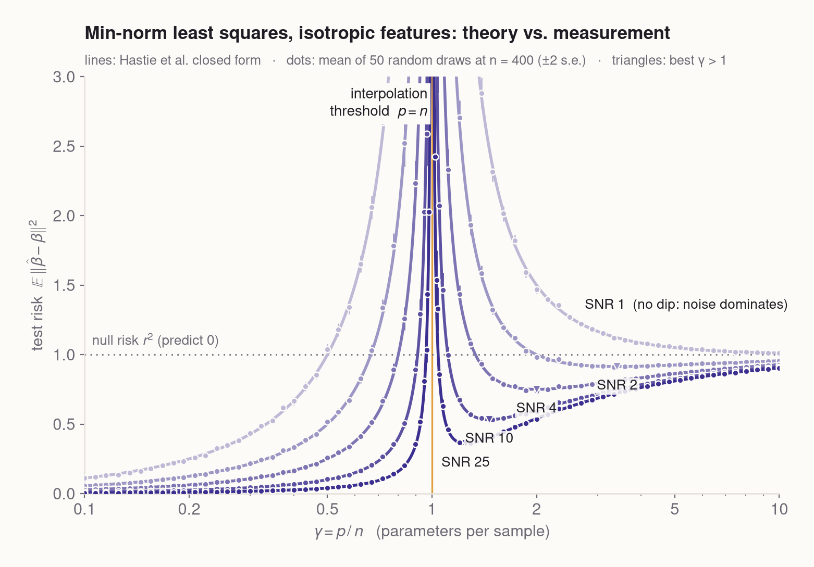
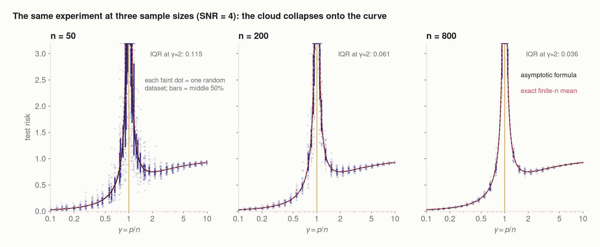
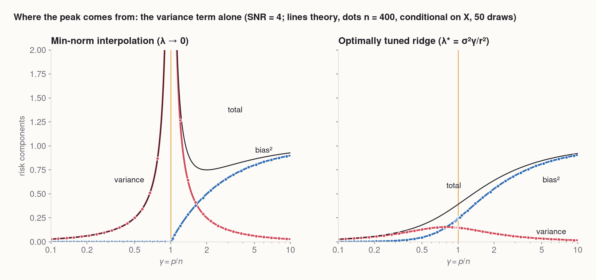
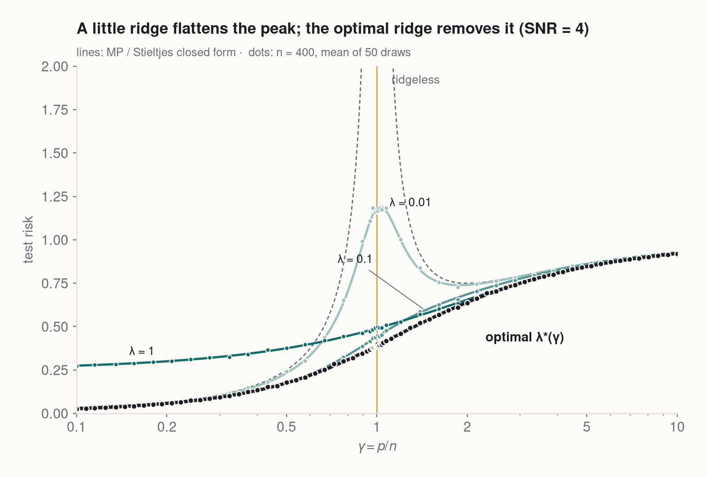
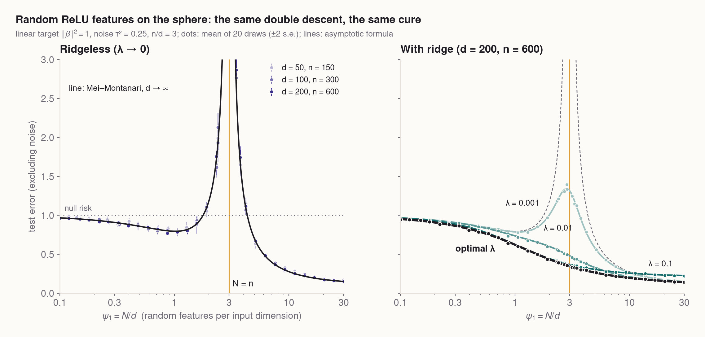
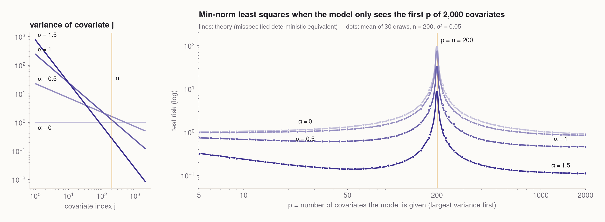

# The second descent

<p class="subtitle">Classical statistics says bigger models overfit. Modern deep learning happily trains models far bigger than their data. Both are right, and the curve that reconciles them has a spike exactly where the model can <em>just barely</em> fit the data. In the simplest settings that curve is exactly computable. We compute it, measure it, take it apart, and then chase it into real convolutional networks.</p>

<style>
.dd-controls { display: flex; flex-wrap: wrap; gap: .45rem 1.1rem; align-items: center; margin-bottom: .6rem; font-size: .86rem; }
.dd-row { display: flex; flex-wrap: wrap; gap: 14px; align-items: flex-start; justify-content: center; }
.dd-val { font-variant-numeric: tabular-nums; min-width: 3.6em; display: inline-block; }
.dd-check { font-size: .84rem; }
.dd-readout { font-size: .84rem; font-variant-numeric: tabular-nums; margin-top: .5rem; line-height: 1.5; }
.dd-hint { color: #6e6a75; font-size: .8rem; line-height: 1.45; margin-top: .55rem; }
.widget { background: #fcfbf8; }
.widget canvas { display: block; margin: 0 auto; }
.widget button { font: inherit; font-size: .82rem; padding: .25rem .75rem; border: 1px solid #d8d3ca; border-radius: 6px; background: #fcfbf8; cursor: pointer; color: inherit; }
.widget button:hover { background: #f3f0ea; }
.widget input[type=range] { width: 130px; accent-color: #3b2f8f; }
.widget-title { font-weight: 600; font-size: .95rem; margin: 0 0 .55rem; }
.widget.night { background: #0e0b12; border-color: #2a2431; color: #f2ede6; }
.widget.night .dd-hint { color: #8f8898; }
.widget.night button { background: #1b1621; border-color: #3a3242; }
.widget.night button:hover { background: #2a2431; }
.widget.night input[type=range] { accent-color: #ff9a5a; }
.widget.night canvas + canvas { margin-top: 6px; }
figure.hero { background: #0e0b12; border-radius: 12px; overflow: hidden; margin-top: 1.4rem; box-shadow: 0 22px 60px rgba(14, 11, 18, .35); }
figure.hero figcaption { color: #8f8898; padding: .1rem 1.2rem 1rem; }
figure video { border-radius: 8px; }
.tag { display: inline-block; font: 600 .68rem/1 "Inter", "Helvetica Neue", Arial, sans-serif; letter-spacing: .06em; text-transform: uppercase; padding: .28rem .5rem; border-radius: 4px; vertical-align: middle; margin-left: .35rem; }
.tag.lit { background: #e6e3f5; color: #3b2f8f; }
.tag.new { background: #fde5e3; color: #a3303f; }
.keyeq { background: #fff; border: 1px solid #e7e2dc; border-radius: 8px; padding: .2rem 1rem; margin: 1.2rem 0; }
table.nums td:nth-child(n+2), table.nums th:nth-child(n+2) { text-align: right; font-variant-numeric: tabular-nums; }
</style>

<figure class="hero wide">
<video autoplay loop muted playsinline poster="figures/hero_poster.png" src="figures/hero.mp4"></video>
<figcaption>Twenty noisy samples of a smooth function (dots), fitted by a model with $p$ random cosine features. When there are more features than points, infinitely many fits pass through every point; we always take the one with the smallest coefficients. The line's colour is its test error. Bottom left: test error against $p$ (the median over 200 random draws of the features). Bottom right: the smallest singular value of the $20 \times p$ feature matrix. The disaster at $p = 20$ and the collapse of that singular value to $10^{-12}$ are the same event.</figcaption>
</figure>

Watch the fit in the animation. With a handful of features it is a smooth, slightly wrong compromise. As features are added it gets better, just as a statistics course would predict, and then, around 15 features, it starts to go wrong. At exactly 20 features, one per data point, the curve is forced through every noisy dot and swings wildly between them. The test error is ten thousand times its best value.

Here is the part the statistics course didn't cover. Keep adding features, far more than there are data points, and the wild swings *calm down*. By a few hundred features the fit is smooth again. It still passes through every noisy point, and yet it's nearly as good as the best small model. The test error goes down, up, and then down a second time.

This shape is called **double descent** (Belkin, Hsu, Ma & Mandal 2019). It resolves an apparent contradiction. Classical statistics says overparameterized models overfit. Modern practice trains networks with far more parameters than examples, and they generalize. Both are describing the same curve, on different sides of the spike.

This post answers three questions:

1. **Where does the spike come from?** A single number, the smallest singular value of the feature matrix, explains it. In linear regression we can compute the whole curve in closed form and check it against simulation.
2. **How do you get rid of it?** Tuned regularization removes it, and we'll see exactly why.
3. **Does any of this say something quantitative about real neural networks?** Here we train a family of CNNs ourselves and test a published prediction of where their spike should sit.

## 1. Play with it first

Before any math, try the hero experiment yourself. Everything below is computed live in your browser, with an exact least-squares solver. Drag the feature count through 20. Drag a data point and watch how violently the $p \approx n$ fit reacts, compared with the fits far to either side. Then add a tiny ridge penalty.

<div class="widget wide night">
<p class="widget-title">Random-features regression, live</p>
<div id="rf-widget"></div>
</div>

A few things to notice:

- **The peak is not about the particular data.** Press "new random features" or "new noise". The spike stays at $p = n$.
- **The coefficients explode there.** At $p = 20$ the norm $\lVert a\rVert$ jumps by five to ten orders of magnitude. It does so while the smallest singular value of the feature matrix falls toward zero.
- **A ridge penalty of $10^{-3}$ flattens the spike completely.** It barely changes the fit anywhere else. We'll see why in §4.

The model is a linear model in disguise: $f(x) = \sum_{j=1}^p a_j \phi_j(x)$ with fixed random features $\phi_j(x) = \sqrt{2/p}\,\cos(w_j x + b_j)$. Only the weights $a$ are learned. That makes it the simplest place to understand the phenomenon exactly, so let's strip it down further.

## 2. The whole curve in one formula <span class="tag lit">literature</span>

Take the plainest possible regression problem. Each input $x \in \mathbb{R}^p$ has independent standard Gaussian entries, and the target is linear plus noise:

$$y = x^\top \beta + \varepsilon, \qquad \lVert \beta \rVert^2 = r^2, \qquad \varepsilon \sim \mathcal{N}(0, \sigma^2).$$

We see $n$ examples, stacked into an $n \times p$ matrix $X$ and a vector $y$. The **signal-to-noise ratio** is $\mathrm{SNR} = r^2/\sigma^2$.

**The fitting rule.** When $p < n$ we use ordinary least squares. When $p > n$ there are infinitely many $\hat\beta$ with $X\hat\beta = y$ exactly, and we pick the one with the smallest norm, $\hat\beta = X^+ y$ (the pseudoinverse). This is not an arbitrary choice. Gradient descent started from zero converges to exactly this solution, so it's what "just train it" gives you.

**The score.** The test risk is how far our predictions are from the noiseless truth on a fresh input,

$$R = \mathbb{E}_{x}\big[(x^\top\hat\beta - x^\top\beta)^2\big] = \lVert \hat\beta - \beta\rVert^2 .$$

It leaves out the irreducible $\sigma^2$ a fresh noisy label would add. A model that always predicts 0 scores $R = r^2$, the **null risk**.

Hastie, Montanari, Rosset & Tibshirani (2022) worked out what happens when $n$ and $p$ grow together with a fixed ratio $\gamma = p/n$, the number of parameters per sample:

<div class="keyeq">

$$
R(\gamma) \;\longrightarrow\;
\begin{cases}
\sigma^2\,\dfrac{\gamma}{1-\gamma}, & \gamma < 1 \quad\text{(fewer parameters than samples)}\\[2ex]
r^2\Big(1-\dfrac{1}{\gamma}\Big) + \sigma^2\,\dfrac{1}{\gamma-1}, & \gamma > 1 \quad\text{(more parameters than samples)}
\end{cases}
$$

</div>

Read it left to right:

- **Below the threshold** the error is pure noise amplification: $\sigma^2$ times $\gamma/(1-\gamma)$. That factor is harmless for small $\gamma$ and infinite at $\gamma = 1$.
- **Above the threshold** there are two terms. $\sigma^2/(\gamma-1)$ is the same noise amplification, now *decreasing* as parameters are added. $r^2(1-1/\gamma)$ is new: a bias that grows toward the null risk.
- **The overparameterized side has a sweet spot** when those two terms balance. For SNR above 1 it sits at $\gamma^\star = \sqrt{\mathrm{SNR}}/(\sqrt{\mathrm{SNR}}-1)$.

Here is the formula next to a simulation with $n = 400$.

<figure class="wide">

<figcaption>Five signal-to-noise ratios ($r^2 = 1$). Lines are the formula above. Dots are the average over 50 independent datasets with $n = 400$, at 80 values of $p$ (±2 standard errors). Away from the threshold ($|\gamma - 1| > 0.25$) the measured mean is within 0.3–0.5% of the formula (median over $\gamma$) and within 5% everywhere. The triangles mark $\gamma^\star$. For SNR = 1 the curve never dips below the null risk: with that much noise, interpolating is never a good idea.</figcaption>
</figure>

The dots land on the lines. The formula is asymptotic, but $n = 400$ is already big enough that you can't tell the difference away from the spike. How fast does randomness wash out? Here is one SNR at three sample sizes, with every dataset drawn as its own dot:

<figure class="wide">

<figcaption>Each faint dot is the risk of one random dataset; bars span the middle 50% of 50 datasets. The interquartile range at $\gamma \approx 2$ shrinks from 0.115 ($n = 50$) to 0.061 ($n = 200$) to 0.036 ($n = 800$), roughly halving for every 4× more data, as $1/\sqrt{n}$ fluctuations should. The red dashed line is the <em>exact</em> finite-$n$ average, $\sigma^2 p/(n-p-1)$ below the threshold and $r^2(1-n/p) + \sigma^2 n/(p-n-1)$ above it (from inverse-Wishart moments). It differs from the asymptotic formula only by that "−1", which matters only right next to $p = n$.</figcaption>
</figure>

That finite-$n$ formula hides a small shock. For $n - 1 \le p \le n + 1$ the average risk is **infinite**, not just large. That's why no dots are drawn within ±2 of the threshold: an average over 50 draws of a quantity with infinite mean is meaningless.

## 3. Where the spike comes from: one tiny eigenvalue <span class="tag lit">literature</span>

Split the error of the min-norm solution into what the data can't tell us and what the noise does to us. Plug $y = X\beta + \varepsilon$ into $\hat\beta = X^+y$:

$$\hat\beta - \beta = \underbrace{(X^+X - I)\,\beta}_{\text{bias: the part of }\beta\text{ the data never sees}} \;+\; \underbrace{X^+\varepsilon}_{\text{variance: noise, pushed through }X^+}.$$

**The bias** is the component of $\beta$ outside the row space of $X$. With $p \le n$ that row space is everything, so the bias is zero. With $p > n$ it's a random $n$-dimensional slice of $\mathbb{R}^p$, which captures a fraction $n/p = 1/\gamma$ of $\lVert\beta\rVert^2$ on average. That gives bias $= r^2(1 - 1/\gamma)$. No surprises, and certainly no spike.

**The variance** is where the drama is. Write $\lambda_1, \dots, \lambda_{\min(n,p)}$ for the non-zero eigenvalues of $X^\top X/n$ (the squared singular values of $X/\sqrt n$). The pseudoinverse divides by each singular value, so noise along the $i$-th direction gets amplified by $1/\sqrt{\lambda_i}$, and

$$\mathbb{E}\,\lVert X^+ \varepsilon\rVert^2 \;=\; \sigma^2 \cdot \frac{1}{n}\sum_i \frac{1}{\lambda_i}.$$

The variance is an average of *inverse* eigenvalues. It is dominated by the smallest one.

So what do the eigenvalues of a random matrix look like? Marchenko & Pastur (1967) answered this. As $n, p \to \infty$ with $p/n = \gamma$, the histogram of eigenvalues converges to a fixed shape that lives between two edges,

$$\lambda_- = (1-\sqrt{\gamma})^2, \qquad \lambda_+ = (1+\sqrt{\gamma})^2 .$$

The lower edge is the whole story. For $\gamma = 0.25$ it sits at 0.25, and nothing gets amplified much. As $\gamma \to 1$ it slides to **zero**: a square random matrix is nearly singular. Past $\gamma = 1$ it moves away from zero again, because a wide matrix has plenty of room to keep its $n$ non-zero directions well separated. The extra $p - n$ directions become exact zeros, which the pseudoinverse simply ignores. They cost bias, not variance.

<figure class="wide">
<video autoplay loop muted playsinline poster="figures/mp_edge_poster.png" src="figures/mp_edge.mp4"></video>
<figcaption>Left: eigenvalues of $X^\top X/n$ for one $800 \times p$ Gaussian matrix as columns are added (bars, log scale), against the Marchenko–Pastur density (line). The dashed line marks the predicted lower edge $(1-\sqrt\gamma)^2$. Top right: the smallest non-zero eigenvalue against $\gamma$. Bottom right: the variance term $\sigma^2 \frac1n\sum_i 1/\lambda_i$ computed from these very eigenvalues (dots), against the closed form (line).</figcaption>
</figure>

Averaging $1/\lambda$ over the Marchenko–Pastur density gives $1/(1-\gamma)$ below the threshold, so the variance is $\sigma^2 \cdot \frac{p}{n} \cdot \frac{1}{1-\gamma} = \sigma^2\gamma/(1-\gamma)$. Above it, the same calculation for the $n$ non-zero eigenvalues gives $\sigma^2/(\gamma-1)$. Those are exactly the formulas from §2. The spike is the lower edge of a random matrix spectrum touching zero.

The same decomposition, measured:

<figure class="wide">

<figcaption>Bias² (blue) and variance (red) against $\gamma$, at SNR = 4. Lines are closed forms; dots are measured on the same $n = 400$ datasets as before (conditional on $X$, averaged exactly over the noise). Left: the min-norm interpolator. The spike is all variance. Bias only switches on after the threshold, and it rises smoothly. Right: optimally tuned ridge, the subject of the next section.</figcaption>
</figure>

This also explains why the second descent happens. Past the threshold, adding parameters does two things. It makes the matrix wider, which pushes the smallest non-zero eigenvalue back up and shrinks variance like $1/(\gamma-1)$. It also spreads the fit over more directions the data can't see, which costs bias. When the noise is large compared with what the extra bias costs, more parameters win. This is the linear-model version of "benign overfitting" (Bartlett, Long, Lugosi & Tsigler 2020): the min-norm interpolant hides the noise it memorized in many directions that each matter very little.

The hero animation is the same mechanism in a nonlinear costume. Its bottom-right panel showed the smallest singular value of the $20 \times p$ feature matrix falling from about 0.1 to $10^{-12}$ at $p = 20$, then climbing back.

## 4. The cure: regularize, but by the right amount <span class="tag lit">literature</span>

If the problem is dividing by eigenvalues that are nearly zero, the fix is obvious: don't. **Ridge regression** adds a penalty,

$$\hat\beta_\lambda = \arg\min_b\; \tfrac1n\lVert y - Xb\rVert^2 + \lambda\lVert b\rVert^2,$$

which replaces each amplification $1/\sqrt{\lambda_i}$ by $\sqrt{\lambda_i}/(\lambda_i + \lambda)$. That factor never exceeds $1/(2\sqrt{\lambda})$, however small $\lambda_i$ gets. The price is a bit of bias, because every direction gets shrunk a little.

Hastie et al. give this in closed form too (their Corollary 5). With $m(z)$ the Stieltjes transform of the Marchenko–Pastur law, a function with a known algebraic formula,

$$R_\lambda \to \underbrace{r^2\,\lambda^2\, m'(-\lambda)}_{\text{bias}^2} \;+\; \underbrace{\sigma^2\,\gamma\,\big(m(-\lambda) - \lambda\, m'(-\lambda)\big)}_{\text{variance}}, \qquad m(-\lambda) = \int \frac{d\mu_{\mathrm{MP}}(s)}{s + \lambda}.$$

This is still just "average a function of the eigenvalues against the MP density", with $1/s$ softened to ridge's filter. The risk is minimized by

$$\lambda^\star = \frac{\sigma^2 \gamma}{r^2} = \frac{\gamma}{\mathrm{SNR}},$$

the ridge penalty that turns $\hat\beta_\lambda$ into the Bayes posterior mean when $\beta$ has a Gaussian prior. Our numerical minimizer agrees with it to $10^{-3}$.

<figure>

<figcaption>Test risk for fixed ridge penalties (teal, lighter = smaller λ) and for the optimally tuned $\lambda^\star(\gamma)$ (black), at SNR = 4. Lines: closed form. Dots: the same $n = 400$ simulations. λ = 0.01 caps the spike at 1.2. λ = 1 kills it, but over-shrinks when there are few parameters. The optimal curve has no spike at all, and it rises monotonically in $\gamma$, because in this model every extra parameter is pure noise.</figcaption>
</figure>

Nakkiran, Venkat, Kakade & Ma (2021) proved the general statement behind the black curve. For isotropic Gaussian linear regression, the optimally tuned ridge risk is *monotone*: more samples never hurt (their Theorem 1), and neither do more features in a random-projection version of the model (Theorem 3). **Double descent is a symptom of under-regularization, not a law of nature.** They conjecture, but do not prove, the same for non-isotropic data.

Now it's your turn with the formulas. Everything in this widget is the closed form, computed in JavaScript as you drag.

<div class="widget wide">
<p class="widget-title">The exact risk curve: bias, variance, ridge</p>
<div id="risk-widget"></div>
</div>

Some experiments to try:

- **Set SNR to 0.3** (very noisy). Nothing to the right of the threshold beats predicting zero. Only small models ($\gamma$ below about 0.23) do better than nothing.
- **Set SNR to 25.** The spike gets narrower, and the sweet spot $\gamma^\star$ moves right next to the threshold.
- **Tick "optimal".** The bias and variance curves cross smoothly instead of the variance erupting.

## 5. Beyond linear: random ReLU features <span class="tag lit">literature</span>

Isotropic Gaussian features are a caricature. What about features computed by a neural network? The cleanest step up is a two-layer network whose first layer is random and frozen,

$$f(x) = \sum_{a=1}^{N} a_a\, \sigma\!\big(\langle \theta_a, x\rangle / \sqrt d\big), \qquad \sigma = \mathrm{ReLU},$$

trained by ridge regression on the output weights $a$. This is the random-features model of Rahimi & Recht, and a caricature of a wide network in its lazy regime. Mei & Montanari (2022) derived its exact asymptotic test error. Inputs $x$ and weights $\theta_a$ are uniform on the sphere of radius $\sqrt d$, and $N$, $n$, $d$ grow together with $\psi_1 = N/d$ features and $\psi_2 = n/d$ samples per input dimension.

The answer is heavier than §2's: a pair of coupled fixed-point equations and three polynomials of degree 5. It is still a formula you can type in, and it depends on the activation only through two numbers, $\mu_1 = \mathbb{E}[G\,\sigma(G)]$ and $\mu_\star^2 = \mathrm{Var}\,\sigma(G) - \mu_1^2$ with $G \sim \mathcal N(0,1)$. The linear part $\mu_1$ carries signal. The nonlinear part $\mu_\star$ acts like extra noise injected into every feature. That is the heart of the **Gaussian equivalence principle** (made rigorous in general by Hu & Lu 2023): for this purpose, random ReLU features behave like a noisy *linear* model.

<figure class="wide">

<figcaption>Random ReLU features learning a linear target (noise variance 0.25) with $n = 3d$ samples. <b>Left</b>: ridgeless, at input dimensions $d$ = 50, 100, 200, against the $d\to\infty$ formula. <b>Right</b>: fixed ridge penalties and the optimal one ($d = 200$). Our implementation of the formula matches Monte Carlo at $d=200$ to 0.9% (median) away from the threshold, and the optimally tuned curve to 1.2% everywhere. The optimal-λ theory curve decreases monotonically in $N$: no spike.</figcaption>
</figure>

The spike sits where the number of features $N$ equals the number of samples $n$. It does *not* sit where $N$ equals the input dimension $d$, which is the other natural guess. The mechanism is the same as before: a feature matrix that is square and therefore nearly singular. One difference from the linear model is that here the *bias* also diverges at $N = n$ (Mei & Montanari, Prop. 5.1), not just the variance.

## 6. Deep double descent, measured <span class="tag new">new measurements</span>

CNN_SECTION_PLACEHOLDER

## 7. Where it breaks

**Finite size moves the spike's height, not its location.** Asymptotic formulas predict an infinite spike; any real experiment has a finite, noisy one. In the linear model the exact finite-$n$ mean is infinite for $|p - n| \le 1$, and the individual draws at $p = n \pm 2$ scatter over two orders of magnitude (the $n = 50$ panel in §2). In random features the theory underestimates the height of the spike at small $d$. At $N = 0.95\,n$, 20 draws averaged 10.0 at $d = 50$ and 10.4 at $d = 100$, against a $d = \infty$ prediction of 7.4 and 8.0. At $d = 200$ they agree (8.0 vs 8.0). Away from the threshold, the relative gap shrinks steadily with $d$: a median of 3.1% at $d = 50$, 1.8% at $d = 100$, 0.9% at $d = 200$.

**The ridgeless random-features formula is a limit of ridge, not a theorem about the pseudoinverse.** Mei & Montanari take $\lambda \to 0$ *after* $d \to \infty$. That this equals the min-norm interpolator is conjectured; our simulations are consistent with it.

**Anisotropy changes the spike's height, not where it is, at least in linear regression.** Real features have wildly unequal variances. So we gave the model $p$ out of 2,000 covariates with power-law variances $\propto j^{-\alpha}$, most important first. Everything it can't see acts as extra noise (Hastie et al. §5 call this the misspecified model). Does the spike move?

<figure class="wide">

<figcaption>Left: covariate variances for four decay exponents (normalized to a total of 2,000). Right: min-norm test risk against the number of covariates given to the model, with $n = 200$ samples and a target spread evenly over all 2,000 coordinates. Lines: the deterministic-equivalent formula (Hastie et al. §3 plus the §5 misspecification substitution); dots: the average of 30 simulated datasets (median relative gap below 1%).</figcaption>
</figure>

It doesn't. For all four exponents, both theory and simulation put the peak at $p = n$ to within the grid resolution ($p = 198$ or $202$). The height of the theory's peak falls from 96 ($\alpha = 0$) to 9 ($\alpha = 1.5$). The underparameterized dip moves, and at $\alpha = 1.5$ a real classical sweet spot appears around $p \approx 50$. In linear least squares the spike is a *rank* event: $X_p$ becomes square, whatever the covariance. The one requirement is that the columns are in general position, which Gaussian data guarantees. A small fixed ridge ($\lambda = 10^{-3}$ or $10^{-2}$) doesn't move it either; it only lowers it. So when the peak *does* move, as it does for the CNNs of §6, the reason must lie elsewhere: in what training can fit, not in the rank of a matrix.

**What we did not test.** The prompt for this project asked whether the random-features formula still tracks a two-layer network once its first layer learns. We ran out of room for it. Feature learning breaks Gaussian equivalence in known ways, so the formula is not expected to hold quantitatively there.

## Reproduce it

Everything runs from `theory/` with the shared virtualenv. The linear, random-features and anisotropy parts are CPU-only and take a few minutes. The CNN sweep used one GPU slot for about CNN_HOURS hours on a shared GB10.

```bash
cd theory
export PY=.venv/bin/python D=01-double-descent
$PY $D/test_core.py                         # closed forms vs integrals and simulation
$PY $D/compute_linear.py main && $PY $D/compute_linear.py sizes
$PY $D/compute_rf.py && $PY $D/compute_aniso.py && $PY $D/compute_hero.py
_shared/gpu_run.sh bash $D/run_cnn.sh main 10000 0.2 500      # 4 worker processes in one slot, resumable
for r in linear rf aniso cnn; do $PY $D/render_$r.py; done
$PY $D/render_hero.py && $PY $D/render_mp.py && $PY $D/render_cnn_anim.py
$PY $D/export_widgets.py
$PY _shared/render_post.py $D/post.md --shot
```

Open `post.html#selftest` to run the widgets' self-checks. They compare the in-browser formulas and least-squares fits with values exported from Python.

## References

1. M. Belkin, D. Hsu, S. Ma, S. Mandal. *Reconciling modern machine-learning practice and the classical bias–variance trade-off.* PNAS 116(32):15849–15854, 2019. [arXiv:1812.11118](https://arxiv.org/abs/1812.11118)
2. T. Hastie, A. Montanari, S. Rosset, R. J. Tibshirani. *Surprises in high-dimensional ridgeless least squares interpolation.* Annals of Statistics 50(2):949–986, 2022. [arXiv:1903.08560](https://arxiv.org/abs/1903.08560)
3. S. Mei, A. Montanari. *The generalization error of random features regression: precise asymptotics and the double descent curve.* Communications on Pure and Applied Mathematics 75(4):667–766, 2022. [arXiv:1908.05355](https://arxiv.org/abs/1908.05355)
4. P. Nakkiran, P. Venkat, S. Kakade, T. Ma. *Optimal regularization can mitigate double descent.* ICLR 2021. [arXiv:2003.01897](https://arxiv.org/abs/2003.01897)
5. P. Nakkiran, G. Kaplun, Y. Bansal, T. Yang, B. Barak, I. Sutskever. *Deep double descent: where bigger models and more data hurt.* ICLR 2020; J. Stat. Mech. 2021:124003. [arXiv:1912.02292](https://arxiv.org/abs/1912.02292)
6. V. A. Marchenko, L. A. Pastur. *Distribution of eigenvalues for some sets of random matrices.* Math. USSR-Sbornik 1(4):457–483, 1967.
7. M. S. Advani, A. M. Saxe, H. Sompolinsky. *High-dimensional dynamics of generalization error in neural networks.* Neural Networks 132:428–446, 2020. [arXiv:1710.03667](https://arxiv.org/abs/1710.03667)
8. H. Hu, Y. M. Lu. *Universality laws for high-dimensional learning with random features.* IEEE Trans. Information Theory 69(3):1932–1964, 2023. [arXiv:2009.07669](https://arxiv.org/abs/2009.07669)
9. P. L. Bartlett, P. M. Long, G. Lugosi, A. Tsigler. *Benign overfitting in linear regression.* PNAS 117(48):30063–30070, 2020. [arXiv:1906.11300](https://arxiv.org/abs/1906.11300)
10. B. Adlam, J. Pennington. *Understanding double descent requires a fine-grained bias-variance decomposition.* NeurIPS 2020. [arXiv:2011.03321](https://arxiv.org/abs/2011.03321)
11. S. Spigler, M. Geiger, S. d'Ascoli, L. Sagun, G. Biroli, M. Wyart. *A jamming transition from under- to over-parametrization affects generalization in deep learning.* J. Phys. A 52(47):474001, 2019. [arXiv:1810.09665](https://arxiv.org/abs/1810.09665)
12. A. Krogh, J. A. Hertz. *Generalization in a linear perceptron in the presence of noise.* J. Phys. A 25(5):1135–1147, 1992.
13. M. Loog, T. Viering, A. Mey, J. H. Krijthe, D. M. J. Tax. *A brief prehistory of double descent.* PNAS 117(20):10625–10626, 2020. [arXiv:2004.04328](https://arxiv.org/abs/2004.04328)
14. A. Rahimi, B. Recht. *Random features for large-scale kernel machines.* NeurIPS 2007.

<script src="widgets/common.js"></script>
<script src="widgets/data_rf.js"></script>
<script src="widgets/data_risk.js"></script>
<script src="widgets/rf.js"></script>
<script src="widgets/risk.js"></script>
