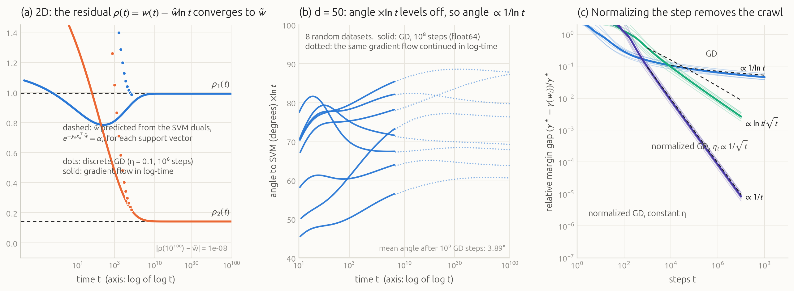
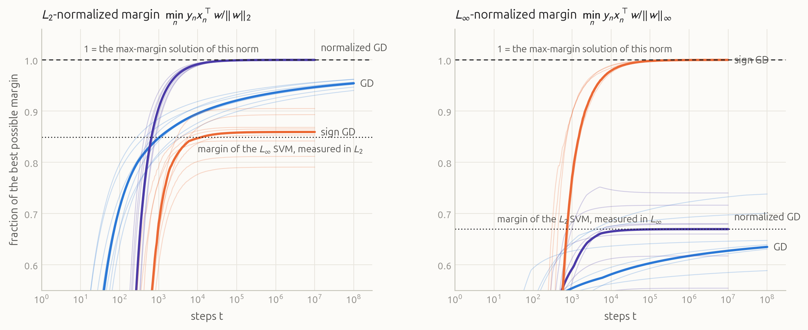
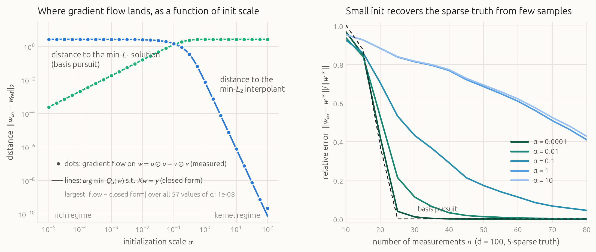
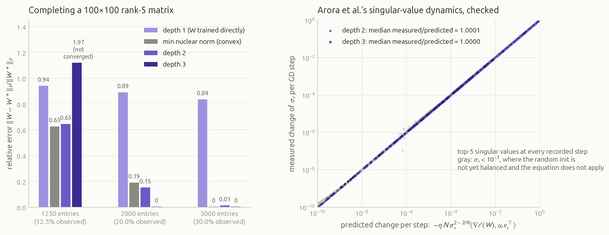
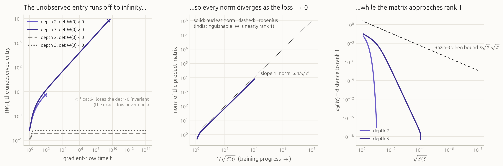
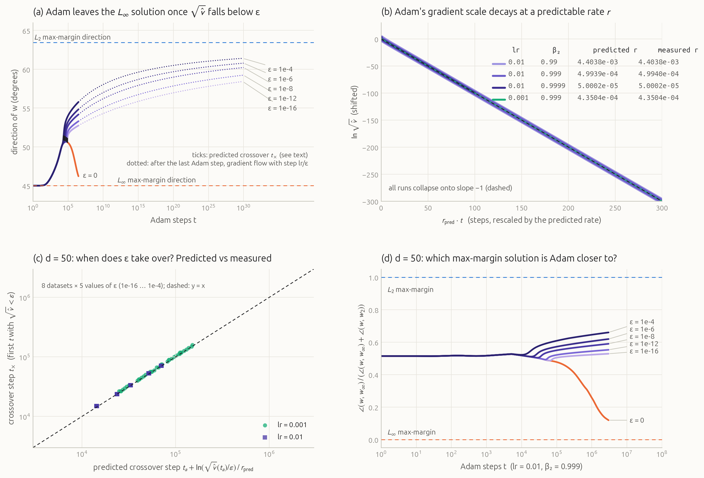
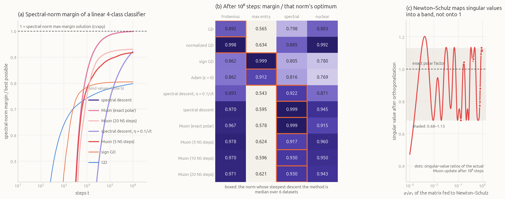

# The optimizer chooses

<p class="subtitle">When infinitely many solutions fit the data perfectly, the loss can't tell you which one training finds. The optimizer, the parameterization and the initialization decide. A tour with measurements, from logistic regression to Adam and Muon.</p>

<style>
.ib-controls { display: flex; flex-wrap: wrap; gap: .45rem 1.1rem; align-items: center; margin-bottom: .55rem; font-size: .86rem; }
.ib-row { display: flex; flex-wrap: wrap; gap: 14px; align-items: flex-start; justify-content: center; }
.ib-row > div { flex: 1 1 380px; }
.ib-val { font-variant-numeric: tabular-nums; min-width: 3.2em; display: inline-block; color: #1d1d1f; }
.ib-read { color: #52514e; font-variant-numeric: tabular-nums; font-size: .84rem; }
.ib-sub { color: #8b8984; font-size: .8rem; text-transform: uppercase; letter-spacing: .04em; }
.ib-test { display: none; font-size: .75rem; background: #f3f0ea; padding: .5rem; }
.widget button { font: inherit; font-size: .84rem; padding: .28rem .8rem; border: 1px solid #d8d3ca; border-radius: 6px; background: #fcfbf8; cursor: pointer; }
.widget button:hover { background: #f3f0ea; }
.widget input[type=range] { width: 130px; accent-color: #2a78d6; }
.widget select { font: inherit; font-size: .84rem; }
.widget { background: #fcfbf8; }
.widget canvas { margin: 0 auto; }
.widget .wcap { color: #6b6b70; font-size: .84rem; line-height: 1.45; margin: .6rem 0 0; }
figure.hero { background: #0b0d12; border-radius: 10px; padding: 0; overflow: hidden; }
figure.hero figcaption { color: #8e929c; padding: .2rem 1.1rem .9rem; }
.tag { display: inline-block; font: 600 .68rem/1 "Inter", "Helvetica Neue", Arial, sans-serif; letter-spacing: .06em; text-transform: uppercase; padding: .28rem .5rem; border-radius: 4px; vertical-align: middle; margin-right: .4rem; }
.tag.new { background: #fde8dd; color: #9c3a12; }
.tag.lit { background: #e3edf9; color: #1c5cab; }
.keyeq { background: #fff; border: 1px solid #e6e2da; border-radius: 8px; padding: .3rem 1rem; margin: 1.2rem 0; }
</style>

<figure class="hero wide">
<video autoplay loop muted playsinline poster="figures/hero_still.png" src="figures/hero.mp4"></video>
<figcaption>Logistic regression trained by plain gradient descent on data a line can separate. The white line is the decision boundary; the dashed lilac line is the maximum-margin (hard SVM) boundary. Watch the clock on the right: it counts to $10^{100}$ steps, and the boundary is <em>still</em> not there. The dashed curve in the angle panel is the closed-form asymptote from Soudry et al. (2018); after $t \approx 10^{10}$ the measured $w(t)$ sits on it to within $10^{-8}$.</figcaption>
</figure>

Here is a small puzzle. Take a dataset that a straight line can separate, and train logistic regression on it with gradient descent. The loss goes to zero. But logistic loss never actually *reaches* zero: you can always make it smaller by scaling up the weights. So there is no minimum. Instead there is a whole cone of directions, every one of which drives the loss to zero as $\|w\| \to \infty$.

So which direction does gradient descent pick? The animation above gives the answer: the one that makes the **margin** as large as possible, the same boundary a support vector machine would draw. Nobody asked for that. There is no margin term anywhere in the loss. The preference comes from the optimizer.

It also shows something stranger. The boundary gets most of the way there within a few hundred steps. After that it creeps, and the creep never ends: after $10^{100}$ steps it is still a quarter of a degree off.

This post is about that phenomenon, called **implicit bias**. Modern networks have far more parameters than training examples, so there are usually infinitely many ways to fit the training set perfectly. The loss can't choose between them. The choice is made by the optimizer, the parameterization and the initialization, and which solution you get decides how the model generalizes. We'll see four classic examples, each reproduced on this machine with the theory drawn on top of the measurements. Then we'll ask the question for the optimizers people actually use today: Adam and Muon.

## 1. Many perfect fits, one answer

Two kinds of problems make "infinitely many zero-loss solutions" concrete:

- **Underdetermined regression.** With $d$ parameters and $n < d$ equations $Xw = y$, the perfect fits form an affine subspace of dimension $d - n$.
- **Separable classification.** With logistic or cross-entropy loss, any separating direction $w$ gives loss $\to 0$ as you scale it up.

In both cases the loss is flat along a huge set of solutions. Whatever training returns must have been selected by *how* we trained. That selection is usually easiest to describe as a hidden optimization problem. Plain gradient descent on these models secretly solves

$$\min_w \ \|w\|_{\text{something}} \quad \text{subject to fitting the data},$$

and the "something" depends on the algorithm and the parameterization. The rest of this post is a catalogue of what fills that slot, and of how long it takes to get there.

## 2. Logistic regression finds the max-margin SVM, eventually <span class="tag lit">literature</span>

Let the data be $(x_n, y_n)$ with labels $y_n \in \{-1, +1\}$, and train a linear classifier (no bias) on the summed logistic loss

$$L(w) = \sum_{n=1}^{N} \log\big(1 + e^{-y_n x_n^\top w}\big).$$

**Why the margin shows up.** Once the data are classified correctly, every term is roughly $e^{-y_n x_n^\top w}$. The negative gradient is then

$$-\nabla L(w) \approx \sum_n e^{-y_n x_n^\top w}\, y_n x_n .$$

Suppose $w$ grows like $\hat w \log t$ for some direction $\hat w$, scaled so the closest points have $y_n x_n^\top \hat w = 1$. A point at margin $m_n$ then contributes $e^{-m_n \log t} = t^{-m_n}$. The closest points contribute $1/t$; everything farther away contributes $t^{-m_n}$ with $m_n > 1$, which is negligible by comparison. So in the long run, the gradient is a *non-negative combination of the closest points only*. Integrating $1/t$ gives $\log t$, and we get

$$\hat w = \sum_{n \in \text{closest}} \alpha_n\, y_n x_n, \qquad \alpha_n \ge 0, \qquad y_n x_n^\top \hat w \ge 1 .$$

These are exactly the optimality (KKT) conditions of the hard-margin SVM, $\min \|w\|_2^2$ subject to $y_n x_n^\top w \ge 1$. The $\alpha_n$ are its dual variables and the closest points are its support vectors.

<div class="keyeq">

**Theorem (Soudry, Hoffer, Nacson, Gunasekar & Srebro, 2018).** For separable data, a loss with an exponential tail and step size $\eta < 2\beta^{-1}\sigma_{\max}^{-2}(X)$, gradient descent satisfies

$$w(t) = \hat w \log t + \rho(t),$$

where $\hat w$ is the $L_2$ max-margin solution. For almost every dataset the residual $\rho(t)$ stays bounded. If the support vectors span the data, $\rho(t) \to \tilde w$, defined by $\eta\, e^{-y_n x_n^\top \tilde w} = \alpha_n$ for every support vector. The direction converges only like $\big\|\tfrac{w(t)}{\|w(t)\|} - \tfrac{\hat w}{\|\hat w\|}\big\| = O(1/\log t)$.

</div>

The $1/\log t$ is the creep in the hero animation. The correction $\rho(t)$ stays bounded while $\|w\|$ grows like $\log t$, so the angle shrinks like $\|\rho\|/\log t$. Going from $10^{10}$ steps to $10^{100}$ steps multiplies $\log t$ by ten, so it only divides the angle by ten. (The $O(1/\log t)$ rate holds for almost every dataset; for degenerate ones it is $O(\log\log t/\log t)$.)

To check this literally, I integrated the gradient flow in *log-time*, $s = \log t$. The substitution makes the ODE well-behaved out to $t = 10^{100}$ in float64. On the 2D hero dataset the two support vectors span the plane, so $\tilde w$ is fully predicted by the SVM duals. Panel (a) below shows the residual $\rho(t)$ landing on that prediction. Panel (b) repeats the experiment on 8 random datasets in $d = 50$ with $n = 40$, where the theorem only promises the rate. Multiplying the angle by $\ln t$ gives a curve that flattens, which is what a $1/\log t$ law looks like.

<figure class="full">

<figcaption><b>(a)</b> 2D hero data. The residual $w(t) - \hat w \ln t$ converges to the $\tilde w$ computed from the SVM dual variables, shown dashed. Dots are discrete GD with $\eta = 4/\sigma_{\max}^2$ (half the theorem's step-size limit) for $10^7$ steps, plotted at flow time $\eta k$. <b>(b)</b> $d = 50$, $n = 40$, random labels, 8 datasets. Solid lines: GD for $10^8$ steps in float64. Dotted lines: the same gradient flow continued in log-time to $10^{100}$. <b>(c)</b> The gap between the current normalized margin and the best achievable margin. Plain GD follows the $1/\ln t$ guide. Normalizing the step (constant step, or $\eta_t \propto 1/\sqrt t$) makes the gap fall polynomially, consistent with the rates of Nacson et al. (2019) and Ji & Telgarsky (2021). Thin lines are individual datasets; thick lines are medians.</figcaption>
</figure>

The numbers make the creep concrete. On the 2D data the angle to the SVM direction is 15.5° at $t = 1$, 4.5° at $t = 10^4$, 2.3° at $10^{10}$, 1.1° at $10^{20}$ and 0.23° at $10^{100}$. The residual matches the predicted $\tilde w$ to $10^{-8}$. In $d = 50$, after $10^8$ full-batch steps in float64, GD's direction is still on average **3.9°** from the SVM, and its normalized margin is 95.4% of the best possible. Normalized GD with a constant step gets within 0.001° in $10^7$ steps.

The fix for the slowness is simple and well known. The creep happens because the gradient shrinks like $1/t$ as the loss vanishes. Normalizing the step, $w \leftarrow w - \eta\, \nabla L / \|\nabla L\|$, keeps the pace constant. Panel (c) shows the payoff: the margin gap falls polynomially instead of logarithmically. The limit doesn't change, only the speed.

## 3. Change the geometry, change the answer <span class="tag lit">literature</span>

Normalized GD has a useful interpretation. It is **steepest descent with respect to the $L_2$ norm**: among all steps of unit $L_2$ length, it takes the one that decreases the loss fastest. Other norms define other "steepest" directions:

- For $L_\infty$, the steepest unit step is $-\operatorname{sign}(\nabla L)$: **sign gradient descent**, the core of Adam without its running averages.
- For $L_1$, the steepest unit step moves only the single coordinate with the largest gradient: **greedy coordinate descent**.

Gunasekar, Lee, Soudry & Srebro (2018) showed that on separable data with exponential loss, steepest descent with respect to a norm $\|\cdot\|$ maximizes the margin measured in **that same norm**:

$$\lim_{t\to\infty}\ \min_n \frac{y_n x_n^\top w(t)}{\|w(t)\|} \;=\; \max_{\|w\| \le 1}\ \min_n\, y_n x_n^\top w .$$

The direction itself converges when that max-margin solution is unique. Their theorem covers unnormalized steepest descent with a small step-size cap; normalized variants with decaying steps were analysed later by Fan, Schmidt & Thrampoulidis (2025). Below, you can race five optimizers live. The data are built so that the $L_2$, $L_\infty$ and $L_1$ max-margin directions are all different (63°, 45° and 90°).

<div class="widget wide" id="geometry-widget"></div>
<script src="widgets/common.js"></script>
<script src="widgets/data_geometry.js"></script>
<script src="widgets/geometry.js"></script>
<p class="wcap" style="max-width:1000px;margin:-1.2rem auto 2rem">
<b>Widget: optimizer geometry.</b> Five optimizers train the same logistic regression in your browser, in float64. Press run; time is on a log scale. <b>Weight space</b> (right) makes the theorem visible. The shaded region is every $w$ with margin at least 1. Grow a circle, a square and a diamond from the origin until each first touches that region. The touching points are the $L_2$, $L_\infty$ and $L_1$ max-margin solutions, and each optimizer's direction heads toward its own. Sign GD locks onto the corner of the square within a few hundred steps. Coordinate descent heads to the diamond's tip. Plain GD crawls toward the circle. Adam starts at the square's corner, then leaves it; set ε = 0 and compare (section 6).</p>

The same experiment at scale ($d = 50$, eight datasets) shows that each method saturates at the best margin *in its own norm*, and at a strictly worse value in the other norm. The dotted lines mark where theory says the "wrong" optimizer should saturate: the margin of the other norm's max-margin solution.

<figure class="wide">

<figcaption>Left: $L_2$-normalized margin as a fraction of the best possible. Right: the same in $L_\infty$. GD and normalized GD approach 1 on the left (GD slowly) and saturate at the dotted level on the right. Sign GD does the opposite. Sign GD ends slightly <em>above</em> its dotted line on the left. Its $L_\infty$ margin is optimal to $4\cdot10^{-5}$, but on half the datasets its direction stays 0.3–5° from the LP solution cvxpy returns. On one dataset, a direction 5.2° away has an $L_\infty$ margin within 0.05% of the optimum. The $L_\infty$ problem is nearly degenerate, which is exactly the non-uniqueness caveat in the theorem. $d = 50$, $n = 40$, 8 datasets; thick lines are medians.</figcaption>
</figure>

## 4. Change the parameterization: diagonal linear networks <span class="tag lit">literature</span>

So far the model was linear in its parameters. Now keep the *function* linear, $f(x) = \langle w, x\rangle$, but change how $w$ is written down. Woodworth et al. (2020) study the simplest "deep" parameterization there is:

$$w = u \odot u - v \odot v, \qquad u(0) = v(0) = \alpha\,\mathbf 1 .$$

This is a two-layer linear network with diagonal weights. The difference of squares lets $w$ take either sign, and $w(0) = 0$ no matter how large the **initialization scale** $\alpha$ is. We train it with gradient flow on the squared loss for an underdetermined regression $Xw = y$, and ask which of the infinitely many interpolants it lands on.

Start with the smallest possible case: $d = 2$ weights and a single data point $x = (1, 0.4)$, $y = 1$. The perfect fits form a line. Two famous points sit on it. The min-$L_2$ solution is where the smallest circle touches the line. The min-$L_1$ solution is where the smallest diamond touches it, and it is sparse: $w = (1, 0)$.

<figure class="wide">
<video autoplay loop muted playsinline poster="figures/diag_2d_still.png" src="figures/diag_2d.mp4"></video>
<figcaption>Gradient-flow trajectories of the diagonal network from $w = 0$, for initialization scales from $\alpha = 10$ (light blue) down to $\alpha = 0.001$ (dark green). Large $\alpha$ walks straight to the min-$L_2$ point. Small $\alpha$ first grows the coordinate with the larger input, $w_1$, and lands on the sparse min-$L_1$ point. The dashed curve is the level set of Woodworth et al.'s potential $Q_\alpha$ that touches the line. It morphs from circle to diamond as $\alpha$ shrinks, and it always touches the line exactly where the trajectory ends. Paths are the closed form $w(c) = 2\alpha^2 \sinh(c\,x)$; LSODA integration of the actual flow agrees with the endpoints to all printed digits.</figcaption>
</figure>

**Where the potential comes from.** Along the flow, $\dot u = -2\,u \odot g$ and $\dot v = +2\,v \odot g$, where $g = \nabla_w L$. Both solve exactly: $u = \alpha\, e^{-2\int g}$ and $v = \alpha\, e^{+2 \int g}$. Since $g = X^\top r$ always lies in the row space of $X$, the flow can only reach points of the form

$$w = u^2 - v^2 = 2\alpha^2 \sinh\!\big(X^\top \nu\big) \quad\text{for some } \nu \in \mathbb{R}^n .$$

That is precisely the stationarity condition of the convex problem

<div class="keyeq">

$$\min_w\ Q_\alpha(w) = \alpha^2 \sum_i q\!\left(\frac{w_i}{\alpha^2}\right) \quad \text{s.t.}\ \ Xw = y,$$

$$q(z) = 2 - \sqrt{4 + z^2} + z\,\operatorname{arcsinh}(z/2).$$

</div>

This is the **Woodworth et al. (2020)** result. For small $z$, $q(z) \approx z^2/4$: a large $\alpha$ makes every $w_i/\alpha^2$ small, so $Q_\alpha$ is a scaled $L_2$ norm (the "kernel regime"). For large $z$, $q(z) \approx |z|\log|z|$, and $Q_\alpha / \log(1/\alpha^2) \to \|w\|_1$ as $\alpha \to 0$ (the "rich regime"). One knob moves the implicit bias continuously from $L_2$ to $L_1$. The same argument works for depth $D$, $w = u^{D} - v^{D}$, with a different potential that becomes $L_1$-like faster. Try it:

<div class="widget wide" id="diagnet-widget"></div>
<script src="widgets/diagnet.js"></script>
<p class="wcap" style="max-width:1000px;margin:-1.2rem auto 2rem">
<b>Widget: the diagonal network, live.</b> Drag α to move between the kernel and rich regimes. Change the depth D, or move the data point. Everything is computed in your browser: the closed-form flow path, where it lands, and the level set of $Q_\alpha$ (for D ≥ 3, the depth-D potential of Woodworth et al., integrated numerically). <b>Run real gradient descent</b> trains $(u, v)$ step by step (orange dots) so you can check that the dynamics really follow the closed form. The right panel shows that deeper networks reach the sparse answer at much larger α.</p>

The picture is the same in 100 dimensions. Take $d = 100$ weights, $n = 40$ Gaussian measurements and a 5-sparse ground truth, so there is a 60-dimensional space of perfect fits. Sweeping $\alpha$ over seven decades morphs the solution from a dense vector into the sparse truth:

<figure class="wide">
<video autoplay loop muted playsinline poster="figures/diag_stems_still.png" src="figures/diag_stems.mp4"></video>
<figcaption>The interpolant found by the diagonal network, $w_\infty(\alpha)$, as $\alpha$ sweeps from $10^2$ to $10^{-5}$ and back. Rings mark the true 5-sparse $w^\star$. At large $\alpha$ the solution is the dense min-$L_2$ interpolant, with 2.7 units of error. At small $\alpha$ it is basis pursuit, which here recovers $w^\star$ exactly. Frames use the closed-form $Q_\alpha$ minimizer, which matches gradient flow to $10^{-8}$ (next figure).</figcaption>
</figure>

<figure class="wide">

<figcaption>Left: dots are the measured end points of gradient flow on $(u, v)$ (LSODA, rtol $10^{-11}$) for 57 values of $\alpha$. Lines are the closed-form $\arg\min Q_\alpha$, solved independently through its convex dual. They agree to $10^{-8}$ everywhere. The distance to basis pursuit shrinks roughly linearly in $\alpha$ (log-log slope ≈ 0.93); the distance to min-$L_2$ vanishes like $\alpha^{-4}$. Right: relative recovery error against the number of measurements. Ten random problems per point, $d = 100$, 5-sparse truth.</figcaption>
</figure>

A practical note about "small". The distance to basis pursuit shrinks only about linearly in $\alpha$, and Woodworth et al. show that reaching the $L_1$ limit in general needs *exponentially* small initialization. Tiny initialization also costs training time: the flow sits near the saddle at $w = 0$ for time $\sim \log(1/\alpha)$ before the coordinates escape, one at a time.

## 5. Depth and low rank: a bias no norm explains <span class="tag lit">literature</span>

The matrix version of the diagonal network is **deep matrix factorization**. We fit an unknown $100 \times 100$ matrix of rank 5, observing 20% of its entries, by writing $W = W_N \cdots W_2 W_1$ and running gradient descent from a tiny random init on the squared error over the observed entries. With $N = 1$ the unobserved entries never receive a gradient, so nothing is learned about them. With $N \ge 2$ something remarkable happens.

<figure class="wide">
<video autoplay loop muted playsinline poster="figures/mc_spectra_still.png" src="figures/mc_spectra.mp4"></video>
<figcaption>Top: the 12 largest singular values of $W$ during training, with ghost ticks at the true singular values. Bottom: $\sigma_1, \ldots, \sigma_8$ over time on a log axis. Depth 1 inflates everything at once and generalizes badly. Depth 2 learns modes in stages. Depth 3 separates the stages sharply, peeling off one singular value at a time, while the spurious ones stay near zero. Time is gradient-flow time, $\eta \times$ steps. Depth 3 uses a smaller step, $\eta = 4\cdot 10^{-4}$, so that one-step differences track the flow.</figcaption>
</figure>

Arora, Cohen, Hu & Luo (2019) explain the staging with an exact equation. For gradient flow from a balanced initialization, each singular value of the product evolves as

$$\dot\sigma_r = -N\, \big(\sigma_r^2\big)^{1 - 1/N}\ \big\langle \nabla \ell(W),\ u_r v_r^\top \big\rangle .$$

The factor $\sigma_r^{2 - 2/N}$ is a rich-get-richer term. For $N = 1$ it is absent. For $N \ge 2$, singular values that are already large grow faster, and small ones stay frozen near zero until the large ones have fit what they can. Deeper networks make the exponent larger, and the preference for low rank stronger.

<figure class="wide">

<figcaption>Left: relative recovery error after training. The convex baseline is the matrix with minimum nuclear norm that agrees with the observations, solved with SCS. With 2000 observed entries (20%), depth 3 recovers the matrix to $3\cdot10^{-6}$ relative error, depth 2 reaches 0.15, the nuclear-norm minimizer 0.19, and depth 1 just leaves the unobserved entries at zero (0.89). At 30% everything except depth 1 succeeds. At 12.5%, just above the 975 degrees of freedom of a rank-5 matrix, nothing recovers the matrix, and depth 3 had not converged after $5\cdot 10^5$ steps. Right: the Arora et al. equation checked step by step, for the top 5 singular values at every recorded step. The measured one-step change in $\sigma_r$ is plotted against $\eta$ times the right-hand side.</figcaption>
</figure>

A natural guess is that depth secretly minimizes the nuclear norm, a convex proxy for rank. It doesn't. At 20% observed, the depth-3 solution has *larger* nuclear norm than the nuclear-norm minimizer, yet lower error. Razin & Cohen (2020) went further and built a case where the implicit bias can't be *any* norm.

Complete a $2\times 2$ matrix with three observed entries, $W_{12} = W_{21} = 1$ and $W_{22} = 0$. Every completion $\left(\begin{smallmatrix} w & 1 \\ 1 & 0\end{smallmatrix}\right)$ has determinant $-1$. A depth-$N \ge 2$ factorization started from balanced factors with $\det W(0) > 0$ can never change the sign of its determinant under gradient flow, so it can never fit the data exactly. As the loss goes to zero it must send the free entry $|w| \to \infty$. Every norm of $W$ then diverges, while $W$ gets ever closer to rank 1: its second singular value is at most $3\sqrt2\sqrt{\ell}$. Norm minimization would pick a finite completion; depth instead lowers the rank and pays with an unbounded norm.

<figure class="full">

<figcaption>Gradient flow on the Razin–Cohen $2\times2$ problem from $W(0) = 0.1\,I$, as balanced factors. Left: with $\det W(0) > 0$ the unobserved entry grows without bound. With $\det W(0) < 0$ (one factor's sign flipped) the flow reaches zero loss at a finite, small completion. Middle: nuclear and Frobenius norms grow like $1/\sqrt{\ell}$. Right: $\sigma_2$, the distance to the nearest rank-1 matrix, stays below the Razin–Cohen bound. The × marks where float64 round-off tunnels through $\det W = 0$, something the exact flow can't do. The curves stop there.</figcaption>
</figure>

## 6. Modern optimizers <span class="tag new">new measurements</span>

Everything so far is textbook. Now for questions whose answers aren't. Real training uses Adam, and increasingly Muon, not plain or sign gradient descent. What do *they* converge to on the simplest separable problem, and how long does it take with the hyperparameters people actually use?

### 6a. Adam: $L_\infty$ for a while, then $L_2$ forever

**What is known.** Two results seem to disagree:

- **Zhang, Zou & Cao (2024)** prove that Adam converges to the **$L_\infty$** max-margin direction. Their setting removes the stability constant ($\varepsilon = 0$) and uses a decaying learning rate. The intuition: without $\varepsilon$, Adam's update $m/\sqrt{v}$ is a smoothed sign of the gradient, so it inherits sign GD's geometry.
- **Wang et al. (2022)** prove that deterministic Adam **with** $\varepsilon > 0$ and a small constant learning rate converges to the **$L_2$** direction. Once gradients become much smaller than $\varepsilon$, $\sqrt{v} + \varepsilon \approx \varepsilon$ and Adam is just gradient descent with step $\text{lr}/\varepsilon$.

Both are right; they describe different limits. On separable data the gradients shrink exponentially, so every Adam run with $\varepsilon > 0$ eventually enters the second regime. The practical questions are **when** the handover happens and **how far** Adam gets toward $L_\infty$ before it. Neither result quantifies that.

**Method.** Full-batch Adam with bias correction, $\beta_1 = 0.9$, $\beta_2 \in \{0.99, 0.999, 0.9999\}$, constant lr $\in \{10^{-3}, 10^{-2}\}$ and $\varepsilon \in \{0, 10^{-16}, 10^{-12}, 10^{-8}, 10^{-6}, 10^{-4}\}$, on logistic regression in float64. There are two data settings: the 2D data from the widget, and the eight $d = 50$ datasets from section 2. I ran up to $3\cdot10^6$ steps. The gradient is stored as $e^{C}\hat g$, with the moment buffers rescaled as $C$ moves, so the $\varepsilon = 0$ runs can go to margins where $e^{-\text{margin}}$ underflows.

<figure class="full">

<figcaption><b>(a)</b> 2D data, lr = 0.01. Every run first heads toward the $L_\infty$ direction (45°). With $\varepsilon = 0$ it keeps going there. With $\varepsilon > 0$ each run turns around at a crossover step (black ticks: prediction, below) and starts a logarithmic crawl toward the $L_2$ direction (63.4°). Dotted: continuation as gradient flow with step lr/ε. Started from the Adam iterate at $t = 3\cdot10^5$, this continuation predicts Adam's direction at $t = 3\cdot 10^6$ to within 0.001°. <b>(b)</b> In the sign-like phase, the gradient scale decays exactly exponentially, at a rate $r$ fixed by lr, $\beta_1$, $\beta_2$ and the margin (equation below). Rescaling time by the predicted $r$ collapses four runs onto one line. <b>(c)</b> Predicted against measured crossover step on the $d = 50$ datasets. The median error is 4% (lr = $10^{-3}$) and 2% (lr = $10^{-2}$). <b>(d)</b> $d = 50$: where Adam's direction sits between the $L_\infty$ solution (0) and the $L_2$ solution (1), as a median over datasets.</figcaption>
</figure>

**Result 1: there are two phases, and $\varepsilon$ sets the handover.** Before the crossover, all values of $\varepsilon$ produce identical trajectories that head toward the $L_\infty$ solution. After it, runs with larger $\varepsilon$ turn toward $L_2$ sooner (panels a, d). In $d = 50$ with lr = $10^{-2}$, after $3\cdot10^6$ steps the $\varepsilon = 0$ runs are a median 3.7° from the $L_\infty$ solution and 27° from the $L_2$ one. With $\varepsilon = 10^{-8}$ they are 23° and 16° away, and still moving toward $L_2$. The continuation in panel (a) shows how slow the second phase is: even at $10^{30}$ steps, the 2D runs are still 2–5° short of the $L_2$ direction.

**Result 2: a rate law for the first phase.** Suppose the gradient decays like $e^{-rt}$ while its sign pattern stays fixed. Adam's two moving averages are then geometric sums, and the per-coordinate step becomes

$$|\Delta w_i| = \text{lr}\cdot \frac{1-\beta_1}{1-\beta_1 e^{r}} \sqrt{\frac{1 - \beta_2 e^{2r}}{1-\beta_2}} .$$

A sign-like step of that size raises the margin, and hence $-\ln(\text{gradient})$, by $\gamma$ times the step, where $\gamma$ is the $L_\infty$-normalized margin. Self-consistency therefore requires

<div class="keyeq">

$$r = \gamma\,\text{lr}\,\frac{1-\beta_1}{1-\beta_1 e^{r}}\sqrt{\frac{1-\beta_2 e^{2r}}{1-\beta_2}}, \qquad\text{so}\qquad r < \tfrac12 \ln(1/\beta_2) \approx \tfrac{1-\beta_2}{2}.$$

</div>

The square root has to stay real, and that caps the rate. If the gradient shrank faster than $e^{-(1-\beta_2)t/2}$, the second-moment average $v$ would be dominated by old, larger gradients. The steps would shrink, and the decay would slow back down to the cap. I'll call this the **$\beta_2$ throttle**. Solving the equation reproduces the measured rates to four significant digits in every run (the table in panel b): for example $r = 4.4038\cdot10^{-3}$ predicted and measured at $\beta_2 = 0.99$, and $4.9939\cdot 10^{-4}$ predicted against $4.9940\cdot10^{-4}$ measured at $\beta_2 = 0.999$. With the common $\beta_2 = 0.999$, the loss can't fall faster than about $e^{-t/2000}$, however large the learning rate.

**Result 3: when $\varepsilon$ takes over.** The handover happens when $\sqrt{\hat v}$ reaches $\varepsilon$:

$$t_\times \approx t_a + \frac{\ln\!\big(\sqrt{\hat v(t_a)}/\varepsilon\big)}{r},$$

anchored at any early time $t_a$ in the exponential phase. The $L_\infty$ phase therefore lasts a number of steps proportional to $\ln(1/\varepsilon)$, divided by $\min\big(\gamma\,\text{lr},\ (1-\beta_2)/2\big)$ up to the smooth correction above. With $\beta_2 = 0.999$ and $\varepsilon = 10^{-8}$, that is roughly $2\ln(10^8)/10^{-3} \approx 37{,}000$ steps once the throttle binds (panel c).

**Caveats.** All of this is full-batch, linear and float64. With minibatches, $v$ also averages gradient noise, which changes the picture: Baek, Song & Yun (2026) show that per-sample Adam can land on $L_2$. In float32, gradients underflow at much smaller margins than the $e^{-700}$ reachable here. Weight decay (AdamW) adds an explicit $L_\infty$ constraint (Xie & Li 2024) and is not modeled. The rate law assumes a stable sign pattern, which is what makes the first phase sign-like; it will be less clean in networks where the pattern keeps changing.

### 6b. Spectral descent and Muon on a linear multiclass classifier

**What is known.** For a linear $k$-class classifier $W \in \mathbb{R}^{k\times d}$ trained with cross-entropy, Fan, Schmidt & Thrampoulidis (2025) prove the following for normalized steepest descent with respect to any entrywise or Schatten-$p$ norm, with step $\eta_t = \Theta(t^{-1/2})$: the margin measured in that norm approaches its maximum at rate $O\big((\log t + n)/\sqrt t\big)$. The spectral norm gives **spectral descent**, $W \leftarrow W - \eta\, UV^\top$ where $\nabla L = U\Sigma V^\top$. Their momentum version covers **Muon** with *exact* SVD orthogonalization. It does not cover what people actually run: a constant learning rate, Nesterov-style momentum, and the orthogonalization approximated by five Newton–Schulz iterations.

**Question.** Does practical Muon reach the spectral-norm max-margin solution, and does anything change when the SVD is replaced by Newton–Schulz?

**Method.** 4 classes, $d = 24$, $n = 40$ random Gaussian points with random labels, 6 datasets. Every run uses 10⁶ full-batch steps in float64 with the log-scale gradient trick. Constant $\eta = 0.01$ except where noted. Muon uses Nesterov momentum 0.95 on raw gradients, and Newton–Schulz uses Keller Jordan's quintic $(3.4445, -4.7750, 2.0315)$. The max-margin solutions under the Frobenius, max-entry, spectral and nuclear norms come from cvxpy.

<figure class="full">

<figcaption><b>(a)</b> Spectral-norm margin as a fraction of the best possible (median of 6 datasets). <b>(b)</b> After $10^6$ steps, the margin in each of four norms as a fraction of that norm's optimum. Boxes mark the norm each method is steepest descent for. <b>(c)</b> What five Newton–Schulz steps do to one singular value, as a function of its ratio to the largest one. The output wanders inside a band instead of converging to 1. Dots are the actual ratios in the Muon update at the end of training.</figcaption>
</figure>

**Result 1: exact geometry is confirmed, even off-theory.** Every method with an exact steepest-descent direction maximizes its own norm's margin, and the constant-step versions do it fastest:

- GD and normalized GD maximize the Frobenius margin (0.998 for normalized GD).
- Sign GD maximizes the max-entry margin (0.999).
- Spectral descent maximizes the spectral margin (0.9985).
- Muon with an exact polar factor and Nesterov momentum also reaches 0.9985, so momentum doesn't change the limit.

The decaying-step schedule the theory analyses is slower in this range (0.922 at $10^6$, still rising).

**Result 2: Newton–Schulz Muon does not reach the spectral max-margin.** With five Newton–Schulz steps, Muon's spectral margin is 0.892 at $10^5$ steps and 0.917 at $10^6$. With 10 or 20 steps it stalls at 0.930, identical from $10^5$ to $10^6$. Its Frobenius margin (0.978) is *higher* than that of exact spectral descent (0.970): the implicit bias sits between the spectral and Frobenius geometries.

The reason is in panel (c). Jordan's coefficients are tuned to push singular values into a band quickly, not to converge to 1. I measured the band as 0.68–1.13; more iterations make the output hop around inside it rather than settle. The update is therefore $U\,\mathrm{diag}(\phi_i)\,V^\top$, where the $\phi_i \ne 1$ depend on the gradient's singular-value ratios. That is steepest descent in a slightly different, state-dependent geometry. Dropping momentum changes nothing: the no-momentum variant ends within $10^{-5}$ of the momentum run.

**Caveats.** This is one small linear multiclass problem. For hidden layers of real networks the relevant notion is layerwise, and nets aren't linear. Whether a 7% margin shortfall matters for generalization is a separate question I did not test. The 5-step curve was still rising slowly at $10^6$; the 10- and 20-step curves were flat. I did not test a Newton–Schulz variant that converges exactly (for example cubic iterations run to convergence), which should behave like the exact polar factor.

<div class="callout">

**Summary of the build-on.** The classical theorem, "steepest descent picks its own norm's margin", holds robustly for Adam with $\varepsilon = 0$, sign GD, spectral descent and exact-polar Muon. Two details of real implementations change the answer. Adam's $\varepsilon$ ends the $L_\infty$ phase after a predictable $t_\times \propto \ln(1/\varepsilon)$ steps, after which Adam crawls toward $L_2$. Muon's Newton–Schulz approximation leaves it short of the spectral-norm solution and tilted toward Frobenius.

</div>

## 7. Where it breaks

The four reproductions matched their theorems quantitatively. The places where they didn't are worth collecting, because each marks an assumption doing real work.

- **"Eventually" can mean never.** The $1/\log t$ rate is a mathematical statement, not a practical one: after $10^8$ steps GD is still 3.9° from the SVM in $d = 50$. Early stopping, learning-rate schedules, or finite float precision will end training long before the implicit bias has finished acting.
- **Near-support vectors slow everything down.** The residual converges to $\tilde w$ only after points *just outside* the margin stop contributing. A point at normalized margin $1 + \delta$ fades like $t^{-\delta}$. In my first attempt at the hero dataset, one point sat at margin 1.002. At $t = 10^{300}$ the residual was still 0.3 away from its limit, because $10^{-300\cdot 0.002} \approx 0.25$. The $d = 50$ datasets have near-support vectors at margins 1.006 to 1.17, which is why the curves in panel (b) keep drifting until $t \sim 10^{30}$.
- **The step-size condition matters, but only for the path.** My first discrete-GD check on the 2D data used $\eta = 0.1$, which is 5.7× the theorem's limit $2\beta^{-1}\sigma_{\max}^{-2}$. GD still converged to the same $\tilde w$, but it approached from the other side, along a visibly different path from gradient flow. At half the limit (the figure) GD and flow agree.
- **Margin converges; direction may not.** Gunasekar et al. only promise the direction when the max-margin solution is unique. $L_\infty$ problems are often nearly degenerate. Sign GD reached 99.996% of the optimal $L_\infty$ margin in $d = 50$, yet on one dataset its direction stalled 5.2° from the LP optimum, at a point whose margin is within 0.05% of it.
- **Discrete GD is not gradient flow for diagonal nets.** With constant step $\eta = c/(8\lambda_{\max}\|w_{\text{BP}}\|_\infty)$, the solution GD lands on moves away from $\arg\min Q_\alpha$ roughly in proportion to $c$. At $\alpha = 0.1$ the gap is $4\cdot10^{-4}$, $1.6\cdot10^{-3}$, $4.0\cdot10^{-3}$ and $6.4\cdot10^{-3}$ for $c = 0.05, 0.2, 0.5, 0.8$. The shift is always toward a slightly *larger* $L_1$ norm: finite steps make GD a little less sparse than its flow. (Even, Pesme, Gunasekar & Flammarion (2023) analyse this effect for (S)GD.)
- **The rich regime is expensive.** Getting within $10^{-3}$ of basis pursuit needed $\alpha \approx 10^{-4}$. The flow then spends time $\propto \log(1/\alpha)$ on the saddle at the origin before it moves, and float64 precision bounds how small $\alpha$ can usefully be.
- **Balancedness is an assumption.** The singular-value equation is exact only for balanced factors. From a random init of scale $10^{-3}$, the factors are not balanced while $\sigma_r \lesssim 10^{-3}$. There the measured change was on average 1.09× (depth 2) and 1.37× (depth 3) the prediction. Above that scale the ratio was 1.0001 and 1.0000.
- **Float64 tunnels through a barrier the flow can't cross.** In the Razin–Cohen example the exact flow keeps $\det W > 0$ forever. Numerically, $\sigma_2(W)$ fell to $10^{-16}$ (depth 2, by $t \approx 80$) and $10^{-18}$ (depth 3, by $t \approx 3\cdot10^9$), after which round-off flipped the sign of the determinant and the solver found a finite zero-loss completion. The theorem describes an exact dynamical system; finite precision breaks its invariant.
- **Where the classical story stops for modern optimizers.** Adam with a realistic $\varepsilon$ is neither the $L_\infty$ nor the $L_2$ story. It follows one, then the other, with a handover time set by $\varepsilon$ and $\beta_2$ (§6a). Muon with Newton–Schulz is neither the spectral nor the Frobenius story: its approximate orthogonalization changes the limit (§6b).

## Reproduce it

Everything runs on CPU in float64 (`OMP_NUM_THREADS=1`, at most four processes). From `theory/02-implicit-bias/` with `PY=../.venv/bin/python`:

```bash
# measurements -> cache/*.npz            (wall-clock on a busy 20-core GB10)
$PY compute_soudry.py hero               # 2D log-time flow to 1e100 + 1e7 GD steps      (~2 min)
$PY compute_soudry.py gd 1e8             # d=50, 8 datasets, 1e8 GD steps + flows         (~40 min)
for m in ngd ngd_sqrt sign; do $PY compute_soudry.py $m 1e7; done                         # (~5 min each)
$PY compute_diag.py                      # diagonal nets: alpha sweep, GD step sizes, n sweep, 2D toy  (~3 min)
$PY compute_matrix.py razin
for N in 1 2 3; do for m in 1250 2000 3000; do $PY compute_matrix.py complete $N $m; done; done
$PY compute_matrix.py complete 3 2000 0 4e-4 5e5 _slow; $PY compute_matrix.py complete 3 1250 0 4e-4 5e5
for m in 1250 2000 3000; do $PY compute_matrix.py nuclear $m; done
$PY compute_adam.py geom 3e6 1e-2 const; $PY compute_adam.py geom 1e6 1e-3 const
$PY compute_adam.py geom 1e6 1e-2 const 0.99; $PY compute_adam.py geom 2e6 1e-2 const 0.9999
$PY compute_adam.py gauss 3e6 1e-3 const; $PY compute_adam.py gauss 3e6 1e-2 const        # (~15 min each)
$PY compute_spectral.py 1e6                                                                # (~1 h)
# figures, widget data, tests, page
$PY render_hero.py; $PY render_soudry.py; $PY render_diag.py; $PY render_matrix.py
$PY render_adam.py; $PY render_spectral.py; $PY export_widgets.py; $PY test_core.py
$PY ../_shared/render_post.py post.md --shot
```

The widgets have self-tests: open `post.html#selftest`.

## References

- D. Soudry, E. Hoffer, M. S. Nacson, S. Gunasekar, N. Srebro. *The Implicit Bias of Gradient Descent on Separable Data.* JMLR 19 (2018); ICLR 2018. [arXiv:1710.10345](https://arxiv.org/abs/1710.10345)
- M. S. Nacson, J. D. Lee, S. Gunasekar, P. Savarese, N. Srebro, D. Soudry. *Convergence of Gradient Descent on Separable Data.* AISTATS 2019. [arXiv:1803.01905](https://arxiv.org/abs/1803.01905)
- Z. Ji, M. Telgarsky. *Characterizing the implicit bias via a primal-dual analysis.* ALT 2021. [arXiv:1906.04540](https://arxiv.org/abs/1906.04540)
- S. Gunasekar, J. D. Lee, D. Soudry, N. Srebro. *Characterizing Implicit Bias in Terms of Optimization Geometry.* ICML 2018. [arXiv:1802.08246](https://arxiv.org/abs/1802.08246)
- B. Woodworth, S. Gunasekar, J. D. Lee, E. Moroshko, P. Savarese, I. Golan, D. Soudry, N. Srebro. *Kernel and Rich Regimes in Overparametrized Models.* COLT 2020. [arXiv:2002.09277](https://arxiv.org/abs/2002.09277)
- M. Even, S. Pesme, S. Gunasekar, N. Flammarion. *(S)GD over Diagonal Linear Networks: Implicit Bias, Large Stepsizes and Edge of Stability.* NeurIPS 2023. [arXiv:2302.08982](https://arxiv.org/abs/2302.08982)
- S. Arora, N. Cohen, W. Hu, Y. Luo. *Implicit Regularization in Deep Matrix Factorization.* NeurIPS 2019. [arXiv:1905.13655](https://arxiv.org/abs/1905.13655)
- N. Razin, N. Cohen. *Implicit Regularization in Deep Learning May Not Be Explainable by Norms.* NeurIPS 2020. [arXiv:2005.06398](https://arxiv.org/abs/2005.06398)
- C. Zhang, D. Zou, Y. Cao. *The Implicit Bias of Adam on Separable Data.* NeurIPS 2024. [arXiv:2406.10650](https://arxiv.org/abs/2406.10650)
- B. Wang, Q. Meng, H. Zhang, R. Sun, W. Chen, Z.-M. Ma, T.-Y. Liu. *Does Momentum Change the Implicit Regularization on Separable Data?* NeurIPS 2022. [arXiv:2110.03891](https://arxiv.org/abs/2110.03891)
- B. Wang, Q. Meng, W. Chen, T.-Y. Liu. *The Implicit Regularization for Adaptive Optimization Algorithms on Homogeneous Neural Networks.* ICML 2021. [arXiv:2012.06244](https://arxiv.org/abs/2012.06244)
- S. Xie, Z. Li. *Implicit Bias of AdamW: ℓ∞ Norm Constrained Optimization.* ICML 2024. [arXiv:2404.04454](https://arxiv.org/abs/2404.04454)
- B. Baek, M. Song, C. Yun. *Implicit Bias of Per-sample Adam on Separable Data.* ICLR 2026. [arXiv:2510.26303](https://arxiv.org/abs/2510.26303)
- C. Fan, M. Schmidt, C. Thrampoulidis. *Implicit Bias of Spectral Descent and Muon on Multiclass Separable Data.* NeurIPS 2025. [arXiv:2502.04664](https://arxiv.org/abs/2502.04664)
- N. Tsilivis, G. Vardi, J. Kempe. *Flavors of Margin: Implicit Bias of Steepest Descent in Homogeneous Neural Networks.* ICLR 2025. [arXiv:2410.22069](https://arxiv.org/abs/2410.22069)
- K. Lyu, J. Li. *Gradient Descent Maximizes the Margin of Homogeneous Neural Networks.* ICLR 2020. [arXiv:1906.05890](https://arxiv.org/abs/1906.05890)
- K. Jordan et al. *Muon: An optimizer for hidden layers in neural networks* (blog post, 2024), for the Newton–Schulz coefficients.
