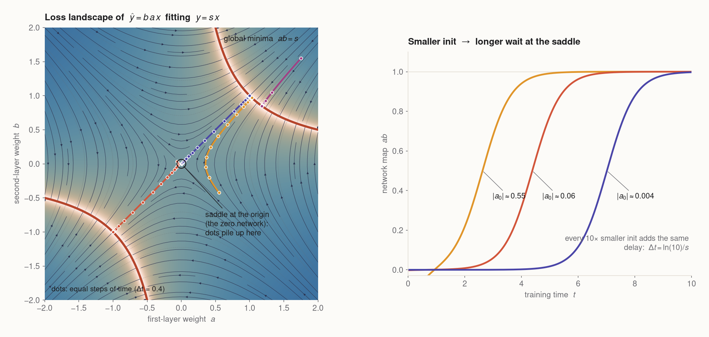
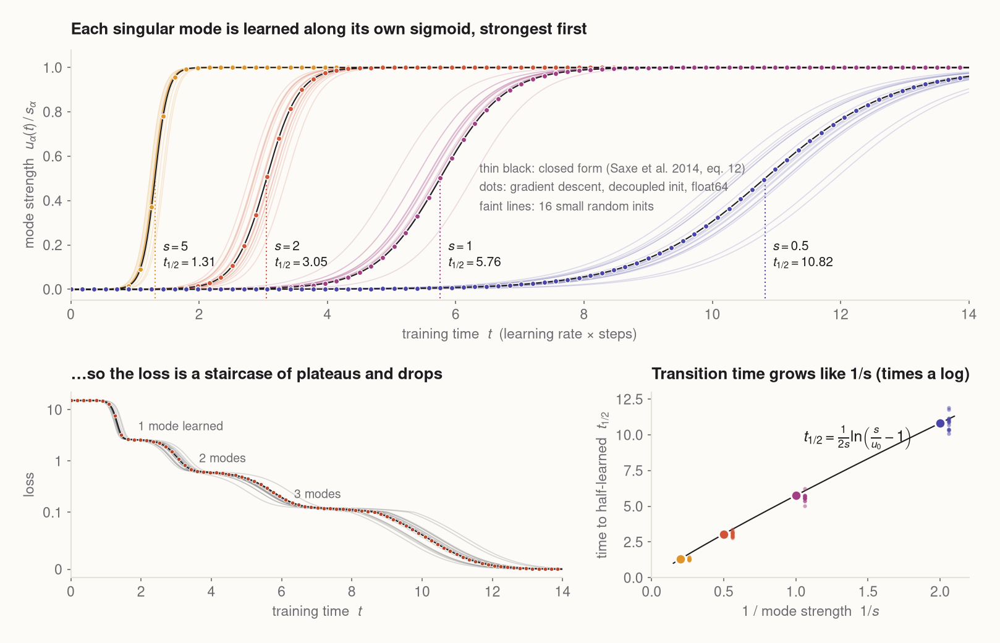
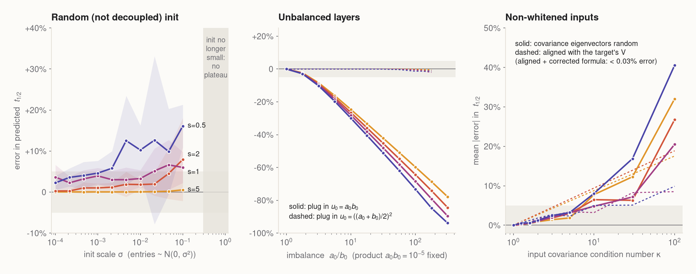
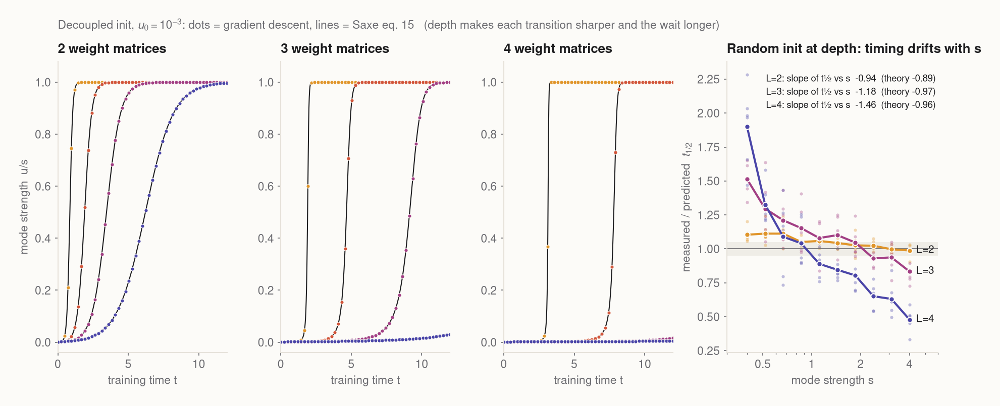
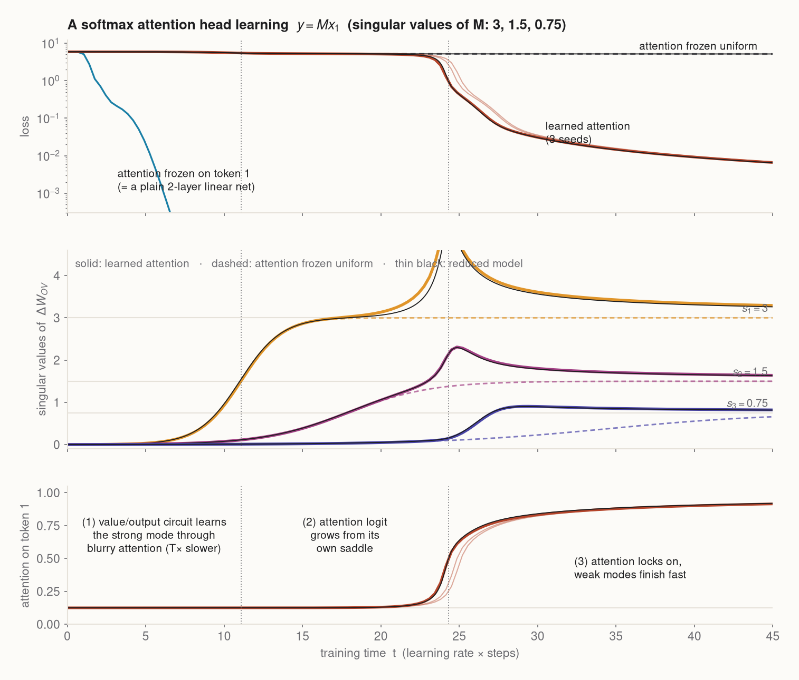
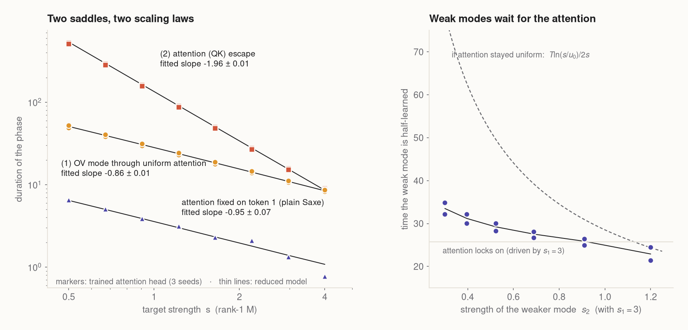

# The long wait at the saddle

<p class="subtitle">Why neural networks learn in stages: Saxe's exact solution for deep linear networks, reproduced to four decimal places, broken on purpose, and then taken to a softmax attention head.</p>

<style>
.sw-controls, .mw-controls { display: flex; flex-wrap: wrap; gap: .4rem 1.2rem; align-items: center; margin-bottom: .6rem; }
.sw-row, .mw-row { display: flex; flex-wrap: wrap; gap: 18px; align-items: flex-start; }
.sw-hint { color: #6b6b70; font-size: .8rem; margin-top: .3rem; }
.sw-table table { font-size: .8rem; margin: .5rem 0 0; }
.sw-table td, .sw-table th { padding: .15rem .45rem; }
.sw-empty { color: #6b6b70; font-size: .85rem; }
.sw-sw, .mw-key { display: inline-block; width: 14px; height: 4px; border-radius: 2px; vertical-align: middle; margin-right: 3px; }
.widget button { font: inherit; font-size: .82rem; padding: .25rem .7rem; border: 1px solid #d8d3ca; border-radius: 6px; background: #fcfbf8; cursor: pointer; }
.widget button:hover { background: #f3f0ea; }
.widget input[type=range] { width: 110px; accent-color: #b5452b; }
.widget select { font: inherit; font-size: .82rem; }
.widget canvas { display: block; }
.mw-group { display: flex; flex-wrap: wrap; gap: .3rem 1rem; }
.mw-matwrap { display: flex; gap: 12px; align-items: center; margin-top: 12px; }
.mw-matcap { font-size: .78rem; color: #6b6b70; max-width: 300px; line-height: 1.35; }
.mw-note { font-size: .78rem; color: #6b6b70; margin-top: .4rem; }
.widget-title { font-weight: 600; font-size: .95rem; margin: 0 0 .5rem; }
figure.hero { margin-top: 1.2rem; }
figure.hero video { border-radius: 10px; box-shadow: 0 18px 50px rgba(12,15,23,.28); }
.eq-note { color: #6b6b70; font-size: .92rem; }
.tag { display: inline-block; font-family: Inter, 'Helvetica Neue', Arial, sans-serif; font-size: .72rem; letter-spacing: .04em; text-transform: uppercase; padding: .1rem .45rem; border-radius: 4px; margin-right: .35rem; vertical-align: 2px; }
.tag.lit { background: #e9e4f5; color: #4a45a8; }
.tag.new { background: #f8e3d9; color: #9c3a22; }
table.nums td:nth-child(n+2), table.nums th:nth-child(n+2) { text-align: right; font-variant-numeric: tabular-nums; }
svg.diagram text { font-family: Inter, 'Helvetica Neue', Arial, sans-serif; }
</style>

<figure class="wide hero">
<video autoplay loop muted playsinline poster="figures/hero_tree_final.png" src="figures/hero_tree.mp4"></video>
<figcaption>A two-layer <em>linear</em> network learns which features eight living things have (can fly, has roots, has petals…). Left: the distances between its internal representations, drawn as a tree. Branch lengths are measured every frame; the angles are only a layout. Right: how much of each "distinction" the network has learned (coloured: measured; thin white: closed-form theory) and the loss. The network does not learn everything at once. It learns <em>living thing</em>, then <em>animal vs plant</em>, then <em>bird vs fish</em>, then <em>tree vs flower</em>, and only much later the individual items.</figcaption>
</figure>

Watch the loss in the lower right. It sits flat, drops, sits flat again, drops again. Nothing about the task changes between the drops. The data are fixed, the learning rate is fixed, and the network is as simple as networks get: two weight matrices, no nonlinearity. Yet it learns in *stages*, and the stages have meaning: coarse categories first, fine distinctions last.

Plateaus followed by sudden drops show up all over deep learning, in grokking, in the formation of induction heads, and in the "emergent" jumps of large models. This post is about the cleanest case where we can say exactly why they happen and exactly how long each plateau lasts. The answer comes from a 2014 paper by Andrew Saxe, James McClelland and Surya Ganguli, and it fits in one sentence:

> Starting from small weights, a network sits near a saddle point of the loss. Each direction in the data escapes that saddle at a rate set by its strength, so strong structure is learned first, and the wait for a structure of strength $s$ lasts about $\frac{1}{s}\log\frac{1}{\text{init}}$.

We'll build that sentence up from a single multiplication, check it against simulations until the curves agree to four decimal places, break its assumptions one at a time, and then ask whether it says anything about a transformer's attention head. (It does, with a twist: the attention head has *two* saddles, and they obey two different scaling laws.)

## 1. The smallest network with a plateau

Take the smallest "deep" network there is: one input, one hidden unit, one output, no nonlinearity. It computes $\hat y = b\,a\,x$, where $a$ is the first-layer weight and $b$ the second. We want it to learn $y = s\,x$ for some number $s$, with the squared error

$$E(a, b) = \tfrac12\,(s - ab)^2 .$$

As a function, this network is boring: it can only ever represent a line through the origin. As an *optimization problem*, it's already interesting, because the parameters enter as a product. Here is its whole loss landscape.

<figure class="wide">

<figcaption>Left: $E(a,b)$ for $s = 1$ (light = low loss). The red hyperbolas are the global minima $ab = s$: every pair whose product is right. The origin is a <b>saddle</b>. Black streamlines follow gradient flow, and faint grey hyperbolas are curves of constant $a^2 - b^2$, which gradient flow never leaves. Coloured trajectories carry a dot every 0.4 time units. Near the saddle the dots pile up, because that's where the time goes. Right: the product $ab$ over time for three starting distances. Each 10× smaller start adds the same fixed delay.</figcaption>
</figure>

Three facts about this picture explain everything that follows.

**The origin is a saddle, not a minimum.** At $a = b = 0$ the gradient is zero, but the loss curves down along the diagonal $a = b$ and up along $a = -b$. Small random weights start *near* this saddle.

**Near the saddle, weights grow exponentially, but from a tiny start.** Gradient flow here is $\dot a = b\,(s - ab)$, $\dot b = a\,(s - ab)$. While $ab \ll s$ this is linear: $\frac{d}{dt}(a+b) = s\,(a+b)$ and $\frac{d}{dt}(a-b) = -s\,(a-b)$. The "agreeing" part $a + b$ grows like $e^{st}$ while the "disagreeing" part dies out. The product therefore grows like $ab \approx u_0\, e^{2st}$, where $u_0 = \left(\frac{a_0+b_0}{2}\right)^2$ is set by the initialization. It stays negligible until $e^{2st}$ has made up for how small $u_0$ is. That takes a time of about

$$t_{\text{wait}} \approx \frac{1}{2s}\,\ln\frac{s}{u_0}.$$

This is the plateau. Its length grows with the *logarithm* of how small the init was and shrinks in proportion to the strength $s$ of the thing being learned.

**There is a conserved quantity.** The loss doesn't change if you multiply $a$ by $\lambda$ and divide $b$ by $\lambda$. By Noether's theorem that symmetry gives a conserved quantity: $\frac{d}{dt}(a^2 - b^2) = 2ab(s-ab) - 2ab(s-ab) = 0$. Trajectories slide along hyperbolas of constant $a^2 - b^2$. This is why a "balanced" start ($a_0 = b_0$) stays balanced forever. It is also why the exact solution below exists.

Try it. Click anywhere on the landscape to start gradient flow from that point. The "shrink" slider rescales your click toward the saddle, so you can compare the same direction at 1×, 10⁻²× and 10⁻⁴×.

<div class="widget wide">
<p class="widget-title">Playground: escape from the saddle</p>
<div id="saddle-widget"></div>
</div>
<script src="widgets/common.js"></script>
<script src="widgets/saddle.js"></script>

A few things to notice while you play. The column $a^2 - b^2$ never changes. The dashed prediction, which only uses the starting point, lands on the solid curve once the start is small. And every factor of 100 you shrink the init adds the same $\ln(100)/2s$ to the wait. Raise $s$ and all the waits shrink together.

The swarm below shows the same flow for 1,400 starting points at once. Most initializations slide straight to the red curve of minima. The ones that begin near the line $a = -b$, the saddle's "incoming" direction, get funnelled into the saddle, linger there, and are finally flung out along $a = b$.

<figure>
<video autoplay loop muted playsinline src="figures/landscape_swarm.mp4" style="max-width:560px;border-radius:8px"></video>
<figcaption>Gradient flow on $E(a,b)$ from 1,400 uniform random starts (RK4 integration). Colour encodes how long each start takes to converge, lighter meaning slower. The slow ones are exactly those that pass close to the saddle.</figcaption>
</figure>

## 2. From one number to a matrix: Saxe's exact solution

A real (still linear) network maps a vector $x \in \mathbb{R}^{N_1}$ through a hidden layer to $\hat y = W_2 W_1 x$. Train it with squared error. Saxe, McClelland & Ganguli (2014) showed that, under two assumptions, this matrix problem falls apart into independent copies of the scalar toy.

**Assumption 1: whitened inputs,** $\mathbb{E}[xx^\top] = I$. Then all the network sees of the data is the input–output correlation matrix $\Sigma_{yx} = \mathbb{E}[y x^\top]$. Take its singular value decomposition:

$$\Sigma_{yx} = U S V^\top = \sum_\alpha s_\alpha\, u_\alpha v_\alpha^\top .$$

Each term is a *mode*: an input pattern $v_\alpha$ that should produce an output pattern $u_\alpha$, with strength $s_\alpha$. The gradient-flow equations are
$\dot W_1 = W_2^\top(\Sigma_{yx} - W_2 W_1)$ and $\dot W_2 = (\Sigma_{yx} - W_2W_1)W_1^\top$. (Time is measured as learning rate × steps.)

**Assumption 2: a decoupled start.** Initialize the weights aligned with that SVD, $W_1 = R\,D_1 V^\top$ and $W_2 = U D_2 R^\top$ with diagonal $D$'s and any orthogonal $R$. Then each mode $\alpha$ gets its own private pair of scalars $(a_\alpha, b_\alpha)$ that obeys *exactly* the toy dynamics of §1 with $s = s_\alpha$. The modes don't interact. For a balanced start, the mode strength $u_\alpha = u_\alpha^\top W_2 W_1 v_\alpha$ obeys $\dot u = 2u(s - u)$, which integrates to

$$u_\alpha(t) = \frac{s_\alpha\, e^{2 s_\alpha t}}{e^{2 s_\alpha t} - 1 + s_\alpha/u_0},
\qquad
t_{1/2} = \frac{1}{2 s_\alpha}\ln\!\left(\frac{s_\alpha}{u_0} - 1\right).$$

<p class="eq-note">This is eq. 12 of Saxe et al. (2014), with expectations in place of the paper's sums over examples. $u_0$ is the initial strength and $t_{1/2}$ the time at which the mode is half learned.</p>

Every mode follows a sigmoid, and the sigmoids are shifted in time by $1/s_\alpha$. The loss, $\tfrac12\sum_\alpha (s_\alpha - u_\alpha)^2$ plus a constant, is therefore a staircase: one drop per mode, strongest first. Here is the prediction against gradient descent for a target with singular values 5, 2, 1 and 0.5.

<figure class="wide">

<figcaption>Top: mode strengths of an 8→8→8 linear network trained by full-batch gradient descent in float64 (learning rate $5\times10^{-5}$). Dots: decoupled init with $u_0 = 10^{-5}$. Thin black: the closed form. Faint lines: 16 small <em>random</em> Gaussian inits ($\sigma = 2\times10^{-3}$), which the theory does not strictly cover. Bottom left: the loss staircase. Bottom right: the half-learning time against $1/s$.</figcaption>
</figure>

**The match is exact, up to discretization.** With the decoupled init, the largest gap between measured and predicted mode strength, over the whole run, is $3.5\times10^{-4}\,s$ for $s = 5$ and $2.7\times10^{-5}\,s$ for $s = 0.5$. The gap shrinks in proportion to the learning rate: $5.5\times10^{-3}$ at lr $10^{-3}$, $1.1\times10^{-3}$ at $2\times10^{-4}$, and $2.7\times10^{-4}$ at $5\times10^{-5}$. So it is the difference between gradient descent and gradient flow, not a flaw in the theory. The measured half-times are 1.3124, 3.0516, 5.7566 and 10.8199, against predictions of 1.3122, 3.0515, 5.7565 and 10.8198.

**Small random inits are close, but consistently late.** For random init we plug in the balanced-equivalent strength $u_0 = \lVert (a_0 + b_0)/2\rVert^2$, read off each mode's initial weights (the growing direction from §1). The strongest mode is then predicted to within 0.02%. The weaker ones arrive 2–5% late on average (up to 14% for one seed), because a random start is not decoupled and the modes briefly compete. Saxe et al. saw the same delay (their Fig. 3).

Now it's your turn. Below, a real 6→6→6 network (or deeper) is trained by gradient flow right in your browser. Its mode strengths are the thick lines; the thin black lines are the reduced one-dimensional equations. Drag the singular values, shrink the init, add layers, or switch to a random init. Watch the matrix on the right fill in its diagonal one entry at a time.

<div class="widget wide">
<p class="widget-title">Lab: a linear network next to its theory</p>
<div id="modes-widget"></div>
</div>
<script src="widgets/modes.js"></script>

## 3. What gets learned first: a tree of concepts

Singular vectors sound abstract until you pick a dataset where they mean something. Saxe, McClelland & Ganguli (2019) used exactly the kind of data psychologists use to study how children acquire concepts: items and their properties. We build a small version with eight items (canary, robin, salmon, sunfish, oak, pine, rose, daisy) and 34 yes/no features, arranged hierarchically. *Grows* and *is alive* are shared by all; *can move*, *has roots* split animals from plants; *can fly*, *has gills*, *has bark*, *has petals* split the next level; and each item has two private features (*sings*, *has thorns*, …). Each input is a one-hot item code, scaled so the inputs are exactly white.

The SVD of this item → feature matrix *is* the hierarchy. Its singular values are 2.01 (a mode shared by all living things), 1.40 (animal vs plant), 1.12 (bird vs fish), 0.87 (tree vs flower) and 0.50, four times over (the individual items). Broad distinctions are shared by many features and many items, so they carry more variance and have larger singular values. By §2, larger singular values are learned first.

<figure class="wide">
<video autoplay loop muted playsinline poster="figures/matrix_final.png" src="figures/matrix_sharpening.mp4"></video>
<figcaption>Top: the target. Middle: what a 8→16→34 linear network (small random init, $\sigma = 10^{-3}$, float64 gradient descent) currently predicts for each item. Bottom: the target split into its SVD pieces, each drawn at the fraction the network has learned so far. The middle row is, up to small cross-terms, the sum of the bottom row. Notice the "illusory" features on the way: for a while robins are predicted to be a little bit yellow and to sing a little. At that point the network knows <em>birds</em>, not yet <em>canaries</em>.</figcaption>
</figure>

The hero animation at the top shows the same run from the inside. Saxe et al. (2019) show that with small initial weights the hidden representation of item $i$ along mode $\alpha$ grows as $\sqrt{u_\alpha(t)}\; v_{\alpha i}$, up to a rotation. The representations therefore start as one undifferentiated blob and split along one axis per mode, in order of singular value. The tree's branch lengths are the measured distances between group centroids (all items → animals → birds → canary) in the 16-dimensional hidden space.

How well does §2's formula time these splits, even though the init is random and not decoupled?

<table class="nums">
<thead><tr><th>mode</th><th>s</th><th>measured $t_{1/2}$</th><th>predicted $t_{1/2}$</th><th>error</th></tr></thead>
<tbody>
<tr><td>living thing</td><td>2.01</td><td>3.27</td><td>3.26</td><td>+0.1%</td></tr>
<tr><td>animal vs plant</td><td>1.40</td><td>4.09</td><td>4.06</td><td>+0.6%</td></tr>
<tr><td>bird vs fish</td><td>1.12</td><td>5.38</td><td>5.36</td><td>+0.4%</td></tr>
<tr><td>tree vs flower</td><td>0.87</td><td>7.36</td><td>7.10</td><td>+3.6%</td></tr>
<tr><td>individual items (4 modes)</td><td>0.50</td><td>10.7–12.8</td><td>10.6–12.0</td><td>+1.3% to +6.4%</td></tr>
</tbody>
</table>

The pattern from §2 repeats: strong modes are timed almost perfectly, and weak modes run a few percent late.

## 4. Where it breaks

The closed form needs whitened inputs, a decoupled and balanced init, small weights, and two layers. Real training violates all four. So let's violate them one at a time and measure how far the predicted half-learning time drifts. The setup is the same 8→8→8 network and target (5, 2, 1, 0.5) as before, trained in float64. The measured time for mode $k$ is when the $k$-th singular value of $W(t)$ reaches half its final value.

<figure class="wide">

<figcaption>Error of the closed-form $t_{1/2}$ when one assumption is broken (grey band: ±5%; colours are the four modes, $s$ = 5, 2, 1, 0.5). <b>Left:</b> random Gaussian init of growing scale (8 seeds each, mean ± sd), using each seed's own balanced-equivalent $u_0$. <b>Middle:</b> a decoupled init whose two layers are unbalanced by a factor $a_0/b_0$ at a fixed product. <b>Right:</b> inputs whose covariance has condition number κ (8 draws each), with $\Sigma_{yx}$ held fixed.</figcaption>
</figure>

**Random init: fine while the init is small, and weak modes suffer first.** The strongest mode stays within 0.5% of the prediction for every init scale up to σ = 0.1. The weakest mode is 2–5% late even for tiny inits, and 10–16% late (seed-to-seed spread ±10%) by σ = 0.1. A random start puts some of every mode's weights on the "wrong" hidden directions, and the modes have to push each other apart before they grow. That costs the weak, slow modes the most. Around σ ≈ 0.3 the initial map is as large as the target, so there is no saddle to wait at and no plateau to time.

**Unbalanced layers: the dynamics are fine, the formula's $u_0$ is not.** Make one layer 10× larger than the other at the same product $a_0b_0$, and learning gets 25–30% *faster* than the naive formula says (60–75% faster at 100:1). Nothing is wrong with the theory: the modes are still exactly decoupled, and integrating the 2-D flow from the true start matches to $2\times10^{-4}$. The problem is that $a_0 b_0$ is the wrong summary of the start. The linearization in §1 says what grows is $(a_0+b_0)/2$. Plugging in $u_0 = ((a_0+b_0)/2)^2$ (dashed) fixes the prediction to within 1% up to 100:1.

**Non-whitened inputs: harmless if aligned, costly if not.** If the input covariance shares eigenvectors with the target's $V$, each mode still decouples, now as $\dot u = 2u(s - \lambda u)$ with $\lambda$ the input variance along $v$. The transition *rate* is still set by $s$, and the matching formula $t_{1/2} = \ln(s/\lambda u_0 - 1)/2s$ is exact to 0.03%. The whitened formula just misses a log shift: 2–5% at κ = 3, 9–19% at κ = 100. With randomly oriented covariance, the modes couple through $\Sigma_{xx}$. The error is 2–3% at κ = 5, 5–8% at κ = 10, and 20–40% at κ = 100. In words: whitening matters, but only badly conditioned, misaligned inputs really break the stage timing.

**Depth.** With $L$ weight matrices and a balanced decoupled start, each mode obeys $\dot u = L\,u^{2-2/L}(s - u)$ (Saxe et al. 2014, eq. 15). For $L > 2$ the escape is no longer exponential but a finite-time blow-up. Transitions get sharper, and the wait scales like $u_0^{-(1-2/L)}/s$ instead of $\ln(1/u_0)/s$.

<figure class="wide">

<figcaption>Left three panels: decoupled init at depth 2, 3, 4 ($u_0 = 10^{-3}$, target 5, 2, 1, 0.5), gradient descent (dots) against the depth-$L$ mode equation (lines). Right: small random init on a 16-wide network with ten modes of strength 0.4–4 (6 seeds). We divide each measured $t_{1/2}$ by the balanced depth-$L$ prediction with the guess $u_0 = (\sigma^2 N/2)^{L/2}$. A wrong guess for $u_0$ would shift a whole curve up or down; a <em>tilt</em> means the $s$-dependence itself is off.</figcaption>
</figure>

With a decoupled start the depth-$L$ equation holds to within $4\times10^{-3}\,s$ (largest for the fastest mode at $L = 4$, again from discretization). Depth changes the *shape* of learning. At the same $u_0 = 10^{-3}$, the $s = 5$ mode takes 0.85 time units at depth 2, 1.9 at depth 3 and 3.1 at depth 4. Its 10%→90% rise shrinks from 0.44 to 0.24 to 0.16. Deeper networks wait longer, then jump harder.

From a *random* start, though, depth breaks the timing in a way two layers don't. At depth 2 the measured $t_{1/2}$ tracks the prediction to within about 10% for all ten modes (slope of $t_{1/2}$ vs $s$: −0.94 measured, −0.89 predicted). At depth 4 the strong modes arrive twice as early as predicted and the weak ones almost twice as late. The slope steepens to −1.46 against a predicted −0.96. We don't have a derivation for this. The likely culprit is that the escape time now depends on $u_0$ as a power law, $u_0^{-(1-2/L)}$, instead of a logarithm. Random, unbalanced intermediate layers, plus the reshaping of the hidden layers by modes that were already learned, then change each mode's effective $u_0$ by large factors instead of small additive shifts. Treat "stage durations ∝ 1/s" as a two-layer, small-init result, and expect deep random nets to spread their stages further apart.

## 5. Build-on: does an attention head wait at saddles too?

Everything above is about linear networks. Transformers are not linear, but their attention layers are full of *products* of weight matrices: $W_QW_K^\top$ decides where to look, and $W_OW_V$ decides what to copy. Products are what create saddles. So it's natural to ask whether an attention head also learns in stages, and whether the plateaus still scale like $1/\text{strength}$.

<span class="tag lit">literature</span> Boix-Adserà et al. (2023) proved that transformers with *diagonal* weights and small init learn through incremental rank increases of $\Delta W$, and observed similar behaviour in vision and language transformers. Zhang, Singh, Latham & Saxe (2025) solved *linear* attention trained on in-context regression. With separate key and query matrices, it shows saddle-to-saddle dynamics, learning the principal components one at a time in a time that scales as $\lambda^{-2}$.

<span class="tag new">new here</span> We take a single **softmax** attention head, with separate $W_Q, W_K, W_V, W_O$ and small random init, and give it a task that has both a "where to look" and a "what to copy" component with controllable singular values. We measure the plateaus, fit the scaling exponents, and compare everything to a small reduced model (a handful of vectors) derived in the spirit of §2.

**The task.** A sequence has $T = 8$ tokens $e_t = [x_t;\ \text{onehot}(t)]$ with random content $x_t \in \mathbb{R}^8$. At the last position, the head must output $y = M x_1$: find the first token and apply a fixed linear map to it. $M$ has singular values we choose. There is no MLP, no residual stream and no LayerNorm. Training is full-batch gradient descent (lr 0.05) on 2,048 sequences whose contents are exactly whitened.

<figure>
<svg class="diagram" viewBox="0 0 720 210" width="100%" role="img" aria-label="Diagram of the copy-and-transform attention task">
  <g font-size="13" fill="#1d1d1f">
    <text x="12" y="22" font-weight="600">before: attention is uniform</text>
    <text x="378" y="22" font-weight="600">after: attention locks onto token 1</text>
  </g>
  <g id="left">
    <g fill="#fcfbf8" stroke="#c9c3b8">
      <rect x="12" y="140" width="34" height="34" rx="6"/><rect x="54" y="140" width="34" height="34" rx="6"/><rect x="96" y="140" width="34" height="34" rx="6"/><rect x="138" y="140" width="34" height="34" rx="6"/>
      <rect x="180" y="140" width="34" height="34" rx="6"/><rect x="222" y="140" width="34" height="34" rx="6"/><rect x="264" y="140" width="34" height="34" rx="6"/><rect x="306" y="140" width="34" height="34" rx="6" stroke="#b5452b"/>
    </g>
    <g font-size="12" fill="#6b6b70" text-anchor="middle">
      <text x="29" y="162">x₁</text><text x="71" y="162">x₂</text><text x="113" y="162">x₃</text><text x="155" y="162">x₄</text><text x="197" y="162">x₅</text><text x="239" y="162">x₆</text><text x="281" y="162">x₇</text><text x="323" y="162">x₈</text>
    </g>
    <g fill="none" stroke="#b5452b" stroke-opacity="0.45" stroke-width="2">
      <path d="M323 138 Q176 40 29 138"/><path d="M323 138 Q197 55 71 138"/><path d="M323 138 Q218 70 113 138"/><path d="M323 138 Q239 85 155 138"/>
      <path d="M323 138 Q260 98 197 138"/><path d="M323 138 Q281 110 239 138"/><path d="M323 138 Q302 122 281 138"/>
    </g>
    <text x="176" y="200" font-size="12" fill="#6b6b70" text-anchor="middle">output ≈ W_OV · (average of all tokens)</text>
  </g>
  <g id="right" transform="translate(366,0)">
    <g fill="#fcfbf8" stroke="#c9c3b8">
      <rect x="12" y="140" width="34" height="34" rx="6" stroke="#b5452b" stroke-width="2"/><rect x="54" y="140" width="34" height="34" rx="6"/><rect x="96" y="140" width="34" height="34" rx="6"/><rect x="138" y="140" width="34" height="34" rx="6"/>
      <rect x="180" y="140" width="34" height="34" rx="6"/><rect x="222" y="140" width="34" height="34" rx="6"/><rect x="264" y="140" width="34" height="34" rx="6"/><rect x="306" y="140" width="34" height="34" rx="6" stroke="#b5452b"/>
    </g>
    <g font-size="12" fill="#6b6b70" text-anchor="middle">
      <text x="29" y="162">x₁</text><text x="71" y="162">x₂</text><text x="113" y="162">x₃</text><text x="155" y="162">x₄</text><text x="197" y="162">x₅</text><text x="239" y="162">x₆</text><text x="281" y="162">x₇</text><text x="323" y="162">x₈</text>
    </g>
    <path d="M323 138 Q176 30 29 138" fill="none" stroke="#b5452b" stroke-width="5"/>
    <g fill="none" stroke="#b5452b" stroke-opacity="0.12" stroke-width="1.2">
      <path d="M323 138 Q218 70 113 138"/><path d="M323 138 Q260 98 197 138"/><path d="M323 138 Q302 122 281 138"/>
    </g>
    <text x="176" y="200" font-size="12" fill="#6b6b70" text-anchor="middle">output = W_OV · x₁  →  learns M = Σ sₖ uₖ vₖᵀ</text>
  </g>
</svg>
<figcaption>The copy-and-transform task. The query at the last position must attend to token 1 (a positional "where") and push its content through $M$ (a low-rank "what").</figcaption>
</figure>

**What happens.** Here is a target with singular values 3, 1.5 and 0.75.

<figure class="wide">
<video autoplay loop muted playsinline src="figures/attention_saddles.mp4" style="border-radius:10px"></video>
<figcaption>The trained head (seed 0), replayed. Arc thickness is the measured average attention from the query to token 1; the rest is split evenly over the seven distractors. Bars show how much of each singular mode of $M$ the value/output circuit has learned (white ticks: the same run with attention frozen uniform). For a long time the attention pattern doesn't move at all. Then it snaps.</figcaption>
</figure>

Below are the same run and two controls in detail: attention frozen uniform ($W_Q = W_K = 0$), and attention frozen on token 1, which turns the head into a plain two-layer linear network.

<figure class="wide">

<figcaption>Top: loss (log scale). Middle: singular values of $\Delta W_{OV} = W_OW_V - W_OW_V(0)$. Bottom: average attention on token 1. Coloured: the trained head (bold = seed 0, faint = seeds 1–2). Dashed: attention frozen uniform. Thin black: the reduced model described below, started from <em>the same</em> random init.</figcaption>
</figure>

The training has three acts.

1. **The value/output circuit learns first, through blurry attention.** At init, attention is uniform, so the head sees the average of all eight tokens. Token 1 is in that average with weight $1/T$. The OV product is a two-layer linear network whose effective correlation is $M/T$ and whose effective input variance is $1/T$. Its modes follow Saxe's sigmoid exactly, just $T = 8$ times slower. The loss barely moves, because averaging in seven irrelevant tokens caps how good the output can be.
2. **The attention logit sits on its own saddle.** The logit that picks out token 1, $\delta = q\cdot\kappa/\sqrt{d_k}$, is *also* a product of two small vectors: a query from $W_Q$ and a key difference from $W_K$. It only receives gradient once the OV circuit carries signal, so it escapes second.
3. **Attention locks on, and everything finishes at once.** Once attention focuses, the remaining OV modes suddenly see $x_1$ at full strength and complete in a burst. The loss collapses by three orders of magnitude.

**A reduced model.** Assume the logits depend only on positions, that the seven distractor positions are symmetric, and that OV matters only through its projections $u_k = a_k\cdot b_k$ onto $M$'s singular vectors. Then, with attention $\alpha$ on token 1,

$$L = \tfrac12\sum_k \Big[s_k^2 - 2 s_k u_k\,\alpha + u_k^2\Big(\alpha^2 + \tfrac{(1-\alpha)^2}{T-1}\Big)\Big], \qquad \alpha = \frac{e^\delta}{e^\delta + T - 1},$$

and gradient flow on the vectors $a_k, b_k, q, \kappa$ closes into a small ODE system. We integrate it from the projections of the actual random init. It needs no fitted parameters, and it reproduces the trained head closely. For this target it puts the moment attention crosses 50% within 0.1–0.7% of the measurement for all three seeds, and each mode's half-learning time within 2%.

The reduced model also predicts *how the plateaus scale*. Linearize around uniform attention with a learned OV circuit ($u = s$). The logit's gradient is then $g = s^2 (T-1)/T^2$. It is quadratic in the target's strength, because the signal for "look at token 1" has to pass through a value circuit that is itself proportional to $s$. The logit escapes its saddle at a rate $\propto g$. So the reduced model predicts:

- **OV plateau** $\propto \frac{T}{s}\ln\frac{s}{u_0}$ (Saxe, slowed by $T$);
- **attention plateau** $\propto \frac{1}{s^2}$ (up to a log and constants in $T$ and $d_k$).

To test this, we train rank-1 targets with eight strengths from 0.5 to 4 (3 seeds each, plus both controls) and measure each phase separately.

<figure class="wide">

<figcaption>Left: duration of each phase against target strength, on log–log axes. Circles: time for the OV mode to reach half strength (phase 1). Squares: time from there until attention on token 1 passes 50% (phase 2). Triangles: the attention-frozen-on-token-1 control. Slopes are least-squares fits to the 24 (or 8) measured points, ± standard error. Right: a two-mode target $(3, s_2)$. The weak mode's half-learning time sits far below the "uniform attention forever" prediction (dashed), because it inherits the attention that the strong mode built.</figcaption>
</figure>

**Result.** The OV phase scales with slope $-0.86 \pm 0.01$. That is Saxe's $\ln(s/u_0)/s$, whose logarithm bends the apparent exponent up from $-1$; the frozen-attention control gives $-0.95 \pm 0.07$. The attention phase scales with slope $-1.96 \pm 0.01$. So "plateau ∝ 1/strength" survives inside a softmax attention head, *provided you identify the right strength*. For the value circuit it is $s$. For the attention pattern it is $s^2$, and the loss is set by whichever is slower. Here that is the attention phase, by a factor of 5–10 for weak targets. Across the whole sweep, the reduced model puts the attention transition within 3.5% of the trained head. It runs slightly *late* for weak targets, probably because it ignores the content-dependent part of the logits.

**Weak modes wait.** In a two-mode target, the strong mode ($s_1 = 3$) builds the attention by $t \approx 26$. A weak mode of strength 0.3 would need $t \approx 80$ with uniform attention, but it is half-learned by $t \approx 32$–35. It spends the plateau slowly accumulating at rate $2s_2/T$, then finishes at the full rate $2s_2$ once attention locks on. The reduced model tracks this too (right panel). In a head, then, stages don't just order themselves by strength. They *couple*: one saddle's escape shortens the others.

**Caveats.** This is one head and one task family ($T = 8$, $d = 8$, $d_k = d_h = 16$), with no residual stream, MLP or LayerNorm. It uses Gaussian token contents and one-hot positions, full-batch gradient descent rather than Adam, and float32 on GPU. We did not vary $T$ or $d_k$, so the $T$- and $d_k$-dependence of the attention plateau is predicted but untested. The $s^{-2}$ law is established for this setup; whether it carries over to induction heads in real language models is an open question.

## Reproduce it

Everything runs from `theory/` with the shared venv. The linear-network parts are CPU-only and take minutes; the attention sweeps took about 15 GPU-minutes on a shared GB10.

```bash
cd theory
export OMP_NUM_THREADS=4 PY=.venv/bin/python D=03-saxe-dynamics
$PY $D/test_core.py                  # closed forms + GD vs theory
$PY $D/compute_reproduce.py          # §2 toy, §3 semantic run
$PY $D/compute_breaks.py all         # §4 sweeps
for e in showcase sweep_rank1 sweep_mode3; do
  _shared/gpu_run.sh $PY $D/compute_attention.py $e
done
$PY $D/attn_reduced.py               # §5 reduced model
for r in modes landscape breaks attention; do $PY $D/render_$r.py; done
$PY $D/render_landscape.py --anim
$PY $D/render_hero.py; $PY $D/render_matrix.py; $PY $D/render_attn_anim.py
$PY _shared/render_post.py $D/post.md --shot
```
```

## References

1. A. M. Saxe, J. L. McClelland, S. Ganguli. *Exact solutions to the nonlinear dynamics of learning in deep linear neural networks.* ICLR 2014. [arXiv:1312.6120](https://arxiv.org/abs/1312.6120)
2. A. M. Saxe, J. L. McClelland, S. Ganguli. *A mathematical theory of semantic development in deep neural networks.* PNAS 116(23):11537–11546, 2019. [doi:10.1073/pnas.1820226116](https://doi.org/10.1073/pnas.1820226116)
3. P. Baldi, K. Hornik. *Neural networks and principal component analysis: learning from examples without local minima.* Neural Networks 2(1):53–58, 1989.
4. G. Gidel, F. Bach, S. Lacoste-Julien. *Implicit regularization of discrete gradient dynamics in linear neural networks.* NeurIPS 2019.
5. A. Jacot, F. Ged, B. Şimşek, C. Hongler, F. Gabriel. *Saddle-to-saddle dynamics in deep linear networks: small initialization training, symmetry, and sparsity.* 2021. [arXiv:2106.15933](https://arxiv.org/abs/2106.15933)
6. S. Pesme, N. Flammarion. *Saddle-to-saddle dynamics in diagonal linear networks.* NeurIPS 2023. [arXiv:2304.00488](https://arxiv.org/abs/2304.00488)
7. E. Boix-Adserà, E. Littwin, E. Abbe, S. Bengio, J. Susskind. *Transformers learn through gradual rank increase.* NeurIPS 2023. [arXiv:2306.07042](https://arxiv.org/abs/2306.07042)
8. Y. Zhang, A. K. Singh, P. E. Latham, A. Saxe. *Training dynamics of in-context learning in linear attention.* ICML 2025. [arXiv:2501.16265](https://arxiv.org/abs/2501.16265)
