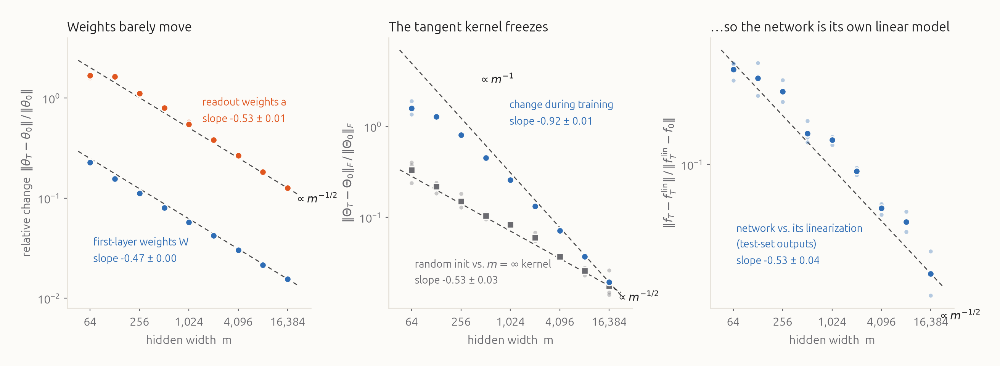
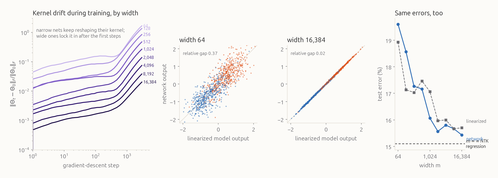
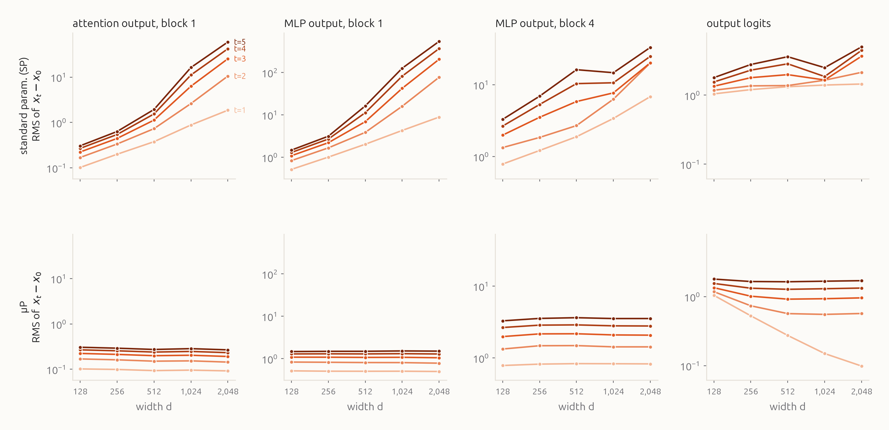

# Frozen or alive: lazy training, rich training, and μP

Make a network wide and train it the textbook way, and its hidden features stop changing: it turns into a fixed kernel machine. Scale it a little differently and it keeps learning features at every width, and as a bonus its best learning rate stops depending on width. We reproduce both results on CIFAR, a 2-D toy and a small GPT, then extend them to depth and to per-layer feature movement.

<figure class="hero wide">
<video autoplay loop muted playsinline poster="figures/hero_still.png" src="figures/hero.mp4"></video>
<figcaption>Two copies of the same network (2 inputs, 1,024 ReLU neurons, 1 output), trained by gradient descent on the same 900 points. Each faint line is one neuron: the line in the plane where its ReLU switches on. Brightness shows how steep a ramp the neuron adds to the output. Colour shows which class it pushes toward. The white curve is the decision boundary. The only difference between the two runs is the output scale α. Both fit the data. On the left the neurons never leave their random starting positions. On the right they swarm into a few dozen lines that trace polygons around the rings.</figcaption>
</figure>

Both networks above solve the same problem. Watch *how* they do it.

On the left, a thousand randomly placed lines stay exactly where they started. Their weights move by 1.4% in total. The boundary is assembled out of tiny reweightings of features that were fixed at initialization. On the right, the same lines migrate across the plane and condense into two nested polygons, one per ring boundary. The network *built* the features the task needs.

The left network is a **kernel machine** in disguise. The right network is doing what we usually mean by deep learning: **feature learning**. The field calls these the *lazy* and *rich* regimes. A few years ago, theory delivered an uncomfortable result: make a standard network wide enough and it slides into the left panel. Yet real large models plainly learn features. The resolution is that laziness isn't a law of width. It depends on how you *scale* the network as it grows: its initialization, its output multiplier, and its per-layer learning rates.

This post walks through that story with measurements:

1. **Why wide networks go lazy.** A wide network barely moves its weights, so it behaves like its own first-order Taylor expansion, a kernel method with the *neural tangent kernel*. We measure how fast this kicks in with width on CIFAR images.
2. **Laziness is a dial.** A single output scale moves any network between the two panels above, and the width limit is just one way of turning that dial.
3. **μP**, the scaling that keeps features moving at every width. We implement it in a small GPT and check it layer by layer.
4. **The practical payoff.** Under μP the best learning rate at width 128 is also the best at width 1,024. Under standard scaling it drifts.
5. **Building on it.** Does the transfer survive changes of depth? And does "rich" stay rich, layer by layer, as width grows?

## 1. A wide network is its own Taylor expansion

Write the network's output on input $x$ as $f(x;\theta)$, where $\theta$ is the vector of all its weights. Near the initialization $\theta_0$, a first-order Taylor expansion reads

$$f(x;\theta) \;\approx\; f(x;\theta_0) + \nabla_\theta f(x;\theta_0)\cdot(\theta-\theta_0).$$

The right-hand side is still a nonlinear function of the *input* $x$, but it is **linear in the weights**. The gradients $\nabla_\theta f(x;\theta_0)$ act as a fixed, enormous feature vector for each input, with one feature per weight, and training only fits a linear model on top of them.

Now run gradient descent with squared loss $\frac{1}{2n}\sum_i (f(x_i)-y_i)^2$ and learning rate $\eta$, and look at what one step does to the prediction at any input $x$:

$$f_{t+1}(x) \;=\; f_t(x) \;-\; \frac{\eta}{n}\sum_{i=1}^n \Theta(x, x_i)\,\big(f_t(x_i) - y_i\big), \qquad \Theta(x,x') = \nabla_\theta f(x)\cdot\nabla_\theta f(x').$$

Every step, each training point votes with its residual, and the vote reaches $x$ in proportion to $\Theta(x, x_i)$. The matrix $\Theta$ is the **neural tangent kernel** (NTK). For the linearized model, $\Theta$ is computed once at initialization and never changes, and the equation above is exactly kernel regression solved by gradient descent. Everything the model will ever be able to learn is fixed before training starts.

For the real network, $\Theta$ depends on $\theta$ and so it does change as the weights move. The question is by how much. Jacot, Gabriel & Hongler (2018) showed that in the **NTK parameterization**,

$$f(x) = \frac{1}{\sqrt{m}}\sum_{j=1}^{m} a_j\,\sigma(w_j\cdot x), \qquad a_j,\ w_j \sim \mathcal N(0, 1),$$

the kernel at initialization converges to a deterministic limit $\Theta_\infty$ as the width $m\to\infty$, and it *stays constant during training*. Lee et al. (2019) made the finite-width version precise: the weights, the kernel and the function all deviate from the linearized model by at most $O(1/\sqrt m)$.

Here is why, in one line. The output adds up $m$ neurons, each scaled by $1/\sqrt m$. If every neuron nudges its weights by $\delta$ in a coordinated direction, the output moves by about $m\cdot\frac{1}{\sqrt m}\cdot\delta = \sqrt m\,\delta$. To fit targets of size 1, each neuron only needs $\delta \sim 1/\sqrt m$. Its weights are themselves of size 1, so the *relative* change of every neuron goes to zero. The network gets where it needs to go by moving a little bit in very many directions at once.

### Measuring it

reproduction We train two-layer ReLU networks in the NTK parameterization on a binary CIFAR-10 task: airplane vs. automobile, 1,000 training and 1,000 test images, average-pooled to 8×8 colour (192 inputs) and normalized to unit length. Targets are ±1, and training is 3,000 steps of full-batch gradient descent at learning rate 2. Widths run from 64 to 16,384 (9 widths × 3 seeds). We compute the empirical NTK with `torch.func` and never form a Jacobian. To get kernel rows, we pull unit vectors back through the network (a VJP) and push the resulting weight-space vectors forward over all inputs (a JVP). At width 16,384 the full Jacobian would have 6.3 billion entries.

<figure class="wide">

<figcaption>Width sweep, NTK parameterization, binary CIFAR-10. Faint dots are individual seeds; solid dots are geometric means; dashed lines are slope guides anchored at the widest point. Fitted slopes use widths ≥ 512 (± standard error). <b>Left:</b> relative change of each weight matrix after training. <b>Middle:</b> relative change of the empirical NTK on the training set during training (blue), and, for comparison, how far the kernel at initialization sits from its infinite-width limit (grey). <b>Right:</b> gap between the trained network's test outputs and those of its linearization (the kernel predictor with $\Theta_0$, run for the same 3,000 steps), relative to how far the linearized outputs moved.</figcaption>
</figure>

The picture matches the theory:

- **Weights** move less and less: the first layer changes by 23% at width 64 and by 1.6% at width 16,384. The fitted exponents are $-0.47$ (first layer) and $-0.53$ (readout), against the predicted $-1/2$.
- **The network converges to its linearization.** The test outputs of the trained network and of the kernel predictor built from $\Theta_0$ differ by 35% at width 64 and by 2% at width 16,384, with exponent $-0.53 \pm 0.04$.
- **The kernel freezes, even faster than the bound.** The random kernel at initialization approaches $\Theta_\infty$ at the rate $m^{-0.53}$ you expect from averaging $m$ random neurons. But the change of the kernel *during training* falls like $m^{-0.92}$, nearly $1/m$. §6 explains why this particular network beats the worst case.

<figure class="wide">

<figcaption><b>Left:</b> relative kernel change over training, measured on a fixed 96-image subset at 40 checkpoints (geometric mean over 3 seeds). Both curves rise together late in training, when the network fits the hardest examples. The curves are near-parallel, shifted down with width. <b>Middle:</b> each dot is a test image, coloured by class. The x-axis is the output of the model linearized at initialization; the y-axis is the trained network. <b>Right:</b> test error of the network, of its linearization, and of kernel regression with the exact infinite-width NTK ($\Theta_\infty$ in closed form, same step count).</figcaption>
</figure>

At width 16,384 the network *is* its linearization, point for point on the test set. Its test error (15.5%) sits next to the infinite-width kernel's (15.1%). The narrow networks are slightly *worse*, not better. Whatever features they learn by moving their weights don't help on this task at this scale.

That's the lazy regime. If this were the whole story, the "deep" in deep learning would mean a fixed random-feature kernel, fixed at initialization. So what is different about the network in the right panel of the hero?

## 2. Laziness is a dial

TODO

## 3. μP: keeping every layer alive

The toy and the CIFAR networks were trained with plain gradient descent under hand-picked scalings. Real networks are trained with Adam, under what Yang et al. call the **standard parameterization (SP)**: initialize each weight matrix with variance $1/\text{fan-in}$ and use one global learning rate for everything. What happens to SP as you make it wider?

Take one hidden weight matrix $W \in \mathbb R^{d\times d}$ acting on a feature vector $h$ whose $d$ coordinates are each of size about 1. Two things happen to $Wh$ as $d$ grows.

- **At initialization,** $W$ is random and unrelated to $h$. The $d$ terms in each coordinate of $W_0 h$ add up like a random walk: $d$ terms of size $1/\sqrt d$ give a total of size 1. That's why variance $1/\text{fan-in}$ is the right init.
- **After an update,** things are different. The gradient of a linear layer is an outer product $\delta\,h^\top$, so the update $\Delta W$ is *aligned with the very features it multiplies*. Adam normalizes each entry of the update to roughly $\pm\eta$. Then every coordinate of $\Delta W\,h$ adds $d$ terms of size $\eta$ that all point the same way, for a total of $\eta\, d$.

So under SP with a fixed learning rate, each hidden layer's update to the features grows **linearly with width**. Double the width and the same learning rate kicks the features twice as hard. The only way to keep SP stable is to shrink the global learning rate like $1/d$. That fixes the hidden layers, but it also shrinks the updates of the embeddings, LayerNorms and readout, whose updates did *not* grow with width. Those parts of the network freeze. Yang et al. (2021, footnote 4) point out that SP with a $1/\text{width}$ learning rate does have a well-defined infinite-width limit, but it is a kernel limit: lazy again.

**The maximal update parameterization (μP)** fixes this layer by layer. Each kind of weight gets its own scaling, chosen so that every layer's update changes the features by $\Theta(1)$, no more and no less, at every width (Yang & Hu 2021; Yang et al. 2021). For Adam, it reads:

<table class="mup">
<thead><tr><th>weights</th><th>init variance</th><th>Adam learning rate</th><th>forward multiplier</th><th>why</th></tr></thead>
<tbody>
<tr><td>token & position embeddings</td><td>1 (both)</td><td>η (both)</td><td>1</td><td>fan-in is the vocabulary, which doesn't grow</td></tr>
<tr><td>hidden matrices (attention Q, K, V, O; MLP)</td><td>1/fan-in (both)</td><td>SP: η &nbsp;·&nbsp; <b>μP: η · d₀/d</b></td><td>1</td><td>aligned update adds up $d$ terms</td></tr>
<tr><td>LayerNorm gains and biases</td><td>—</td><td>η (both)</td><td>1</td><td>vectors, nothing to add up</td></tr>
<tr><td>readout (unembedding)</td><td>1/fan-in (both)</td><td>η (both)</td><td>SP: 1 &nbsp;·&nbsp; <b>μP: d₀/d</b></td><td>maps a wide vector to a fixed number of logits</td></tr>
<tr><td>attention logits</td><td>—</td><td>—</td><td>SP: $1/\sqrt{d_\text{head}}$ &nbsp;·&nbsp; <b>μP: $\sqrt{d_{\text{head},0}}/d_\text{head}$</b></td><td>trained queries and keys align, so $q\cdot k$ grows like $d_\text{head}$</td></tr>
</tbody>
</table>

Our implementation, following Table 3 of Tensor Programs V in its "output multiplier" form (their Table 8) and their Definition 4.1 for attention. We pick a base width $d_0 = 128$ at which μP and SP are literally the same network, so every difference below comes from how the two scale up.

reproduction The standard sanity check for a μP implementation is a **coordinate check**. Take a few Adam steps at a fixed learning rate at several widths, and track the typical size of each layer's activations. The quantity to watch is how much they have *changed* since initialization. Under a correct μP these curves should be flat in width.

Our testbed from here on is a small GPT: 4 pre-LayerNorm transformer blocks, 4 attention heads, MLP width $4d$, learned position embeddings and an untied readout. It is trained on TinyStories (Eldan & Li 2023), tokenized with the Qwen3 tokenizer and remapped to the 8,191 most frequent tokens plus an unknown token, which covers 99.8% of the text.

<figure class="wide">

<figcaption>Coordinate check at learning rate $2^{-8}$, widths 128–2,048, mean of 3 seeds. Each curve is the RMS coordinate of $x_t - x_0$, the change in an activation on a fixed probe batch after $t$ Adam steps, with darker curves for later steps. <b>Top (SP):</b> by step 5, the first block's MLP output has changed 350× more at width 2,048 than at width 128. <b>Bottom (μP):</b> every layer's change is independent of width. The one exception is the logits at step 1, which shrink with width. That first update to the readout comes from gradients that haven't yet lined up with the features, so it adds up like noise, and it is already flat by step 3.</figcaption>
</figure>

## 4. The payoff: one learning rate for every width

TODO

## 5. Building on it

TODO

## 6. Where it breaks

TODO

## Reproduce it

TODO

## References

TODO
