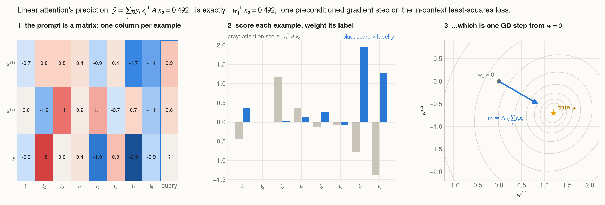
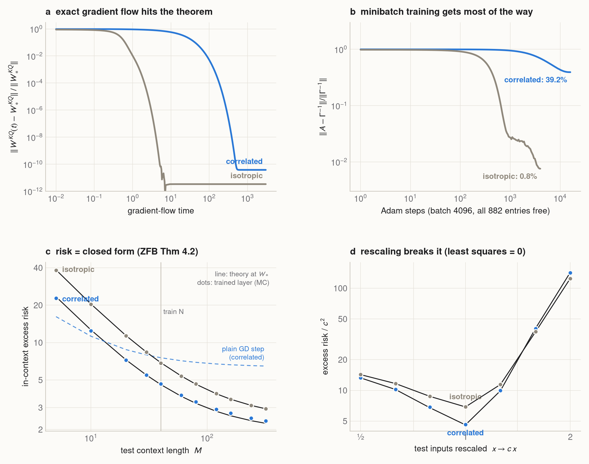
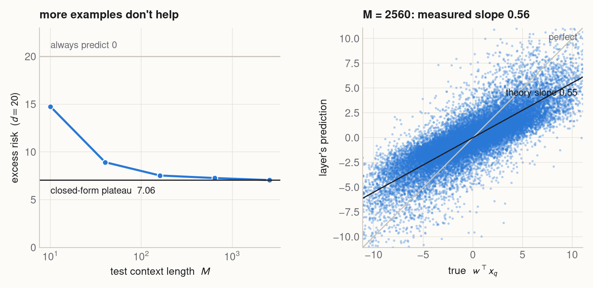
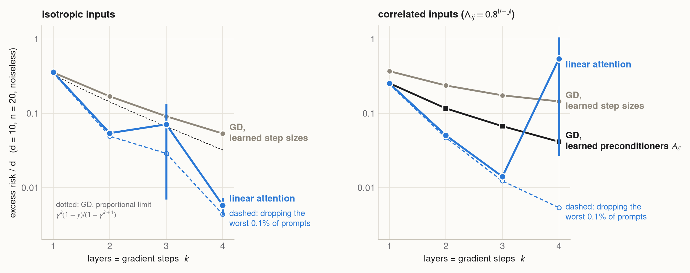
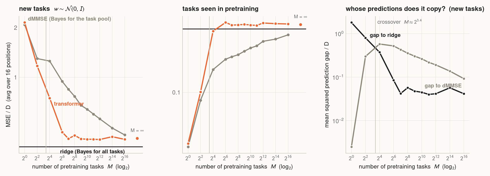
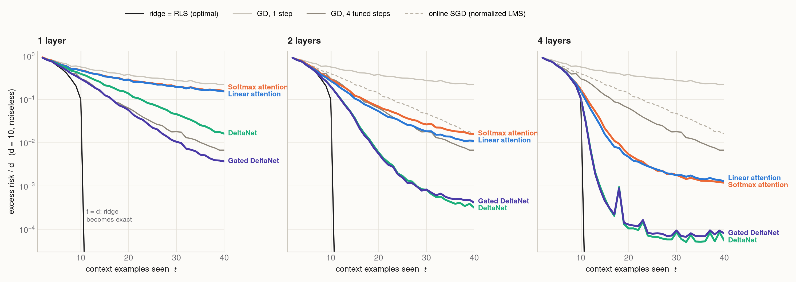
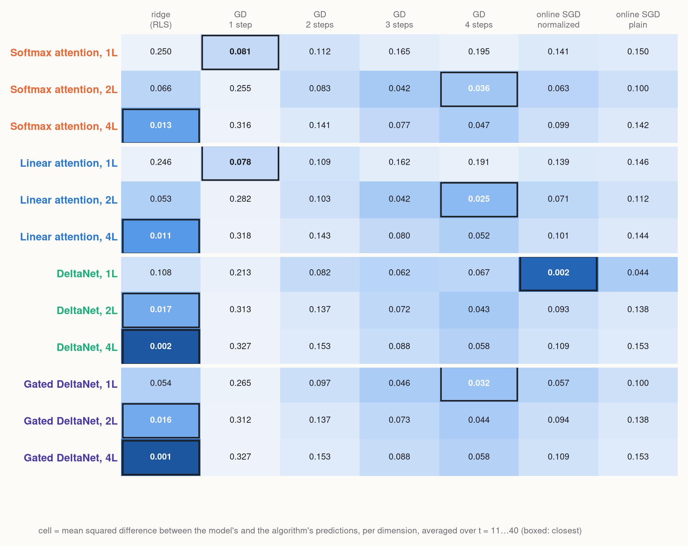
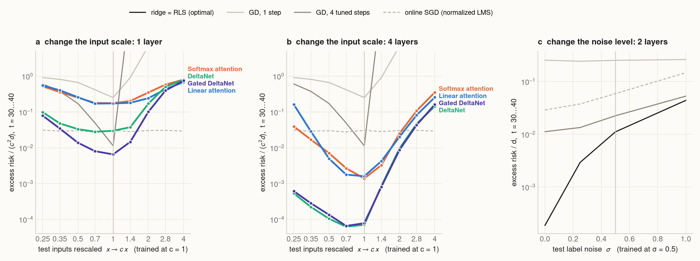

# The algorithm inside the forward pass

<p class="subtitle">What a transformer computes when it learns a regression problem from its prompt, why linear attention turns out to be gradient descent, and what DeltaNet learns instead.</p>

<style>
body { --measure: 740px; }
.hero { background: #0b0d12; border-radius: 12px; padding: 0; overflow: hidden; }
.hero video { width: 100%; display: block; }
figure.dark { background: #0b0d12; border-radius: 12px; overflow: hidden; }
figure.dark figcaption { padding: 0 1rem .8rem; color: #8b8f99; }
.kicker { font: 600 .78rem/1 Inter, "Helvetica Neue", Arial, sans-serif; letter-spacing: .08em; text-transform: uppercase; color: #b5452b; margin: 2.2rem 0 -.6rem; }
.tag { display: inline-block; font: 600 .72rem/1 Inter, "Helvetica Neue", Arial, sans-serif; padding: .25rem .45rem; border-radius: 4px; margin-right: .35rem; vertical-align: 2px; }
.tag.lit { background: #e8eef8; color: #184f95; }
.tag.new { background: #fbe7dc; color: #9c3a14; }
.callout b { font-family: Inter, "Helvetica Neue", Arial, sans-serif; }
.numbers { display: grid; grid-template-columns: repeat(3, 1fr); gap: .8rem; margin: 1.5rem 0; font-family: Inter, "Helvetica Neue", Arial, sans-serif; }
.numbers div { background: #fff; border: 1px solid #e6e2da; border-radius: 8px; padding: .7rem .9rem; }
.numbers .v { font-size: 1.45rem; font-weight: 700; color: #1d1d1f; }
.numbers .l { font-size: .8rem; color: #6b6b70; line-height: 1.35; }
/* widgets */
.dw-head button { font: 600 13px Inter, "Helvetica Neue", Arial, sans-serif; margin-right: .4rem; padding: .35rem .8rem; border: 1px solid #d8d2c6; background: #fff; border-radius: 6px; cursor: pointer; }
.dw-head button:hover { background: #f6f3ee; }
.dw-t { font: 600 13px Inter, sans-serif; color: #6b6b70; margin-left: .6rem; }
.dw-sliders { display: grid; grid-template-columns: repeat(2, 1fr); gap: .3rem 1.2rem; margin: .7rem 0; }
.dw-sliders label { display: flex; justify-content: space-between; gap: .5rem; margin: 0; }
.dw-sliders input { flex: 1; }
.dw-sliders output { width: 3em; text-align: right; font-variant-numeric: tabular-nums; }
.dw-maps { display: grid; grid-template-columns: repeat(3, 1fr); gap: 1rem; }
.dw-maps canvas { width: 100%; height: 250px; }
.dw-E { width: 100%; height: 190px; margin-top: .5rem; }
.ex-controls { display: grid; grid-template-columns: 1fr 1fr; gap: .4rem 1.2rem; margin-bottom: .4rem; }
.ex-controls label { display: flex; gap: .5rem; align-items: center; margin: 0; }
.ex-controls input { flex: 1; }
.ex-controls output { width: 2.5em; text-align: right; font-variant-numeric: tabular-nums; font-weight: 600; }
.ex-svg { width: 100%; height: auto; display: block; }
.ex-readout { color: #6b6b70; font-size: .85rem; min-height: 1.3em; }
</style>

<figure class="full hero">
<video autoplay loop muted playsinline poster="figures/hero_final.png" src="figures/hero.mp4"></video>
</figure>
<figure class="wide" style="margin-top:-1.2rem">
<figcaption>A single linear self-attention layer being trained on random linear-regression prompts. Its key–query matrix starts as random noise and flows onto the exact matrix predicted by theory. The layer has learned a <em>preconditioned gradient-descent step</em> and runs it on every prompt it reads. This is gradient flow on the exact population loss (§2), integrated in float64 with $d = 20$, $N = 40$, and inputs with correlation $\Lambda_{ij} = 0.8^{|i-j|}$.</figcaption>
</figure>

Show a transformer forty pairs $(x_1, y_1), \dots, (x_{40}, y_{40})$ from a linear function it has never seen, then a new input $x_q$, and it predicts $y_q$. No weights change and no optimizer runs. Whatever "learning" happens has to happen inside one forward pass.

So what algorithm is the forward pass running?

For most architectures that question has no crisp answer. For **linear attention** on this toy problem it does, and the answer is beautiful: the trained layer implements *gradient descent* on the prompt, with a learned preconditioner that theory predicts to many decimal places. This post rebuilds that result from scratch, watches it happen, finds where it stops being true, and then asks a question the theory doesn't answer: when the recurrence is **DeltaNet** instead of linear attention, which algorithm does the network learn?

<p class="kicker">Map</p>

1. [The game](#1-the-game-regression-inside-a-prompt): regression inside a prompt
2. [One attention layer = one gradient step](#2-one-attention-layer-one-gradient-step), with the exact theorem checked numerically
3. [Where one layer breaks](#3-where-one-layer-breaks)
4. [Depth: more layers, more steps](#4-depth-more-layers-more-steps) (interactive)
5. [How many tasks does it need?](#5-how-many-tasks-does-it-need) (the task-diversity transition)
6. [DeltaNet: the recurrence that does online SGD](#6-deltanet-the-recurrence-that-is-online-sgd) (interactive)
7. [Build-on: which algorithm does each recurrence learn?](#7-build-on-which-algorithm-does-each-recurrence-learn)
8. [What didn't match](#8-what-didnt-match)

Sections tagged <span class="tag lit">literature</span> reproduce published results; <span class="tag new">new</span> marks measurements that go beyond them. Every number here was measured on one GB10 for this post.

## 1. The game: regression inside a prompt

<span class="tag lit">literature</span> Garg, Tsipras, Liang & Valiant (2022) set up the cleanest possible test of in-context learning. Every training sequence is a fresh regression problem:

$$
w \sim \mathcal N(0, I_d), \qquad x_i \sim \mathcal N(0, \Lambda), \qquad y_i = w^\top x_i + \varepsilon_i ,
$$

and the model reads $(x_1, y_1, \dots, x_N, y_N, x_q)$ and must output $\hat y_q \approx w^\top x_q$. Because $w$ is new every time, memorizing is useless. The only way to lower the loss is to *infer* $w$ from the context. Garg et al. trained a GPT-2 on this and found its errors tracked least squares closely.

Since the task is regression, we know what the good algorithms are, and we can compare against them exactly:

- **Ridge regression / least squares.** This is Bayes-optimal here: with prior $w \sim \mathcal N(0, I)$ and noise variance $\sigma^2$, the posterior mean is ridge with penalty $\sigma^2$. Its online form is **recursive least squares (RLS)**, which updates an inverse Gram matrix one example at a time.
- **$k$ steps of gradient descent** on the in-context loss $\mathcal L(w) = \frac{1}{2N}\sum_i (y_i - w^\top x_i)^2$, starting from $w_0 = 0$.
- **Online SGD (LMS)**: one pass through the examples, nudging $w$ after each one.

Here is what those algorithms look like when they run on a prompt in two dimensions. The trained model (blue) is not a black box here: §2 shows it computes exactly this trajectory.

<figure class="wide dark">
<video autoplay loop muted playsinline poster="figures/think_poster.jpg" src="figures/think.mp4"></video>
<figcaption>Context pairs arrive one at a time ($d = 2$, correlated inputs, noise $\sigma = 0.35$). Right: each algorithm's current estimate $\hat w$ in weight space. Ellipses are level sets of the least-squares loss on the examples seen so far. Bottom: expected error over many prompts. <b style="color:#ece8df">Ridge/RLS</b> heads straight for the answer. The <b style="color:#4f9bf0">trained one-layer linear attention</b> takes one preconditioned gradient step from zero, so its estimate is a rescaled data average and stays biased while the examples are few. The <b style="color:#2fcf94">delta rule</b> (online SGD, step 0.15) zig-zags. The trajectories are exact closed forms; the risk curves are Monte Carlo over $2\times10^5$ prompts (LMS, ridge) or closed form (linear attention).</figcaption>
</figure>

## 2. One attention layer = one gradient step

<span class="tag lit">literature</span> Here is the whole trick in one picture. Stack the prompt into a matrix, one column per example, with the query's label slot set to zero. A linear attention layer (no softmax) computes, for the query column,

$$
\hat y_q \;=\; \sum_{i=1}^{N} \underbrace{\tfrac1N\, x_i^\top A\, x_q}_{\text{attention score}} \;\cdot\; \underbrace{y_i}_{\text{value}} ,
$$

where $A$ is a $d\times d$ block of the key–query weights. Now rearrange the same sum:

$$
\hat y_q = x_q^\top \Big( A \cdot \tfrac1N \textstyle\sum_i y_i x_i \Big) = x_q^\top w_1,
\qquad w_1 = w_0 - A\,\nabla \mathcal L(w_0)\big|_{w_0=0}.
$$

Since $\nabla\mathcal L(0) = -\frac1N\sum_i y_i x_i$, the vector in parentheses is **one step of gradient descent from zero, preconditioned by $A$**. Attention's "compare the query with each key, then average the values" *is* the gradient step. Von Oswald et al. (2023) gave the explicit weight construction, and Ahn et al. (2023) showed the one-layer global optimum has this form.

<figure class="wide">

<figcaption>A two-dimensional prompt with eight examples. (1) The prompt as a token matrix. (2) Linear attention scores each example against the query and weights its label. (3) The same number, read in weight space: one step from $w_0 = 0$ along the preconditioned negative gradient. The two computations agree to machine precision (printed at top).</figcaption>
</figure>

That shows linear attention *can* run gradient descent. The stronger claim is that **training finds it**, and finds a specific preconditioner. That is the theorem of Zhang, Frei & Bartlett (2024; "ZFB" below). They parameterize one layer with two $(d+1)\times(d+1)$ matrices,

$$
f(E) = E + W^{PV} E \cdot \frac{E^\top W^{KQ} E}{N},
$$

read the prediction from the bottom-right entry, and start gradient flow from a small, random, "balanced" initialization. They prove it converges to a global minimum where

$$
W^{KQ}_* \propto \begin{pmatrix} \Gamma^{-1} & 0 \\ 0 & 0\end{pmatrix},\qquad
W^{PV}_* \propto \begin{pmatrix} 0 & 0 \\ 0 & 1\end{pmatrix},\qquad
\Gamma = \Big(1 + \tfrac1N\Big)\Lambda + \tfrac{\operatorname{tr}\Lambda}{N} I_d .
$$

In words: **the learned preconditioner is $A = \Gamma^{-1}$**. When $N$ is large, $\Gamma^{-1}\to\Lambda^{-1}$, the inverse input covariance. A single step preconditioned by the inverse curvature is a Newton step, and a Newton step on a quadratic lands on the answer. For finite $N$, the extra $\frac{\operatorname{tr}\Lambda}{N} I$ acts like ridge regularization. It shrinks the step because the sample Gram matrix $\frac1N\sum x_i x_i^\top$ is itself noisy.

**Checking it.** The hero animation is gradient flow on ZFB's *exact* population loss. For this model the loss has a closed form (the expected error of a one-step preconditioned GD predictor with Gaussian inputs), which I derived, checked against ZFB's Theorem 4.2 to $10^{-10}$, and checked against 4 million Monte Carlo prompts. Integrating the flow with an adaptive ODE solver from ZFB's initialization, the weights land on $W_*$ to a relative error of $4\times10^{-11}$ for correlated inputs and $3\times10^{-12}$ for isotropic ones. The loss lands on the closed-form minimum to eight digits.

Real training uses minibatches, not the population loss. So I also trained every entry of both $21\times 21$ matrices with Adam on fresh prompts:

<figure class="wide">

<figcaption>One-layer linear self-attention ($d=20$, $N=40$). <b>(a)</b> Gradient flow on the exact population loss, started from ZFB's initialization, reaches the Theorem 4.1 weights to machine precision: $4\times10^{-11}$ for correlated inputs and $3\times10^{-12}$ for isotropic ones. <b>(b)</b> Adam on minibatches of fresh prompts, with all $2\times21^2 = 882$ entries free, measured by the distance of the effective preconditioner $A = w^{PV}_{22} W^{KQ}_{11}$ to $\Gamma^{-1}$. Isotropic inputs converge to 0.8%. Correlated inputs are still 39% away after 16,000 steps (§8). <b>(c)</b> In-context risk versus test prompt length. Lines are the closed form at $W_*$; dots are the trained layers on $2^{18}$ fresh prompts each. The dashed line is the best *plain* (scalar-step) GD step on correlated inputs: preconditioning is worth a factor 1.6 at $M=40$. <b>(d)</b> Test inputs multiplied by $c$. The error, normalized by $c^2$, explodes away from $c=1$, and again the trained layers sit on the closed form. Least squares has zero error at every $c$.</figcaption>
</figure>

The trained layers match the theory closely. At the training length $M = 40$ the isotropic layer's measured risk is 6.85 against a closed-form 6.89, a difference within Monte Carlo error. The correlated layer is at 4.65 against 4.59: it is 1.2% worse, because it has not finished converging. Across test lengths from 5 to 320 and input scales from ½ to 2, every measured point sits on its closed-form curve.

Notice two details of the theory in panel (c). First, the risk keeps falling past the training length $N = 40$ but never reaches zero. A fixed preconditioner is a one-shot estimator, so it can't converge to the truth; ZFB show the excess error has an $O(1/M)$ part and a floor of order $1/N^2$ that only more training *length* removes. Second, the trained layer is far better than a well-tuned plain GD step when inputs are correlated. Everything the layer knows about the input distribution lives in $\Gamma^{-1}$.

## 3. Where one layer breaks

<span class="tag lit">literature</span> An algorithm is more than its error on the training distribution. The quickest way to tell two algorithms apart is to change the test distribution and watch them disagree.

**Rescale the inputs.** Multiply every test input by $c$. Least squares doesn't care: it finds the same $w$. But the layer applies a *fixed* preconditioner $\Gamma^{-1}$ that was tuned to training-scale inputs, so its prediction becomes $\hat y \approx c^2\, x_q^\top w$ (ZFB §4.2). It is gradient descent with a step size that is now wrong by a factor $c^2$. The right panel above shows the closed form and the trained layer agreeing across $c\in[0.5, 2]$.

**Train on many covariances.** Can we fix that by training on prompts whose covariance is itself random? ZFB §4.3 says no. The optimum is still a single fixed matrix, $\mathbb E[\Gamma_\tau\Lambda_\tau^2]^{-1}\mathbb E[\Lambda_\tau^2]$. For diagonal covariances with Exponential(1) entries it tends to $\tfrac13 I$, so the trained layer systematically under-shoots.

<figure>

<figcaption>A layer trained on prompts whose diagonal covariance is redrawn per prompt (Exponential(1) entries, $d=20$, $N=40$). Weights from exact gradient flow, which lands on ZFB's Theorem 4.5 solution to $10^{-11}$. <b>Left:</b> more test examples do not drive the error to zero. It plateaus at $d\,(6b^2-4b+1) = 7.06$, where $b = 0.276$ is the diagonal of the learned preconditioner (1/3 in the $N\to\infty$ limit). <b>Right:</b> predictions versus the truth at $M=2560$. The least-squares slope is 0.556, against a predicted $2b = 0.552$. ZFB's "$\tfrac13$" is the average gain $\mathbb E[b\,\lambda_{\text{new}}]$; the regression slope is larger because prompts with large variance count more.</figcaption>
</figure>

A single layer can only apply one preconditioner. To adapt to each prompt's own geometry, like RLS or Newton's method do, it needs a *data-dependent* preconditioner. That takes depth, or a different recurrence.

## 4. Depth: more layers, more steps

<span class="tag lit">literature</span> Stacking linear attention layers stacks gradient steps. Ahn et al. (2023, Lemma 1) show that with a sparse weight pattern, $L$ layers compute exactly $L$ steps of preconditioned GD, one preconditioner $A_\ell$ per layer. Von Oswald et al. (2023) observed something subtler: trained deep linear attention *beats* plain GD. It also updates the inputs $x_i$ as it goes, a variant they call GD++ that approximately whitens the data with the prompt's own statistics.

How good can $k$ steps of gradient descent be? For isotropic inputs there is a clean answer in the proportional limit ($d, n\to\infty$, $\gamma = d/n$ fixed), where the eigenvalues of the sample Gram matrix follow the Marchenko–Pastur law. With step sizes tuned per step and no noise, I find numerically that the best $k$-step error is

$$
\frac{\mathbb E\,(\hat y - w^\top x_q)^2}{d} \;=\; \frac{\gamma^{k}\,(1-\gamma)}{1-\gamma^{k+1}} \qquad (\gamma < 1).
$$

It matches the optimized step sizes to all printed digits at every $(\gamma, k)$ I tried. Each extra step divides the error by roughly $1/\gamma$. So with twice as many examples as dimensions, every layer halves the error. One step gives $\gamma/(1+\gamma)$, which is the ZFB optimum in this limit.

The widget runs these formulas live (ridge and $k$-step GD, with the step sizes re-optimized in your browser at every $n$). The dots are models I trained: linear attention with dense weights and $k$ layers, and GD with $k$ learned step sizes.

<div class="widget wide" id="explorer"></div>
<script src="widgets/explorer_math.js"></script>
<script src="widgets/data_explorer.js"></script>
<script src="widgets/explorer.js"></script>

Three things show up in the depth figure below.

1. **Layers really are steps, and depth pays off geometrically.** GD with learned step sizes (gray) improves by roughly 2× per step, close to the $\gamma=\tfrac12$ formula and a little worse at finite $d=10$. So does GD with learned preconditioners on correlated inputs (black). One layer of trained linear attention lands on the one-step optimum: 0.357 against a closed-form 0.355 (isotropic), and 0.252 against 0.250 (correlated, ZFB's $\Gamma^{-1}$).
2. **Trained linear attention beats every GD variant at depth ≥ 2.** At two layers its error is 3× lower than two tuned GD steps on isotropic data, and 2.3× lower than two *preconditioned* steps on correlated data. The dense weights let each layer rewrite the $x$ tokens too, so later layers precondition with statistics of *this* prompt. This is von Oswald's GD++, a cheap relative of Newton's method. Fu et al. (2024) push this further and argue that deep transformers track iterative Newton.
3. **The mean error of deep linear attention is heavy-tailed.** A depth-$L$ network is a polynomial of degree about $3^L$ in the prompt, so a rare prompt with a few large inputs can produce an enormous error. For the 3-layer isotropic model, the mean over $2.6\times10^5$ prompts is $0.071 \pm 0.03$, while dropping the worst 0.1% gives 0.029. The 4-layer model on correlated inputs has a typical error of 0.005 but a mean dominated by a handful of prompts. GD with few steps is a polynomial too, but of lower degree, and its mean and trimmed mean differ by under 10%.

<figure class="wide">

<figcaption>Trained models at $d=10$, $n=20$, noiseless, evaluated on $2^{18}$ fresh prompts (error bars ±2 s.e.). Gray: $k$ steps of GD with learned step sizes. Black: $k$ steps with learned matrix preconditioners (Ahn et al.'s sparse parameterization, identical to their Lemma 1). Blue: linear attention with every entry of $P_\ell, Q_\ell$ trained. The solid line is the mean error; the dashed line drops the worst 0.1% of prompts. Dotted line (left): proportional-limit optimum for tuned GD; finite $d = 10$ sits slightly above it. On correlated inputs the dense models start from Ahn's sparsity pattern plus noise, because from a purely random start the one-layer model stalled at twice the optimal error (§8).</figcaption>
</figure>

## 5. How many tasks does it need?

<span class="tag lit">literature</span> Everything so far drew a fresh $w$ for every training prompt: infinitely many tasks. Real pretraining data is finite. Raventós, Paul, Chen & Ganguli (2023) asked what happens when pretraining uses only $M$ distinct task vectors $w^{(1)},\dots,w^{(M)}$, reused over and over.

Two optimal predictors compete. On the finite task pool, the Bayes-optimal estimator is **dMMSE**: a posterior-weighted average of the $M$ task vectors it has seen. It is unbeatable on those tasks and helpless on new ones. On all Gaussian tasks, the optimal estimator is **ridge**. A model that minimizes its training loss perfectly should become dMMSE. Raventós et al. found that a GPT-2 does that only below a threshold number of tasks. Above it, the network ignores the lower-loss memorizing solution and learns ridge, which generalizes to tasks it never saw.

Their setup, which I follow: $D = 8$, $K = 16$ examples per sequence, noise variance $0.25$, a GPT-2-style **softmax** transformer with interleaved $x$ and $y$ tokens and a loss at every position. Their "small" model has 4 layers, width 64, and 2 heads. They trained it for 500K steps at batch 512. I trained 13 models (one per $M$) in parallel for «STEPS» steps at batch 256, about «FRAC» of their data per model.

<figure class="wide">
<video autoplay loop muted playsinline src="figures/taskdiv_sweep.mp4"></video>
<figcaption>«CAPTION_TD_ANIM»</figcaption>
</figure>

<figure class="wide">

<figcaption>«CAPTION_TD»</figcaption>
</figure>

«TEXT_TD»

## 6. DeltaNet: the recurrence that is online SGD

<span class="tag lit">literature</span> Linear attention is also a recurrent network. Its state is a matrix $S_t$ that accumulates key–value outer products,

$$
S_t = S_{t-1} + v_t k_t^\top, \qquad o_t = S_t\, q_t .
$$

In our game, with $k_t = x_t$ and $v_t = y_t$, the state is $S_N = \sum_t y_t x_t^\top$: exactly the vector that one GD step uses. This is a **Hebbian** memory, "store the correlation". It works when keys are orthogonal. When they overlap, every lookup is contaminated by the others.

**DeltaNet** (Schlag, Irie & Schmidhuber 2021; parallelized by Yang et al. 2024) changes one thing. Before writing, it reads what the memory currently predicts for this key and writes only the *error*:

$$
S_t = S_{t-1} - \beta_t\,\big(S_{t-1}k_t - v_t\big)\,k_t^\top .
$$

That is literally one step of SGD, with learning rate $\beta_t$, on the online regression loss $\tfrac12\lVert S k_t - v_t\rVert^2$. Linear attention does gradient descent *across layers*. DeltaNet does gradient descent *across tokens*, inside a single layer. **Gated DeltaNet** (Yang, Kautz & Hatamizadeh 2025) adds a decay $\alpha_t\in(0,1)$ in front of $S_{t-1}$, which is SGD with adaptive weight decay, so the memory can forget.

The widget streams key–value pairs generated by a hidden $12\times12$ map $W$ (a Δ glyph) through both memories. Keys are unit vectors with correlated coordinates. Press play, then switch the target mid-stream.

<div class="widget wide" id="delta-widget"></div>
<script src="widgets/delta_widget.js"></script>

Things to try:

- With correlated keys, the Hebbian state converges to a blurred version, $W\Lambda$, not $W$. Averaging correlations can't undo the correlation between keys.
- DeltaNet converges to $W$ itself, because the error-correcting write effectively inverts the key covariance over time.
- Push $\beta$ past 2 and DeltaNet diverges, just as SGD does with too large a step. For unit-norm keys, the update matrix $I - \beta k k^\top$ has eigenvalue $1-\beta$.
- Switch the target. Linear attention can never forget the old map. DeltaNet overwrites it gradually, and a gate $\alpha < 1$ makes it forget faster, at the price of a noisier steady state.

<span class="tag lit">literature</span> Viewed as algorithms, the three recurrences are *memory rules*: Hebbian (one GD step), delta (one pass of LMS), gated delta (LMS with forgetting). None of them is recursive least squares, which needs a $d\times d$ inverse-covariance state. But a deep network can stack them, and each layer can transform its keys. So which algorithm does a *trained* network end up running?

## 7. Build-on: which algorithm does each recurrence learn?

<span class="tag new">new</span> **Question.** Train softmax attention, linear attention, DeltaNet, and Gated DeltaNet at matched width and depth on the same in-context regression task. Which classical algorithm does each one become: GD with a few steps, online SGD, or something closer to RLS/ridge?

**Method.** All four models share one skeleton: an input projection, $L\in\{1,2,4\}$ pre-norm blocks (token mixer + MLP), width 64, 2 heads, about 0.1M parameters per two layers. Only the token mixer changes. The prompt is $d = 10$ and $N = 40$. Each example $(x_t, y_t)$ is one token, preceded by a query token $(x_t, 0)$, so every position gives a prediction from the examples before it. Training is 8,000 Adam steps at batch 256, with noise $\sigma = 0$ (and $\sigma = 0.5$ at depth 2). The recurrences run through an exact parallel form I wrote for these tiny sizes; that form agrees with a step-by-step reference to $10^{-16}$ and with the flash-linear-attention kernels to $3\times10^{-4}$ in fp32 (`test_seqmodels.py`). Linear attention divides its readout by $t$ (a causal mean), matching the $1/N$ in the theory. DeltaNet L2-normalizes $q$ and $k$ and uses a sigmoid $\beta_t$, as in Yang et al. (2024).

The baselines on the same prompts are ridge (= RLS); GD with 1–4 steps, step sizes tuned separately for every context length $t$; and online SGD with a tuned step, both plain and with normalized keys (which is exactly a one-head DeltaNet reading raw $x$).

<figure class="wide">

<figcaption>Excess risk (per dimension) after seeing $t$ examples, for $d=10$ and noiseless prompts. One model per curve, averaged over 4,096 fresh prompts. Neutral lines are the classical algorithms on the same prompts. GD is re-tuned separately for every $t$, which is an advantage no fixed network has. Ridge is exactly zero once $t \ge d$. The spikes in the 4-layer DeltaNet curves come from a few hard prompts in the shared evaluation set.</figcaption>
</figure>

**Result 1: at matched depth, the delta rule wins by one to two orders of magnitude.** With one layer, softmax and linear attention reach an error of 0.15 at $t = 40$. That is better than a single tuned GD step (0.22) but nowhere near least squares. DeltaNet reaches 0.016 and Gated DeltaNet 0.004. With two layers, the attention models reach 0.011–0.016, about as good as four *oracle-tuned* GD steps (0.007). Both delta-rule models reach $3$–$4\times10^{-4}$, 30–50× lower. With four layers, attention gets to $1.2\times10^{-3}$ and the delta-rule models to $5$–$8\times10^{-5}$.

Softmax and linear attention are nearly indistinguishable at every depth, even though only one of them has a clean GD interpretation. Softmax normalization turns out not to matter much here; the error-correcting write in DeltaNet does.

<figure class="wide">

<figcaption>How close is each trained model's prediction to each algorithm's prediction on the same prompts? Each cell is the mean squared difference per dimension, averaged over $t = 11\dots40$; the box marks the closest algorithm. Caveat: a model that is simply very good sits close to ridge by default, so read the ridge column as "good", and the other columns as "specifically like this algorithm".</figcaption>
</figure>

**Result 2: one layer of DeltaNet has learned exactly online SGD.** Its predictions differ from normalized LMS, run with a step size I tuned independently ($\beta^\star = 0.96$), by only 0.002 per dimension, and its risk curve lies on top of LMS's (0.0161 vs 0.0161 at $t=40$). Opening the model up confirms it. One head writes with $\beta \approx 0.95$ on example tokens and a much smaller $\beta \approx 0.2$ on query tokens, which contain no label and would only pollute the memory. The trained network rediscovered the Kaczmarz/NLMS algorithm, step size included.

One-layer attention models sit closest to one GD step, as the theory says, though the MLP and second head make them better than a single step. Gated DeltaNet at one layer is not LMS: it is closer to 4 GD steps and better than both. With two or more layers every delta-rule model is closest to ridge, and far closer to it than attention is.

Gates also turn out to be used, but not for forgetting examples. In the deeper Gated DeltaNets, one head in the first layers learns a decay $\alpha \approx 0.01$–$0.4$, a memory that lasts only a token or two, while the other head keeps $\alpha \approx 1$. It looks like the network builds itself a local "previous token" channel next to the long-term regression memory.

<figure class="wide">

<figcaption>Changing the test distribution. <b>(a, b)</b> Inputs multiplied by $c$ (noiseless; error normalized by $c^2$ and averaged over $t=30\dots40$). Ridge/least squares is exactly 0 at every scale (not shown). Normalized LMS (dashed) is scale-invariant by construction. GD with fixed tuned steps diverges for $c > 1$. <b>(c)</b> Models trained with label noise $\sigma = 0.5$, tested at other noise levels; neutral lines are the algorithms tuned for $\sigma = 0.5$.</figcaption>
</figure>

«TEXT_SHIFT»

<div class="callout">
«CALLOUT_FINDING»
</div>

## 8. What didn't match

Honest accounting of where measurement and theory parted ways, or where I had to change the setup to get a clean result.

**Minibatch training is much slower than the theorem suggests on correlated inputs.** Gradient flow on the exact population loss converges for both covariances, but look at the time axis of panel (a) in §2: isotropic inputs converge by $t\approx 7$, correlated ones only by $t \approx 500$. The directions of $\Gamma^{-1}$ tied to small eigenvalues of $\Lambda$ (down to 0.11 here) are learned last; the hero animation shows the smooth, large-eigenvalue part of the matrix appearing first. With Adam at batch 4096, the correlated layer is still 39% from $\Gamma^{-1}$ after 16,000 steps, even though its risk is within 1.2% of the optimum. The loss is flat in exactly the directions that are slow. Plain SGD at learning rates that finish in reasonable time diverged outright, because the loss is quartic in the inputs and minibatch gradients are heavy-tailed. All the matrix-level matches in §2 therefore come from the exact flow, and the risk-level matches come from Adam.

**The theorem needs its initialization.** ZFB's convergence proof assumes a specific balanced initialization. With deep linear attention on correlated inputs and a generic small random initialization, the one-layer model stalled at an error of 0.50 per dimension, twice the optimum of 0.25, after 6,000 steps. I switched to Ahn et al.'s sparsity pattern plus noise on every entry, which then trained cleanly.

**Averages hide heavy tails.** Deep linear attention is a high-degree polynomial of its input. The mean error of the 4-layer correlated model is about 100× its error with the worst 0.1% of prompts removed, and its standard error is as large as the mean. Training on minibatches never sees those prompts, so the training loss looked fine. Any claim of the form "depth-$L$ attention reaches error $\epsilon$" should say which average it means.

**The proportional limit is only approximate at $d = 10$.** Two tuned GD steps measured 0.169 per dimension against a limit of 0.143 at $\gamma = \tfrac12$. The formula gets the trend right, and finite dimension adds roughly 20% at these sizes.

«BREAK_TD»

**The build-on experiment is small.** It uses one seed per configuration, 8,000 training steps, width 64, and $d=10$. Differences within a factor of 1.5 (for example DeltaNet vs Gated DeltaNet at 2 and 4 layers) should not be read as real. The prompt format also matters: I give each architecture the pair $(x_t, y_t)$ in a single token, so no model has to learn to bind $x$ to $y$ across tokens. Garg et al. and Raventós et al. interleave $x$ and $y$ tokens, which favours architectures that can move information between neighbouring positions. DeltaNet's L2-normalized keys make it natively NLMS rather than LMS. That probably helps it here and is part of what is being compared, not a neutral detail.

## Reproduce it

Everything runs from `theory/08-icl-linear-attention/` with the theory venv (`../.venv/bin/python`). GPU jobs go through the shared slot limiter.

```bash
python test_core.py && python test_seqmodels.py        # closed forms, kernels, delta rule == LMS
python lsa_gradflow.py --cov ar1 --nsnap 720            # exact gradient flow (also: --cov iso, --cov randexp)
../_shared/gpu_run.sh python train_lsa1.py --cov iso --steps 4000 --batch 4096
../_shared/gpu_run.sh python train_lsa1.py --cov ar1 --steps 16000 --batch 4096
python eval_lsa1.py                                     # risk vs M, covariate scaling, random covariances
python train_lsa_deep.py --covs iso --kinds gd,dense --steps 6000 --out iso
python train_lsa_deep.py --covs ar1 --kinds gd,pgd,dense --steps 6000 --init struct --out ar1
../_shared/gpu_run.sh python taskdiv.py --logM 0,2,4,6,7,8,9,10,11,12,14,16,inf --batch 256 --steps 15000 --eval_every 2500 --tag main
../_shared/gpu_run.sh ./run_seq_grid.sh "softmax linear delta gdelta"
python analysis_seq.py
python render_hero.py && python render_think.py && python render_mechanism.py && python render_repro.py \
  && python render_taskdiv.py && python render_seq.py && python build_widget_data.py
python ../_shared/render_post.py post.md --shot
```

## References

- Garg, Tsipras, Liang & Valiant. *What Can Transformers Learn In-Context? A Case Study of Simple Function Classes.* NeurIPS 2022. [arXiv:2208.01066](https://arxiv.org/abs/2208.01066)
- von Oswald, Niklasson, Randazzo, Sacramento, Mordvintsev, Zhmoginov & Vladymyrov. *Transformers Learn In-Context by Gradient Descent.* ICML 2023. [arXiv:2212.07677](https://arxiv.org/abs/2212.07677)
- Ahn, Cheng, Daneshmand & Sra. *Transformers learn to implement preconditioned gradient descent for in-context learning.* NeurIPS 2023. [arXiv:2306.00297](https://arxiv.org/abs/2306.00297)
- Zhang, Frei & Bartlett. *Trained Transformers Learn Linear Models In-Context.* JMLR 25(49), 2024. [arXiv:2306.09927](https://arxiv.org/abs/2306.09927)
- Akyürek, Schuurmans, Andreas, Ma & Zhou. *What learning algorithm is in-context learning? Investigations with linear models.* ICLR 2023. [arXiv:2211.15661](https://arxiv.org/abs/2211.15661)
- Raventós, Paul, Chen & Ganguli. *Pretraining task diversity and the emergence of non-Bayesian in-context learning for regression.* NeurIPS 2023. [arXiv:2306.15063](https://arxiv.org/abs/2306.15063)
- Fu, Chen, Jia & Sharan. *Transformers Learn to Achieve Second-Order Convergence Rates for In-Context Linear Regression.* NeurIPS 2024. [arXiv:2310.17086](https://arxiv.org/abs/2310.17086)
- Schlag, Irie & Schmidhuber. *Linear Transformers Are Secretly Fast Weight Programmers.* ICML 2021. [arXiv:2102.11174](https://arxiv.org/abs/2102.11174)
- Yang, Wang, Zhang, Shen & Kim. *Parallelizing Linear Transformers with the Delta Rule over Sequence Length.* NeurIPS 2024. [arXiv:2406.06484](https://arxiv.org/abs/2406.06484)
- Yang, Kautz & Hatamizadeh. *Gated Delta Networks: Improving Mamba2 with Delta Rule.* ICLR 2025. [arXiv:2412.06464](https://arxiv.org/abs/2412.06464)
